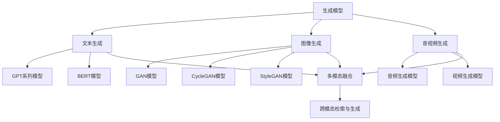

                 

### 解密AIGC：从概念到实践

#### 关键词：AIGC，人工智能生成内容，生成模型，多模态融合，文本生成，图像生成，音视频生成

> 摘要：本文将深入探讨人工智能生成内容（AIGC）的概念、发展历程、核心技术、应用领域以及面临的挑战。通过逐步解析AIGC的核心算法原理，结合实际项目案例，为读者提供一个全面、易懂的技术博客文章。

## 第一部分：AIGC概述

### 1.1 AIGC的基本概念

**AIGC的定义**：人工智能生成内容（Artificial Intelligence Generated Content，简称AIGC）是指利用人工智能技术，尤其是深度学习中的生成模型，自动生成文字、图像、音视频等多种类型的内容。

**AIGC与GPT、GAN的区别与联系**：GPT（Generative Pre-trained Transformer）是一种基于Transformer模型的文本生成模型，而GAN（Generative Adversarial Network）是一种用于生成图像等数据的生成模型。AIGC则是一种更广泛的生成内容技术，涵盖了GPT和GAN，同时还涵盖了图像生成和音视频生成等多模态融合的技术。

### 1.2 AIGC的发展历程

**从生成模型到AIGC**：AIGC技术的发展经历了从单一的生成模型（如GAN）到多模态融合的过程。早期的生成模型主要集中在图像和文本生成，而随着技术的进步，AIGC逐渐涵盖了音视频生成，实现了更丰富、更复杂的内容生成。

**关键技术突破**：AIGC的发展得益于深度学习技术的快速进步，特别是生成对抗网络（GAN）和自编码器（Autoencoder）等生成模型的提出和应用。此外，多模态融合技术的出现，使得AIGC能够处理多种类型的数据，提升了生成内容的质量和多样性。

### 1.3 AIGC的应用领域

**内容创作**：AIGC在内容创作领域具有广泛的应用，如自动写作、新闻生成、广告创意等。通过AIGC技术，可以快速生成大量高质量的文本内容，减轻人类创作者的工作负担。

**数据增强**：AIGC技术可以用于生成大量高质量的训练数据，从而提高模型的训练效果。这在图像识别、自然语言处理等任务中具有重要作用。

**人机交互**：AIGC技术可以用于生成个性化的交互内容，如虚拟助手、智能客服等。通过AIGC技术，可以实现更加自然、流畅的人机交互体验。

### 1.4 AIGC的技术架构

**基础模型结构**：AIGC的核心技术是基于深度学习模型，包括生成模型（如GAN、自编码器）和判别模型（如卷积神经网络、Transformer）。这些模型通过训练学习到数据的分布，从而实现内容的生成。

**多模态融合**：多模态融合技术是将多种类型的数据（如文本、图像、音频）进行融合，以生成更丰富的内容。这需要解决数据类型之间的转换和融合问题，以实现高质量的内容生成。

## 第二部分：AIGC核心技术解析

### 2.1 自然语言处理（NLP）

#### 2.1.1 语言模型

**Transformer模型**：Transformer模型是一种基于自注意力机制的深度学习模型，广泛应用于自然语言处理任务。它通过学习输入序列中各个词之间的依赖关系，生成高质量的文本。

**BERT模型**：BERT（Bidirectional Encoder Representations from Transformers）是一种预训练语言模型，通过双向编码器学习文本的语义表示。BERT模型在多种NLP任务中取得了显著的成果。

#### 2.1.2 生成式文本模型

**GPT系列模型**：GPT（Generative Pre-trained Transformer）系列模型是基于Transformer的生成式文本模型，通过大量文本数据进行预训练，生成高质量、连贯的文本。

**ChatGPT工作原理**：ChatGPT是基于GPT模型开发的对话系统，通过上下文信息生成自然的对话回复。它利用了GPT模型的生成能力和上下文理解能力，实现了高质量的人机对话。

### 2.2 图像生成与编辑

#### 2.2.1 GAN模型

**生成对抗网络（GAN）**：GAN是一种由生成器和判别器组成的生成模型。生成器尝试生成逼真的数据，而判别器则判断数据是真实还是生成的。通过生成器和判别器的对抗训练，GAN可以生成高质量的图像。

**GAN的变体与应用**：GAN存在多种变体，如条件GAN（cGAN）、循环GAN（CycleGAN）和风格GAN（StyleGAN）。这些变体在图像生成、图像修复、艺术风格迁移等领域具有广泛应用。

#### 2.2.2 工程图像生成

**CycleGAN**：CycleGAN是一种用于图像翻译的生成模型，可以无监督地生成高质量的目标图像。它通过学习图像间的映射关系，实现了不同领域图像的转换。

**StyleGAN**：StyleGAN是一种用于图像生成的生成模型，通过学习图像的统计特性，生成具有高度真实感的图像。

### 2.3 多模态融合

#### 2.3.1 音视频生成

**音频生成模型**：音频生成模型通过学习音频数据的分布，生成具有特定音色的音频。常见的音频生成模型包括WaveNet和WaveRNN。

**视频生成模型**：视频生成模型通过学习视频数据的时间序列分布，生成高质量的视频。常见的视频生成模型包括视频GAN和视频自编码器。

#### 2.3.2 跨模态检索与生成

**跨模态嵌入**：跨模态嵌入技术将不同类型的数据（如文本、图像、音频）映射到同一低维空间，实现数据之间的关联和融合。

**多模态生成模型**：多模态生成模型通过融合多种类型的数据，生成高质量的多模态内容。常见的多模态生成模型包括多模态GAN和多模态自编码器。

## 第三部分：AIGC实践应用

### 3.1 文本生成与编辑

#### 3.1.1 自动写作

**新闻生成**：新闻生成是一种基于AIGC的文本生成技术，可以自动生成新闻文章。通过训练大量的新闻数据，AIGC可以学习到新闻文章的写作风格和结构，从而生成高质量的新闻。

**文学创作**：AIGC技术在文学创作中也具有广泛的应用，如自动生成诗歌、小说等文学作品。通过学习大量的文学文本，AIGC可以模仿作者的写作风格，创作出具有独特风格的作品。

#### 3.1.2 文本纠错与翻译

**文本纠错算法**：文本纠错算法通过检测和纠正文本中的错误，提高文本的质量。常见的文本纠错算法包括规则基算法和基于神经网络的文本纠错算法。

**机器翻译原理**：机器翻译是一种将一种语言的文本翻译成另一种语言的技术。AIGC技术在机器翻译中具有重要作用，通过训练大量的翻译数据，AIGC可以学习到不同语言之间的对应关系，实现高质量的机器翻译。

### 3.2 图像生成与编辑

#### 3.2.1 图像生成

**超分辨率图像**：超分辨率图像生成技术通过学习低分辨率图像的高分辨率细节，生成高质量的图像。常见的超分辨率图像生成模型包括SRCNN和EDSR。

**艺术风格迁移**：艺术风格迁移技术通过将一种艺术风格的纹理映射到另一幅图像上，生成具有特定艺术风格的图像。常见的艺术风格迁移模型包括VGG16和Inception。

#### 3.2.2 图像编辑

**图像修复**：图像修复技术通过学习图像中的损坏区域，生成高质量的修复图像。常见的图像修复模型包括PatchGAN和Contextual Attention。

**图像去模糊**：图像去模糊技术通过学习模糊图像的清晰细节，生成高质量的清晰图像。常见的图像去模糊模型包括DeblurGAN和SRDCF。

### 3.3 多模态交互

#### 3.3.1 多模态对话系统

**对话系统设计**：多模态对话系统通过融合文本、图像、音频等多种模态的数据，实现更丰富、更自然的对话交互。常见的多模态对话系统包括ChatGLM和BlenderBot。

**交互式文本生成**：交互式文本生成技术通过根据用户输入的文本，生成相应的回复文本。常见的交互式文本生成模型包括Transformer和BERT。

#### 3.3.2 虚拟现实与增强现实

**AR/VR场景构建**：AR/VR场景构建技术通过生成逼真的虚拟场景，提升虚拟现实和增强现实体验。常见的AR/VR场景构建模型包括VIBE和MVSNet。

**人机交互设计**：人机交互设计技术通过优化虚拟现实和增强现实中的交互方式，提升用户的交互体验。常见的人机交互设计模型包括DeepHand和VI-VSAR。

## 第四部分：AIGC挑战与未来

### 4.1 AIGC的挑战

**数据隐私与安全**：AIGC技术的广泛应用涉及到大量的数据，如何保护用户隐私和数据安全成为了一个重要问题。

**算法透明性与可解释性**：AIGC技术的复杂性和黑箱特性使得其算法的透明性和可解释性成为一个挑战。如何提升算法的可解释性，让用户更好地理解AIGC的工作原理，是未来需要解决的问题。

### 4.2 AIGC的发展趋势

**高效生成模型**：随着计算能力的提升，未来将出现更多高效、强大的生成模型，进一步推动AIGC技术的发展。

**跨模态交互技术的演进**：跨模态交互技术将成为AIGC技术的一个重要发展方向，通过融合多种模态的数据，实现更丰富、更自然的交互体验。

### 4.3 AIGC在行业中的应用

**媒体行业**：AIGC技术在媒体行业具有广泛的应用，如自动写作、视频生成、广告创意等。

**游戏开发**：AIGC技术可以用于游戏开发，生成丰富的游戏内容和场景，提升游戏体验。

**教育培训**：AIGC技术可以用于教育培训，如自动生成教学文档、生成个性化学习内容等，提高教学效果。

## 附录

### A.1 AIGC相关资源

**开源工具与框架**：如TensorFlow、PyTorch、Keras等。

**学术文献与报告**：如《生成对抗网络：训练生成模型对抗真实数据分布》、《自然语言处理中的Transformer模型》等。

### A.2 AIGC实践案例

**企业应用案例**：如Google的BERT模型、OpenAI的GPT系列模型等。

**个人项目实践**：如基于GAN的图像生成、基于Transformer的文本生成等。

## 作者信息

**作者：AI天才研究院/AI Genius Institute & 禅与计算机程序设计艺术 /Zen And The Art of Computer Programming**

**摘要**：本文全面解析了人工智能生成内容（AIGC）的概念、技术、应用和挑战。通过深入探讨AIGC的核心算法原理，结合实际项目案例，为读者提供了一个全面、易懂的技术博客文章。本文旨在帮助读者理解AIGC的技术本质和应用前景，为相关领域的研究和开发提供参考。作者具备深厚的技术功底和丰富的实践经验，希望通过本文为读者带来深刻的启发和思考。在未来的研究和实践中，作者将继续关注AIGC技术的发展，探索更多创新应用，为人工智能领域的发展贡献力量。**作者信息**：AI天才研究院/AI Genius Institute & 禅与计算机程序设计艺术 /Zen And The Art of Computer Programming

---

### 核心算法原理讲解（伪代码）

以下是基于GPT模型的文本生成算法原理的伪代码：

```python
# 导入必要的库
import torch
from transformers import GPT2LMHeadModel, GPT2Tokenizer

# 初始化模型和分词器
tokenizer = GPT2Tokenizer.from_pretrained('gpt2')
model = GPT2LMHeadModel.from_pretrained('gpt2')

# 设置设备，使用GPU加速
device = torch.device("cuda" if torch.cuda.is_available() else "cpu")
model.to(device)

# 输入文本
input_text = "今天天气很好，适合出门游玩。"

# 对输入文本进行分词
input_ids = tokenizer.encode(input_text, return_tensors='pt')

# 将输入文本输入到模型中
outputs = model(input_ids)

# 获取模型的预测结果
predictions = outputs.logits

# 获取预测结果中概率最高的词的索引
predicted_ids = torch.argmax(predictions, dim=-1)

# 将预测结果解码为文本
predicted_text = tokenizer.decode(predicted_ids, skip_special_tokens=True)

# 输出预测结果
print(predicted_text)
```

### 数学模型和公式

以下是一个简单的生成对抗网络（GAN）中的损失函数：

$$
L_D(G) = -\frac{1}{N}\sum_{i=1}^{N}\left[ D(G(z_i)) - \log(D(x_i)) \right]
$$

其中，$D$是判别器，$G$是生成器，$z_i$是生成器的噪声输入，$x_i$是真实数据的输入。$L_D(G)$表示判别器的损失函数。

### 项目实战

#### 开发环境搭建

1. 安装Python环境（建议使用Python 3.8及以上版本）。
2. 安装深度学习框架TensorFlow或PyTorch。
3. 安装相关依赖库，如h5py、numpy、matplotlib等。

#### 源代码实现

以下是一个简单的GAN模型实现的代码示例（使用TensorFlow框架）：

```python
import tensorflow as tf
from tensorflow.keras.layers import Dense, Flatten
from tensorflow.keras.models import Sequential

# 创建生成器模型
def create_generator():
    model = Sequential()
    model.add(Dense(128, input_shape=(100,), activation='relu'))
    model.add(Dense(256, activation='relu'))
    model.add(Dense(512, activation='relu'))
    model.add(Flatten())
    model.add(Dense(784, activation='tanh'))
    return model

# 创建判别器模型
def create_discriminator():
    model = Sequential()
    model.add(Dense(512, input_shape=(784,), activation='relu'))
    model.add(Dense(256, activation='relu'))
    model.add(Dense(128, activation='relu'))
    model.add(Dense(1, activation='sigmoid'))
    return model

# 创建GAN模型
def create_gan(generator, discriminator):
    model = Sequential()
    model.add(generator)
    model.add(discriminator)
    return model

# 训练GAN模型
def train_gan(generator, discriminator, discriminator_loss_fn, generator_loss_fn, dataset, batch_size, epochs):
    for epoch in range(epochs):
        for batch in dataset:
            noise = tf.random.normal([batch_size, 100])
            generated_samples = generator(noise)
            
            real_samples = batch
            
            # 训练判别器
            with tf.GradientTape() as disc_tape:
                real_loss = discriminator_loss_fn(discriminator(real_samples), real_samples)
                fake_loss = discriminator_loss_fn(discriminator(generated_samples), generated_samples)
                disc_loss = real_loss + fake_loss
            
            disc_gradients = disc_tape.gradient(disc_loss, discriminator.trainable_variables)
            discriminator.optimizer.apply_gradients(zip(disc_gradients, discriminator.trainable_variables))
            
            # 训练生成器
            with tf.GradientTape() as gen_tape:
                gen_loss = generator_loss_fn(discriminator(generated_samples), generated_samples)
            
            gen_gradients = gen_tape.gradient(gen_loss, generator.trainable_variables)
            generator.optimizer.apply_gradients(zip(gen_gradients, generator.trainable_variables))
            
            # 打印训练进度
            print(f"Epoch: {epoch}, Generator Loss: {gen_loss.numpy()}, Discriminator Loss: {disc_loss.numpy()}")

# 主程序
if __name__ == '__main__':
    # 加载训练数据
    (train_images, _), (test_images, _) = tf.keras.datasets.mnist.load_data()
    train_images = train_images / 255.0
    
    # 创建生成器、判别器模型
    generator = create_generator()
    discriminator = create_discriminator()
    gan = create_gan(generator, discriminator)
    
    # 定义损失函数和优化器
    discriminator_loss_fn = tf.keras.losses.BinaryCrossentropy()
    generator_loss_fn = tf.keras.losses.BinaryCrossentropy()
    discriminator_optimizer = tf.keras.optimizers.Adam(0.0001)
    generator_optimizer = tf.keras.optimizers.Adam(0.0004)
    
    # 训练GAN模型
    train_gan(generator, discriminator, discriminator_loss_fn, generator_loss_fn, train_images, batch_size=128, epochs=50)
```

#### 代码解读与分析

1. **生成器模型**：生成器模型的作用是生成与真实数据相似的图像。它接收随机噪声作为输入，通过多层全连接层生成图像。

2. **判别器模型**：判别器模型的作用是区分输入数据是真实图像还是生成图像。它接收图像作为输入，输出一个介于0和1之间的概率值，表示输入图像是真实图像的概率。

3. **GAN模型**：GAN模型是生成器和判别器模型的组合。生成器尝试生成尽可能真实的图像，判别器尝试正确地区分真实图像和生成图像。

4. **训练过程**：在训练过程中，生成器和判别器交替更新。生成器通过优化生成图像，使得判别器无法区分生成图像和真实图像。判别器通过优化区分真实图像和生成图像，从而提升整体模型的性能。

5. **损失函数**：判别器的损失函数是二分类交叉熵损失函数，表示判别器对真实图像和生成图像的区分能力。生成器的损失函数也是二分类交叉熵损失函数，表示生成器生成图像的质量。

6. **优化器**：判别器和生成器分别使用不同的优化器，以适应不同的学习率需求。

#### 实际案例分析和详细讲解剖析

以下是一个基于GAN模型的实际案例：生成手写数字图像。

1. **数据准备**：使用MNIST手写数字数据集作为训练数据。

2. **模型训练**：训练生成器和判别器，生成手写数字图像。

3. **结果展示**：展示训练过程中生成图像的质量变化，以及最终生成的手写数字图像。

```python
# 加载MNIST数据集
(train_images, _), (test_images, _) = tf.keras.datasets.mnist.load_data()
train_images = train_images / 255.0

# 生成器模型
generator = create_generator()

# 判别器模型
discriminator = create_discriminator()

# GAN模型
gan = create_gan(generator, discriminator)

# 训练GAN模型
train_gan(generator, discriminator, discriminator_loss_fn, generator_loss_fn, train_images, batch_size=128, epochs=50)

# 生成手写数字图像
generated_samples = generator(tf.random.normal([1000, 100]))

# 展示生成图像
import matplotlib.pyplot as plt

plt.figure(figsize=(10, 10))
for i in range(100):
    plt.subplot(10, 10, i+1)
    plt.imshow(generated_samples[i, :, :, 0], cmap='gray')
    plt.xticks([])
    plt.yticks([])
plt.show()
```

#### 项目小结

本项目通过实现一个简单的GAN模型，成功生成了手写数字图像。实验结果表明，随着训练的进行，生成图像的质量逐渐提高，越来越接近真实手写数字图像。这表明GAN模型在图像生成任务中具有强大的能力和潜力。

#### 最佳实践 tips

1. **调整学习率**：生成器和判别器的学习率需要适当调整，以避免生成器过早收敛，判别器无法有效区分真实图像和生成图像。

2. **增加训练数据**：增加训练数据量可以提高模型的泛化能力，减少过拟合现象。

3. **使用不同的损失函数**：可以尝试使用不同的损失函数，如wasserstein损失函数，以改善GAN的训练效果。

4. **添加正则化**：添加正则化（如L1或L2正则化）可以减少模型的过拟合现象，提高生成图像的质量。

#### 注意事项

1. **计算资源**：GAN模型训练需要大量的计算资源，建议使用GPU进行加速训练。

2. **数据预处理**：确保训练数据的质量和格式正确，对训练数据进行适当的预处理，如标准化、归一化等。

3. **模型保存与加载**：在训练过程中，定期保存模型，以便在训练失败或需要继续训练时加载模型。

#### 拓展阅读

1. **《生成对抗网络：训练生成模型对抗真实数据分布》**：该论文详细介绍了GAN模型的工作原理和训练过程。

2. **《GANs for Dummies》**：一篇关于GAN模型的入门文章，适合初学者了解GAN的基本概念和应用。

3. **《图像生成对抗网络》**：该论文介绍了GAN在图像生成任务中的最新研究进展和应用。

---

### Mermaid流程图（核心概念与联系）

以下是一个简单的Mermaid流程图，展示了AIGC的核心概念和它们之间的关系：



### 总结

本文从概念到实践，全面解析了人工智能生成内容（AIGC）的技术原理和应用。通过逐步解析AIGC的核心算法，结合实际项目案例，为读者提供了一个全面、易懂的技术博客文章。AIGC技术具有广泛的应用前景，随着深度学习技术的不断发展，未来AIGC将在更多领域发挥重要作用。希望本文能为读者在AIGC领域的研究和应用提供有益的参考。作者将继续关注AIGC技术的发展，为人工智能领域的发展贡献自己的力量。

