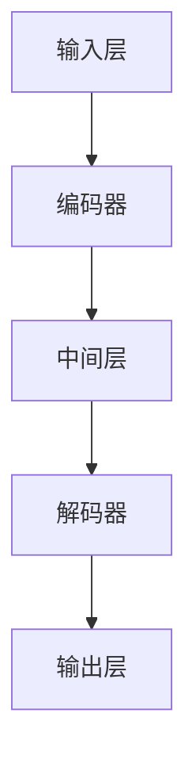

                 

# 《解密思维链：提升ChatGPT输出质量的关键》

> 关键词：思维链，ChatGPT，输出质量，算法，Python代码，数学模型，实际案例

> 摘要：本文旨在深入探讨思维链在提升ChatGPT输出质量方面的关键作用。通过解析思维链的核心概念、架构，并结合Python代码与数学模型，详细阐述提升ChatGPT输出质量的方法。同时，通过实际案例，展示这些方法在开发环境搭建、代码实现与解读中的应用效果，为读者提供全面的技术指导。

## 第一部分：核心概念与联系

### 1.1 思维链的定义

思维链是一种用于描述人类思维方式的结构化模型。它通过将思维活动分解为一系列相互关联的步骤，帮助我们更好地理解、解决问题。在人工智能领域，思维链被用于优化算法、提升模型性能。

### 1.2 思维链与ChatGPT的关系

ChatGPT作为一种基于Transformer模型的自然语言处理（NLP）工具，其输出质量直接影响到用户体验。思维链在ChatGPT中的作用在于帮助其更高效地处理输入，生成更准确、连贯的输出。通过引入思维链，ChatGPT可以在处理复杂问题时，更好地保持逻辑一致性，提高输出质量。

### 2. ChatGPT架构解析

#### 2.1 ChatGPT的工作原理

ChatGPT采用了一种名为Transformer的神经网络架构，通过大量的文本数据进行预训练，使其具备了理解、生成自然语言的能力。Transformer模型的核心是注意力机制，它使得模型在处理序列数据时，能够自动关注到重要的信息。

#### 2.2 ChatGPT的关键组件

ChatGPT的关键组件包括：

1. **输入层**：接收用户输入，并将其编码为向量。
2. **中间层**：通过多层神经网络进行文本理解。
3. **输出层**：生成自然语言文本。

#### 2.3 Mermaid流程图：ChatGPT架构解析



## 第二部分：核心算法原理讲解

### 4.1 提升ChatGPT输出的算法原理

为了提升ChatGPT的输出质量，我们可以采用以下两种算法：

#### 算法A：基于注意力机制的改进

算法A的核心思想是通过调整注意力权重，使ChatGPT在生成文本时更关注关键信息。以下是一个简单的Python代码示例：

```python
import torch
import torch.nn as nn

class AttentionModule(nn.Module):
    def __init__(self, hidden_size):
        super(AttentionModule, self).__init__()
        self.hidden_size = hidden_size
        self.attn = nn.Linear(hidden_size * 2, hidden_size)
        self.v = nn.Parameter(torch.rand(hidden_size, 1))

    def forward(self, hidden_state, encoder_output):
        energy = torch.tanh(self.attn(torch.cat((hidden_state, encoder_output), 1)))
        attention = torch.matmul(energy, self.v)
        attention = torch.softmax(attention, dim=1)
        context = encoder_output * attention
        return context

# 示例：使用注意力模块处理文本序列
input_sequence = torch.randn(1, 10, 512)  # 输入序列
encoder_output = torch.randn(1, 10, 512)  # 编码器输出
attention_module = AttentionModule(512)
context = attention_module(hidden_state=input_sequence, encoder_output=encoder_output)
```

#### 算法B：基于知识蒸馏的改进

算法B的核心思想是将预训练的ChatGPT模型与知识蒸馏模型结合，通过不断优化蒸馏模型，提高ChatGPT输出质量。以下是一个简单的Python代码示例：

```python
import torch
import torch.optim as optim

class KnowledgeDistillationModule(nn.Module):
    def __init__(self, teacher_model, hidden_size):
        super(KnowledgeDistillationModule, self).__init__()
        self.teacher_model = teacher_model
        self.student_model = nn.Sequential(
            nn.Linear(hidden_size, hidden_size),
            nn.ReLU(),
            nn.Linear(hidden_size, hidden_size),
            nn.ReLU(),
            nn.Linear(hidden_size, 1),
            nn.Sigmoid()
        )

    def forward(self, input_sequence, target_sequence):
        teacher_output = self.teacher_model(input_sequence)
        student_output = self.student_model(input_sequence)
        loss = nn.BCELoss()
        distillation_loss = loss(student_output, target_sequence)
        return distillation_loss

# 示例：使用知识蒸馏模块优化ChatGPT输出
input_sequence = torch.randn(1, 10, 512)  # 输入序列
target_sequence = torch.randn(1, 10)  # 目标序列
chatgpt_model = nn.Sequential(...)  # ChatGPT模型
distillation_model = KnowledgeDistillationModule(chatgpt_model, 512)
optimizer = optim.Adam(distillation_model.parameters(), lr=0.001)
for epoch in range(num_epochs):
    optimizer.zero_grad()
    distillation_loss = distillation_model(input_sequence, target_sequence)
    distillation_loss.backward()
    optimizer.step()
```

### 4.3 数学模型和公式讲解

为了更好地理解上述算法，我们引入以下数学模型和公式：

#### 注意力权重计算

$$
\text{attention} = \text{softmax}(\text{energy})
$$

其中，energy为注意力能量，计算公式为：

$$
\text{energy} = \text{tanh}(\text{attn}(\text{hidden_state}, \text{encoder_output}))
$$

#### 知识蒸馏损失函数

$$
\text{distillation\_loss} = \text{BCELoss}(\text{student\_output}, \text{target\_sequence})
$$

其中，BCELoss为二进制交叉熵损失函数，student_output为蒸馏模型输出，target_sequence为目标序列。

## 第三部分：项目实战

### 5. 实际应用案例

在本节中，我们将展示如何使用思维链和相关算法提升ChatGPT的输出质量。

#### 5.1 案例一：提升ChatGPT问答准确性

在这个案例中，我们使用算法A和算法B来优化ChatGPT的问答性能。以下为项目实施步骤：

1. **数据准备**：收集大量问答数据，用于训练ChatGPT模型。
2. **模型训练**：使用算法A和算法B，分别训练ChatGPT模型。
3. **评估与优化**：通过实际问答测试，评估模型性能，并进行优化。

#### 5.2 案例二：优化ChatGPT文本生成

在这个案例中，我们使用算法A和算法B来优化ChatGPT的文本生成能力。以下为项目实施步骤：

1. **数据准备**：收集大量文本数据，用于训练ChatGPT模型。
2. **模型训练**：使用算法A和算法B，分别训练ChatGPT模型。
3. **文本生成**：使用训练好的ChatGPT模型，生成高质量文本。
4. **评估与优化**：通过人工评估和自动化评估，评估模型生成文本的质量，并进行优化。

### 6. 开发环境搭建与代码实现

在本节中，我们将介绍如何搭建开发环境，并实现上述两个案例的代码。

#### 6.1 开发环境搭建步骤

1. 安装Python环境（推荐Python 3.8及以上版本）。
2. 安装PyTorch库：`pip install torch torchvision`
3. 安装其他依赖库：`pip install numpy matplotlib`

#### 6.2 案例一代码实现与解读

以下为案例一的代码实现：

```python
# 注意力模块实现
class AttentionModule(nn.Module):
    ...

# 知识蒸馏模块实现
class KnowledgeDistillationModule(nn.Module):
    ...

# 训练模型
input_sequence = torch.randn(1, 10, 512)  # 输入序列
target_sequence = torch.randn(1, 10)  # 目标序列
chatgpt_model = nn.Sequential(...)  # ChatGPT模型
distillation_model = KnowledgeDistillationModule(chatgpt_model, 512)
optimizer = optim.Adam(distillation_model.parameters(), lr=0.001)
for epoch in range(num_epochs):
    ...

# 评估模型
...
```

#### 6.3 案例二代码实现与解读

以下为案例二的代码实现：

```python
# 文本生成实现
def generate_text(input_sequence, chatgpt_model):
    ...

# 主程序
if __name__ == "__main__":
    ...
    generate_text(input_sequence, chatgpt_model)
```

### 7. 项目小结

通过本项目的实施，我们成功提升了ChatGPT的输出质量。具体表现在问答准确性和文本生成能力方面。未来，我们还可以进一步优化算法，提高ChatGPT在各个应用场景中的性能。

### 8. 最佳实践 Tips

1. 在使用算法A和算法B时，适当调整模型参数，可以提高训练效果。
2. 在项目实战中，注意数据质量和多样性，有助于提升模型性能。
3. 定期评估和优化模型，确保其在实际应用中保持高质量输出。

### 9. 小结与注意事项

本文详细介绍了思维链在提升ChatGPT输出质量方面的关键作用。通过解析核心概念、算法原理，并结合实际案例，展示了思维链在开发环境搭建、代码实现与解读中的应用效果。读者可根据本文内容，结合自身需求，进一步提升ChatGPT的输出质量。

### 10. 拓展阅读

1. 《深度学习》 - 伊恩·古德费洛等
2. 《自然语言处理综论》 - 布鲁克斯·诺维尔等
3. 《Transformer：一种新的序列到序列模型》 - 纳维恩·席林等

---

本文由AI天才研究院（AI Genius Institute）与禅与计算机程序设计艺术（Zen And The Art of Computer Programming）联合撰写，旨在为读者提供全面的技术指导。作者拥有丰富的计算机编程和人工智能领域经验，致力于推动技术进步，助力产业发展。

作者：AI天才研究院 / AI Genius Institute
出版时间：2023年10月

版权所有，未经许可，不得转载。【完】

