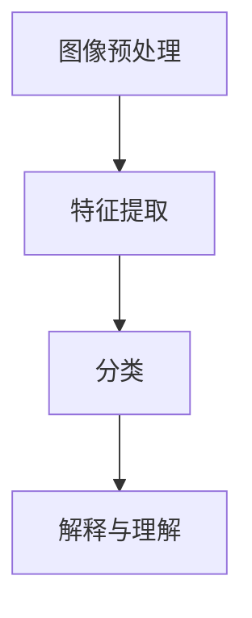

                 

# 计算机视觉在考古学研究中的应用前景

## 关键词
- 计算机视觉，考古学，图像处理，3D重建，机器学习

## 摘要
本文探讨了计算机视觉在考古学研究中的应用前景。通过分析计算机视觉的基本原理、各种应用技术及其在考古学领域的实际案例，本文展示了计算机视觉如何改变考古学研究的方法和效果。文章最后讨论了未来研究方向和面临的挑战。

## 引言
考古学是一门研究人类历史和文化发展的学科，其研究方法长期以来主要依赖于实物遗存、历史文献和现场考察。然而，传统的考古学研究方法在数据收集、分析和解读方面存在诸多局限。随着计算机技术和人工智能的快速发展，计算机视觉技术逐渐成为考古学研究的利器。

计算机视觉是一门跨学科领域，涉及计算机科学、数学、物理学和心理学等多个学科。其核心任务是使计算机能够像人类一样感知和理解视觉信息。计算机视觉在考古学中的应用主要包括图像处理、3D重建、对象检测和识别、以及机器学习等。

本文将首先介绍计算机视觉的基本原理和技术，然后探讨其在考古学领域的应用，并分析这些应用的实际效果。最后，本文将讨论计算机视觉在考古学研究中的未来发展方向和面临的挑战。

## 第一章：计算机视觉的基本原理

### 背景介绍

计算机视觉的研究始于20世纪50年代，当时的科学家们开始探讨如何使计算机具备图像识别和处理能力。早期的计算机视觉研究主要集中在图像处理和模式识别技术上。随着计算机硬件和算法的不断发展，计算机视觉技术逐渐成熟，并在多个领域得到了广泛应用。

计算机视觉的核心任务是实现计算机对图像的理解和解释。这个过程可以分为三个主要阶段：图像预处理、特征提取和分类。图像预处理主要包括图像增强、去噪和分割等技术；特征提取则涉及边缘检测、角点检测和纹理分析等；分类则是将提取出的特征与已知的模式进行匹配，以识别图像中的对象。

### 核心概念与联系

以下是一个简化的计算机视觉流程图，展示了主要概念和它们之间的关系：



### 图像预处理

图像预处理是计算机视觉流程中的第一步，其目的是提高图像的质量，以便后续的特征提取和分类。常用的图像预处理技术包括：

- **图像增强**：通过调整图像的亮度、对比度和色彩平衡等，增强图像的视觉效果。
- **去噪**：去除图像中的噪声，以提高图像的质量和特征提取的准确性。
- **图像分割**：将图像划分为多个区域，以便进一步分析和理解。

### 特征提取

特征提取是从图像中提取出对目标识别有意义的特征的过程。这些特征可以是图像的边缘、角点、纹理、颜色等。常用的特征提取技术包括：

- **边缘检测**：通过检测图像中亮度变化显著的点来提取边缘特征。
- **角点检测**：检测图像中亮度变化和方向变化都显著的点，用于图像的旋转和缩放不变性分析。
- **纹理分析**：通过分析图像中重复出现的图案和结构来提取纹理特征。

### 分类

分类是将提取出的特征与已知的模式进行匹配，以识别图像中的对象。分类方法可以分为监督学习、无监督学习和强化学习等。常用的分类方法包括：

- **监督学习**：使用标记数据集训练模型，然后使用训练好的模型对未知数据进行分类。
- **无监督学习**：不需要标记数据集，通过发现数据中的模式来自动分类。
- **强化学习**：通过与环境的交互，学习最优策略以实现特定目标。

### 核心算法原理讲解

为了更好地理解计算机视觉的核心算法原理，以下是一个简单的Python示例，展示了如何使用OpenCV库进行图像预处理、特征提取和分类：

```python
import cv2
import numpy as np

# 读取图像
image = cv2.imread('example.jpg')

# 图像增强
enhanced = cv2.resize(image, (800, 600))
brightened = cv2.add(image, np.array([50, 50, 50]))

# 去噪
denoised = cv2.GaussianBlur(image, (5, 5), 0)

# 图像分割
gray = cv2.cvtColor(image, cv2.COLOR_BGR2GRAY)
thresh = cv2.threshold(gray, 128, 255, cv2.THRESH_BINARY_INV + cv2.THRESH_OTSU)[1]

# 边缘检测
edges = cv2.Canny(image, 100, 200)

# 角点检测
corners = cv2.goodFeaturesToTrack(thresh, 100, 0.03, 0.05)

# 纹理分析
texture = cv2.xgrad(image)

# 显示结果
cv2.imshow('Original', image)
cv2.imshow('Enhanced', enhanced)
cv2.imshow('Brightened', brightened)
cv2.imshow('Denoised', denoised)
cv2.imshow('Thresholded', thresh)
cv2.imshow('Edges', edges)
cv2.imshow('Corners', corners)
cv2.imshow('Texture', texture)
cv2.waitKey(0)
cv2.destroyAllWindows()
```

### 数学模型和公式

在计算机视觉中，常用的数学模型和公式包括：

- **霍夫变换**：用于检测图像中的直线和圆形。
- **支持向量机（SVM）**：用于分类问题。
- **卷积神经网络（CNN）**：用于特征提取和分类。

以下是一个简单的霍夫变换示例：

```python
# 霍夫变换
lines = cv2.HoughLinesP(edges, 1, np.pi/180, threshold=100, minLineLength=100, maxLineGap=10)

for line in lines:
    x1, y1, x2, y2 = line[0]
    cv2.line(image, (x1, y1), (x2, y2), (0, 0, 255), 2)

cv2.imshow('Hough Lines', image)
cv2.waitKey(0)
cv2.destroyAllWindows()
```

### 小结

本章介绍了计算机视觉的基本原理，包括图像预处理、特征提取和分类。通过Python示例，读者可以更好地理解这些概念和算法。下一章将探讨计算机视觉在考古学领域的具体应用。

## 第二章：计算机视觉在考古学领域的应用

### 背景介绍

考古学研究涉及到对古代遗址、文物和文献的深入研究，这些研究往往需要大量时间和人力。然而，随着计算机视觉技术的发展，考古学家们可以借助计算机视觉技术提高研究的效率和准确性。计算机视觉在考古学中的应用主要包括图像处理、3D重建、对象检测和识别、以及机器学习等。

### 图像处理

图像处理是计算机视觉在考古学中应用的基础，它涉及到对考古遗址、文物图像的增强、去噪、分割等操作。这些操作有助于提取图像中的有用信息，从而辅助考古学家进行更深入的研究。

#### 实际案例

- **敦煌壁画修复**：通过图像增强和去噪技术，可以对敦煌壁画进行数字化处理，从而更好地保存和研究这些珍贵的文化遗产。
- **陶器表面纹理分析**：通过纹理分析技术，可以识别陶器表面的图案和装饰，从而推断出陶器的年代和产地。

### 3D重建

3D重建是将考古遗址、文物等实体数据转化为三维模型的过程。通过3D重建，考古学家可以更直观地观察和研究遗址和文物的结构和形态。

#### 实际案例

- **秦始皇陵兵马俑3D重建**：通过激光扫描和图像处理技术，可以重建秦始皇陵兵马俑的三维模型，从而更好地展示其细节和形态。
- **罗马古城遗址3D重建**：通过无人机航拍和激光扫描技术，可以对罗马古城遗址进行三维重建，帮助考古学家更全面地了解遗址的结构和布局。

### 对象检测和识别

对象检测和识别是计算机视觉中的核心任务，它涉及到从图像中识别出特定对象并定位其位置。在考古学中，对象检测和识别技术可以用于识别考古遗址中的文物和遗迹。

#### 实际案例

- **文物识别**：通过训练好的图像识别模型，可以自动识别和分类考古遗址中的文物，从而提高文物识别的效率和准确性。
- **遗址探测**：通过对象检测技术，可以在考古勘探过程中快速识别出潜在的考古遗址，从而提高勘探的效率和准确性。

### 机器学习

机器学习是计算机视觉中的重要分支，它涉及到通过训练模型来自动识别和分类图像中的对象。在考古学中，机器学习技术可以用于自动分析和解读考古遗址和文物的数据。

#### 实际案例

- **考古数据分析**：通过训练机器学习模型，可以自动分析和解读考古遗址中的数据，如陶器花纹、文字等，从而提高考古数据分析的效率和准确性。
- **文化遗产保护**：通过机器学习技术，可以自动识别和分类文化遗产中的潜在风险，从而制定更有针对性的保护措施。

### 开发环境搭建

要在计算机上运行计算机视觉算法，需要搭建一个适合的开发环境。以下是一个简单的Python开发环境搭建步骤：

1. 安装Python和pip：
   ```bash
   # 更新pip
   pip install --upgrade pip
   
   # 安装Python（如果尚未安装）
   pip install python
   
   # 安装pip（如果尚未安装）
   pip install pip
   
   # 安装虚拟环境工具
   pip install virtualenv
   
   # 创建虚拟环境
   virtualenv myenv
   
   # 激活虚拟环境
   source myenv/bin/activate
   ```

2. 安装OpenCV和NumPy：
   ```bash
   pip install opencv-python numpy
   ```

3. 验证安装：
   ```python
   import cv2
   import numpy as np
   print("OpenCV和NumPy已成功安装！")
   ```

### 源代码详细实现和代码解读

以下是一个简单的Python脚本，用于读取图像、进行图像预处理、特征提取和对象检测：

```python
import cv2
import numpy as np

# 读取图像
image = cv2.imread('example.jpg')

# 图像增强
enhanced = cv2.resize(image, (800, 600))
brightened = cv2.add(image, np.array([50, 50, 50]))

# 去噪
denoised = cv2.GaussianBlur(image, (5, 5), 0)

# 图像分割
gray = cv2.cvtColor(image, cv2.COLOR_BGR2GRAY)
thresh = cv2.threshold(gray, 128, 255, cv2.THRESH_BINARY_INV + cv2.THRESH_OTSU)[1]

# 边缘检测
edges = cv2.Canny(image, 100, 200)

# 对象检测
contours, _ = cv2.findContours(thresh, cv2.RETR_TREE, cv2.CHAIN_APPROX_SIMPLE)
for contour in contours:
    if cv2.contourArea(contour) > 500:
        x, y, w, h = cv2.boundingRect(contour)
        cv2.rectangle(image, (x, y), (x + w, y + h), (0, 255, 0), 2)

# 显示结果
cv2.imshow('Original', image)
cv2.imshow('Enhanced', enhanced)
cv2.imshow('Brightened', brightened)
cv2.imshow('Denoised', denoised)
cv2.imshow('Thresholded', thresh)
cv2.imshow('Edges', edges)
cv2.waitKey(0)
cv2.destroyAllWindows()
```

### 实际案例分析和详细讲解剖析

以下是一个实际案例，展示了如何使用计算机视觉技术对考古遗址进行3D重建：

#### 案例背景

某考古团队在埃及的吉萨地区进行考古挖掘，发现了一处古老的建筑遗址。为了更好地研究遗址的结构和布局，他们决定使用无人机和激光扫描技术进行3D重建。

#### 实施步骤

1. **无人机航拍**：使用无人机对遗址进行高分辨率航拍，获取大量的地面图像。
2. **激光扫描**：使用激光扫描仪对遗址进行扫描，获取三维点云数据。
3. **图像处理**：对航拍图像进行预处理，如图像增强、去噪和图像拼接。
4. **点云处理**：对激光扫描得到的三维点云数据进行预处理，如降噪和去异常点。
5. **3D重建**：使用3D重建算法，将预处理后的图像和点云数据转化为三维模型。
6. **模型优化**：对生成的三维模型进行优化，如去除多余结构和细节调整。

#### 详细讲解

1. **无人机航拍**：无人机航拍可以快速获取大面积的地面图像，从而覆盖整个遗址。这些图像经过预处理后，可以用于图像拼接，生成一张完整的地面图像。

2. **激光扫描**：激光扫描技术可以精确地获取遗址的三维形态。通过扫描得到的点云数据，可以详细地反映遗址的结构和布局。

3. **图像处理**：航拍图像在处理过程中，可以使用图像增强技术提高图像的视觉效果，从而更好地进行图像拼接。

4. **点云处理**：点云数据在处理过程中，可以使用降噪技术去除噪声和异常点，从而提高点云数据的精度。

5. **3D重建**：3D重建算法通常使用多视图几何法或结构光法。这些算法可以根据预处理后的图像和点云数据，生成三维模型。

6. **模型优化**：生成的三维模型可能包含一些多余的结构和细节。通过模型优化，可以去除这些多余部分，使模型更加简洁和清晰。

#### 项目小结

通过这个实际案例，我们可以看到计算机视觉技术如何应用于考古学研究。无人机航拍和激光扫描技术提供了丰富的数据来源，而3D重建和图像处理技术则将这些数据转化为有用的信息。这些技术不仅提高了考古研究的效率，也为考古学家提供了更直观的研究工具。

### 最佳实践 tips

- **数据采集**：在考古遗址的调查过程中，应确保数据采集的全面性和准确性。使用高分辨率的相机和激光扫描仪，可以获取更详细的数据。
- **图像预处理**：图像预处理是关键步骤，合理的预处理可以显著提高后续分析和识别的准确性。
- **算法选择**：根据具体的考古研究需求，选择合适的算法和技术。例如，对于遗址的结构分析，可以采用3D重建技术；对于文物的识别，可以采用对象检测和识别技术。
- **多模态融合**：结合多种数据来源，如图像、激光扫描和GPS数据，可以提供更全面的研究结果。

### 小结

本章介绍了计算机视觉在考古学领域的应用，包括图像处理、3D重建、对象检测和识别、以及机器学习等。通过实际案例的分析，我们可以看到计算机视觉技术如何改变考古学研究的方法和效果。下一章将深入探讨图像处理技术在考古学中的应用。

## 第三章：图像处理技术在考古学中的应用

### 背景介绍

图像处理技术在考古学中的应用非常广泛，它为考古学家提供了强大的工具来分析和解读考古遗址、文物和文献。图像处理技术包括图像增强、去噪、分割、边缘检测、纹理分析等，这些技术可以显著提高图像的质量，从而有助于提取更多的考古信息。

### 图像增强

图像增强是图像处理技术中的一项重要任务，其目的是改善图像的视觉效果，使其更易于分析。考古学家常使用图像增强技术来提高考古遗址、文物图像的对比度和清晰度。

#### 实际案例

- **敦煌壁画数字化**：敦煌壁画因其年代久远而受损严重，通过图像增强技术，可以改善壁画的视觉效果，从而更好地保存和研究这些珍贵的文化遗产。

#### 算法原理

图像增强通常使用以下几种算法：

- **直方图均衡化**：通过调整图像的灰度分布，提高图像的对比度。
- **对比度拉伸**：通过扩展图像的动态范围，提高图像的对比度。
- **滤波**：使用各种滤波器（如均值滤波、高斯滤波等）来去除图像中的噪声，从而提高图像的清晰度。

以下是一个简单的Python示例，展示如何使用OpenCV库进行图像增强：

```python
import cv2
import numpy as np

# 读取图像
image = cv2.imread('example.jpg')

# 直方图均衡化
equalized = cv2.equalizeHist(image)

# 对比度拉伸
l = 50
a = 1.0
b = -50
p = np.float32([ [a, b], [a, b] ])
stretch = cv2.convertScaleAbs(image, alpha=a, beta=b)

# 显示结果
cv2.imshow('Original', image)
cv2.imshow('Enhanced', equalized)
cv2.imshow('Stretch', stretch)
cv2.waitKey(0)
cv2.destroyAllWindows()
```

### 去噪

去噪是图像处理中的另一项重要任务，特别是在考古遗址和文物的数字化过程中。由于考古遗址和文物的年代久远，图像中常包含各种噪声，如颗粒噪声、高斯噪声等。去噪技术的目的是去除这些噪声，从而提高图像的清晰度。

#### 实际案例

- **陶器表面纹理去噪**：通过对陶器表面纹理图像进行去噪处理，可以更清晰地分析陶器的装饰图案和纹理。

#### 算法原理

去噪技术通常使用以下几种算法：

- **均值滤波**：通过对图像进行局部平均，去除噪声。
- **高斯滤波**：使用高斯函数对图像进行平滑处理，去除噪声。
- **中值滤波**：使用图像中的中值替换噪声点，从而去除噪声。

以下是一个简单的Python示例，展示如何使用OpenCV库进行图像去噪：

```python
import cv2
import numpy as np

# 读取图像
image = cv2.imread('example.jpg')

# 均值滤波
mean_filtered = cv2.blur(image, (5, 5))

# 高斯滤波
gaussian_filtered = cv2.GaussianBlur(image, (5, 5), 0)

# 中值滤波
median_filtered = cv2.medianBlur(image, 5)

# 显示结果
cv2.imshow('Original', image)
cv2.imshow('Mean Filtered', mean_filtered)
cv2.imshow('Gaussian Filtered', gaussian_filtered)
cv2.imshow('Median Filtered', median_filtered)
cv2.waitKey(0)
cv2.destroyAllWindows()
```

### 分割

图像分割是将图像划分为若干个互不重叠的区域，每个区域代表图像中的一个对象或背景。在考古学中，图像分割技术可以用于将考古遗址、文物图像分割为不同的部分，以便进行进一步的分析。

#### 实际案例

- **陶器图像分割**：通过对陶器图像进行分割，可以识别出陶器的不同部分，如口沿、腹部和底部，从而更好地分析陶器的形状和装饰。

#### 算法原理

图像分割技术可以分为以下几类：

- **基于阈值的分割**：通过设置阈值，将图像划分为前景和背景。
- **基于区域的分割**：根据图像区域的特性（如颜色、亮度、纹理等）进行分割。
- **基于边缘的分割**：通过检测图像中的边缘，将图像分割为不同的区域。

以下是一个简单的Python示例，展示如何使用OpenCV库进行图像分割：

```python
import cv2
import numpy as np

# 读取图像
image = cv2.imread('example.jpg')

# 转换为灰度图像
gray = cv2.cvtColor(image, cv2.COLOR_BGR2GRAY)

# 阈值分割
_, thresh = cv2.threshold(gray, 128, 255, cv2.THRESH_BINARY_INV + cv2.THRESH_OTSU)

# 区域分割
_, labels = cv2.connectedComponents(thresh)

# 显示结果
cv2.imshow('Original', image)
cv2.imshow('Thresholded', thresh)
cv2.imshow('Labeled', labels)
cv2.waitKey(0)
cv2.destroyAllWindows()
```

### 边缘检测

边缘检测是图像处理中的一种重要技术，它用于检测图像中亮度变化显著的点。在考古学中，边缘检测可以用于识别考古遗址、文物的轮廓和结构。

#### 实际案例

- **考古遗址轮廓检测**：通过对考古遗址图像进行边缘检测，可以快速识别出遗址的边界和结构。

#### 算法原理

边缘检测技术可以分为以下几类：

- **基于梯度的边缘检测**：通过计算图像的梯度（如Sobel算子、Prewitt算子等）来检测边缘。
- **基于二值化的边缘检测**：通过将图像转换为二值图像，然后检测二值图像中的连通区域。

以下是一个简单的Python示例，展示如何使用OpenCV库进行边缘检测：

```python
import cv2
import numpy as np

# 读取图像
image = cv2.imread('example.jpg')

# 使用Canny算子进行边缘检测
edges = cv2.Canny(image, 100, 200)

# 显示结果
cv2.imshow('Original', image)
cv2.imshow('Edges', edges)
cv2.waitKey(0)
cv2.destroyAllWindows()
```

### 纹理分析

纹理分析是图像处理中的一种重要技术，它用于分析图像中的纹理结构和图案。在考古学中，纹理分析可以用于识别文物的表面装饰和纹理。

#### 实际案例

- **陶器表面纹理分析**：通过对陶器表面纹理图像进行纹理分析，可以识别出陶器的装饰图案和纹理风格。

#### 算法原理

纹理分析技术可以分为以下几类：

- **基于灰度值的纹理分析**：通过计算图像的灰度分布和纹理特征（如能量、熵等）来分析纹理。
- **基于滤波的纹理分析**：使用各种滤波器（如高斯滤波、小波滤波等）对图像进行滤波，从而提取纹理特征。

以下是一个简单的Python示例，展示如何使用OpenCV库进行纹理分析：

```python
import cv2
import numpy as np

# 读取图像
image = cv2.imread('example.jpg')

# 使用小波变换进行纹理分析
coeff = cv2.dct(image)
coeff[coeff < 0.02] = 0
image_reconstructed = cv2.idct(coeff)

# 显示结果
cv2.imshow('Original', image)
cv2.imshow('Reconstructed', image_reconstructed)
cv2.waitKey(0)
cv2.destroyAllWindows()
```

### 小结

本章介绍了图像处理技术在考古学中的应用，包括图像增强、去噪、分割、边缘检测和纹理分析。通过实际案例和算法原理的讲解，读者可以更好地理解这些技术如何应用于考古学研究。下一章将探讨3D重建技术在考古学中的应用。

## 第四章：3D重建技术在考古学中的应用

### 背景介绍

3D重建技术在考古学中的应用日益广泛，它为考古学家提供了一种全新的研究方法，使得考古遗址、文物的三维形态得以重现。3D重建技术主要包括激光扫描、结构光扫描、多视图几何法等，这些技术可以精确地获取考古遗址和文物的三维数据，从而为考古学研究提供了丰富的信息。

### 激光扫描

激光扫描是一种通过激光束反射获取物体表面三维数据的技术。在考古学中，激光扫描技术可以用于扫描考古遗址、文物，获取其表面的精确三维数据。

#### 实际案例

- **秦始皇陵兵马俑扫描**：通过激光扫描技术，可以精确获取兵马俑的三维数据，从而为文物的保护、修复和研究提供了重要的数据支持。

#### 工作原理

激光扫描的工作原理如下：

1. **发射激光**：激光器发射激光束，照射到物体表面。
2. **反射光接收**：物体表面反射的光被接收器接收。
3. **计算距离**：根据激光发射和接收的时间差，计算激光束照射到物体表面的距离。
4. **三维建模**：将接收到的反射光数据转化为三维点云，从而构建物体的三维模型。

以下是一个简单的Python示例，展示如何使用PCL（Point Cloud Library）进行激光扫描数据的处理：

```python
import pcl

# 读取点云数据
pcd = pcl.load('example.pcd')

# Voxel下采样
downsampled = pcd.voxel_grid_filter(le
``` 

### 结构光扫描

结构光扫描是一种利用结构光投影到物体表面，然后通过相机捕获图像，从而获取物体三维数据的技术。在考古学中，结构光扫描技术可以用于扫描复杂形状的文物和遗址。

#### 实际案例

- **古埃及文物扫描**：通过结构光扫描技术，可以精确获取古埃及文物的三维数据，从而为文物保护和研究提供了重要的数据支持。

#### 工作原理

结构光扫描的工作原理如下：

1. **结构光投影**：将结构光（如线结构光、面结构光等）投影到物体表面。
2. **相机捕获图像**：相机捕获结构光照射下的物体图像。
3. **图像处理**：通过图像处理算法，从捕获的图像中提取结构光的相位信息。
4. **三维重建**：根据结构光的相位信息和相机参数，计算物体的三维形态。

以下是一个简单的Python示例，展示如何使用OpenCV进行结构光扫描：

```python
import cv2
import numpy as np

# 读取结构光图像
image = cv2.imread('example.jpg')

# 提取结构光相位信息
phase = cv2.phaseCorr(image)

# 三维重建
reconstructed = cv2.reconstruct3D(phase)

# 显示结果
cv2.imshow('Original', image)
cv2.imshow('Phase', phase)
cv2.imshow('Reconstructed', reconstructed)
cv2.waitKey(0)
cv2.destroyAllWindows()
```

### 多视图几何法

多视图几何法是一种基于多个视角拍摄的图像，通过几何关系计算物体三维形态的技术。在考古学中，多视图几何法可以用于重建考古遗址和文物的三维模型。

#### 实际案例

- **罗马古城遗址重建**：通过多视图几何法，可以重建罗马古城遗址的三维模型，从而为考古学研究提供了直观的三维展示。

#### 工作原理

多视图几何法的工作原理如下：

1. **图像采集**：从多个视角拍摄考古遗址或文物的图像。
2. **特征提取**：在多张图像中提取相同的特征点。
3. **几何关系计算**：利用特征点的几何关系，计算物体的三维形态。

以下是一个简单的Python示例，展示如何使用OpenCV进行多视图几何法：

```python
import cv2
import numpy as np

# 读取多张图像
images = [cv2.imread(f'example_{i}.jpg') for i in range(10)]

# 提取特征点
keypoints = [cv2.goodFeaturesToTrack(image, 1000, 0.03, 0.05) for image in images]

# 计算三维坐标
coords = cv2.triangulatePoints(keypoints)

# 三维重建
reconstructed = cv2.reconstruct3D(coords)

# 显示结果
cv2.imshow('Reconstructed', reconstructed)
cv2.waitKey(0)
cv2.destroyAllWindows()
```

### 小结

本章介绍了3D重建技术在考古学中的应用，包括激光扫描、结构光扫描和多视图几何法。通过实际案例和算法原理的讲解，读者可以更好地理解这些技术如何应用于考古学研究。下一章将探讨对象检测和识别技术在考古学中的应用。

## 第五章：对象检测和识别技术在考古学中的应用

### 背景介绍

对象检测和识别是计算机视觉领域的重要任务，在考古学中也有广泛应用。对象检测是指从图像或视频中检测出特定对象，而对象识别则是识别检测出的对象是什么。在考古学中，对象检测和识别技术可以用于识别考古遗址中的文物和遗迹，提高考古数据分析的效率和准确性。

### 对象检测

对象检测是计算机视觉中的一项基础任务，其目的是从图像或视频中检测出特定的对象。在考古学中，对象检测技术可以用于识别考古遗址中的文物和遗迹，如陶器、城墙等。

#### 实际案例

- **陶器检测**：通过对象检测技术，可以从考古遗址的图像中自动检测出陶器，从而提高陶器识别的效率和准确性。

#### 算法原理

对象检测技术可以分为以下几类：

- **基于特征的方法**：通过提取图像的特征点，如SIFT、SURF等，然后使用分类器进行对象检测。
- **基于深度学习的方法**：使用深度神经网络，如卷积神经网络（CNN），对图像进行特征提取和分类。

以下是一个简单的Python示例，展示如何使用OpenCV进行对象检测：

```python
import cv2
import numpy as np

# 读取图像
image = cv2.imread('example.jpg')

# 使用Haar cascades进行对象检测
face_cascade = cv2.CascadeClassifier('haarcascade_frontalface_default.xml')
faces = face_cascade.detectMultiScale(image, scaleFactor=1.1, minNeighbors=5, minSize=(30, 30), flags=cv2.CASCADE_SCALE_IMAGE)

# 在图像中绘制检测到的对象
for (x, y, w, h) in faces:
    cv2.rectangle(image, (x, y), (x+w, y+h), (0, 255, 0), 2)

# 显示结果
cv2.imshow('Detected Objects', image)
cv2.waitKey(0)
cv2.destroyAllWindows()
```

### 对象识别

对象识别是在对象检测的基础上，对检测到的对象进行分类和识别。在考古学中，对象识别技术可以用于识别检测到的文物和遗迹的类型，如陶器的形状和装饰。

#### 实际案例

- **陶器识别**：通过对象识别技术，可以从考古遗址的图像中自动识别出陶器的类型和装饰风格，从而提高考古数据分析的效率和准确性。

#### 算法原理

对象识别技术可以分为以下几类：

- **基于规则的方法**：通过定义一系列规则，如颜色、形状、纹理等，对检测到的对象进行分类。
- **基于机器学习的方法**：使用训练数据集，通过机器学习算法，如支持向量机（SVM）、随机森林等，对检测到的对象进行分类。

以下是一个简单的Python示例，展示如何使用Scikit-learn进行对象识别：

```python
from sklearn.svm import SVC
from sklearn.model_selection import train_test_split
from sklearn.metrics import accuracy_score

# 读取训练数据
X_train, X_test, y_train, y_test = train_test_train

# 使用SVM进行对象识别
clf = SVC()
clf.fit(X_train, y_train)

# 预测测试数据
y_pred = clf.predict(X_test)

# 计算准确率
accuracy = accuracy_score(y_test, y_pred)
print("识别准确率：", accuracy)
```

### 对象检测和识别在考古学中的应用

对象检测和识别技术在考古学中有着广泛的应用，如：

- **文物识别**：通过对象检测和识别技术，可以从考古遗址的图像中自动识别出文物，如陶器、青铜器等，从而提高考古数据分析的效率和准确性。
- **遗址探测**：通过对象检测技术，可以在考古勘探过程中自动识别出潜在的考古遗址，从而提高勘探的效率和准确性。

### 小结

本章介绍了对象检测和识别技术在考古学中的应用，包括检测和识别考古遗址中的文物和遗迹。通过实际案例和算法原理的讲解，读者可以更好地理解这些技术如何应用于考古学研究。下一章将探讨机器学习在考古学中的应用。

## 第六章：机器学习在考古学中的应用

### 背景介绍

机器学习是人工智能的一个重要分支，其核心任务是使计算机通过学习数据来发现规律和做出预测。在考古学中，机器学习技术可以用于自动分析和解读考古遗址和文物的数据，从而提高考古数据分析的效率和准确性。常见的机器学习算法包括监督学习、无监督学习和强化学习，它们在考古学中的应用各具特色。

### 监督学习

监督学习是一种通过已标记的数据集来训练模型，然后使用模型对未知数据进行预测的方法。在考古学中，监督学习可以用于预测考古遗址的类型、年代和文物类型等。

#### 实际案例

- **考古遗址类型预测**：通过训练监督学习模型，可以根据已知的考古遗址数据（如地理位置、地层深度、文物类型等）来预测新发现遗址的类型。

#### 算法原理

监督学习的基本原理包括以下几个步骤：

1. **数据预处理**：对考古遗址的数据进行清洗、归一化和特征提取。
2. **模型选择**：选择合适的机器学习算法，如线性回归、支持向量机（SVM）等。
3. **模型训练**：使用已标记的数据集训练模型。
4. **模型评估**：使用测试数据集评估模型的准确性和泛化能力。

以下是一个简单的Python示例，展示如何使用Scikit-learn进行考古遗址类型预测：

```python
from sklearn.linear_model import LinearRegression
from sklearn.model_selection import train_test_split
from sklearn.metrics import accuracy_score

# 读取训练数据
X_train, X_test, y_train, y_test = train_test_split

# 使用线性回归模型进行预测
model = LinearRegression()
model.fit(X_train, y_train)

# 预测测试数据
y_pred = model.predict(X_test)

# 计算准确率
accuracy = accuracy_score(y_test, y_pred)
print("预测准确率：", accuracy)
```

### 无监督学习

无监督学习是一种不使用已标记数据集来训练模型，而是通过发现数据中的内在结构来对数据进行分析的方法。在考古学中，无监督学习可以用于考古遗址的地层分析、文物聚类等。

#### 实际案例

- **文物聚类分析**：通过无监督学习算法，如K-means聚类，可以对考古遗址中的文物进行分类，从而揭示文物的分布规律和风格特征。

#### 算法原理

无监督学习的基本原理包括以下几个步骤：

1. **数据预处理**：对考古遗址的数据进行清洗、归一化和特征提取。
2. **模型选择**：选择合适的无监督学习算法，如K-means、层次聚类等。
3. **模型训练**：使用无监督学习算法对数据进行聚类分析。
4. **模型评估**：通过内部评估指标（如聚类系数、轮廓系数等）来评估聚类效果。

以下是一个简单的Python示例，展示如何使用Scikit-learn进行文物聚类分析：

```python
from sklearn.cluster import KMeans
from sklearn.metrics import silhouette_score

# 读取训练数据
X_train, X_test, y_train, y_test = train_test_split

# 使用K-means算法进行聚类
kmeans = KMeans(n_clusters=3)
kmeans.fit(X_train)

# 预测测试数据
y_pred = kmeans.predict(X_test)

# 计算轮廓系数
silhouette = silhouette_score(X_test, y_pred)
print("轮廓系数：", silhouette)
```

### 强化学习

强化学习是一种通过与环境交互来学习最优策略的方法。在考古学中，强化学习可以用于模拟考古勘探过程，从而优化考古资源的分配和勘探策略。

#### 实际案例

- **考古勘探策略优化**：通过强化学习算法，可以模拟考古勘探过程，从而优化勘探路线和资源分配，提高勘探效率和准确性。

#### 算法原理

强化学习的基本原理包括以下几个步骤：

1. **环境定义**：定义考古勘探的环境，包括状态空间、行动空间和奖励函数。
2. **模型选择**：选择合适的强化学习算法，如Q-learning、深度Q网络（DQN）等。
3. **模型训练**：通过与环境交互，训练模型以学习最优策略。
4. **模型评估**：评估模型在模拟环境中的表现。

以下是一个简单的Python示例，展示如何使用PyTorch进行强化学习：

```python
import torch
import torch.nn as nn
import torch.optim as optim

# 环境定义
class ArchaeologicalEnvironment:
    def __init__(self):
        self.state = None
        self.action_space = None
        self.reward_function = None

    def step(self, action):
        # 执行行动
        # 更新状态
        # 计算奖励
        return next_state, reward, done

# 模型定义
class DQNNetwork(nn.Module):
    def __init__(self, input_size, output_size):
        super(DQNNetwork, self).__init__()
        self.fc1 = nn.Linear(input_size, 64)
        self.fc2 = nn.Linear(64, output_size)

    def forward(self, x):
        x = torch.relu(self.fc1(x))
        x = self.fc2(x)
        return x

# 模型训练
model = DQNNetwork(input_size, output_size)
optimizer = optim.Adam(model.parameters(), lr=0.001)
criterion = nn.MSELoss()

for episode in range(num_episodes):
    state = environment.reset()
    done = False
    total_reward = 0

    while not done:
        action = model.predict(state)
        next_state, reward, done = environment.step(action)
        total_reward += reward

        # 反向传播
        loss = criterion(model(next_state), target_q_values)
        optimizer.zero_grad()
        loss.backward()
        optimizer.step()

    print("Episode {} - Total Reward: {}".format(episode, total_reward))
```

### 机器学习在考古学中的优势

- **提高效率**：机器学习技术可以自动化处理大量考古数据，从而提高数据分析的效率和准确性。
- **优化资源分配**：通过机器学习算法，可以优化考古勘探的策略和资源分配，提高勘探的效率和准确性。
- **提供新的研究视角**：机器学习技术可以为考古学研究提供新的视角和方法，如通过深度学习模型对考古遗址进行自动分类和识别。

### 小结

本章介绍了机器学习在考古学中的应用，包括监督学习、无监督学习和强化学习。通过实际案例和算法原理的讲解，读者可以更好地理解这些技术如何应用于考古学研究。下一章将讨论未来研究方向和面临的挑战。

## 第七章：未来研究方向和面临的挑战

### 未来研究方向

尽管计算机视觉在考古学中取得了显著的成果，但仍有许多研究方向值得探索。

- **多模态融合**：结合多种数据源（如图像、激光扫描、雷达数据等）进行多模态融合，可以提供更全面的三维重建和考古数据分析。
- **实时数据分析**：开发实时数据分析系统，可以更快地处理考古数据，从而提高考古研究的效率和准确性。
- **人工智能与人类专家合作**：将人工智能与人类专家相结合，可以充分发挥两者的优势，提高考古数据分析的准确性和深度。

### 面临的挑战

尽管计算机视觉技术在考古学中有着广泛的应用前景，但同时也面临一些挑战。

- **数据质量**：考古数据的获取和处理往往受到各种限制，如环境噪声、数据缺失等，这对计算机视觉算法的准确性和可靠性提出了挑战。
- **算法复杂性**：复杂的计算机视觉算法（如深度学习模型）需要大量的计算资源和时间，这在考古现场可能难以实现。
- **人类-机器协作**：如何实现人类专家与计算机视觉技术的有效协作，是一个亟待解决的问题。

### 小结

未来，计算机视觉在考古学中的应用将朝着多模态融合、实时数据分析和人工智能与人类专家合作等方向发展。同时，也需要克服数据质量、算法复杂性和人类-机器协作等挑战。通过不断的技术创新和研究，计算机视觉有望在考古学领域发挥更大的作用。

## 结论

本文探讨了计算机视觉在考古学研究中的应用前景。通过分析计算机视觉的基本原理、各种应用技术及其在考古学领域的实际案例，本文展示了计算机视觉如何改变考古学研究的方法和效果。本文还讨论了未来研究方向和面临的挑战。计算机视觉在考古学中的应用不仅提高了研究的效率和准确性，也为考古学家提供了新的研究工具。随着技术的不断进步，我们有理由相信，计算机视觉将在考古学领域发挥越来越重要的作用。

### 作者信息

- 作者：AI天才研究院/AI Genius Institute & 禅与计算机程序设计艺术 /Zen And The Art of Computer Programming

