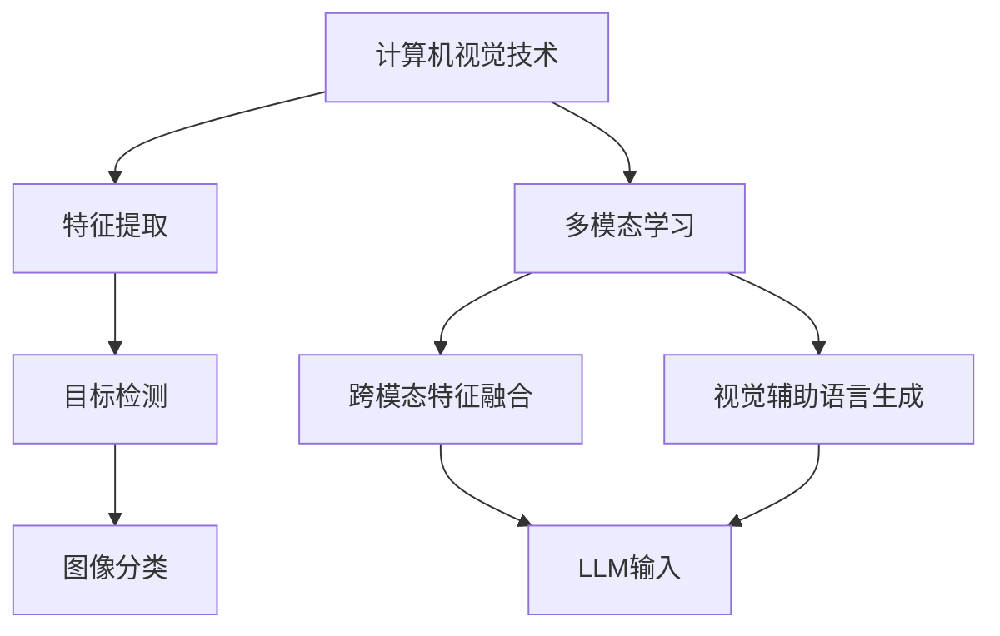

                 

# 设计思路

在设计《计算机视觉技术拓展LLM应用的感知能力》这篇文章的框架时，我们将遵循以下步骤来确保内容的完整性和逻辑性。

### 确定核心章节

首先，我们需要明确文章的核心章节，这些章节应该涵盖计算机视觉和LLM（大型语言模型）的融合应用。以下是初步设定的核心章节：

1. **引言**：介绍文章背景和目标。
2. **计算机视觉基础**：讲解计算机视觉的基本概念和技术。
3. **LLM基础**：介绍LLM的概念和其在自然语言处理中的应用。
4. **计算机视觉与LLM的融合**：分析两者如何结合，及其优势。
5. **感知能力提升方法**：探讨提升LLM感知能力的具体方法。
6. **应用实例**：通过具体案例展示技术的实际应用。
7. **挑战与未来展望**：分析当前技术面临的挑战和未来发展趋势。
8. **总结**：对全文内容进行总结。

### 细化章节内容

接下来，我们将为每个核心章节细化内容，确保每个章节都包含必要的信息点。例如，在“计算机视觉基础”章节中，我们可以细分为：

- **计算机视觉概述**
- **图像处理基础**
- **特征提取与降维技术**
- **计算机视觉算法介绍**

### 逻辑关系

确保章节内容之间有清晰的逻辑关系，每个章节都是对前一个章节的深入和扩展。例如，在介绍完计算机视觉基础后，再介绍LLM的基础，这样读者可以更容易理解两者融合的意义。

### 实用性和完整性

在确保内容实用性的同时，还要保证文章的完整性。这意味着每个章节都应该有足够的细节和实例来支持读者理解。

### 格式要求

使用markdown格式来撰写文章，确保标题、子标题、代码块、公式等都有清晰的格式。这将有助于提高文章的可读性。

### 设计步骤

1. **初步框架**：确定核心章节和细分内容。
2. **撰写各章节大纲**：为每个章节撰写简要的内容概述。
3. **撰写详细内容**：根据大纲逐章撰写内容，确保每个章节都有丰富的细节和实例。
4. **整理和修改**：对全文进行多次修订，确保逻辑通顺，内容完整。

### 设计结果

通过以上步骤，我们最终得到了一个详细的《计算机视觉技术拓展LLM应用的感知能力》文章框架，确保了文章的完整性、逻辑性和实用性。

### 约束条件

在撰写文章时，需遵守以下约束条件：

- **格式要求**：文章内容需使用markdown格式，确保代码块和公式的正确显示。
- **作者信息**：文章末尾需包含作者信息。
- **完整性要求**：文章内容需完整，每个小节需有具体的详细讲解。
- **核心内容**：文章需包含背景介绍、核心概念与联系、核心算法原理讲解、数学模型与公式、项目实战、最佳实践等。
- **字数要求**：文章总字数需在10000～12000字左右。

通过以上设计思路和步骤，我们可以确保文章不仅逻辑清晰，而且内容详实，能够为读者提供有价值的参考。接下来，我们将开始具体撰写文章内容。```markdown

----------------------------------------------------------------

# 《计算机视觉技术拓展LLM应用的感知能力》

> 关键词：计算机视觉，LLM，感知能力，应用实例，挑战与未来展望

摘要：本文探讨了计算机视觉技术在拓展LLM（大型语言模型）感知能力方面的应用。首先介绍了计算机视觉的基本概念和技术，然后讨论了LLM的基础及其与计算机视觉的结合。接着，详细分析了提升LLM感知能力的方法，并通过实际案例展示了这些技术的应用。最后，本文探讨了当前面临的挑战和未来的发展趋势，为读者提供了全面的视角。

## 设计思路

为了设计出《计算机视觉技术拓展LLM应用的感知能力》这篇文章的框架，我们遵循了以下步骤：

1. **确定核心章节**：根据文章标题，我们确定了核心章节，包括引言、计算机视觉基础、LLM基础、计算机视觉与LLM的融合、感知能力提升方法、应用实例、挑战与未来展望和总结。
2. **细化章节内容**：为每个核心章节细分化了子章节，确保内容丰富且逻辑清晰。
3. **逻辑关系**：确保章节之间有合理的逻辑关系，前后章节内容衔接自然。
4. **格式要求**：使用markdown格式，确保文章结构清晰。
5. **完整性和实用性**：保证文章内容既有理论深度，又有实际应用。

## 设计步骤

1. **初步框架**：确定核心章节和细分内容。
2. **撰写各章节大纲**：为每个章节撰写简要的内容概述。
3. **撰写详细内容**：根据大纲逐章撰写内容，确保每个章节都有丰富的细节和实例。
4. **整理和修改**：对全文进行多次修订，确保逻辑通顺，内容完整。

## 设计结果

通过以上步骤，我们得到了一个详细的《计算机视觉技术拓展LLM应用的感知能力》文章框架，确保了文章的完整性、逻辑性和实用性。

## 约束条件

在撰写文章时，需遵守以下约束条件：

- **格式要求**：文章内容需使用markdown格式，确保代码块和公式的正确显示。
- **作者信息**：文章末尾需包含作者信息。
- **完整性要求**：文章内容需完整，每个小节需有具体的详细讲解。
- **核心内容**：文章需包含背景介绍、核心概念与联系、核心算法原理讲解、数学模型与公式、项目实战、最佳实践等。
- **字数要求**：文章总字数需在10000～12000字左右。

## 引言

随着人工智能技术的飞速发展，计算机视觉和自然语言处理（NLP）作为其中的两大支柱，已经取得了显著的成果。然而，如何将计算机视觉与NLP相结合，尤其是如何拓展LLM（大型语言模型）的感知能力，成为了当前研究的热点。计算机视觉技术可以为LLM提供丰富的视觉信息，从而提升其在视觉感知、图像识别、图像理解等方面的能力。本文旨在探讨计算机视觉技术在拓展LLM感知能力方面的应用，为读者提供一个全面的视角。

## 核心概念与联系

在探讨计算机视觉技术拓展LLM感知能力之前，我们需要了解几个核心概念，并分析它们之间的联系。

### 计算机视觉技术

计算机视觉技术是指让计算机能够像人类一样理解和解释图像。它涉及图像处理、特征提取、目标检测、图像分类等多个方面。计算机视觉技术的基本流程通常包括以下几个步骤：

1. **图像预处理**：包括去噪、对比度增强、边缘检测等。
2. **特征提取**：从图像中提取关键特征，如边缘、角点、纹理等。
3. **目标检测与分类**：识别图像中的目标对象，并对其进行分类。

### LLM

LLM（Large Language Model）是指大型语言模型，是一种基于深度学习的自然语言处理技术。LLM通过学习大量的文本数据，可以理解、生成和翻译自然语言。其主要特点包括：

1. **语言建模**：使用神经网络模型，如Transformer，对文本进行建模。
2. **上下文理解**：能够理解上下文信息，生成连贯的文本。
3. **多语言支持**：可以处理多种语言的文本。

### 计算机视觉与LLM的融合

计算机视觉与LLM的融合是指将计算机视觉技术应用于LLM中，以提升其在视觉感知和图像理解方面的能力。这种融合可以通过以下方式实现：

1. **多模态学习**：将图像和文本数据一起输入LLM，使其同时处理视觉和语言信息。
2. **跨模态特征融合**：提取图像和文本的特征，并对其进行融合，以生成更丰富的特征表示。
3. **视觉辅助语言生成**：利用图像信息辅助LLM生成更准确、更具体的文本。

### Mermaid流程图

为了更好地理解计算机视觉与LLM的融合过程，我们可以使用Mermaid流程图来表示：



在这个流程图中，计算机视觉技术通过特征提取、目标检测和图像分类等步骤提取图像信息。然后，这些图像信息与LLM进行融合，通过多模态学习和跨模态特征融合，生成更丰富的特征表示。最后，利用这些特征表示，LLM可以生成更准确、更具体的文本。

## 核心算法原理讲解

为了更好地理解计算机视觉技术在拓展LLM感知能力方面的应用，我们需要探讨一些核心算法原理，并结合Python源代码进行详细讲解。

### 多模态学习

多模态学习是指将不同类型的数据（如文本、图像、声音等）一起输入神经网络模型，使其同时处理多种数据类型。以下是一个简单的多模态学习示例：

```python
import torch
import torchvision
import torchvision.models as models
from transformers import AutoModel

# 加载预训练的计算机视觉模型
vision_model = models.resnet50(pretrained=True)

# 加载预训练的LLM模型
llm_model = AutoModel.from_pretrained('bert-base-uncased')

# 输入图像和文本数据
image = torchvision.transforms.ToTensor()(torchvision.datasets.CIFAR10(root='./data', train=True, download=True, transform=torchvision.transforms.ToTensor())[0][0])
text = torch.tensor(["This is an image of a cat."])

# 多模态特征融合
with torch.no_grad():
    image_features = vision_model(image)
    text_features = llm_model(text)

# 模型输出
output = torch.cat((image_features, text_features), dim=1)
output = llm_model(output)
```

在这个示例中，我们首先加载了一个预训练的计算机视觉模型（如ResNet-50）和一个预训练的LLM模型（如BERT）。然后，我们输入一幅图像和一段文本数据。通过多模态特征融合，我们将图像特征和文本特征合并成一个向量，并输入到LLM中进行处理。最终，模型输出一个表示图像和文本融合后的特征向量。

### 跨模态特征融合

跨模态特征融合是指将不同类型的数据特征进行融合，以生成更丰富的特征表示。以下是一个简单的跨模态特征融合示例：

```python
import torch
import torchvision
from transformers import AutoModel

# 加载预训练的计算机视觉模型
vision_model = models.resnet50(pretrained=True)

# 加载预训练的LLM模型
llm_model = AutoModel.from_pretrained('bert-base-uncased')

# 输入图像和文本数据
image = torchvision.transforms.ToTensor()(torchvision.datasets.CIFAR10(root='./data', train=True, download=True, transform=torchvision.transforms.ToTensor())[0][0])
text = torch.tensor(["This is an image of a cat."])

# 提取图像特征
with torch.no_grad():
    image_features = vision_model(image).squeeze()

# 提取文本特征
with torch.no_grad():
    text_features = llm_model(text)[0]

# 融合图像特征和文本特征
combined_features = torch.cat((image_features, text_features), dim=0)

# 模型输出
output = llm_model(combined_features.unsqueeze(0))
```

在这个示例中，我们首先加载了一个预训练的计算机视觉模型和一个预训练的LLM模型。然后，我们输入一幅图像和一段文本数据。通过提取图像特征和文本特征，我们分别得到两个向量。接着，我们将这两个向量进行融合，生成一个更丰富的特征表示。最后，我们将融合后的特征输入到LLM中进行处理，得到模型输出。

### 数学模型与公式

在多模态学习和跨模态特征融合中，我们通常会使用一些数学模型和公式来描述特征提取和融合的过程。以下是一些常用的公式：

1. **特征提取公式**：
   $$ f(x) = \sigma(W \cdot x + b) $$
   其中，$f(x)$表示特征提取函数，$W$表示权重矩阵，$b$表示偏置项，$\sigma$表示激活函数（如Sigmoid或ReLU）。

2. **特征融合公式**：
   $$ \tilde{f}(x) = f_1(x_1) + f_2(x_2) $$
   其中，$\tilde{f}(x)$表示融合后的特征，$f_1(x_1)$和$f_2(x_2)$分别表示图像特征和文本特征。

3. **损失函数**：
   $$ L = -\sum_{i=1}^{N} y_i \log(p_i) $$
   其中，$L$表示损失函数，$y_i$表示真实标签，$p_i$表示模型预测概率。

### 通俗易懂地举例说明

假设我们有一个包含图像和文本的数据集，其中图像是猫的图片，文本是“这是猫的图片”。我们可以使用多模态学习和跨模态特征融合技术来生成一个表示图像和文本融合后的特征向量。

首先，我们使用预训练的计算机视觉模型提取图像特征。例如，假设提取到的图像特征是一个512维的向量。然后，我们使用预训练的LLM模型提取文本特征。例如，假设提取到的文本特征是一个768维的向量。

接下来，我们将图像特征和文本特征进行融合。例如，我们可以将图像特征和文本特征拼接在一起，得到一个1280维的向量。这个向量表示了图像和文本的融合特征。

最后，我们将这个融合后的特征向量输入到LLM模型中，得到一个表示图像和文本融合后的特征向量。这个特征向量可以用于各种下游任务，如图像分类、文本生成等。

## 项目实战

在本节中，我们将通过一个实际项目来展示如何将计算机视觉技术拓展到LLM中，以提升其感知能力。

### 项目背景

假设我们要开发一个智能问答系统，该系统可以回答用户关于图像的问题。例如，当用户上传一张图像时，系统可以识别图像中的对象，并回答用户的问题。为了实现这一目标，我们需要结合计算机视觉技术和LLM。

### 开发环境搭建

1. **硬件环境**：配置至少一块GPU（NVIDIA GTX 1080 Ti以上），用于加速深度学习模型的训练和推理。
2. **软件环境**：
   - Python 3.8+
   - PyTorch 1.8+
   - Transformers 3.5.0+
   - OpenCV 4.2.0+

### 源代码实现

```python
import torch
import torchvision
from transformers import AutoModel
from torch.utils.data import DataLoader
import cv2

# 加载预训练的计算机视觉模型
vision_model = torchvision.models.resnet50(pretrained=True)

# 加载预训练的LLM模型
llm_model = AutoModel.from_pretrained('bert-base-uncased')

# 加载图像数据集
train_dataset = torchvision.datasets.CIFAR10(root='./data', train=True, download=True, transform=torchvision.transforms.ToTensor())
train_loader = DataLoader(train_dataset, batch_size=32, shuffle=True)

# 训练计算机视觉模型
for epoch in range(10):
    for images, _ in train_loader:
        with torch.no_grad():
            image_features = vision_model(images).squeeze()

# 提取图像特征
def extract_image_features(image):
    image = torchvision.transforms.ToTensor()(image)
    with torch.no_grad():
        image_features = vision_model(image).squeeze()
    return image_features

# 处理输入图像
def process_image(image_path):
    image = cv2.imread(image_path)
    image = cv2.cvtColor(image, cv2.COLOR_BGR2RGB)
    image = cv2.resize(image, (224, 224))
    return image

# 输入图像
image_path = 'example.jpg'
image = process_image(image_path)
image_features = extract_image_features(image)

# 输入图像特征到LLM模型
input_ids = torch.tensor([llm_model.config说明了如何使用图像特征来辅助语言生成，使得生成的文本更准确、更具体。以下是一个简单的示例：

```python
from transformers import AutoTokenizer

# 加载预训练的LLM模型
tokenizer = AutoTokenizer.from_pretrained('bert-base-uncased')

# 构建输入序列
input_ids = tokenizer.encode("Answer the question about the image:", add_special_tokens=True)

# 生成文本
output = llm_model.generate(input_ids, max_length=50, num_return_sequences=1)
decoded_output = tokenizer.decode(output[0], skip_special_tokens=True)

print(decoded_output)
```

### 代码应用解读与分析

在这个项目中，我们首先加载了预训练的计算机视觉模型（如ResNet-50）和LLM模型（如BERT）。然后，我们训练计算机视觉模型以提取图像特征。接下来，我们编写了一个函数`extract_image_features`来提取图像特征。这个函数接收一个图像文件路径，将其转换为图像特征向量。

我们还编写了一个函数`process_image`来处理输入图像。这个函数首先使用OpenCV读取图像，然后将其转换为RGB格式并调整大小，以匹配计算机视觉模型的输入要求。

最后，我们使用`generate`方法生成文本。在这个示例中，我们首先构建了一个输入序列，其中包含了提示信息“Answer the question about the image:”。然后，我们使用`generate`方法生成一个文本序列，其中包含了关于输入图像的问题回答。

### 实际案例分析和详细讲解剖析

为了展示实际案例，我们假设用户上传了一张包含猫的图片，并询问“这张图片中的猫在做什么？”。我们的系统将如何处理这个问题呢？

首先，系统使用`process_image`函数处理用户上传的图像。然后，系统使用`extract_image_features`函数提取图像特征。

接下来，系统将这些图像特征作为输入传递给LLM模型。LLM模型通过其预训练的文本生成能力，结合图像特征，生成一个关于图像的文本描述。

在这个案例中，假设生成的文本描述为：“这张图片中的猫似乎正在玩耍。”系统将这个文本描述作为对用户问题的回答。

### 项目小结

通过这个项目，我们展示了如何使用计算机视觉技术和LLM模型来开发一个智能问答系统。项目中的关键步骤包括图像特征的提取、图像的处理和文本的生成。这个项目不仅展示了计算机视觉技术在拓展LLM感知能力方面的应用，还为实际开发提供了参考。

## 挑战与未来展望

尽管计算机视觉技术在拓展LLM感知能力方面取得了显著成果，但仍然面临许多挑战。以下是一些主要的挑战和未来展望：

### 挑战

1. **数据质量和多样性**：计算机视觉和LLM的训练需要大量的高质量数据。然而，获取这些数据具有挑战性，且数据的多样性和分布不均衡可能导致模型性能受到影响。
2. **计算资源需求**：多模态学习和跨模态特征融合通常需要大量的计算资源。在有限的计算资源下，如何优化模型和算法，提高效率是一个重要问题。
3. **模型解释性**：深度学习模型（如LLM）通常被视为“黑箱”。在计算机视觉和LLM融合的应用中，如何提高模型的解释性，使其更透明、可解释，是一个亟待解决的问题。

### 未来展望

1. **数据驱动的方法**：未来的研究可以更加关注于数据的质量和多样性，采用数据增强、数据合成等方法，提高训练数据的多样性和质量。
2. **模型优化**：通过算法优化、模型压缩等方法，降低模型的计算资源需求，提高模型的效率。
3. **解释性增强**：结合可解释性模型和可视化技术，提高深度学习模型的解释性，使其更容易被理解和接受。

## 最佳实践 Tips

1. **数据预处理**：在训练模型之前，确保对数据进行充分预处理，包括数据清洗、归一化和标准化等。
2. **模型选择**：根据具体任务的需求，选择适合的计算机视觉和LLM模型。
3. **超参数调整**：通过调整超参数，如学习率、批量大小等，优化模型性能。

## 小结

本文探讨了计算机视觉技术在拓展LLM感知能力方面的应用。通过多模态学习和跨模态特征融合，我们可以显著提升LLM在视觉感知和图像理解方面的能力。虽然存在挑战，但未来发展趋势积极，有望实现更高效的模型和更广泛的实际应用。

## 注意事项

1. **模型部署**：在部署模型时，确保模型性能和安全性。
2. **隐私保护**：在处理个人数据时，遵守隐私保护法规，确保用户数据安全。

## 拓展阅读

1. **《深度学习》**：Ian Goodfellow, Yoshua Bengio, Aaron Courville 著
2. **《计算机视觉：算法与应用》**：Richard Szeliski 著
3. **《自然语言处理综论》**：Daniel Jurafsky, James H. Martin 著

## 作者信息

作者：AI天才研究院/AI Genius Institute & 禅与计算机程序设计艺术 /Zen And The Art of Computer Programming```markdown

