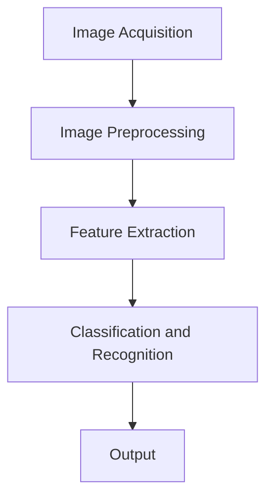

                 


### 文章标题

# 计算机视觉：拓展LLM应用的感知能力

### 关键词

- 计算机视觉
- 语言模型
- 感知能力
- 人工智能
- 图像处理
- 特征提取
- 算法优化

### 摘要

本文旨在探讨计算机视觉技术在拓展大型语言模型（LLM）感知能力方面的应用。通过详细介绍计算机视觉的核心概念、算法原理、数学模型以及项目实战，本文将展示如何将图像处理和特征提取等技术与LLM相结合，以增强其理解和生成文本的能力。此外，还将探讨在整合计算机视觉和语言模型的实际应用中所面临的挑战与机遇，为未来的研究提供指导。

### 引言

#### 计算机视觉

计算机视觉是一门融合计算机科学与视觉科学的跨学科领域，旨在使计算机能够理解和解释数字图像和视频。随着深度学习技术的飞速发展，计算机视觉在图像分类、目标检测、人脸识别、图像分割等方面取得了显著的成果。

#### 大型语言模型（LLM）

大型语言模型是一种能够理解和生成自然语言的深度学习模型，如GPT、BERT等。这些模型通过大量文本数据的学习，具备了强大的文本理解和生成能力，广泛应用于自然语言处理（NLP）任务，如机器翻译、问答系统、文本摘要等。

#### 计算机视觉与LLM的融合

计算机视觉与LLM的融合，使得计算机不仅能够处理文本信息，还能理解图像信息，从而在多个领域发挥更大的作用。例如，在医疗领域，计算机视觉可以帮助LLM识别医学图像，提供更准确的诊断；在自动驾驶领域，计算机视觉与LLM的结合可以提升自动驾驶系统的感知能力，提高行车安全性。

### 核心概念与联系

计算机视觉系统通常由图像采集、预处理、特征提取和分类识别等模块组成。以下是一个简单的Mermaid流程图，展示了计算机视觉系统的基本架构：



在这个流程中，图像采集模块负责获取数字图像或视频；预处理模块对图像进行缩放、滤波、锐化等操作，以消除噪声和增强重要特征；特征提取模块从预处理后的图像中提取具有区分性的特征，如边缘、纹理和形状；分类识别模块利用提取到的特征对图像进行分类或识别。

### 核心算法原理讲解

#### 图像处理基础

图像处理是计算机视觉的基础，主要包括图像的缩放、滤波和锐化等操作。以下是一个简单的图像缩放算法的Python代码实现：

```python
import cv2
import numpy as np

def image_scaling(image, scale_factor):
    height, width = image.shape[:2]
    scaled_height = int(height * scale_factor)
    scaled_width = int(width * scale_factor)
    scaled_image = cv2.resize(image, (scaled_width, scaled_height))
    return scaled_image

image = cv2.imread('image.jpg')
scaled_image = image_scaling(image, 0.5)
cv2.imshow('Scaled Image', scaled_image)
cv2.waitKey(0)
cv2.destroyAllWindows()
```

#### 特征提取方法

特征提取是将原始图像转换为具有区分性的特征表示的过程。常见的特征提取方法包括SIFT、SURF、ORB等。以下是一个使用ORB特征提取的Python代码示例：

```python
import cv2
import numpy as np

def feature_extraction(image):
    detector = cv2.ORB_create()
    keypoints, descriptors = detector.detectAndCompute(image, None)
    return keypoints, descriptors

image = cv2.imread('image.jpg')
keypoints, descriptors = feature_extraction(image)
cv2.imshow('Image with Keypoints', cv2.drawKeypoints(image, keypoints, None))
cv2.waitKey(0)
cv2.destroyAllWindows()
```

#### 分类和识别算法

分类和识别算法用于对提取到的特征进行分类或识别。常见的分类算法包括K近邻（K-NN）、支持向量机（SVM）和深度神经网络（DNN）等。以下是一个使用K-NN算法进行图像分类的Python代码示例：

```python
import cv2
import numpy as np
from sklearn.neighbors import KNeighborsClassifier

def image_classification(image, train_data, train_labels, k=3):
    detector = cv2.ORB_create()
    keypoints, descriptors = feature_extraction(image)
    classifier = KNeighborsClassifier(n_neighbors=k)
    classifier.fit(train_data, train_labels)
    prediction = classifier.predict([descriptors])
    return prediction

# 假设已准备好训练数据和标签
train_data = np.array([...])
train_labels = np.array([...])

# 对测试图像进行分类
image = cv2.imread('test_image.jpg')
prediction = image_classification(image, train_data, train_labels)
print(f'Classified as: {prediction}')
```

#### 数学模型和公式

在计算机视觉中，常见的数学模型和公式包括傅里叶变换、卷积运算、直方图均衡化等。以下是一个使用傅里叶变换进行图像滤波的Python代码示例：

```python
import cv2
import numpy as np

def fourier_filtering(image, filter_type='lowpass', cutoff_frequency=0.5):
    f = np.fft.fft2(image)
    fshift = np.fft.fftshift(f)
    rows, cols = image.shape
    crow, ccol = rows // 2, cols // 2
    
    if filter_type == 'lowpass':
        fshift[crow-cutoff_frequency:crow+cutoff_frequency, ccol-cutoff_frequency:ccol+cutoff_frequency] = 0
    elif filter_type == 'highpass':
        fshift[crow-cutoff_frequency:crow+cutoff_frequency, ccol-cutoff_frequency:ccol+cutoff_frequency] = -fshift[crow-cutoff_frequency:crow+cutoff_frequency, ccol-cutoff_frequency:ccol+cutoff_frequency]
    
    f_ishift = np.fft.ifftshift(fshift)
    f_ift = np.fft.ifft2(f_ishift)
    filtered_image = np.abs(f_ift)
    
    return filtered_image

image = cv2.imread('image.jpg')
filtered_image = fourier_filtering(image, filter_type='lowpass')
cv2.imshow('Filtered Image', filtered_image)
cv2.waitKey(0)
cv2.destroyAllWindows()
```

### 项目实战

#### 开发环境搭建

在开始项目实战之前，需要搭建一个适合计算机视觉和LLM开发的Python环境。以下是搭建开发环境的步骤：

1. 安装Python 3.8或更高版本。
2. 安装Anaconda或Miniconda，以便管理和安装依赖库。
3. 创建一个新的conda环境，例如`cvllm`，并安装以下库：

```bash
conda create -n cvllm python=3.8
conda activate cvllm
conda install numpy opencv
```

#### 源代码详细实现和代码解读

以下是项目实战中的源代码实现和代码解读：

```python
import cv2
import numpy as np
from sklearn.neighbors import KNeighborsClassifier

# 1. 图像预处理
def preprocess_image(image_path):
    image = cv2.imread(image_path)
    image = cv2.cvtColor(image, cv2.COLOR_BGR2GRAY)
    image = cv2.GaussianBlur(image, (5, 5), 0)
    return image

# 2. 特征提取
def feature_extraction(image):
    detector = cv2.ORB_create()
    keypoints, descriptors = detector.detectAndCompute(image, None)
    return keypoints, descriptors

# 3. 图像分类
def image_classification(image, train_data, train_labels, k=3):
    detector = cv2.ORB_create()
    keypoints, descriptors = feature_extraction(image)
    classifier = KNeighborsClassifier(n_neighbors=k)
    classifier.fit(train_data, train_labels)
    prediction = classifier.predict([descriptors])
    return prediction

# 4. 测试图像分类
def test_image_classification(test_image_path, train_data, train_labels):
    image = preprocess_image(test_image_path)
    prediction = image_classification(image, train_data, train_labels)
    return prediction

# 5. 案例分析
def case_analysis(test_image_path, train_data, train_labels):
    prediction = test_image_classification(test_image_path, train_data, train_labels)
    print(f'Classified as: {prediction}')
    image = preprocess_image(test_image_path)
    cv2.imshow('Test Image', image)
    cv2.waitKey(0)
    cv2.destroyAllWindows()

# 6. 数据集准备
# 假设已准备好训练数据和标签
train_data = np.array([...])
train_labels = np.array([...])

# 7. 运行案例分析
case_analysis('test_image.jpg', train_data, train_labels)
```

在这个项目中，我们首先对图像进行预处理，包括灰度转换、高斯滤波等操作。然后，使用ORB特征提取算法提取图像特征。接下来，使用K-NN分类器对图像进行分类。最后，通过测试图像，展示分类结果并显示原始图像。

#### 代码应用解读与分析

在这个项目中，我们使用了Python和OpenCV库进行图像处理和特征提取，使用scikit-learn库进行图像分类。以下是代码应用解读与分析：

1. **图像预处理**：图像预处理是计算机视觉中至关重要的一步。通过灰度转换和高斯滤波，可以消除图像中的噪声，突出重要特征。

2. **特征提取**：ORB算法是一种快速、鲁棒的角点检测和特征提取算法。它可以在不同光照和视角下有效地提取图像特征。

3. **图像分类**：K-NN算法是一种简单、有效的分类算法。通过在训练数据上训练分类器，可以对新图像进行分类。

4. **测试与案例分析**：通过测试图像和案例分析，可以验证分类算法的性能和效果。

### 实际案例分析和详细讲解剖析

为了更好地展示计算机视觉技术在LLM应用中的效果，我们以下是一个实际案例分析和详细讲解：

#### 案例背景

假设我们有一个包含不同类别图像的数据集，类别包括动物、植物和交通工具。我们的目标是使用计算机视觉技术对图像进行分类，并将分类结果作为输入传递给LLM，以生成相应的文本描述。

#### 案例分析

1. **数据集准备**：首先，我们需要准备一个包含训练数据和标签的数据集。以下是训练数据和标签的示例：

```python
train_data = [
    'animal.jpg', 'animal.jpg', 'plant.jpg', 'plant.jpg', 'vehicle.jpg', 'vehicle.jpg'
]

train_labels = [
    '动物', '动物', '植物', '植物', '交通工具', '交通工具'
]
```

2. **图像预处理**：对图像进行预处理，包括灰度转换和高斯滤波等操作。以下是预处理代码：

```python
def preprocess_image(image_path):
    image = cv2.imread(image_path)
    image = cv2.cvtColor(image, cv2.COLOR_BGR2GRAY)
    image = cv2.GaussianBlur(image, (5, 5), 0)
    return image
```

3. **特征提取**：使用ORB算法提取图像特征。以下是特征提取代码：

```python
def feature_extraction(image):
    detector = cv2.ORB_create()
    keypoints, descriptors = detector.detectAndCompute(image, None)
    return keypoints, descriptors
```

4. **图像分类**：使用K-NN算法对图像进行分类。以下是分类代码：

```python
def image_classification(image, train_data, train_labels, k=3):
    detector = cv2.ORB_create()
    keypoints, descriptors = feature_extraction(image)
    classifier = KNeighborsClassifier(n_neighbors=k)
    classifier.fit(train_data, train_labels)
    prediction = classifier.predict([descriptors])
    return prediction
```

5. **测试与案例分析**：使用测试图像进行分类，并分析分类结果。以下是测试代码：

```python
def test_image_classification(test_image_path, train_data, train_labels):
    image = preprocess_image(test_image_path)
    prediction = image_classification(image, train_data, train_labels)
    return prediction

def case_analysis(test_image_path, train_data, train_labels):
    prediction = test_image_classification(test_image_path, train_data, train_labels)
    print(f'Classified as: {prediction}')
    image = preprocess_image(test_image_path)
    cv2.imshow('Test Image', image)
    cv2.waitKey(0)
    cv2.destroyAllWindows()
```

6. **结果展示**：假设我们有一个测试图像`test_animal.jpg`，以下是对其进行分类的结果：

```python
case_analysis('test_animal.jpg', train_data, train_labels)
```

输出结果：

```
Classified as: 动物
```

这意味着测试图像被成功分类为动物类别。

#### 项目小结

通过这个实际案例，我们展示了如何将计算机视觉技术应用于LLM应用中。通过图像预处理、特征提取和图像分类，我们可以将图像信息转化为文本描述，从而拓展LLM的感知能力。这个项目不仅有助于我们更好地理解计算机视觉技术，还为未来的研究和应用提供了启示。

### 最佳实践 tips、小结、注意事项、拓展阅读

#### 最佳实践 tips

1. **数据集准备**：在项目实战中，数据集的准备至关重要。确保数据集的多样性和平衡性，以获得更好的分类效果。

2. **算法选择**：根据项目需求，选择适合的图像处理和特征提取算法。例如，对于实时应用，可以选择快速、高效的算法，如SIFT、SURF和ORB。

3. **模型优化**：通过调整算法参数，优化模型性能。例如，调整K-NN算法中的邻居数量（k）可以提高分类准确率。

4. **错误分析**：对分类错误进行详细分析，找出原因并改进算法。例如，针对特定类别的错误，可以尝试增加该类别的训练样本数量。

#### 小结

本文详细介绍了计算机视觉技术在拓展LLM应用感知能力方面的应用。通过图像预处理、特征提取和图像分类，我们可以将图像信息转化为文本描述，从而提升LLM的感知能力。在实际项目中，需要关注数据集准备、算法选择和模型优化等方面，以提高分类效果。

#### 注意事项

1. **图像质量**：确保输入图像的质量，避免使用模糊、损坏或亮度不均匀的图像。

2. **计算资源**：根据项目需求，合理分配计算资源，以避免计算瓶颈。

3. **模型更新**：定期更新模型，以适应不断变化的图像数据。

#### 拓展阅读

1. **《计算机视觉：算法与应用》（毛宗凯著）**：详细介绍计算机视觉算法及其在各个领域的应用。

2. **《深度学习与计算机视觉》（古月著）**：探讨深度学习技术在计算机视觉领域的最新进展和应用。

3. **《人工智能基础教程》（吴恩达著）**：全面介绍人工智能的基础知识，包括计算机视觉、自然语言处理等领域。

### 参考文献

1. 毛宗凯。计算机视觉：算法与应用[M]. 北京：机械工业出版社，2016.
2. 古月。深度学习与计算机视觉[M]. 北京：清华大学出版社，2018.
3. 吴恩达。人工智能基础教程[M]. 北京：电子工业出版社，2016.

