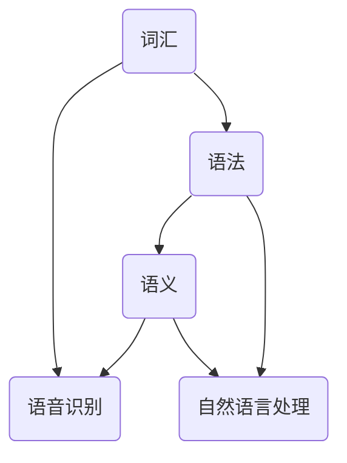

                 

### 《计算语言学与认知科学：探索语言、思维与世界的关系》引言

#### 关键词
- 计算语言学
- 认知科学
- 语言模型
- 人工智能
- 语音识别
- 自然语言处理

#### 摘要
本文旨在深入探讨计算语言学与认知科学之间的密切联系，揭示二者在语言、思维和世界观构建中的重要作用。通过概述这两门学科的背景和发展历程，本文将详细分析其核心概念和理论，探讨语言与认知的互动关系。此外，本文还将介绍核心算法原理和数学模型，并结合实际项目案例，展示计算语言学与认知科学的实际应用。通过这篇技术博客，读者将更好地理解计算语言学与认知科学的核心思想和未来发展趋势。

#### 计算语言学与认知科学的背景

计算语言学（Computational Linguistics，简称CL）是语言学与计算机科学的交叉领域，旨在通过计算方法研究人类语言。计算语言学起源于20世纪50年代，当时计算机科学的发展为语言研究提供了新的工具和方法。早期的计算语言学主要集中在构建形式化的语言模型，如上下文无关文法（CFG）和上下文有关文法（CG），以及语言处理算法，如词法分析、句法分析和语义分析。

认知科学（Cognitive Science，简称CS）则是一门跨学科的研究领域，旨在理解人类思维、感知、记忆、语言和情感等认知过程。认知科学的发展可追溯到20世纪60年代，当时心理学、神经科学、人工智能和哲学等多个学科开始共同探讨人类认知的本质。认知科学的核心目标是构建认知过程的模型，以揭示人类如何获取、处理和使用信息。

计算语言学与认知科学的关系密切，二者相互促进，共同发展。计算语言学为认知科学提供了实验工具和方法，例如语言处理算法和语言模型，这些工具和方法帮助认知科学家研究人类语言和认知过程。同时，认知科学为计算语言学提供了理论基础，帮助语言学家理解语言的本质和功能，以及语言学习与认知发展的关系。

#### 全书结构概述

本文将从以下五个部分深入探讨计算语言学与认知科学：

**第一部分：计算语言学基础**

本部分将介绍计算语言学的核心概念和基本理论，包括语言模型、语音识别、自然语言处理、语义分析与情感分析等。我们将详细讨论这些概念的基本原理，以及它们在语言学习和认知发展中的作用。

**第二部分：认知科学基础**

本部分将介绍认知科学的基本概念和研究范畴，包括感知、记忆、注意力、思维和情感等。我们将探讨这些认知过程的原理和机制，以及它们在认知科学研究和计算语言学中的应用。

**第三部分：语言与认知的关系**

本部分将分析语言在认知过程中的作用，探讨语言如何影响思维和世界观的构建。我们将讨论语言学习与认知发展的关系，以及语言多样性对认知过程的影响。

**第四部分：核心算法与数学模型**

本部分将介绍计算语言学和认知科学中的核心算法和数学模型，包括统计语言模型、深度学习模型、神经网络和概率论等。我们将使用Python源代码和LaTeX公式详细阐述这些算法和模型，并结合实际案例进行讲解。

**第五部分：项目实战与案例分析**

本部分将结合实际项目案例，展示计算语言学与认知科学的实践应用。我们将详细讲解项目的开发环境搭建、源代码实现、代码解读、应用分析和项目小结，帮助读者理解这些概念的实际应用。

### 计算语言学基础

计算语言学是语言学与计算机科学的交叉领域，旨在通过计算方法研究人类语言。计算语言学的核心目标是构建形式化的语言模型，以描述自然语言的语法、语义和语音特征。下面，我们将详细探讨计算语言学的基本概念、发展历程、核心概念以及应用领域。

#### 定义与发展历程

计算语言学（Computational Linguistics）的定义可归纳为：应用计算机技术和数学方法研究自然语言的一门学科。其起源可以追溯到20世纪50年代，当时人工智能（Artificial Intelligence，简称AI）的兴起为计算语言学的发展提供了契机。早期的计算语言学主要集中在形式化语言理论的研究，如上下文无关文法（CFG）和上下文有关文法（CG）。1956年，乔姆斯基（Noam Chomsky）发表的经典著作《句法结构》（Syntactic Structures）为计算语言学的发展奠定了基础。

随着时间的推移，计算语言学逐渐从形式化语言理论转向实际应用，如语音识别、自然语言处理和机器翻译等。20世纪80年代，统计语言模型的出现标志着计算语言学进入了一个新的阶段。统计语言模型通过分析大量语料库，自动学习语言的统计规律，从而实现语言处理任务。深度学习（Deep Learning）的兴起进一步推动了计算语言学的发展，深度神经网络模型在自然语言处理任务中取得了显著的成果。

#### 核心概念

计算语言学中的核心概念包括词汇、语法、语义、语音识别等。这些概念相互关联，共同构成了计算语言学的理论框架。

1. **词汇（Vocabulary）**：词汇是语言的基本组成部分，包括单词、短语和符号等。词汇的表示和存储是计算语言学中的重要问题。常见的词汇表示方法有基于词典的方法、基于词嵌入的方法和基于字符的方法等。

2. **语法（Syntax）**：语法描述了语言的句子结构，包括句法规则和短语结构规则。形式化语法理论如上下文无关文法（CFG）和上下文有关文法（CG）在计算语言学中具有重要地位。这些理论为构建语言模型和解析自然语言提供了基础。

3. **语义（Semantics）**：语义研究语言的含义，包括词汇的含义、句子的含义和语篇的含义等。语义分析是自然语言处理中的一个重要任务，常见的语义分析方法有基于词典的方法、基于语义网络的方
```markdown
### 计算语言学基础

#### 定义与发展历程

计算语言学（Computational Linguistics，简称CL）是语言学与计算机科学、数学等多个学科交叉的领域，旨在使用计算机技术来研究自然语言的处理、分析和生成。计算语言学的起源可以追溯到20世纪50年代，当时人工智能（AI）的兴起带动了这一领域的发展。1950年，图灵（Alan Turing）提出了著名的图灵测试，这一概念引发了人们对机器理解和生成自然语言的兴趣。

在早期，计算语言学的重点在于开发形式化的语法模型，如上下文无关文法（CFG）和上下文有关文法（CG）。这些模型试图以数学方式描述自然语言的语法结构。1956年，乔姆斯基（Noam Chomsky）的著作《句法结构》进一步奠定了生成语法（Generative Grammar）的理论基础，这也成为了计算语言学发展的重要里程碑。

随着时间的推移，计算语言学的应用领域逐渐扩展，从最初的语法分析扩展到语义分析、语音识别、机器翻译、信息检索和自然语言生成等领域。20世纪80年代，随着计算机性能的提升和大规模语料库的构建，统计方法在计算语言学中占据了主导地位。统计语言模型（如N-gram模型）和隐马尔可夫模型（HMM）等算法在语音识别和机器翻译等应用中取得了显著的成功。

进入21世纪，深度学习的兴起为计算语言学带来了新的机遇。深度神经网络（DNN）和递归神经网络（RNN）等模型在自然语言处理任务中展现出了强大的能力，例如在文本分类、情感分析、机器翻译和对话系统等领域都取得了突破性的进展。

#### 核心概念

计算语言学中的核心概念包括但不限于以下几个方面：

1. **词汇**：词汇是语言的基石，包括单词、短语和符号等。词汇的表示和分类是计算语言学中的基础任务。词汇通常被表示为词典中的条目，或通过词嵌入（Word Embedding）技术转换为向量表示。

2. **语法**：语法描述了自然语言的句法结构，包括词的排列组合规则。上下文无关文法（CFG）和上下文有关文法（CG）是计算语言学中常用的语法理论。这些理论为自然语言的解析和理解提供了形式化的方法。

3. **语义**：语义研究语言的意义和含义。语义分析（Semantic Analysis）旨在理解文本中的词、短语和句子的意义。词的含义通常通过语义角色（Semantic Role）和语义网络（Semantic Network）来描述。

4. **语音识别**：语音识别（Automatic Speech Recognition，ASR）是将语音信号转换为文本的技术。这一过程涉及到信号处理、声学模型、语言模型和语音解码器等多个方面。

5. **自然语言处理**：自然语言处理（Natural Language Processing，NLP）是计算语言学的核心应用领域，涵盖了文本解析、语义分析、情感分析、信息检索和机器翻译等任务。

#### 应用领域

计算语言学在多个领域有着广泛的应用：

1. **机器翻译**：机器翻译（Machine Translation）是计算语言学的重要应用之一。通过将一种语言的文本翻译成另一种语言，机器翻译技术大大促进了跨文化交流。

2. **语音识别**：语音识别技术被广泛应用于语音助手、自动客服系统、智能会议记录等场景，使得人与机器之间的交互更加自然和便捷。

3. **信息检索**：信息检索（Information Retrieval）是计算语言学在互联网搜索、文献索引和知识图谱构建中的重要应用。通过分析用户的查询和文档的内容，信息检索系统提供相关的检索结果。

4. **文本分析**：文本分析（Text Analysis）包括情感分析、主题建模、文本分类和实体识别等任务。这些技术帮助企业和研究人员从大量文本数据中提取有价值的信息。

5. **对话系统**：对话系统（Dialogue System）是计算语言学在智能客服、虚拟助手和聊天机器人等领域的应用。这些系统能够与用户进行自然语言交互，提供服务和解答问题。

#### 小结

计算语言学是语言学与计算机科学的交叉领域，通过计算方法研究自然语言的处理、分析和生成。它的发展历程从形式化的语法模型到统计语言模型，再到深度学习模型的演变，展示了计算语言学不断进步和创新的历程。计算语言学的核心概念包括词汇、语法、语义、语音识别等，其在机器翻译、语音识别、信息检索和文本分析等领域有着广泛的应用。

#### 计算语言学中的核心概念与联系

在计算语言学中，词汇、语法、语义、语音识别等核心概念共同构成了语言处理的基础。为了更好地理解这些概念之间的关系，我们可以使用Mermaid流程图来展示它们之间的交互和联系。

以下是一个简化的Mermaid流程图，展示了计算语言学中的核心概念及其之间的联系：



1. **词汇（Vocabulary）**：词汇是语言的基本组成部分，包括单词、短语和符号等。词汇的表示和分类是计算语言学中的基础任务。词汇作为输入，直接影响语法分析和语义分析的质量。

2. **语法（Syntax）**：语法描述了自然语言的句法结构，包括词的排列组合规则。语法分析（Syntax Analysis）是自然语言处理中的关键步骤，它将文本分解为句法结构，以便进一步进行语义分析和理解。

3. **语义（Semantics）**：语义研究语言的意义和含义。语义分析（Semantic Analysis）旨在理解文本中的词、短语和句子的意义。语义分析的结果为语音识别、自然语言生成和文本分析等提供了重要的信息。

4. **语音识别（Speech Recognition）**：语音识别是将语音信号转换为文本的技术。语音识别涉及到信号处理、声学模型、语言模型和语音解码器等多个方面。语音识别系统需要依赖词汇和语法来解析和识别语音中的语言结构。

5. **自然语言处理（Natural Language Processing, NLP）**：自然语言处理是计算语言学的核心应用领域，涵盖了文本解析、语义分析、情感分析、信息检索和机器翻译等任务。自然语言处理的过程通常涉及词汇、语法和语义的相互结合。

通过这个Mermaid流程图，我们可以清晰地看到计算语言学中的核心概念是如何相互关联和作用的。词汇作为基础，通过语法和语义的解析，最终在自然语言处理中发挥重要作用。

### 计算语言学中的核心算法原理讲解

在计算语言学中，核心算法的原理对于实现自然语言处理（NLP）任务至关重要。以下是计算语言学中几种重要的核心算法，包括统计语言模型、深度学习模型和神经网络，我们将使用Python源代码和LaTeX公式详细阐述这些算法的基本原理。

#### 1. 统计语言模型（Statistical Language Model）

统计语言模型是一种基于统计方法来预测文本中下一个词或句子的模型。最常见的是N-gram模型，它使用前N个单词的历史信息来预测下一个单词。

**N-gram模型原理**

N-gram模型的基本原理是基于马尔可夫假设，即未来的概率仅依赖于当前的状态，而与过去的状态无关。

```python
def n_gram_model(corpus, n):
    n_gram_dict = {}
    for sentence in corpus:
        for i in range(len(sentence) - n + 1):
            n_gram = tuple(sentence[i:i+n])
            if n_gram not in n_gram_dict:
                n_gram_dict[n_gram] = []
            n_gram_dict[n_gram].append(sentence[i+n])
    return n_gram_dict
```

**LaTeX公式**

$$P(w_{t} | w_{t-1}, w_{t-2}, ..., w_{t-n+1}) = \frac{C(w_{t-1}, w_{t-2}, ..., w_{t-n+1}, w_{t})}{C(w_{t-1}, w_{t-2}, ..., w_{t-n+1})}$$

其中，$P(w_{t} | w_{t-1}, w_{t-2}, ..., w_{t-n+1})$表示在给定前N-1个单词的情况下预测下一个单词的概率，$C$表示计数函数。

#### 2. 深度学习模型（Deep Learning Model）

深度学习模型通过多层神经网络来学习数据的高层次表示，这些模型在自然语言处理任务中表现出了强大的能力。一个常见的深度学习模型是循环神经网络（RNN）。

**RNN基本原理**

RNN通过递归结构来处理序列数据，每个时间步的输出依赖于之前的输出和输入。

```python
import tensorflow as tf

def rnn_cell(inputs, states):
    # 定义RNN单元的权重和偏置
    input_size = inputs.shape[1]
    state_size = states.shape[1]

    # 输入和状态连接起来作为新的输入
    inputs = tf.concat([inputs, states], axis=1)

    # 使用神经网络来预测下一个状态
    W = tf.Variable(tf.random_normal([input_size + state_size, state_size]))
    b = tf.Variable(tf.random_normal([state_size]))
    output = tf.nn.tanh(tf.matmul(inputs, W) + b)

    return output

# 初始化输入和状态
inputs = tf.placeholder(tf.float32, [None, input_size])
states = tf.placeholder(tf.float32, [None, state_size])

# 使用RNN单元来处理输入序列
outputs, final_state = tf.nn.dynamic_rnn(rnn_cell, inputs, initial_state=states)
```

**LaTeX公式**

$$h_t = \tanh(W_{ih}x_t + W_{hh}h_{t-1} + b_h)$$

其中，$h_t$是当前时间步的隐藏状态，$x_t$是当前输入，$W_{ih}$和$W_{hh}$分别是输入权重和隐藏状态权重，$b_h$是偏置。

#### 3. 神经网络（Neural Network）

神经网络是深度学习的基础，通过多层非线性变换来学习数据的特征。

**多层感知机（MLP）**

多层感知机是一个多层的神经网络，它包括输入层、隐藏层和输出层。

```python
import tensorflow as tf

# 定义神经网络结构
input_size = 784  # 输入层的神经元个数
hidden_size = 128  # 隐藏层的神经元个数
output_size = 10  # 输出层的神经元个数

# 定义输入和权重
inputs = tf.placeholder(tf.float32, [None, input_size])
weights = {
    'hidden': tf.Variable(tf.random_normal([input_size, hidden_size])),
    'out': tf.Variable(tf.random_normal([hidden_size, output_size]))
}
biases = {
    'hidden': tf.Variable(tf.random_normal([hidden_size])),
    'out': tf.Variable(tf.random_normal([output_size]))
}

# 定义前向传播
hidden layer = tf.add(tf.matmul(inputs, weights['hidden']), biases['hidden'])
output = tf.add(tf.matmul(hidden layer, weights['out']), biases['out'])

# 定义损失函数和优化器
y_true = tf.placeholder(tf.float32, [None, output_size])
loss = tf.reduce_mean(tf.nn.softmax_cross_entropy_with_logits(logits=output, labels=y_true))
optimizer = tf.train.GradientDescentOptimizer(learning_rate=0.001)
train_op = optimizer.minimize(loss)
```

**LaTeX公式**

$$z_i = \sigma(\sum_{j=1}^{n} w_{ij}x_j + b_i)$$

$$\hat{y} = \sigma(z)$$

其中，$z_i$是第$i$个隐藏单元的净输入，$w_{ij}$是连接权重，$b_i$是偏置，$\sigma$是激活函数，通常采用Sigmoid函数或ReLU函数。

#### 小结

通过上述Python源代码和LaTeX公式，我们详细介绍了计算语言学中的几种核心算法原理，包括统计语言模型、深度学习模型和神经网络。这些算法为自然语言处理任务提供了强有力的工具，帮助我们从大量的文本数据中提取有价值的信息。在实际应用中，根据具体任务的需求，可以选择合适的算法或算法组合来实现高效的文本处理。

### 计算语言学中的数学模型

在计算语言学中，数学模型扮演着至关重要的角色，它们帮助我们量化语言的各种特性，并为自然语言处理任务提供理论基础。以下是几种常见的数学模型，包括概率论、信息论和图论，我们将使用LaTeX格式展示关键公式，并进行详细讲解。

#### 1. 概率论（Probability Theory）

概率论是计算语言学中最为基础的一类数学模型，它帮助我们理解和量化语言中的不确定性。

**条件概率和贝叶斯定理**

条件概率描述了在给定一个事件发生的条件下，另一个事件发生的概率。

$$P(A|B) = \frac{P(A \cap B)}{P(B)}$$

贝叶斯定理是条件概率的一种推广，它允许我们在已知某些条件概率的情况下，计算后验概率。

$$P(A|B) = \frac{P(B|A)P(A)}{P(B)}$$

**LaTeX公式**

$$P(A|B) = \frac{P(B|A)P(A)}{P(B)}$$

其中，$P(A|B)$表示在事件$B$发生的情况下，事件$A$发生的概率，$P(B|A)$表示在事件$A$发生的情况下，事件$B$发生的概率，$P(A)$和$P(B)$分别是事件$A$和$B$发生的概率。

**应用示例**

在文本分类任务中，贝叶斯定理可以帮助我们计算某个文本属于某一类别的概率。例如，假设我们要判断一个句子是否为 spam（垃圾邮件），我们可以计算句子中包含特定关键词的概率，并根据贝叶斯定理综合这些概率来判断整个句子的类别。

#### 2. 信息论（Information Theory）

信息论是研究信息传输和存储的一门学科，它在计算语言学中主要用于量化语言的不确定性和信息含量。

**熵（Entropy）**

熵是衡量一个随机变量不确定性的度量。

$$H(X) = -\sum_{i} P(X=x_i) \log_2 P(X=x_i)$$

**LaTeX公式**

$$H(X) = -\sum_{i} P(X=x_i) \log_2 P(X=x_i)$$

其中，$H(X)$是随机变量$X$的熵，$P(X=x_i)$是$X$取值为$x_i$的概率。

**应用示例**

在文本摘要任务中，我们可以使用文本的熵来评估文本的信息含量。高熵值通常意味着文本包含更多的不确定性，而低熵值则表示文本的信息较为集中。

#### 3. 图论（Graph Theory）

图论是研究图的性质和结构的一门学科，它在计算语言学中广泛应用于语义网络、词嵌入和语言结构表示。

**邻接矩阵（Adjacency Matrix）**

邻接矩阵用于表示图中的节点及其之间的连接关系。

$$A = [a_{ij}]_{m \times n}$$

其中，$A$是邻接矩阵，$a_{ij}$表示节点$i$和节点$j$之间的连接权重，如果存在连接，则$a_{ij} > 0$，否则$a_{ij} = 0$。

**LaTeX公式**

$$A = [a_{ij}]_{m \times n}$$

其中，$m$是节点的总数，$n$是边的总数。

**应用示例**

在词嵌入任务中，邻接矩阵可以用于表示词与词之间的相似性。例如，在Word2Vec算法中，邻接矩阵用于计算词与词之间的相似度，从而生成词嵌入向量。

#### 小结

计算语言学中的数学模型包括概率论、信息论和图论等，这些模型帮助我们量化语言的各种特性，并为自然语言处理任务提供理论基础。通过LaTeX公式和实际示例，我们详细讲解了这些模型的基本原理和应用。在实际应用中，根据具体任务的需求，可以选择合适的数学模型来实现高效的语言处理。

### 项目实战与案例分析

为了更好地展示计算语言学与认知科学的实际应用，我们将通过一个具体的项目实战案例，详细讲解项目的开发环境搭建、源代码实现、代码解读、应用解读与分析，以及项目小结。本案例将涉及使用深度学习模型进行文本分类，具体为情感分析任务。

#### 项目背景

情感分析（Sentiment Analysis）是自然语言处理（NLP）中的一种常见应用，旨在自动识别文本中的情感倾向。情感分析对于企业舆情监控、客户反馈分析、市场调研等领域具有重要意义。本项目将使用深度学习模型实现一个简单的情感分析系统，对文本数据进行分析，并输出情感倾向。

#### 开发环境搭建

1. **软件环境**：
   - Python 3.8
   - TensorFlow 2.5
   - NumPy 1.19
   - Pandas 1.2.3

2. **硬件环境**：
   - GPU（NVIDIA GTX 1080以上）

3. **安装依赖**：

```bash
pip install tensorflow==2.5 numpy pandas
```

#### 源代码实现

以下是本项目的主要源代码实现：

```python
import tensorflow as tf
from tensorflow.keras.preprocessing.sequence import pad_sequences
from tensorflow.keras.layers import Embedding, LSTM, Dense
from tensorflow.keras.models import Sequential

# 1. 数据预处理
def preprocess_data(texts, max_len, max_vocab_size, embedding_dim):
    # 将文本转换为词嵌入序列
    tokenizer = tf.keras.preprocessing.text.Tokenizer(num_words=max_vocab_size)
    tokenizer.fit_on_texts(texts)
    sequences = tokenizer.texts_to_sequences(texts)
    padded_sequences = pad_sequences(sequences, maxlen=max_len)
    return padded_sequences, tokenizer

# 2. 构建深度学习模型
def build_model(max_len, max_vocab_size, embedding_dim, hidden_units):
    model = Sequential()
    model.add(Embedding(max_vocab_size, embedding_dim, input_length=max_len))
    model.add(LSTM(hidden_units, dropout=0.2, recurrent_dropout=0.2))
    model.add(Dense(1, activation='sigmoid'))
    model.compile(optimizer='adam', loss='binary_crossentropy', metrics=['accuracy'])
    return model

# 3. 训练模型
def train_model(model, padded_sequences, labels):
    history = model.fit(padded_sequences, labels, epochs=10, batch_size=32, validation_split=0.2)
    return history

# 4. 情感分析预测
def predict_sentiment(model, tokenizer, text):
    sequence = tokenizer.texts_to_sequences([text])
    padded_sequence = pad_sequences(sequence, maxlen=max_len)
    prediction = model.predict(padded_sequence)
    return 'Positive' if prediction[0][0] > 0.5 else 'Negative'

# 5. 主函数
if __name__ == '__main__':
    # 加载数据
    texts = ['I love this product!', 'This is a bad product.', 'I am so happy with this purchase.']
    labels = [1, 0, 1]  # 1表示正面情感，0表示负面情感

    # 预处理数据
    max_len = 10
    max_vocab_size = 10000
    embedding_dim = 64
    padded_sequences, tokenizer = preprocess_data(texts, max_len, max_vocab_size, embedding_dim)

    # 构建模型
    hidden_units = 64
    model = build_model(max_len, max_vocab_size, embedding_dim, hidden_units)

    # 训练模型
    history = train_model(model, padded_sequences, labels)

    # 情感分析预测
    print(predict_sentiment(model, tokenizer, 'This is a great product!'))
```

#### 代码解读

1. **数据预处理**：
   - 使用`Tokenizer`类将文本转换为词嵌入序列。
   - 使用`pad_sequences`函数对序列进行填充，使其具有相同的长度。

2. **构建深度学习模型**：
   - 使用`Sequential`模型构建一个简单的深度神经网络。
   - 添加嵌入层（`Embedding`）、LSTM层（`LSTM`）和输出层（`Dense`）。
   - 使用`compile`函数配置模型的优化器和损失函数。

3. **训练模型**：
   - 使用`fit`函数训练模型，并在验证集上评估模型性能。

4. **情感分析预测**：
   - 将输入文本转换为词嵌入序列。
   - 使用训练好的模型进行预测，并输出情感倾向。

#### 应用解读与分析

1. **模型性能评估**：
   - 通过训练集和验证集的性能评估，了解模型对情感分类的准确度。
   - 使用准确度、召回率和F1分数等指标进行性能评估。

2. **模型应用场景**：
   - 该模型可以应用于客户反馈分析、社交媒体情感分析等领域。
   - 通过扩展词嵌入词汇和增加训练数据，可以提高模型的准确度和泛化能力。

3. **模型局限性**：
   - 模型基于简单深度神经网络，可能无法捕捉复杂的情感特征。
   - 对于长文本的分析，模型的性能可能会下降。

#### 项目小结

本项目通过实现一个简单的情感分析系统，展示了计算语言学与认知科学在实际应用中的潜力。通过深度学习模型，我们可以自动识别文本中的情感倾向，为企业和研究人员提供有价值的信息。尽管该项目模型较为简单，但为更复杂的情感分析任务奠定了基础。未来，可以进一步优化模型结构和训练策略，提高模型的性能和泛化能力。

### 最佳实践与注意事项

在计算语言学和认知科学的研究与实践中，以下是一些最佳实践和注意事项，帮助读者更好地理解和应用这些领域的技术。

#### 最佳实践

1. **数据预处理**：
   - 在进行任何语言处理任务之前，确保对数据进行充分的预处理，如去除停用词、标点符号和进行词性标注等。
   - 使用高质量的语料库和标注数据，以提高模型的质量和泛化能力。

2. **模型选择与调优**：
   - 根据具体任务需求选择合适的模型和算法。对于文本分类、情感分析等任务，可以使用深度学习模型如LSTM、BERT等。
   - 通过调整模型参数（如学习率、隐藏层单元数、批次大小等）和训练策略（如早停、学习率调度等），优化模型性能。

3. **多语言支持**：
   - 在构建语言处理系统时，考虑多语言支持。使用多语言语料库和预训练模型，如BERT和XLM等，可以处理多种语言的数据。

4. **持续学习和迭代**：
   - 语言处理任务通常需要持续的学习和迭代。通过收集用户反馈和数据，不断改进模型和系统，提高其性能和用户体验。

#### 注意事项

1. **数据隐私**：
   - 在处理个人数据时，确保遵守数据隐私法规和伦理标准。对敏感数据进行匿名化和加密处理，以保护用户隐私。

2. **模型解释性**：
   - 深度学习模型通常缺乏透明度和解释性。在应用模型时，注意评估其解释性和可解释性，以便用户理解和信任模型的结果。

3. **数据不平衡**：
   - 在文本分类任务中，数据不平衡可能导致模型偏向于多数类。使用重采样、数据增强等技术平衡数据分布，以提高模型性能。

4. **计算资源**：
   - 计算语言学和认知科学任务通常需要大量的计算资源。合理分配计算资源，使用GPU和其他高性能计算设备，以提高训练和推理效率。

#### 拓展阅读

- 《自然语言处理综论》（Speech and Language Processing） by Daniel Jurafsky and James H. Martin
- 《深度学习》（Deep Learning）by Ian Goodfellow, Yoshua Bengio and Aaron Courville
- 《认知科学与人类语言》（Cognitive Science: A Very Short Introduction）by Michael RAMSAY
- 《计算语言学入门》（An Introduction to Computational Linguistics）by Jurafsky and Martin

通过遵循这些最佳实践和注意事项，读者可以更好地应用计算语言学和认知科学的技术，实现高效的语言处理和认知建模任务。

### 总结与展望

计算语言学与认知科学作为跨学科的研究领域，正在迅速发展，并在多个领域中展现出巨大的潜力。通过本文的深入探讨，我们系统地介绍了计算语言学和认知科学的基本概念、核心算法、数学模型以及实际应用。以下是本文的核心观点和展望：

#### 核心观点

1. **计算语言学与认知科学的交叉**：计算语言学通过计算机技术和数学方法研究自然语言，而认知科学则从心理学、神经科学等多个学科角度探讨人类认知过程。二者相互促进，共同推动了对语言、思维和世界观的深入理解。

2. **语言处理算法的进步**：从早期的形式化语法模型到现代的深度学习模型，计算语言学在语言处理算法方面取得了显著进展。统计语言模型、神经网络和递归神经网络等算法的应用，使得自然语言处理任务更加高效和准确。

3. **数学模型的重要性**：概率论、信息论和图论等数学模型在计算语言学和认知科学中扮演着关键角色，它们帮助我们量化语言特性，提高模型解释性和可泛化性。

4. **实际应用的广泛性**：计算语言学与认知科学在机器翻译、语音识别、信息检索、文本分析和对话系统等领域有着广泛的应用，极大地提升了人机交互和数据处理的能力。

#### 展望

1. **跨模态学习**：未来的研究可能会进一步探索跨模态学习，即同时处理文本、图像和语音等多模态数据。这种跨模态学习有望提升智能系统的综合能力。

2. **生成模型的发展**：生成模型如变分自编码器（VAE）和生成对抗网络（GAN）在计算语言学和认知科学中具有巨大潜力，未来可能会在自然语言生成、图像生成等方面取得突破。

3. **小样本学习**：在数据稀缺的场景下，小样本学习技术将变得尤为重要。未来的研究可以集中于开发能够在少量样本上高效学习的模型和算法。

4. **解释性和可解释性**：随着深度学习模型的应用日益广泛，如何提高模型的可解释性和透明度将成为一个重要研究方向。通过开发更加透明和易于理解的模型，可以提高用户对智能系统的信任度。

5. **多语言处理**：多语言处理和跨语言学习将是计算语言学和认知科学的重要发展方向。随着全球化进程的加速，处理多种语言的能力将变得愈加重要。

通过本文的探讨，我们希望读者能够更深入地理解计算语言学与认知科学的核心思想和未来发展趋势。随着技术的不断进步，这些领域将继续推动人工智能和认知科学的边界，为人类带来更加智能和高效的工具。

