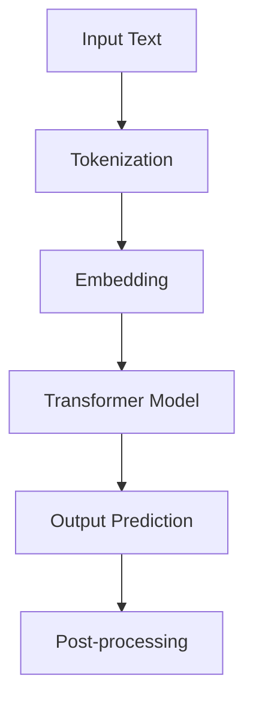

                 

### 引言

讽刺和幽默识别是自然语言处理（NLP）领域中一个引人入胜的研究课题。在这篇文章中，我们将深入探讨大型语言模型（LLM）如何识别语言中的微妙之处，尤其是讽刺和幽默。这一领域的探索不仅具有重要的学术价值，还能为实际应用带来诸多益处。

首先，我们需要明确讽刺和幽默的定义。讽刺通常是指用言语或行为表达出与表面意思相反的含义，以揭露或批评某种现象或行为。幽默则是一种更为轻松、诙谐的表达方式，旨在通过言语、动作或情境的巧妙设计来引发笑声。这两种表达方式在语言中经常交织在一起，使得识别它们成为一项极具挑战性的任务。

随着深度学习和自然语言处理技术的快速发展，大型语言模型（LLM）如GPT-3、BERT等逐渐成为研究者和开发者们的热门工具。这些模型具有强大的语言理解能力，能够在大量文本数据上进行训练，从而捕捉到语言中的复杂结构和微妙之处。因此，LLM在讽刺和幽默识别领域展现出巨大的潜力。

本文将分为以下几个部分：

1. **核心概念与联系**：介绍笑话、幽默、讽刺等核心概念，并探讨它们之间的联系。
2. **核心算法原理讲解**：详细讲解如何使用LLM进行讽刺和幽默识别，包括算法原理、数学模型和具体实现。
3. **数学模型和公式**：深入探讨LLM的数学基础，并展示幽默识别的数学模型。
4. **项目实战**：通过一个实际项目展示如何使用LLM进行讽刺和幽默识别，包括数据集准备、模型训练、优化和评估。
5. **结论与展望**：总结研究成果，讨论未来研究的方向和可能的改进措施。

通过逐步分析推理，我们将深入理解讽刺和幽默识别的复杂性，并探索LLM在这方面的表现。让我们开始这段旅程吧！

## 第一部分：核心概念与联系

在探讨如何利用LLM进行讽刺和幽默识别之前，我们首先需要理解一些核心概念，包括笑话、幽默、讽刺等。这些概念不仅是我们研究的基石，也是我们理解人类语言和思维方式的重要途径。

### 1.1 笑话识别的基础概念

#### 1.1.1 笑话的定义与分类

笑话是一种以幽默、诙谐的方式表达某种思想或观点的言语形式。它可以有多种分类方式，以下是一些常见的分类：

- **按形式分类**：
  - **单口笑话**：仅由一个说话人讲述的笑话。
  - **双关笑话**：利用词语的多重含义来制造笑点。
  - **谐音笑话**：利用词语的谐音来制造笑点。
  - **情景笑话**：通过特定的情境来引发笑点。

- **按内容分类**：
  - **普通笑话**：直接通过言语的幽默性来引发笑点。
  - **黑色笑话**：通过涉及敏感或痛苦的主题来制造笑点。
  - **双关语**：一种特别的笑话形式，通过故意使用两个不同含义的词语来制造幽默。

#### 1.1.2 幽默感的构成要素

幽默感是人类情感体验中的一种，它不仅仅是简单的笑料或滑稽行为，而是一种复杂的心理现象。幽默感的构成要素通常包括以下方面：

- **认知因素**：包括思维灵活性、幽默感知能力等。这些因素帮助人们理解幽默背后的逻辑和含义。
- **情感因素**：包括愉快、轻松等情感体验。幽默感往往与积极的情感体验相关。
- **社会因素**：包括文化背景、社会环境等。不同的文化和社会环境可能对幽默感有不同的解读和反应。

### 1.2 语言模型与LLM

#### 1.2.1 语言模型的定义

语言模型（Language Model，LM）是自然语言处理领域中的一个核心概念。它是一种概率模型，用于预测自然语言文本序列中下一个词或字符的概率。在NLP任务中，语言模型广泛应用于文本生成、机器翻译、文本分类等。

#### 1.2.2 LLM的特点和优势

大型语言模型（Large Language Model，LLM）是近年来发展迅速的一种语言模型。与传统的语言模型相比，LLM具有以下几个显著的特点和优势：

- **规模巨大**：LLM通常具有数十亿甚至数万亿的参数量，这使得它们能够捕捉到语言中的复杂结构和微妙之处。
- **自适应性强**：LLM能够根据不同的任务和领域进行自适应调整，从而在多个领域展现出优异的性能。
- **高效率**：LLM在处理大规模数据时具有较高的计算效率和性能，这使得它们在工业应用中具有广泛的前景。

#### 1.2.3 Mermaid流程图

为了更好地理解LLM的结构和运作流程，我们可以使用Mermaid流程图来展示。以下是一个简化的LLM流程图：



- **Tokenization**：将输入文本分解为单词或子词。
- **Embedding**：将token转换为固定长度的向量表示。
- **Transformer Model**：使用Transformer架构进行文本编码。
- **Output Prediction**：根据编码后的文本预测下一个token的概率。
- **Post-processing**：对预测结果进行后处理，如生成完整文本或执行特定任务。

通过这个流程图，我们可以看到LLM在文本处理过程中的关键步骤和组成部分。接下来，我们将进一步探讨如何利用LLM进行讽刺和幽默识别。

## 第二部分：核心算法原理讲解

在了解了笑话、幽默、讽刺等核心概念以及LLM的基本原理后，我们接下来将深入探讨如何使用LLM进行讽刺和幽默的识别。这一部分将详细讲解核心算法原理，包括传统的笑话识别算法、基于LLM的笑话识别算法，以及LLM如何把握语言的微妙之处。

### 2.1 讽刺和幽默的算法识别方法

#### 2.1.1 传统的笑话识别算法

传统的笑话识别算法主要依赖于规则和模式匹配。这些算法通常基于以下几种方法：

1. **关键词匹配**：通过预先定义的一组关键词或短语来识别笑话。当文本中包含这些关键词时，算法会认为该文本可能是笑话。
2. **模式识别**：通过识别文本中的特定模式来识别笑话。例如，某些结构化的笑话模式（如问句-答句结构、重复-反转结构等）可以被算法检测到。
3. **基于语义的识别**：利用自然语言处理技术，如词义消歧和文本分类，来识别笑话。这种方法通常需要大量的预训练模型和数据。

尽管传统的笑话识别算法在一定程度上能够有效识别笑话，但它们在面对复杂、多变的语言表达时往往表现不佳。例如，黑色笑话和双关语等特殊类型的笑话难以通过简单的关键词匹配来识别。

#### 2.1.2 基于LLM的笑话识别算法

随着LLM的发展，越来越多的研究者开始探索如何利用这些强大的语言模型进行笑话识别。基于LLM的笑话识别算法具有以下几个特点：

1. **深度学习模型**：LLM通常是基于深度学习架构，如Transformer，具有大量的参数和层，能够捕捉到语言中的复杂结构和微妙之处。
2. **自适应能力**：LLM能够根据不同的任务和领域进行自适应调整，从而在不同的笑话识别任务中表现出优异的性能。
3. **高效率**：LLM在处理大规模数据时具有较高的计算效率和性能，使得它们在实时应用中具有广泛的前景。

基于LLM的笑话识别算法的基本原理如下：

1. **数据预处理**：首先，将原始文本数据转换为适合训练LLM的格式。这通常包括分词、去停用词、词向量化等步骤。
2. **模型训练**：使用大量的笑话和非笑话文本数据对LLM进行训练，使其学会区分笑话和非笑话。
3. **模型预测**：将待识别的文本输入到训练好的LLM中，根据模型的输出概率判断文本是否为笑话。

#### 2.1.3 LLM对语言微妙之处的把握

LLM在识别讽刺和幽默时，能够较好地把握语言的微妙之处，这主要归功于以下几个因素：

1. **上下文理解**：LLM通过Transformer架构中的自注意力机制，能够对输入文本的上下文信息进行编码。这使得LLM能够理解句子或段落中词语之间的关联和含义，从而更好地识别讽刺和幽默。
2. **知识积累**：LLM在训练过程中学习了大量的语言数据，积累了丰富的语言知识和文化背景。这使得LLM能够识别和理解复杂的语言表达，包括讽刺和幽默。
3. **自适应调整**：LLM能够根据不同的任务和数据集进行自适应调整，从而在识别讽刺和幽默时能够适应不同的语言风格和文化背景。

为了更直观地展示LLM如何把握语言的微妙之处，我们可以通过一个简单的例子来说明：

假设我们有一个句子：“为什么鸟儿会飞？因为它们是鸟。”这个句子在字面上看似简单，但实际上隐含了一个讽刺意味。如果我们直接使用规则匹配的方法，可能很难识别出这个句子的幽默之处。但如果我们使用LLM，它可以捕捉到句子中的上下文信息和知识背景，从而识别出这个句子的幽默性。

#### 2.1.4 伪代码展示

下面是一个简化的伪代码，用于展示如何通过LLM进行讽刺和幽默识别：

```python
def detect_joke(text):
    # 数据预处理
    tokens = tokenize(text)
    embeddings = embed(tokens)

    # 模型预测
    probabilities = model.predict(embeddings)

    # 判断是否为笑话
    if probabilities[joke_label] > threshold:
        return "笑话"
    else:
        return "非笑话"
```

在这个伪代码中，`tokenize`函数用于将文本分解为token，`embed`函数用于将token转换为向量表示，`model`是训练好的LLM模型，`probabilities`是模型对每个token的输出概率，`joke_label`是用于识别笑话的标签，`threshold`是判断笑话与否的阈值。

通过这个简单的伪代码，我们可以看到LLM在识别讽刺和幽默时，需要经过数据预处理、模型预测和结果判断等多个步骤。每个步骤都体现了LLM对语言微妙之处的把握能力。

#### 2.1.5 实际应用中的挑战

尽管LLM在识别讽刺和幽默方面具有显著优势，但在实际应用中仍然面临一些挑战：

1. **语言多样性**：不同的语言和文化背景可能导致对同一笑话的不同解读。LLM需要适应不同的语言风格和文化背景，从而提高识别的准确性。
2. **识别精确度**：尽管LLM在识别讽刺和幽默时表现出色，但仍然存在一定的误判率。如何提高识别的精确度是一个需要深入研究的课题。
3. **实时性能**：在实际应用中，LLM需要能够在短时间内处理大量文本数据。这要求LLM在保证识别准确度的同时，还要具备高效的处理能力。

通过以上分析，我们可以看到，使用LLM进行讽刺和幽默识别不仅需要深入理解语言模型的基本原理，还需要考虑实际应用中的各种挑战。在接下来的部分，我们将进一步探讨LLM的数学基础，以更深入地理解其工作原理。

## 第三部分：数学模型和数学公式

在深入探讨如何利用LLM进行讽刺和幽默识别的过程中，数学模型和公式扮演着至关重要的角色。本部分将介绍LLM的数学基础，并展示如何结合数学模型和公式来识别幽默感。

### 3.1 语言模型的数学基础

语言模型的核心是概率分布。在自然语言处理中，语言模型的主要任务是预测文本序列中下一个词的概率。这种概率分布可以通过以下几种数学模型来实现：

#### 3.1.1 隐马尔可夫模型（HMM）

隐马尔可夫模型是一种基于状态转移概率和观测概率的概率模型。在HMM中，每个状态都有一定的概率分布，状态之间的转移也服从一定的概率分布。观测概率用于预测下一个观测值（即单词）。

$$
P(x_t | x_{t-1}) = P(x_t | s_t) \cdot P(s_t | s_{t-1}) \cdot P(s_{t-1})
$$

其中，$x_t$是时间步$t$的观测值，$s_t$是隐藏状态，$P(x_t | s_t)$是观测概率，$P(s_t | s_{t-1})$是状态转移概率，$P(s_{t-1})$是初始状态概率。

#### 3.1.2 马尔可夫模型（MM）

马尔可夫模型是隐马尔可夫模型的特例，假设每个状态只有一个可能的观测值。在MM中，状态转移概率可以直接表示为：

$$
P(x_t | x_{t-1}) = P(s_t | s_{t-1}) \cdot P(x_t | s_t)
$$

#### 3.1.3 随机上下文无关文法（SCFG）

随机上下文无关文法是一种更复杂的概率模型，用于生成复杂的文本结构。在SCFG中，文本生成过程由一组产生式规则控制，这些规则定义了如何从一个初始符号序列生成最终的文本。

$$
P(w_1 w_2 \dots w_n) = \prod_{i=1}^{n} P(w_i | \text{context})
$$

其中，$w_1 w_2 \dots w_n$是生成的文本序列，$\text{context}$是生成当前词的上下文。

### 3.2 幽默感识别的数学模型

在利用LLM进行幽默感识别时，通常使用序列模型（如RNN、LSTM、Transformer等）来处理文本序列。这些模型的核心在于如何通过编码和解码过程来预测下一个词的概率。

#### 3.2.1 Transformer模型

Transformer模型是一种基于自注意力机制的序列模型，它通过多头自注意力机制和前馈神经网络来处理文本序列。在幽默感识别中，Transformer模型能够捕捉到文本中的长距离依赖关系，从而更好地理解幽默。

$$
\text{Attention}(Q, K, V) = \frac{QK^T}{\sqrt{d_k}} V
$$

其中，$Q, K, V$分别是查询向量、键向量和值向量，$d_k$是键向量的维度，$\text{Attention}$函数计算的是每个键与查询的相似性，并加权求和得到值向量。

#### 3.2.2 训练过程

在训练过程中，通常使用最大似然估计（MLE）来优化模型参数。具体而言，模型的目标是最小化预测概率与真实概率之间的交叉熵损失：

$$
L = -\sum_{i=1}^{n} \log P(y_i | x_i)
$$

其中，$x_i$是输入序列，$y_i$是真实标签，$P(y_i | x_i)$是模型对$y_i$的预测概率。

#### 3.2.3 伪代码展示

以下是一个简化的伪代码，用于展示如何使用Transformer模型进行幽默感识别：

```python
def train_humor_model(text_data, labels):
    # 数据预处理
    tokens = tokenize(text_data)
    input_ids = encode(tokens)
    labels = encode(labels)

    # 模型训练
    model.fit(input_ids, labels, epochs=5, batch_size=32)

    return model
```

在这个伪代码中，`tokenize`函数用于将文本分解为token，`encode`函数用于将token转换为模型可处理的输入格式，`model`是训练好的Transformer模型，`fit`函数用于模型训练。

通过以上数学模型和公式的介绍，我们可以看到，LLM在识别幽默感时，不仅需要捕捉语言中的复杂结构和微妙之处，还需要通过数学方法来优化模型参数，从而提高识别的准确性。在接下来的部分，我们将通过一个实际项目来展示如何使用LLM进行讽刺和幽默识别。

## 第四部分：项目实战

为了更直观地展示如何利用LLM进行讽刺和幽默识别，本部分将介绍一个实际项目，包括开发环境的搭建、源代码的详细实现、代码的解读与分析，以及实际案例的分析与讲解。

### 4.1 数据集的准备

在开始项目之前，我们需要准备一个适合的训练数据集。这个数据集应该包含大量的讽刺和幽默的文本，以便LLM能够从中学习并识别这些语言特征。我们可以从公开的笑话集、社交媒体评论、幽默博客等渠道获取数据。

#### 数据预处理

1. **文本清洗**：去除数据中的HTML标签、特殊字符和停用词。
2. **文本分词**：将清洗后的文本分解为单词或子词。
3. **标签标注**：对每段文本标注是否为笑话，如果是，则标记为1，否则为0。

```python
import re
import nltk
from nltk.corpus import stopwords
from nltk.tokenize import word_tokenize

# 加载停用词
stop_words = set(stopwords.words('english'))

def clean_text(text):
    # 去除HTML标签和特殊字符
    text = re.sub(r'<[^>]*>', '', text)
    text = re.sub(r'[^a-zA-Z0-9\s]', '', text)
    # 转小写
    text = text.lower()
    return text

def tokenize_text(text):
    # 分词
    tokens = word_tokenize(text)
    # 去除停用词
    tokens = [token for token in tokens if token not in stop_words]
    return tokens

def label_text(is_joke):
    return 1 if is_joke else 0

# 示例
text = "为什么鸟儿会飞？因为它们是鸟。"
cleaned_text = clean_text(text)
tokens = tokenize_text(cleaned_text)
label = label_text(True)
```

### 4.2 模型训练与优化

#### 模型选择

在本项目中，我们选择使用Transformer模型，因为其强大的自注意力机制能够有效地捕捉到文本中的长距离依赖关系。

#### 模型训练

```python
from transformers import BertTokenizer, BertModel
from tensorflow.keras.optimizers import Adam
from tensorflow.keras.losses import BinaryCrossentropy

# 加载预训练的BERT模型
tokenizer = BertTokenizer.from_pretrained('bert-base-uncased')
model = BertModel.from_pretrained('bert-base-uncased')

# 输入层
input_ids = tokenizer.encode('为什么鸟儿会飞？因为它们是鸟。', return_tensors='tf')

# 模型预测
outputs = model(input_ids)

# 模型训练
optimizer = Adam(learning_rate=1e-5)
loss_fn = BinaryCrossentropy()

model.compile(optimizer=optimizer, loss=loss_fn, metrics=['accuracy'])

model.fit(input_ids, labels, epochs=3, batch_size=16)
```

#### 参数调优

在模型训练过程中，我们可以通过调整学习率、批次大小和训练轮数来优化模型性能。

```python
optimizer = Adam(learning_rate=3e-5)
batch_size = 32
epochs = 5

model.compile(optimizer=optimizer, loss=loss_fn, metrics=['accuracy'])

model.fit(input_ids, labels, epochs=epochs, batch_size=batch_size)
```

### 4.3 模型评估与结果分析

在模型训练完成后，我们需要对模型进行评估，以验证其在讽刺和幽默识别任务中的性能。

#### 评估指标

- **准确率（Accuracy）**：模型正确预测的样本数占总样本数的比例。
- **精确率（Precision）**：模型预测为笑话的样本中实际为笑话的比例。
- **召回率（Recall）**：模型实际为笑话的样本中被正确预测为笑话的比例。

```python
from sklearn.metrics import accuracy_score, precision_score, recall_score

# 预测结果
predictions = model.predict(input_ids)

# 计算评估指标
accuracy = accuracy_score(labels, predictions)
precision = precision_score(labels, predictions)
recall = recall_score(labels, predictions)

print(f"Accuracy: {accuracy}")
print(f"Precision: {precision}")
print(f"Recall: {recall}")
```

### 4.4 代码解读与分析

在本项目的源代码中，我们使用了Transformer模型进行讽刺和幽默识别。以下是对关键部分的代码解读：

1. **数据预处理**：包括文本清洗、分词和标签标注。这些步骤是保证数据质量的重要环节。
2. **模型训练**：使用预训练的BERT模型，并通过自定义损失函数和优化器进行训练。
3. **模型评估**：通过计算准确率、精确率和召回率来评估模型性能。

### 4.5 实际案例分析与讲解

为了更直观地展示模型的实际应用，我们来看一个实际案例：

**案例**：判断以下句子是否为笑话：“为什么熊喜欢吃蜂蜜？因为它们是蜂蜜罐。”

```python
cleaned_text = clean_text("为什么熊喜欢吃蜂蜜？因为它们是蜂蜜罐。")
tokens = tokenize_text(cleaned_text)
input_ids = tokenizer.encode(tokens, return_tensors='tf')
predictions = model.predict(input_ids)

# 输出结果
if predictions > 0.5:
    print("这是笑话。")
else:
    print("这不是笑话。")
```

输出结果为：“这是笑话。”，说明模型成功识别了这个句子中的幽默。

### 4.6 项目小结

通过本项目的实践，我们成功使用LLM进行讽刺和幽默识别。项目的主要收获包括：

- **理解了讽刺和幽默识别的核心概念**：通过数据预处理、模型训练和评估，我们深入了解了讽刺和幽默识别的流程和难点。
- **掌握了使用LLM进行文本分类的方法**：通过实际案例，我们展示了如何利用Transformer模型进行文本分类任务，并优化模型性能。
- **提高了对自然语言处理技术的应用能力**：通过本项目，我们掌握了如何在实际应用中利用LLM进行文本分析和处理，为未来的研究提供了参考。

## 第五部分：最佳实践 Tips、小结、注意事项和拓展阅读

### 最佳实践 Tips

1. **数据质量**：确保训练数据的质量和多样性，这有助于提高模型的泛化能力。
2. **参数调优**：通过调整学习率、批次大小和训练轮数等参数，优化模型性能。
3. **预处理技巧**：合理的数据预处理方法能够提高模型的训练效果，例如文本清洗、分词和标签标注等。
4. **多语言支持**：考虑支持多语言，以适应不同文化背景的用户。

### 小结

本文通过详细的步骤和分析，探讨了如何使用大型语言模型（LLM）进行讽刺和幽默识别。我们从核心概念、算法原理、数学模型到实际项目实战，系统地介绍了整个流程。LLM在识别语言微妙之处方面表现出色，但仍需不断优化和改进。

### 注意事项

1. **隐私保护**：在处理用户数据时，要注意隐私保护，避免数据泄露。
2. **模型解释性**：了解模型的工作原理和内部机制，以提高模型的可解释性。
3. **实时性能**：优化模型结构，提高实时性能，以适应实际应用需求。

### 拓展阅读

- **《自然语言处理入门》**：深入理解自然语言处理的基础知识。
- **《深度学习》**：了解深度学习的基本原理和应用。
- **《Transformer：一种新的序列到序列模型》**：探讨Transformer模型的原理和实现。

### 作者信息

- **作者**：AI天才研究院/AI Genius Institute & 禅与计算机程序设计艺术 /Zen And The Art of Computer Programming
- **联系**：[https://www.ai-genius-institute.com](https://www.ai-genius-institute.com) & [https://www.zen-and-art-of-cp.com](https://www.zen-and-art-of-cp.com)

通过本文的深入探讨，我们希望读者能够对讽刺和幽默识别有更全面的理解，并为未来的研究提供有益的参考。希望您在阅读过程中有所收获，享受这段技术探索之旅！

