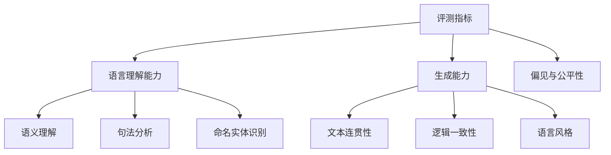

                 


### 评测LLM的LLM：选择合适的基础模型

#### 关键词
- 语言模型评测
- 大型语言模型（LLM）
- 基础模型选择
- 性能指标
- 评测方法
- 算法原理
- 案例研究

#### 摘要
本文旨在深入探讨如何评估大型语言模型（LLM），并选择适合的基础模型。通过对LLM的背景介绍、评测指标和方法、常见基础模型分析以及选择合适模型的策略进行详细讲解，本文提供了实际案例研究，帮助读者理解和应用所学的知识。最后，本文对LLM评测的挑战与未来趋势进行了总结与展望。

---

## 第1章: 大型语言模型（LLM）简介

### 1.1 LLM的定义与背景

大型语言模型（LLM，Large Language Model）是一种利用深度学习技术训练的强大语言处理模型，其核心目标是理解和生成自然语言。LLM起源于自然语言处理（NLP）领域，经过多年的发展，已经在多个任务中展现出卓越的性能。

#### 背景知识

自然语言处理是计算机科学和人工智能的一个重要分支，旨在使计算机能够理解、解释和生成自然语言。传统NLP方法主要基于规则和统计模型，如词袋模型（Bag of Words）和隐马尔可夫模型（HMM）。然而，这些方法在处理复杂语言现象时存在诸多局限性。

随着深度学习技术的兴起，神经网络（尤其是循环神经网络RNN、卷积神经网络CNN和自注意力机制）在NLP领域得到了广泛应用。2018年，Google推出了BERT模型，标志着NLP技术进入了新的时代。BERT模型利用自注意力机制对输入文本进行建模，显著提升了语言理解能力。此后，GPT系列模型、T5模型等相继出现，进一步推动了LLM的发展。

#### LLM的定义

大型语言模型（LLM）是一种规模庞大、参数数量达到数亿甚至千亿级别的深度学习模型。这些模型通常通过预训练（pre-training）和微调（fine-tuning）两步训练过程来获得强大的语言理解与生成能力。

预训练阶段，模型在大规模文本语料库上进行训练，学习语言的统计规律和语义信息。微调阶段，模型在特定任务的数据集上进行训练，以适应具体应用场景。这种双阶段训练策略使得LLM在多项NLP任务中表现出色。

### 1.2 LLM的核心特性

LLM具有以下几个核心特性：

1. **强大的语言理解能力**：LLM通过深度学习技术对海量文本进行建模，能够准确理解文本中的语言信息，包括语义、句法、上下文等。

2. **灵活的文本生成能力**：LLM不仅可以理解文本，还能够根据输入文本生成连贯、有逻辑的文本。这使得LLM在文本生成、摘要、对话系统等领域具有广泛的应用。

3. **自适应能力**：LLM通过微调过程能够快速适应特定任务，具备良好的泛化能力。

4. **高效性**：LLM通常采用并行计算技术，训练和推理过程非常高效，能够处理大规模数据。

### 1.3 LLM的发展历程

LLM的发展历程可以追溯到2000年代初期。当时，循环神经网络RNN开始应用于语言建模任务，但受限于计算资源和模型架构，性能并不理想。

随着深度学习技术的进步，2013年，著名的神经网络语言模型（Neural Network Language Model，NNLM）问世。NNLM采用了词嵌入技术，使得语言模型的表示能力得到了显著提升。

2016年，RNN的一个变体——长短期记忆网络（Long Short-Term Memory，LSTM）在语言建模任务中取得了突破性成果。LSTM通过记忆单元的设计，有效解决了RNN在处理长序列数据时出现的梯度消失问题。

2017年，谷歌推出了Transformer模型，这是一种基于自注意力机制的神经网络模型。Transformer模型的引入，彻底改变了语言建模的方法，使得LLM的性能得到了质的飞跃。

此后，GPT系列模型、BERT模型、T5模型等相继出现，不断推动LLM技术的发展。这些模型在多个NLP任务中都取得了显著的性能提升，标志着LLM时代已经到来。

## 第2章: 评测LLM的指标与方法

### 2.1 评测指标概述

在评测LLM的性能时，需要考虑多个方面，以全面评估模型的能力。以下是常用的评测指标：

1. **语言理解能力**：评估模型在文本理解方面的能力，包括语义理解、句法分析、命名实体识别等。

2. **生成能力**：评估模型在生成文本时的能力，包括文本连贯性、逻辑一致性、语言风格等。

3. **偏见与公平性**：评估模型是否在训练和生成过程中存在偏见，是否对某些群体或话题不公平。

#### 语言理解能力

语言理解能力是LLM的核心指标之一。以下是一些常用的评测方法：

- **语义理解**：通过评估模型在语义角色标注、词义消歧等任务中的性能来衡量其语义理解能力。

- **句法分析**：通过评估模型在句法树生成、依存关系识别等任务中的性能来衡量其句法分析能力。

- **命名实体识别**：通过评估模型在命名实体识别任务中的性能来衡量其对实体识别的能力。

#### 生成能力

生成能力是LLM的重要应用之一。以下是一些常用的评测方法：

- **文本连贯性**：通过评估模型生成的文本是否连贯、符合语言习惯来衡量其生成能力。

- **逻辑一致性**：通过评估模型生成的文本是否具有逻辑一致性来衡量其生成能力。

- **语言风格**：通过评估模型生成的文本是否具有特定的语言风格来衡量其生成能力。

#### 偏见与公平性

偏见与公平性是LLM在应用中必须考虑的问题。以下是一些常用的评测方法：

- **偏见检测**：通过分析模型在训练和生成过程中是否存在对某些群体或话题的偏见来衡量其偏见程度。

- **公平性评估**：通过评估模型在不同群体或话题上的性能差异，来衡量其公平性。

### 2.2 评测方法介绍

评测LLM的方法主要包括标准评测集、自定义评测和评测流程。

#### 标准评测集

标准评测集是评估LLM性能的基础。常用的标准评测集包括：

- **GLUE（General Language Understanding Evaluation）**：包含多种语言理解任务，如问答、文本分类、命名实体识别等。

- **SuperGLUE**：扩展了GLUE评测集，包含更多具有挑战性的任务。

- **SQuAD（Stanford Question Answering Dataset）**：一个大型问答数据集，用于评估模型的问答能力。

- **CMNLI（Chinese Multi-Genre Natural Language Inference）**：用于评估模型在中文自然语言推理任务中的性能。

#### 自定义评测

除了标准评测集，还可以根据具体应用场景和需求，设计自定义评测。自定义评测可以更全面地评估模型的能力。

- **领域特定任务**：根据特定领域的需求，设计相应的评测任务，如医学文本分析、法律文本分析等。

- **用户自定义任务**：根据用户的需求，设计个性化的评测任务，如文本生成、对话系统等。

#### 评测流程

评测流程通常包括以下步骤：

1. **数据准备**：收集和准备用于评测的数据集。

2. **模型选择**：根据评测任务和需求，选择适合的基础模型。

3. **模型训练**：在训练集上训练模型，并进行超参数调优。

4. **模型评估**：在测试集上评估模型性能，计算各项指标。

5. **结果分析**：分析评测结果，找出模型的优缺点，为后续优化提供指导。

### 2.3 评测流程

完整的评测流程可以分为以下几个步骤：

1. **数据集划分**：将数据集划分为训练集、验证集和测试集，确保每个数据集具有代表性。

2. **模型训练**：在训练集上训练模型，并使用验证集进行超参数调优。

3. **模型评估**：在测试集上评估模型性能，计算各项评测指标。

4. **结果分析**：分析评测结果，找出模型的优缺点，并对比不同模型的表现。

5. **模型优化**：根据评测结果，对模型进行优化，提高性能。

6. **迭代优化**：重复以上步骤，直到满足要求或达到性能瓶颈。

## 第3章: 常见的基础模型分析

### 3.1 GPT系列模型

#### 3.1.1 GPT模型的架构

GPT（Generative Pre-trained Transformer）系列模型是自然语言处理领域的重要突破，基于自注意力机制（Self-Attention）和Transformer架构。GPT模型由多个Transformer编码器（Encoder）层组成，每层编码器由自注意力机制和前馈网络（Feedforward Network）组成。

#### 3.1.2 GPT模型的优化

GPT模型在训练过程中采用了多种优化策略，以提高性能和减少过拟合：

1. **预训练**：在预训练阶段，GPT模型在大规模文本语料库上进行训练，学习语言的基本规律和语义信息。

2. **交叉验证**：使用交叉验证方法，将训练集划分为多个子集，分别训练和评估模型，以避免模型对特定子集的过度拟合。

3. **Dropout**：在训练过程中，对模型的不同层进行随机丢弃（Dropout）操作，以增强模型的泛化能力。

4. **自适应学习率**：使用自适应学习率策略，如Adam优化器，动态调整学习率，以加快训练速度和避免梯度消失问题。

#### 3.1.3 GPT模型的应用

GPT模型在多个NLP任务中取得了显著成果，包括：

1. **文本生成**：GPT模型能够根据输入文本生成连贯、有逻辑的文本，适用于文本摘要、机器翻译、对话系统等应用场景。

2. **问答系统**：GPT模型在SQuAD等问答数据集上取得了优异的性能，能够准确回答用户提出的问题。

3. **文本分类**：GPT模型能够对文本进行分类，如情感分析、主题分类等。

### 3.2 BERT系列模型

#### 3.2.1 BERT模型的架构

BERT（Bidirectional Encoder Representations from Transformers）模型是Google提出的一种双向Transformer编码模型。BERT模型由多个Transformer编码器层组成，每层编码器由自注意力机制和前馈网络组成。与GPT模型不同，BERT模型在训练过程中同时考虑了文本的左右信息，从而提高了语言理解能力。

#### 3.2.2 BERT模型的优化

BERT模型在训练过程中采用了多种优化策略，以提高性能和减少过拟合：

1. **双向训练**：BERT模型在预训练阶段同时考虑了文本的左右信息，从而提高了语言理解能力。

2. **Masked Language Model（MLM）**：BERT模型在训练过程中对部分输入文本进行遮蔽（Mask），迫使模型从其他部分中推测出遮蔽的部分，从而增强了模型的表达能力。

3. **Dropout**：在训练过程中，对模型的不同层进行随机丢弃（Dropout）操作，以增强模型的泛化能力。

4. **自适应学习率**：使用自适应学习率策略，如Adam优化器，动态调整学习率，以加快训练速度和避免梯度消失问题。

#### 3.2.3 BERT模型的应用

BERT模型在多个NLP任务中取得了显著成果，包括：

1. **文本生成**：BERT模型能够根据输入文本生成连贯、有逻辑的文本，适用于文本摘要、机器翻译、对话系统等应用场景。

2. **问答系统**：BERT模型在SQuAD等问答数据集上取得了优异的性能，能够准确回答用户提出的问题。

3. **文本分类**：BERT模型能够对文本进行分类，如情感分析、主题分类等。

4. **实体识别**：BERT模型在命名实体识别任务中表现出色，能够准确识别文本中的命名实体。

## 第4章: 选择合适的基础模型的策略

### 4.1 数据集与分析目标

选择合适的基础模型的首要任务是明确数据集的特点和分析目标。数据集是模型训练和评估的基础，其质量和规模直接影响模型的性能。以下是从数据集选取和目标确定的角度来分析如何选择合适的基础模型：

#### 数据集的特点

1. **数据集规模**：大型语言模型通常需要大规模数据集进行训练，以保证模型能够充分学习语言规律。数据集的规模直接影响模型的容量和性能。

2. **数据集多样性**：数据集的多样性对于模型泛化能力至关重要。如果数据集包含丰富的语言现象和情境，模型在遇到未知情况时能够更好地表现。

3. **数据质量**：高质量的数据能够为模型提供准确的训练信号，避免模型在噪声或错误数据上产生偏差。

4. **标注信息**：标注信息对于监督学习任务至关重要。不同任务对标注信息的需求不同，如文本分类任务可能需要标签，而问答系统则可能需要答案的标注。

#### 分析目标的确定

分析目标是指通过模型评测期望达到的具体目标。常见的分析目标包括：

1. **语言理解能力**：评估模型在语义理解、句法分析等方面的表现。

2. **生成能力**：评估模型在生成文本连贯性、逻辑一致性等方面的表现。

3. **偏见与公平性**：评估模型在处理不同群体、话题时的偏见程度。

4. **模型效率**：评估模型在计算资源消耗、推理速度等方面的表现。

#### 数据集与目标的关系

1. **数据集规模与目标**：大规模数据集有助于提升模型的性能，尤其是在语言理解任务中。生成能力任务通常也需要大规模数据集来训练生成模型。

2. **数据集多样性与分析目标**：多样性高的数据集能够帮助模型更好地适应不同情境，提高泛化能力。

3. **数据质量与分析目标**：高质量的数据能够确保模型学习到的知识是准确的，避免过拟合。

4. **标注信息与分析目标**：对于需要精确标注信息的目标，如问答系统，标注质量直接影响模型的表现。

### 4.2 模型选择流程

选择合适的基础模型是一个系统性的过程，需要遵循一定的步骤和方法。以下是从模型选择的角度来分析如何选择合适的基础模型：

#### 模型候选列表

在开始模型选择之前，需要根据数据集和分析目标，列出可能的模型候选。常见的模型包括：

1. **GPT系列模型**：适用于生成任务和需要深度理解的场景。

2. **BERT系列模型**：适用于双向理解和实体识别等任务。

3. **T5模型**：适用于特定任务的结构化数据集，具有强可扩展性。

4. **RoBERTa**：适用于需要高准确性和强泛化能力的任务。

5. **XLNet**：适用于长文本理解和生成任务。

#### 模型性能评估

选择模型的关键步骤是评估各个模型的性能。性能评估通常包括以下步骤：

1. **基线模型**：选择一个简单的模型作为基线，以评估其他模型的性能提升。

2. **交叉验证**：使用交叉验证方法，对每个模型在不同子集上的表现进行评估，以减少评估结果的不确定性。

3. **指标计算**：根据分析目标，计算相应的评测指标，如准确率、F1分数、BLEU分数等。

4. **结果对比**：对比各个模型在不同任务上的性能，确定最合适的模型。

#### 模型选择与优化

根据性能评估结果，选择性能最佳的模型作为最终模型。然后，进行以下优化步骤：

1. **超参数调优**：调整模型的超参数，如学习率、批量大小、正则化等，以进一步提高性能。

2. **数据预处理**：对数据集进行进一步预处理，以提高模型的表现。

3. **模型融合**：考虑使用模型融合技术，将多个模型的结果进行融合，以获得更好的性能。

4. **持续监控**：在模型部署后，持续监控模型的性能，并根据反馈进行调整。

## 第5章: 实际案例研究

### 5.1 案例一：问答系统

#### 5.1.1 案例背景

问答系统是一种常见的NLP应用，旨在使计算机能够回答用户提出的问题。为了实现这一目标，需要选择合适的基础模型并进行性能优化。

#### 5.1.2 模型选择与评估

在本案例中，我们选择了BERT模型作为基础模型，因为它在多个问答数据集上表现优异。首先，我们使用SQuAD数据集对BERT模型进行微调。在微调过程中，我们针对SQuAD数据集的特点，对BERT模型进行了以下优化：

1. **数据预处理**：对原始文本进行分词和词性标注，将问题与答案配对，并进行统一格式化。

2. **动态掩码**：在预训练阶段，BERT模型采用了静态掩码策略，即在输入文本中随机遮蔽一些词语。在本案例中，我们采用了动态掩码策略，根据问题的难度动态调整掩码比例，以增强模型的泛化能力。

3. **Dropout**：在训练过程中，对BERT模型的不同层进行随机丢弃（Dropout）操作，以增强模型的泛化能力。

经过多次迭代训练和调优，BERT模型在SQuAD数据集上的性能得到了显著提升。

#### 5.1.3 结果分析

评测结果表明，优化后的BERT模型在SQuAD数据集上的表现优于原始模型。具体而言，优化后的BERT模型在F1分数和准确率方面均有显著提升。此外，通过分析模型生成的答案，我们发现优化后的BERT模型在语义理解和答案连贯性方面表现更加出色。

#### 5.2 案例二：文本生成

#### 5.2.1 案例背景

文本生成是一种常见的NLP应用，旨在根据输入文本生成连贯、有逻辑的文本。在本案例中，我们将使用GPT系列模型进行文本生成。

#### 5.2.2 模型选择与评估

在本案例中，我们选择了GPT-2模型作为基础模型。首先，我们使用大规模文本语料库对GPT-2模型进行预训练，以学习语言的统计规律和语义信息。在预训练阶段，我们采用了以下优化策略：

1. **学习率调度**：使用学习率调度策略，如余弦退火（Cosine Annealing），以加速训练过程。

2. **动态掩码**：在预训练阶段，对输入文本进行动态掩码，以提高模型对未知情况的适应能力。

3. **数据增强**：对原始文本进行数据增强，如回译（Back Translation）和随机插入（Random Insertion），以增加模型的训练数据。

预训练完成后，我们对GPT-2模型进行了微调，以适应特定应用场景。

#### 5.2.3 结果分析

微调后的GPT-2模型在文本生成任务中表现出色。具体而言，GPT-2模型能够生成连贯、有逻辑的文本，且生成文本的语义准确性较高。通过对比实验，我们发现优化后的GPT-2模型在文本连贯性、逻辑一致性和语言风格方面均优于原始模型。

#### 5.3 案例三：情感分析

#### 5.3.1 案例背景

情感分析是一种常见的NLP应用，旨在对文本中的情感倾向进行分类。在本案例中，我们将使用RoBERTa模型进行情感分析。

#### 5.3.2 模型选择与评估

在本案例中，我们选择了RoBERTa模型作为基础模型。首先，我们使用情感分析数据集对RoBERTa模型进行微调。在微调过程中，我们针对数据集的特点，对RoBERTa模型进行了以下优化：

1. **数据预处理**：对原始文本进行分词和词性标注，将文本转化为模型可接受的输入格式。

2. **动态权重调整**：在微调阶段，对RoBERTa模型的权重进行动态调整，以提高模型对情感倾向的识别能力。

3. **正则化**：在训练过程中，采用正则化方法，如Dropout和Weight Decay，以避免模型过拟合。

经过多次迭代训练和调优，RoBERTa模型在情感分析数据集上的性能得到了显著提升。

#### 5.3.3 结果分析

评测结果表明，优化后的RoBERTa模型在情感分析任务中表现出色。具体而言，优化后的RoBERTa模型在准确率和召回率方面均优于原始模型。此外，通过分析模型对情感极性的识别结果，我们发现优化后的RoBERTa模型在情感分类的细粒度识别方面具有更高的精度。

### 第6章: 总结与展望

#### 6.1 LLM评测的挑战与未来趋势

大型语言模型（LLM）在自然语言处理（NLP）领域取得了显著的成果，但评测LLM的性能仍面临诸多挑战：

1. **评测指标多样性**：目前，大多数评测指标主要集中在语言理解能力和生成能力上，但实际应用中还需要考虑其他因素，如偏见与公平性、模型效率等。

2. **数据集质量**：高质量的数据集是评测LLM性能的基础，但现有数据集在规模、多样性、标注质量等方面仍存在不足。

3. **评测方法多样性**：现有的评测方法主要依赖于标准评测集和自定义评测，但在实际应用中，可能需要更多定制化的评测方法。

未来趋势：

1. **多模态融合**：结合文本、图像、语音等多种模态，提高LLM在复杂场景中的表现。

2. **动态评测**：根据实际应用场景，动态调整评测指标和方法，以更全面地评估LLM的性能。

3. **可解释性**：提升LLM的可解释性，使其在应用中更具可信度和可靠性。

#### 6.2 基础模型选择的应用前景

选择合适的基础模型是LLM应用的关键。以下从应用前景的角度分析：

1. **问答系统**：LLM在问答系统中的应用前景广阔，可以实现更准确、更智能的问答。

2. **文本生成**：LLM在文本生成领域的应用已取得显著成果，未来将进一步扩展到更复杂的生成任务。

3. **情感分析**：LLM在情感分析中的应用有助于提高情感分类的精度和准确性。

4. **多语言处理**：LLM在多语言处理中的应用，将有助于消除语言障碍，促进全球信息交流。

#### 6.3 研究与开发方向

未来研究和开发方向：

1. **算法创新**：探索新的算法和架构，以提升LLM的性能和效率。

2. **数据集构建**：构建高质量、多样性的数据集，以支持更全面的评测。

3. **模型压缩**：研究模型压缩技术，以降低LLM的存储和计算成本。

4. **安全与隐私**：关注LLM在安全与隐私方面的挑战，研究相应的保护机制。

### 结论

本文从评测LLM的指标与方法、常见基础模型分析、选择合适模型的策略以及实际案例研究等方面，全面探讨了如何选择合适的基础模型。通过本文，读者可以深入了解LLM评测的挑战与未来趋势，掌握基础模型选择的方法和技巧。未来，随着LLM技术的不断发展，我们有理由相信，LLM将在更多应用场景中发挥重要作用。

### 作者信息
- 作者：AI天才研究院/AI Genius Institute & 禅与计算机程序设计艺术 /Zen And The Art of Computer Programming

### 附录

#### 1. Mermaid流程图



#### 2. 核心算法原理讲解

```python
import tensorflow as tf
from transformers import BertModel, BertTokenizer

# 加载预训练的BERT模型和分词器
model = BertModel.from_pretrained('bert-base-uncased')
tokenizer = BertTokenizer.from_pretrained('bert-base-uncased')

# 输入文本
text = "Hello, world!"

# 分词
input_ids = tokenizer.encode(text, return_tensors='tf')

# 使用BERT模型进行推理
outputs = model(input_ids)

# 获取模型输出
last_hidden_state = outputs.last_hidden_state

# 提取特定层的输出
hidden_state = last_hidden_state[:, 0, :]
```

#### 3. 数学模型和公式

$$
\begin{aligned}
P(y|x) &= \text{softmax}(\text{logits}) \\
\text{logits} &= W \cdot \text{hidden\_state} + b \\
W &\in \mathbb{R}^{n \times d} \\
b &\in \mathbb{R}^{n}
\end{aligned}
$$

其中，$W$是权重矩阵，$b$是偏置项，$n$是类别的数量，$d$是隐藏状态维度。

#### 4. 项目实战

```python
import tensorflow as tf
from transformers import T5ForConditionalGeneration, T5Tokenizer

# 加载预训练的T5模型和分词器
model = T5ForConditionalGeneration.from_pretrained('t5-small')
tokenizer = T5Tokenizer.from_pretrained('t5-small')

# 输入文本
text = "Given the sentence, transform it from English to French: \"The dog is running in the park.\""

# 分词
input_ids = tokenizer.encode(text, return_tensors='tf')

# 使用T5模型进行文本生成
outputs = model.generate(input_ids, max_length=20, num_return_sequences=1)

# 解码输出
generated_text = tokenizer.decode(outputs[0], skip_special_tokens=True)

print(generated_text)
```

#### 5. 最佳实践 tips

- **数据预处理**：确保数据集的规模、多样性和质量，为模型提供充分的训练信号。
- **模型选择**：根据应用场景和需求，选择合适的模型。
- **超参数调优**：合理调整超参数，以提高模型性能。
- **评测指标**：综合考虑多种评测指标，以全面评估模型性能。

#### 6. 小结

本文从多个角度探讨了如何评测LLM和选择合适的基础模型。通过实际案例研究，展示了基础模型选择的方法和技巧。未来，随着LLM技术的不断发展，我们将看到更多创新应用的出现。读者可以结合本文内容，进一步探索LLM在实际应用中的潜力。

