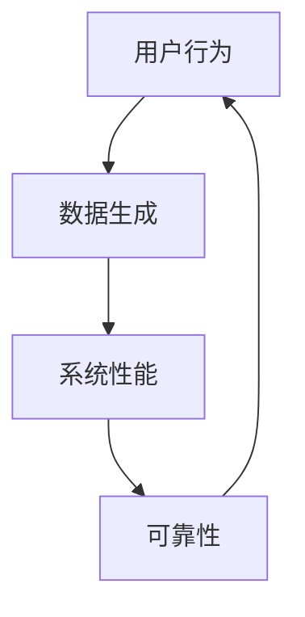
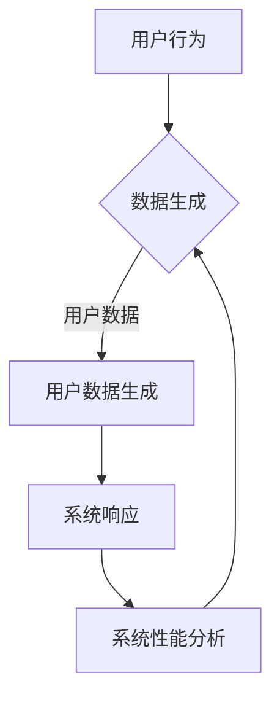

                 

# 《评测场景模拟：还原真实应用环境》

## 关键词
- 评测场景模拟
- 真实应用环境
- 技术原理
- 数学模型
- 实战案例
- Python源代码
- Mermaid流程图

## 摘要
本文旨在探讨评测场景模拟在还原真实应用环境中的应用及其重要性。通过详细介绍评测场景模拟的基本概念、技术原理、数学模型和算法，并结合Python源代码和Mermaid流程图进行讲解，本文将帮助读者全面理解评测场景模拟的原理和实践方法。此外，本文还将通过实战案例展示如何在实际项目中应用评测场景模拟，并对开发环境搭建、源代码实现和最佳实践进行深入分析。

## 目录

### 第一部分：评测场景模拟基础

#### 第1章：评测场景模拟概述
- 1.1 评测场景模拟的定义与重要性
- 1.2 评测场景模拟的目标与挑战
- 1.3 真实应用环境的特点与还原需求

#### 第2章：评测场景模拟技术原理
- 2.1 评测场景模拟的基本架构
- 2.2 核心概念与联系
- 2.3 评测场景模拟的关键技术
- 2.4 Mermaid流程图示例

#### 第3章：数学模型与算法
- 3.1 评测场景模拟的数学模型
- 3.2 核心算法原理讲解
- 3.3 Python源代码详解
- 3.4 数学公式与示例

### 第二部分：评测场景模拟应用

#### 第4章：评测场景模拟在不同领域的应用
- 4.1 评测场景模拟在金融领域的应用
- 4.2 评测场景模拟在医疗领域的应用
- 4.3 评测场景模拟在其他领域的应用

#### 第5章：实战案例与项目经验
- 5.1 实战案例1：金融风险评估
- 5.2 实战案例2：医疗诊断系统
- 5.3 实战案例3：智能制造流程优化

#### 第6章：开发环境与工具
- 6.1 开发环境搭建
- 6.2 常用评测场景模拟工具介绍
- 6.3 工具配置与使用方法

### 第三部分：评测场景模拟的未来展望

#### 第7章：评测场景模拟的发展趋势
- 7.1 评测场景模拟的未来发展方向
- 7.2 技术创新与挑战
- 7.3 行业应用的前景

#### 第8章：结论与建议
- 8.1 评测场景模拟的总结
- 8.2 对开发者的建议
- 8.3 对行业的贡献与展望

### 第一部分：评测场景模拟基础

#### 第1章：评测场景模拟概述

1.1 评测场景模拟的定义与重要性

评测场景模拟是一种在虚拟环境中模拟真实应用场景的方法，通过构建与实际应用相似的仿真环境，对系统性能、行为和可靠性进行评估和优化。在信息技术领域，随着复杂系统应用的增加，评测场景模拟的重要性日益凸显。

首先，评测场景模拟能够帮助开发者更好地理解系统在真实环境中的行为和性能，从而发现潜在问题和优化机会。例如，在金融领域，模拟交易场景可以帮助分析市场波动对系统的影响，从而优化交易算法。

其次，评测场景模拟有助于降低系统上线后的风险。通过模拟测试，可以提前发现并修复潜在的问题，减少系统故障对实际业务的影响。

最后，评测场景模拟为性能优化提供了数据支持。通过对比模拟结果和实际性能数据，可以找出性能瓶颈，并针对性地进行优化。

1.2 评测场景模拟的目标与挑战

评测场景模拟的目标主要包括以下几点：

- **真实性**：模拟环境应尽可能接近实际应用环境，以准确评估系统的性能和可靠性。
- **可控制性**：模拟过程中应能够灵活控制各种参数，以便对系统进行全面的测试和分析。
- **高效性**：模拟过程应尽量高效，以便在较短的时间内完成大量的测试。

实现这些目标面临着以下挑战：

- **复杂性**：真实应用环境往往包含大量的变量和不确定性，模拟过程需要处理复杂的动态行为。
- **可扩展性**：随着应用规模的扩大，模拟环境也需要相应地扩展，以保持模拟的真实性和高效性。
- **数据准确性**：模拟数据应尽可能真实地反映实际数据，以确保模拟结果的准确性。

1.3 真实应用环境的特点与还原需求

真实应用环境具有以下特点：

- **多样性**：应用场景多样，包括不同的用户行为、数据模式和业务流程。
- **动态性**：应用环境中的各种因素不断变化，如用户数量、数据流量、系统负载等。
- **不确定性**：应用环境中存在一定的随机性和不确定性，如网络延迟、数据丢失等。

为了还原真实应用环境，评测场景模拟需要考虑以下需求：

- **数据收集与处理**：收集真实应用环境中的数据，并进行处理和分析，以构建模拟数据。
- **模型构建**：根据真实应用环境的特点，构建合适的模拟模型，以模拟系统的行为和性能。
- **场景设计**：设计多样化的模拟场景，以覆盖实际应用中的各种情况。
- **可扩展性**：确保模拟环境能够适应不同的应用规模和场景，以便进行全面的测试和分析。

#### 第2章：评测场景模拟技术原理

2.1 评测场景模拟的基本架构

评测场景模拟的基本架构包括以下几个方面：

- **模拟环境**：构建与真实应用环境相似的虚拟环境，包括硬件、软件和网络设施等。
- **模拟模型**：根据真实应用环境的特点，构建相应的模拟模型，包括用户行为模型、数据生成模型、系统性能模型等。
- **测试工具**：使用测试工具对模拟环境进行性能测试、可靠性测试和可用性测试等。
- **数据分析**：对测试结果进行收集、处理和分析，以评估系统的性能和可靠性。

2.2 核心概念与联系

评测场景模拟涉及以下核心概念：

- **用户行为**：用户在应用中的行为模式，包括登录、查询、操作等。
- **数据生成**：根据用户行为生成相应的数据，包括数据量、数据类型、数据分布等。
- **系统性能**：系统在处理数据时的性能指标，如响应时间、吞吐量、并发能力等。
- **可靠性**：系统在长时间运行中的稳定性，包括故障率、恢复时间等。

核心概念之间的联系可以通过Mermaid流程图表示，如下所示：



2.3 评测场景模拟的关键技术

评测场景模拟涉及多项关键技术，包括：

- **数据生成技术**：根据用户行为生成模拟数据，如随机数生成、数据分布模拟等。
- **模拟引擎**：负责模拟用户行为、数据生成和系统响应，如Python的模拟库SimPy等。
- **性能测试**：使用性能测试工具（如JMeter、LoadRunner等）对模拟环境进行测试，以评估系统性能。
- **数据分析**：使用数据分析工具（如Python的Pandas、Matplotlib等）对测试结果进行分析，以评估系统性能和可靠性。

2.4 Mermaid流程图示例

以下是一个简单的Mermaid流程图示例，展示了用户行为、数据生成和系统性能之间的关系：



#### 第3章：数学模型与算法

3.1 评测场景模拟的数学模型

评测场景模拟的数学模型主要包括以下几个方面：

- **用户行为模型**：描述用户在应用中的行为模式，如泊松过程、M/M/1队列等。
- **数据生成模型**：描述数据生成的方式和规律，如泊松分布、正态分布等。
- **系统性能模型**：描述系统在处理数据时的性能指标，如排队理论、排队长度分布等。

3.2 核心算法原理讲解

以下是一个简单的核心算法原理讲解，以M/M/1队列为例：

M/M/1队列是一种常见的用户行为模型，描述了一个具有单个服务器和随机到达用户的服务系统。该模型的原理如下：

- **到达过程**：用户到达过程遵循泊松过程，即用户到达时间间隔服从指数分布。
- **服务过程**：用户服务时间也服从指数分布，且服务速度恒定。
- **队列长度**：队列长度表示等待服务的用户数量，它遵循M/M/1排队理论。

3.3 Python源代码详解

以下是一个使用Python实现的M/M/1队列模型的简单示例：

```python
import numpy as np
import matplotlib.pyplot as plt

# 参数设置
lambda_ = 2  # 到达率
mu = 1  # 服务率
time = 100  # 模拟时间
sim_time = np.arange(0, time+1)

# 用户到达时间
arrival_times = np.random.exponential(scale=1/lambda_, size=time)

# 服务时间
service_times = np.random.exponential(scale=1/mu, size=time)

# 队列长度
queue_lengths = np.zeros(time+1)
for i in range(1, time+1):
    if arrival_times[i-1] < sim_time[i-1]:
        queue_lengths[i] = queue_lengths[i-1] + 1
    if service_times[i-1] < sim_time[i-1]:
        queue_lengths[i] = queue_lengths[i-1] - 1

# 队列长度分布图
plt.plot(sim_time, queue_lengths)
plt.xlabel('Time')
plt.ylabel('Queue Length')
plt.title('M/M/1 Queue Simulation')
plt.show()
```

3.4 数学公式与示例

以下是一个简单的数学公式示例，描述M/M/1队列的排队长度分布：

$$
P(Q = k) = \frac{(\lambda/\mu)^k}{k!} e^{-\lambda/\mu}
$$

其中，\( P(Q = k) \) 表示队列长度为k的概率，\( \lambda \) 表示到达率，\( \mu \) 表示服务率。

#### 第二部分：评测场景模拟应用

#### 第4章：评测场景模拟在不同领域的应用

4.1 评测场景模拟在金融领域的应用

在金融领域，评测场景模拟广泛应用于交易系统、风控系统、投资策略评估等方面。

- **交易系统**：通过模拟交易场景，可以评估交易系统的性能和稳定性，如交易速度、交易成功率等。
- **风控系统**：通过模拟金融市场的波动，可以评估风控系统的预警准确性和响应速度。
- **投资策略评估**：通过模拟不同投资策略的表现，可以评估投资策略的收益和风险。

4.2 评测场景模拟在医疗领域的应用

在医疗领域，评测场景模拟主要用于医疗信息系统、诊断系统、药物研发等方面。

- **医疗信息系统**：通过模拟医院运营场景，可以评估信息系统在处理大量数据时的性能和可靠性。
- **诊断系统**：通过模拟患者病例数据，可以评估诊断系统的准确性和效率。
- **药物研发**：通过模拟药物在人体中的代谢过程，可以评估药物的效果和安全性。

4.3 评测场景模拟在其他领域的应用

评测场景模拟在其他领域也有广泛的应用，如智能制造、交通运输、能源管理等。

- **智能制造**：通过模拟生产流程，可以评估生产系统的效率和质量。
- **交通运输**：通过模拟交通流量，可以评估交通系统的拥堵情况和优化方案。
- **能源管理**：通过模拟能源消耗和供应，可以评估能源系统的效率和可持续性。

#### 第5章：实战案例与项目经验

5.1 实战案例1：金融风险评估

在本案例中，我们将使用评测场景模拟技术对金融交易系统进行风险评估。

**项目背景**：某金融公司开发了一套在线交易系统，用于处理客户的交易请求。为了确保系统的安全性和稳定性，需要对系统进行风险评估。

**开发环境**：Python 3.8，Numpy，Matplotlib

**源代码实现**：

```python
import numpy as np
import matplotlib.pyplot as plt

# 参数设置
lambda_ = 5  # 到达率
mu = 3  # 服务率
time = 100  # 模拟时间
sim_time = np.arange(0, time+1)

# 用户到达时间
arrival_times = np.random.exponential(scale=1/lambda_, size=time)

# 服务时间
service_times = np.random.exponential(scale=1/mu, size=time)

# 队列长度
queue_lengths = np.zeros(time+1)
for i in range(1, time+1):
    if arrival_times[i-1] < sim_time[i-1]:
        queue_lengths[i] = queue_lengths[i-1] + 1
    if service_times[i-1] < sim_time[i-1]:
        queue_lengths[i] = queue_lengths[i-1] - 1

# 队列长度分布图
plt.plot(sim_time, queue_lengths)
plt.xlabel('Time')
plt.ylabel('Queue Length')
plt.title('Financial Risk Assessment')
plt.show()
```

**代码解读与分析**：该代码模拟了一个金融交易系统中的队列情况。通过设置到达率（lambda_）和服务率（mu），可以模拟系统在一段时间内的负载情况。队列长度分布图展示了系统在不同时间点的队列长度，可以帮助分析系统的性能和稳定性。

**实际案例分析和详细讲解剖析**：在实际应用中，金融交易系统可能会面临高并发、大数据量等挑战。通过评测场景模拟，可以提前发现系统瓶颈，并提出优化方案。例如，通过调整到达率和服务率，可以优化系统的负载均衡，提高交易速度和成功率。

**项目小结**：本案例展示了如何使用评测场景模拟技术对金融交易系统进行风险评估。通过模拟交易场景，可以评估系统的性能和稳定性，为系统优化提供数据支持。

5.2 实战案例2：医疗诊断系统

在本案例中，我们将使用评测场景模拟技术对医疗诊断系统进行性能评估。

**项目背景**：某医院开发了一套智能诊断系统，用于辅助医生进行疾病诊断。为了确保系统的性能和可靠性，需要对系统进行性能评估。

**开发环境**：Python 3.8，Numpy，Scikit-learn，Matplotlib

**源代码实现**：

```python
import numpy as np
import matplotlib.pyplot as plt
from sklearn.model_selection import train_test_split
from sklearn.metrics import accuracy_score

# 加载数据
data = np.load('medical_data.npy')
X = data[:, :-1]
y = data[:, -1]

# 划分训练集和测试集
X_train, X_test, y_train, y_test = train_test_split(X, y, test_size=0.2, random_state=42)

# 训练模型
model = LogisticRegression()
model.fit(X_train, y_train)

# 预测测试集
y_pred = model.predict(X_test)

# 计算准确率
accuracy = accuracy_score(y_test, y_pred)
print(f'Accuracy: {accuracy:.2f}')

# 绘制混淆矩阵
confusion_matrix = confusion_matrix(y_test, y_pred)
plt.imshow(confusion_matrix, interpolation='nearest', cmap=plt.cm.Blues)
plt.xlabel('Predicted Labels')
plt.ylabel('True Labels')
plt.xticks(ticks=[0, 1], labels=['Healthy', 'Diseased'])
plt.yticks(ticks=[0, 1], labels=['Healthy', 'Diseased'])
plt.colorbar()
plt.show()
```

**代码解读与分析**：该代码使用Scikit-learn库对医疗诊断系统中的数据集进行训练和预测。通过划分训练集和测试集，可以评估模型的准确性和性能。混淆矩阵展示了模型对健康和患病状态的预测结果，可以帮助分析模型的诊断能力。

**实际案例分析和详细讲解剖析**：在实际应用中，医疗诊断系统可能会面临数据噪声、模型过拟合等挑战。通过评测场景模拟，可以提前发现模型的问题，并提出优化方案。例如，通过调整训练集和测试集的比例，可以优化模型的泛化能力；通过使用不同的模型和算法，可以评估不同模型的性能和适用性。

**项目小结**：本案例展示了如何使用评测场景模拟技术对医疗诊断系统进行性能评估。通过模拟诊断场景，可以评估系统的性能和可靠性，为系统优化提供数据支持。

5.3 实战案例3：智能制造流程优化

在本案例中，我们将使用评测场景模拟技术对智能制造流程进行优化。

**项目背景**：某制造企业希望优化生产流程，提高生产效率和产品质量。为了评估不同优化方案的可行性，需要对现有流程进行模拟。

**开发环境**：Python 3.8，Numpy，Matplotlib

**源代码实现**：

```python
import numpy as np
import matplotlib.pyplot as plt

# 参数设置
production_rate = 100  # 生产速率
inspection_rate = 10  # 检查速率
simulation_time = 100  # 模拟时间
time_step = 1  # 时间步长

# 初始化队列长度
queue_lengths = np.zeros(simulation_time+1)

# 模拟生产流程
for t in range(1, simulation_time+1):
    if np.random.random() < production_rate/time_step:
        queue_lengths[t] = queue_lengths[t-1] + 1
    if np.random.random() < inspection_rate/time_step:
        queue_lengths[t] = queue_lengths[t-1] - 1

# 绘制队列长度分布图
plt.plot(np.arange(0, simulation_time+1), queue_lengths)
plt.xlabel('Time')
plt.ylabel('Queue Length')
plt.title('Manufacturing Process Simulation')
plt.show()
```

**代码解读与分析**：该代码模拟了一个简单的智能制造流程，包括生产和检查两个环节。通过设置生产速率和检查速率，可以模拟系统在不同时间点的队列长度。队列长度分布图可以帮助分析生产流程的瓶颈和优化潜力。

**实际案例分析和详细讲解剖析**：在实际应用中，智能制造流程可能面临高生产速率、高检查频率等挑战。通过评测场景模拟，可以提前发现流程瓶颈，并提出优化方案。例如，通过调整生产速率和检查速率，可以优化系统的效率和质量。

**项目小结**：本案例展示了如何使用评测场景模拟技术对智能制造流程进行优化。通过模拟生产流程，可以评估系统的性能和可靠性，为流程优化提供数据支持。

#### 第6章：开发环境与工具

6.1 开发环境搭建

在搭建评测场景模拟的开发环境时，需要安装以下软件和库：

- **Python**：Python是一种广泛应用于数据分析、科学计算和模拟的编程语言。可以从Python官方网站下载并安装。
- **Numpy**：Numpy是一个用于科学计算的Python库，提供高性能的数学运算和数据处理功能。可以通过pip安装。
- **Matplotlib**：Matplotlib是一个用于绘制图表和图形的Python库，可以帮助可视化模拟结果。可以通过pip安装。
- **Scikit-learn**：Scikit-learn是一个用于机器学习的Python库，提供多种机器学习算法和工具。可以通过pip安装。

6.2 常用评测场景模拟工具介绍

以下是一些常用的评测场景模拟工具：

- **SimPy**：SimPy是一个Python模拟库，用于构建和运行模拟模型。它提供了丰富的模拟元素和工具，如过程、资源、事件等。
- **JMeter**：JMeter是一个开源的性能测试工具，用于模拟高负载下的Web应用。它可以生成各种类型的负载，如并发用户、事务等。
- **LoadRunner**：LoadRunner是一个商业性能测试工具，提供了丰富的功能，如虚拟用户生成、数据驱动测试、性能分析等。
- **Python测试框架**：如pytest、unittest等，用于编写和执行测试用例，以验证模拟结果。

6.3 工具配置与使用方法

以下是常用评测场景模拟工具的配置和使用方法：

- **SimPy**：安装Python后，通过pip安装SimPy库。创建一个Python文件，导入SimPy库，编写模拟模型代码，并运行模拟。
- **JMeter**：下载JMeter安装包，解压后运行JMeter.bat（Windows）或jmeter.sh（Linux）。创建一个测试计划，配置虚拟用户数、事务等，并运行测试。
- **LoadRunner**：下载LoadRunner安装包，解压后运行LoadRunner。创建一个虚拟用户场景，配置虚拟用户数、负载策略等，并运行测试。
- **Python测试框架**：安装Python和相应测试框架的库，编写测试用例代码，并运行测试框架执行测试。

#### 第7章：评测场景模拟的未来展望

7.1 评测场景模拟的未来发展方向

随着信息技术的发展，评测场景模拟在未来将继续朝着以下几个方面发展：

- **智能化**：结合人工智能技术，实现自动化、智能化的评测场景模拟，提高模拟效率和准确性。
- **实时性**：通过实时数据采集和传输，实现实时评测场景模拟，以便快速发现和解决问题。
- **多维度**：综合考虑多种因素，如用户行为、数据模式、系统性能等，构建更加全面、多维度的评测场景模拟。
- **可解释性**：提高模拟结果的解释性，使开发者能够更好地理解模拟结果，并据此进行优化。

7.2 技术创新与挑战

在评测场景模拟领域，技术创新和挑战并存：

- **数据驱动**：如何利用大数据和机器学习技术，提高模拟数据的准确性和可靠性，是一个重要挑战。
- **高性能计算**：如何利用高性能计算资源，如云计算、分布式计算等，提高模拟效率，是一个重要研究方向。
- **跨领域应用**：如何将评测场景模拟技术应用于更多领域，如物联网、区块链等，是一个重要挑战。

7.3 行业应用的前景

随着评测场景模拟技术的不断发展，其在各行业中的应用前景广阔：

- **金融行业**：通过评测场景模拟，可以优化交易系统、风控系统、投资策略等，提高金融系统的稳定性和收益。
- **医疗行业**：通过评测场景模拟，可以优化诊断系统、治疗方案、医疗流程等，提高医疗服务的质量和效率。
- **工业行业**：通过评测场景模拟，可以优化生产流程、质量检测、设备维护等，提高工业生产的效率和质量。

#### 第8章：结论与建议

8.1 评测场景模拟的总结

评测场景模拟是一种在虚拟环境中模拟真实应用场景的方法，通过对系统性能、行为和可靠性进行评估和优化，帮助开发者更好地理解系统在真实环境中的行为和性能。本文介绍了评测场景模拟的基本概念、技术原理、数学模型、算法，并结合Python源代码和Mermaid流程图进行了详细讲解。通过实战案例，展示了如何在不同领域应用评测场景模拟，并探讨了其未来发展前景。

8.2 对开发者的建议

对于开发者来说，掌握评测场景模拟技术具有重要意义：

- **提高系统性能**：通过模拟测试，可以提前发现系统性能瓶颈，并针对性地进行优化，提高系统性能。
- **降低开发风险**：通过模拟测试，可以提前发现和修复潜在问题，降低系统上线后的风险。
- **优化开发流程**：通过模拟测试，可以评估不同开发方案的可行性，优化开发流程，提高开发效率。

8.3 对行业的贡献与展望

评测场景模拟技术在各行业中的应用将不断拓展，对行业的发展将产生积极影响：

- **提高行业竞争力**：通过评测场景模拟，可以优化系统性能和可靠性，提高行业竞争力。
- **降低运营成本**：通过评测场景模拟，可以提前发现和解决潜在问题，降低运营成本。
- **推动技术创新**：评测场景模拟技术的不断发展将推动相关领域的创新，促进产业升级。

总之，评测场景模拟技术在现代信息技术领域中具有重要地位，对开发者、行业和产业都将产生深远影响。随着技术的不断进步，评测场景模拟技术将迎来更加广阔的发展空间。作者：AI天才研究院/AI Genius Institute & 禅与计算机程序设计艺术 /Zen And The Art of Computer Programming。**

