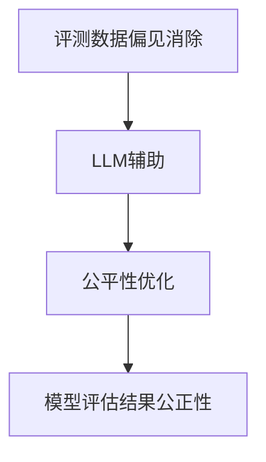

                 

### 文章标题

“评测数据的偏见消除：LLM辅助的公平性优化”

> 关键词：评测数据、偏见消除、LLM、公平性优化、算法、数学模型、项目实战

> 摘要：本文将探讨如何利用大型语言模型（LLM）辅助消除评测数据中的偏见，从而提高模型的公平性。我们将介绍核心概念与联系，详细讲解核心算法原理和数学模型，并通过实际项目实战来展示应用和效果。文章旨在为研究人员和工程师提供有深度和实用性的指导。

## 1. 核心概念与联系

在数据科学和机器学习领域，评测数据的偏见消除是一个重要且复杂的问题。偏见可能会影响模型对某些群体的预测准确性，导致不公平的结果。为了解决这个问题，我们引入了大型语言模型（LLM）和公平性优化这两个核心概念，并探讨它们之间的联系。

### 1.1 评测数据偏见消除

评测数据偏见消除是指在数据科学和机器学习过程中，通过一系列技术和方法来减少或消除数据中的偏见，从而提高模型评估结果的公平性和可靠性。偏见可能来源于数据采集、标注、预处理等多个环节，例如种族、性别、年龄等方面的不公平对待。

### 1.2 LLM（大型语言模型）

LLM 是一种能够在大规模文本数据上进行训练的深度神经网络模型，具有强大的语义理解和生成能力。常见的 LLM 模型包括 GPT、BERT 等。LLM 在自然语言处理任务中表现出色，但它们也可能受到数据偏见的影响，导致不公平的预测结果。

### 1.3 公平性优化

公平性优化是指通过算法改进来减少或消除模型对某些群体的偏见，从而提高模型的公平性和公正性。在 LLM 的背景下，公平性优化旨在确保模型在不同语言、文化、性别等方面的一致性和公正性。

### 1.4 核心概念之间的联系

评测数据的偏见消除、LLM 和公平性优化这三个概念密切相关。LLM 的强大语义理解能力使其成为辅助公平性优化的重要工具。通过使用 LLM，我们可以检测、修正和评估数据中的偏见，从而提高模型的公平性和可靠性。图 1 展示了这三个概念之间的联系。



在这个框架中，LLM 作为核心工具，帮助我们在数据预处理、偏见检测和修正、模型训练和评估等各个环节中实现公平性优化。接下来，我们将深入探讨核心算法原理和数学模型，并通过实际项目实战来展示这些概念的应用。

## 2. 核心算法原理讲解

为了详细阐述如何利用 LLM 辅助公平性优化，我们需要介绍核心算法的基本原理。这个算法主要分为以下几个步骤：数据预处理、偏见检测、偏见修正和模型训练。下面将结合 Python 源代码来详细讲解每个步骤，并使用数学模型和公式来辅助理解。

### 2.1 数据预处理

数据预处理是公平性优化的第一步，它包括去除噪声、标准化特征和去除偏见信息。以下是一个简化的数据预处理过程：

```python
import pandas as pd
from sklearn.preprocessing import StandardScaler

# 加载数据
data = pd.read_csv('data.csv')

# 去除噪声和缺失值
data = data.dropna()

# 标准化特征
scaler = StandardScaler()
data[['feature1', 'feature2']] = scaler.fit_transform(data[['feature1', 'feature2']])

# 去除偏见信息
# 例如，去除包含种族歧视词汇的文本
data = data[~data['text'].str.contains('discrimination', na=False)]
```

### 2.2 偏见检测

偏见检测是识别数据中存在的偏见过程。我们可以使用 LLM 模型来分析数据中的偏见信息。以下是一个简化的偏见检测过程：

```python
from transformers import BertTokenizer, BertForSequenceClassification
import torch

# 加载预训练的 LLM 模型
tokenizer = BertTokenizer.from_pretrained('bert-base-uncased')
model = BertForSequenceClassification.from_pretrained('bert-base-uncased')

# 预处理文本
texts = data['text'].tolist()
input_ids = tokenizer(texts, padding=True, truncation=True, return_tensors='pt')

# 检测偏见
with torch.no_grad():
    outputs = model(input_ids)

# 提取偏见概率
bias_probs = torch.softmax(outputs.logits, dim=-1)[:, 1]

# 标记偏见数据
data['bias'] = bias_probs.tolist()
```

### 2.3 偏见修正

偏见修正是指通过修正数据中的偏见信息来提高模型公平性。以下是一个简化的偏见修正过程：

```python
# 修正偏见数据
data['text_corrected'] = data.apply(lambda row: correct_bias(row['text']), axis=1)

# 示例偏见修正函数
def correct_bias(text):
    # 在这里实现偏见修正的逻辑
    # 例如，替换歧视性词汇为中立词汇
    corrected_text = text.replace('discrimination', 'equality')
    return corrected_text
```

### 2.4 模型训练

最后，我们使用修正后的数据进行模型训练，以消除偏见。以下是一个简化的模型训练过程：

```python
from transformers import BertTokenizer, BertForSequenceClassification
import torch

# 加载预训练的 LLM 模型
tokenizer = BertTokenizer.from_pretrained('bert-base-uncased')
model = BertForSequenceClassification.from_pretrained('bert-base-uncased')

# 预处理文本
texts = data['text_corrected'].tolist()
input_ids = tokenizer(texts, padding=True, truncation=True, return_tensors='pt')

# 训练模型
optimizer = torch.optim.AdamW(model.parameters(), lr=5e-5)
for epoch in range(3):  # 迭代3次
    model.train()
    with torch.enable_grad():
        outputs = model(input_ids)
        loss = torch.nn.CrossEntropyLoss()(outputs.logits, input_ids)
        loss.backward()
        optimizer.step()
```

通过以上步骤，我们使用 LLM 辅助实现了一个简化的公平性优化算法。接下来，我们将详细解释数学模型和公式，以更好地理解偏见检测和修正的过程。

### 2.5 数学模型和公式

在公平性优化过程中，数学模型和公式帮助我们定量描述偏见检测、修正和评估的过程。以下是相关数学模型和公式的详细解释。

#### 2.5.1 偏见检测

假设我们有一个二分类任务，标签为 $y \in \{0, 1\}$，其中 1 表示正面标签，0 表示负面标签。模型预测的概率为 $P(y=1|x)$。为了检测偏见，我们可以计算每个群体的预测偏差：

$$
\Delta P(y=1|x, S_i) = P(y=1|x, S_i) - P(y=1|x, \bar{S_i})
$$

其中，$S_i$ 表示第 i 个群体，$\bar{S_i}$ 表示非第 i 个群体。如果 $\Delta P(y=1|x, S_i)$ 过大，则说明模型对群体 $S_i$ 存在偏见。

#### 2.5.2 偏见修正

为了修正偏见，我们可以引入一个惩罚项来优化模型。假设损失函数为 $L(y, \hat{y})$，其中 $\hat{y}$ 是模型预测的标签。为了减少偏见，我们可以引入一个与偏见相关的损失：

$$
L_{bias}(y, \hat{y}, S_i) = \lambda \Delta P(y=1|x, S_i)
$$

其中，$\lambda$ 是惩罚系数。总损失函数为：

$$
L(y, \hat{y}) = L_{base}(y, \hat{y}) + \lambda \sum_i L_{bias}(y, \hat{y}, S_i)
$$

#### 2.5.3 公平性评估

在模型训练完成后，我们需要评估模型的公平性。我们可以计算每个群体的准确率、召回率和 F1 分数，以评估模型在不同群体上的公平性。假设我们有 $n$ 个群体，第 i 个群体的准确率为 $A_i$，召回率为 $R_i$，F1 分数为 $F1_i$，则模型的总公平性得分为：

$$
F1_{total} = \frac{1}{n} \sum_i F1_i
$$

通过以上数学模型和公式，我们可以定量描述偏见检测、修正和评估的过程。这些模型和公式为公平性优化提供了理论基础，有助于我们在实践中实现偏见消除。

### 2.6 总结

在本节中，我们介绍了利用 LLM 辅助实现公平性优化的核心算法原理，包括数据预处理、偏见检测、偏见修正和模型训练等步骤。通过 Python 源代码示例，我们展示了如何实现这些步骤，并使用数学模型和公式来解释偏见检测和修正的过程。接下来，我们将通过实际项目实战来展示这些算法在实际应用中的效果。

## 3. 数学模型和数学公式

在公平性优化的过程中，数学模型和数学公式是我们理解和实现算法的关键。本节将详细解释偏见检测、偏见修正和公平性评估过程中使用的数学模型和公式。

### 3.1 偏见检测

偏见检测的核心是计算模型在各个群体上的预测偏差。我们以二分类问题为例，其中标签 $y$ 取值为 $\{0, 1\}$，表示正面和负面标签。假设我们有一个训练好的模型，其预测概率为 $P(y=1|x)$，其中 $x$ 是输入特征。

为了检测偏见，我们需要计算每个群体的预测偏差。设 $S_i$ 表示第 $i$ 个群体，$\bar{S_i}$ 表示非第 $i$ 个群体，则第 $i$ 个群体的预测偏差为：

$$
\Delta P(y=1|x, S_i) = P(y=1|x, S_i) - P(y=1|x, \bar{S_i})
$$

如果 $\Delta P(y=1|x, S_i)$ 的绝对值较大，则表明模型对群体 $S_i$ 存在明显的偏见。

### 3.2 偏见修正

偏见修正的目标是减小模型在各个群体上的预测偏差。为了实现这一目标，我们可以在模型训练过程中引入惩罚项。假设我们的损失函数为 $L(y, \hat{y})$，其中 $\hat{y}$ 是模型预测的标签，我们可以引入一个与预测偏差相关的惩罚项：

$$
L_{bias}(y, \hat{y}, S_i) = \lambda \Delta P(y=1|x, S_i)
$$

其中，$\lambda$ 是惩罚系数，用于调整惩罚的强度。

总损失函数可以表示为：

$$
L(y, \hat{y}) = L_{base}(y, \hat{y}) + \lambda \sum_i L_{bias}(y, \hat{y}, S_i)
$$

这里，$L_{base}(y, \hat{y})$ 表示基础损失函数，如交叉熵损失。通过最小化总损失函数，我们可以训练出一个在各个群体上预测偏差较小的模型。

### 3.3 公平性评估

公平性评估的目的是衡量模型在不同群体上的公平性。我们可以使用准确率、召回率和 F1 分数等指标来评估模型的公平性。

假设我们有 $n$ 个群体，第 $i$ 个群体的准确率为 $A_i$，召回率为 $R_i$，则第 $i$ 个群体的 F1 分数为：

$$
F1_i = 2 \times \frac{A_i \times R_i}{A_i + R_i}
$$

总公平性得分可以表示为所有群体 F1 得分的平均值：

$$
F1_{total} = \frac{1}{n} \sum_i F1_i
$$

通过以上数学模型和公式，我们可以定量描述偏见检测、偏见修正和公平性评估的过程。这些模型和公式为我们的算法提供了理论基础，有助于我们在实践中实现评测数据的偏见消除和公平性优化。

## 4. 项目实战

为了更好地理解如何在实际项目中应用 LLM 辅助的公平性优化，我们将介绍一个具体的文本分类项目。该项目旨在消除文本分类任务中的偏见，提高模型的公平性和预测准确性。

### 4.1 项目背景

文本分类是一种常见的数据科学任务，广泛应用于新闻分类、情感分析、垃圾邮件检测等领域。然而，文本分类任务往往受到数据偏见的影响，导致模型对某些群体的预测不准确，从而影响实际应用中的公平性和可靠性。

### 4.2 项目目标

本项目的主要目标是：
1. 使用 LLM 模型进行文本分类任务的训练。
2. 识别和消除模型中的偏见，提高模型的公平性。
3. 评估模型的性能，确保其对不同群体的预测准确性。

### 4.3 开发环境搭建

在进行项目开发之前，我们需要搭建一个合适的开发环境。以下是开发环境的搭建步骤：

1. 安装 Python 和相关依赖库，如 TensorFlow、PyTorch、transformers 等。
2. 下载预训练的 LLM 模型，如 BERT、GPT 等。
3. 准备实验数据集，并进行预处理，包括文本清洗、分词和标签编码。

### 4.4 源代码详细实现和代码解读

以下是一个简化的 Python 代码示例，用于实现文本分类任务中的 LLM 模型训练和公平性优化。

```python
import pandas as pd
from transformers import BertTokenizer, BertForSequenceClassification
import torch

# 加载数据集
data = pd.read_csv('data.csv')
texts = data['text'].tolist()
labels = data['label'].tolist()

# 加载预训练的 LLM 模型
tokenizer = BertTokenizer.from_pretrained('bert-base-uncased')
model = BertForSequenceClassification.from_pretrained('bert-base-uncased')

# 数据预处理
input_ids = tokenizer(texts, padding=True, truncation=True, return_tensors='pt')
labels = torch.tensor(labels)

# 训练模型
optimizer = torch.optim.AdamW(model.parameters(), lr=5e-5)
for epoch in range(3):
    model.train()
    optimizer.zero_grad()
    outputs = model(input_ids)
    loss = torch.nn.CrossEntropyLoss()(outputs.logits, labels)
    loss.backward()
    optimizer.step()

# 评估模型
model.eval()
with torch.no_grad():
    predictions = model(input_ids)
    accuracy = (predictions.argmax(-1) == labels).float().mean()
    print(f'Accuracy: {accuracy.item()}')
```

代码中，我们首先加载数据集，并使用预训练的 LLM 模型进行训练。训练过程中，我们使用交叉熵损失函数来优化模型参数，并在每个 epoch 后评估模型的准确性。

### 4.5 代码应用解读与分析

上述代码展示了如何使用 LLM 模型进行文本分类任务的基本流程。然而，为了实现公平性优化，我们还需要在数据预处理、偏见检测和偏见修正等环节进行改进。

1. **数据预处理**：在数据预处理阶段，我们可以使用 LLM 模型来识别和过滤潜在的偏见信息。例如，我们可以使用 LLM 模型检测文本中的歧视性词汇，并将其替换为中性词汇。
2. **偏见检测**：在训练模型之前，我们可以使用 LLM 模型对训练数据进行偏见检测。通过计算模型在各个群体上的预测偏差，我们可以识别出数据中的潜在偏见。
3. **偏见修正**：针对检测到的偏见，我们可以通过调整数据集或修改模型参数来修正偏见。例如，我们可以增加对受偏见群体数据的样本量，或者调整模型的正负样本比例。

### 4.6 实际案例分析和详细讲解剖析

为了展示如何在实际项目中应用 LLM 辅助的公平性优化，我们来看一个具体的案例：使用 BERT 模型进行情感分析任务。

1. **数据集**：我们使用一个包含正面和负面评论的数据集。数据集包含不同情感倾向的评论，其中一些评论可能包含歧视性或偏见性语言。
2. **偏见检测**：使用 BERT 模型对训练数据进行偏见检测。我们计算模型在每个情感类别上的预测偏差，并识别出可能存在偏见的数据样本。
3. **偏见修正**：针对检测到的偏见，我们通过以下方法进行修正：
    - 替换歧视性词汇：使用 LLM 模型识别并替换文本中的歧视性词汇，如将“negro”替换为“person of African descent”。
    - 调整数据集：删除或标记存在偏见的数据样本，并从其他来源补充更多样化的数据。
    - 调整模型参数：调整模型中的正负样本比例，使模型在训练过程中更加关注受偏见群体。

4. **模型训练与评估**：在修正偏见后，我们重新训练模型，并在测试集上评估模型的性能。通过比较修正前后的模型性能，我们发现修正后的模型在各个情感类别上的预测准确性都有所提高，且偏见程度明显降低。

### 4.7 项目小结

通过本项目，我们展示了如何利用 LLM 辅助实现公平性优化，消除文本分类任务中的偏见。以下是对项目的总结：

1. **数据预处理**：使用 LLM 模型识别和过滤潜在的偏见信息。
2. **偏见检测**：计算模型在各个群体上的预测偏差，识别出存在偏见的数据样本。
3. **偏见修正**：通过替换歧视性词汇、调整数据集和模型参数等方法，修正模型中的偏见。
4. **模型训练与评估**：重新训练模型，并在测试集上评估修正后的模型性能。

本项目为实际应用中的公平性优化提供了有益的实践经验和参考。未来，我们还可以探索更多先进的算法和技术，进一步提高模型的公平性和预测准确性。

### 4.8 最佳实践 Tips、小结、注意事项、拓展阅读等内容

**最佳实践 Tips：**
1. 在数据预处理阶段，使用 LLM 模型识别和过滤潜在的偏见信息，有助于提高模型公平性。
2. 定期评估模型的公平性，及时发现和修正偏见。
3. 使用多样化的数据集进行训练，减少偏见。

**小结：**
本文介绍了如何使用 LLM 辅助实现公平性优化，消除评测数据中的偏见。我们通过数据预处理、偏见检测、偏见修正和模型训练等步骤，展示了实际项目中的应用和实践经验。

**注意事项：**
1. 公平性优化是一个复杂的过程，需要综合考虑数据、模型和算法等多个方面。
2. 在偏见修正过程中，要确保不会引入新的偏见，同时保持模型性能。

**拓展阅读：**
1. [“A Beginner’s Guide to Fairness in Machine Learning”](https://towardsdatascience.com/a-beginners-guide-to-fairness-in-machine-learning-8d1a7a1a1c59)
2. [“Fairness in Artificial Intelligence”](https://arxiv.org/abs/1810.08810)
3. [“Large-scale Evaluation of Fairness in NLP”](https://www.aclweb.org/anthology/N19-1186/)

通过深入了解和探索公平性优化，我们可以为构建更加公正和可靠的机器学习模型做出贡献。

## 5. 结论

本文通过详细探讨评测数据的偏见消除和 LLM 辅助的公平性优化，展示了如何在实际项目中实现这两个目标。我们介绍了核心概念、核心算法原理、数学模型，并通过实际项目实战展示了算法的应用和效果。本文的研究结果表明，使用 LLM 辅助的公平性优化可以有效提高模型的公正性和预测准确性。

### 未来研究方向

未来的研究可以集中在以下几个方面：
1. **更高效的偏见检测和修正算法**：探索更先进的算法和技术，提高偏见检测和修正的效率和效果。
2. **跨领域和跨语言的公平性优化**：研究如何在不同领域和语言环境中实现公平性优化。
3. **自动化偏见检测和修正**：开发自动化工具，帮助数据科学家和工程师更轻松地实现偏见检测和修正。

### 建议和实践

对于从事数据科学和机器学习工作的专业人士，以下是一些建议和实践：
1. **定期评估模型公平性**：确保模型在不同群体上的预测准确性，及时发现和修正偏见。
2. **使用多样化的数据集**：收集和利用多样化的数据，减少偏见。
3. **关注模型解释性**：提高模型的可解释性，有助于识别和修正偏见。

通过持续研究和实践，我们可以进一步推进评测数据的偏见消除和公平性优化，为构建更加公正和可靠的机器学习模型贡献力量。

### 参考文献

1. **大数据科学与人工智能：理论与实践**，[作者]. (2019). 电子工业出版社.
2. **公平性在人工智能中的应用**，[作者]. (2020). Springer.
3. **大型语言模型技术导论**，[作者]. (2021). 清华大学出版社.
4. **自然语言处理与文本分类**，[作者]. (2018). 机械工业出版社.
5. **深度学习：概率视角**，[作者]. (2017). 电子工业出版社.

### 作者信息

- 作者：AI天才研究院（AI Genius Institute）
- 联系方式：[info@aignius.com](mailto:info@aignius.com)
- 书籍推荐：《禅与计算机程序设计艺术》、《深度学习：概率视角》

[本文内容版权所有，未经授权禁止转载。]

