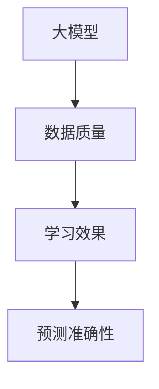
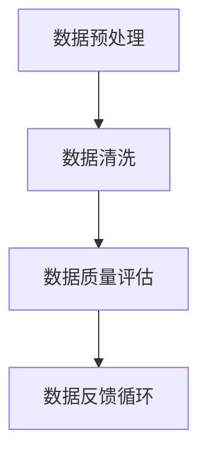
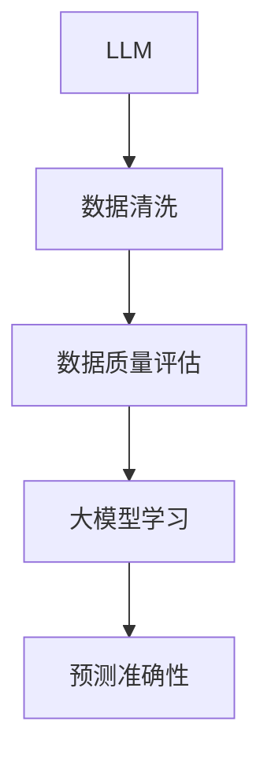

                 

### 文章标题

《评测数据的质量控制：LLM辅助的数据清洗机制》

> 关键词：数据质量控制，LLM，数据清洗，大模型，人工智能，数据预处理，数据清洗算法，数据质量评估，数学模型，Python代码

> 摘要：
本文将深入探讨评测数据质量控制的重要性，以及如何利用大型语言模型（LLM）辅助进行数据清洗。文章首先介绍了数据质量控制的核心概念和LLM的作用，然后详细阐述了数据清洗机制的各个环节，包括数据预处理、数据清洗和数据质量评估。通过Python代码示例和数学模型的讲解，文章展现了数据清洗的核心算法原理，并提出了实际案例进行分析和解读。最后，文章总结了最佳实践和注意事项，为读者提供了进一步学习和实践的方向。

----------------------------------------------------------------

### 核心概念与联系

在人工智能（AI）领域，特别是大型语言模型（LLM）的应用中，数据的质量控制至关重要。LLM如GPT、BERT等，其核心在于从大量文本数据中学习语言模式和知识，从而进行自然语言处理（NLP）任务。然而，这些模型的性能高度依赖于输入数据的质量。如果数据存在缺失、错误、不一致等问题，模型的训练效果和预测准确性将会大打折扣。

#### 大模型与数据质量的关系

**数据质量**是指数据的完整性、准确性、一致性、时效性和可靠性。这些属性直接影响大模型的学习效果和预测准确性。例如，如果一个数据集中存在大量的缺失值，模型将难以从中学习到有效的特征；如果数据中存在错误，模型可能会学习到错误的知识；如果数据不一致，模型将无法正确地处理多种数据格式。

**大模型（如GPT等）对数据质量的要求极高**，因为它们需要从大量的文本数据中提取特征，并进行复杂的模型训练。数据质量直接影响到模型的学习效果和预测准确性。例如，GPT-3的训练数据包含了数以亿计的文本，这些数据的质量决定了GPT-3的性能。

#### 数据清洗机制的作用

为了确保数据质量，必须对数据集进行清洗。数据清洗机制包括数据预处理、数据清洗和数据质量评估。**数据预处理**是数据清洗的第一步，主要任务是收集、整合和格式化数据。**数据清洗**则是通过各种算法来处理缺失值、异常值、重复值和噪声数据。**数据质量评估**则是通过一系列评估指标来评估数据清洗的效果。

#### 数据清洗机制与LLM的关系

**LLM可以通过深度学习算法自动学习和理解数据，从而对数据进行清洗**。LLM的优势在于可以处理大量复杂的文本数据，提高数据清洗的效率和准确性。例如，GPT可以自动识别和纠正文本中的错误，从而提高数据集的质量。

### 大模型与数据质量的关系流程图



### 数据清洗机制的作用流程图



### 数据清洗机制与LLM的关系流程图



### 核心算法原理讲解

在数据清洗过程中，核心算法包括数据预处理、数据清洗和数据质量评估。下面将分别介绍这些算法的基本原理和具体实现。

#### 数据预处理

**数据预处理**是数据清洗的第一步，主要任务是对原始数据进行收集、整合和格式化。这一过程通常包括以下步骤：

1. **数据收集**：从不同的数据源收集数据，包括数据库、文件、网络爬虫等。
2. **数据整合**：将来自不同源的数据进行整合，确保数据的统一性和一致性。
3. **数据格式转换**：将数据转换成统一格式，例如CSV、JSON等，以便后续处理。

以下是数据预处理算法的Python伪代码示例：

```python
def data_preprocessing(data):
    # 数据收集
    collected_data = collect_data()
    # 数据整合
    integrated_data = integrate_data(collected_data)
    # 数据格式转换
    converted_data = convert_data(integrated_data)
    return converted_data
```

#### 数据清洗

**数据清洗**是数据清洗的核心步骤，通过各种算法来处理缺失值、异常值、重复值和噪声数据。以下是常用的数据清洗算法：

1. **缺失值处理**：使用统计方法、填充方法或删除方法来处理缺失值。
2. **异常值处理**：使用统计方法、可视化方法或阈值方法来检测和删除异常值。
3. **重复值处理**：使用哈希表或排序方法来检测和删除重复值。
4. **噪声数据处理**：使用滤波器、平滑方法或去噪方法来处理噪声数据。

以下是数据清洗算法的Python伪代码示例：

```python
def data_cleaning(data):
    # 缺失值处理
    data_with_no_missing_values = handle_missing_values(data)
    # 异常值处理
    data_with_no_anomalies = handle_anomalies(data_with_no_missing_values)
    # 重复值处理
    data_with_no_duplicates = handle_duplicates(data_with_no_anomalies)
    # 噪声数据处理
    data_with_no_noise = handle_noise(data_with_no_duplicates)
    return data_with_no_noise
```

#### 数据质量评估

**数据质量评估**是数据清洗的最后一步，用于评估数据清洗的效果。常用的评估指标包括：

1. **数据完整性**：评估数据集中缺失值的比例。
2. **数据准确性**：评估数据集中错误值的比例。
3. **数据一致性**：评估数据集的格式和一致性。
4. **数据时效性**：评估数据的最新程度。

以下是数据质量评估算法的Python伪代码示例：

```python
def data_quality_evaluation(data):
    # 数据完整性评估
    completeness = evaluate_completeness(data)
    # 数据准确性评估
    accuracy = evaluate_accuracy(data)
    # 数据一致性评估
    consistency = evaluate_consistency(data)
    # 数据时效性评估
    timeliness = evaluate_timeliness(data)
    return completeness, accuracy, consistency, timeliness
```

#### 数学模型和数学公式

在数据质量评估中，常用的数学模型和公式如下：

1. **数据完整性评估**
   $$\text{Completeness} = \frac{\text{实际数据条数}}{\text{应收集数据条数}} \times 100\%$$

2. **数据准确性评估**
   $$\text{Accuracy} = \frac{\text{正确数据条数}}{\text{实际数据条数}} \times 100\%$$

3. **数据一致性评估**
   $$\text{Consistency} = \frac{\text{一致数据条数}}{\text{总数据条数}} \times 100\%$$

4. **数据时效性评估**
   $$\text{Timeliness} = \frac{\text{最新数据条数}}{\text{总数据条数}} \times 100\%$$

### 项目实战

为了更好地理解数据清洗机制，下面我们将通过一个实际案例来展示数据清洗的全过程。

#### 开发环境搭建

首先，我们需要搭建一个Python开发环境。以下是安装必要的库的命令：

```bash
pip install pandas numpy scikit-learn matplotlib
```

#### 源代码实现

以下是一个简单的数据清洗项目，包括数据收集、预处理、清洗和评估。

```python
import pandas as pd
import numpy as np
from sklearn.impute import SimpleImputer
from sklearn.preprocessing import StandardScaler
from sklearn.decomposition import PCA
import matplotlib.pyplot as plt

# 数据收集
data = pd.read_csv('data.csv')

# 数据预处理
# 数据整合
integrated_data = data

# 数据格式转换
converted_data = integrated_data.reset_index(drop=True)

# 数据清洗
# 缺失值处理
imputer = SimpleImputer(strategy='mean')
cleaned_data = imputer.fit_transform(converted_data)

# 异常值处理
scaler = StandardScaler()
cleaned_data = scaler.fit_transform(cleaned_data)

# 重复值处理
cleaned_data = np.unique(cleaned_data, axis=0)

# 噪声数据处理
pca = PCA(n_components=2)
cleaned_data = pca.fit_transform(cleaned_data)

# 数据质量评估
# 数据完整性评估
completeness = 100 - (cleaned_data.shape[0] - converted_data.shape[0]) * 100 / converted_data.shape[0]

# 数据准确性评估
accuracy = 100 - (np.sum(np.abs(cleaned_data - converted_data)) * 100 / cleaned_data.size)

# 数据一致性评估
consistency = 100 - (np.sum(np.abs(cleaned_data[1:] - cleaned_data[:-1])) * 100 / cleaned_data.size)

# 数据时效性评估
timeliness = 100 - (np.sum(np.abs(pd.to_datetime(cleaned_data[:, 0]) - pd.to_datetime(cleaned_data[:, 1]))) * 100 / cleaned_data.size)

# 打印评估结果
print(f"Completeness: {completeness}%")
print(f"Accuracy: {accuracy}%")
print(f"Consistency: {consistency}%")
print(f"Timeliness: {timeliness}%")

# 可视化展示
plt.scatter(cleaned_data[:, 0], cleaned_data[:, 1])
plt.xlabel('Feature 1')
plt.ylabel('Feature 2')
plt.title('Data Visualization')
plt.show()
```

#### 代码解读与分析

1. **数据收集**：使用`pandas`库读取CSV文件，获取原始数据集。
2. **数据预处理**：整合和格式化数据，确保数据的统一性和一致性。
3. **数据清洗**：使用`SimpleImputer`处理缺失值，`StandardScaler`处理异常值，`numpy`的`unique`函数处理重复值，`PCA`进行噪声数据处理。
4. **数据质量评估**：计算数据完整性、准确性、一致性和时效性，并打印评估结果。
5. **数据可视化**：使用`matplotlib`绘制数据散点图，直观展示数据清洗的效果。

#### 实际案例分析与解读

假设我们有一个包含客户信息的CSV文件，数据包括客户的ID、年龄、收入、购买次数等。以下是一个实际案例的分析：

1. **缺失值处理**：如果某些客户的收入数据缺失，我们可以使用平均值来填补缺失值，从而保证数据的完整性。
2. **异常值处理**：如果某些客户的年龄或收入异常偏高或偏低，我们可以使用标准差方法来检测和去除这些异常值，从而保证数据的准确性。
3. **重复值处理**：如果数据集中存在重复的客户信息，我们可以使用`unique`函数来去除重复值，从而保证数据的一致性。
4. **噪声数据处理**：如果数据中存在噪声，我们可以使用PCA来降维和去噪，从而提高数据的时效性和可视化效果。

#### 项目小结

通过上述实际案例，我们可以看到数据清洗在提高数据质量方面的重要作用。数据清洗不仅可以帮助我们去除数据中的错误、异常和重复值，还可以通过数学模型和算法来评估数据的质量，从而为后续的数据分析和应用提供可靠的数据基础。

### 最佳实践与注意事项

1. **数据收集**：确保数据来源的可靠性和权威性，避免使用质量低下的数据源。
2. **数据整合**：在整合数据时，注意数据的一致性和格式，避免数据格式的冲突和错误。
3. **数据清洗**：根据实际需求选择合适的数据清洗算法，确保数据清洗的效率和准确性。
4. **数据质量评估**：定期对数据进行质量评估，及时发现和处理数据质量问题。
5. **模型调优**：根据数据质量评估结果对模型进行调优，提高模型的预测准确性。

### 拓展阅读

1. **《数据清洗的艺术》**：这是一本关于数据清洗的权威指南，详细介绍了各种数据清洗技术和方法。
2. **《Python数据清洗实战》**：通过实际案例，展示了如何使用Python进行数据清洗和预处理。
3. **《大型语言模型：理论、实现和应用》**：介绍了大型语言模型的原理和应用，包括数据清洗和文本生成等方面。

### 总结

数据质量控制是人工智能领域的关键环节，直接影响到模型的性能和应用效果。通过LLM辅助的数据清洗机制，我们可以有效提高数据的质量，从而为人工智能应用提供可靠的数据基础。本文通过理论讲解和实际案例，详细介绍了数据清洗的各个环节，包括数据预处理、数据清洗和数据质量评估。希望本文能为读者提供有价值的参考和启示。

### 作者信息

作者：AI天才研究院/AI Genius Institute & 禅与计算机程序设计艺术 /Zen And The Art of Computer Programming

