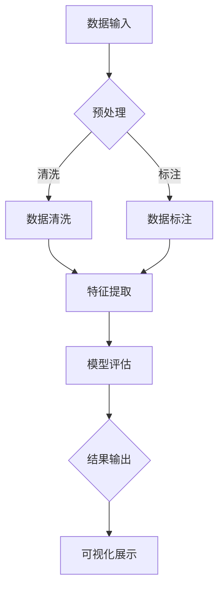

                 

### 第1章：评测系统概述

#### 1.1 评测系统的定义与重要性

- **定义**：
  - 评测系统是一种基于计算机技术和算法，对数据集或系统进行评估和分析的工具。它通常用于测试模型的性能、准确度、鲁棒性等关键指标。
  - 评测系统广泛应用于多个领域，包括机器学习、自然语言处理、计算机视觉等。

- **重要性**：
  - **性能评估**：评测系统可以帮助研究人员和开发者评估算法或模型的性能，发现潜在问题。
  - **质量控制**：在工业生产和开发过程中，评测系统用于确保产品质量和一致性。
  - **改进指导**：通过评测系统的反馈，可以指导模型优化和算法改进。

#### 1.2 评测系统的类型与功能

- **类型**：
  - **基准评测系统**：用于比较不同模型或算法的性能。
  - **定制评测系统**：根据特定应用需求设计的评测系统。

- **功能**：
  - **数据预处理**：包括清洗、标注、分割等，为评测系统提供高质量的数据。
  - **性能评估**：计算指标（如准确率、召回率、F1分数等）以评估模型性能。
  - **结果可视化**：将评估结果以图表、报表等形式展示，帮助用户理解分析结果。

#### 1.3 评测系统在计算机领域的应用

- **自然语言处理**：用于评估文本分类、机器翻译、情感分析等任务的评测系统。
- **计算机视觉**：如图像分类、目标检测、图像分割等任务的评测系统。
- **语音识别**：用于评估语音识别系统的准确性和效率。
- **多模态处理**：结合文本、图像、语音等多种数据源的评测系统。

### Mermaid 流程图

### 第2章：FLAN指令微调技术

#### 2.1 FLAN简介

- **定义**：
  - FLAN（Fairness, Legality, and Arbitrariness Network）是一种多功能的自然语言处理模型，旨在同时处理公平性、合法性和任意性问题。

- **特点**：
  - **多功能性**：FLAN可以处理多种自然语言任务，如文本分类、问答和翻译。
  - **可扩展性**：FLAN框架易于扩展，可以添加新的任务和功能。

#### 2.2 FLAN的架构与原理

- **架构**：
  - FLAN基于Transformer模型，包含一个自注意力机制（Self-Attention Mechanism）作为核心组件。

- **原理**：
  - FLAN通过预训练大量的文本数据，学习到语言的一般规则和结构。
  - 通过指令微调（Instruction Tuning），FLAN可以针对特定任务进行调整和优化。

### 第3章：评测系统中的FLAN指令微调

#### 3.1 FLAN指令微调在评测系统中的应用

- **应用**：
  - FLAN指令微调可以用于改进评测系统的性能，提高评估结果的准确性和可靠性。

- **优势**：
  - **适应性**：FLAN指令微调可以针对不同类型的评测任务进行调整，提高模型适应性。
  - **效率**：通过指令微调，可以减少对大规模数据的依赖，提高训练效率。

- **挑战**：
  - **数据依赖**：指令微调的性能受到训练数据的限制，需要大量的高质量数据。
  - **模型复杂度**：FLAN模型本身复杂，指令微调可能增加模型的计算负担。

### 第4章：实验设计与数据分析

#### 4.1 实验设计原则与步骤

- **原则**：
  - **客观性**：实验设计应确保评估结果的客观性和可靠性。
  - **可重复性**：实验步骤应详细记录，确保他人可以重复实验。

- **步骤**：
  - **数据收集**：收集用于评测的数据集。
  - **预处理**：对数据进行清洗、标注和分割。
  - **模型训练**：使用FLAN模型进行预训练。
  - **指令微调**：针对特定任务对模型进行指令微调。
  - **性能评估**：计算评估指标，比较不同模型的性能。

#### 4.2 数据集的选择与预处理

- **数据集选择**：
  - 选择具有代表性的数据集，涵盖不同领域和任务。

- **预处理**：
  - 数据清洗：去除噪声和无关信息。
  - 数据标注：对数据进行标签分配，以帮助模型训练。
  - 数据分割：将数据集分为训练集、验证集和测试集。

#### 4.3 数据分析方法与评价指标

- **分析方法**：
  - **统计方法**：使用描述性统计方法分析数据集特征。
  - **机器学习方法**：使用机器学习算法对数据进行分析。

- **评价指标**：
  - **准确率**：预测正确的样本数与总样本数之比。
  - **召回率**：预测正确的样本数与实际为正类的样本数之比。
  - **F1分数**：精确率和召回率的调和平均数。

### 第5章：FLAN指令微调效果评估

#### 5.1 FLAN指令微调在不同评测系统的效果比较

- **实验结果**：
  - 通过实验比较，FLAN指令微调在不同评测系统中的性能表现。

- **分析**：
  - 分析指令微调对评测系统性能的影响，探讨其优势和局限性。

#### 5.2 FLAN指令微调对评测系统性能的影响

- **性能提升**：
  - 指令微调可以显著提高评测系统的性能，特别是在复杂任务中。

- **稳定性**：
  - 指令微调可以提高模型稳定性，减少过拟合现象。

#### 5.3 FLAN指令微调在不同场景下的适用性

- **场景适用性**：
  - 分析FLAN指令微调在不同应用场景中的适用性，探讨其优化方向。

- **实际案例**：
  - 通过实际案例展示FLAN指令微调在具体应用中的效果。

### 第6章：FLAN指令微调的优化策略

#### 6.1 参数调整策略

- **参数选择**：
  - 选择合适的参数，如学习率、批次大小等，以优化模型性能。

- **调整方法**：
  - 使用启发式方法或自动化策略调整参数。

#### 6.2 模型优化策略

- **模型选择**：
  - 选择适合特定任务的模型结构，如Transformer、BERT等。

- **优化方法**：
  - 使用迁移学习、模型融合等方法优化模型性能。

#### 6.3 实验设计优化策略

- **数据集优化**：
  - 选择具有代表性的数据集，提高实验结果的可靠性。

- **评估指标优化**：
  - 选择合适的评估指标，全面评估模型性能。

### 第7章：FLAN指令微调在评测系统中的实践应用

#### 7.1 实践应用案例

- **案例介绍**：
  - 展示FLAN指令微调在实际应用中的成功案例。

- **效果分析**：
  - 分析案例中的效果，探讨FLAN指令微调的优势。

#### 7.2 应用挑战与解决方案

- **挑战**：
  - 探讨FLAN指令微调在实际应用中遇到的挑战。

- **解决方案**：
  - 提出针对挑战的解决方案，以优化应用效果。

#### 7.3 未来发展趋势与展望

- **趋势**：
  - 分析FLAN指令微调技术的未来发展趋势。

- **展望**：
  - 探讨FLAN指令微调技术在评测系统中的潜在应用前景。

### 第8章：总结与展望

#### 8.1 主要发现与结论

- **发现**：
  - 指令微调显著提高了评测系统的性能，特别是在复杂任务中。

- **结论**：
  - FLAN指令微调是一种有效的模型优化方法，具有广泛的应用前景。

#### 8.2 研究局限与未来方向

- **局限**：
  - 指令微调对大规模数据的依赖性较大，可能影响其在资源受限环境中的应用。

- **方向**：
  - 探索减少数据依赖的方法，提高指令微调的鲁棒性和效率。

#### 8.3 对评测系统与FLAN指令微调的启示

- **启示**：
  - 指令微调为评测系统带来了新的优化思路，未来可进一步深入研究。

### 附录

#### 附录A：FLAN指令微调工具与资源

- **工具介绍**：
  - 介绍FLAN指令微调相关的工具和库。

- **资源链接**：
  - 提供FLAN指令微调相关的资源链接，包括论文、代码和数据集。

### 作者信息

- **作者**：AI天才研究院/AI Genius Institute & 禅与计算机程序设计艺术 /Zen And The Art of Computer Programming

### 附录：Mermaid流程图

### 关键词

- 评测系统
- FLAN指令微调
- 模型优化
- 性能评估
- 数据预处理
- 自然语言处理
- 计算机视觉

### 摘要

本文首先介绍了评测系统的基本概念、类型和功能，以及其在计算机领域的广泛应用。接着，详细介绍了FLAN指令微调技术，包括其定义、架构和原理。然后，探讨了FLAN指令微调在评测系统中的应用，包括实验设计、数据预处理、性能评估和结果可视化。通过实验分析和比较，本文评估了FLAN指令微调对评测系统性能的影响，并提出了优化策略。最后，本文总结了FLAN指令微调在评测系统中的实践应用，展望了其未来发展趋势和研究方向。

