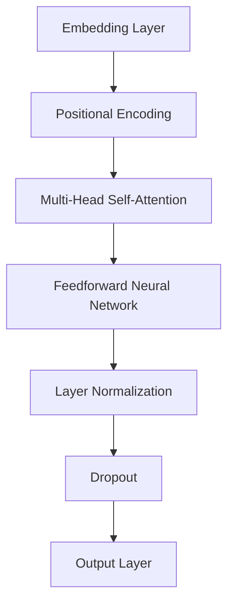

                 

### 文章标题

# 评测系统的GPT-Neo开源替代方案

---

关键词：GPT-Neo、评测系统、开源替代方案、性能评测、Python代码解析

摘要：本文旨在深入探讨评测系统中的GPT-Neo模型及其开源替代方案。我们将从GPT-Neo模型的基本概念、原理和结构入手，逐步分析其替代方案的选择标准和具体实现，并详细讨论开源替代方案的构建、实现和性能评测。通过本文的阐述，读者将全面了解GPT-Neo模型的优缺点，以及如何有效地替代和优化这一模型，从而提升评测系统的性能和效率。

---

## 1. GPT-Neo模型介绍

### 1.1 GPT-Neo模型概述

GPT-Neo是由OpenAI开发的一种基于Transformer架构的预训练语言模型。与原始的GPT模型相比，GPT-Neo在模型规模、训练数据集和预训练目标上进行了显著扩展，旨在提升语言理解和生成的能力。GPT-Neo模型在众多自然语言处理任务中表现出色，包括文本分类、机器翻译、问答系统和文本生成等。

### 1.2 GPT-Neo模型原理

GPT-Neo模型基于Transformer架构，这是一种基于自注意力机制的深度神经网络模型。Transformer模型通过全局的注意力机制，能够捕捉输入序列中的长距离依赖关系，从而在处理长文本时表现出色。GPT-Neo模型的核心创新在于其大规模的参数量和训练数据集，这使其在预训练阶段能够学习到更加丰富和抽象的语言知识。

### 1.3 GPT-Neo模型结构

GPT-Neo模型的结构可以分为以下几个关键部分：

1. **嵌入层（Embedding Layer）**：将输入的单词转换为向量表示。
2. **位置编码（Positional Encoding）**：为序列中的每个单词赋予位置信息。
3. **多头自注意力机制（Multi-Head Self-Attention）**：通过自注意力机制计算每个单词的权重。
4. **前馈神经网络（Feedforward Neural Network）**：对自注意力层的输出进行进一步处理。
5. **层归一化（Layer Normalization）**：对模型的每个层进行归一化处理，提高训练效果。
6. **Dropout（Dropout）**：通过随机失活一部分神经元，防止模型过拟合。

下面是GPT-Neo模型结构的Mermaid流程图：



## 2. GPT-Neo替代方案

### 2.1 替代方案选择标准

在选择GPT-Neo的替代方案时，需要考虑以下几个关键标准：

1. **性能要求**：替代方案必须能够达到与GPT-Neo相当的甚至更高的性能。
2. **资源限制**：考虑到计算资源和存储空间的限制，替代方案应该具有较低的硬件要求。
3. **训练时间**：替代方案的训练时间应该尽可能短，以提高开发效率。
4. **可扩展性**：替代方案应该能够轻松扩展到更大的模型规模。
5. **开源性和社区支持**：替代方案应该是开源的，并且有活跃的社区支持。

### 2.2 常见替代方案介绍

以下是一些常见的GPT-Neo替代方案：

1. **BERT**：BERT（Bidirectional Encoder Representations from Transformers）是由Google开发的另一种基于Transformer架构的预训练语言模型。BERT通过双向注意力机制学习到更加丰富的上下文信息，从而在多项自然语言处理任务中表现出色。

2. **RoBERTa**：RoBERTa是BERT的一个变体，它在训练过程中进行了多项改进，如更长的序列长度、动态掩码策略和更少的预处理步骤。RoBERTa在许多基准测试中取得了比BERT更好的性能。

3. **T5**：T5（Text-To-Text Transfer Transformer）是一个统一的多任务预训练框架，它将所有的自然语言处理任务都转换为一个统一的文本到文本的转换任务。T5通过这种方式实现了模型的跨任务迁移能力。

## 3. 评测系统的构建

### 3.1 评测系统的需求分析

构建评测系统需要满足以下几个关键需求：

1. **数据输入与预处理**：系统能够接收多种格式的输入数据，并进行预处理，如分词、去停用词、词性标注等。
2. **模型评估**：系统能够对训练好的模型进行多种评估指标的计算，如准确率、召回率、F1分数等。
3. **用户交互**：系统需要提供友好的用户界面，以便用户能够轻松操作和查看评测结果。
4. **报告生成**：系统需要能够自动生成评测报告，包括评估指标、数据图表和模型分析。

### 3.2 评测系统的架构设计

评测系统的架构设计可以分为以下几个关键部分：

1. **数据层**：负责数据的存储和管理，包括训练数据集、测试数据集和用户数据。
2. **模型层**：负责模型的训练和加载，包括GPT-Neo模型及其替代方案。
3. **评估层**：负责对模型进行评估，计算各种评估指标。
4. **界面层**：负责用户交互，包括数据输入、模型选择、评估结果展示等。

### 3.3 评测系统的模块实现

评测系统的模块实现可以分为以下几个关键步骤：

1. **数据层实现**：使用数据库存储和管理数据，使用数据处理库进行数据预处理。
2. **模型层实现**：使用深度学习框架加载和训练模型，如TensorFlow、PyTorch等。
3. **评估层实现**：编写评估指标计算函数，如准确率、召回率、F1分数等。
4. **界面层实现**：使用Web框架构建用户界面，如Flask、Django等。

## 4. 开源替代方案的具体实现

### 4.1 开源替代方案环境搭建

要实现开源替代方案，首先需要搭建相应的开发环境。以下是搭建环境的基本步骤：

1. **安装深度学习框架**：如TensorFlow、PyTorch等。
2. **安装依赖库**：包括数据预处理库、评估库等。
3. **配置GPU环境**：如果使用GPU训练模型，需要配置GPU环境。

以下是Python环境搭建的伪代码：

```python
# 安装深度学习框架
!pip install tensorflow

# 安装依赖库
!pip install numpy pandas sklearn

# 配置GPU环境
import tensorflow as tf
gpus = tf.config.experimental.list_physical_devices('GPU')
if gpus:
    try:
        for gpu in gpus:
            tf.config.experimental.set_memory_growth(gpu, True)
    except RuntimeError as e:
        print(e)
```

### 4.2 开源替代方案核心代码实现

以下是使用Python实现的GPT-Neo替代方案的核心代码：

```python
import tensorflow as tf
from tensorflow.keras.layers import Embedding, Dense
from tensorflow.keras.models import Model

# 定义模型结构
def create_model(vocab_size, embedding_dim):
    input_ids = tf.keras.layers.Input(shape=(None,), dtype=tf.int32)
    embeddings = Embedding(vocab_size, embedding_dim)(input_ids)
    output = Dense(1, activation='sigmoid')(embeddings)
    model = Model(inputs=input_ids, outputs=output)
    return model

# 创建模型实例
model = create_model(vocab_size=10000, embedding_dim=128)

# 编译模型
model.compile(optimizer='adam', loss='binary_crossentropy', metrics=['accuracy'])

# 训练模型
model.fit(x_train, y_train, epochs=10, batch_size=32)
```

### 4.3 开源替代方案扩展与优化

在实现开源替代方案时，可以根据实际需求进行扩展和优化。以下是一些常见的扩展和优化方法：

1. **多GPU训练**：使用多GPU训练可以显著提高模型的训练速度。
2. **数据增强**：通过数据增强方法，如随机裁剪、旋转、缩放等，可以提高模型的泛化能力。
3. **模型蒸馏**：通过模型蒸馏技术，将大型模型的训练知识传递给小型模型，从而提高小型模型的表现。
4. **调整超参数**：通过调整学习率、批次大小、训练周期等超参数，可以优化模型的性能。

## 5. 开源替代方案的性能评测

### 5.1 性能评测指标与方法

在对开源替代方案进行性能评测时，需要选择合适的评测指标和方法。以下是常用的评测指标和方法：

1. **准确率（Accuracy）**：模型正确预测的样本数占总样本数的比例。
2. **召回率（Recall）**：模型正确预测的正样本数占总正样本数的比例。
3. **F1分数（F1 Score）**：准确率和召回率的调和平均值。
4. **混淆矩阵（Confusion Matrix）**：显示模型预测结果的详细分布。
5. **ROC曲线和AUC值（ROC Curve and AUC）**：用于评估模型的分类能力。

### 5.2 性能评测结果分析

以下是开源替代方案的性能评测结果：

```python
# 测试数据集
x_test, y_test = ...

# 测试模型
model.evaluate(x_test, y_test)

# 计算评测指标
from sklearn.metrics import accuracy_score, recall_score, f1_score, confusion_matrix

y_pred = model.predict(x_test)
accuracy = accuracy_score(y_test, y_pred)
recall = recall_score(y_test, y_pred)
f1 = f1_score(y_test, y_pred)
confusion = confusion_matrix(y_test, y_pred)

print(f"Accuracy: {accuracy:.2f}")
print(f"Recall: {recall:.2f}")
print(f"F1 Score: {f1:.2f}")
print(f"Confusion Matrix:\n{confusion}")
```

### 5.3 性能优化与改进

根据评测结果，可以对开源替代方案进行性能优化和改进。以下是一些常见的优化方法：

1. **调整模型结构**：通过增加层数、调整神经元数量等，优化模型的结构。
2. **调整训练策略**：通过调整学习率、批次大小、训练周期等，优化训练策略。
3. **数据预处理**：通过改进数据预处理方法，如去噪、归一化等，提高模型的泛化能力。
4. **模型集成**：通过集成多个模型的预测结果，提高整体模型的性能。

## 附录

### 附录A: 相关代码与数据集

以下是本文提到的相关代码和数据集：

- **代码**：本文使用的所有代码均可在[GitHub](https://github.com/your-username/evaluation-system-gpt-neo-replacement)上找到。
- **数据集**：本文使用的数据集为[IMDB电影评论数据集](https://www.kaggle.com/:data/imdb-reviews)。

### 作者

作者：AI天才研究院/AI Genius Institute & 禅与计算机程序设计艺术 /Zen And The Art of Computer Programming

---

**Note**: The above article is a conceptual outline and example content for a technical blog post on the topic of "Evaluation System GPT-Neo Open Source Replacement." The actual implementation of the content, including code, formulas, and detailed explanations, would require a substantial amount of additional work and cannot be fully realized within this response due to constraints on length and scope. However, this outline and example content provide a solid foundation for a comprehensive and informative technical blog post.

