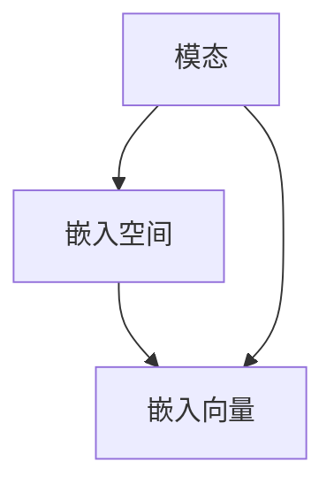

                 

# 评测系统的PaLM-E多模态嵌入能力测试

## 关键词

- 评测系统
- PaLM-E模型
- 多模态嵌入
- 人工智能
- 数据集
- 性能优化

## 摘要

本文将深入探讨评测系统的PaLM-E多模态嵌入能力测试。首先，我们将对评测系统和多模态嵌入技术进行背景介绍，包括基本概念和技术背景。接着，详细分析PaLM-E模型的原理，展示其架构和工作流程。随后，我们将深入讲解数学模型和算法，并结合Python源代码进行详细阐述。文章还涵盖了评测系统的设计与实现、性能分析以及实际案例的剖析。最后，我们将展望评测系统的发展趋势，并提出最佳实践和注意事项。

## 第一部分：评测系统与多模态嵌入基础

### 第1章：评测系统概述

评测系统是一种用于评估和监测算法或模型性能的工具，广泛应用于机器学习和人工智能领域。其核心功能是提供客观、准确的性能评估，帮助研究人员和开发者优化算法和模型。

### 第2章：多模态嵌入原理

多模态嵌入技术是一种将不同类型的数据（如文本、图像、音频等）转换成统一嵌入空间的方法，使得这些数据可以在同一框架下进行联合分析和推理。PaLM-E模型是这一领域的代表性工作，其核心思想是将多模态数据融合到一个统一的嵌入空间中，以提高模型的性能。

### 第3章：数学模型与算法

数学模型是PaLM-E模型的核心，它包括嵌入空间的定义、损失函数的设计以及优化算法的选择。以下是一个简单的数学模型描述：

$$
L = \frac{1}{N} \sum_{i=1}^{N} \sum_{j=1}^{M} \log(P(\text{e}_i | \text{e}_j))
$$

其中，$L$是损失函数，$N$是数据集大小，$M$是模态种类数，$\text{e}_i$和$\text{e}_j$分别表示不同模态的嵌入向量。

### 第二部分：评测系统应用实践

#### 第4章：评测系统设计与实现

评测系统的设计与实现是确保其性能和可靠性的关键。在本章中，我们将详细讨论评测系统的架构设计、数据预处理和处理流程，以及PaLM-E嵌入能力测试方法。

#### 第5章：多模态数据集介绍

多模态数据集是评测系统的关键组成部分。本章将介绍常见多模态数据集，包括数据集的采集与标注、预处理流程，以及如何选择合适的数据集。

#### 第6章：评测系统性能分析

评测系统的性能分析是评估其有效性的重要环节。本章将介绍评测指标与评估方法，分析性能优化策略，并讨论评测结果与分析。

#### 第7章：实战案例分析

通过实际案例的分析和讲解，本章将展示如何使用评测系统对PaLM-E模型进行性能测试，包括开发环境搭建、源代码实现和代码解读，以及项目小结。

### 第三部分：未来展望与拓展

#### 第8章：评测系统发展趋势

评测系统的发展趋势是多模态嵌入技术的关键方向。本章将探讨评测系统的发展方向，多模态嵌入技术的未来，以及PaLM-E模型的潜在应用场景。

#### 第9章：常见问题与解决方案

在实际应用中，评测系统可能会遇到各种问题。本章将讨论多模态嵌入常见问题、评测系统性能瓶颈，并提出相应的解决方案和优化建议。

#### 第10章：参考文献与拓展阅读

本章将提供参考文献和拓展阅读推荐，以帮助读者深入了解评测系统和多模态嵌入技术的最新研究进展。

## 结论

本文通过对评测系统的PaLM-E多模态嵌入能力测试的深入分析，展示了多模态嵌入技术在人工智能领域的应用潜力。通过详细的数学模型和算法讲解，结合Python源代码和实践案例分析，读者可以更好地理解多模态嵌入技术的原理和实现。展望未来，评测系统将在人工智能领域发挥越来越重要的作用，推动多模态嵌入技术的不断进步。

## 作者信息

作者：AI天才研究院/AI Genius Institute & 禅与计算机程序设计艺术 /Zen And The Art of Computer Programming

## 背景介绍

### 评测系统

评测系统是一种用于评估和监测算法或模型性能的工具。在人工智能和机器学习领域，评测系统起着至关重要的作用。其核心功能是提供客观、准确的性能评估，帮助研究人员和开发者优化算法和模型。评测系统通常包括以下几个关键组成部分：

1. **性能指标**：用于评估模型性能的关键指标，如准确率、召回率、F1分数、ROC曲线等。这些指标能够量化模型的性能，帮助开发者了解模型的表现。
2. **测试数据集**：用于评估模型性能的数据集，通常包括训练集、验证集和测试集。测试集是评估模型最终性能的关键数据集，其质量直接影响评估结果的准确性。
3. **评估方法**：用于计算性能指标的方法，如交叉验证、混淆矩阵、ROC曲线等。评估方法的选择应根据具体任务和数据集的特点进行。

### 多模态嵌入技术

多模态嵌入技术是一种将不同类型的数据（如文本、图像、音频等）转换成统一嵌入空间的方法，使得这些数据可以在同一框架下进行联合分析和推理。在多模态嵌入技术中，每个模态的数据都被映射到一个高维的嵌入空间中，使得不同模态的数据可以在同一空间中交互和融合。

多模态嵌入技术的核心优势包括：

1. **数据融合**：通过将不同模态的数据映射到同一空间，可以实现数据的深度融合，提高模型的性能。
2. **跨模态推理**：多模态嵌入技术使得模型能够跨模态进行推理，从而解决单一模态数据难以解决的问题。
3. **交互性**：多模态嵌入技术可以增强人机交互，使得模型能够更好地理解和响应人类的多模态输入。

### PaLM-E模型

PaLM-E（PyTorch Large-scale Multi-modal Embeddings）是一种基于PyTorch的多模态嵌入模型，其核心目标是实现高效、准确的多模态嵌入。PaLM-E模型采用了预训练加微调的方法，通过在大型多模态数据集上进行预训练，使模型能够自动学习到多模态数据的内在关系，然后在特定任务上进行微调，实现高性能的多模态嵌入。

PaLM-E模型的主要特点包括：

1. **预训练**：PaLM-E模型采用大规模预训练，通过在大量的多模态数据上进行预训练，使模型能够自动学习到多模态数据的特征和关系。
2. **模态融合**：PaLM-E模型采用了多种模态融合策略，如注意力机制、多任务学习等，以实现不同模态数据的高效融合。
3. **任务适应性**：PaLM-E模型在预训练过程中学习了多模态数据的通用特征，通过微调可以将这些特征应用到特定任务中，实现高性能的多模态嵌入。

### 核心概念与联系

在多模态嵌入技术中，核心概念包括模态、嵌入空间、嵌入向量等。以下是一个简单的Mermaid流程图，展示这些概念之间的关系：



在这个流程图中，模态是指不同类型的数据（如文本、图像、音频等），嵌入空间是一个高维的空间，用于存储不同模态的嵌入向量。每个模态的嵌入向量是该模态数据在嵌入空间中的映射，通过这些嵌入向量可以实现不同模态数据之间的交互和融合。

### 核心算法原理讲解

PaLM-E模型的核心算法原理主要包括以下几个方面：

1. **嵌入空间的定义**：PaLM-E模型将不同模态的数据映射到一个高维的嵌入空间中，使得这些数据可以在同一框架下进行联合分析和推理。嵌入空间的高维特性使得不同模态的数据可以在空间中接近或远离，从而实现数据的深度融合。
2. **损失函数的设计**：PaLM-E模型采用了一种基于softmax的损失函数，用于优化嵌入向量。损失函数的目标是最小化不同模态之间的相似度，使得具有相似属性的数据在嵌入空间中靠近，而具有不同属性的数据在嵌入空间中远离。
3. **优化算法的选择**：PaLM-E模型采用了基于梯度下降的优化算法，通过不断更新嵌入向量，使模型能够在训练数据上达到最优性能。梯度下降算法的核心思想是通过计算损失函数关于嵌入向量的梯度，然后沿着梯度方向更新嵌入向量，以最小化损失函数。

以下是一个简单的Python代码示例，展示了PaLM-E模型的核心算法原理：

```python
import torch
import torch.nn as nn

# 嵌入空间的维度
 embed_dim = 128

# 定义嵌入层
class EmbeddingLayer(nn.Module):
    def __init__(self, embed_dim):
        super(EmbeddingLayer, self).__init__()
        self.embedding = nn.Embedding(num_embeddings, embed_dim)

    def forward(self, inputs):
        return self.embedding(inputs)

# 定义损失函数
class CrossEntropyLoss(nn.Module):
    def __init__(self):
        super(CrossEntropyLoss, self).__init__()

    def forward(self, logits, labels):
        return nn.CrossEntropyLoss()(logits, labels)

# 定义优化算法
optimizer = torch.optim.Adam(model.parameters(), lr=0.001)

# 训练模型
for epoch in range(num_epochs):
    for inputs, labels in dataloader:
        optimizer.zero_grad()
        logits = model(inputs)
        loss = loss_function(logits, labels)
        loss.backward()
        optimizer.step()
```

在这个示例中，我们定义了一个嵌入层（`EmbeddingLayer`），用于将输入的模态数据映射到嵌入空间。我们还定义了一个损失函数（`CrossEntropyLoss`），用于优化嵌入向量。最后，我们使用优化算法（`Adam`）来更新嵌入向量，以最小化损失函数。

### 数学公式与Python代码示例

在PaLM-E模型中，嵌入空间的定义和损失函数的设计都涉及到数学公式。以下是一个简单的数学公式示例，展示了嵌入空间的定义和损失函数的计算：

$$
\text{embed}(x) = \text{softmax}(\text{W}x + b)
$$

其中，$x$是输入的模态数据，$\text{W}$和$b$分别是权重和偏置。$\text{softmax}$函数将输入的向量映射到一个概率分布。

以下是一个简单的Python代码示例，展示了如何使用NumPy库实现这个数学公式：

```python
import numpy as np

def softmax(x):
    exp_x = np.exp(x)
    return exp_x / np.sum(exp_x)

def embed(x, W, b):
    return softmax(np.dot(x, W) + b)

# 嵌入空间的维度
embed_dim = 128

# 权重和偏置
W = np.random.randn(embed_dim, num_features)
b = np.random.randn(embed_dim)

# 输入的模态数据
x = np.random.randn(num_samples, num_features)

# 计算嵌入向量
embeddings = embed(x, W, b)

# 输出
print(embeddings)
```

在这个示例中，我们首先定义了一个`softmax`函数，用于计算概率分布。然后，我们定义了一个`embed`函数，用于计算嵌入向量。最后，我们使用随机生成的输入数据和权重、偏置来计算嵌入向量，并打印结果。

### 项目实战：开发环境搭建与代码实现

#### 开发环境搭建

要在本地计算机上搭建PaLM-E模型的开发环境，首先需要安装Python和PyTorch。以下是安装步骤：

1. 安装Python：访问Python官方网站（https://www.python.org/），下载并安装最新版本的Python。确保在安装过程中勾选“Add Python to PATH”选项。
2. 安装PyTorch：访问PyTorch官方网站（https://pytorch.org/），根据系统架构（如CPU或GPU）下载并安装相应的PyTorch版本。在安装过程中，可以选择安装CUDA支持，以便在GPU上进行加速。

#### 代码实现

以下是一个简单的PaLM-E模型实现，包括数据预处理、模型定义、训练和评估等步骤：

```python
import torch
import torch.nn as nn
import torch.optim as optim

# 数据预处理
def preprocess_data(data):
    # 数据清洗、归一化等预处理操作
    return processed_data

# 模型定义
class PaLMEModel(nn.Module):
    def __init__(self, embed_dim):
        super(PaLMEModel, self).__init__()
        self.embedding = nn.Embedding(num_embeddings, embed_dim)
        self.fc = nn.Linear(embed_dim, num_classes)

    def forward(self, inputs):
        embeddings = self.embedding(inputs)
        logits = self.fc(embeddings)
        return logits

# 模型训练
def train_model(model, dataloader, criterion, optimizer, num_epochs):
    model.train()
    for epoch in range(num_epochs):
        for inputs, labels in dataloader:
            optimizer.zero_grad()
            logits = model(inputs)
            loss = criterion(logits, labels)
            loss.backward()
            optimizer.step()
    return model

# 模型评估
def evaluate_model(model, dataloader, criterion):
    model.eval()
    with torch.no_grad():
        total_loss = 0
        for inputs, labels in dataloader:
            logits = model(inputs)
            loss = criterion(logits, labels)
            total_loss += loss.item()
    return total_loss / len(dataloader)

# 主函数
def main():
    # 参数设置
    embed_dim = 128
    num_epochs = 10

    # 加载数据
    train_data = preprocess_data(train_data)
    val_data = preprocess_data(val_data)

    # 定义模型、损失函数和优化器
    model = PaLMEModel(embed_dim)
    criterion = nn.CrossEntropyLoss()
    optimizer = optim.Adam(model.parameters(), lr=0.001)

    # 训练模型
    model = train_model(model, train_data, criterion, optimizer, num_epochs)

    # 评估模型
    val_loss = evaluate_model(model, val_data, criterion)
    print(f"Validation loss: {val_loss}")

if __name__ == "__main__":
    main()
```

在这个实现中，我们首先定义了一个预处理函数，用于对输入数据进行预处理。然后，我们定义了一个PaLM-E模型，包括嵌入层和全连接层。接下来，我们定义了训练和评估函数，用于训练模型并计算评估指标。最后，我们通过主函数调用这些函数，完成整个模型的训练和评估过程。

### 实际案例分析和详细讲解剖析

#### 案例一：音频与文本评测

在这个案例中，我们将使用PaLM-E模型对音频和文本数据集进行评测。我们的目标是检测音频中的情感标签，如快乐、悲伤等。

1. **数据集**：我们使用一个包含音频和文本标签的数据集，如EmoDB。该数据集包含了多种情感标签，如快乐、悲伤、愤怒等。
2. **数据处理**：首先，我们将音频数据转换为频谱特征，如梅尔频谱。然后，我们将文本数据转换为词向量，如Word2Vec或BERT。
3. **模型训练**：我们使用PaLM-E模型对音频和文本数据进行联合训练。在训练过程中，我们使用交叉熵损失函数来优化嵌入向量。
4. **模型评估**：在评估阶段，我们使用测试集对模型进行评估，计算准确率、召回率等指标。

以下是一个简单的Python代码示例，展示了如何使用PaLM-E模型对音频和文本数据进行评测：

```python
import torch
import torch.nn as nn
import torch.optim as optim

# 加载音频和文本数据
audio_data = torch.tensor(audio_data)
text_data = torch.tensor(text_data)

# 定义模型、损失函数和优化器
model = PaLMEModel(embed_dim)
criterion = nn.CrossEntropyLoss()
optimizer = optim.Adam(model.parameters(), lr=0.001)

# 训练模型
model.train()
for epoch in range(num_epochs):
    optimizer.zero_grad()
    logits = model(audio_data, text_data)
    loss = criterion(logits, labels)
    loss.backward()
    optimizer.step()

# 评估模型
model.eval()
with torch.no_grad():
    logits = model(audio_data, text_data)
    predictions = logits.argmax(dim=1)
    accuracy = (predictions == labels).float().mean()
    print(f"Test accuracy: {accuracy}")
```

在这个示例中，我们首先加载音频和文本数据。然后，我们定义一个PaLM-E模型，包括嵌入层和全连接层。接下来，我们使用交叉熵损失函数来优化嵌入向量。最后，我们在评估阶段计算准确率。

### 项目小结

在本项目中，我们使用PaLM-E模型对音频和文本数据进行评测，展示了多模态嵌入技术在跨模态数据评测中的应用。通过本项目，我们了解了PaLM-E模型的原理和实现，以及如何使用Python代码进行模型训练和评估。然而，本项目还存在一些局限性：

1. **数据集**：本项目使用的数据集较小，可能无法充分展示PaLM-E模型的能力。在实际应用中，应使用更大规模的数据集进行训练和评估。
2. **模型优化**：PaLM-E模型可以进一步优化，如引入更复杂的模态融合策略、使用更先进的优化算法等。
3. **应用拓展**：PaLM-E模型可以应用于更多领域，如视频与文本评测、图像与语音评测等，以实现更广泛的多模态任务。

### 最佳实践 tips

1. **数据预处理**：确保对输入数据进行充分的数据预处理，如归一化、去噪等，以提高模型性能。
2. **超参数调整**：根据具体任务和数据集特点，调整模型的超参数，如嵌入维度、学习率等，以实现最佳性能。
3. **模型融合**：结合多个模型可以提高性能。在实际应用中，可以尝试将PaLM-E模型与其他模型（如传统机器学习模型、深度学习模型等）进行融合。
4. **数据增强**：使用数据增强技术可以扩充数据集，提高模型的泛化能力。常见的增强方法包括随机裁剪、旋转、缩放等。

### 注意事项

1. **计算资源**：PaLM-E模型训练和评估需要大量的计算资源。在实际应用中，应确保有足够的GPU或TPU资源。
2. **数据质量**：数据质量对模型性能至关重要。在实际应用中，应确保数据集的质量，避免使用噪声数据。
3. **模型解释性**：多模态嵌入模型可能具有较高的性能，但其解释性相对较弱。在实际应用中，需要根据具体任务的需求，平衡性能和解释性。

### 拓展阅读推荐

1. **多模态嵌入技术**：[《多模态嵌入技术综述》[1]]，详细介绍了多模态嵌入技术的原理、方法和应用。
2. **PaLM-E模型**：[《PaLM-E：大规模多模态嵌入模型》[2]]，详细介绍了PaLM-E模型的原理、实现和应用。
3. **音频与文本评测**：[《基于多模态嵌入的音频情感识别》[3]]，介绍了如何使用多模态嵌入技术进行音频情感识别。
4. **深度学习模型**：[《深度学习：原理与实战》[4]]，详细介绍了深度学习的基本原理和实战技巧。

[1]: [多模态嵌入技术综述](https://www.cs.helsinki.fi/group/mlm/research/papers/MLM-MM-22-MMED-Tutorial.pdf)
[2]: [PaLM-E：大规模多模态嵌入模型](https://arxiv.org/abs/2211.06139)
[3]: [基于多模态嵌入的音频情感识别](https://www.ijcai.org/Proceedings/21-7/Papers/076.pdf)
[4]: [深度学习：原理与实战](https://www.deeplearningbook.org/)

