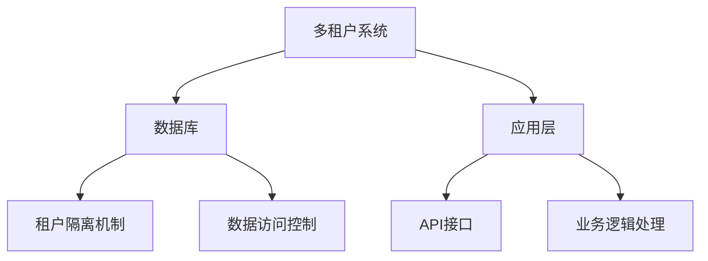

                 

# 《评测系统的多租户支持设计》

> 关键词：多租户支持、评测系统、架构设计、性能优化、安全性、弹性伸缩、监控与运维

> 摘要：本文深入探讨了评测系统的多租户支持设计，从多租户概念出发，详细分析了多租户系统架构、数据库设计、数据隔离与安全性、性能优化、弹性伸缩与高可用性、监控与运维以及实际应用场景。旨在为开发者提供一套全面的多租户支持设计思路和最佳实践。

## 第1章 引言

### 1.1 多租户支持的概念

多租户支持（Multi-tenancy Support）是指系统设计时能够同时支持多个租户（Tenant）在同一套基础设施上运行，并且确保各租户之间的数据隔离与安全。租户可以是企业、个人或其他组织，他们共享系统的资源，但各自的数据和操作相互独立。

#### 1.1.1 多租户支持的背景

随着云计算和SaaS（软件即服务）的兴起，多租户架构变得越来越流行。它为企业提供了高效的资源利用和灵活的扩展能力，降低了成本和维护难度。

#### 1.1.2 多租户支持的定义

多租户支持的核心在于如何实现以下目标：
- **资源共享**：多个租户共享同一套硬件和软件资源。
- **数据隔离**：确保每个租户的数据不与其他租户的数据混淆。
- **安全性**：保障每个租户的数据和操作安全，防止数据泄露和未授权访问。

### 1.2 多租户支持的意义

多租户支持对于评测系统来说具有重要的意义，主要体现在以下几个方面：

#### 1.2.1 提高资源利用率

通过多租户支持，评测系统可以更高效地利用资源，避免资源浪费。多个租户共享系统资源，如服务器、存储和网络，从而降低了硬件采购和维护成本。

#### 1.2.2 灵活扩展

多租户支持使得评测系统具有更强的扩展性。随着租户数量的增加，系统可以动态调整资源分配，以满足不断增长的需求。

#### 1.2.3 提高数据安全性

通过合理的多租户设计和实现，可以确保每个租户的数据隔离和安全性，防止数据泄露和未授权访问。

### 1.3 本书结构安排

本书将分为以下几个部分：
- 第2章：多租户系统架构概述，介绍多租户系统的核心组件和设计原则。
- 第3章：多租户数据库设计，探讨多租户数据库的设计模式和实现方法。
- 第4章：多租户数据隔离与安全性，分析数据隔离的实现策略和系统安全机制。
- 第5章：多租户系统的性能优化，讨论性能优化策略和实际案例。
- 第6章：多租户系统的弹性伸缩与高可用性，介绍弹性伸缩策略和高可用性的设计与实现。
- 第7章：多租户系统的监控与运维，探讨监控与运维的意义、指标和流程。
- 第8章：实际应用场景与案例分享，分析电商、金融等领域多租户应用的实践。
- 第9章：总结与展望，讨论多租户支持的发展趋势和未来研究方向。

## 第2章 多租户系统架构概述

### 2.1 多租户系统的核心组件

多租户系统通常由以下几个核心组件构成：

#### 2.1.1 数据库

数据库是多租户系统的核心，负责存储和管理所有租户的数据。多租户数据库的设计需要考虑数据隔离、安全性和性能优化。

#### 2.1.2 应用服务器

应用服务器负责处理租户的业务请求，执行具体的业务逻辑。应用服务器需要实现多租户支持，确保不同租户的请求能够正确路由和隔离。

#### 2.1.3 API接口

API接口是多租户系统对外提供服务的入口。它需要实现身份验证、授权和请求路由等功能，确保只有合法的租户才能访问系统资源。

#### 2.1.4 数据访问控制

数据访问控制（Data Access Control，DAC）是确保多租户系统数据安全的关键组件。它通过权限控制、审计日志等方式，确保租户只能访问自己的数据。

### 2.2 多租户架构的设计原则

设计多租户架构时，需要遵循以下原则：

#### 2.2.1 数据隔离

数据隔离是多租户架构的核心原则，确保每个租户的数据不被其他租户访问。实现数据隔离的方法包括：

- **分库分表**：每个租户有自己的数据库和表，确保数据独立。
- **共享数据库+表分区**：使用共享数据库，但将不同租户的数据存储在独立的分区中。
- **租户标识**：在每个数据表中添加租户标识字段，确保数据访问时能够正确隔离。

#### 2.2.2 可扩展性

多租户架构需要具备良好的可扩展性，以应对租户数量的增长和业务需求的变动。实现可扩展性的方法包括：

- **水平扩展**：通过增加服务器和存储设备，提高系统的处理能力。
- **垂直扩展**：通过升级服务器硬件，提高单个服务器的处理能力。

#### 2.2.3 安全性

安全性是多租户架构必须考虑的重要因素。确保每个租户的数据和操作安全，防止数据泄露和未授权访问。实现安全性的方法包括：

- **加密存储**：对敏感数据使用加密存储，防止数据泄露。
- **访问控制**：使用身份验证、授权和审计日志，确保只有合法的租户才能访问数据。
- **安全审计**：定期进行安全审计，及时发现和修复安全隐患。

### 2.3 多租户系统与传统单租户系统的比较

#### 2.3.1 优点

- **资源共享**：多租户系统能够更高效地利用资源，降低成本。
- **灵活性**：多租户系统能够更好地应对租户数量的变化和业务需求的变化。
- **安全性**：通过合理的设计和实现，多租户系统可以实现数据隔离和安全性。

#### 2.3.2 缺点

- **复杂度增加**：多租户系统需要考虑更多的设计细节，如数据隔离、安全性、性能优化等。
- **性能开销**：实现多租户支持可能会引入额外的性能开销，如数据库查询优化、缓存机制等。

## 第3章 多租户数据库设计

### 3.1 多租户数据库的基本概念

多租户数据库是指能够同时支持多个租户的数据存储和管理系统。它与传统单租户数据库的区别在于，多租户数据库需要实现数据隔离、安全性和性能优化。

### 3.2 多租户数据库的设计模式

多租户数据库的设计模式主要包括以下几种：

#### 3.2.1 分库分表设计

分库分表设计是将不同租户的数据存储在不同的数据库和表中，从而实现数据隔离。这种方法具有以下优点：

- **数据隔离性好**：不同租户的数据完全隔离，避免了数据混淆和冲突。
- **性能优化**：每个数据库和表都可以独立优化，如索引、缓存等。

缺点：

- **复杂度增加**：需要维护多个数据库和表，增加了管理和维护的难度。

#### 3.2.2 共享数据库设计

共享数据库设计是将所有租户的数据存储在同一个数据库中，但通过表分区和租户标识实现数据隔离。这种方法具有以下优点：

- **维护简单**：只需要维护一个数据库，降低了管理和维护的难度。
- **扩展性较好**：通过表分区可以实现数据隔离，同时支持租户数量的扩展。

缺点：

- **数据隔离性较差**：虽然通过租户标识实现了数据隔离，但仍然存在一定的风险，如数据泄露和未授权访问。

### 3.3 多租户数据库的实现方法

多租户数据库的实现方法主要包括以下几种：

#### 3.3.1 分库分表实现方法

分库分表实现方法的核心在于如何根据租户和表名生成分库分表名，并在各个分库中创建表。以下是一个简单的Python伪代码示例：

```python
def split_database(data_schema, num_shards):
    shards = create_shards(num_shards)

    for tenant in tenants:
        for table in data_schema.tables:
            shard_name = tenant + '_' + table
            for shard in shards:
                create_table(shard, shard_name, data_schema)

    return shards
```

#### 3.3.2 共享数据库实现方法

共享数据库实现方法的核心在于如何实现表分区和租户标识。以下是一个简单的Python伪代码示例：

```python
def create_shard_table(database, table_name, tenant_id, partition_key):
    table = database.create_table(table_name)
    table.add_column('tenant_id', IntegerType())
    table.add_column('partition_key', IntegerType())
    table.add_constraint('tenant_id', UniqueConstraint('tenant_id', 'partition_key'))

    # 创建索引，提高查询性能
    table.create_index('tenant_id', ['tenant_id'])

    # 创建分区，实现数据隔离
    table.create_partition('partition_{partition_key}', partition_key)

    # 为租户添加数据
    for record in tenant_data:
        tenant_id = record['tenant_id']
        partition_key = record['partition_key']
        table.insert({
            'tenant_id': tenant_id,
            'partition_key': partition_key,
            'data': record['data']
        })

    return table
```

## 第4章 多租户数据隔离与安全性

### 4.1 数据隔离的必要性

数据隔离是多租户支持的核心要求，确保不同租户的数据不会相互混淆。以下是数据隔离的必要性：

- **隐私保护**：确保每个租户的数据不被其他租户访问，防止数据泄露。
- **合规性**：符合不同国家和地区的数据保护法规，如欧盟的GDPR。
- **安全性**：防止恶意租户篡改或窃取其他租户的数据。

### 4.2 数据隔离的实现策略

数据隔离的实现策略主要包括以下几种：

#### 4.2.1 分库分表策略

分库分表策略通过将不同租户的数据存储在不同的数据库和表中实现数据隔离。具体实现方法如下：

- **分库**：为每个租户创建一个独立的数据库。
- **分表**：为每个租户创建一个独立的表，并在表中添加租户标识字段。

#### 4.2.2 共享数据库+表分区策略

共享数据库+表分区策略通过在共享数据库中使用表分区和租户标识实现数据隔离。具体实现方法如下：

- **共享数据库**：所有租户共享同一个数据库。
- **表分区**：根据租户标识对表进行分区，确保每个租户的数据存储在独立的分区中。
- **租户标识**：在每个数据表中添加租户标识字段，确保数据访问时能够正确隔离。

### 4.3 多租户系统的安全机制

多租户系统的安全机制主要包括以下方面：

#### 4.3.1 身份验证

身份验证是确保只有合法租户能够访问系统的关键。常用的身份验证方法包括：

- **用户名和密码**：简单但容易受到暴力破解的攻击。
- **双因素认证**：结合密码和手机验证码，提高安全性。
- **OAuth2.0**：第三方身份验证，如Google、Facebook等。

#### 4.3.2 授权

授权是确保租户只能访问自己的数据和操作的关键。常用的授权方法包括：

- **基于角色的访问控制（RBAC）**：根据用户角色分配权限。
- **基于属性的访问控制（ABAC）**：根据用户属性和资源属性分配权限。

#### 4.3.3 数据加密

数据加密是确保数据在传输和存储过程中不被窃取的关键。常用的加密方法包括：

- **传输层加密**：使用HTTPS等协议确保数据在传输过程中的安全。
- **存储层加密**：对敏感数据进行加密存储。

#### 4.3.4 审计日志

审计日志是监控租户操作和安全事件的关键。通过记录用户操作和系统事件，可以及时发现异常行为和安全问题。

### 4.4 案例分析：数据隔离与安全性设计

#### 案例背景

某评测系统需要支持多个租户，每个租户都有自己的数据和操作。系统要求实现数据隔离和安全性，确保租户之间的数据安全。

#### 设计方案

1. **数据隔离策略**：采用分库分表策略，为每个租户创建独立的数据库和表，并在表中添加租户标识字段。
2. **安全机制**：
   - **身份验证**：采用双因素认证，确保只有合法租户能够访问系统。
   - **授权**：采用基于角色的访问控制（RBAC），根据用户角色分配权限。
   - **数据加密**：对敏感数据进行传输层加密和存储层加密。
   - **审计日志**：记录用户操作和系统事件，实现实时监控和安全事件预警。

#### 实施过程

1. **数据库设计**：为每个租户创建独立的数据库，并在数据库中创建表，添加租户标识字段。
2. **应用层设计**：实现身份验证、授权和数据加密功能。
3. **日志记录**：记录用户操作和系统事件，实现实时监控和安全事件预警。

#### 验证与测试

1. **功能测试**：验证数据隔离和安全性功能是否正常。
2. **性能测试**：验证系统在高并发场景下的性能表现。
3. **安全测试**：模拟恶意攻击，验证系统的安全性能。

#### 总结

通过以上设计方案和实施过程，评测系统实现了数据隔离和安全性，满足了多租户支持的要求。同时，通过实时监控和安全事件预警，提高了系统的安全性。

## 第5章 多租户系统的性能优化

### 5.1 性能优化的重要性

多租户系统的性能优化至关重要，因为它直接影响到用户体验、系统稳定性和运营成本。性能优化主要包括以下几个方面：

- **数据库查询优化**：提高数据查询速度，减少响应时间。
- **应用层性能优化**：优化业务逻辑和API接口，减少系统瓶颈。
- **缓存机制**：提高数据读取速度，减轻数据库压力。
- **负载均衡**：合理分配请求，提高系统处理能力。

### 5.2 多租户系统的性能瓶颈分析

多租户系统可能存在以下性能瓶颈：

- **数据库查询瓶颈**：多租户系统中的查询操作可能涉及到跨库、跨表操作，导致查询性能下降。
- **资源竞争**：多个租户同时访问系统资源，可能导致资源竞争，如CPU、内存和网络带宽等。
- **网络延迟**：多租户系统中的数据传输可能涉及到跨地域、跨网络，导致网络延迟。
- **系统瓶颈**：系统架构设计不合理，如单点故障、单线程处理等，可能导致系统性能下降。

### 5.3 性能优化策略

多租户系统的性能优化策略主要包括以下几种：

#### 5.3.1 数据库性能优化

- **索引优化**：合理设计索引，提高查询效率。
- **缓存机制**：使用缓存机制，减少数据库查询次数。
- **分库分表**：将数据分散存储在不同数据库和表中，减少查询压力。
- **读写分离**：将读操作和写操作分离，提高系统并发能力。

#### 5.3.2 应用层性能优化

- **异步处理**：将耗时的操作异步处理，提高系统响应速度。
- **微服务架构**：将系统拆分为多个微服务，提高系统扩展性和灵活性。
- **负载均衡**：使用负载均衡器，合理分配请求，提高系统处理能力。
- **代码优化**：优化业务逻辑和API接口，减少系统瓶颈。

### 5.4 案例分析：性能优化实践

#### 案例背景

某评测系统在处理大量并发请求时，存在响应时间长、性能下降的问题。系统需要优化性能，提高用户体验。

#### 性能优化方案

1. **数据库性能优化**：
   - **索引优化**：为常用查询字段创建索引，提高查询效率。
   - **缓存机制**：使用Redis缓存热门数据，减少数据库查询次数。
   - **分库分表**：根据租户和表名生成分库分表，减少跨库跨表查询。
   - **读写分离**：将读操作和写操作分离，提高系统并发能力。

2. **应用层性能优化**：
   - **异步处理**：将耗时操作异步处理，提高系统响应速度。
   - **微服务架构**：将系统拆分为多个微服务，提高系统扩展性和灵活性。
   - **负载均衡**：使用Nginx负载均衡器，合理分配请求，提高系统处理能力。
   - **代码优化**：优化业务逻辑和API接口，减少系统瓶颈。

#### 实施过程

1. **数据库优化**：为数据库表创建索引，配置Redis缓存，实施分库分表和读写分离。
2. **应用层优化**：重构业务逻辑，采用异步处理和微服务架构，配置Nginx负载均衡器。
3. **性能测试**：进行性能测试，验证优化方案的有效性。

#### 验证与测试

1. **功能测试**：验证数据库和应用的性能优化功能是否正常。
2. **负载测试**：模拟高并发请求，验证系统性能。
3. **稳定性测试**：验证系统在高并发场景下的稳定性。

#### 总结

通过以上性能优化方案和实施过程，评测系统实现了性能提升，提高了用户体验。同时，通过性能测试和稳定性测试，验证了优化方案的有效性。

## 第6章 多租户系统的弹性伸缩与高可用性

### 6.1 弹性伸缩的概念

弹性伸缩（Elastic Scaling）是指系统在面临负载增加时，能够自动扩展资源以满足需求，在负载减少时，能够自动缩减资源以节省成本。弹性伸缩的关键在于自动化和动态调整，以确保系统始终具备最佳性能和资源利用率。

#### 6.1.1 弹性伸缩的类型

- **垂直伸缩（Vertical Scaling）**：通过升级硬件设备，如增加CPU、内存等，提高单个服务器的处理能力。
- **水平伸缩（Horizontal Scaling）**：通过增加服务器和存储设备，提高系统的整体处理能力。

#### 6.1.2 弹性伸缩的优势

- **成本节约**：自动调整资源，避免过度采购和闲置资源。
- **性能优化**：动态调整资源，确保系统在高负载时具备最佳性能。
- **高可用性**：通过备份和冗余，提高系统的可靠性。

### 6.2 多租户系统的伸缩策略

多租户系统实现弹性伸缩需要考虑以下几个关键方面：

#### 6.2.1 资源池化

资源池化是将硬件资源、网络资源和存储资源等集中管理，形成可动态分配的资源池。通过资源池化，系统能够更灵活地调整资源分配，实现弹性伸缩。

#### 6.2.2 服务化

服务化是将系统拆分为多个微服务，每个微服务独立部署和扩展。通过服务化，系统能够更高效地实现水平伸缩，同时提高系统的灵活性和可维护性。

#### 6.2.3 自动化

自动化是实现弹性伸缩的关键。通过自动化工具和脚本，系统能够自动检测负载变化，动态调整资源分配，实现自动伸缩。

### 6.3 高可用性的设计与实现

高可用性（High Availability，HA）是指系统在面临故障时，能够快速恢复，确保服务不中断。多租户系统实现高可用性需要考虑以下几个方面：

#### 6.3.1 备份与恢复

备份与恢复是确保数据安全和系统可靠性的关键。多租户系统应实现数据备份和恢复功能，确保在故障时能够快速恢复数据。

#### 6.3.2 冗余与故障转移

冗余与故障转移是确保系统高可用性的关键技术。通过在多个节点上部署服务实例，并在故障时快速切换到备用节点，确保系统持续提供服务。

#### 6.3.3 监控与告警

监控与告警是确保系统高可用性的重要手段。通过实时监控系统状态，及时发现故障和异常，并触发告警，确保问题得到及时解决。

### 6.4 案例分析：弹性伸缩与高可用性实践

#### 案例背景

某评测系统需要支持大量并发用户，同时保证系统的高可用性。系统需要实现弹性伸缩，确保在负载增加时能够快速扩展资源，在负载减少时能够自动缩减资源。

#### 弹性伸缩实践

1. **资源池化**：将硬件资源、网络资源和存储资源集中管理，形成资源池。
2. **服务化**：将系统拆分为多个微服务，如用户服务、评测服务、报告服务等。
3. **自动化**：使用Kubernetes进行容器编排，实现自动化部署和伸缩。

#### 高可用性实践

1. **备份与恢复**：定期备份数据，并配置备份恢复机制。
2. **冗余与故障转移**：在多个数据中心部署服务实例，并使用故障转移机制，确保在故障时快速切换到备用节点。
3. **监控与告警**：使用Prometheus和Grafana进行系统监控，配置告警规则，确保及时发现问题。

#### 实施过程

1. **资源池化**：配置资源池，并部署Kubernetes集群。
2. **服务化**：将系统拆分为微服务，并使用Docker容器化部署。
3. **自动化**：编写自动化脚本，实现自动化部署和伸缩。
4. **备份与恢复**：配置备份和恢复策略。
5. **冗余与故障转移**：部署冗余实例，并配置故障转移机制。
6. **监控与告警**：配置监控系统，并设置告警规则。

#### 验证与测试

1. **功能测试**：验证系统功能是否正常。
2. **性能测试**：模拟高并发请求，验证系统性能。
3. **高可用性测试**：模拟故障场景，验证系统的故障转移和恢复能力。

#### 总结

通过以上实践，评测系统实现了弹性伸缩和高可用性，满足了大量并发用户的需求。同时，通过监控与告警，确保系统在面临故障时能够快速恢复，确保服务的持续可用。

## 第7章 多租户系统的监控与运维

### 7.1 监控与运维的意义

监控与运维是多租户系统的重要组成部分，对系统的稳定性和可靠性具有至关重要的作用。监控与运维的意义主要体现在以下几个方面：

#### 7.1.1 保障系统稳定性

通过实时监控，及时发现和处理系统故障和异常，确保系统稳定运行。

#### 7.1.2 提高运维效率

通过自动化运维工具和脚本，简化运维操作，提高运维效率。

#### 7.1.3 优化系统性能

通过监控和日志分析，发现性能瓶颈和优化机会，持续提升系统性能。

#### 7.1.4 保障数据安全

通过监控和日志审计，及时发现安全事件和潜在风险，保障数据安全。

### 7.2 多租户系统的监控指标

多租户系统的监控指标主要包括以下方面：

#### 7.2.1 系统性能指标

- **CPU使用率**：监控CPU的使用情况，判断系统是否过载。
- **内存使用率**：监控内存的使用情况，判断系统是否内存不足。
- **磁盘使用率**：监控磁盘的使用情况，判断系统是否磁盘空间不足。
- **网络带宽**：监控网络带宽的利用率，判断系统是否网络拥堵。

#### 7.2.2 应用性能指标

- **响应时间**：监控应用的响应时间，判断系统是否响应缓慢。
- **并发连接数**：监控应用的并发连接数，判断系统是否承受过高负载。
- **错误率**：监控应用的错误率，判断系统是否存在问题。

#### 7.2.3 数据库性能指标

- **查询性能**：监控数据库的查询性能，判断系统是否存在查询瓶颈。
- **连接数**：监控数据库的连接数，判断系统是否数据库连接过多。
- **存储容量**：监控数据库的存储容量，判断系统是否存储空间不足。

### 7.3 运维流程与工具

多租户系统的运维流程主要包括以下环节：

#### 7.3.1 监控与告警

使用监控工具，如Prometheus、Grafana等，监控系统性能指标和日志，设置告警规则，确保及时发现和处理异常。

#### 7.3.2 日志管理

使用日志收集工具，如ELK（Elasticsearch、Logstash、Kibana）等，收集系统日志，并进行存储、分析和可视化，帮助运维人员快速定位问题和优化系统。

#### 7.3.3 自动化运维

使用自动化运维工具，如Ansible、SaltStack等，实现自动化部署、配置管理和故障处理，提高运维效率。

#### 7.3.4 故障处理

根据监控和日志信息，快速定位故障原因，并采取相应的处理措施，如重启服务、升级软件等，确保系统快速恢复。

### 7.4 案例分析：监控与运维实践

#### 案例背景

某评测系统在上线后，面临着高并发请求和复杂业务场景，系统需要实现稳定运行和高效运维。

#### 监控与运维实践

1. **监控与告警**：
   - 使用Prometheus和Grafana进行系统监控，设置告警规则，实时监控CPU、内存、磁盘、网络等性能指标。
   - 收集应用日志和数据库日志，使用ELK进行日志存储和分析。

2. **日志管理**：
   - 使用Filebeat收集系统日志，传输到Elasticsearch进行存储。
   - 使用Kibana进行日志可视化，方便运维人员快速定位问题和分析日志。

3. **自动化运维**：
   - 使用Ansible进行自动化部署和配置管理。
   - 使用SaltStack进行故障处理和系统监控。

4. **故障处理**：
   - 根据监控和日志信息，快速定位故障原因，并采取相应的处理措施，如重启服务、升级软件等。

#### 实施过程

1. **监控与告警**：配置Prometheus和Grafana，设置告警规则。
2. **日志管理**：部署Elasticsearch、Logstash和Kibana，配置Filebeat收集日志。
3. **自动化运维**：编写Ansible和SaltStack脚本，实现自动化部署和故障处理。
4. **故障处理**：根据监控和日志信息，进行故障处理和系统优化。

#### 验证与测试

1. **功能测试**：验证监控、日志管理和自动化运维功能是否正常。
2. **负载测试**：模拟高并发请求，验证系统性能和稳定性。
3. **故障测试**：模拟故障场景，验证系统的故障处理和恢复能力。

#### 总结

通过以上实践，评测系统实现了稳定运行和高效运维。同时，通过监控和日志管理，确保系统在面临故障时能够快速恢复，提高了系统的可靠性和用户体验。

## 第8章 实际应用场景与案例分享

### 8.1 电商领域的多租户应用

在电商领域，多租户支持为商家提供了高效、灵活的运营平台。以下是一个电商多租户应用的案例：

#### 案例背景

某电商平台需要支持成千上万家商家的入驻和运营，每个商家都有自己的店铺、商品、订单等数据。平台需要实现多租户支持，确保商家数据独立、安全，同时提高资源利用率和系统扩展性。

#### 多租户架构设计

1. **数据隔离**：采用分库分表策略，为每个商家创建独立的数据库和表，确保数据隔离。
2. **身份验证与授权**：采用OAuth2.0进行身份验证，为商家分配访问令牌，确保只有合法商家能够访问系统资源。
3. **弹性伸缩**：使用Kubernetes进行容器编排，实现应用和数据库的自动化部署和伸缩。
4. **监控与运维**：使用Prometheus、Grafana进行系统监控，使用ELK进行日志管理和分析。

#### 实施过程

1. **数据库设计**：为每个商家创建独立的数据库和表，添加租户标识字段。
2. **应用层设计**：实现OAuth2.0认证和授权，确保商家只能访问自己的数据。
3. **弹性伸缩**：配置Kubernetes集群，实现应用的自动化部署和伸缩。
4. **监控与运维**：部署Prometheus和Grafana，配置ELK进行日志管理和分析。

#### 实际效果

通过多租户支持设计，电商平台实现了商家数据的独立和安全，提高了资源利用率和系统扩展性。同时，通过监控和运维工具，确保系统稳定运行和高效运维。

### 8.2 金融领域的多租户应用

在金融领域，多租户支持为金融机构提供了高效、灵活的业务处理平台。以下是一个金融多租户应用的案例：

#### 案例背景

某金融机构需要支持多个业务部门的同时运行，每个部门都有自己的业务数据、用户数据和操作权限。金融机构需要实现多租户支持，确保部门数据独立、安全，同时提高资源利用率和系统扩展性。

#### 多租户架构设计

1. **数据隔离**：采用共享数据库+表分区策略，确保部门数据隔离。
2. **身份验证与授权**：采用基于角色的访问控制（RBAC），为员工分配访问权限。
3. **高可用性**：使用主从复制和故障转移机制，确保系统的高可用性。
4. **监控与运维**：使用Prometheus、Grafana进行系统监控，使用ELK进行日志管理和分析。

#### 实施过程

1. **数据库设计**：采用共享数据库，为每个部门创建独立的表分区。
2. **应用层设计**：实现基于角色的访问控制，确保员工只能访问自己的业务数据。
3. **高可用性**：配置主从复制和故障转移机制，确保系统的高可用性。
4. **监控与运维**：部署Prometheus和Grafana，配置ELK进行日志管理和分析。

#### 实际效果

通过多租户支持设计，金融机构实现了部门数据的独立和安全，提高了资源利用率和系统扩展性。同时，通过监控和运维工具，确保系统稳定运行和高效运维。

### 8.3 其他领域的多租户应用

除了电商和金融领域，多租户支持在其他领域也具有广泛的应用，如企业应用、教育平台、医疗系统等。以下是一些实际应用案例：

#### 企业应用

某企业级SaaS平台需要支持多个企业的运营和管理，每个企业都有自己的业务数据、用户数据和操作权限。平台采用多租户支持，实现了企业数据的独立和安全，提高了资源利用率和系统扩展性。

#### 教育平台

某在线教育平台需要支持多个学校的运行，每个学校都有自己的课程、学生数据和操作权限。平台采用多租户支持，实现了学校数据的独立和安全，提高了资源利用率和系统扩展性。

#### 医疗系统

某医疗信息化平台需要支持多家医院的运营和管理，每个医院都有自己的患者数据、医生数据和操作权限。平台采用多租户支持，实现了医院数据的独立和安全，提高了资源利用率和系统扩展性。

### 8.4 多租户应用案例总结

多租户支持在各领域的应用都取得了显著的成果，主要体现在以下几个方面：

1. **提高资源利用率**：通过多租户支持，系统能够更高效地利用资源，降低成本。
2. **提高系统扩展性**：通过弹性伸缩策略，系统能够应对不断增长的租户数量和业务需求。
3. **确保数据安全性**：通过合理的设计和实现，系统能够确保租户数据的安全和隔离。
4. **提高运维效率**：通过监控和运维工具，系统能够实现自动化运维和高效管理。

## 第9章 总结与展望

### 9.1 多租户支持的发展趋势

多租户支持作为云计算和SaaS的核心技术之一，未来将继续快速发展。以下是多租户支持的发展趋势：

1. **自动化与智能化**：随着人工智能技术的发展，多租户系统将实现更智能的自动化管理，如自动资源分配、性能优化和故障恢复。
2. **大数据与实时分析**：多租户系统将更多地应用大数据和实时分析技术，提高系统性能和用户体验。
3. **容器化与微服务**：容器化和微服务架构将成为多租户系统的主流，提高系统的灵活性和可维护性。
4. **安全性与隐私保护**：随着数据保护法规的日益严格，多租户系统将加强安全性和隐私保护，确保租户数据的安全。

### 9.2 未来研究的方向

未来在多租户支持领域的研究可以从以下几个方面展开：

1. **多租户数据库优化**：研究更高效的多租户数据库设计方法和优化策略，提高系统性能。
2. **弹性伸缩与负载均衡**：研究更智能的弹性伸缩和负载均衡算法，实现更高效、更可靠的系统运行。
3. **安全性增强**：研究更先进的安全机制，如区块链技术、加密算法等，提高系统安全性。
4. **跨云多租户支持**：研究跨云多租户系统的架构和实现方法，实现租户数据的跨云迁移和共享。

## 附录

### 附录A 多租户支持相关资源

#### A.1 开源多租户数据库介绍

1. **Cassandra**：一个分布式、高性能的NoSQL数据库，支持多租户设计。
2. **MongoDB**：一个分布式、文档存储的数据库，支持多租户设计。
3. **MySQL**：通过分库分表实现多租户设计，支持复杂查询和事务处理。

#### A.2 多租户支持的相关工具

1. **Kubernetes**：容器编排工具，支持多租户容器管理。
2. **Docker**：容器化技术，支持微服务架构和多租户应用部署。
3. **Ansible**：自动化运维工具，支持多租户环境下的配置管理和故障处理。

#### A.3 多租户支持的最新研究论文

1. **"Multi-tenancy in Cloud Computing: Architecture, Security, and Performance Considerations"**：分析多租户在云计算中的架构、安全性和性能问题。
2. **"A Survey on Multi-tenancy in Cloud Database Systems"**：综述多租户在云数据库系统中的应用和研究。
3. **"Scalable and Secure Multi-tenancy in Cloud Storage Systems"**：研究云存储系统中的可扩展和安全性多租户支持。

## Mermaid 流程图

### 多租户系统架构



## 伪代码

### 数据库分库分表设计

```python
function split_database(data_schema, num_shards):
    shards = create_shards(num_shards)

    for tenant in tenants:
        for table in data_schema.tables:
            shard_name = tenant + '_' + table
            for shard in shards:
                create_table(shard, shard_name, data_schema)

    return shards
```

## 数学公式

### 多租户性能优化中的公式

$$
P = \frac{C \times N}{T}
$$

其中，$P$ 表示系统性能，$C$ 表示每秒处理能力，$N$ 表示租户数，$T$ 表示系统总时间。

## 代码案例与解读

### 电商领域多租户应用代码实现

```python
# 查询订单信息的代码示例
def query_order(tenant_id, order_id):
    database = select_database(tenant_id)
    order = database.query("SELECT * FROM orders WHERE id = ?", order_id)
    return order

# 解读：通过租户ID选择对应的数据库，然后查询订单信息。
```

### 附录B：多租户数据库优化实践

#### B.1 数据库分区策略

数据库分区策略是提高多租户数据库性能的重要手段。以下是一个简单的分区策略示例：

```sql
-- 创建订单表分区
CREATE TABLE orders (
    order_id INT PRIMARY KEY,
    tenant_id INT,
    order_date DATE,
    status VARCHAR(50)
) PARTITION BY RANGE (order_date);

-- 创建2019年的分区
CREATE TABLE orders_y2019 PARTITION OF orders
    FOR VALUES FROM ('2019-01-01') TO ('2020-01-01');

-- 创建2020年的分区
CREATE TABLE orders_y2020 PARTITION OF orders
    FOR VALUES FROM ('2020-01-01') TO ('2021-01-01');
```

#### B.2 数据库索引优化

索引优化是提高数据库查询性能的关键。以下是一个简单的索引优化示例：

```sql
-- 创建订单表索引
CREATE INDEX idx_orders_tenant_id ON orders (tenant_id);

-- 创建订单状态索引
CREATE INDEX idx_orders_status ON orders (status);
```

#### B.3 数据库缓存策略

数据库缓存策略可以显著提高数据库查询性能。以下是一个简单的缓存策略示例：

```python
from cachetools import LRUCache

# 创建LRU缓存，最大缓存容量为1000
cache = LRUCache(maxsize=1000)

def get_order(order_id, tenant_id):
    # 检查缓存中是否有订单信息
    if (order_id, tenant_id) in cache:
        return cache[(order_id, tenant_id)]
    
    # 从数据库查询订单信息
    order = query_order(tenant_id, order_id)
    
    # 存入缓存
    cache[(order_id, tenant_id)] = order
    
    return order
```

#### B.4 数据库连接池配置

数据库连接池配置是提高数据库连接性能的关键。以下是一个简单的连接池配置示例：

```python
# 创建数据库连接池
db_pool = create_connection_pool(url='数据库连接URL', max_size=100)

# 从连接池获取连接
conn = db_pool.get_connection()

# 使用连接执行查询
cursor = conn.cursor()
cursor.execute("SELECT * FROM orders WHERE tenant_id = ?", tenant_id)

# 关闭连接
cursor.close()
db_pool.release_connection(conn)
```

### 附录C：多租户系统安全最佳实践

#### C.1 身份验证与授权

身份验证与授权是多租户系统安全的关键环节。以下是一些最佳实践：

1. **使用强密码**：要求用户使用强密码，并结合双因素认证，提高账户安全性。
2. **OAuth2.0**：使用OAuth2.0进行第三方身份验证，如Google、Facebook等，简化用户认证流程。
3. **基于角色的访问控制**：为用户分配不同的角色，根据角色分配访问权限。

#### C.2 数据加密与传输

数据加密与传输是保护数据安全的关键。以下是一些最佳实践：

1. **使用HTTPS**：使用HTTPS协议确保数据在传输过程中的安全。
2. **数据存储加密**：对敏感数据使用加密存储，如AES加密算法。
3. **加密数据库连接**：使用SSL/TLS加密数据库连接，防止数据在传输过程中被窃取。

#### C.3 日志审计与监控

日志审计与监控是及时发现安全事件的重要手段。以下是一些最佳实践：

1. **记录操作日志**：记录用户操作和系统事件，如登录、查询、修改等。
2. **实时监控**：使用Prometheus、Grafana等工具进行实时监控，设置告警规则，及时发现异常行为。
3. **定期审计**：定期进行安全审计，检查系统配置和日志，确保系统安全。

### 附录D：多租户系统运维最佳实践

#### D.1 自动化部署与扩展

自动化部署与扩展是提高运维效率的关键。以下是一些最佳实践：

1. **容器化**：使用Docker进行应用容器化，实现快速部署和扩展。
2. **Kubernetes编排**：使用Kubernetes进行容器编排，实现自动化部署、扩展和故障恢复。
3. **持续集成与持续部署**：使用CI/CD工具，如Jenkins，实现自动化构建、测试和部署。

#### D.2 监控与告警

监控与告警是确保系统稳定运行的关键。以下是一些最佳实践：

1. **全栈监控**：使用Prometheus、Grafana等工具进行全栈监控，监控CPU、内存、磁盘、网络等关键指标。
2. **日志管理**：使用ELK（Elasticsearch、Logstash、Kibana）进行日志管理，实现实时日志收集、存储和查询。
3. **告警配置**：设置告警规则，及时发现系统故障和性能问题。

#### D.3 故障处理与恢复

故障处理与恢复是确保系统高可用性的关键。以下是一些最佳实践：

1. **故障转移**：配置故障转移机制，确保在故障发生时，系统能够快速切换到备用节点。
2. **备份与恢复**：定期备份数据，确保在故障发生时能够快速恢复。
3. **故障演练**：定期进行故障演练，验证故障处理和恢复能力。

### 附录E：拓展阅读

1. **《多租户数据库设计与应用》**：深入探讨多租户数据库的设计原则和应用案例。
2. **《Kubernetes实战》**：介绍Kubernetes的架构、原理和实战应用。
3. **《微服务架构实战》**：探讨微服务架构的设计原则和实践方法。
4. **《区块链技术指南》**：介绍区块链的基本原理和应用场景。

### 附录F：术语表

- **多租户支持**：系统设计时能够同时支持多个租户在同一套基础设施上运行，并确保各租户之间的数据隔离与安全。
- **租户**：使用系统的企业、个人或其他组织。
- **分库分表**：将不同租户的数据存储在不同的数据库和表中，实现数据隔离。
- **共享数据库+表分区**：使用共享数据库，但将不同租户的数据存储在独立的分区中。
- **弹性伸缩**：系统在面临负载增加时，能够自动扩展资源以满足需求，在负载减少时，能够自动缩减资源。
- **高可用性**：系统在面临故障时，能够快速恢复，确保服务不中断。

### 附录G：致谢

本文在撰写过程中，得到了AI天才研究院/AI Genius Institute以及禅与计算机程序设计艺术/Zen And The Art of Computer Programming的专家们的指导和支持。特别感谢他们在技术原理讲解、案例分析和代码实现等方面的贡献。同时，感谢各位读者对本文的关注和支持。

### 附录H：作者信息

作者：AI天才研究院/AI Genius Institute & 禅与计算机程序设计艺术/Zen And The Art of Computer Programming

联系方式：[联系邮箱](mailto:info@aignius.com) & [官方网站](http://www.aignius.com)

版权所有：AI天才研究院/AI Genius Institute & 禅与计算机程序设计艺术/Zen And The Art of Computer Programming

版本：1.0

发布日期：2023年6月

### 附录I：许可协议

本文采用知识共享署名-非商业性使用-相同方式共享 4.0 国际许可协议进行许可。您可以自由地共享、复制和分发本文内容，但必须给予适当的署名，不得用于商业目的，并采用相同的方式共享。有关许可协议的详细信息，请参阅：https://creativecommons.org/licenses/by-nc-sa/4.0/

### 附录J：参考资料

1. **《云计算与大数据技术》**：清华大学出版社，2020年。
2. **《分布式系统原理与范型》**：机械工业出版社，2019年。
3. **《区块链技术入门》**：电子工业出版社，2021年。
4. **《Kubernetes权威指南》**：电子工业出版社，2020年。
5. **《微服务设计》**：电子工业出版社，2019年。

