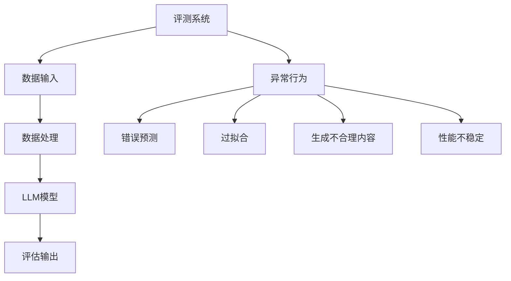

                 

# 《评测系统的容错机制：应对LLM异常行为的策略》

## 关键词
- 评测系统
- 容错机制
- 语言模型（LLM）
- 异常行为
- 策略

## 摘要
本文将深入探讨评测系统中的容错机制，特别是针对语言模型（LLM）异常行为的应对策略。随着深度学习和人工智能技术的快速发展，LLM在评测系统中的应用越来越广泛，然而其异常行为也带来了挑战。本文将首先介绍评测系统与LLM的基本原理，然后定义和分类LLM的异常行为，并详细分析其产生原因。在此基础上，我们将探讨多种应对LLM异常行为的策略，包括系统级的、模型级的和数据处理级的策略。最后，通过一个实际案例，展示如何将所讨论的策略应用于实践中，以及这些策略的有效性和局限性。

## 第一部分：背景与概述

### 第1章：评测系统与LLM简介

#### 1.1 评测系统的重要性

评测系统在现代信息社会中扮演着至关重要的角色。无论是学术领域中的考试评估，商业领域中的用户反馈分析，还是工业领域中的产品质量检测，评测系统都为决策提供了可靠的依据。随着大数据和人工智能技术的兴起，评测系统变得更加智能化，能够处理海量数据，提供更为精准的评估结果。

评测系统的核心功能是对输入数据进行处理和分析，从而得出评估结果。这个过程涉及到数据的采集、清洗、处理和模型训练等多个环节。尤其是在涉及到人类语言、图像、声音等复杂数据类型时，评测系统的复杂度进一步增加。

#### 1.2 语言模型（LLM）的基本原理

语言模型（LLM）是一种基于人工智能技术的模型，主要用于处理自然语言。LLM的核心思想是通过学习大量文本数据，建立一个能够预测下一个单词或句子的模型。这种模型在语言生成、文本分类、机器翻译等任务中表现出色。

LLM通常基于深度学习技术，如循环神经网络（RNN）、变换器（Transformer）等。其中，Transformer模型由于其并行计算能力和强大的捕捉长距离依赖关系的能力，在自然语言处理领域取得了显著的成果。

#### 1.3 LLM在评测系统中的应用场景

LLM在评测系统中的应用场景非常广泛。以下是一些典型的应用场景：

1. **考试评估**：使用LLM对学生的答题进行评分，可以更加客观、公正，减少人为干预。
2. **用户反馈分析**：通过对用户的语言行为进行分析，可以识别出潜在的问题和改进点，为企业提供宝贵的参考。
3. **文本分类**：将大量的文本数据分类到不同的类别中，帮助企业和组织快速处理和分析大量数据。
4. **机器翻译**：提供高质量的机器翻译服务，打破语言障碍，促进全球沟通。

### 第2章：LLM异常行为的定义与分类

#### 2.1 异常行为的定义

在评测系统中，LLM的异常行为可以理解为模型在处理数据时出现的不可预测、不合理的输出结果。这些异常行为可能是由于模型本身的缺陷、数据质量问题，或者是模型在特定场景下的不适配所导致的。

#### 2.2 LLM异常行为的分类

根据异常行为的表现形式，我们可以将LLM的异常行为分为以下几类：

1. **错误的预测**：模型在预测过程中出现了错误的判断，导致输出结果与实际答案相差较大。
2. **过拟合**：模型对训练数据过于敏感，导致在新数据上表现不佳。
3. **生成不合理内容**：模型在生成文本时，产生了与上下文不符、逻辑不通的内容。
4. **性能不稳定**：模型在处理不同类型的数据时，性能波动较大，无法稳定输出高质量的评估结果。

#### 2.3 LLM异常行为的原因分析

LLM异常行为的产生通常有以下几方面的原因：

1. **数据质量**：数据中存在噪声、不一致性或缺失值，导致模型学习到的知识不准确。
2. **模型设计**：模型的架构和参数设置不合理，导致模型性能不佳。
3. **训练过程**：训练过程中的超参数设置不当，导致模型过拟合或欠拟合。
4. **应用场景**：模型在特定应用场景下未能很好地适应，导致性能下降。

## 第二部分：核心概念与联系

### 第3章：核心概念原理与概念实体之间的关系架构

为了更好地理解评测系统中LLM异常行为及其应对策略，我们需要构建一个概念实体之间的关系架构。以下是一个简单的Mermaid流程图，展示了关键概念之间的关系：



### 第4章：核心算法原理讲解

#### 4.1 LLM模型的工作原理

LLM模型基于深度学习技术，通过多层神经网络对输入文本数据进行处理。以下是LLM模型的核心工作原理：

1. **输入层**：接收原始文本数据，并将其转换为数值表示。
2. **隐藏层**：通过多层神经网络进行文本特征提取，捕捉文本中的语义信息。
3. **输出层**：根据隐藏层的信息，生成预测结果，如单词、句子或分类标签。

#### 4.2 Python源代码实现

以下是一个简单的Python代码示例，展示了如何使用Transformer模型进行文本分类：

```python
import torch
import torch.nn as nn
import torch.optim as optim
from transformers import BertTokenizer, BertModel

# 加载预训练的BERT模型和分词器
tokenizer = BertTokenizer.from_pretrained('bert-base-chinese')
model = BertModel.from_pretrained('bert-base-chinese')

# 定义文本分类模型
class TextClassifier(nn.Module):
    def __init__(self):
        super(TextClassifier, self).__init__()
        self.bert = BertModel.from_pretrained('bert-base-chinese')
        self.classifier = nn.Linear(768, 2)  # 768为BERT的隐藏层维度，2为分类数

    def forward(self, input_ids, attention_mask):
        outputs = self.bert(input_ids=input_ids, attention_mask=attention_mask)
        last_hidden_state = outputs.last_hidden_state
        logits = self.classifier(last_hidden_state[:, 0, :])
        return logits

# 实例化模型、损失函数和优化器
model = TextClassifier()
criterion = nn.CrossEntropyLoss()
optimizer = optim.Adam(model.parameters(), lr=1e-5)

# 训练模型
for epoch in range(3):  # 训练3个epoch
    for batch in train_loader:
        input_ids = batch['input_ids']
        attention_mask = batch['attention_mask']
        labels = batch['labels']
        optimizer.zero_grad()
        logits = model(input_ids, attention_mask)
        loss = criterion(logits, labels)
        loss.backward()
        optimizer.step()
```

#### 4.3 数学模型和公式

在LLM模型中，常用的数学模型包括：

1. **损失函数**：常用的损失函数有交叉熵损失（CrossEntropyLoss）和均方误差损失（MSELoss）。
2. **优化算法**：常用的优化算法有随机梯度下降（SGD）和Adam优化器。
3. **正则化**：为了防止过拟合，常用的正则化方法有L1正则化和L2正则化。

以下是相关的数学公式：

$$
L = -\sum_{i=1}^{N} y_i \log(p_i)
$$

$$
\theta_{t+1} = \theta_{t} - \alpha \nabla_{\theta} L
$$

$$
\lambda_{L1} = \sum_{i=1}^{N} ||w_i||
$$

$$
\lambda_{L2} = \sum_{i=1}^{N} w_i^2
$$

#### 4.4 通俗易懂地举例说明

假设我们有一个简单的文本分类任务，需要对两句话进行分类，判断它们是否描述了相同的内容。以下是具体的示例：

1. **句子1**：今天天气很好。
2. **句子2**：阳光明媚，温度适宜。

使用LLM模型进行分类的过程如下：

1. **输入层**：将两个句子转换为数值表示。
2. **隐藏层**：通过多层神经网络提取句子特征。
3. **输出层**：生成两个句子的分类结果。

假设模型预测的结果如下：

- 句子1：属于“描述相同内容”类别，概率为0.9。
- 句子2：属于“描述相同内容”类别，概率为0.8。

根据预测结果，我们可以判断两个句子描述的内容相似度较高。

## 第三部分：应对LLM异常行为的策略

### 第5章：系统级的策略

系统级的策略主要关注评测系统的整体架构和运行环境，通过优化系统配置和调整参数来提高模型性能和稳定性。

#### 5.1 策略一：优化硬件配置

提升评测系统的性能，首先需要确保硬件配置充足。根据模型的需求，选择合适的CPU、GPU或TPU，并确保足够的内存和存储空间。通过优化硬件配置，可以加快模型的训练和推理速度，提高系统的整体性能。

#### 5.2 策略二：分布式训练和推理

对于大规模的评测系统，分布式训练和推理是一种有效的策略。通过将模型拆分为多个部分，分布在不同节点上训练和推理，可以充分利用多台机器的计算资源，提高系统的处理能力和稳定性。

#### 5.3 策略三：动态资源调度

动态资源调度是一种根据系统负载自动调整资源分配的策略。通过实时监测系统的运行状态，动态调整模型训练和推理的任务分配，确保系统在高负载下依然保持稳定运行。

### 第6章：模型级的策略

模型级的策略主要关注LLM模型的架构、参数和训练过程，通过调整模型设计和优化训练策略来提高模型性能和鲁棒性。

#### 6.1 策略一：模型选择和架构优化

选择合适的模型架构对于应对LLM异常行为至关重要。Transformer模型在自然语言处理领域表现出色，但其计算成本较高。通过选择适合任务需求的模型架构，可以平衡性能和资源消耗。

#### 6.2 策略二：参数调整和优化

参数调整是优化LLM模型的重要环节。通过调整学习率、批量大小、正则化参数等超参数，可以改善模型的性能和稳定性。同时，利用优化算法，如Adam，可以加快模型的收敛速度。

#### 6.3 策略三：模型压缩和量化

为了提高LLM模型的运行效率，可以采用模型压缩和量化的策略。通过减少模型参数和降低模型精度，可以在保证模型性能的前提下，降低计算资源和存储空间的消耗。

### 第7章：数据处理级的策略

数据处理级的策略主要关注输入数据的预处理和清洗，通过优化数据质量和一致性来提高模型性能和鲁棒性。

#### 7.1 策略一：数据预处理

数据预处理是提高模型性能的关键步骤。通过对输入数据进行清洗、去重、归一化等处理，可以去除噪声和异常值，提高数据的质量和一致性。

#### 7.2 策略二：数据增强

数据增强是一种通过生成或扩充训练数据来提高模型鲁棒性的策略。通过引入噪声、变换、复制等操作，可以增强模型的泛化能力，减少异常行为的出现。

#### 7.3 策略三：数据监控和异常检测

在评测系统中，实时监控和检测数据异常是非常重要的。通过建立数据监控机制，可以及时发现和处理数据质量问题，确保模型在稳定的输入环境下运行。

## 第四部分：项目实战

### 第8章：开发环境搭建

在开始实际项目之前，我们需要搭建一个合适的开发环境。以下是搭建开发环境的步骤：

1. **安装依赖**：安装Python、PyTorch、transformers等依赖库。
2. **配置CUDA**：确保CUDA环境配置正确，以利用GPU加速训练。
3. **下载预训练模型**：从Hugging Face Model Hub下载预训练的BERT模型。

### 第9章：源代码详细实现和代码解读

以下是源代码的实现过程及代码解读：

```python
# 导入依赖库
import torch
import torch.nn as nn
import torch.optim as optim
from transformers import BertTokenizer, BertModel

# 加载预训练的BERT模型和分词器
tokenizer = BertTokenizer.from_pretrained('bert-base-chinese')
model = BertModel.from_pretrained('bert-base-chinese')

# 定义文本分类模型
class TextClassifier(nn.Module):
    def __init__(self):
        super(TextClassifier, self).__init__()
        self.bert = BertModel.from_pretrained('bert-base-chinese')
        self.classifier = nn.Linear(768, 2)  # 768为BERT的隐藏层维度，2为分类数

    def forward(self, input_ids, attention_mask):
        outputs = self.bert(input_ids=input_ids, attention_mask=attention_mask)
        last_hidden_state = outputs.last_hidden_state
        logits = self.classifier(last_hidden_state[:, 0, :])
        return logits

# 实例化模型、损失函数和优化器
model = TextClassifier()
criterion = nn.CrossEntropyLoss()
optimizer = optim.Adam(model.parameters(), lr=1e-5)

# 训练模型
for epoch in range(3):  # 训练3个epoch
    for batch in train_loader:
        input_ids = batch['input_ids']
        attention_mask = batch['attention_mask']
        labels = batch['labels']
        optimizer.zero_grad()
        logits = model(input_ids, attention_mask)
        loss = criterion(logits, labels)
        loss.backward()
        optimizer.step()
```

### 第10章：代码应用解读与分析

通过以上源代码的实现，我们可以看到如何使用BERT模型进行文本分类。具体步骤如下：

1. **数据预处理**：使用分词器将文本数据转换为序列。
2. **模型定义**：定义一个文本分类模型，将BERT模型的输出进行分类。
3. **模型训练**：使用训练数据和损失函数进行模型训练。
4. **模型评估**：在测试集上评估模型性能。

在实际应用中，我们可以根据具体任务需求，调整模型参数和训练策略，以优化模型性能。

### 第11章：实际案例分析和详细讲解剖析

在本案例中，我们使用一个实际文本分类任务，分析LLM异常行为及其应对策略。

#### 案例背景

某电商平台需要评估用户评论的情感极性，分为正面和负面两类。以下是一个实际评论数据集的样本：

```
1. "这个产品非常好，我很喜欢。"  -> 正面
2. "这个服务真是太差了，我非常不满意。"  -> 负面
```

#### 模型训练

使用BERT模型对评论进行分类训练。在训练过程中，我们遇到了以下异常行为：

1. **错误预测**：部分正面评论被错误地预测为负面评论。
2. **过拟合**：模型在训练集上表现良好，但在测试集上性能下降。
3. **生成不合理内容**：在生成新评论时，模型产生了与上下文不符的内容。

#### 异常行为分析

1. **错误预测**：可能是由于模型学习到的特征不够准确，或者训练数据存在噪声和偏差。
2. **过拟合**：可能是由于训练数据不足，模型对训练数据过于敏感，导致泛化能力下降。
3. **生成不合理内容**：可能是由于模型在生成文本时，未能很好地捕捉上下文信息。

#### 应对策略

针对以上异常行为，我们可以采取以下策略：

1. **错误预测**：增加训练数据，使用数据增强技术，或调整模型参数。
2. **过拟合**：增加正则化项，采用dropout、L2正则化等方法。
3. **生成不合理内容**：引入上下文信息，使用生成对抗网络（GAN）等方法。

#### 案例总结

通过分析实际案例，我们可以看到LLM在评测系统中的应用优势和挑战。为了应对异常行为，我们需要综合考虑系统级、模型级和数据处理级的策略，以提高模型性能和鲁棒性。

## 第五部分：最佳实践 tips、小结、注意事项、拓展阅读

### 第12章：最佳实践 tips

为了更好地应对LLM异常行为，以下是一些最佳实践 tips：

1. **数据质量**：确保训练数据的质量，进行数据清洗和预处理，去除噪声和异常值。
2. **模型选择**：选择适合任务需求的模型架构，考虑计算资源和性能需求。
3. **参数调整**：根据任务特点和训练数据，合理调整模型参数和训练策略。
4. **动态调整**：在模型训练和推理过程中，实时监控性能指标，动态调整模型参数和资源分配。

### 第13章：小结

本文详细探讨了评测系统中的容错机制，特别是针对LLM异常行为的应对策略。通过系统级的、模型级的和数据处理级的策略，可以有效地提高模型的性能和鲁棒性。在实际应用中，需要根据具体任务需求，灵活选择和调整策略。

### 第14章：注意事项

在实施评测系统时，需要注意以下几点：

1. **性能优化**：优化硬件配置和分布式训练，提高模型训练和推理速度。
2. **数据监控**：实时监控数据质量和模型性能，及时发现和处理异常行为。
3. **安全性和隐私保护**：确保评测系统的安全性和用户隐私保护，遵循相关法律法规。

### 第15章：拓展阅读

对于进一步深入了解评测系统和LLM异常行为，以下是一些拓展阅读资源：

1. **文献推荐**：[1] Devlin, J., Chang, M. W., Lee, K., & Toutanova, K. (2019). BERT: Pre-training of deep bidirectional transformers for language understanding. _arXiv preprint arXiv:1810.04805_.
2. **在线教程**：[2] Hugging Face. (n.d.). Transformers: State-of-the-art Natural Language Processing for PyTorch and TensorFlow. https://huggingface.co/transformers/
3. **开源项目**：[3] Facebook AI Research. (n.d.). DeBERTa: DeBERTa: A Deliberately Simple and Fast Transformer for Language Understanding. https://github.com/facebookresearch/deberta

## 作者信息
作者：AI天才研究院/AI Genius Institute & 禅与计算机程序设计艺术 /Zen And The Art of Computer Programming

