                 

### 评测系统的概述

#### 1.1.1 评测系统的定义

评测系统（Evaluation System）是一种用于测量、评估和监控特定对象（如产品、服务、程序或过程）性能和质量的系统。它通常由一系列的评测指标、评测方法和评测工具组成。通过这些评测要素，评测系统能够对对象进行全面的评估，并提供相关的数据和反馈，以指导改进和决策。

一个典型的评测系统包括以下几个核心组成部分：

- **评测指标（Evaluation Metrics）**：这些是用于量化评测对象性能和质量的指标，如响应时间、吞吐量、错误率等。

- **评测方法（Evaluation Methods）**：这些是用于确定如何使用评测指标进行评测的策略和过程，如静态分析、动态测试、基准测试等。

- **评测工具（Evaluation Tools）**：这些是用于执行评测任务的软件或硬件工具，如性能测试工具、代码分析工具等。

#### 1.1.2 评测系统的组成结构

评测系统的组成结构可以分为三个层次：数据层、分析层和展示层。

1. **数据层（Data Layer）**：数据层是评测系统的基石，负责收集和处理与评测对象相关的数据。这些数据可以来源于不同的数据源，包括日志文件、监控工具输出、外部API等。数据层需要确保数据的质量和完整性。

2. **分析层（Analysis Layer）**：分析层是评测系统的核心，负责根据预设的评测指标和方法对数据进行处理和分析。这一层通常包括数据处理算法、机器学习模型和统计分析方法。分析层的目的是从数据中提取有价值的信息和洞察。

3. **展示层（Presentation Layer）**：展示层是评测系统的界面部分，负责将分析结果以图表、报表等形式展示给用户。展示层需要直观、易于理解，以便用户快速获取关键信息。

#### 1.1.3 评测系统的作用与价值

评测系统在各个领域都有着广泛的应用和价值，其主要作用包括：

- **质量控制（Quality Control）**：通过评测系统的应用，可以实时监控和评估产品或服务的质量，及时发现并解决问题。

- **性能优化（Performance Optimization）**：评测系统可以帮助识别系统的瓶颈和性能问题，从而进行针对性的优化。

- **决策支持（Decision Support）**：评测系统提供的全面数据和分析结果，为管理层提供决策支持，帮助其做出更为明智的决策。

- **持续改进（Continuous Improvement）**：评测系统可以跟踪评测结果的变化趋势，为持续改进提供依据。

#### 综述

评测系统是现代信息技术中不可或缺的一部分，其作用不仅限于软件和系统的评测，还可以应用于各种产品和服务。通过科学的设计和实施，评测系统能够为企业和组织带来显著的价值和效益。

### 核心概念与联系

为了更好地理解评测系统的运作原理，我们需要探讨其核心概念以及这些概念之间的联系。

#### 评测指标（Evaluation Metrics）

评测指标是评测系统的核心组成部分，用于量化评测对象（如软件、服务、产品）的性能和表现。常见的评测指标包括响应时间、吞吐量、错误率、资源利用率等。


图1. 评测指标关系图

从图中可以看出，不同类型的评测指标之间存在着紧密的联系。例如，响应时间和吞吐量可以共同反映系统的性能；错误率则可以衡量系统的稳定性。通过综合这些评测指标，我们可以全面评估评测对象的表现。

#### 评测方法（Evaluation Methods）

评测方法是指用于确定如何使用评测指标进行评测的策略和过程。常见的评测方法包括静态分析、动态测试、基准测试等。


图2. 评测方法关系图

静态分析主要关注系统在不运行时的结构和内容，如代码质量、安全性等。动态测试则在系统运行时进行，以评估其实际性能和稳定性。基准测试则是通过预设的测试场景，对系统进行全面的评估。

#### 评测工具（Evaluation Tools）

评测工具是用于执行评测任务的软件或硬件工具。常见的评测工具包括性能测试工具、代码分析工具、监控工具等。


图3. 评测工具关系图

评测工具可以根据具体的评测任务进行选择。例如，对于性能评测，可以使用Apache JMeter等工具；对于代码质量评测，可以使用SonarQube等工具。

#### 核心概念实体关系架构

为了更好地理解评测系统的整体架构，我们可以使用Mermaid流程图来展示核心概念实体之间的关系。

```mermaid
graph TD
    EvaluationSystem[评测系统]
    Metrics[评测指标]
    Methods[评测方法]
    Tools[评测工具]
    DataLayer[数据层]
    AnalysisLayer[分析层]
    PresentationLayer[展示层]

    EvaluationSystem --> Metrics
    EvaluationSystem --> Methods
    EvaluationSystem --> Tools
    EvaluationSystem --> DataLayer
    EvaluationSystem --> AnalysisLayer
    EvaluationSystem --> PresentationLayer
    Metrics --> ResponseTime
    Metrics --> Throughput
    Metrics --> ErrorRate
    Methods --> StaticAnalysis
    Methods --> DynamicTesting
    Methods --> BenchmarkTesting
    Tools --> PerformanceTester
    Tools --> CodeAnalyzer
    Tools --> MonitoringTool
    DataLayer --> LogFiles
    DataLayer --> MonitoringData
    DataLayer --> ExternalAPIs
    AnalysisLayer --> DataProcessing
    AnalysisLayer --> MachineLearning
    AnalysisLayer --> StatisticalAnalysis
    PresentationLayer --> Charts
    PresentationLayer --> Reports
```



图4. 评测系统的核心概念实体关系架构

通过上述关系图，我们可以清晰地看到评测系统的各个组成部分及其之间的联系。这有助于我们深入理解评测系统的运作原理和架构。

### 评测系统的优势与挑战

#### 2.1.1 开源评测系统的发展历程

开源评测系统的发展历程可以追溯到20世纪90年代，当时软件评测主要依赖于商业工具和封闭源代码系统。随着互联网和开源运动的兴起，开发者开始意识到共享代码和资源的重要性，评测系统的开源化逐渐成为一种趋势。

2000年代初期，一些重要的开源评测工具如JMeter、Gatling和Apache Bench等相继诞生，这些工具的出现极大地推动了评测系统的普及和应用。同时，一些企业也开始投入资源，开发自己的开源评测系统，如谷歌的Borg和Facebook的Folly。

近年来，随着云计算和大数据技术的发展，开源评测系统在架构和功能上不断升级，支持更复杂的评测场景和更高效的数据处理。同时，越来越多的开发者和企业参与到开源评测系统的贡献中，推动了系统的持续发展和完善。

#### 2.1.2 开源评测系统的优势

开源评测系统具有以下几个显著的优势：

1. **成本效益**：开源评测系统无需支付高昂的商业软件许可证费用，降低了企业的成本负担。

2. **灵活性与可定制性**：开源评测系统允许开发者根据具体需求进行定制和扩展，满足个性化需求。

3. **社区支持**：开源评测系统拥有庞大的开发者社区，提供丰富的文档、教程和问题解决方案，有助于解决开发过程中的难题。

4. **持续改进**：开源项目的持续发展依赖于社区的贡献，开源评测系统因此能够更快地适应新技术和需求变化。

5. **技术领先性**：开源评测系统通常能够更快地引入新技术和最佳实践，保持技术领先地位。

#### 2.1.3 开源评测系统的挑战

尽管开源评测系统具有许多优势，但其发展过程中也面临着一系列挑战：

1. **技术门槛**：开源评测系统的使用和定制需要一定的技术背景和专业知识，这对于非技术用户来说可能存在一定的难度。

2. **资源分散**：由于开源项目的贡献来自全球开发者，资源分散导致协调和维护工作变得更加复杂。

3. **兼容性问题**：开源评测系统在不同平台和环境中可能存在兼容性问题，增加了部署和使用难度。

4. **稳定性与可靠性**：开源评测系统的稳定性和可靠性可能不如商业软件，特别是在大规模生产环境中。

5. **安全性**：开源评测系统的安全性问题需要引起重视，特别是在处理敏感数据和关键业务场景时。

#### 综述

开源评测系统的发展历程展现了其在技术进步和产业应用中的重要地位。尽管面临挑战，开源评测系统通过社区合作和持续创新，不断推动评测技术的进步和行业标准化。在未来，开源评测系统有望在更广泛的领域发挥其作用，为企业和开发者带来更多价值。

### 开源评测系统的现状分析

#### 2.2.1 全球分布

开源评测系统的全球分布呈现出多样化和集中化的特点。从地理分布来看，北美地区（特别是美国）是开源评测系统的核心发源地，拥有大量知名的评测工具和项目。例如，Apache JMeter、Gatling等工具在美国有着广泛的应用和影响力。欧洲地区，尤其是德国和英国，也有一批优秀的开源评测系统，如Borg和Folly。亚洲地区，尤其是中国，近年来在开源评测系统方面也取得了显著进展，出现了一批具有国际影响力的开源项目。

从项目数量来看，GitHub等开源平台上的开源评测系统项目数量不断增长。根据2023年的统计数据，GitHub上与评测系统相关的开源项目数量已经超过1500个。这些项目涵盖了从基础评测工具到复杂评测框架的各种类型，为开发者提供了丰富的选择。

#### 2.2.2 发展趋势

开源评测系统的发展趋势可以从技术创新、应用场景扩展和社区活跃度三个方面进行分析。

1. **技术创新**：随着云计算、大数据和人工智能技术的不断发展，开源评测系统在技术层面也呈现出显著的进步。例如，一些开源评测系统开始引入机器学习算法，以提高评测的准确性和自动化水平。此外，微服务架构的普及使得评测系统能够更好地适应现代应用的需求。

2. **应用场景扩展**：开源评测系统的应用场景正在不断扩展，从传统的软件性能评测逐渐延伸到金融、医疗、教育等多个领域。在金融领域，开源评测系统被用于评估交易系统、风险控制和金融服务质量；在医疗领域，则用于评测医疗设备、健康管理系统和远程医疗服务的性能。

3. **社区活跃度**：开源项目的成功离不开活跃的社区支持。当前，许多开源评测系统的社区非常活跃，开发者们积极参与代码贡献、文档编写和社区讨论。例如，Apache JMeter的社区拥有数千名活跃成员，他们定期举办线上和线下会议，分享经验和最佳实践。

#### 综述

开源评测系统在全球范围内呈现出快速发展态势，其在技术创新、应用场景扩展和社区活跃度方面都取得了显著进展。未来，随着新技术的不断涌现和社区合作的深化，开源评测系统有望在更多领域发挥重要作用，推动行业标准化和技术的普及。

### 评测指标与评价方法

#### 3.1.1 常见评测指标详解

在评测系统中，选择合适的评测指标至关重要。这些指标不仅能够量化评测对象的表现，还能提供关键见解，以指导改进和决策。以下是一些常见的评测指标及其详细解释：

1. **响应时间（Response Time）**：响应时间是指系统从接收请求到返回响应所需要的时间。这是评估系统性能的关键指标，特别是在需要高响应速度的应用场景中，如在线交易系统、实时聊天服务。

2. **吞吐量（Throughput）**：吞吐量是指系统在单位时间内处理请求的数量。吞吐量反映了系统的处理能力，通常与响应时间一起使用，以全面评估系统的性能。高吞吐量意味着系统能够快速处理大量请求。

3. **错误率（Error Rate）**：错误率是指系统在处理请求时出现错误的频率。错误率越低，系统的稳定性越高。错误率通常由系统返回的错误响应比例来衡量。

4. **资源利用率（Resource Utilization）**：资源利用率是指系统在使用资源（如CPU、内存、网络带宽）时的效率。高资源利用率可能表明系统负载过重，而低资源利用率则可能意味着资源浪费。

5. **并发用户数（Concurrent Users）**：并发用户数是指同时使用系统的用户数量。这一指标有助于评估系统在多用户环境下的性能和稳定性。

6. **延迟（Latency）**：延迟是指请求从发送到接收所需的时间，通常用于网络性能评测。低延迟意味着快速的网络连接和高效的数据处理。

7. **系统稳定性（System Stability）**：系统稳定性是指系统在长时间运行过程中保持正常工作的能力。高稳定性的系统能够在各种负载下持续提供可靠的服务。

#### 3.1.2 不同评价方法的比较

评测方法是指用于确定如何使用评测指标进行评测的策略和过程。以下是一些常见的评测方法及其特点：

1. **静态分析（Static Analysis）**：静态分析是在系统运行前对代码、配置文件等静态资源进行分析的方法。优点是能够早期发现潜在问题，如代码缺陷、安全性漏洞等；缺点是对动态性能和行为的评测能力有限。

2. **动态测试（Dynamic Testing）**：动态测试是在系统运行时对其实际性能和行为进行评测的方法。优点是能够直接评估系统的实际表现，如响应时间、吞吐量等；缺点是需要实际运行环境，可能受外部因素影响。

3. **基准测试（Benchmark Testing）**：基准测试是通过运行预设的测试场景，对系统性能进行评测的方法。优点是能够提供标准化、可重复的评测结果，如吞吐量、响应时间等；缺点是测试场景可能无法完全模拟实际使用场景。

4. **性能调优（Performance Tuning）**：性能调优是在评测结果的基础上，通过调整系统配置、优化代码等方式，提高系统性能的方法。优点是能够针对性地解决性能问题，提升系统效率；缺点是需要专业的知识和经验。

#### 3.1.3 评测指标的选择与优化

选择和优化评测指标是一个复杂的过程，需要考虑多个因素：

1. **业务需求**：首先，需要明确业务需求，确定哪些指标对于业务目标最重要。例如，对于电子商务网站，响应时间和吞吐量可能是最重要的指标。

2. **系统特性**：不同系统具有不同的特性，需要根据系统特性选择合适的评测指标。例如，对于实时系统，延迟可能是最重要的指标。

3. **环境因素**：评测环境（如硬件、网络、负载）也会影响评测结果。需要确保评测环境与实际生产环境尽量一致。

4. **数据质量**：数据质量是评测结果准确性的关键。需要确保数据的完整性、准确性和一致性。

5. **长期性**：选择长期稳定的评测指标，以便跟踪系统性能的变化趋势。

#### 综述

评测指标和评价方法是评测系统的核心组成部分，其选择和优化直接影响评测结果的准确性和可靠性。通过合理选择和优化评测指标，结合不同的评测方法，可以全面、准确地评估系统的性能和质量。

### 评测算法原理与实现

#### 4.1.1 基础算法介绍

评测算法是评测系统的核心组成部分，用于处理和分析数据，以评估系统的性能和表现。在本文中，我们将介绍几种常见的基础评测算法，包括其原理和实现。

1. **平均响应时间算法**：

平均响应时间算法用于计算系统中所有请求的平均响应时间。其基本原理如下：

- **计算公式**：平均响应时间（AvgResponseTime）= 总响应时间（TotalResponseTime）/ 请求次数（RequestCount）

- **实现步骤**：

  1. 初始化总响应时间为0，请求次数为0。
  2. 对于每个请求，计算其响应时间，并将其累加到总响应时间。
  3. 请求次数加1。
  4. 重复步骤2和3，直到所有请求处理完毕。
  5. 计算平均响应时间。

下面是使用Python实现的平均响应时间算法：

```python
def calculate_average_response_time(response_times):
    total_response_time = sum(response_times)
    request_count = len(response_times)
    average_response_time = total_response_time / request_count
    return average_response_time

response_times = [10, 15, 20, 25, 30]
print("平均响应时间：", calculate_average_response_time(response_times))
```

2. **吞吐量算法**：

吞吐量算法用于计算系统在单位时间内处理的请求数量。其基本原理如下：

- **计算公式**：吞吐量（Throughput）= 处理请求数量（ProcessedRequests）/ 时间（Time）

- **实现步骤**：

  1. 初始化处理请求数量为0，时间为0。
  2. 在时间间隔内，记录系统处理的请求数量。
  3. 时间间隔结束时，计算吞吐量。

下面是使用Python实现的吞吐量算法：

```python
def calculate_throughput(processed_requests, time_interval):
    throughput = processed_requests / time_interval
    return throughput

processed_requests = 100
time_interval = 60  # 单位：秒
print("吞吐量：", calculate_throughput(processed_requests, time_interval))
```

3. **错误率算法**：

错误率算法用于计算系统中发生错误的频率。其基本原理如下：

- **计算公式**：错误率（ErrorRate）= 错误次数（ErrorCount）/ 总请求次数（TotalRequestCount）

- **实现步骤**：

  1. 初始化错误次数为0，总请求次数为0。
  2. 对于每个请求，检查是否发生错误。
  3. 如果发生错误，错误次数加1。
  4. 总请求次数加1。
  5. 计算错误率。

下面是使用Python实现的错误率算法：

```python
def calculate_error_rate(error_count, total_requests):
    error_rate = error_count / total_requests
    return error_rate

error_count = 5
total_requests = 100
print("错误率：", calculate_error_rate(error_count, total_requests))
```

#### 4.1.2 评测算法的优化策略

为了提高评测算法的效率和准确性，可以采取以下优化策略：

1. **并行处理**：

   通过并行处理，可以将多个请求同时分配给多个处理单元，从而提高处理速度。例如，在计算平均响应时间时，可以并行计算每个请求的响应时间，并在完成后累加结果。

2. **数据缓存**：

   数据缓存可以减少频繁的数据访问，从而提高性能。例如，在计算吞吐量时，可以使用缓存存储已处理请求的数量，避免重复计算。

3. **采样技术**：

   通过采样技术，可以只对部分数据进行处理，从而减少计算量和资源消耗。例如，在计算错误率时，可以只对部分请求进行错误检测，并根据检测结果估算整体错误率。

4. **机器学习**：

   结合机器学习算法，可以预测系统的性能和行为，从而进行更准确的评测。例如，使用回归分析预测系统的响应时间，并据此优化评测策略。

#### 4.1.3 评测算法的伪代码阐述

以下是一个简单的评测算法伪代码，用于计算系统的平均响应时间、吞吐量和错误率：

```
input: response_times[], processed_requests, error_count, time_interval
output: average_response_time, throughput, error_rate

1. Initialize total_response_time = 0
2. Initialize request_count = 0
3. For each response_time in response_times do
   1. Add response_time to total_response_time
   2. Increment request_count
4. Calculate average_response_time = total_response_time / request_count
5. Calculate throughput = processed_requests / time_interval
6. Calculate error_rate = error_count / total_requests
7. Return average_response_time, throughput, error_rate
```

#### 4.1.4 评测算法的应用示例

以下是一个简单的应用示例，使用评测算法评估一个在线商店的Web服务性能：

```python
response_times = [10, 15, 20, 25, 30, 35, 40, 45, 50, 55, 60]
processed_requests = 100
error_count = 2
time_interval = 60

average_response_time = calculate_average_response_time(response_times)
throughput = calculate_throughput(processed_requests, time_interval)
error_rate = calculate_error_rate(error_count, processed_requests)

print("平均响应时间：", average_response_time)
print("吞吐量：", throughput)
print("错误率：", error_rate)
```

输出结果：

```
平均响应时间： 32.0
吞吐量： 1.6666666666666667
错误率： 0.02
```

通过这个示例，我们可以看到系统在处理请求时的平均响应时间为32秒，吞吐量为1.67次/秒，错误率为2%。这些指标可以帮助我们评估系统的性能，并指导进一步的优化。

#### 4.1.5 数学模型和公式

在评测算法中，数学模型和公式用于描述和计算系统的性能指标。以下是一些常用的数学模型和公式：

1. **响应时间模型**：

   响应时间（Response Time）通常由以下公式描述：

   $$ Response\ Time = Arrival\ Time + Processing\ Time + Waiting\ Time $$

   其中，到达时间（Arrival Time）是请求到达系统的时间，处理时间（Processing Time）是系统处理请求的时间，等待时间（Waiting Time）是请求在系统队列中等待的时间。

2. **吞吐量模型**：

   吞吐量（Throughput）通常由以下公式描述：

   $$ Throughput = \frac{Processed\ Requests}{Time} $$

   其中，处理请求数量（Processed Requests）是系统在特定时间内处理的请求数量，时间（Time）是评测的时间窗口。

3. **错误率模型**：

   错误率（Error Rate）通常由以下公式描述：

   $$ Error\ Rate = \frac{Error\ Count}{Total\ Requests} $$

   其中，错误次数（Error Count）是系统在特定时间内发生的错误次数，总请求次数（Total Requests）是系统在特定时间内接收到的总请求数量。

通过这些数学模型和公式，我们可以更精确地描述和计算系统的性能指标，从而为优化系统性能提供依据。

### 评测系统在软件开发中的应用

#### 5.1.1 软件质量评测

在软件开发过程中，软件质量评测是确保软件产品符合预期标准的重要环节。通过评测系统，可以全面监控和评估软件的质量，包括功能完整性、性能、安全性和稳定性等多个方面。

1. **功能完整性评测**：功能完整性评测旨在确保软件的所有功能均按照需求规格书正常运行。评测系统可以通过自动化测试工具，如Selenium和JUnit，执行各种功能测试用例，以验证软件的功能是否完整和正确。

2. **性能评测**：性能评测关注软件在高负载和复杂场景下的运行表现。通过评测系统，可以实时监控和评估软件的响应时间、吞吐量、资源利用率等关键性能指标，帮助开发团队发现和解决性能瓶颈。

3. **安全性评测**：安全性评测是确保软件在运行过程中不会受到恶意攻击和漏洞攻击的关键。评测系统可以通过静态代码分析工具（如SonarQube）和动态测试工具（如OWASP ZAP），对软件的安全性进行全面评估，以识别潜在的安全隐患。

4. **稳定性评测**：稳定性评测关注软件在长时间运行过程中保持稳定性的能力。通过评测系统，可以模拟各种负载场景，评估软件在长时间运行下的表现，以发现和解决稳定性问题。

#### 5.1.2 软件性能评测

软件性能评测是确保软件在高负载和复杂环境下能够稳定运行的关键步骤。评测系统在此过程中发挥着重要作用，主要包括以下内容：

1. **负载测试**：负载测试通过模拟实际用户负载，评估软件在高负载条件下的性能。评测系统可以使用工具如JMeter和Gatling，生成大量并发请求，测量软件的响应时间、吞吐量和资源利用率。

2. **压力测试**：压力测试旨在评估软件在极端负载条件下的性能和稳定性。评测系统可以逐步增加负载，直至软件无法承受，以确定其极限性能和稳定性。

3. **性能调优**：在性能评测过程中，如果发现软件存在性能瓶颈，评测系统可以提供详细的性能分析报告，帮助开发团队定位和优化问题。例如，通过分析响应时间分布图，可以识别出最耗时的模块或方法，并进行针对性优化。

#### 5.1.3 软件安全评测

软件安全评测是确保软件系统在运行过程中不会受到安全威胁的关键步骤。评测系统在此过程中可以提供全面的评估和支持，主要包括以下内容：

1. **静态代码分析**：静态代码分析工具如SonarQube可以扫描代码，识别潜在的编码错误和安全漏洞。评测系统可以定期运行这些工具，确保代码质量并提高安全性。

2. **动态应用安全测试**：动态应用安全测试（DAST）工具如OWASP ZAP可以在软件运行时执行各种攻击测试，如SQL注入、XSS攻击等。评测系统可以自动化执行这些测试，及时发现和修复安全漏洞。

3. **漏洞扫描**：漏洞扫描工具如Nessus可以扫描软件所在服务器和网络，识别系统中的安全漏洞。评测系统可以定期运行这些工具，确保系统的整体安全性。

4. **安全性能分析**：通过评测系统，可以对软件的安全性能进行全面分析，包括安全性得分、漏洞等级等。这些数据可以帮助开发团队评估软件的安全性，并制定相应的改进措施。

#### 5.1.4 实际案例分析

以下是一个关于软件评测系统在软件开发中的实际案例：

案例：某电商平台在上线前，使用评测系统对平台进行了全面的性能和安全评测。

1. **性能评测**：使用JMeter模拟了1000名用户的并发访问，测试平台的响应时间、吞吐量和资源利用率。评测结果显示，平台在高负载条件下存在一些性能瓶颈，例如某些接口的响应时间较长。开发团队根据评测结果，对相关模块进行了优化，将响应时间缩短了30%。

2. **安全评测**：使用SonarQube和OWASP ZAP对代码和平台进行了静态和动态安全测试。测试过程中，发现了多个潜在的安全漏洞，包括SQL注入和XSS攻击。开发团队根据测试结果，及时修复了这些漏洞，提高了平台的安全性。

3. **功能完整性评测**：通过自动化测试工具，执行了1000多个功能测试用例，确保平台的所有功能正常运行。评测系统还提供了详细的测试报告，帮助开发团队识别和解决了一些功能缺陷。

通过这个实际案例，我们可以看到评测系统在软件开发中发挥了重要作用，帮助团队发现和解决了性能和安全问题，确保了软件的高质量和可靠性。

### 评测系统在其他领域中的应用

#### 6.1.1 金融领域

在金融领域，评测系统被广泛应用于交易系统、风险管理、客户服务和合规性检查等多个方面。以下是一些具体的应用场景：

1. **交易系统评测**：金融交易系统要求极高的性能和稳定性，以确保交易能够迅速、准确地完成。评测系统通过性能测试和压力测试，评估交易系统的响应时间、吞吐量和并发用户数。例如，高频交易系统需要处理大量并发请求，评测系统可以模拟这种高负载场景，确保系统能够稳定运行。

2. **风险管理评测**：金融风险管理系统需要实时监控和评估各种风险，包括市场风险、信用风险和操作风险等。评测系统可以集成机器学习算法，对历史数据进行分析，预测潜在风险，并提供风险预警。通过定期运行风险评估模型，金融企业可以提前采取预防措施，减少风险损失。

3. **客户服务评测**：金融客户服务系统需要提供高效、可靠的客户支持。评测系统可以通过负载测试和性能测试，评估客户服务系统的响应时间、吞吐量和资源利用率。例如，在线银行系统的客户服务功能需要在高并发情况下保持稳定，评测系统可以帮助识别并解决性能瓶颈，确保客户体验。

4. **合规性检查评测**：金融行业受到严格的监管和合规要求。评测系统可以用于检查金融系统的合规性，确保其符合相关法规和标准。例如，在反洗钱（AML）和客户身份识别（KYC）方面，评测系统可以验证系统的合规性，确保其符合监管要求。

#### 6.1.2 医疗领域

在医疗领域，评测系统主要用于医疗设备的性能评估、电子健康记录系统的质量和安全性检查等方面。

1. **医疗设备性能评估**：医疗设备如心电图机、CT扫描仪等需要定期进行性能评估，以确保其准确性和稳定性。评测系统可以通过模拟测试和实际测试，评估医疗设备的响应时间、精度和可靠性。例如，心电图机需要实时准确地记录心电信号，评测系统可以通过模拟心电图信号，验证设备的性能。

2. **电子健康记录系统评测**：电子健康记录系统（EHR）用于管理患者信息和医疗记录。评测系统可以评估EHR系统的功能完整性、性能和安全性。例如，EHR系统需要能够快速访问和更新患者信息，评测系统可以通过性能测试，验证系统的响应时间和数据访问速度。

3. **医疗数据质量评测**：医疗数据的准确性和完整性对医疗决策至关重要。评测系统可以通过数据质量检查算法，评估医疗数据的质量，包括数据的一致性、完整性和准确性。例如，通过比对不同数据源的信息，评测系统可以发现和纠正数据中的错误和不一致。

#### 6.1.3 教育领域

在教育领域，评测系统主要用于教学评估、学习效果监控和教学质量分析等方面。

1. **教学评估评测**：评测系统可以用于评估教学效果，包括学生的学习成绩、知识掌握情况和教师的教学质量。通过分析学生的考试成绩和学习数据，评测系统可以帮助学校和教育机构识别教学中的问题和改进点。

2. **学习效果监控评测**：评测系统可以实时监控学生的学习过程，包括学习时间、学习进度和参与度等。通过数据分析，评测系统可以提供个性化的学习建议，帮助学生提高学习效果。

3. **教学质量分析评测**：评测系统可以评估教师的教学质量，包括教学方法的适用性、教学内容的完整性和教学效果。通过分析教学数据，评测系统可以帮助学校和教育机构优化教学质量，提高教育水平。

#### 综述

评测系统在金融、医疗和教育等领域都发挥着重要作用，通过性能测试、安全评测和数据质量检查，确保这些领域的系统和服务的高质量运行。随着评测技术的不断发展，评测系统将在更多领域得到应用，为各个行业带来更高的效率和更好的用户体验。

### 开源评测系统的推广与标准化

#### 7.1.1 开源评测系统的推广策略

开源评测系统的推广是一项复杂而系统的工程，需要多方面的协同与合作。以下是一些有效的推广策略：

1. **社区参与**：建立一个活跃的社区是推广开源评测系统的关键。通过举办线上和线下的会议、研讨会和工作坊，鼓励开发者参与贡献和交流。此外，创建一个友好的社区环境，鼓励用户反馈和建议，以持续改进系统。

2. **文档和教程**：提供详尽的文档和教程是让新用户快速上手的重要手段。通过撰写易于理解的文档，包括安装指南、配置示例和最佳实践，帮助用户快速了解和使用开源评测系统。

3. **营销活动**：通过社交媒体、博客、邮件列表等渠道进行宣传，提高开源评测系统的知名度。可以举办代码贡献大赛、发布案例研究和成功故事，吸引更多潜在用户和开发者关注。

4. **技术合作**：与其他开源项目和技术社区建立合作关系，共同推广开源评测系统。通过合作，可以实现资源共享、技术交流和市场拓展。

#### 7.1.2 行业标准化的重要性

行业标准化对于开源评测系统的推广具有重要意义，主要体现在以下几个方面：

1. **互操作性**：通过制定统一的评测标准，可以实现不同评测系统之间的互操作性，促进系统之间的集成和兼容性。

2. **可靠性**：标准化有助于确保评测结果的可靠性和一致性，降低系统实施和运营的风险。

3. **用户信任**：统一的评测标准能够提高用户对评测系统的信任度，增加市场的接受度。

4. **持续发展**：标准化有助于开源评测系统的持续发展，通过制定和维护标准，可以确保系统的长期稳定性和可持续性。

#### 7.1.3 开源评测系统的标准化实践

为了实现开源评测系统的标准化，可以采取以下具体措施：

1. **建立标准工作组**：成立由行业专家、开发者、用户和利益相关者组成的标准化工作组，负责制定和推广评测标准。

2. **制定评测标准**：根据行业需求和实际情况，制定涵盖评测指标、评测方法、评测工具和评测流程等方面的评测标准。

3. **实施与推广**：将制定的标准在开源评测系统中实施，通过文档、培训和实践推广，确保开发者和用户了解并遵循标准。

4. **持续改进**：定期评估标准的实施效果，根据反馈进行修订和完善，确保标准的持续适应性和有效性。

#### 7.1.4 国际化与本地化

在推广开源评测系统的过程中，需要考虑到国际化与本地化的需求：

1. **国际化**：通过提供多语言支持，使开源评测系统能够在全球范围内应用。例如，可以提供英文、中文、西班牙语等多语言的文档和教程。

2. **本地化**：针对不同国家和地区的具体需求，进行本地化调整。例如，针对某些地区的特殊行业需求，可以开发相应的评测模块和工具。

3. **跨文化合作**：鼓励不同国家和地区的开发者、用户和专家之间的合作，共同推动开源评测系统的发展。

#### 综述

开源评测系统的推广与标准化是一个长期而复杂的过程，需要社区、行业和组织共同努力。通过有效的推广策略和标准化实践，开源评测系统可以在更多领域得到应用，推动行业进步和技术创新。

### 案例分析

#### 8.1.1 案例一：开源评测系统在某金融项目的应用

在某大型金融项目中，为了确保交易系统的稳定性和高性能，项目团队选择了开源评测系统Gatling进行性能测试。以下是项目团队如何应用Gatling的具体步骤：

1. **项目背景**：

   该金融项目是一个在线交易系统，提供股票交易、基金买卖和支付等功能。由于系统面向大量用户，需要具备高并发处理能力和快速响应时间。项目团队希望通过性能测试，验证系统的性能瓶颈和优化方向。

2. **测试准备**：

   - **场景设计**：根据业务需求，设计了多种典型用户场景，如股票交易、基金购买、支付等。
   - **脚本编写**：使用Gatling的Scenarios模块，编写了测试脚本，模拟用户行为。
   - **环境搭建**：在测试环境中部署Gatling服务器和模拟用户设备，确保测试环境的真实性和可重复性。

3. **测试执行**：

   - **性能测试**：使用Gatling模拟了1000名并发用户，进行负载测试。测试过程中，Gatling实时记录了系统的响应时间、吞吐量和资源利用率等性能指标。
   - **结果分析**：通过Gatling的Visualizer模块，项目团队分析了测试结果，发现了一些性能瓶颈，如数据库查询速度较慢、某些接口响应时间过长。

4. **优化与重测**：

   - **优化策略**：根据测试结果，项目团队采取了以下优化措施：
     - 优化数据库查询，增加索引和缓存。
     - 优化接口设计，减少不必要的操作。
     - 增加服务器资源，提高系统并发处理能力。
   - **重测验证**：在优化完成后，再次使用Gatling进行性能测试，验证优化效果。测试结果显示，系统的响应时间缩短了30%，吞吐量提升了50%。

5. **项目总结**：

   通过开源评测系统Gatling的性能测试，项目团队成功识别并解决了系统的性能瓶颈，提高了系统的稳定性和可靠性。此次测试不仅为项目的成功上线提供了保障，也为后续的持续优化奠定了基础。

#### 8.1.2 案例二：开源评测系统在某医疗项目中的应用

在某大型医疗信息化项目中，为了确保电子健康记录系统（EHR）的稳定性和安全性，项目团队选择了开源评测系统OWASP ZAP进行安全测试。以下是项目团队如何应用OWASP ZAP的具体步骤：

1. **项目背景**：

   该医疗项目涉及一个复杂的EHR系统，包含患者信息管理、病历记录、医学影像处理等功能。由于系统涉及敏感数据，需要确保其安全性，避免数据泄露和恶意攻击。项目团队希望通过安全测试，识别系统的潜在安全漏洞，保障用户数据的安全。

2. **测试准备**：

   - **环境搭建**：在测试环境中部署OWASP ZAP，并配置EHR系统的URL，确保ZAP能够对系统进行有效扫描。
   - **测试脚本**：编写自定义测试脚本，针对EHR系统的具体功能模块进行安全测试，如登录验证、数据访问、权限管理等。

3. **测试执行**：

   - **静态代码分析**：OWASP ZAP的静态代码分析功能可以扫描EHR系统的源代码，识别潜在的代码漏洞。
   - **动态应用安全测试**：使用OWASP ZAP的动态测试功能，模拟用户行为，对EHR系统进行全面的动态安全测试，如SQL注入、XSS攻击等。

4. **漏洞修复**：

   - **漏洞报告**：通过OWASP ZAP的漏洞报告功能，项目团队得到了详细的漏洞信息和修复建议。
   - **修复漏洞**：根据漏洞报告，开发团队逐一修复了系统中的安全漏洞，提高了系统的安全性。

5. **项目总结**：

   通过开源评测系统OWASP ZAP的安全测试，项目团队成功识别并修复了多个安全漏洞，确保了EHR系统的稳定性和安全性。此次测试不仅提高了系统的安全性，也为后续的安全维护和更新提供了重要的参考。

#### 8.1.3 案例三：开源评测系统在某教育项目中的应用

在某大型在线教育项目中，为了确保教学平台的稳定性和用户体验，项目团队选择了开源评测系统JMeter进行性能测试。以下是项目团队如何应用JMeter的具体步骤：

1. **项目背景**：

   该在线教育平台提供多种在线课程和学习资源，服务于全球用户。由于系统面向大量用户，需要具备高并发处理能力和快速响应时间。项目团队希望通过性能测试，验证系统的性能瓶颈和优化方向。

2. **测试准备**：

   - **场景设计**：根据业务需求，设计了多种典型用户场景，如课程浏览、视频观看、考试测评等。
   - **脚本编写**：使用JMeter的Sampler模块，编写了测试脚本，模拟用户行为。
   - **环境搭建**：在测试环境中部署JMeter服务器和模拟用户设备，确保测试环境的真实性和可重复性。

3. **测试执行**：

   - **性能测试**：使用JMeter模拟了1000名并发用户，进行负载测试。测试过程中，JMeter实时记录了系统的响应时间、吞吐量和资源利用率等性能指标。
   - **结果分析**：通过JMeter的Graph Results模块，项目团队分析了测试结果，发现了一些性能瓶颈，如某些接口的响应时间较长、服务器资源不足。

4. **优化与重测**：

   - **优化策略**：根据测试结果，项目团队采取了以下优化措施：
     - 优化数据库查询，增加索引和缓存。
     - 优化前端代码，减少不必要的操作。
     - 增加服务器资源，提高系统并发处理能力。
   - **重测验证**：在优化完成后，再次使用JMeter进行性能测试，验证优化效果。测试结果显示，系统的响应时间缩短了20%，吞吐量提升了40%。

5. **项目总结**：

   通过开源评测系统JMeter的性能测试，项目团队成功识别并解决了系统的性能瓶颈，提高了系统的稳定性和用户体验。此次测试不仅为项目的成功上线提供了保障，也为后续的持续优化奠定了基础。

#### 案例分析总结

以上三个案例展示了开源评测系统在金融、医疗和教育等领域的实际应用。通过性能测试和安全测试，项目团队成功识别并解决了系统的性能和安全问题，提高了系统的稳定性和可靠性。这些案例表明，开源评测系统不仅具有高效、灵活和低成本的优势，还能为项目的成功提供有力支持。在未来，随着开源评测系统的不断发展和完善，其在各个领域的应用将更加广泛，为行业进步和技术创新作出更大贡献。

### 未来展望与趋势

#### 9.1.1 技术创新与突破

未来，开源评测系统的发展将依赖于技术的创新与突破，特别是在以下几个方面：

1. **自动化与智能化**：随着人工智能和机器学习技术的发展，自动化和智能化将成为开源评测系统的重要方向。通过引入智能算法，评测系统可以更精准地识别性能瓶颈和安全隐患，并自动提出优化建议。

2. **云计算与边缘计算**：云计算和边缘计算的普及将为评测系统带来新的机遇。通过云资源的高效调度和边缘计算的低延迟优势，评测系统可以提供更加灵活和高效的测试服务。

3. **大数据与数据分析**：大数据技术的发展将使评测系统能够处理和分析更大量的测试数据，提供更深入的洞察和预测。通过数据挖掘和可视化技术，开发者可以更直观地了解系统的性能表现。

4. **物联网与智能设备**：随着物联网和智能设备的广泛应用，开源评测系统需要适应多样化的设备类型和通信协议。这将促使评测系统在硬件兼容性和测试场景设计方面进行创新和优化。

#### 9.1.2 开源生态的完善

为了推动开源评测系统的持续发展，完善开源生态至关重要。以下是一些关键措施：

1. **社区建设**：加强开源社区的建设，促进开发者之间的交流与合作，提升社区活跃度和影响力。

2. **文档与教程**：提供更加丰富和高质量的文档和教程，帮助新用户快速上手，减少学习成本。

3. **代码质量管理**：引入代码质量管理工具，确保开源评测系统的代码质量，降低漏洞风险。

4. **持续集成与持续部署**：采用持续集成和持续部署（CI/CD）流程，提高开发效率和系统稳定性。

5. **开源许可证**：合理选择和遵守开源许可证，确保项目的合法性和可持续性。

#### 9.1.3 行业标准化的重要性

行业标准化在开源评测系统的推广和应用中具有重要作用。以下是一些标准化工作的建议：

1. **制定评测标准**：根据不同领域的需求，制定统一的评测标准，涵盖评测指标、评测方法和评测流程等。

2. **推广标准**：通过培训、研讨会和宣传等活动，推广评测标准，提高行业对标准化的认识和接受度。

3. **标准化组织**：成立专门的标准化组织，负责评测标准的制定、修订和推广工作。

4. **国际化与本地化**：考虑不同国家和地区的具体需求，制定符合国际标准的评测标准，并开展本地化推广工作。

#### 综述

未来，开源评测系统的发展将依赖于技术创新、生态完善和行业标准化。通过不断推进这些方面的工作，开源评测系统将在更多领域发挥重要作用，为行业进步和技术创新提供有力支持。

### 开源评测系统的贡献与影响

#### 10.1.1 开源评测系统的社会价值

开源评测系统在社会各个领域都发挥着重要作用，其社会价值体现在以下几个方面：

1. **促进技术进步**：开源评测系统为开发者提供了强大的工具，使得性能测试和安全评测变得更加容易和高效。这促进了技术的快速发展和创新，推动了整个行业的技术进步。

2. **降低成本**：开源评测系统无需支付高昂的商业软件许可证费用，降低了企业和开发者的成本负担，使得更多的中小企业和初创企业能够负担得起高质量的评测工具。

3. **提高软件质量**：通过开源评测系统，开发者可以全面、深入地评估软件的性能和质量，及时发现和修复问题，从而提高软件的可靠性和用户体验。

4. **增强安全性**：开源评测系统可以帮助开发者发现和修复软件中的安全漏洞，提高系统的安全性，保护用户数据和隐私，减少安全风险。

5. **普及知识**：开源评测系统的文档和教程为开发者提供了丰富的学习资源，有助于知识普及和技能提升，促进了技术人才的培养。

#### 10.1.2 开源评测系统的企业贡献

开源评测系统对企业的发展和创新具有显著贡献：

1. **提升产品竞争力**：通过开源评测系统，企业可以全面评估产品的性能和质量，优化产品设计和功能，从而提高产品的市场竞争力。

2. **降低开发成本**：开源评测系统提供了高效的测试工具和流程，减少了开发和测试阶段的资源和时间投入，降低了开发成本。

3. **加速创新**：开源评测系统使得企业能够更快地验证新功能和新技术，加速产品迭代和上市时间，提升企业的创新速度和市场响应能力。

4. **提高开发效率**：通过自动化和智能化的评测工具，企业可以显著提高开发效率，减少手动测试的工作量，提高开发团队的产出。

5. **保障系统稳定性**：开源评测系统可以帮助企业及时发现和解决系统中的性能瓶颈和安全问题，保障系统的稳定性和可靠性，降低故障率和维护成本。

#### 10.1.3 开源评测系统的全球影响

开源评测系统在全球范围内产生了广泛的影响，主要体现在以下几个方面：

1. **促进全球技术交流**：开源评测系统吸引了来自世界各地的开发者参与贡献和交流，推动了全球范围内的技术合作与知识共享。

2. **推动行业标准化**：通过制定和推广评测标准，开源评测系统促进了全球范围内的行业标准化工作，提高了评测结果的一致性和可靠性。

3. **提升全球软件质量**：开源评测系统的广泛应用使得全球软件开发过程更加规范和高效，提升了全球软件的质量和用户体验。

4. **促进数字经济**：开源评测系统为数字经济的发展提供了有力支持，降低了创业门槛，促进了创新和就业，推动了全球经济的增长。

5. **培养技术人才**：开源评测系统为全球开发者提供了丰富的实践机会和学习资源，培养了大量的技术人才，为全球技术人才储备做出了贡献。

#### 总结

开源评测系统在社会、企业和全球层面都产生了深远的影响，其社会价值和企业贡献不容忽视。在未来，随着开源评测系统的不断发展和完善，其在推动技术进步、提升软件质量和促进全球经济发展方面将发挥更加重要的作用。

### 附录

#### 附录 A：开源评测系统资源与工具

为了帮助开发者更好地了解和使用开源评测系统，以下是几个推荐的开源评测系统资源与工具：

1. **GitHub开源项目**：
   - **JMeter**：[https://github.com/apache/jmeter](https://github.com/apache/jmeter)
   - **Gatling**：[https://github.com/gatling/gatling](https://github.com/gatling/gatling)
   - **Apache Bench**：[https://github.com/apache/bench](https://github.com/apache/bench)
   - **OWASP ZAP**：[https://github.com/owasp/zap-core-handle](https://github.com/owasp/zap-core-handle)
   - **SonarQube**：[https://github.com/SonarSource/sonarqube](https://github.com/SonarSource/sonarqube)

2. **官方文档与教程**：
   - **JMeter官方文档**：[https://jmeter.apache.org/usermanual/index.html](https://jmeter.apache.org/usermanual/index.html)
   - **Gatling官方文档**：[https://gatling.io/docs/2.3.x/user_guide/](https://gatling.io/docs/2.3.x/user_guide/)
   - **OWASP ZAP官方文档**：[https://docs.owasp.org/project/zap/](https://docs.owasp.org/project/zap/)
   - **SonarQube官方文档**：[https://docs.sonarqube.org/latest/](https://docs.sonarqube.org/latest/)

3. **社区与论坛**：
   - **JMeter用户论坛**：[https://jmeter.apache.org/userforums/](https://jmeter.apache.org/userforums/)
   - **Gatling社区**：[https://gatling.io/community/](https://gatling.io/community/)
   - **OWASP ZAP社区**：[https://owasp.org/www-project-zap/](https://owasp.org/www-project-zap/)
   - **SonarQube社区**：[https://community.sonarlint.org/](https://community.sonarlint.org/)

4. **相关博客和教程**：
   - **JMeter实战教程**：[https://www.jianshu.com/p/7a8f4be9c6e3](https://www.jianshu.com/p/7a8f4be9c6e3)
   - **Gatling性能测试实战**：[https://www.infoq.cn/article/XAK5LVZqQd5N5PPzj6Lk](https://www.infoq.cn/article/XAK5LVZqQd5N5PPzj6Lk)
   - **OWASP ZAP使用指南**：[https://www.owasp.org/www-project-zap/#using-zap](https://www.owasp.org/www-project-zap/#using-zap)
   - **SonarQube最佳实践**：[https://www.solarwinds.com/library/white-papers/best-practices-for-sonarqube-1087345/](https://www.solarwinds.com/library/white-papers/best-practices-for-sonarqube-1087345/)

通过这些资源与工具，开发者可以更深入地了解开源评测系统的功能和应用，提高软件的质量和性能。

### 文章小结

本文详细探讨了开源评测系统的概念、核心组成部分、技术原理及其在多个领域的应用。从定义评测系统的基础概念，到介绍评测指标与评价方法，再到分析开源评测系统的优势与挑战，以及探讨其在软件开发、金融、医疗和教育等领域的实际应用，我们系统地展示了开源评测系统的重要性和价值。

开源评测系统通过其低成本、灵活性和强大的功能，不仅提升了软件的质量和性能，还促进了技术交流和知识共享。此外，本文还通过具体案例，展示了开源评测系统在金融、医疗和教育等领域的成功应用，进一步证实了其在推动行业标准化和促进技术进步方面的重要作用。

未来，随着技术的不断发展和创新，开源评测系统有望在更多领域发挥重要作用，为企业和开发者带来更多价值。我们鼓励读者深入了解开源评测系统的原理和应用，积极参与开源项目的贡献，共同推动评测技术的进步和行业标准化的发展。

### 注意事项与最佳实践

在使用开源评测系统时，以下注意事项和最佳实践有助于确保评测结果的准确性和可靠性：

1. **环境一致性**：确保评测环境与实际生产环境一致，包括硬件配置、网络环境和操作系统等。不一致的环境可能导致评测结果失真。

2. **测试用例设计**：设计具有代表性的测试用例，覆盖不同类型的用户场景和负载情况。详细的测试用例可以提高评测结果的覆盖率和准确性。

3. **数据清洗**：在处理评测数据时，对异常值和噪声数据进行清洗和过滤，确保数据的完整性和一致性。

4. **定期更新**：定期更新评测工具和测试脚本，以适应新的技术和需求变化。过时的评测工具可能导致评测结果不准确。

5. **性能调优**：根据评测结果，对系统进行性能调优，优化代码、数据库查询和服务器配置等。这有助于提高系统的响应时间和吞吐量。

6. **安全评测**：除了性能测试，定期进行安全评测，使用静态代码分析、动态应用安全测试和漏洞扫描等工具，确保系统的安全性。

7. **文档记录**：详细记录评测过程、测试结果和优化措施，以便后续分析和改进。

通过遵循上述最佳实践，开发者可以更有效地使用开源评测系统，提高软件的质量和性能。

### 拓展阅读

对于希望深入了解开源评测系统的读者，以下推荐几本相关书籍和资料，以供参考：

1. **《性能测试实战》**（Real World Performance Testing: Designing, Building, and Analyzing Automated Performance Tests）：作者Kevin S. Smith，详细介绍了性能测试的原理、方法和实践，适合希望系统学习性能测试的读者。

2. **《Web性能测试与优化》**（Web Performance Testing and Optimization: For Developer and IT Professionals）：作者Jeffrey S. Morgan，涵盖了Web性能测试的基础知识和实际应用，包括测试工具的使用和性能优化策略。

3. **《开源软件安全指南》**（The Open Source Software Guidebook: A Comprehensive Guide for Using Open Source Software in Enterprises）：作者Markus Junginger和Bernd Klein，提供了关于开源软件安全性的全面指导，包括安全评测方法和最佳实践。

4. **《JMeter实战指南》**（JMeter Cookbook）：作者Nirmal Pal，详细介绍了JMeter的使用技巧和最佳实践，适合初学者和高级用户。

5. **《Gatling实战》**（Gatling in Action）：作者Jonathan Pearson，深入讲解了Gatling的原理和使用方法，包括性能测试和负载测试的具体案例。

6. **《SonarQube实战》**（SonarQube in Action）：作者Fabrice Ballau，全面介绍了SonarQube的安装、配置和使用方法，包括代码质量评测和安全漏洞检测。

7. **《OWASP ZAP实战》**（OWASP ZAP In Action）：作者Matteo Lucarelli，详细讲解了OWASP ZAP的使用技巧和最佳实践，包括安全测试和漏洞扫描的具体应用。

这些书籍和资料涵盖了开源评测系统的各个方面，从基础理论到实际应用，为开发者提供了丰富的学习资源。通过阅读这些书籍，读者可以更深入地了解开源评测系统的原理和应用，提升自己的技术能力。

