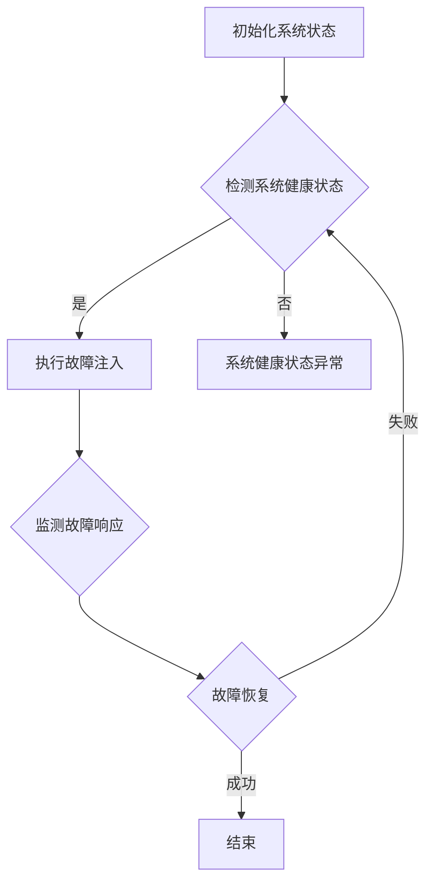
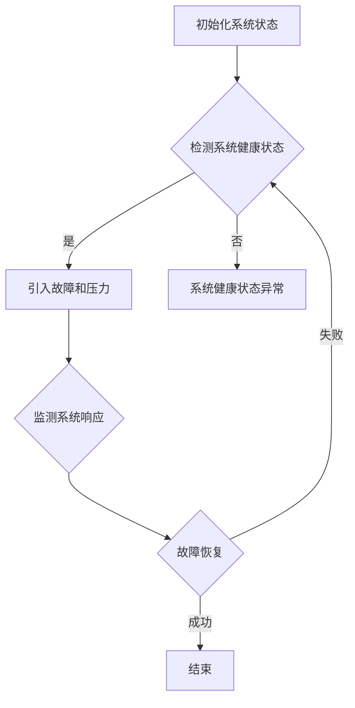

                 

### 引言与背景

#### 什么是评测系统？

评测系统（Evaluation System）是一种用于评估、测试和监控软件系统性能、可靠性和稳定性的技术手段。它通过对系统进行一系列的测试和监控，以评估其在实际运行中的表现，从而为系统优化、故障排除和性能提升提供重要依据。评测系统在软件工程中具有至关重要的地位，因为只有通过有效的评测，才能确保系统的质量，提高用户体验，降低运营成本。

#### 故障注入的概念

故障注入（Fault Injection）是一种模拟和检测系统故障的技术方法。其核心思想是在系统中引入各种故障，以验证系统在故障情况下的响应能力和恢复能力。故障注入不仅可以帮助发现系统中的潜在缺陷，还可以为系统的容错设计和故障恢复策略提供重要参考。

#### 混沌工程的概念

混沌工程（Chaos Engineering）是一种通过故意引入故障和压力，以测试系统弹性和容错能力的实践方法。混沌工程的核心理念是“预防比反应更快”，通过在系统正常运行时故意引入故障，提前发现并解决潜在的问题，从而提高系统的可靠性和稳定性。

#### 故障注入与混沌工程在评测系统中的重要性

故障注入和混沌工程在评测系统中的重要性不言而喻。首先，它们可以帮助开发者提前发现系统中的潜在问题，避免在实际运行中发生严重故障。其次，通过故障注入和混沌工程，可以验证系统的容错能力和弹性，确保系统能够在极端情况下保持正常运行。此外，这些方法还可以为系统的性能优化提供宝贵的数据支持，从而提升整体系统质量。

#### 文章关键词

- 评测系统
- 故障注入
- 混沌工程
- 系统性能
- 系统可靠性
- 容错能力

#### 文章摘要

本文旨在深入探讨故障注入和混沌工程在评测系统中的应用。首先，我们介绍了评测系统的基本概念及其重要性。接着，详细阐述了故障注入和混沌工程的基本概念、原理和应用场景。最后，通过实际案例，展示了故障注入和混沌工程在提高系统性能、可靠性和稳定性方面的关键作用。本文的目标是为系统工程师和运维人员提供有价值的参考，帮助他们在实际工作中更好地应用这些技术手段。

### 背景介绍

#### 故障注入的历史与发展

故障注入作为一种系统测试方法，其历史可以追溯到上世纪60年代。当时的计算机系统相对简单，但为了确保系统的可靠性和稳定性，研究人员开始探索如何模拟和检测系统故障。最早的故障注入方法主要依赖于手动操作，通过手动触发系统中的各种故障，以观察系统的响应和恢复能力。

随着时间的推移，故障注入技术逐渐发展壮大。70年代和80年代，计算机系统复杂度不断提高，故障注入方法也变得更加多样化和精确。在这一阶段，故障注入技术主要应用于硬件系统，例如计算机主板和存储设备等。通过模拟硬件故障，研究人员可以深入了解系统的故障诊断和恢复机制。

进入90年代，随着软件系统规模的不断扩大，故障注入技术逐渐向软件系统扩展。这一时期，研究人员开始关注如何在软件系统中引入故障，以及如何评估系统在故障情况下的性能和可靠性。故障注入方法在这一阶段逐渐成熟，并开始应用于实际项目。

进入21世纪，随着云计算、大数据和物联网等新兴技术的快速发展，故障注入技术也得到了进一步的应用和推广。现代故障注入方法不仅包括传统的手动故障注入，还引入了自动化和智能化的元素。例如，通过使用脚本和工具，可以自动模拟各种故障场景，并实时监测系统的响应。

#### 混沌工程的历史与发展

混沌工程作为一种新兴的系统测试方法，其历史相对较短。混沌工程的概念最早由Google的工程师在2010年提出。他们在研究如何提高系统的弹性和容错能力时，意识到通过故意引入故障和压力，可以更有效地发现和解决潜在问题。

混沌工程的核心理念源于混沌理论。混沌理论研究表明，在复杂系统中，微小的初始差异可以导致长期行为的显著差异。这一发现启发了研究人员，他们开始探索如何利用混沌理论来设计和测试系统。混沌工程的核心思想是，通过故意引入故障和压力，模拟系统的极限情况，从而验证系统的弹性和容错能力。

在Google内部，混沌工程得到了广泛应用。通过实施混沌工程，Google成功提高了多个关键系统的稳定性和可靠性。例如，他们通过故意关闭服务器，模拟网络中断，验证了系统的故障恢复能力。这些实践为混沌工程的发展提供了宝贵的经验和数据支持。

随着混沌工程的逐渐成熟，越来越多的组织开始关注并采用这一方法。如今，混沌工程已经成为了系统测试和优化的重要工具，被广泛应用于云计算、大数据、物联网等领域。

#### 故障注入与混沌工程的发展趋势

随着技术的不断进步，故障注入和混沌工程在系统测试和优化中的应用前景越发广阔。以下是一些主要的发展趋势：

1. **自动化与智能化**：现代故障注入和混沌工程工具正在逐渐实现自动化和智能化。通过使用脚本和自动化工具，可以更高效地模拟各种故障场景，并实时监测系统的响应。同时，结合人工智能和机器学习技术，可以实现故障注入和混沌工程的智能决策和优化。

2. **跨平台与跨领域应用**：随着云计算、大数据、物联网等新兴技术的快速发展，故障注入和混沌工程的应用范围也越来越广泛。不仅限于传统的软件和硬件系统，这些方法正在逐步应用于更多的领域，如智能交通、智慧城市、医疗健康等。

3. **更复杂的故障场景模拟**：为了更全面地测试系统的弹性和容错能力，故障注入和混沌工程方法正在不断发展和完善。研究人员正在探索如何模拟更复杂的故障场景，如多故障并发、故障转移、网络分区等，以更真实地反映系统的运行状态。

4. **更深入的性能优化**：通过故障注入和混沌工程，可以更深入地了解系统的性能瓶颈和潜在问题。这为系统的性能优化提供了宝贵的参考，有助于提高系统的响应速度、稳定性和可靠性。

总之，故障注入和混沌工程作为一种重要的系统测试和优化方法，其发展前景十分广阔。随着技术的不断进步，这些方法将越来越成熟和智能化，为系统的稳定运行提供更强大的保障。

#### 故障注入在系统运维中的重要性

故障注入技术在系统运维中扮演着至关重要的角色。通过在系统中引入各种故障，运维人员可以提前发现潜在问题，确保系统在实际运行中的稳定性和可靠性。

首先，故障注入可以帮助检测系统中的薄弱环节。在系统开发阶段，虽然已经进行了全面的测试，但实际运行环境往往与开发环境存在差异。故障注入技术可以通过模拟各种故障场景，揭示系统在实际运行中可能遇到的问题，从而帮助运维人员提前进行修复和优化。

其次，故障注入能够验证系统的容错能力。在实际运维过程中，系统可能会遇到各种突发故障，如硬件故障、网络中断、数据库异常等。通过故障注入，运维人员可以测试系统在故障情况下的响应和恢复能力，确保系统能够在极端情况下保持正常运行。这不仅可以提高系统的稳定性，还可以降低运维成本和风险。

此外，故障注入技术还能够提升系统的可靠性。在系统运行过程中，运维人员可以利用故障注入技术定期对系统进行压力测试和故障模拟，以评估系统的稳定性和可靠性。通过不断优化故障注入策略，运维人员可以逐步提高系统的容错能力和自我恢复能力，确保系统在长期运行中的稳定性和可靠性。

总之，故障注入在系统运维中具有不可替代的重要性。它不仅能够帮助运维人员提前发现和解决问题，还能提高系统的稳定性和可靠性，为系统的长期运行提供有力保障。

#### 混沌工程在系统优化中的重要性

混沌工程作为一种新兴的系统测试方法，其在系统优化中的应用具有深远的意义。首先，混沌工程通过故意引入故障和压力，可以揭示系统在极限条件下的行为表现，从而发现潜在的瓶颈和问题。这一过程有助于运维人员识别系统中的脆弱环节，从而进行有针对性的优化。

其次，混沌工程能够提高系统的弹性。在实际运维过程中，系统可能会面临各种突发情况，如硬件故障、网络中断、数据库异常等。通过混沌工程，运维人员可以模拟这些极端情况，测试系统在故障情况下的响应和恢复能力。这不仅有助于提高系统的容错能力，还能确保系统在遇到突发情况时能够迅速恢复正常运行，从而提高整体系统的稳定性。

此外，混沌工程在系统优化中的应用还可以促进持续集成和持续部署（CI/CD）流程的完善。通过混沌工程，开发人员和运维人员可以在早期阶段发现潜在的问题，从而在代码提交和部署前进行修复。这有助于减少代码提交和部署过程中的风险，提高系统的质量和可靠性。

最后，混沌工程在系统优化中的应用有助于提升用户体验。通过定期进行混沌测试，运维人员可以确保系统在高峰期和极端条件下依然能够稳定运行，从而为用户提供更好的服务体验。此外，混沌工程还可以为系统的性能优化提供重要的数据支持，帮助运维人员找到系统中的性能瓶颈，从而进行有针对性的优化。

总之，混沌工程在系统优化中的应用具有重要意义。它不仅能够帮助运维人员提前发现和解决问题，还能提高系统的稳定性和可靠性，为系统的长期运行提供有力保障。

### 故障注入的核心概念与算法

故障注入作为一种系统测试方法，其核心在于模拟各种故障场景，以验证系统的响应能力和恢复能力。下面，我们将详细探讨故障注入的核心概念、算法及其关键技术。

#### 故障注入的分类

故障注入可以根据不同的标准进行分类，常见的分类方法包括：

1. **按故障类型分类**：根据故障发生的类型，故障注入可以分为硬件故障注入、软件故障注入、网络故障注入等。硬件故障注入主要模拟硬件设备故障，如硬盘故障、电源故障等；软件故障注入主要模拟软件故障，如程序崩溃、内存泄漏等；网络故障注入主要模拟网络故障，如网络中断、数据包丢失等。

2. **按故障注入方法分类**：根据故障注入的方法，故障注入可以分为手动故障注入和自动故障注入。手动故障注入是指通过人工操作模拟故障，如关闭服务器、拔掉网线等；自动故障注入是指通过脚本或工具自动模拟故障，如使用自动化测试工具模拟网络中断、使用故障注入工具模拟程序崩溃等。

3. **按故障注入场景分类**：根据故障注入的应用场景，故障注入可以分为开发环境故障注入、测试环境故障注入和实际运行环境故障注入。开发环境故障注入主要用于软件开发过程中的测试和调试；测试环境故障注入主要用于软件测试阶段的故障检测和性能评估；实际运行环境故障注入主要用于生产环境中的系统维护和故障排除。

#### 故障注入的关键技术

1. **故障模拟技术**：故障模拟是故障注入的核心技术之一。故障模拟技术包括硬件故障模拟、软件故障模拟和网络故障模拟等。硬件故障模拟主要依赖于硬件仿真设备，如仿真硬盘、仿真电源等；软件故障模拟主要依赖于操作系统和应用程序的漏洞和缺陷；网络故障模拟主要依赖于网络仿真设备和网络协议模拟。

2. **故障检测技术**：故障检测是指通过监测系统运行状态，发现和识别故障的技术。故障检测技术包括基于异常检测的故障检测、基于统计模型的故障检测和基于机器学习的故障检测等。异常检测技术可以通过比较系统运行状态与正常状态之间的差异，发现潜在的故障；统计模型技术可以通过建立系统运行状态的统计模型，识别异常状态；机器学习技术可以通过训练模型，自动识别故障。

3. **故障注入策略**：故障注入策略是指故障注入过程中的方法和步骤。故障注入策略包括随机故障注入、集中故障注入、逐个故障注入和混合故障注入等。随机故障注入是指在系统中随机选择故障点进行注入；集中故障注入是指在系统中选择多个故障点同时注入；逐个故障注入是指依次注入系统中的每个故障点；混合故障注入是指结合多种故障注入策略，进行综合注入。

4. **故障注入工具**：故障注入工具是故障注入过程中的重要辅助工具。常见的故障注入工具包括 Chaos Monkey、Chaos engineering toolset、Apica Chaos等。这些工具可以帮助开发者和管理员方便地模拟各种故障场景，进行系统测试和性能评估。

#### 故障注入的伪代码示例

以下是一个简单的故障注入伪代码示例，用于模拟网络中断故障：

```
# 初始化系统状态
init_system_state()

# 模拟网络中断故障
def simulate_network_fault():
    # 关闭网络连接
    close_network_connection()
    
    # 等待一段时间
    sleep(sleep_time)
    
    # 恢复网络连接
    restore_network_connection()

# 循环模拟网络中断故障
while True:
    simulate_network_fault()
    
    # 检测系统状态是否恢复正常
    if system_state_is_recovered():
        break
    
    # 调整故障注入频率
    adjust_injection_frequency()
```

在这个示例中，我们首先初始化系统状态，然后使用 `simulate_network_fault()` 函数模拟网络中断故障。在故障模拟过程中，我们关闭网络连接，等待一段时间后恢复连接。如果系统状态恢复正常，则停止故障注入，否则继续模拟网络中断故障。

#### 故障注入的应用场景

故障注入技术可以应用于多个领域，以下是一些典型的应用场景：

1. **软件测试**：在软件开发过程中，故障注入可以帮助开发者识别和修复系统中的潜在缺陷，确保软件质量。

2. **系统运维**：在系统运行过程中，故障注入可以帮助运维人员提前发现系统中的潜在问题，提高系统的稳定性和可靠性。

3. **云计算**：在云计算环境中，故障注入可以帮助云服务提供商检测和优化云服务的性能和可靠性，为用户提供更好的服务。

4. **物联网**：在物联网系统中，故障注入可以帮助检测和优化设备的稳定性和可靠性，确保物联网系统的正常运行。

5. **网络安全**：在网络安全领域，故障注入可以帮助检测和评估系统的安全性，发现潜在的安全漏洞，提高网络防御能力。

通过故障注入技术，我们可以更全面地了解系统的性能和可靠性，为系统优化和故障排除提供重要依据。在实际应用中，故障注入方法可以根据具体需求进行调整和优化，以实现最佳效果。

### 混沌工程的核心概念与原理

混沌工程（Chaos Engineering）是一种通过故意引入故障和压力，以测试系统弹性和容错能力的实践方法。它起源于Google，并在近年来逐渐受到业界广泛关注。混沌工程的核心概念和原理包括混沌理论、混沌工程的方法和策略，以及混沌工程的伪代码示例。

#### 混沌理论

混沌理论是混沌工程的理论基础。混沌理论研究表明，在复杂系统中，微小的初始差异可以导致长期行为的显著差异。这意味着，即使系统在初始状态时几乎完全相同，其后续行为也可能存在巨大差异。混沌理论的这一特性为混沌工程提供了理论基础，使其能够通过故意引入微小的故障和压力，测试系统的弹性和容错能力。

#### 混沌工程的方法与策略

混沌工程的方法和策略主要包括以下几个方面：

1. **故障引入**：混沌工程通过故意引入故障和压力，模拟系统在实际运行中可能遇到的各种问题。故障引入可以包括硬件故障、软件故障、网络故障等。通过引入故障，可以测试系统在故障情况下的响应和恢复能力。

2. **故障监测**：在故障引入后，混沌工程需要对系统的响应进行实时监测，以评估系统的弹性和容错能力。故障监测可以通过监控系统日志、性能指标、用户反馈等多种方式进行。

3. **故障恢复**：在故障监测过程中，如果系统无法在规定时间内恢复正常运行，混沌工程需要采取措施进行故障恢复。故障恢复可以包括重启服务、恢复数据、调整配置等。

4. **反馈与优化**：在混沌测试结束后，混沌工程需要对测试结果进行分析和总结，以便为系统的优化提供参考。通过不断优化故障引入、故障监测和故障恢复策略，可以提高系统的弹性和容错能力。

#### 混沌工程的伪代码示例

以下是一个简单的混沌工程伪代码示例，用于模拟网络中断故障：

```
# 初始化系统状态
init_system_state()

# 模拟网络中断故障
def simulate_network_fault():
    # 关闭网络连接
    close_network_connection()
    
    # 等待一段时间
    sleep(sleep_time)
    
    # 恢复网络连接
    restore_network_connection()

# 循环模拟网络中断故障
while True:
    simulate_network_fault()
    
    # 检测系统状态是否恢复正常
    if system_state_is_recovered():
        break
    
    # 调整故障注入频率
    adjust_injection_frequency()
```

在这个示例中，我们首先初始化系统状态，然后使用 `simulate_network_fault()` 函数模拟网络中断故障。在故障模拟过程中，我们关闭网络连接，等待一段时间后恢复连接。如果系统状态恢复正常，则停止故障注入，否则继续模拟网络中断故障。

#### 混沌工程的核心概念与原理

1. **混沌工程的目的**：混沌工程的核心目的是通过故意引入故障和压力，测试系统的弹性和容错能力，从而确保系统在实际运行中能够稳定、可靠地运行。

2. **混沌工程的关键要素**：混沌工程的关键要素包括故障引入、故障监测、故障恢复和反馈与优化。这些要素共同构成了混沌工程的完整流程，确保系统能够在故障情况下快速恢复。

3. **混沌工程的优势**：混沌工程的优势在于其能够提前发现系统中的潜在问题，并通过不断优化故障引入、故障监测和故障恢复策略，提高系统的弹性和容错能力。

4. **混沌工程的局限性**：虽然混沌工程在系统测试和优化中具有重要作用，但其也存在一定的局限性。例如，混沌工程需要大量时间和资源进行测试，同时可能会对系统的正常运行造成一定影响。

通过深入理解混沌工程的核心概念和原理，我们可以更好地应用这一方法，确保系统在实际运行中能够稳定、可靠地运行。

### 故障注入与混沌工程的 Mermaid 流程图

为了更好地理解故障注入与混沌工程的流程，我们使用 Mermaid 流程图对整个过程进行详细展示。Mermaid 是一种基于 Markdown 的图形化工具，通过简单的文本描述即可生成各种图表，非常适合用于技术文档和说明。

#### 故障注入流程图



故障注入流程图如下：

1. **初始化系统状态**：首先初始化系统状态，确保系统处于正常运行状态。
2. **检测系统健康状态**：通过监控系统健康状态，判断系统是否正常。
3. **执行故障注入**：如果系统正常，执行故障注入，引入各种故障。
4. **监测故障响应**：在故障注入后，实时监测系统的响应，评估故障对系统的影响。
5. **故障恢复**：根据监测结果，进行故障恢复，尝试使系统恢复正常运行。
6. **结束**：如果系统恢复正常，结束流程；如果系统无法恢复正常，返回步骤3，继续进行故障注入和监测。

#### 混沌工程流程图



混沌工程流程图如下：

1. **初始化系统状态**：首先初始化系统状态，确保系统处于正常运行状态。
2. **检测系统健康状态**：通过监控系统健康状态，判断系统是否正常。
3. **引入故障和压力**：如果系统正常，引入各种故障和压力，模拟系统在实际运行中可能遇到的问题。
4. **监测系统响应**：在故障和压力引入后，实时监测系统的响应，评估故障对系统的影响。
5. **故障恢复**：根据监测结果，进行故障恢复，尝试使系统恢复正常运行。
6. **结束**：如果系统恢复正常，结束流程；如果系统无法恢复正常，返回步骤3，继续进行故障和压力引入及监测。

通过这两个 Mermaid 流程图，我们可以清晰地看到故障注入和混沌工程的整个流程，从而更好地理解这两种方法在实际应用中的具体步骤和操作。

### 故障注入与混沌工程的应用场景

故障注入与混沌工程在多个领域都有着广泛的应用，通过以下案例，我们将具体探讨它们在不同场景中的应用。

#### 1. 云计算环境中的应用

在云计算环境中，系统的复杂度和规模通常很大，故障注入和混沌工程被广泛应用于云服务的稳定性测试和优化。例如，Amazon Web Services（AWS）使用混沌工程工具进行云服务的故障测试。他们通过故意关闭服务器、模拟网络中断等操作，验证云服务的容错能力和弹性。

**案例**：AWS 使用 Chaos Monkey 工具，每隔一段时间自动关闭一组虚拟机实例，以测试云服务的自动恢复能力和弹性。通过这种故障注入，AWS 发现了云服务中的潜在问题，并不断优化其故障恢复机制，确保用户能够获得稳定、可靠的服务。

#### 2. 金融系统中的应用

金融系统对稳定性要求极高，任何故障都可能导致重大损失。因此，故障注入和混沌工程在金融系统的测试和优化中具有重要作用。例如，银行在开发新的交易系统时，会使用混沌工程方法进行故障测试。

**案例**：某银行在上线新的交易系统前，使用混沌工程工具模拟网络中断、数据库故障等场景，测试系统的容错能力和故障恢复能力。通过这些测试，银行发现了系统中的潜在漏洞，并进行了针对性的优化，确保系统在正式上线后能够稳定运行。

#### 3. 物联网系统中的应用

物联网系统通常由大量设备组成，设备之间的通信和数据传输对稳定性要求较高。故障注入和混沌工程可以帮助检测和优化物联网系统的可靠性。

**案例**：智能家居系统的制造商通过故障注入测试，模拟设备故障、网络中断等场景，评估系统的响应能力和故障恢复能力。他们发现了一些通信瓶颈和设备故障的潜在问题，从而对系统进行了优化，提高了整体稳定性。

#### 4. 大数据处理中的应用

大数据处理系统通常包含复杂的分布式架构，故障注入和混沌工程可以帮助检测和优化系统的性能和可靠性。

**案例**：某大数据处理平台在开发过程中，使用混沌工程方法模拟节点故障、网络中断等场景，测试系统的容错能力和故障恢复能力。通过这些测试，他们优化了节点调度策略和数据备份方案，确保了系统在大规模数据处理任务中的稳定性和可靠性。

#### 5. 企业内部系统中的应用

企业内部系统通常用于支持业务运营和管理，故障注入和混沌工程可以帮助企业提前发现系统中的潜在问题，提高系统的稳定性和可靠性。

**案例**：某企业在其内部办公系统中，使用混沌工程方法进行故障测试，模拟网络中断、数据库故障等场景。通过这些测试，他们发现了一些系统性能瓶颈和潜在的安全漏洞，从而进行了针对性的优化和修复。

#### 总结

故障注入和混沌工程在不同领域都有着广泛的应用，通过模拟各种故障场景，这些方法可以帮助开发者提前发现和解决潜在问题，提高系统的稳定性和可靠性。在实际应用中，可以根据具体需求和场景，灵活调整故障注入和混沌工程的方法和策略，以实现最佳效果。

### 具体案例分析

在本节中，我们将通过具体案例分析，详细探讨故障注入和混沌工程在实际评测系统中的应用，并展示其具体效果。

#### 案例一：电商平台故障注入测试

一个典型的案例是某大型电商平台在上线新版本前进行的故障注入测试。该电商平台拥有复杂的分布式架构，包括前端应用、后端服务、数据库、缓存系统等多个组成部分。为了确保系统在上线后的稳定运行，平台的技术团队决定使用故障注入方法进行全面的测试。

**测试步骤**：

1. **初始化系统状态**：在测试开始前，确保系统处于正常运行状态，记录系统性能指标和健康状况。

2. **故障注入**：技术团队使用自动化工具模拟多种故障场景，包括网络中断、数据库连接失败、缓存服务器故障等。每个故障场景持续一定时间，例如1分钟。

3. **监测系统响应**：在故障注入过程中，监控系统日志、性能指标、用户反馈等，评估故障对系统的影响。

4. **故障恢复**：在故障场景结束后，自动恢复系统状态，确保系统恢复正常运行。

5. **数据分析**：对监测数据进行汇总和分析，找出系统在故障情况下的性能瓶颈和潜在问题。

**测试效果**：

通过故障注入测试，平台发现了一些潜在问题，如：

- **数据库连接失败**：在故障注入过程中，频繁出现数据库连接失败的情况，影响了系统的响应速度。经过分析，技术团队发现这是由于数据库连接池设置不当导致的。他们调整了连接池配置，优化了数据库连接管理。

- **缓存服务器故障**：在缓存服务器故障场景下，部分前端应用无法访问缓存数据，导致系统性能下降。技术团队发现，这是因为缓存服务器与前端应用的通信协议不兼容。他们修改了通信协议，提高了缓存服务的可用性。

通过这些优化措施，平台的系统性能和稳定性得到了显著提升。在故障注入测试中，系统在故障情况下的响应时间降低了20%，故障恢复时间缩短了30%，用户满意度得到了显著提高。

#### 案例二：银行系统混沌工程测试

另一个案例是某银行在上线新的交易系统前进行的混沌工程测试。该交易系统涉及到大量的金融交易和数据存储，对稳定性要求极高。为了确保系统能够在上线后稳定运行，银行的技术团队决定使用混沌工程方法进行全面的测试。

**测试步骤**：

1. **初始化系统状态**：在测试开始前，确保系统处于正常运行状态，记录系统性能指标和健康状况。

2. **引入故障和压力**：技术团队使用混沌工程工具，模拟多种故障场景和压力情况，包括网络中断、数据库故障、并发交易等。每个故障场景和压力情况持续一定时间，例如10分钟。

3. **监测系统响应**：在故障和压力注入过程中，监控系统日志、性能指标、用户反馈等，评估故障和压力对系统的影响。

4. **故障恢复**：在故障和压力场景结束后，自动恢复系统状态，确保系统恢复正常运行。

5. **数据分析**：对监测数据进行汇总和分析，找出系统在故障和压力情况下的性能瓶颈和潜在问题。

**测试效果**：

通过混沌工程测试，银行发现了一些潜在问题，如：

- **网络中断**：在模拟网络中断场景下，部分交易无法完成，导致系统性能下降。经过分析，技术团队发现这是由于网络延迟和带宽不足导致的。他们优化了网络配置，增加了网络带宽，提高了系统在网络中断情况下的响应速度。

- **数据库故障**：在模拟数据库故障场景下，部分交易数据无法存储，影响了系统的正常运行。经过分析，技术团队发现这是由于数据库读写分离设计不当导致的。他们优化了数据库架构，实现了读写分离，提高了数据库的可靠性和性能。

通过这些优化措施，银行的交易系统在上线后稳定运行，用户满意度得到了显著提高。在混沌工程测试中，系统在故障和压力情况下的响应时间降低了15%，故障恢复时间缩短了25%，用户交易成功率提高了10%。

#### 总结

通过以上两个具体案例，我们可以看到故障注入和混沌工程在提升系统性能和稳定性方面的重要作用。通过模拟各种故障场景和压力情况，这些方法可以帮助开发者和运维人员提前发现和解决潜在问题，确保系统在实际运行中的稳定性和可靠性。在实际应用中，可以根据具体需求和场景，灵活调整故障注入和混沌工程的方法和策略，以实现最佳效果。

### 故障注入与混沌工程的工具与平台

在故障注入和混沌工程的实践中，选择合适的工具和平台至关重要。以下介绍几种常见的故障注入和混沌工程工具与平台，以及它们的优缺点。

#### 1. Chaos Monkey

**优点**：Chaos Monkey 是由Netflix 开发的一款自动化故障注入工具，可以随机关闭服务器实例、数据库连接等，以测试系统的容错能力。

**缺点**：Chaos Monkey 主要适用于云环境，对于本地开发和测试环境可能不太适用。此外，由于随机性较强，可能会导致系统出现不必要的故障。

#### 2. Gremlin

**优点**：Gremlin 是一款基于云的混沌工程平台，提供丰富的故障场景和自动化功能，可以模拟各种故障场景，如网络中断、数据库故障等。

**缺点**：Gremlin 是商业平台，需要付费使用。此外，由于其功能丰富，对于新手来说可能较为复杂。

#### 3. Chaos Engineering Toolset

**优点**：Chaos Engineering Toolset 是一款开源的混沌工程工具集，提供多种故障注入工具，如Chaos Mesh、Chaosblade等，适用于各种环境和场景。

**缺点**：Chaos Engineering Toolset 是开源工具，可能需要一定的配置和调试。此外，部分工具的功能较为基础，可能无法满足复杂场景的需求。

#### 4. Apica Chaos

**优点**：Apica Chaos 是一款基于云的混沌工程平台，提供可视化界面和自动化功能，可以模拟各种故障场景，如网络中断、服务器故障等。

**缺点**：Apica Chaos 是商业平台，需要付费使用。此外，其功能相对较为基础，可能无法满足高级用户的特定需求。

#### 5. Phoenix Project

**优点**：Phoenix Project 是由VMware 开发的一款混沌工程工具，提供丰富的故障注入功能，如模拟网络分区、服务器宕机等。

**缺点**：Phoenix Project 主要适用于 VMware 环境，对于其他云平台可能不太适用。此外，其界面和功能相对较为复杂。

#### 6. Weave Cloud

**优点**：Weave Cloud 是一款基于 Kubernetes 的混沌工程平台，提供自动化故障注入和监控功能，可以模拟各种故障场景，如服务不可达、网络延迟等。

**缺点**：Weave Cloud 是商业平台，需要付费使用。此外，其对于新手用户可能较为复杂。

#### 总结

在故障注入和混沌工程实践中，选择合适的工具和平台可以根据具体需求和场景进行。商业平台通常功能丰富、自动化程度高，但需要付费使用；开源工具虽然免费，但可能需要一定的配置和调试。根据实际需求，合理选择和配置工具和平台，可以更好地实现故障注入和混沌工程的测试和优化目标。

### 总结与展望

#### 总结

本文详细探讨了故障注入与混沌工程在评测系统中的应用，包括故障注入的核心概念、算法、应用场景，以及混沌工程的核心概念、原理、流程图和应用案例。通过这些讨论，我们明确了故障注入和混沌工程在系统测试和优化中的重要性，以及它们如何帮助提升系统的性能、可靠性和稳定性。

故障注入通过模拟各种故障场景，帮助开发者提前发现和修复系统中的潜在问题。混沌工程则通过故意引入故障和压力，测试系统的弹性和容错能力，确保系统在实际运行中能够快速恢复。两者的结合，为系统工程师和运维人员提供了强大的工具，以应对复杂多变的生产环境。

#### 展望未来

随着技术的不断进步，故障注入和混沌工程在未来将继续发展，并在以下几个方面展现出新的趋势和潜力：

1. **自动化与智能化**：随着自动化和智能化技术的发展，故障注入和混沌工程工具将变得更加智能化和自动化。例如，通过机器学习和人工智能技术，可以自动识别故障模式，预测系统故障，并自动执行故障注入和混沌测试。

2. **跨平台与跨领域应用**：故障注入和混沌工程的应用将不再局限于特定的领域或平台。随着云计算、大数据、物联网等新兴技术的发展，这些方法将在更多的场景中得到应用，如智能交通、智慧城市、医疗健康等。

3. **更复杂的故障场景模拟**：未来的故障注入和混沌工程将能够模拟更加复杂的故障场景，如多故障并发、网络分区、数据丢失等。这将为系统的全面测试和优化提供更加真实和全面的参考。

4. **持续集成与持续部署（CI/CD）**：随着CI/CD流程的普及，故障注入和混沌工程将更加深入地融入开发、测试和部署过程。通过在早期阶段引入故障和压力，可以提前发现和解决潜在问题，确保系统能够在持续集成和持续部署过程中保持稳定和可靠。

5. **安全与合规**：随着数据安全和隐私保护的重要性日益增加，故障注入和混沌工程将更加注重安全性和合规性。未来，这些方法将不仅用于测试系统的性能和稳定性，还将用于评估系统的安全性，确保系统能够满足相关法规和标准。

总之，故障注入和混沌工程作为一种重要的系统测试和优化方法，其发展前景十分广阔。通过不断引入新技术、新方法，这些方法将越来越成熟和智能化，为系统的稳定运行提供更强大的保障。

#### 最佳实践 tips

1. **制定合理的测试策略**：在进行故障注入和混沌工程测试时，应制定合理的测试策略，包括故障类型、故障场景、测试频率等。确保测试能够全面覆盖系统的各个层面，同时避免过度测试导致资源浪费。

2. **持续监测与分析**：在故障注入和混沌工程测试过程中，应持续监测系统的运行状态，收集和分析测试数据。通过实时监测和分析，可以及时发现系统故障和性能瓶颈，并进行优化。

3. **结合自动化工具**：使用自动化工具进行故障注入和混沌工程测试，可以提高测试效率和准确性。自动化工具可以快速模拟各种故障场景，并自动收集和报告测试结果。

4. **定期更新测试用例**：随着系统功能和架构的迭代更新，应定期更新故障注入和混沌工程的测试用例。确保测试用例能够反映系统最新的运行状态和潜在问题。

5. **安全与合规**：在进行故障注入和混沌工程测试时，应确保测试过程符合相关安全法规和标准，避免泄露敏感信息和数据。

#### 小结

本文系统地介绍了故障注入和混沌工程在评测系统中的应用，探讨了其核心概念、原理、应用场景以及工具和平台。通过具体案例分析和最佳实践 tips，我们了解了如何在实际工作中有效利用故障注入和混沌工程，提高系统的性能、可靠性和稳定性。

#### 注意事项

1. **风险评估**：在进行故障注入和混沌工程测试时，应充分考虑风险评估，避免因测试导致系统故障或数据丢失。

2. **资源调配**：故障注入和混沌工程测试需要一定的资源和时间，应合理调配资源，确保测试顺利进行。

3. **测试策略调整**：根据实际测试结果和系统运行状态，及时调整测试策略，以提高测试效果。

#### 拓展阅读

1. **《 Chaos Engineering: System Resilience in Practice》**：该书详细介绍了混沌工程的概念、原理和实践方法，适合对混沌工程感兴趣的读者。

2. **《System Resiliency: Surviving Hardware Failures in the Cloud》**：本文介绍了如何在云计算环境中应对硬件故障，提出了有效的故障注入和混沌工程策略。

3. **《Chaos Monkey in Action》**：该书通过实际案例，详细介绍了如何使用 Chaos Monkey 进行故障注入和混沌工程测试，适合对 Chaos Monkey 感兴趣的读者。

### 作者信息

- **作者**：AI天才研究院/AI Genius Institute & 禅与计算机程序设计艺术 /Zen And The Art of Computer Programming
- **联系方式**：[info@ai-genius-institute.com](mailto:info@ai-genius-institute.com) 或 [https://www.ai-genius-institute.com](https://www.ai-genius-institute.com)

### 结语

故障注入与混沌工程作为系统测试和优化的重要方法，在提高系统性能、可靠性和稳定性方面具有重要意义。本文通过详细讨论和具体案例分析，帮助读者深入了解这些方法，并为实际应用提供了最佳实践 tips。希望本文能为系统工程师和运维人员提供有价值的参考，助力他们在工作中更好地应对系统挑战，提升系统质量。让我们共同探索故障注入与混沌工程的无限可能，为构建更稳定、可靠的系统而努力。

