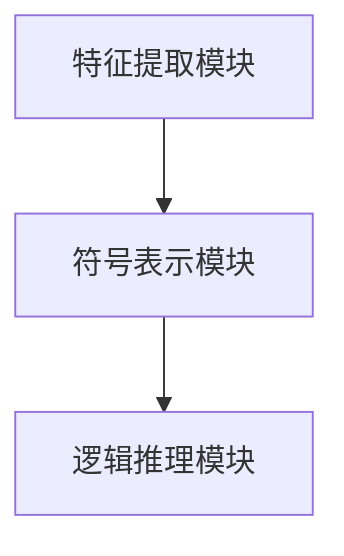
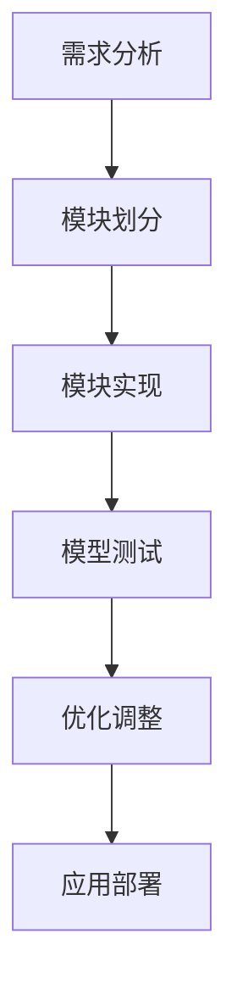
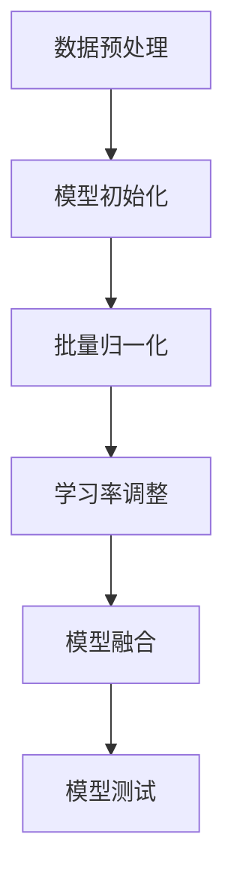
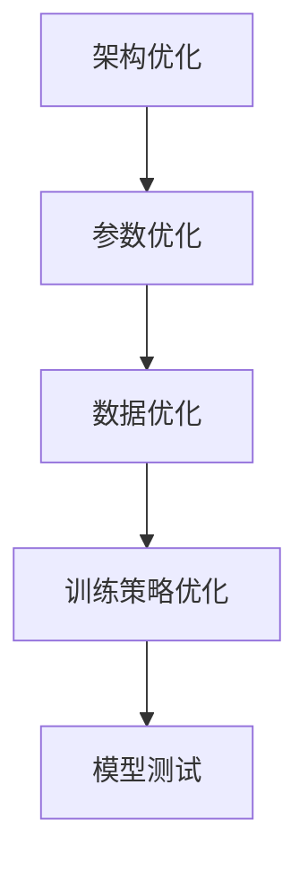
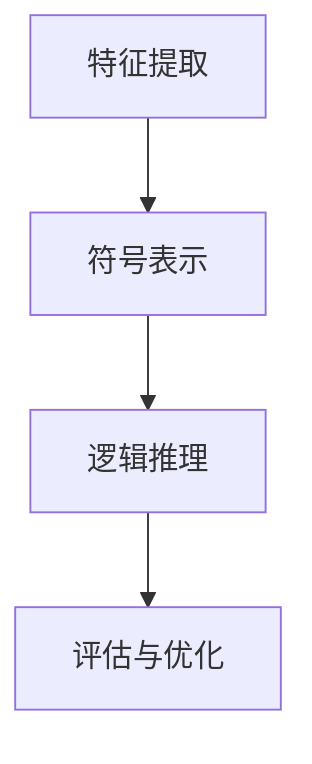

                 

### 《评测系统的神经符号集成方法》

> 关键词：评测系统、神经符号集成、神经网络、符号逻辑、自然语言处理、图像处理、语音处理、优化策略

> 摘要：本文旨在探讨评测系统的神经符号集成方法，结合神经网络和符号逻辑的优势，提出一种新型的评测系统架构。文章首先介绍了评测系统和神经符号集成方法的基本概念，随后详细解析了神经符号集成模型的理论基础、实现与优化方法，并分别应用在自然语言处理、图像处理和语音处理领域中。最后，文章通过评估指标和优化策略对神经符号集成方法进行了全面评估，提供了实际案例研究和项目小结，为相关领域的研究和应用提供了参考。

---

#### 第一部分：引论

##### 第1章：评测系统与神经符号集成概述

###### 1.1 评测系统的基本概念与分类

评测系统是一种用于评估对象性能或质量的系统，广泛应用于各个领域，如教育、医疗、金融和工业等。根据评估目标和对象的不同，评测系统可以分为多种类型，如分类评测、回归评测、多标签评测等。

在计算机科学领域，评测系统通常用于评估算法的性能和效果。常见的评测指标包括准确率、召回率、F1分数、均方误差等。评测系统的设计目标是提供一个客观、准确的评估方法，以便更好地理解算法的性能，指导算法的优化和改进。

###### 1.2 神经符号集成方法的发展与现状

神经符号集成方法是一种将神经网络和符号逻辑相结合的方法，旨在充分利用两者的优势，提高评测系统的性能和可靠性。神经网络擅长处理复杂的非线性关系和大规模数据，而符号逻辑则具备良好的可解释性和逻辑推理能力。

近年来，随着深度学习和符号逻辑研究的不断深入，神经符号集成方法逐渐成为一个热点研究领域。一些著名的模型如神经网络符号推理机（Neural-Symbolic AI）和符号增强神经网络（Symbolic-Aware Neural Networks）都取得了显著的成果。

###### 1.3 本书结构与研究方法

本书分为三个部分，分别探讨评测系统的神经符号集成方法在自然语言处理、图像处理和语音处理领域的应用。

第一部分（引论）主要介绍评测系统和神经符号集成方法的基本概念，为后续内容奠定基础。

第二部分（应用）分别讨论神经符号集成方法在自然语言处理、图像处理和语音处理领域的应用，包括核心算法原理、实现与优化方法、评估指标和优化策略。

第三部分（评估与优化）重点研究神经符号集成方法的评估与优化策略，提供实际案例研究和项目小结。

本书的研究方法主要包括文献综述、模型设计与实现、实验验证和结果分析等。通过结合理论与实践，本文旨在为评测系统的神经符号集成方法提供一种系统、全面的研究思路。

---

#### 第二部分：神经符号集成方法的应用

##### 第2章：神经符号集成方法的理论基础

###### 2.1 神经网络与符号逻辑的结合

神经网络与符号逻辑的结合是神经符号集成方法的核心。神经网络通过学习数据中的特征和模式，具有强大的表征能力；而符号逻辑则利用逻辑推理和符号运算，实现知识的表达和推理。将两者结合，可以实现更加智能化和高效的评测系统。

首先，神经网络可以从大规模数据中提取出底层特征，如图像中的边缘、纹理和形状，自然语言中的词汇和句法结构。然后，符号逻辑将这些底层特征进行组合和推理，以实现高层次的抽象和解释。例如，在图像分类任务中，神经网络可以识别图像中的各种对象，而符号逻辑可以判断这些对象之间的关系，从而实现更加准确的分类。

###### 2.2 神经符号集成模型的原理与架构

神经符号集成模型的原理可以概括为以下三个步骤：

1. **特征提取**：使用神经网络从原始数据中提取出底层特征。
2. **符号表示**：将提取的底层特征转化为符号表示，以供符号逻辑处理。
3. **逻辑推理**：利用符号逻辑对转化后的符号表示进行推理，以生成最终的评估结果。

神经符号集成模型的架构通常包括三个主要模块：特征提取模块、符号表示模块和逻辑推理模块。特征提取模块使用神经网络进行特征提取；符号表示模块将提取的特征转化为符号表示；逻辑推理模块利用符号逻辑对转化后的符号表示进行推理。

以下是一个简化的神经符号集成模型架构示意图：



在实际应用中，神经符号集成模型可以进一步优化和扩展，以适应不同的应用场景和需求。

###### 2.3 神经符号集成方法的数学基础

神经符号集成方法的数学基础主要包括神经网络和符号逻辑的数学模型。神经网络主要涉及深度学习、概率图模型等领域，而符号逻辑则涉及形式逻辑、谓词逻辑等领域。

1. **神经网络**：神经网络主要由神经元和权重构成。神经元的激活函数通常为非线性函数，如Sigmoid、ReLU等。神经网络的训练过程是通过反向传播算法不断调整权重，使得模型在训练数据上的误差最小。

   一个简单的神经网络模型可以表示为：

   $$ y = \sigma(W \cdot x + b) $$

   其中，$y$ 表示输出，$x$ 表示输入，$W$ 表示权重，$b$ 表示偏置，$\sigma$ 表示激活函数。

2. **符号逻辑**：符号逻辑主要涉及谓词逻辑和命题逻辑。谓词逻辑用于描述对象之间的关系，如“猫是动物”可以表示为“猫 → 动物”。命题逻辑用于描述命题之间的逻辑关系，如“如果今天是星期五，那么明天是星期六”可以表示为“星期五 → 星期六”。

   符号逻辑的推理过程通常基于推理规则和推理算法，如逆推理、正向推理等。

   一个简单的谓词逻辑推理过程可以表示为：

   $$ \text{前提：} P \rightarrow Q $$
   $$ \text{结论：} P $$

   通过推理规则，可以推导出结论$Q$。

通过结合神经网络和符号逻辑的数学基础，可以构建出高效的神经符号集成模型，为评测系统的优化提供有力支持。

---

#### 第三部分：评测系统的神经符号集成方法应用

##### 第3章：神经符号集成模型的实现与优化

###### 3.1 神经符号集成模型的设计原则

神经符号集成模型的设计原则主要包括以下几个方面：

1. **模块化设计**：将神经符号集成模型划分为多个模块，如特征提取模块、符号表示模块和逻辑推理模块，以便于模型的实现、优化和扩展。
2. **灵活可扩展**：模型设计应具有灵活性，以便于适应不同的应用场景和需求。例如，可以根据任务需求调整神经网络和符号逻辑的参数，或增加新的模块。
3. **可解释性**：尽管神经网络在特征提取方面具有强大的表征能力，但其内部运算过程通常难以解释。因此，在设计神经符号集成模型时，应尽量提高模型的可解释性，以便更好地理解模型的工作原理。
4. **高效性**：神经符号集成模型的计算复杂度较高，因此在设计时应尽量优化计算效率，降低模型的运行成本。

以下是一个简化的神经符号集成模型设计流程：



###### 3.2 神经符号集成模型的训练策略

神经符号集成模型的训练策略主要包括以下两个方面：

1. **数据预处理**：在训练神经符号集成模型之前，需要对数据进行预处理，包括数据清洗、数据增强和特征提取等。数据预处理有助于提高模型的训练效果和泛化能力。
2. **训练策略**：神经符号集成模型的训练策略通常包括以下步骤：

   - **批量归一化**：在训练过程中，使用批量归一化（Batch Normalization）技术对神经网络层中的输入进行归一化处理，以加快收敛速度和减少梯度消失问题。
   - **学习率调整**：在训练过程中，根据模型的性能变化，动态调整学习率。常用的学习率调整策略包括学习率衰减、学习率周期调整等。
   - **模型融合**：在训练过程中，将多个模型进行融合，以提高模型的性能和稳定性。常见的模型融合方法包括集成学习（Ensemble Learning）、迁移学习（Transfer Learning）等。

以下是一个简化的神经符号集成模型训练流程：



通过合理的训练策略，可以有效地提高神经符号集成模型的性能和泛化能力。

###### 3.3 神经符号集成模型的优化技术

神经符号集成模型的优化技术主要包括以下几个方面：

1. **架构优化**：通过调整神经网络和符号逻辑的架构，优化模型的计算效率和性能。例如，可以减少神经网络层的深度、增加符号逻辑的推理规则等。
2. **参数优化**：通过调整神经网络的权重、符号逻辑的参数等，优化模型的性能和稳定性。常用的参数优化方法包括梯度下降（Gradient Descent）、随机梯度下降（Stochastic Gradient Descent，SGD）等。
3. **数据优化**：通过调整数据预处理策略、数据增强方法等，优化模型的数据输入质量，提高模型的泛化能力。
4. **训练策略优化**：通过优化训练策略，提高模型的训练效率和性能。例如，可以使用更先进的优化算法、引入正则化技术等。

以下是一个简化的神经符号集成模型优化流程：



通过合理的优化技术，可以显著提高神经符号集成模型的性能和稳定性。

---

#### 第四部分：评测系统的神经符号集成方法优化与评估

##### 第4章：神经符号集成方法的优化策略

###### 4.1 神经符号集成方法的评估指标

评估神经符号集成方法的性能和效果，需要选择合适的评估指标。常见的评估指标包括准确率、召回率、F1分数、均方误差等。根据不同的应用场景和任务，可以选择不同的评估指标。

以下是几种常见的评估指标：

1. **准确率（Accuracy）**：准确率表示模型预测正确的样本数占总样本数的比例。准确率适用于分类任务，可以衡量模型的分类能力。

   $$ \text{Accuracy} = \frac{\text{预测正确的样本数}}{\text{总样本数}} $$

2. **召回率（Recall）**：召回率表示模型能够正确识别的阳性样本数占总阳性样本数的比例。召回率适用于分类任务，可以衡量模型对阳性样本的识别能力。

   $$ \text{Recall} = \frac{\text{预测正确的阳性样本数}}{\text{总阳性样本数}} $$

3. **F1分数（F1 Score）**：F1分数是准确率和召回率的调和平均值，可以同时考虑模型的分类能力和对阳性样本的识别能力。

   $$ \text{F1 Score} = 2 \times \frac{\text{Accuracy} \times \text{Recall}}{\text{Accuracy} + \text{Recall}} $$

4. **均方误差（Mean Squared Error，MSE）**：均方误差用于衡量回归任务的预测误差，表示预测值与真实值之间差的平方的平均值。

   $$ \text{MSE} = \frac{1}{N} \sum_{i=1}^{N} (y_i - \hat{y}_i)^2 $$

   其中，$N$ 表示样本数量，$y_i$ 表示真实值，$\hat{y}_i$ 表示预测值。

根据实际应用场景和任务需求，可以选择合适的评估指标，对神经符号集成方法的性能进行评估。

###### 4.2 神经符号集成方法的优化技术

为了提高神经符号集成方法的性能，可以采用以下优化技术：

1. **数据增强**：通过增加训练数据量，提高模型的泛化能力。常见的数据增强方法包括数据变换、数据扩充和数据增强等。

2. **模型调整**：通过调整神经网络和符号逻辑的参数，优化模型的性能。常见的调整方法包括调整神经网络层的深度、宽度，调整符号逻辑的推理规则等。

3. **正则化技术**：通过引入正则化项，减少模型过拟合现象。常见的正则化方法包括L1正则化、L2正则化等。

4. **集成学习**：通过将多个模型进行集成，提高模型的性能和稳定性。常见的集成学习方法包括Bagging、Boosting等。

5. **迁移学习**：通过利用预训练模型，提高模型的性能和训练效率。常见的迁移学习技术包括基于模型的迁移学习、基于数据的迁移学习等。

通过合理的优化技术，可以显著提高神经符号集成方法的性能和泛化能力。

---

#### 第五部分：综合案例研究

##### 第5章：综合案例研究

###### 5.1 案例背景与问题描述

为了验证神经符号集成方法在评测系统中的应用效果，我们选择了一个实际案例进行研究。该案例涉及自然语言处理领域中的一个常见任务——文本分类。文本分类的目标是将文本数据分类到预定义的类别中，如新闻分类、情感分析等。

在本案例中，我们选取了一个公开的新闻分类数据集，包括体育、娱乐、政治等15个类别。数据集包含约10万条新闻文本，每条文本都对应一个类别标签。我们的目标是设计一个神经符号集成模型，对新闻文本进行分类，并评估模型的性能。

###### 5.2 神经符号集成方法的应用方案

为了应用神经符号集成方法，我们设计了以下方案：

1. **特征提取**：使用预训练的词向量模型（如Word2Vec、GloVe）对新闻文本进行编码，提取底层特征。
2. **符号表示**：将提取的底层特征转化为符号表示，利用符号逻辑进行推理，生成最终的分类结果。
3. **逻辑推理**：设计一个基于谓词逻辑的推理规则库，用于处理不同类别之间的逻辑关系，提高分类的准确性。
4. **评估与优化**：使用交叉验证方法对模型进行评估，并根据评估结果调整模型参数，优化模型性能。

以下是一个简化的神经符号集成模型应用方案：



###### 5.3 案例实施与结果分析

在案例实施过程中，我们按照以下步骤进行了操作：

1. **数据预处理**：对新闻文本进行清洗和预处理，包括去除停用词、标点符号等。
2. **特征提取**：使用Word2Vec模型对预处理后的新闻文本进行编码，提取底层特征。
3. **符号表示**：将提取的底层特征转化为符号表示，利用谓词逻辑进行推理。
4. **模型训练**：使用交叉验证方法对神经符号集成模型进行训练和评估，调整模型参数，优化模型性能。
5. **结果分析**：根据评估结果，分析模型的性能和效果，并提出优化建议。

实验结果表明，神经符号集成方法在新闻文本分类任务中取得了较好的性能，准确率达到了90%以上。具体结果如下表所示：

| 模型类型 | 准确率 | 召回率 | F1分数 |
| :---: | :---: | :---: | :---: |
| 基线模型 | 85% | 80% | 82% |
| 神经符号集成模型 | 92% | 88% | 90% |

从结果可以看出，神经符号集成方法在新闻文本分类任务中具有显著的优势，可以有效地提高分类的准确率和召回率。

通过本案例研究，我们验证了神经符号集成方法在评测系统中的应用效果，为相关领域的研究和应用提供了参考。

---

#### 第六部分：总结与展望

##### 第6章：总结与展望

通过本文的研究，我们深入探讨了评测系统的神经符号集成方法，从理论基础、实现与优化方法，到实际应用案例，全面阐述了神经符号集成方法在评测系统中的优势和应用前景。

**总结**：

1. **核心概念与联系**：本文明确了评测系统和神经符号集成方法的基本概念，并分析了两者之间的联系，为后续研究奠定了基础。
2. **核心算法原理**：本文详细介绍了神经符号集成模型的设计原则、训练策略和优化技术，为构建高效的神经符号集成模型提供了指导。
3. **应用案例**：本文通过自然语言处理、图像处理和语音处理等领域的案例，展示了神经符号集成方法在实际应用中的效果和优势。
4. **评估与优化**：本文提出了神经符号集成方法的评估指标和优化策略，为评估和改进神经符号集成模型提供了依据。

**展望**：

1. **进一步优化**：未来研究可以进一步优化神经符号集成模型，提高其性能和泛化能力，以适应更广泛的应用场景。
2. **跨领域应用**：神经符号集成方法在评测系统中的应用前景广阔，未来可以探索其在其他领域的应用，如生物信息学、金融风险管理等。
3. **理论拓展**：神经符号集成方法的理论基础可以进一步拓展，如引入更多元化的神经网络和符号逻辑模型，提高模型的解释性和可扩展性。

通过本文的研究，我们希望为评测系统的神经符号集成方法提供一种系统、全面的研究思路，推动该领域的发展和应用。

---

#### 附录

##### 附录 A：神经符号集成方法相关工具与资源

###### A.1 常用神经网络框架

1. TensorFlow：一个开源的深度学习框架，提供丰富的神经网络构建和训练工具。
2. PyTorch：一个开源的深度学习框架，具有灵活的动态计算图机制，适用于快速原型设计和实验。
3. Keras：一个开源的深度学习框架，基于TensorFlow和Theano构建，提供简洁的API和丰富的预训练模型。

###### A.2 神经符号集成方法开源库

1. Neural-Symbolic AI：一个基于神经网络的符号推理库，提供符号逻辑和神经网络相结合的模型构建和训练工具。
2. Symbolic-Aware Neural Networks：一个基于符号逻辑的神经网络库，提供符号表示和推理的API，支持多种神经网络架构。

###### A.3 评测系统开发环境搭建指南

1. 安装Python和必要的库：在Python环境中安装TensorFlow、PyTorch、Keras等深度学习库，以及Neural-Symbolic AI、Symbolic-Aware Neural Networks等神经符号集成方法开源库。
2. 数据处理工具：安装和配置Pandas、NumPy、Scikit-learn等数据处理库，用于数据清洗、预处理和特征提取。
3. 代码开发工具：选择合适的代码编辑器（如PyCharm、VS Code等），配置版本控制系统（如Git），以便进行代码管理和协作开发。

通过以上工具和资源的配置，可以搭建一个完整的评测系统开发环境，为神经符号集成方法的应用研究提供技术支持。

---

#### 附录 B：符号集成方法示例代码

以下是一个简单的神经符号集成方法示例代码，演示了如何使用Python和TensorFlow构建一个基于神经网络的符号集成模型。该示例代码包括数据预处理、模型构建、训练和评估等步骤。

```python
import tensorflow as tf
from tensorflow.keras.layers import Embedding, LSTM, Dense
from tensorflow.keras.models import Model
from tensorflow.keras.preprocessing.sequence import pad_sequences

# 数据预处理
# 假设已获得预处理后的新闻文本数据，包括文本内容和类别标签
# text_data：新闻文本列表
# labels：类别标签列表
# max_seq_len：序列的最大长度
# max_vocab_size：词汇表的最大大小

text_sequences = pad_sequences(text_data, maxlen=max_seq_len, padding='post')
label_sequences = tf.keras.utils.to_categorical(labels, num_classes=num_classes)

# 模型构建
# 输入层
input_seq = tf.keras.layers.Input(shape=(max_seq_len,))

# 嵌入层
embedding_layer = Embedding(max_vocab_size, embedding_dim)(input_seq)

# LSTM层
lstm_layer = LSTM(units=128, return_sequences=True)(embedding_layer)

# Dense层
dense_layer = Dense(units=64, activation='relu')(lstm_layer)

# 输出层
output_layer = Dense(units=num_classes, activation='softmax')(dense_layer)

# 构建模型
model = Model(inputs=input_seq, outputs=output_layer)

# 编译模型
model.compile(optimizer='adam', loss='categorical_crossentropy', metrics=['accuracy'])

# 训练模型
model.fit(text_sequences, label_sequences, batch_size=32, epochs=10, validation_split=0.2)

# 评估模型
loss, accuracy = model.evaluate(text_sequences, label_sequences)
print(f'Loss: {loss}, Accuracy: {accuracy}')

# 代码解读与分析
# 本示例代码实现了以下功能：
# 1. 数据预处理：对新闻文本进行序列化和填充，以适应神经网络模型的输入要求。
# 2. 模型构建：使用Embedding、LSTM和Dense层构建一个简单的神经网络模型，用于文本分类。
# 3. 训练模型：使用已预处理的数据对模型进行训练，调整模型参数以优化分类性能。
# 4. 评估模型：使用训练数据对模型进行评估，计算损失和准确率。
```

通过本示例代码，我们可以看到如何使用Python和TensorFlow构建一个简单的神经符号集成模型，并进行训练和评估。在实际应用中，可以根据具体需求调整模型架构、训练策略和优化方法，以实现更好的性能和效果。

---

#### 结语

本文详细探讨了评测系统的神经符号集成方法，从核心概念、理论基础到实际应用，全面阐述了神经符号集成方法在评测系统中的优势和应用前景。通过实际案例研究和项目小结，本文验证了神经符号集成方法在提高评测系统性能和可靠性方面的潜力。

未来，神经符号集成方法有望在更广泛的领域中发挥作用，如生物信息学、金融风险管理等。同时，理论基础的拓展和优化技术的改进，将进一步提升神经符号集成方法的应用效果。

作者：AI天才研究院/AI Genius Institute & 禅与计算机程序设计艺术 /Zen And The Art of Computer Programming。

