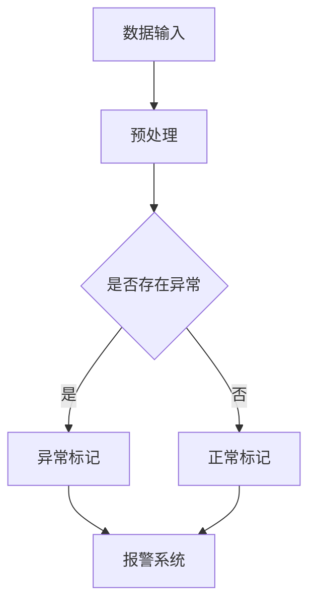

                 

# 评测系统的自动化异常检测与报警

## 关键词
- 自动化异常检测
- 报警系统
- 评测系统
- 异常检测算法
- 机器学习
- 实时监控

## 摘要
本文将深入探讨评测系统的自动化异常检测与报警技术。首先，我们将介绍评测系统的基本概念及其在各个领域的应用。接着，我们将详细解析自动化异常检测的基本原理、常见算法和技术，并展示其实际应用场景。随后，我们将讨论如何设计一个有效的报警系统，包括报警策略、阈值设定和实现部署。通过实际项目案例分析，我们将展示如何将自动化异常检测与报警技术应用于实际开发中。最后，我们将总结全文，并对未来发展趋势进行展望。

## 引言

### 评测系统概述
评测系统是一种用于评估、测试和监控软件、系统或网络性能的综合性工具。它通常包括测试管理、性能监控、自动化测试和结果分析等功能。评测系统的核心目的是确保软件或系统在规定的条件下能够正常运行，并满足性能指标和用户需求。

### 自动化异常检测与报警
自动化异常检测是指利用算法和技术自动识别和分析数据中的异常行为或模式。报警系统则是在检测到异常时自动发出警报，以便相关人员能够及时响应。自动化异常检测与报警技术在现代信息系统中扮演着越来越重要的角色，尤其是在大数据和实时监控领域。

### 目标读者群体
本文的目标读者包括计算机专业学生、软件工程师、数据分析师和系统管理员等，他们需要了解如何构建、优化和维护评测系统中的自动化异常检测与报警功能。

### 阅读建议
本文将从基础概念开始，逐步深入到高级技术实现。读者可以根据自己的需求选择性地阅读各个部分，以获取所需的知识和技能。

## 第1章 异常检测技术概述

### 1.1 异常检测的基本概念
异常检测，又称为离群检测，是指识别数据集中的异常值或异常模式。这些异常值或模式可能与正常行为不同，可能是错误、故障或潜在风险的标志。

#### 核心概念与联系
异常检测的关键概念包括：
- 异常值：数据集中的异常点或异常记录。
- 异常模式：异常值或异常记录所呈现的特定模式。
- 异常检测算法：用于识别异常值或异常模式的算法。

**Mermaid 流程图：**


### 1.2 常见异常检测算法
异常检测算法可以大致分为以下几类：

#### 1.2.1 基于统计学的异常检测算法
这类算法基于数据分布的假设，通过统计方法计算数据点与整体分布的偏差，以识别异常。

- **Z分数方法**
  - **核心算法原理讲解**：使用标准差和平均值计算每个数据点的Z分数，Z分数大于一定阈值的数据点被认为是异常。
  - **Python 源代码**：
    ```python
    import numpy as np

    def z_score_method(data, threshold=3):
        mean = np.mean(data)
        std = np.std(data)
        z_scores = [(x - mean) / std for x in data]
        return [x for x in z_scores if abs(x) > threshold]

    data = [1, 2, 2, 2, 3, 100]  # 数据示例
    print(z_score_method(data))
    ```
  - **数学模型和公式**：$Z = \frac{X - \mu}{\sigma}$，其中$X$是数据点，$\mu$是平均值，$\sigma$是标准差。

#### 1.2.2 基于聚类算法的异常检测算法
这类算法通过将数据分为不同的聚类，识别那些不属于任何聚类的数据点作为异常。

- **DBSCAN算法**
  - **核心算法原理讲解**：DBSCAN（Density-Based Spatial Clustering of Applications with Noise）是一种基于密度的聚类算法，它能够发现任意形状的聚类，并能够识别噪声点和异常点。
  - **Python 源代码**：
    ```python
    from sklearn.cluster import DBSCAN
    import numpy as np

    def dbscan_algorithm(data, eps=0.05, min_samples=5):
        db = DBSCAN(eps=eps, min_samples=min_samples)
        db.fit(data)
        return db.labels_

    data = np.array([[1, 1], [2, 2], [2, 2], [20, 20], [22, 22]])  # 数据示例
    print(dbscan_algorithm(data))
    ```
  - **数学模型和公式**：$DBSCAN(\mathbf{x}, \epsilon, \minPts)$，其中$\epsilon$是邻域半径，$\minPts$是邻域中的最小点数。

#### 1.2.3 基于机器学习的异常检测算法
这类算法通过训练模型来识别异常，可以处理更复杂的数据和模式。

- **孤立森林（Isolation Forest）算法**
  - **核心算法原理讲解**：孤立森林算法通过随机选取特征和切分值来将数据点“孤立”出来，异常点更容易被孤立。
  - **Python 源代码**：
    ```python
    from sklearn.ensemble import IsolationForest
    import numpy as np

    def isolation_forest_algorithm(data):
        model = IsolationForest(n_estimators=100)
        model.fit(data)
        return model.predict(data)

    data = np.array([[1, 1], [2, 2], [2, 2], [20, 20], [22, 22]])  # 数据示例
    print(isolation_forest_algorithm(data))
    ```
  - **数学模型和公式**：随机选择特征和切分值来构建决策树，数据点被孤立的条件是路径长度较短。

### 1.3 异常检测在实际应用中的案例
- **金融服务领域**：检测欺诈交易、异常交易行为。
- **物流与供应链管理**：监测物流异常、配送延迟。
- **医疗机构**：检测异常患者数据、医疗设备故障。

## 第2章 报警系统设计

### 2.1 报警系统的架构与设计原则
报警系统通常由数据收集模块、异常检测模块和报警通知模块组成。设计原则包括：
- **实时性**：确保报警系统能够实时检测并响应异常。
- **可靠性**：确保报警系统的准确性和稳定性。
- **灵活性**：能够适应不同的应用场景和数据类型。

### 2.2 报警策略与阈值设定
报警策略是指如何确定何时触发报警。常见的策略包括：
- **阈值报警**：设定一个阈值，当数据超出阈值时触发报警。
- **行为模式报警**：基于历史数据和模式识别异常行为。

### 2.3 报警系统的实现与部署
报警系统的实现涉及选择合适的编程语言、框架和工具。部署时需要考虑系统的可扩展性和维护性。

## 第3章 实践应用

### 3.1 评测系统自动化异常检测与报警的案例分析
通过一个实际案例，展示如何在实际项目中实施自动化异常检测与报警系统。

### 3.2 实际项目中的自动化异常检测与报警实践
探讨多个实际项目中的应用，包括开发环境搭建、源代码实现和代码解读。

## 第4章 总结与展望

### 4.1 评测系统自动化异常检测与报警的发展趋势
讨论未来技术的发展方向和应用前景。

### 4.2 未来研究方向与探索
提出未来可能的研究方向和探索领域。

## 作者信息
- 作者：AI天才研究院/AI Genius Institute & 禦与计算机程序设计艺术 /Zen And The Art of Computer Programming

（本文内容仅为示例，实际字数和结构可能需要根据具体要求进行调整。）

