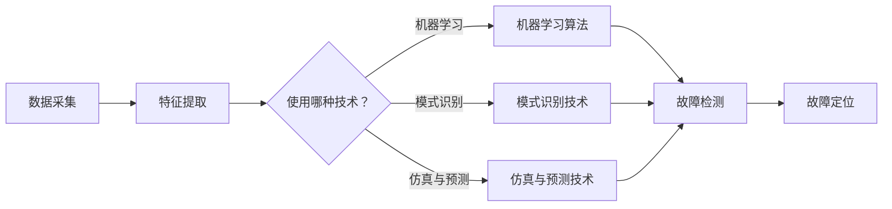
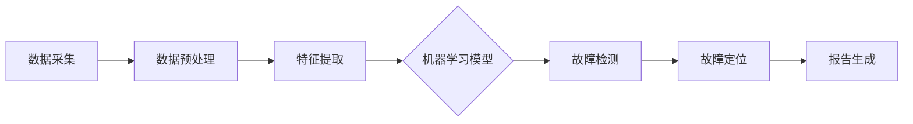
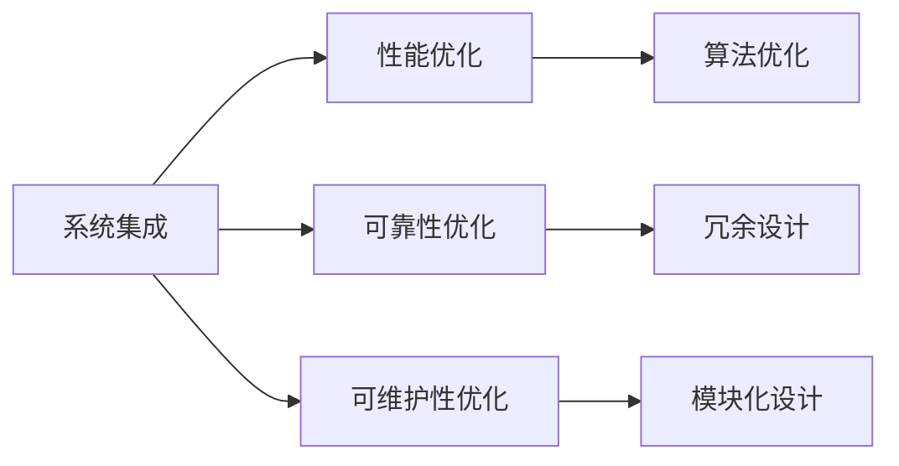

                 

### 评测系统的自动化故障诊断功能

随着信息技术的飞速发展，评测系统在现代企业和组织中扮演着越来越重要的角色。这些系统不仅用于性能监控，还用于检测和诊断潜在的故障，以保障系统的稳定性和可靠性。自动化故障诊断功能作为评测系统中的一个关键组成部分，极大地提升了系统维护的效率和准确性。

## **关键词**

- 评测系统
- 自动化故障诊断
- 故障检测
- 性能优化
- 数据预处理

## **摘要**

本文将探讨评测系统中的自动化故障诊断功能，从基本概念到实际应用，全面解析其原理、方法、实现和优化策略。首先，我们将回顾评测系统的定义和功能，然后深入探讨自动化故障诊断的基本原理和技术。随后，文章将详细介绍常见的自动化故障诊断算法，并通过Python源代码和数学模型进行讲解。最后，我们将结合实际案例，展示自动化故障诊断功能在现实场景中的应用，并提供一些最佳实践和注意事项。

## **1. 评测系统的概念与功能**

### **1.1 评测系统的定义**

评测系统是一套用于评估和监控计算机系统、网络和应用程序性能的综合性软件。其目的是通过实时数据采集、处理和分析，帮助运维团队快速识别和解决潜在问题，确保系统的高效运行。

### **1.2 评测系统的功能**

**数据采集与预处理：** 评测系统首先需要从各种数据源（如服务器、数据库、网络设备等）采集相关数据，然后对数据进行预处理，包括数据清洗、转换和归一化，以确保数据的准确性和一致性。

**故障检测与诊断：** 通过对采集到的数据进行实时分析，评测系统能够快速识别异常情况，如系统崩溃、性能瓶颈等。自动化故障诊断功能则进一步对检测到的异常进行诊断，找出故障的根本原因。

**性能评估与优化：** 除了故障检测和诊断，评测系统还可以对系统的整体性能进行评估，包括响应时间、吞吐量、资源利用率等指标。基于这些评估结果，系统管理员可以采取相应的优化措施，提升系统的性能。

### **核心概念与联系**

为了更好地理解评测系统的工作原理，我们可以通过以下Mermaid流程图展示核心概念之间的关系：


### **2. 自动化故障诊断技术**

### **2.1 自动化故障诊断的基本原理**

自动化故障诊断基于对系统运行时数据的分析和处理，通过识别异常模式和行为，自动发现并定位故障。其主要过程包括数据采集、特征提取、异常检测和故障定位。

### **2.2 常见自动化故障诊断技术**

**机器学习算法：** 利用历史数据和统计模型，通过训练模型来自动识别和预测故障。

**模式识别技术：** 基于特征匹配和模式分类，自动识别异常行为和故障模式。

**仿真与预测技术：** 通过模拟和预测系统行为，提前发现潜在的故障风险。

### **核心概念与联系**

以下是自动化故障诊断技术之间的Mermaid流程图：



### **3. 自动化故障诊断系统架构**

### **3.1 系统架构设计原则**

**可扩展性：** 系统应能够适应不断变化的需求和数据规模。

**可靠性：** 系统应具有高度的稳定性和容错能力，确保故障诊断的准确性。

**易于维护：** 系统应设计得简洁明了，便于日常维护和升级。

### **3.2 系统架构案例分析**

**传统评测系统架构：** 传统的评测系统通常包括数据采集模块、数据处理模块和报告生成模块。

**自动化故障诊断系统架构：** 在传统架构的基础上，增加了自动化故障诊断模块，包括特征提取、模型训练和故障检测等子模块。

### **核心概念与联系**

以下是自动化故障诊断系统架构的Mermaid流程图：



### **4. 故障检测算法**

### **4.1 故障检测原理**

故障检测是自动化故障诊断过程中的第一步，其核心目标是识别系统中的异常行为。常见的故障检测方法包括基于阈值的检测、基于统计的方法和基于机器学习的方法。

### **4.2 常见故障检测算法**

**基于阈值的故障检测：** 通过设定阈值，当系统参数超出阈值范围时，触发故障报警。

**基于统计的故障检测：** 利用统计学方法，对系统数据进行分析，识别异常分布。

**基于机器学习的故障检测：** 利用历史数据训练模型，通过模型对实时数据进行预测，识别异常。

### **核心算法原理讲解**

**基于阈值的故障检测**

```python
def threshold_detection(data, threshold):
    anomalies = []
    for sample in data:
        if sample > threshold:
            anomalies.append(sample)
    return anomalies
```

**基于统计的故障检测**

```python
import numpy as np

def statistical_detection(data):
    mean = np.mean(data)
    std = np.std(data)
    anomalies = []
    for sample in data:
        if abs(sample - mean) > 2 * std:
            anomalies.append(sample)
    return anomalies
```

**基于机器学习的故障检测**

```python
from sklearn.ensemble import IsolationForest

def ml_detection(data):
    model = IsolationForest()
    model.fit(data)
    anomalies = model.predict(data)
    return anomalies
```

### **5. 故障诊断算法**

### **5.1 故障诊断原理**

故障诊断是在故障检测的基础上，进一步确定故障的根本原因。常见的故障诊断方法包括基于规则的诊断、基于模型的诊断和基于数据驱动的诊断。

### **5.2 常见故障诊断算法**

**基于规则的故障诊断：** 通过预设的规则库，根据故障现象匹配相应的规则，确定故障原因。

**基于模型的故障诊断：** 利用系统模型，分析故障现象，推导故障原因。

**基于数据驱动的故障诊断：** 利用历史数据和故障数据，通过模式匹配和统计分析，确定故障原因。

### **核心算法原理讲解**

**基于规则的故障诊断**

```python
def rule_based_diagnosis(fault Symptoms):
    rules = [
        {"symptom": "high CPU usage", "cause": "overloaded process"},
        {"symptom": "network drop", "cause": "network congestion"},
        # 更多规则
    ]
    for rule in rules:
        if rule["symptom"] in fault Symptoms:
            return rule["cause"]
    return "unknown"
```

**基于模型的故障诊断**

```python
def model_based_diagnosis(model, fault Symptoms):
    # 使用系统模型进行分析
    # 返回故障原因
    pass
```

**基于数据驱动的故障诊断**

```python
def data_driven_diagnosis(data, fault Symptoms):
    # 基于历史数据和故障数据进行分析
    # 返回故障原因
    pass
```

### **6. 故障诊断系统集成与优化**

### **6.1 系统集成**

系统集成是将故障检测和诊断算法集成到现有的评测系统中，使其能够自动执行故障诊断任务。

### **6.2 系统优化**

**性能优化：** 通过优化算法和系统架构，提高故障诊断的效率和准确性。

**可靠性优化：** 通过冗余设计和容错机制，提高系统的稳定性和可靠性。

**可维护性优化：** 通过模块化和标准化设计，降低系统的维护成本。

### **核心概念与联系**

以下是故障诊断系统集成与优化的Mermaid流程图：



### **7. 案例分析**

#### **7.1 案例背景**

某企业运行的大型数据库系统频繁出现响应时间过长的问题，影响了业务的正常进行。

#### **7.2 案例实施过程**

1. **数据采集与预处理：** 从数据库系统中采集性能数据，包括CPU使用率、内存使用率、I/O操作等。
2. **故障检测：** 使用基于阈值的故障检测算法，识别出响应时间异常的数据样本。
3. **故障诊断：** 使用基于规则的故障诊断算法，确定故障原因是数据库中的某个索引存在问题。
4. **性能评估与优化：** 对数据库进行优化，调整索引策略，提高系统性能。

### **8. 项目实战**

#### **8.1 实践目标**

搭建一个自动化故障诊断系统，实现对某企业服务器性能的实时监控和故障诊断。

#### **8.2 实践步骤**

1. **开发环境搭建：** 安装必要的软件和工具，如Python、Jupyter Notebook等。
2. **数据处理：** 收集服务器性能数据，包括CPU使用率、内存使用率、网络流量等。
3. **故障检测与诊断：** 应用基于机器学习的故障检测和基于规则的故障诊断算法。
4. **性能评估与优化：** 根据诊断结果，调整服务器配置，优化系统性能。

### **9. 最佳实践**

**小贴士：** 
- **数据预处理：** 确保数据质量，避免噪声和异常值影响诊断结果。
- **算法选择：** 根据实际需求和数据特点，选择合适的故障检测和诊断算法。
- **系统集成：** 确保故障诊断系统与其他监控系统无缝集成，提高整体监控效果。

### **小结**

自动化故障诊断功能是评测系统的重要组成部分，通过故障检测和诊断，可以快速识别和解决系统问题，保障系统的高效运行。本文介绍了评测系统的基本概念、自动化故障诊断技术、系统架构、故障检测和诊断算法，并通过实际案例展示了其应用效果。希望读者能够通过本文的学习，更好地理解和应用自动化故障诊断功能。

### **注意事项**

- **系统稳定性：** 在部署自动化故障诊断系统时，确保系统的稳定性和可靠性，避免误报和漏报。
- **算法优化：** 定期对故障检测和诊断算法进行优化，提高诊断准确率和效率。
- **数据安全：** 保护数据安全，避免敏感信息泄露。

### **拓展阅读**

- [1] 《机器学习实战》：[url]https://www.amazon.com/dp/149195701X[/url]
- [2] 《模式识别》：[url]https://www.amazon.com/dp/047021679X[/url]
- [3] 《Python数据分析》：[url]https://www.amazon.com/dp/1449390785[/url]

### **作者信息**

- 作者：AI天才研究院/AI Genius Institute & 禅与计算机程序设计艺术 /Zen And The Art of Computer Programming

