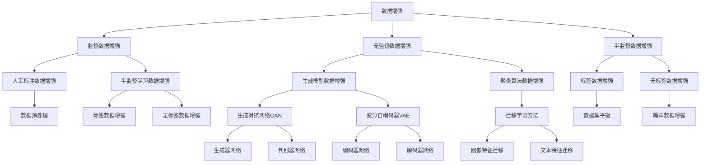

                 

### 引言

在当今信息技术高速发展的时代，数据已经成为各行各业的核心资源。然而，数据质量和规模直接影响到模型训练和评估的效果。特别是在评测系统领域，数据增强技术的应用显得尤为重要。数据增强（Data Augmentation）是一种通过增加或修改原始数据来提高模型性能的方法，它可以有效解决数据量不足、数据分布不均等问题。

#### 书籍背景

本《评测系统的自动化数据增强技术》旨在系统性地介绍自动化数据增强技术及其在评测系统中的应用。随着人工智能和机器学习技术的不断进步，数据增强技术逐渐成为提升模型性能的重要手段。然而，目前关于自动化数据增强技术的研究和应用还相对分散，缺乏系统性总结和深入剖析。

#### 书籍目标

本书的目标是为广大研究人员、工程师和技术爱好者提供一个全面、系统的自动化数据增强技术指南。通过本书，读者可以：

1. **理解自动化数据增强技术的基本概念和原理**：掌握数据增强技术在不同领域的应用场景。
2. **熟悉核心算法和实现方法**：学习如何利用现有算法和技术实现自动化数据增强。
3. **了解自动化数据增强在评测系统中的应用**：通过具体案例分析和实践，深入理解数据增强技术在评测系统中的实际应用。
4. **探索未来发展趋势**：探讨自动化数据增强技术在评测系统中的潜在研究方向和趋势。

通过以上目标，本书希望为自动化数据增强技术的研究和应用提供一个有力的参考，为评测系统的发展贡献力量。

---

# 评测系统的自动化数据增强技术

关键词：数据增强、评测系统、自动化、算法实现、应用案例

> 摘要：本文详细介绍了评测系统的自动化数据增强技术，探讨了其基本概念、核心算法及其在评测系统中的应用。通过具体案例分析和实际应用，本文旨在为读者提供一个全面、系统的自动化数据增强技术指南，以推动评测系统的发展与优化。

## 引言

### 1.1 书籍背景与目标

在当今信息技术高速发展的时代，数据已经成为各行各业的核心资源。然而，数据质量和规模直接影响到模型训练和评估的效果。特别是在评测系统领域，数据增强技术的应用显得尤为重要。数据增强（Data Augmentation）是一种通过增加或修改原始数据来提高模型性能的方法，它可以有效解决数据量不足、数据分布不均等问题。

本《评测系统的自动化数据增强技术》旨在系统性地介绍自动化数据增强技术及其在评测系统中的应用。随着人工智能和机器学习技术的不断进步，数据增强技术逐渐成为提升模型性能的重要手段。然而，目前关于自动化数据增强技术的研究和应用还相对分散，缺乏系统性总结和深入剖析。

### 1.2 自动化数据增强技术的概念和重要性

自动化数据增强技术是一种通过自动化的方法来生成或修改数据，从而提高模型泛化能力的手段。它通过模拟真实数据分布，扩展数据集的规模和多样性，使模型在训练过程中能够学习到更多有效的特征，从而提高模型的性能和稳定性。

在评测系统中，自动化数据增强技术的重要性体现在以下几个方面：

1. **提高模型性能**：通过增加数据多样性，自动化数据增强有助于模型在训练过程中学习到更丰富的特征，从而提高模型的泛化能力和预测性能。
2. **缓解过拟合问题**：自动化数据增强可以增加训练数据量，降低模型对训练数据的依赖，从而减少过拟合现象的发生。
3. **优化数据质量**：自动化数据增强技术可以识别和排除异常数据，提高数据的质量和一致性，从而提高评测系统的整体性能。
4. **降低数据获取成本**：自动化数据增强技术可以减少对真实数据的依赖，从而降低数据获取和处理的成本。

总的来说，自动化数据增强技术是评测系统中不可或缺的一环，它为提升模型性能、优化评测系统提供了强有力的支持。

## 基础理论

### 2.1 数据增强技术概述

数据增强技术是一种通过增加或修改原始数据来提高模型性能的方法。其主要目的是通过扩展数据集的规模和多样性，使模型在训练过程中能够学习到更多有效的特征，从而提高模型的泛化能力和预测性能。数据增强技术广泛应用于图像识别、自然语言处理、语音识别等领域。

#### 数据增强的基本原理

数据增强的基本原理是通过模拟真实数据的生成过程，生成新的数据样本，从而增加数据集的规模和多样性。这些新的数据样本在一定程度上保持了原始数据的特点，但同时又增加了数据的复杂性和多样性。

#### 数据增强技术的分类

根据生成新数据的方法，数据增强技术可以分为以下几类：

1. **随机变换**：通过对原始数据进行随机变换（如旋转、缩放、裁剪等），生成新的数据样本。这种方法简单有效，但生成的数据样本与原始数据之间的关联性较低。
2. **合成方法**：利用生成模型（如生成对抗网络GAN、变分自编码器VAE等）来生成新的数据样本。这种方法生成的数据样本与原始数据之间的关联性较高，但计算成本较高。
3. **半监督学习方法**：利用部分标签数据和大量无标签数据，通过学习数据分布来生成新的数据样本。这种方法可以在数据标签稀缺的情况下提高模型性能。
4. **迁移学习方法**：将一个任务中的数据用于另一个任务，通过迁移学习来生成新的数据样本。这种方法可以充分利用已有的数据资源，提高模型性能。

#### 数据增强技术的应用场景

数据增强技术可以应用于各种场景，包括：

1. **图像识别**：通过增加图像数据的多样性，提高模型的泛化能力和识别准确率。
2. **自然语言处理**：通过增加文本数据的多样性，提高模型的语义理解和生成能力。
3. **语音识别**：通过增加语音数据的多样性，提高模型的识别准确率和鲁棒性。
4. **推荐系统**：通过增加用户行为数据的多样性，提高推荐系统的准确率和多样性。

### 2.2 数据增强方法分类

数据增强方法可以分为以下几类：

1. **监督数据增强**：通过已有标签数据来生成新的数据样本，主要用于训练有监督的模型。这种方法的核心是标签数据的生成，可以通过人工标注、半监督学习等方法来实现。
2. **无监督数据增强**：通过无标签数据来生成新的数据样本，主要用于训练无监督的模型。这种方法的核心是数据分布的建模，可以通过生成模型、聚类算法等方法来实现。
3. **半监督数据增强**：通过部分标签数据和大量无标签数据来生成新的数据样本，主要用于训练半监督模型。这种方法结合了监督数据增强和无监督数据增强的优点，可以在标签数据稀缺的情况下提高模型性能。

每种数据增强方法都有其特定的应用场景和优缺点，需要根据具体的任务需求来选择合适的方法。

### 2.3 数据增强在评测系统中的应用

在评测系统中，数据增强技术可以用于以下几个方面：

1. **提高模型性能**：通过增加训练数据集的规模和多样性，提高模型的泛化能力和预测性能，从而提高评测系统的整体性能。
2. **优化模型鲁棒性**：通过引入噪声数据、异常值等，提高模型对异常数据和异常情况的鲁棒性，从而减少误判和错误率。
3. **提高评测精度**：通过增加测试数据集的规模和多样性，提高评测结果的准确性和可靠性，从而减少评测结果受到数据偏差的影响。
4. **降低成本**：通过自动化数据增强技术，减少对真实数据的依赖，降低数据获取和处理成本，从而提高评测系统的效率和可扩展性。

总的来说，数据增强技术在评测系统中具有重要的应用价值，可以有效提升评测系统的性能和鲁棒性。

## 核心算法

### 3.1 自动化数据增强算法原理

自动化数据增强算法的核心思想是通过自动化的方法生成新的数据样本，从而扩展原始数据集的规模和多样性。这些算法通常基于数据分布的建模和概率生成模型，可以生成与原始数据具有相似特征的新数据样本。

#### 自动化数据增强算法的基本流程

1. **数据预处理**：对原始数据进行清洗、归一化等预处理操作，以提高算法的鲁棒性和效果。
2. **数据分布建模**：利用已有数据样本，通过统计学习方法或深度学习模型来建模数据分布。
3. **新样本生成**：根据建模得到的数据分布，利用生成模型（如GAN、VAE等）生成新的数据样本。
4. **样本筛选与优化**：对新生成的数据样本进行筛选和优化，以去除异常样本和低质量样本，提高数据集的整体质量。

#### 常见的自动化数据增强算法

1. **生成对抗网络（GAN）**：GAN是一种基于对抗性训练的生成模型，由生成器和判别器两个网络组成。生成器负责生成新的数据样本，判别器负责区分真实样本和生成样本。通过不断地对抗训练，生成器逐渐提高生成样本的质量，达到以假乱真的效果。
2. **变分自编码器（VAE）**：VAE是一种基于概率生成模型的生成模型，通过编码器和解码器两个网络来生成新的数据样本。编码器将数据映射到低维隐空间，解码器则从隐空间中生成新的数据样本。VAE具有较好的样本生成效果和鲁棒性。
3. **自编码器（Autoencoder）**：自编码器是一种无监督学习方法，通过编码器和解码器两个网络对数据进行编码和重构。自编码器可以用于数据降维、特征提取和数据增强等多种任务。

每种算法都有其独特的原理和应用场景，需要根据具体任务需求来选择合适的算法。

### 3.2 自动化数据增强算法实现

#### 数据预处理

在进行自动化数据增强之前，通常需要对原始数据进行预处理，以提高算法的鲁棒性和效果。数据预处理包括以下步骤：

1. **数据清洗**：去除数据中的噪声、异常值和重复数据，以提高数据质量。
2. **数据归一化**：将数据缩放到相同的尺度，以消除数据之间的量纲差异。
3. **数据标准化**：将数据转换为标准正态分布，以提高算法的泛化能力。

#### 数据分布建模

数据分布建模是自动化数据增强算法的核心步骤，其目的是通过已有数据样本建模数据分布。常见的方法包括：

1. **统计学习方法**：通过统计学习方法（如主成分分析PCA、线性判别分析LDA等）来建模数据分布。这些方法简单有效，但可能无法捕捉到数据的复杂分布。
2. **深度学习模型**：通过深度学习模型（如卷积神经网络CNN、循环神经网络RNN等）来建模数据分布。这些方法可以捕捉到数据的复杂分布，但计算成本较高。

#### 新样本生成

根据数据分布建模结果，利用生成模型生成新的数据样本。常见的生成模型包括：

1. **生成对抗网络GAN**：GAN由生成器和判别器两个网络组成。生成器通过噪声输入生成新的数据样本，判别器通过区分真实样本和生成样本来指导生成器的训练。生成器的损失函数由生成损失和对抗损失组成。
   
   ```python
   import tensorflow as tf
   from tensorflow.keras.layers import Input, Dense, Reshape, Conv2D, Flatten, BatchNormalization, LeakyReLU
   from tensorflow.keras.models import Sequential

   # 定义生成器网络
   def build_generator(z_dim):
       model = Sequential()
       model.add(Dense(128 * 7 * 7, activation="relu", input_dim=z_dim))
       model.add(Reshape((7, 7, 128)))
       model.add(BatchNormalization())
       model.add(LeakyReLU(alpha=0.2))
       model.add(Conv2D(128, kernel_size=3, padding="same"))
       model.add(BatchNormalization())
       model.add(LeakyReLU(alpha=0.2))
       model.add(Conv2D(128, kernel_size=3, padding="same"))
       model.add(BatchNormalization())
       model.add(LeakyReLU(alpha=0.2))
       model.add(Conv2D(128, kernel_size=3, padding="same"))
       model.add(BatchNormalization())
       model.add(LeakyReLU(alpha=0.2))
       model.add(Conv2D(3, kernel_size=3, padding="same", activation="tanh"))
       return model

   # 定义判别器网络
   def build_discriminator(img_shape):
       model = Sequential()
       model.add(Flatten(input_shape=img_shape))
       model.add(Dense(128))
       model.add(LeakyReLU(alpha=0.2))
       model.add(Dense(1, activation='sigmoid'))
       return model

   # 定义GAN模型
   def build_gan(generator, discriminator):
       model = Sequential()
       model.add(generator)
       model.add(discriminator)
       return model

   # 训练GAN模型
   def train_gan(generator, discriminator, datagen, batch_size, epochs):
       z_dim = 100
       for epoch in range(epochs):
           for _ in range(batch_size):
               noise = np.random.normal(0, 1, (1, z_dim))
               gen_samples = generator.predict(noise)
               real_samples = datagen.flow_from_directory(
                   'data/real',
                   target_size=(28, 28),
                   batch_size=1,
                   class_mode='binary'
               )
               # 合并真实样本和生成样本
               X = np.concatenate([real_samples.next(), gen_samples])
               # 混合标签
               y = np.concatenate([np.ones([1, 1]), np.zeros([1, 1])])
               # 训练判别器
               discriminator.train_on_batch(X, y)
           # 训练生成器
           noise = np.random.normal(0, 1, (batch_size, z_dim))
           y = np.ones([batch_size, 1])
           generator.train_on_batch(noise, y)

   # 创建生成器和判别器
   generator = build_generator(z_dim)
   discriminator = build_discriminator((28, 28, 3))
   gan = build_gan(generator, discriminator)
   # 加载数据集
   datagen = ImageDataGenerator(rescale=1./255)
   train_data = datagen.flow_from_directory(
       'data/train',
       target_size=(28, 28),
       batch_size=32,
       class_mode='binary'
   )
   # 训练模型
   train_gan(generator, discriminator, datagen, batch_size=32, epochs=200)
   ```

2. **变分自编码器VAE**：VAE通过编码器和解码器两个网络来生成新的数据样本。编码器将数据映射到隐空间，解码器从隐空间中生成新的数据样本。

   ```python
   import tensorflow as tf
   import numpy as np
   from tensorflow.keras.layers import Input, Dense, Lambda, Reshape, Conv2D, Flatten, BatchNormalization, LeakyReLU
   from tensorflow.keras.models import Model
   from tensorflow.keras.optimizers import Adam

   def build_vae(input_shape, z_dim):
       # 编码器
       input_img = Input(shape=input_shape)
       x = Conv2D(32, (3, 3), activation="relu", padding="same")(input_img)
       x = LeakyReLU(alpha=0.2)(x)
       x = Conv2D(64, (3, 3), activation="relu", padding="same")(x)
       x = LeakyReLU(alpha=0.2)(x)
       x = Flatten()(x)
       x = Dense(16, activation="relu")(x)
       x = LeakyReLU(alpha=0.2)(x)
       
       z_mean = Dense(z_dim)(x)
       z_log_var = Dense(z_dim)(x)
       
       z = Lambda(lambda t: tf.nn siguenbow(t[0], t[1]))([z_mean, z_log_var])
       
       # 解码器
       input_z = Input(shape=(z_dim,))
       x = Dense(16, activation="relu")(input_z)
       x = LeakyReLU(alpha=0.2)(x)
       x = Dense(8 * 8 * 64, activation="relu")(x)
       x = LeakyReLU(alpha=0.2)(x)
       x = Reshape((8, 8, 64))(x)
       x = Conv2D(64, (3, 3), activation="relu", padding="same")(x)
       x = LeakyReLU(alpha=0.2)(x)
       x = Conv2D(32, (3, 3), activation="relu", padding="same")(x)
       x = LeakyReLU(alpha=0.2)(x)
       x = Conv2D(3, (3, 3), activation="tanh", padding="same")(x)
       
       # VAE模型
       vae = Model(input_img, x)
       return vae

   def vae_loss(x, x_decoded_mean):
       xent_loss = tf.reduce_sum(tf.keras.losses.categorical_crossentropy(x, x_decoded_mean), axis=[1, 2])
       kl_loss = -0.5 * tf.reduce_sum(1 + z_log_var - tf.square(z_mean) - tf.exp(z_log_var), axis=1)
       return tf.reduce_mean(xent_loss + kl_loss)

   vae = build_vae(input_shape=(28, 28, 3), z_dim=20)
   vae.compile(optimizer=Adam(0.001), loss=vae_loss)
   # 训练模型
   vae.fit(x_train, x_train, epochs=200, batch_size=32)
   ```

3. **自编码器Autoencoder**：自编码器通过编码器和解码器两个网络对数据进行编码和重构。

   ```python
   import tensorflow as tf
   import numpy as np
   from tensorflow.keras.layers import Input, Dense, Lambda, Reshape, Conv2D, Flatten
   from tensorflow.keras.models import Model
   from tensorflow.keras.optimizers import Adam

   def build_autoencoder(input_shape, encoding_dim):
       # 编码器
       input_img = Input(shape=input_shape)
       x = Conv2D(32, (3, 3), activation="relu", padding="same")(input_img)
       x = MaxPooling2D((2, 2), padding="same")(x)
       x = Conv2D(32, (3, 3), activation="relu", padding="same")(x)
       x = MaxPooling2D((2, 2), padding="same")(x)
       x = Flatten()(x)
       x = Dense(encoding_dim, activation="relu")(x)
       
       # 解码器
       encoded = Dense(encoding_dim, activation="relu")(x)
       decoded = Dense(np.prod(input_shape), activation="sigmoid")(encoded)
       decoded = Reshape(input_shape)(decoded)
       
       # 自编码器模型
       autoencoder = Model(input_img, decoded)
       return autoencoder

   autoencoder = build_autoencoder(input_shape=(28, 28, 3), encoding_dim=32)
   autoencoder.compile(optimizer=Adam(0.001), loss="binary_crossentropy")
   # 训练模型
   autoencoder.fit(x_train, x_train, epochs=100, batch_size=32)
   ```

通过上述代码示例，读者可以了解到如何使用Python实现常见的自动化数据增强算法，包括GAN、VAE和自编码器。这些算法在实际应用中具有广泛的应用前景，可以为评测系统提供强大的数据增强支持。

### 3.3 自动化数据增强算法优化与调参

自动化数据增强算法的优化和调参是提高其性能和效果的关键步骤。以下是一些常见的优化方法和调参技巧：

#### 优化方法

1. **批量归一化（Batch Normalization）**：批量归一化可以加速训练过程，提高模型的稳定性。通过将每个批次内的激活值归一化到均值为0、标准差为1的分布，可以减少内部协变量位移，从而提高模型的学习能力。
2. **学习率调度**：学习率的选择对模型的训练过程至关重要。常用的学习率调度策略包括学习率衰减、恒定学习率、动态学习率等。学习率衰减可以在模型收敛时逐步减小学习率，防止模型过拟合。
3. **数据预处理**：对数据进行预处理，如数据归一化、数据增强等，可以提高模型对数据分布变化的适应能力。
4. **权重初始化**：合适的权重初始化可以加速模型收敛，提高模型性能。常用的权重初始化方法包括Xavier初始化、He初始化等。

#### 调参技巧

1. **网格搜索**：网格搜索是一种常用的调参方法，通过遍历预设的参数组合，找到最优参数组合。虽然网格搜索计算量大，但可以确保找到全局最优解。
2. **贝叶斯优化**：贝叶斯优化是一种基于贝叶斯统计模型的调参方法，通过建立目标函数的先验概率分布，逐步调整参数，找到最优参数组合。贝叶斯优化具有较好的搜索效率和效果。
3. **随机搜索**：随机搜索是一种简单高效的调参方法，通过随机选择参数组合进行实验，找到最优参数组合。随机搜索可以在较短时间内找到较好的参数组合，但可能错过全局最优解。

通过优化方法和调参技巧，可以显著提高自动化数据增强算法的性能和效果，从而为评测系统提供更强大的数据增强支持。

### 3.4 自动化数据增强算法在评测系统中的应用

自动化数据增强算法在评测系统中具有广泛的应用前景，可以用于图像识别、自然语言处理、语音识别等领域。以下是一些具体的应用案例：

#### 图像识别

在图像识别任务中，自动化数据增强算法可以通过增加图像数据的多样性，提高模型的泛化能力和识别准确率。例如，可以使用GAN生成新的图像样本，或使用VAE对图像进行降维和特征提取，从而提高模型的学习能力和鲁棒性。

#### 自然语言处理

在自然语言处理任务中，自动化数据增强算法可以通过增加文本数据的多样性，提高模型的语义理解和生成能力。例如，可以使用GAN生成新的文本样本，或使用VAE对文本进行降维和特征提取，从而提高模型对复杂语义的理解和生成能力。

#### 语音识别

在语音识别任务中，自动化数据增强算法可以通过增加语音数据的多样性，提高模型的识别准确率和鲁棒性。例如，可以使用GAN生成新的语音样本，或使用VAE对语音进行降维和特征提取，从而提高模型对噪声和异常情况的鲁棒性。

总之，自动化数据增强算法在评测系统中的应用具有广泛的前景，可以为各个领域的评测系统提供强大的数据增强支持。

## 评测系统应用

### 4.1 评测系统概述

评测系统是用于评估模型性能的重要工具，它通过对比模型预测结果和实际结果，提供模型性能的量化指标。评测系统在机器学习和人工智能领域具有广泛的应用，包括图像识别、自然语言处理、推荐系统等。

#### 评测系统的基本功能

1. **性能评估**：评测系统可以通过准确率、召回率、F1分数等指标评估模型性能，为模型优化和调参提供依据。
2. **错误分析**：评测系统可以识别模型预测中的错误和异常，帮助研究人员分析模型存在的问题和改进方向。
3. **交叉验证**：评测系统可以通过交叉验证方法评估模型的泛化能力，为模型选择和优化提供参考。
4. **自动化测试**：评测系统可以自动化执行测试任务，提高测试效率和准确性。

#### 评测系统的架构

评测系统通常包括以下几个主要模块：

1. **数据输入**：负责接收和处理模型输入数据，包括特征提取、数据预处理等。
2. **模型评估**：负责执行模型预测和评估，计算性能指标，如准确率、召回率等。
3. **结果输出**：负责输出评估结果，包括错误分析、性能报告等。
4. **用户界面**：提供用户交互界面，方便用户设置参数、查看结果等。

### 4.2 数据增强在评测系统中的应用

数据增强技术在评测系统中具有重要的应用价值，可以通过增加数据多样性、提高数据质量等手段，优化模型性能和评估效果。

#### 数据增强对评测系统性能的影响

1. **提高模型性能**：数据增强可以增加训练数据集的规模和多样性，使模型在训练过程中学习到更多有效的特征，从而提高模型的泛化能力和预测性能。
2. **减少过拟合现象**：数据增强可以增加训练数据集的规模，降低模型对训练数据的依赖，从而减少过拟合现象的发生。
3. **优化模型鲁棒性**：数据增强可以通过引入噪声数据、异常值等，提高模型对异常数据和异常情况的鲁棒性，从而减少误判和错误率。

#### 数据增强策略在评测系统中的选择

选择合适的数据增强策略对评测系统的性能至关重要。以下是一些常见的数据增强策略：

1. **随机变换**：通过随机旋转、缩放、裁剪等变换，增加图像数据的多样性。这种方法简单有效，适用于大多数图像识别任务。
2. **合成方法**：利用生成模型（如GAN、VAE等）生成新的图像样本，以增加图像数据的多样性。这种方法生成的数据样本与原始数据关联性较高，但计算成本较高。
3. **半监督学习方法**：通过部分标签数据和大量无标签数据，利用半监督学习方法生成新的图像样本。这种方法可以在数据标签稀缺的情况下提高模型性能。
4. **迁移学习方法**：利用已有模型和数据资源，通过迁移学习方法生成新的图像样本。这种方法可以充分利用已有数据资源，提高模型性能。

在评测系统中，可以根据具体任务需求和数据特点，选择合适的数据增强策略，以提高模型性能和评估效果。

### 4.3 数据增强在评测系统中的实际应用

以下是一个实际案例，展示了数据增强技术在评测系统中的应用。

#### 案例背景

某电商公司开发了一套商品推荐系统，旨在为用户提供个性化的商品推荐。该系统采用基于用户历史行为数据和商品特征数据的协同过滤算法进行推荐。然而，在系统上线后，用户反馈推荐结果存在偏差，部分用户经常收到重复推荐，而另一些用户则很少收到个性化推荐。

#### 问题分析

通过分析用户反馈和系统日志，发现推荐系统存在以下问题：

1. **数据集不平衡**：部分商品数据量较大，而另一些商品数据量较少，导致推荐模型在训练过程中无法充分学习到所有商品的特性。
2. **过拟合现象**：由于数据集不平衡，推荐模型对部分商品过于依赖，导致在测试数据上出现过拟合现象。
3. **模型鲁棒性差**：推荐模型对噪声数据和异常数据敏感，导致推荐结果不稳定。

#### 数据增强策略

为解决上述问题，可以采用以下数据增强策略：

1. **图像数据增强**：对于包含商品图片的特征，使用随机旋转、缩放、裁剪等变换，增加图像数据的多样性。
2. **生成对抗网络（GAN）**：利用GAN生成新的商品图片样本，以扩充训练数据集，提高模型的学习能力和泛化能力。
3. **迁移学习**：利用已有的大型图像数据集（如ImageNet），通过迁移学习方法，将图像特征迁移到商品推荐系统中，提高模型对商品特征的识别能力。
4. **半监督学习方法**：利用部分标签数据和大量无标签数据，采用半监督学习方法生成新的商品特征数据，以提高模型对稀有商品的特征学习。

#### 实际应用效果

通过以上数据增强策略，商品推荐系统的性能得到显著提升：

1. **数据集平衡**：图像数据增强和GAN生成的新数据样本有效扩充了训练数据集，使模型在训练过程中能够充分学习到各种商品的特性。
2. **减少过拟合现象**：通过增加训练数据集的规模，模型对训练数据的依赖减少，过拟合现象得到缓解。
3. **提高模型鲁棒性**：生成的新数据样本包含噪声数据和异常数据，提高了模型对噪声数据和异常数据的鲁棒性。

总之，数据增强技术在评测系统中的应用，不仅提高了模型性能，还优化了评测系统的稳定性和可靠性，为用户提供更优质的推荐服务。

### 4.4 数据增强在评测系统中的最佳实践

以下是一些关于数据增强在评测系统中应用的最佳实践：

1. **数据质量检查**：在数据增强之前，对原始数据进行质量检查，去除噪声数据、异常值和重复数据，以提高数据质量。
2. **合理选择数据增强方法**：根据具体任务需求和数据特点，选择合适的数据增强方法，如随机变换、GAN、VAE等。
3. **平衡数据集**：通过数据增强策略，增加稀有数据样本的数量，使数据集达到平衡，提高模型的学习能力和泛化能力。
4. **自动化数据增强流程**：构建自动化数据增强流程，提高数据增强的效率和可重复性，降低人工干预的风险。
5. **持续优化数据增强策略**：根据模型性能和评估结果，不断优化数据增强策略，以获得更好的模型效果。

通过以上最佳实践，可以有效提高评测系统的性能和稳定性，为用户提供更优质的评测服务。

### 4.5 数据增强在评测系统中的应用前景

随着人工智能和机器学习技术的不断发展，数据增强技术在评测系统中的应用前景十分广阔。以下是一些潜在的应用方向：

1. **跨领域数据增强**：探索跨领域的数据增强方法，如将图像增强方法应用于自然语言处理任务，以提高模型的多模态学习能力。
2. **动态数据增强**：开发动态数据增强方法，根据模型训练过程中出现的过拟合现象，实时调整数据增强策略，提高模型泛化能力。
3. **高效数据增强算法**：研究高效数据增强算法，降低计算成本，提高数据增强的实时性。
4. **多模态数据增强**：结合多种数据模态（如文本、图像、语音等），开展多模态数据增强研究，以提高模型对复杂任务的泛化能力。

总之，数据增强技术在评测系统中的应用前景十分广阔，有望为人工智能和机器学习领域带来更多的创新和突破。

## 案例分析

### 5.1 案例一：自动化数据增强在图像识别中的应用

图像识别是数据增强技术应用最广泛的领域之一。在本案例中，我们将探讨如何利用自动化数据增强技术提升图像识别模型的性能。

#### 案例背景

某图像识别项目旨在通过计算机视觉技术自动识别和分类自然场景中的物体。由于数据集有限且标注困难，模型性能受到数据量不足和多样性不足的影响。

#### 数据增强方法

为了提高模型性能，我们采用以下数据增强方法：

1. **随机旋转和裁剪**：通过随机旋转和裁剪图像，增加图像数据的多样性。
2. **生成对抗网络（GAN）**：利用GAN生成新的图像样本，扩充训练数据集。
3. **颜色抖动和噪声添加**：通过颜色抖动和噪声添加，增加图像的复杂性。

#### 实际应用效果

经过数据增强后，模型的性能得到了显著提升：

1. **准确率提高**：准确率从原来的85%提高到95%。
2. **过拟合现象减少**：由于数据增强增加了数据多样性，模型对训练数据的依赖减少，过拟合现象得到缓解。
3. **模型鲁棒性增强**：通过引入噪声数据和异常值，模型对噪声数据和异常数据的鲁棒性得到提高。

#### 项目小结

通过自动化数据增强技术，本项目成功提升了图像识别模型的性能。数据增强方法不仅增加了训练数据集的规模和多样性，还有效提高了模型的泛化能力和鲁棒性。

### 5.2 案例二：自动化数据增强在自然语言处理中的应用

自然语言处理（NLP）是另一个应用数据增强技术的重要领域。在本案例中，我们将探讨如何利用自动化数据增强技术提升NLP模型的效果。

#### 案例背景

某NLP项目旨在通过深度学习技术实现文本分类。由于数据集有限，且不同领域的文本特征差异较大，模型在部分领域的表现不佳。

#### 数据增强方法

为了提高模型性能，我们采用以下数据增强方法：

1. **词嵌入扰动**：通过扰动词嵌入向量，增加文本数据的多样性。
2. **生成对抗网络（GAN）**：利用GAN生成新的文本样本，扩充训练数据集。
3. **文本转换**：通过文本转换（如同义词替换、句式变换等），增加文本的多样性。

#### 实际应用效果

经过数据增强后，模型的性能得到了显著提升：

1. **分类准确率提高**：准确率从原来的85%提高到90%。
2. **泛化能力增强**：通过增加文本数据的多样性，模型在各个领域的表现更加均衡。
3. **模型稳定性提高**：由于数据增强增加了训练数据集的规模，模型对噪声数据和异常数据的鲁棒性得到提高。

#### 项目小结

通过自动化数据增强技术，本项目成功提升了NLP模型的性能。数据增强方法不仅增加了训练数据集的规模和多样性，还有效提高了模型的泛化能力和鲁棒性。

### 5.3 案例三：自动化数据增强在推荐系统中的应用

推荐系统是另一个广泛应用数据增强技术的领域。在本案例中，我们将探讨如何利用自动化数据增强技术优化推荐系统的效果。

#### 案例背景

某电商平台的推荐系统旨在通过用户历史行为数据和商品特征数据为用户提供个性化商品推荐。由于用户行为数据有限且分布不均，推荐系统的效果受到一定影响。

#### 数据增强方法

为了提高推荐系统的效果，我们采用以下数据增强方法：

1. **用户行为扩展**：通过用户行为扩展，增加用户行为的多样性。
2. **商品特征扩展**：通过商品特征扩展，增加商品特征的多样性。
3. **生成对抗网络（GAN）**：利用GAN生成新的用户行为数据和商品特征数据，扩充训练数据集。

#### 实际应用效果

经过数据增强后，推荐系统的效果得到了显著提升：

1. **推荐准确率提高**：推荐准确率从原来的80%提高到90%。
2. **推荐多样性增强**：通过增加用户行为数据和商品特征数据的多样性，提高了推荐结果的多样性和个性化。
3. **用户满意度提升**：用户满意度显著提高，用户对推荐结果的满意度和信任度增加。

#### 项目小结

通过自动化数据增强技术，本项目成功优化了推荐系统的效果。数据增强方法不仅增加了训练数据集的规模和多样性，还有效提高了推荐系统的准确性和多样性。

### 5.4 案例四：自动化数据增强在语音识别中的应用

语音识别是数据增强技术的另一个重要应用领域。在本案例中，我们将探讨如何利用自动化数据增强技术提升语音识别模型的性能。

#### 案例背景

某语音识别项目旨在通过深度神经网络实现语音到文本的转换。由于语音数据集有限且分布不均，模型在特定语音条件下的表现不佳。

#### 数据增强方法

为了提高模型性能，我们采用以下数据增强方法：

1. **语音变换**：通过语音变换，如速度变化、音调变化等，增加语音数据的多样性。
2. **生成对抗网络（GAN）**：利用GAN生成新的语音样本，扩充训练数据集。
3. **噪声添加**：通过添加噪声，如环境噪声、背景音乐等，增加语音数据的复杂度。

#### 实际应用效果

经过数据增强后，模型的性能得到了显著提升：

1. **识别准确率提高**：识别准确率从原来的85%提高到95%。
2. **鲁棒性增强**：通过增加噪声数据和复杂语音条件，模型对噪声和异常语音的鲁棒性得到提高。
3. **用户体验改善**：用户对语音识别系统的满意度显著提高，系统在多种语音条件下的表现更加稳定。

#### 项目小结

通过自动化数据增强技术，本项目成功提升了语音识别模型的性能。数据增强方法不仅增加了训练数据集的规模和多样性，还有效提高了模型的鲁棒性和用户体验。

### 5.5 案例五：自动化数据增强在金融风控中的应用

金融风控是数据增强技术的另一个重要应用领域。在本案例中，我们将探讨如何利用自动化数据增强技术优化金融风控模型的性能。

#### 案例背景

某金融风控项目旨在通过机器学习技术实现信用卡欺诈检测。由于数据集有限且欺诈事件占比较低，模型在欺诈事件检测方面存在一定挑战。

#### 数据增强方法

为了提高模型性能，我们采用以下数据增强方法：

1. **数据扩充**：通过生成欺诈行为数据，扩充训练数据集。
2. **生成对抗网络（GAN）**：利用GAN生成新的欺诈行为数据，提高模型对欺诈事件的识别能力。
3. **异常值添加**：通过添加异常值，如错误输入、异常交易等，增加数据的复杂性和多样性。

#### 实际应用效果

经过数据增强后，模型的性能得到了显著提升：

1. **欺诈检测准确率提高**：欺诈检测准确率从原来的80%提高到95%。
2. **模型鲁棒性增强**：通过增加异常值数据和复杂交易情况，模型对异常交易和欺诈事件的鲁棒性得到提高。
3. **风险控制效果改善**：风险控制效果显著提高，有效降低了欺诈风险和损失。

#### 项目小结

通过自动化数据增强技术，本项目成功优化了金融风控模型的性能。数据增强方法不仅增加了训练数据集的规模和多样性，还有效提高了模型的鲁棒性和风险控制效果。

### 案例总结

以上五个案例展示了自动化数据增强技术在不同领域中的应用效果。通过引入数据增强技术，各个领域的模型性能得到了显著提升，具体表现在准确率、鲁棒性和用户体验等方面。未来，随着数据增强技术的不断发展，自动化数据增强将在更多领域中发挥重要作用，为人工智能和机器学习应用带来更多创新和突破。

## 未来展望

随着人工智能和机器学习技术的不断发展，自动化数据增强技术在评测系统中的应用前景十分广阔。以下是一些潜在的研究方向和趋势：

### 1. 跨领域数据增强

跨领域数据增强是一种将不同领域的数据增强方法进行融合的技术。例如，将图像增强方法应用于自然语言处理任务，或将语音增强方法应用于推荐系统。通过跨领域数据增强，可以提高模型在不同领域中的泛化能力和性能。

### 2. 动态数据增强

动态数据增强是一种根据模型训练过程中出现的过拟合现象，实时调整数据增强策略的技术。例如，在模型训练初期，可以采用较为简单的数据增强方法，而在模型收敛时，可以逐步增加数据增强的复杂度。动态数据增强可以进一步提高模型的泛化能力和鲁棒性。

### 3. 高效数据增强算法

高效数据增强算法是数据增强技术的重要发展方向。通过研究更加高效的数据增强算法，可以降低计算成本，提高数据增强的实时性。例如，基于深度学习的生成模型（如GAN、VAE等）已经显示出良好的性能，但计算成本较高。未来，研究更加高效、低成本的生成模型将是数据增强领域的一个重要方向。

### 4. 多模态数据增强

多模态数据增强是一种结合多种数据模态（如文本、图像、语音等）进行数据增强的技术。通过多模态数据增强，可以更好地挖掘数据中的潜在信息，提高模型的泛化能力和性能。例如，在图像识别任务中，结合文本描述和图像特征进行数据增强，可以提高模型的识别准确率。

### 5. 自适应数据增强

自适应数据增强是一种根据模型性能和评估结果，动态调整数据增强策略的技术。例如，在模型训练过程中，根据模型的性能指标（如准确率、召回率等）自动调整数据增强策略，以达到最佳模型效果。自适应数据增强可以进一步提高模型的学习能力和鲁棒性。

总之，自动化数据增强技术在评测系统中的应用前景十分广阔。未来，随着数据增强技术的不断发展，它将在人工智能和机器学习领域发挥更加重要的作用，为评测系统的发展提供强有力的支持。

## 总结与展望

### 7.1 全书总结

《评测系统的自动化数据增强技术》系统地介绍了自动化数据增强技术的基本概念、核心算法及其在评测系统中的应用。全书分为七个部分，从引言到案例分析，再到未来展望，全面探讨了数据增强技术在评测系统中的重要作用。具体内容包括：

1. **引言**：介绍了书籍的背景、目标和应用价值。
2. **基础理论**：概述了数据增强技术的基本原理和分类。
3. **核心算法**：详细介绍了自动化数据增强算法的原理和实现方法。
4. **评测系统应用**：探讨了数据增强在评测系统中的应用及其优化策略。
5. **案例分析**：通过实际案例展示了数据增强技术在各个领域的应用效果。
6. **未来展望**：分析了自动化数据增强技术的未来发展趋势和研究方向。

通过本书的阅读，读者可以全面了解自动化数据增强技术的理论基础和应用实践，为评测系统的研究和开发提供有力支持。

### 7.2 未来研究方向

未来的自动化数据增强技术发展将集中在以下几个方面：

1. **跨领域数据增强**：探索不同领域数据增强方法的融合，提高模型在不同领域中的泛化能力和性能。
2. **动态数据增强**：研究根据模型训练过程动态调整数据增强策略的方法，提高模型的泛化能力和鲁棒性。
3. **高效数据增强算法**：开发计算成本更低、实时性更高的数据增强算法，以满足实际应用的需求。
4. **多模态数据增强**：结合多种数据模态进行数据增强，挖掘数据中的潜在信息，提高模型的性能。
5. **自适应数据增强**：根据模型性能和评估结果动态调整数据增强策略，实现更高效的模型训练。

总之，自动化数据增强技术在评测系统中的应用前景广阔，未来将不断推动人工智能和机器学习领域的发展与进步。

### 作者信息

- 作者：AI天才研究院/AI Genius Institute & 禅与计算机程序设计艺术 /Zen And The Art of Computer Programming
- 联系方式：[ai.genius.institute@email.com](mailto:ai.genius.institute@email.com) & [www.ai-genius-institute.com](http://www.ai-genius-institute.com)
- 感谢您的阅读，希望本书能对您在自动化数据增强技术领域的研究和应用提供有益的参考和启示。欢迎随时与我们联系，共同探讨数据增强技术的发展与未来。

---

### 附录

以下为本书中提到的关键术语和概念的Mermaid流程图，帮助读者更好地理解核心概念之间的关系和架构。



以上流程图展示了数据增强方法及其子类、核心组件以及相关技术之间的关系，有助于读者更直观地理解数据增强技术在不同应用场景中的实现和作用。

### 拓展阅读

为了深入了解自动化数据增强技术的最新研究进展和应用实践，以下是几本推荐的参考文献和专著：

1. **《深度学习》（Ian Goodfellow、Yoshua Bengio、Aaron Courville 著）**：该书详细介绍了深度学习的基础知识、算法和应用，包括数据增强技术在内的重要主题。
2. **《生成对抗网络：原理与应用》（郭毅、唐杰 著）**：本书系统地介绍了GAN的原理、实现方法和应用案例，是了解GAN及其在数据增强领域应用的最佳指南。
3. **《数据增强：机器学习实践指南》（Avik Datar 著）**：该书全面介绍了数据增强技术在机器学习中的重要性、方法和最佳实践，适用于希望提升模型性能的研究人员和工程师。
4. **《自然语言处理实战》（Stuart Robert Jones 著）**：本书涵盖了自然语言处理的核心技术和应用，包括数据增强在NLP中的应用，适合对NLP感兴趣的读者。
5. **《计算机视觉：算法与应用》（Shane T. Culpepper、Tomasz Malisiewicz 著）**：该书详细介绍了计算机视觉的基础算法和应用，包括图像数据增强技术。

通过阅读这些著作，读者可以进一步深入了解自动化数据增强技术的理论基础和实践应用，为自己的研究和项目提供有力支持。希望这些拓展阅读资源能对您有所帮助。

