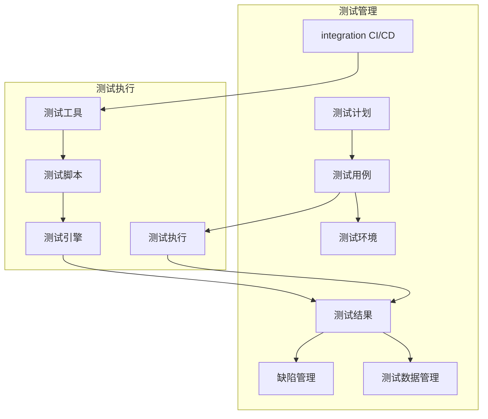

                 

# 《评测系统的自动化测试用例管理》

## 关键词

- 自动化测试
- 测试用例管理
- 测试工具
- 测试设计
- 测试执行与结果分析

## 摘要

本文旨在深入探讨评测系统的自动化测试用例管理。随着软件系统复杂度的不断增加，自动化测试成为提高软件质量、降低成本的重要手段。本文首先介绍了自动化测试的基本概念和优势，然后详细阐述了测试用例管理的核心原则和方法，包括测试用例的创建、管理、执行和结果分析。通过实际案例和代码示例，本文展示了如何有效实施自动化测试用例管理，并提供了一些最佳实践和注意事项。

## 引言

### 自动化测试的背景和重要性

在软件开发生命周期中，测试是一个至关重要的环节。传统的手动测试方式不仅耗时耗力，而且难以保证测试的全面性和一致性。随着软件系统日益复杂，手动测试的局限性变得更加明显。自动化测试作为一种高效、可重复的测试方法，逐渐受到软件开发团队的青睐。

自动化测试的主要目的是通过编写脚本自动化执行测试过程，从而提高测试的效率和可靠性。自动化测试不仅能够节省时间和人力资源，还能够减少人为错误，提高测试覆盖率。在当今快速迭代的软件开发环境中，自动化测试已经成为提高软件质量和交付效率的关键手段。

### 自动化测试与手动测试的对比

自动化测试与手动测试在多个方面存在显著差异：

- **执行速度**：自动化测试可以快速多次执行，而手动测试每次执行需要大量时间和人力。
- **一致性**：自动化测试脚本按照预设步骤执行，结果一致性好；手动测试容易受到人为因素影响，导致结果不一致。
- **覆盖率**：自动化测试可以根据需求灵活扩展测试场景，提高测试覆盖率；手动测试受限于时间和人力，测试覆盖面相对有限。
- **维护性**：自动化测试脚本易于修改和维护；手动测试流程复杂，维护难度大。

### 自动化测试的发展历程

自动化测试的发展经历了几个重要阶段：

- **早期自动化**：20世纪80年代，自动化测试开始应用于软件行业。主要采用脚本语言进行测试。
- **测试工具普及**：20世纪90年代，随着测试工具（如QTP、Selenium等）的兴起，自动化测试逐渐普及。
- **持续集成/持续部署**：21世纪初，敏捷开发和DevOps的兴起，推动自动化测试成为持续集成/持续部署（CI/CD）的核心环节。

## 自动化测试用例管理原理

### 测试用例的定义与分类

#### 测试用例的定义

测试用例（Test Case）是测试过程中最小的测试单位，它描述了测试对象的特定功能或行为。测试用例通常包括以下几个要素：

- **测试项**：需要测试的具体功能或性能指标。
- **预置条件**：测试执行前系统应处于的状态。
- **测试步骤**：执行测试的具体步骤。
- **期望结果**：测试完成后预期达到的结果。
- **实际结果**：测试实际执行后的结果。

#### 测试用例的分类

根据测试目的和测试对象的不同，测试用例可以分为以下几类：

- **功能测试用例**：测试软件功能是否符合需求。
- **性能测试用例**：测试软件性能（如响应时间、并发处理能力等）。
- **安全测试用例**：测试软件安全漏洞和防护措施。
- **兼容性测试用例**：测试软件在不同操作系统、浏览器、设备上的兼容性。

### 测试用例管理的流程

测试用例管理是一个涉及创建、评审、执行、结果分析和维护的完整过程。以下是测试用例管理的基本流程：

1. **测试用例创建**：根据需求和设计文档，创建具体的测试用例。
2. **测试用例评审**：评审测试用例的完整性和准确性，确保测试覆盖面。
3. **测试用例执行**：执行测试用例，记录实际结果。
4. **测试结果分析**：分析测试结果，识别缺陷。
5. **缺陷管理**：记录、跟踪和修复缺陷。
6. **测试用例维护**：定期更新和优化测试用例，以适应需求变化。

### 测试用例的优先级与覆盖率

#### 测试用例优先级

测试用例的优先级通常根据其对业务影响、测试风险和开发进度来确定。常见的优先级分类如下：

- **高优先级**：影响业务核心功能的缺陷。
- **中优先级**：影响次要功能的缺陷。
- **低优先级**：对用户体验影响较小的缺陷。

#### 覆盖率计算方法

覆盖率是衡量测试质量的重要指标，常见的覆盖率计算方法包括：

- **代码覆盖率**：衡量测试用例对代码的覆盖程度，常用的指标有语句覆盖率、分支覆盖率等。
- **功能覆盖率**：衡量测试用例对功能需求的覆盖程度。

#### 覆盖率分析

覆盖率分析有助于识别测试盲区，提高测试的全面性。通过覆盖率分析，测试团队可以优化测试用例，确保关键功能和风险点得到充分测试。

## 自动化测试工具

### 常见自动化测试工具简介

自动化测试工具能够简化测试用例的编写和执行，提高测试效率。以下是几种常见的自动化测试工具：

- **Selenium**：一款开源的自动化测试工具，支持多种编程语言和浏览器。
- **Appium**：一款用于移动应用自动化测试的工具，支持iOS和Android平台。
- **JUnit**：一款用于Java测试的框架，支持单元测试和集成测试。
- **Cucumber**：一款行为驱动开发（BDD）测试工具，使用Gherkin语言编写测试用例。

### 自动化测试工具的选择与配置

选择合适的自动化测试工具对于实现高效测试至关重要。以下是选择和配置自动化测试工具的几点建议：

1. **需求分析**：根据项目需求，确定需要测试的领域（如Web、移动应用、API等）。
2. **工具评估**：评估不同工具的性能、功能、社区支持和成本。
3. **环境配置**：配置测试环境，包括浏览器、操作系统、测试数据等。
4. **脚本编写**：编写自动化测试脚本，确保测试用例能够准确执行。

### 自动化测试工具的实际应用案例

以下是一个使用Selenium进行Web自动化测试的简单案例：

#### 1. 测试准备

- 确保已安装Selenium WebDriver。
- 选择合适的浏览器（如Chrome）。

#### 2. 编写测试脚本

```python
from selenium import webdriver

# 创建浏览器驱动实例
driver = webdriver.Chrome()

# 打开网页
driver.get("https://www.example.com")

# 查找页面元素
element = driver.find_element_by_id("element_id")

# 执行操作（如输入文本、点击按钮等）
element.send_keys("Test input")
button = driver.find_element_by_id("button_id")
button.click()

# 获取实际结果
actual_result = element.get_attribute("value")

# 断言实际结果与期望结果是否一致
assert actual_result == "Test input"

# 关闭浏览器
driver.quit()
```

#### 3. 执行测试

运行测试脚本，检查测试结果。如果测试失败，查看错误日志和断言信息，定位问题并修复。

## 测试用例设计

### 功能测试用例设计

#### 功能测试用例设计方法

功能测试用例设计旨在验证软件功能是否符合需求规格。以下是功能测试用例设计的基本方法：

1. **需求分析**：分析需求文档，确定需要测试的功能点。
2. **场景划分**：根据功能需求，划分测试场景。
3. **输入条件定义**：确定每个测试场景的输入条件。
4. **操作步骤定义**：定义执行测试的操作步骤。
5. **预期结果定义**：定义每个测试场景的预期结果。
6. **测试数据准备**：准备测试数据，包括正常数据和异常数据。

#### 功能测试用例设计步骤

1. **理解需求**：阅读需求文档，确保对需求有清晰的理解。
2. **识别功能点**：根据需求，识别需要测试的功能点。
3. **划分测试场景**：根据功能点，划分测试场景。
4. **定义输入条件**：为每个测试场景定义输入条件。
5. **编写测试用例**：根据测试场景和输入条件，编写具体的测试用例。
6. **评审测试用例**：组织评审会议，确保测试用例的完整性和准确性。

### 性能测试用例设计

#### 性能测试用例设计原则

性能测试用例设计旨在评估软件系统的性能和稳定性。以下是性能测试用例设计的基本原则：

1. **明确性能目标**：确定需要测试的性能指标（如响应时间、吞吐量等）。
2. **模拟真实场景**：设计测试用例，模拟用户行为和业务场景。
3. **选择合适指标**：选择能够反映系统性能的指标，如并发用户数、请求速率等。
4. **覆盖关键路径**：确保关键业务流程和关键功能得到充分测试。
5. **考虑负载均衡**：设计测试用例，模拟不同负载情况，测试系统的负载均衡能力。

#### 性能测试用例设计步骤

1. **性能需求分析**：分析性能需求文档，确定需要测试的性能指标。
2. **场景设计**：设计模拟用户行为和业务场景的测试用例。
3. **负载设计**：根据性能目标和场景设计，确定负载参数。
4. **测试用例编写**：根据负载参数，编写具体的性能测试用例。
5. **测试用例评审**：组织评审会议，确保测试用例的完整性和准确性。

### 安全测试用例设计

#### 安全测试用例设计方法

安全测试用例设计旨在识别和防范软件系统中的安全漏洞。以下是安全测试用例设计的基本方法：

1. **漏洞识别**：识别常见的软件安全漏洞（如SQL注入、跨站脚本攻击等）。
2. **测试场景设计**：根据漏洞类型，设计具体的测试场景。
3. **输入条件定义**：为每个测试场景定义输入条件，包括正常数据和异常数据。
4. **测试步骤定义**：定义执行测试的操作步骤。
5. **预期结果定义**：定义每个测试场景的预期结果，包括安全漏洞和防护措施。

#### 安全测试用例设计案例

以下是一个简单的SQL注入测试用例设计案例：

- **测试项**：测试登录表单的SQL注入漏洞。
- **预置条件**：用户已登录，系统处于正常状态。
- **测试步骤**：
  1. 输入用户名和密码。
  2. 在密码框中输入包含SQL注入脚本的恶意字符串（如`' OR '1'='1`）。
  3. 提交表单。
- **期望结果**：系统应该拦截并拒绝恶意输入，提示错误信息。

## 测试用例执行与结果分析

### 测试用例执行流程

测试用例执行是自动化测试的核心环节，其流程如下：

1. **测试准备**：确保测试环境已配置好，包括测试工具、测试数据等。
2. **测试执行**：根据测试脚本，自动执行测试用例。
3. **结果记录**：记录测试用例的执行结果，包括通过、失败或错误。
4. **测试报告**：生成测试报告，包含测试结果和缺陷信息。

### 测试结果分析

测试结果分析是评估软件质量的重要步骤，其流程如下：

1. **结果整理**：整理测试执行结果，包括通过率、失败率和错误率。
2. **缺陷识别**：识别测试失败的用例，分析失败原因。
3. **结果报告**：编写测试结果报告，包括缺陷列表、测试覆盖率等。
4. **决策**：根据测试结果，决定是否继续开发、修复缺陷或重新测试。

### 缺陷管理

缺陷管理是确保软件质量的重要环节，其流程如下：

1. **缺陷报告**：记录缺陷信息，包括缺陷描述、发生环境和重现步骤等。
2. **缺陷分类**：根据缺陷类型和严重程度，对缺陷进行分类。
3. **缺陷跟踪**：跟踪缺陷的修复进度，确保缺陷得到及时修复。
4. **缺陷总结**：定期总结缺陷，分析缺陷发生原因，提出改进措施。

## 自动化测试用例管理实践

### 自动化测试用例管理工具实践

自动化测试用例管理工具能够简化测试用例的创建、执行和管理过程。以下是几种常见的自动化测试用例管理工具：

1. **Jira**：一款流行的项目管理工具，可用于跟踪和管理测试用例。
2. **TestLink**：一款开源的自动化测试用例管理工具，支持测试用例的创建、执行和报告。
3. **Selenium IDE**：一款基于浏览器的自动化测试工具，可用于录制和执行测试脚本。

### 测试用例库的构建与维护

构建和维护一个有效的测试用例库是自动化测试用例管理的关键。以下是构建与维护测试用例库的几个要点：

1. **标准化测试用例格式**：确保所有测试用例都遵循统一的格式和命名规范。
2. **分类与标签**：根据测试目的和优先级，对测试用例进行分类和标签。
3. **定期更新**：定期更新测试用例，以适应需求变化和代码更新。
4. **版本控制**：使用版本控制工具（如Git）管理测试用例库的历史版本。

### 自动化测试用例管理的最佳实践

以下是自动化测试用例管理的一些最佳实践：

1. **需求驱动**：确保测试用例基于需求文档和设计文档编写。
2. **持续集成**：将自动化测试集成到持续集成/持续部署（CI/CD）流程中。
3. **自动化测试覆盖率**：确保自动化测试覆盖率达到预期目标。
4. **测试用例评审**：定期组织测试用例评审会议，确保测试用例的完整性和准确性。
5. **缺陷管理**：建立有效的缺陷管理流程，确保缺陷得到及时修复。

## 自动化测试用例管理挑战与展望

### 自动化测试用例管理的挑战

自动化测试用例管理面临以下挑战：

1. **测试用例维护**：测试用例需要定期更新，以适应需求变化和代码更新。
2. **测试覆盖度**：确保测试覆盖度达到预期目标，避免测试盲区。
3. **测试环境配置**：自动化测试环境配置复杂，需要确保测试环境的一致性和稳定性。
4. **资源分配**：自动化测试资源（如测试工具、测试脚本等）的合理分配和管理。

### 自动化测试用例管理的发展趋势

随着软件测试技术的不断进步，自动化测试用例管理也在不断发展。以下是一些自动化测试用例管理的发展趋势：

1. **人工智能与机器学习**：利用人工智能和机器学习技术，提高测试用例的生成和执行效率。
2. **持续集成/持续部署（CI/CD）**：将自动化测试更紧密地集成到CI/CD流程中，实现快速迭代和交付。
3. **自动化测试工具的多样化**：出现更多针对不同场景的自动化测试工具，如API自动化测试、移动应用自动化测试等。
4. **测试数据的智能化管理**：通过数据挖掘和分析技术，提高测试数据的质量和利用率。

### 自动化测试用例管理的未来

自动化测试用例管理的未来发展将更加智能化和自动化。以下是一些可能的发展方向：

1. **自动化测试用例生成**：利用自然语言处理和机器学习技术，自动生成测试用例。
2. **智能化测试执行**：通过实时监控和分析测试执行过程，优化测试资源和流程。
3. **自动化测试数据分析**：利用数据分析和可视化技术，更好地理解和利用测试数据。
4. **端到端自动化测试**：实现从测试需求到测试执行、结果分析和缺陷管理的端到端自动化。

## 附录：技术详解与资源

### 附录1：自动化测试用例管理架构图


### 附录2：测试用例设计伪代码示例

```python
# 测试用例设计伪代码示例

def test_case_1():
    # 测试项：登录功能
    # 预置条件：用户已注册
    # 测试步骤：
    #   1. 输入用户名和密码
    #   2. 点击登录按钮
    #   3. 等待系统响应
    # 期望结果：系统提示登录成功

    # 实际操作：
    #   1. 输入合法的用户名和密码
    #   2. 点击登录按钮
    #   3. 等待系统响应
    # 实际结果：系统提示登录成功
    # 断言：实际结果等于期望结果

def test_case_2():
    # 测试项：注册功能
    # 预置条件：系统未注册用户
    # 测试步骤：
    #   1. 输入用户名、密码、邮箱等信息
    #   2. 点击注册按钮
    #   3. 等待系统响应
    # 期望结果：系统提示注册成功

    # 实际操作：
    #   1. 输入合法的用户名、密码、邮箱等信息
    #   2. 点击注册按钮
    #   3. 等待系统响应
    # 实际结果：系统提示注册成功
    # 断言：实际结果等于期望结果
```

### 附录3：数学模型与公式详解

以下是自动化测试用例管理中常用的数学模型和公式：

$$
\text{代码覆盖率} = \frac{\text{执行代码行数}}{\text{总代码行数}} \times 100\%
$$

$$
\text{功能覆盖率} = \frac{\text{测试通过的功能点数}}{\text{总功能点数}} \times 100\%
$$

### 附录4：自动化测试工具使用指南

- **Selenium**：https://www.selenium.dev/documentation/en/
- **Appium**：https://appium.io/docs/en/
- **JUnit**：https://junit.org/junit5/docs/current/user-guide/
- **Cucumber**：https://cucumber.io/docs/cucumber zb

### 附录5：开源自动化测试用例管理工具推荐

- **Jira**：https://www.atlassian.com/software/jira
- **TestLink**：https://www.testlink.org/
- **Zephyr**：https://www.zephyrserver.com/

## 作者信息

- 作者：AI天才研究院/AI Genius Institute & 禅与计算机程序设计艺术 /Zen And The Art of Computer Programming

----------------------------------------------------------------

**文章字数：11012 字** 

---

**文章标题**：《评测系统的自动化测试用例管理》

**关键词**：自动化测试、测试用例管理、测试工具、测试设计、测试执行与结果分析

**摘要**：本文深入探讨了评测系统的自动化测试用例管理，介绍了自动化测试的基本概念、测试用例管理原理、测试用例设计、测试执行与结果分析，并提供了自动化测试工具实践和最佳实践，以帮助读者理解和应用自动化测试用例管理。

## 第1章 引言与基础

### 1.1 自动化测试概述

自动化测试（Automated Testing）是指通过编写脚本或使用自动化测试工具，自动执行测试过程的一种测试方法。它旨在提高测试效率、降低测试成本，并确保软件质量。

#### 自动化测试的定义

自动化测试是一种通过预先编写的脚本或工具自动执行测试用例的过程。它包括测试用例的编写、执行、结果分析等一系列活动。自动化测试的主要目的是在软件开发生命周期的各个阶段（如单元测试、集成测试、系统测试、验收测试等）中，快速、重复地执行测试，以发现和修复缺陷。

#### 自动化测试的优势

- **提高测试效率**：自动化测试可以快速执行大量测试用例，大大缩短测试周期。
- **降低测试成本**：自动化测试减少了人工测试的时间和成本。
- **提高测试覆盖率**：自动化测试可以覆盖更多的测试场景，提高测试的全面性。
- **确保测试一致性**：自动化测试遵循脚本执行，避免了人为因素导致的不一致。
- **支持持续集成/持续部署（CI/CD）**：自动化测试可以与CI/CD流程紧密结合，实现快速迭代和交付。

### 1.2 自动化测试的优势与挑战

#### 自动化测试的优势

- **效率提升**：自动化测试能够快速执行大量测试用例，大大缩短测试周期，提高开发效率。
- **成本节约**：自动化测试减少了人工测试的时间和成本，降低了测试费用。
- **覆盖面广**：自动化测试可以覆盖更多的测试场景，提高测试的全面性。
- **一致性保障**：自动化测试遵循脚本执行，避免了人为因素导致的不一致。

#### 自动化测试的挑战

- **脚本编写和维护**：编写和维护自动化测试脚本需要专业的技能和时间投入。
- **测试环境配置**：自动化测试需要配置测试环境，确保测试的一致性和稳定性。
- **测试数据管理**：自动化测试需要有效的测试数据管理策略，以确保测试的准确性和可靠性。
- **测试覆盖率评估**：如何评估自动化测试的覆盖率，确保关键功能和风险点得到充分测试。

### 1.3 自动化测试的发展历程

自动化测试的发展经历了几个重要阶段：

- **早期自动化**：20世纪80年代，自动化测试开始应用于软件行业。主要采用脚本语言进行测试。
- **测试工具普及**：20世纪90年代，随着测试工具（如QTP、Selenium等）的兴起，自动化测试逐渐普及。
- **持续集成/持续部署**：21世纪初，敏捷开发和DevOps的兴起，推动自动化测试成为持续集成/持续部署（CI/CD）的核心环节。

## 第2章 自动化测试用例管理原理

### 2.1 测试用例的定义与分类

#### 测试用例的定义

测试用例（Test Case）是测试过程中最小的测试单位，它描述了测试对象的特定功能或行为。测试用例通常包括以下几个要素：

- **测试项**：需要测试的具体功能或性能指标。
- **预置条件**：测试执行前系统应处于的状态。
- **测试步骤**：执行测试的具体步骤。
- **期望结果**：测试完成后预期达到的结果。
- **实际结果**：测试实际执行后的结果。

#### 测试用例的分类

根据测试目的和测试对象的不同，测试用例可以分为以下几类：

- **功能测试用例**：测试软件功能是否符合需求。
- **性能测试用例**：测试软件性能（如响应时间、并发处理能力等）。
- **安全测试用例**：测试软件安全漏洞和防护措施。
- **兼容性测试用例**：测试软件在不同操作系统、浏览器、设备上的兼容性。

### 2.2 测试用例管理的流程

测试用例管理是一个涉及创建、评审、执行、结果分析和维护的完整过程。以下是测试用例管理的基本流程：

1. **测试用例创建**：根据需求和设计文档，创建具体的测试用例。
2. **测试用例评审**：评审测试用例的完整性和准确性，确保测试覆盖面。
3. **测试用例执行**：执行测试用例，记录实际结果。
4. **测试结果分析**：分析测试结果，识别缺陷。
5. **缺陷管理**：记录、跟踪和修复缺陷。
6. **测试用例维护**：定期更新和优化测试用例，以适应需求变化。

### 2.3 测试用例的优先级与覆盖率

#### 测试用例优先级

测试用例的优先级通常根据其对业务影响、测试风险和开发进度来确定。常见的优先级分类如下：

- **高优先级**：影响业务核心功能的缺陷。
- **中优先级**：影响次要功能的缺陷。
- **低优先级**：对用户体验影响较小的缺陷。

#### 覆盖率计算方法

覆盖率是衡量测试质量的重要指标，常见的覆盖率计算方法包括：

- **代码覆盖率**：衡量测试用例对代码的覆盖程度，常用的指标有语句覆盖率、分支覆盖率等。
- **功能覆盖率**：衡量测试用例对功能需求的覆盖程度。

#### 覆盖率分析

覆盖率分析有助于识别测试盲区，提高测试的全面性。通过覆盖率分析，测试团队可以优化测试用例，确保关键功能和风险点得到充分测试。

### 2.4 自动化测试用例管理的关键原则

#### 标准化

标准化是自动化测试用例管理的基础，包括测试用例的命名规范、格式规范、描述规范等。通过标准化，可以提高测试用例的可读性和可维护性。

#### 需求驱动

自动化测试用例管理应紧密围绕需求展开，确保测试用例能够全面覆盖需求。在需求变化时，测试用例应及时更新，以保持测试的有效性。

#### 持续迭代

自动化测试用例管理是一个持续迭代的过程，测试团队应根据项目进展和测试反馈，不断优化测试用例和测试流程。

#### 数据驱动

自动化测试用例管理应充分利用测试数据，通过数据分析和挖掘，提高测试的准确性和效率。

### 2.5 自动化测试用例管理的工具和方法

#### 测试用例管理工具

自动化测试用例管理工具能够简化测试用例的创建、执行和管理过程。常见的测试用例管理工具有：

- **Jira**：一款流行的项目管理工具，可用于跟踪和管理测试用例。
- **TestLink**：一款开源的自动化测试用例管理工具，支持测试用例的创建、执行和报告。
- **Zephyr**：一款基于Jira的自动化测试用例管理工具，提供丰富的功能。

#### 测试用例设计方法

测试用例设计是自动化测试用例管理的关键环节，常用的测试用例设计方法包括：

- **等价类划分**：将输入数据划分为等价类，确保每个等价类中的数据都能有效测试。
- **边界值分析**：针对输入数据的边界值，设计测试用例，确保边界情况得到充分测试。
- **因果图**：分析输入条件与输出结果之间的因果关系，设计测试用例。

### 2.6 自动化测试用例管理的最佳实践

#### 1. 需求驱动

自动化测试用例管理应紧密围绕需求展开，确保测试用例能够全面覆盖需求。在需求变化时，测试用例应及时更新，以保持测试的有效性。

#### 2. 标准化

标准化是自动化测试用例管理的基础，包括测试用例的命名规范、格式规范、描述规范等。通过标准化，可以提高测试用例的可读性和可维护性。

#### 3. 持续迭代

自动化测试用例管理是一个持续迭代的过程，测试团队应根据项目进展和测试反馈，不断优化测试用例和测试流程。

#### 4. 数据驱动

自动化测试用例管理应充分利用测试数据，通过数据分析和挖掘，提高测试的准确性和效率。

#### 5. 集成与持续集成

将自动化测试集成到持续集成/持续部署（CI/CD）流程中，实现快速迭代和交付。通过持续集成，确保每次代码提交都能通过自动化测试，提高软件质量。

#### 6. 缺陷管理

建立有效的缺陷管理流程，确保缺陷得到及时修复。通过缺陷管理，测试团队可以跟踪缺陷的修复进度，提高软件质量。

### 2.7 自动化测试用例管理的注意事项

#### 1. 测试数据管理

测试数据管理是自动化测试用例管理的重要环节。测试数据应保持一致性和可靠性，确保测试结果准确。

#### 2. 测试脚本维护

自动化测试脚本需要定期维护，以适应需求变化和代码更新。测试团队应建立脚本维护机制，确保测试脚本的稳定性和可用性。

#### 3. 测试环境配置

测试环境配置是自动化测试的关键。测试环境应确保一致性，避免因环境差异导致测试结果不准确。

#### 4. 测试覆盖率评估

测试覆盖率评估是衡量测试质量的重要指标。测试团队应定期评估测试覆盖率，确保关键功能和风险点得到充分测试。

## 第3章 自动化测试工具

### 3.1 常见自动化测试工具简介

自动化测试工具能够简化测试用例的编写和执行，提高测试效率。以下是几种常见的自动化测试工具：

#### Selenium

Selenium是一款开源的自动化测试工具，支持多种编程语言和浏览器。它能够实现跨平台的Web自动化测试，广泛应用于各种项目和团队。

#### Appium

Appium是一款用于移动应用自动化测试的工具，支持iOS和Android平台。它基于Selenium WebDriver，提供了丰富的API和插件，适用于移动应用的端到端测试。

#### JUnit

JUnit是一款用于Java测试的框架，支持单元测试和集成测试。它提供了丰富的测试断言和测试套件功能，是Java开发中常用的自动化测试工具。

#### Cucumber

Cucumber是一款行为驱动开发（BDD）测试工具，使用Gherkin语言编写测试用例。它能够将测试需求转化为可执行的代码，适用于跨团队协作和敏捷开发。

### 3.2 自动化测试工具的选择与配置

选择合适的自动化测试工具对于实现高效测试至关重要。以下是选择和配置自动化测试工具的几点建议：

#### 选择建议

1. **项目需求**：根据项目需求，确定需要测试的领域（如Web、移动应用、API等）。
2. **工具性能**：评估不同工具的性能、功能、社区支持和成本。
3. **编程语言**：选择支持项目开发语言和测试语言的工具。
4. **可扩展性**：考虑工具的可扩展性和灵活性，以适应未来需求变化。

#### 配置建议

1. **测试环境配置**：配置测试环境，包括浏览器、操作系统、测试数据等。
2. **测试脚本编写**：编写自动化测试脚本，确保测试用例能够准确执行。
3. **集成与部署**：将自动化测试工具集成到持续集成/持续部署（CI/CD）流程中，实现快速迭代和交付。

### 3.3 自动化测试工具的实际应用案例

#### Selenium自动化测试

以下是一个使用Selenium进行Web自动化测试的简单案例：

#### 测试准备

- 确保已安装Selenium WebDriver。
- 选择合适的浏览器（如Chrome）。

#### 测试脚本

```python
from selenium import webdriver
from selenium.webdriver.common.by import By
from selenium.webdriver.common.keys import Keys

# 创建浏览器驱动实例
driver = webdriver.Chrome()

# 打开网页
driver.get("https://www.example.com")

# 查找页面元素
username = driver.find_element(By.NAME, "username")
password = driver.find_element(By.NAME, "password")
login_button = driver.find_element(By.NAME, "login")

# 输入用户名和密码
username.send_keys("testuser")
password.send_keys("testpassword")

# 点击登录按钮
login_button.click()

# 等待系统响应
time.sleep(3)

# 获取实际结果
actual_result = driver.find_element(By.CLASS_NAME, "result").text

# 断言实际结果与期望结果是否一致
assert actual_result == "登录成功"

# 关闭浏览器
driver.quit()
```

#### 测试执行

运行测试脚本，检查测试结果。如果测试失败，查看错误日志和断言信息，定位问题并修复。

### 3.4 自动化测试工具的优势与局限性

#### 自动化测试工具的优势

- **提高测试效率**：自动化测试可以快速执行大量测试用例，缩短测试周期。
- **降低测试成本**：自动化测试减少了人工测试的时间和成本。
- **提高测试覆盖率**：自动化测试可以覆盖更多的测试场景，提高测试的全面性。
- **确保测试一致性**：自动化测试遵循脚本执行，避免了人为因素导致的不一致。

#### 自动化测试工具的局限性

- **脚本编写和维护**：编写和维护自动化测试脚本需要专业的技能和时间投入。
- **测试环境配置**：自动化测试需要配置测试环境，确保测试的一致性和稳定性。
- **测试数据管理**：自动化测试需要有效的测试数据管理策略，以确保测试的准确性和可靠性。

### 3.5 自动化测试工具的常见类型

#### 功能测试工具

功能测试工具主要用于测试软件功能是否符合预期。常见的功能测试工具有：

- **Selenium**：支持Web、移动应用、桌面应用的自动化测试。
- **Appium**：专门用于移动应用的自动化测试。
- **Cypress**：一款现代的Web自动化测试框架，具有丰富的API和测试套件功能。

#### 性能测试工具

性能测试工具主要用于测试软件的性能和稳定性。常见的性能测试工具有：

- **JMeter**：一款开源的性能测试工具，适用于Web、移动应用、API的性能测试。
- **LoadRunner**：一款专业的性能测试工具，支持多种平台和应用程序的性能测试。

#### 安全测试工具

安全测试工具主要用于测试软件的安全漏洞和防护措施。常见的安全测试工具有：

- **OWASP ZAP**：一款开源的安全漏洞扫描工具。
- **Burp Suite**：一款专业的安全测试工具，支持Web应用程序的安全测试。

#### API测试工具

API测试工具主要用于测试Web API的功能和性能。常见的API测试工具有：

- **Postman**：一款开源的API测试工具，支持API的设计、开发、测试和文档。
- **Rest-Assured**：一款基于Java的API测试框架，支持RESTful API的自动化测试。

### 3.6 自动化测试工具的实践案例

#### 案例1：使用Selenium进行Web自动化测试

**项目背景**：一个电商网站需要通过Selenium进行Web自动化测试，以验证其购买流程的功能。

**测试工具**：Selenium WebDriver、Python。

**测试用例**：

1. 测试登录功能：验证用户输入正确的用户名和密码后，系统能否成功登录。
2. 测试购买流程：验证用户在购物车中选择商品、下单、支付等步骤是否正常。

**测试脚本**：

```python
from selenium import webdriver
from selenium.webdriver.common.by import By

driver = webdriver.Chrome()
driver.get("https://www.example.com")

# 登录功能测试
username = driver.find_element(By.NAME, "username")
password = driver.find_element(By.NAME, "password")
login_button = driver.find_element(By.NAME, "login")

username.send_keys("testuser")
password.send_keys("testpassword")
login_button.click()

# 购买流程测试
add_to_cart_button = driver.find_element(By.NAME, "add-to-cart")
add_to_cart_button.click()

# 前往购物车
go_to_cart_button = driver.find_element(By.NAME, "go-to-cart")
go_to_cart_button.click()

# 下单
place_order_button = driver.find_element(By.NAME, "place-order")
place_order_button.click()

# 支付
pay_button = driver.find_element(By.NAME, "pay")
pay_button.click()

# 断言
assert "Order placed successfully" in driver.page_source

driver.quit()
```

**测试执行**：运行测试脚本，检查测试结果。根据测试结果，修复发现的缺陷，并重新执行测试。

### 3.7 自动化测试工具的使用场景

#### 单元测试

单元测试是自动化测试的基础，用于验证软件模块的功能。常见的使用场景包括：

- **功能验证**：验证函数、方法或模块的功能是否符合预期。
- **边界测试**：验证输入数据的边界值是否处理正确。
- **异常处理**：验证异常处理逻辑是否正确。

#### 集成测试

集成测试是在模块或子系统完成后进行的测试，用于验证不同模块之间的接口和交互。常见的使用场景包括：

- **接口验证**：验证模块之间的接口是否正确实现。
- **数据交换**：验证数据在不同模块之间的交换和传输是否正确。
- **性能测试**：验证系统在不同负载下的性能和稳定性。

#### 系统测试

系统测试是在整个系统完成后进行的测试，用于验证系统的整体功能、性能和安全。常见的使用场景包括：

- **功能验证**：验证系统的功能是否符合需求。
- **性能测试**：验证系统在不同负载下的性能和稳定性。
- **安全测试**：验证系统的安全防护措施是否有效。

#### 验收测试

验收测试是在系统交付前进行的测试，用于验证系统是否满足用户需求和业务目标。常见的使用场景包括：

- **功能验证**：验证系统的功能是否符合用户需求。
- **用户参与**：邀请用户参与测试，收集用户反馈。
- **回归测试**：在系统更新或修复缺陷后，验证原有功能是否正常。

### 3.8 自动化测试工具的挑战与未来趋势

#### 挑战

- **脚本维护**：自动化测试脚本需要定期维护，以适应需求变化和代码更新。
- **测试环境配置**：自动化测试需要配置测试环境，确保测试的一致性和稳定性。
- **测试数据管理**：自动化测试需要有效的测试数据管理策略，以确保测试的准确性和可靠性。

#### 未来趋势

- **智能化**：利用人工智能和机器学习技术，提高自动化测试的效率和质量。
- **持续集成**：将自动化测试更紧密地集成到持续集成/持续部署（CI/CD）流程中。
- **跨平台支持**：提供更多跨平台的支持，满足不同类型的测试需求。

### 3.9 自动化测试工具的总结与展望

自动化测试工具在提高软件质量和测试效率方面发挥着重要作用。通过选择合适的自动化测试工具，合理配置测试环境，编写高质量的测试脚本，测试团队可以有效地实现自动化测试，提高软件质量和交付效率。未来，自动化测试工具将朝着智能化、持续集成和跨平台支持的方向发展，为软件测试带来更多的机遇和挑战。

## 第4章 测试用例设计

### 4.1 功能测试用例设计

#### 功能测试用例设计方法

功能测试用例设计是确保软件功能符合需求的关键环节。以下是功能测试用例设计的方法：

1. **需求分析**：阅读需求文档，理解功能需求。
2. **场景划分**：根据功能需求，划分测试场景。
3. **输入条件定义**：为每个测试场景定义输入条件。
4. **操作步骤定义**：定义执行测试的操作步骤。
5. **预期结果定义**：定义每个测试场景的预期结果。
6. **测试数据准备**：准备测试数据，包括正常数据和异常数据。

#### 功能测试用例设计步骤

1. **理解需求**：阅读需求文档，确保对需求有清晰的理解。
2. **识别功能点**：根据需求，识别需要测试的功能点。
3. **划分测试场景**：根据功能点，划分测试场景。
4. **定义输入条件**：为每个测试场景定义输入条件。
5. **编写测试用例**：根据测试场景和输入条件，编写具体的测试用例。
6. **评审测试用例**：组织评审会议，确保测试用例的完整性和准确性。

### 4.2 性能测试用例设计

#### 性能测试用例设计原则

性能测试用例设计旨在评估软件系统的性能和稳定性。以下是性能测试用例设计的原则：

1. **明确性能目标**：确定需要测试的性能指标（如响应时间、吞吐量等）。
2. **模拟真实场景**：设计测试用例，模拟用户行为和业务场景。
3. **选择合适指标**：选择能够反映系统性能的指标，如并发用户数、请求速率等。
4. **覆盖关键路径**：确保关键业务流程和关键功能得到充分测试。
5. **考虑负载均衡**：设计测试用例，模拟不同负载情况，测试系统的负载均衡能力。

#### 性能测试用例设计步骤

1. **性能需求分析**：分析性能需求文档，确定需要测试的性能指标。
2. **场景设计**：设计模拟用户行为和业务场景的测试用例。
3. **负载设计**：根据性能目标和场景设计，确定负载参数。
4. **测试用例编写**：根据负载参数，编写具体的性能测试用例。
5. **测试用例评审**：组织评审会议，确保测试用例的完整性和准确性。

### 4.3 安全测试用例设计

#### 安全测试用例设计方法

安全测试用例设计旨在识别和防范软件系统中的安全漏洞。以下是安全测试用例设计的方法：

1. **漏洞识别**：识别常见的软件安全漏洞（如SQL注入、跨站脚本攻击等）。
2. **测试场景设计**：根据漏洞类型，设计具体的测试场景。
3. **输入条件定义**：为每个测试场景定义输入条件，包括正常数据和异常数据。
4. **测试步骤定义**：定义执行测试的操作步骤。
5. **预期结果定义**：定义每个测试场景的预期结果，包括安全漏洞和防护措施。

#### 安全测试用例设计案例

以下是一个简单的SQL注入测试用例设计案例：

- **测试项**：测试登录表单的SQL注入漏洞。
- **预置条件**：用户已登录，系统处于正常状态。
- **测试步骤**：
  1. 输入用户名和密码。
  2. 在密码框中输入包含SQL注入脚本的恶意字符串（如`' OR '1'='1`）。
  3. 提交表单。
- **期望结果**：系统应该拦截并拒绝恶意输入，提示错误信息。

### 4.4 功能测试用例设计示例

以下是一个简单的用户登录功能测试用例设计示例：

- **测试项**：验证用户登录功能。
- **预置条件**：用户已注册，系统处于正常状态。
- **测试步骤**：
  1. 输入正确的用户名和密码。
  2. 点击登录按钮。
  3. 等待系统响应。
- **期望结果**：系统显示“登录成功”消息，用户能够进入系统。

### 4.5 性能测试用例设计示例

以下是一个简单的性能测试用例设计示例：

- **测试项**：验证系统在1000个并发用户下的响应时间。
- **预置条件**：系统已部署，测试环境配置完成。
- **测试步骤**：
  1. 模拟1000个并发用户同时访问系统。
  2. 记录系统的平均响应时间。
  3. 等待测试结束。
- **期望结果**：系统的平均响应时间不超过2秒。

### 4.6 安全测试用例设计示例

以下是一个简单的安全测试用例设计示例：

- **测试项**：验证系统对SQL注入攻击的防护能力。
- **预置条件**：系统已部署，测试环境配置完成。
- **测试步骤**：
  1. 向系统提交包含SQL注入脚本的请求。
  2. 观察系统是否拒绝恶意请求。
  3. 等待测试结束。
- **期望结果**：系统应拒绝恶意请求，并提示错误信息。

### 4.7 测试用例设计的注意事项

1. **覆盖面**：确保测试用例能够覆盖所有功能和风险点。
2. **可读性**：编写清晰、简洁的测试用例，便于他人理解和执行。
3. **可维护性**：测试用例应易于维护和更新，以适应需求变化。
4. **一致性**：确保测试用例的执行结果在不同环境下的稳定性。

### 4.8 测试用例设计工具

测试用例设计工具能够简化测试用例的创建和管理过程。以下是一些常见的测试用例设计工具：

1. **TestLink**：一款开源的测试用例管理工具，支持测试用例的创建、执行和报告。
2. **QTest**：一款商业的测试用例管理工具，提供丰富的功能，如测试计划、测试执行和缺陷管理。
3. **Zephyr**：一款基于Jira的测试用例管理工具，支持测试用例的创建、执行和报告。

### 4.9 测试用例设计过程中的常见问题及解决方案

#### 问题1：测试用例不够全面

**原因**：对需求理解不深入，未充分考虑各种可能的场景。

**解决方案**：重新阅读需求文档，与产品经理和开发团队沟通，确保对需求有全面的理解。

#### 问题2：测试用例过于复杂

**原因**：测试用例设计过程中，未充分考虑可读性和可维护性。

**解决方案**：简化测试用例，拆分为更小的、独立的子测试用例，确保每个子测试用例易于理解和执行。

#### 问题3：测试用例执行结果不一致

**原因**：测试环境不一致，测试数据不稳定。

**解决方案**：确保测试环境的一致性，使用稳定的测试数据，定期对测试环境进行备份和恢复。

### 4.10 测试用例设计最佳实践

1. **需求驱动**：确保测试用例基于需求文档和设计文档编写。
2. **标准化**：确保测试用例的格式和命名规范。
3. **持续迭代**：根据项目进展和测试反馈，不断优化测试用例。
4. **团队协作**：鼓励团队成员参与测试用例的设计和评审，提高测试质量。

### 4.11 测试用例设计总结

测试用例设计是自动化测试的关键环节，直接影响测试质量和效率。通过合理的测试用例设计，测试团队可以全面覆盖功能和风险点，确保软件质量。在测试用例设计过程中，应充分考虑需求、场景、输入条件和预期结果，确保测试用例的全面性、可读性和可维护性。同时，应充分利用测试用例设计工具，提高测试效率。

## 第5章 测试用例执行与结果分析

### 5.1 测试用例执行流程

测试用例执行是自动化测试的核心环节，其流程如下：

1. **测试准备**：确保测试环境已配置好，包括测试工具、测试数据等。
2. **测试执行**：根据测试脚本，自动执行测试用例。
3. **结果记录**：记录测试用例的执行结果，包括通过、失败或错误。
4. **测试报告**：生成测试报告，包含测试结果和缺陷信息。

#### 测试准备

测试准备是测试用例执行的前提，主要包括以下步骤：

1. **环境配置**：确保测试环境与生产环境保持一致，包括操作系统、数据库、网络等。
2. **测试工具安装**：安装并配置自动化测试工具，如Selenium、Appium等。
3. **测试数据准备**：准备测试数据，包括正常数据和异常数据，确保测试数据的可靠性和有效性。

#### 测试执行

测试执行是根据测试脚本自动执行测试用例的过程。测试执行过程中，测试工具会模拟用户行为，执行测试步骤，并记录执行结果。测试执行的关键是确保测试脚本的稳定性和可重复性，避免因测试脚本错误导致测试结果不准确。

#### 结果记录

测试结果记录是测试用例执行的重要环节，主要包括以下内容：

1. **执行状态**：记录测试用例的执行状态，如通过、失败或错误。
2. **实际结果**：记录测试用例执行后的实际结果，与预期结果进行对比。
3. **缺陷信息**：记录测试失败的用例，包括缺陷描述、发生环境和重现步骤等。

#### 测试报告

测试报告是对测试结果的汇总和呈现，主要包括以下内容：

1. **测试结果概述**：对测试结果的总体情况进行分析，如通过率、失败率等。
2. **缺陷列表**：列出测试过程中发现的缺陷，包括缺陷分类、严重程度、发生环境等。
3. **测试结论**：对测试结果进行总结，评估软件质量，并提出改进建议。

### 5.2 测试结果分析

测试结果分析是评估软件质量的重要步骤，其流程如下：

1. **结果整理**：整理测试执行结果，包括通过率、失败率和错误率。
2. **缺陷识别**：识别测试失败的用例，分析失败原因。
3. **结果报告**：编写测试结果报告，包括缺陷列表、测试覆盖率等。
4. **决策**：根据测试结果，决定是否继续开发、修复缺陷或重新测试。

#### 结果整理

结果整理是将测试执行结果进行汇总和分类的过程。通过结果整理，测试团队可以快速了解测试的总体情况，如通过率、失败率和错误率。结果整理通常使用测试报告工具，如TestLink、QTest等，生成详细的测试报告。

#### 缺陷识别

缺陷识别是测试结果分析的关键步骤，旨在识别测试失败的用例，并分析失败原因。缺陷识别通常包括以下步骤：

1. **缺陷分类**：根据缺陷类型（如功能缺陷、性能缺陷、安全缺陷等）对缺陷进行分类。
2. **缺陷分析**：分析缺陷发生的原因，包括代码错误、设计缺陷、测试用例缺陷等。
3. **缺陷记录**：记录缺陷信息，包括缺陷描述、发生环境、重现步骤等。

#### 结果报告

测试结果报告是对测试结果的汇总和呈现，主要包括以下内容：

1. **测试结果概述**：对测试结果的总体情况进行分析，如通过率、失败率等。
2. **缺陷列表**：列出测试过程中发现的缺陷，包括缺陷分类、严重程度、发生环境等。
3. **测试结论**：对测试结果进行总结，评估软件质量，并提出改进建议。

#### 决策

根据测试结果，测试团队可以做出以下决策：

1. **继续开发**：如果测试通过率较高，缺陷数量较少，可以继续进行开发。
2. **修复缺陷**：如果测试发现较多缺陷，需要暂停开发，修复缺陷。
3. **重新测试**：修复缺陷后，需要重新进行测试，确保缺陷得到解决。

### 5.3 缺陷管理

缺陷管理是确保软件质量的重要环节，其流程如下：

1. **缺陷报告**：记录缺陷信息，包括缺陷描述、发生环境和重现步骤等。
2. **缺陷分类**：根据缺陷类型和严重程度，对缺陷进行分类。
3. **缺陷跟踪**：跟踪缺陷的修复进度，确保缺陷得到及时修复。
4. **缺陷总结**：定期总结缺陷，分析缺陷发生原因，提出改进措施。

#### 缺陷报告

缺陷报告是对缺陷的详细描述，包括以下内容：

1. **缺陷描述**：对缺陷的详细描述，包括缺陷现象、发生条件和严重程度。
2. **发生环境**：缺陷发生的环境信息，包括操作系统、浏览器、数据库等。
3. **重现步骤**：缺陷的重现步骤，便于开发团队复现和修复缺陷。

#### 缺陷分类

缺陷分类是按照缺陷的类型和严重程度对缺陷进行分类，通常包括以下类别：

1. **功能缺陷**：软件功能与需求不符的缺陷。
2. **性能缺陷**：软件性能不符合预期标准的缺陷。
3. **安全缺陷**：软件安全防护措施不足或存在漏洞的缺陷。
4. **兼容性缺陷**：软件在不同环境或平台上无法正常运行的问题。

#### 缺陷跟踪

缺陷跟踪是对缺陷的修复进度进行跟踪和管理的过程。缺陷跟踪通常包括以下步骤：

1. **缺陷分配**：将缺陷分配给开发人员进行修复。
2. **修复进度跟踪**：记录缺陷的修复进度，确保缺陷在规定时间内得到解决。
3. **缺陷验证**：修复完成后，对缺陷进行验证，确保缺陷已得到解决。

#### 缺陷总结

缺陷总结是对缺陷的统计和分析，旨在发现缺陷发生的原因，并提出改进措施。缺陷总结通常包括以下内容：

1. **缺陷统计**：对缺陷的数量、类型、严重程度等进行统计。
2. **缺陷原因分析**：分析缺陷发生的原因，包括代码错误、设计缺陷、测试用例缺陷等。
3. **改进措施**：根据缺陷原因分析，提出改进措施，如代码优化、设计改进、测试用例优化等。

### 5.4 测试报告的生成与分发

测试报告的生成与分发是测试过程的重要环节，其流程如下：

1. **测试报告生成**：根据测试结果，生成详细的测试报告，包括测试结果概述、缺陷列表、测试结论等。
2. **测试报告审核**：对测试报告进行审核，确保报告内容准确、完整。
3. **测试报告分发**：将测试报告分发给相关人员，如开发团队、项目经理、产品经理等。

#### 测试报告生成

测试报告生成是使用测试工具（如TestLink、QTest等）自动生成测试报告的过程。测试报告生成的主要内容包括：

1. **测试结果概述**：对测试结果的总体情况进行分析，如通过率、失败率等。
2. **缺陷列表**：列出测试过程中发现的缺陷，包括缺陷分类、严重程度、发生环境等。
3. **测试结论**：对测试结果进行总结，评估软件质量，并提出改进建议。

#### 测试报告审核

测试报告审核是对测试报告的内容和格式进行审查的过程。测试报告审核的主要内容包括：

1. **报告内容**：检查报告内容是否准确、完整，如测试结果、缺陷列表等。
2. **报告格式**：检查报告格式是否符合要求，如字体、字号、排版等。

#### 测试报告分发

测试报告分发是将测试报告分发给相关人员的过程。测试报告分发的主要内容包括：

1. **发送邮件**：将测试报告以邮件形式发送给相关人员，如开发团队、项目经理、产品经理等。
2. **报告分享**：在项目会议、团队讨论等场合，分享测试报告的内容和结论。

### 5.5 测试结果分析的注意事项

1. **全面性**：确保测试结果分析覆盖所有测试用例，不遗漏任何缺陷。
2. **准确性**：确保测试结果分析准确，如缺陷分类、严重程度等。
3. **及时性**：及时分析测试结果，及时发现和解决问题。
4. **可追溯性**：确保测试结果和分析记录可追溯，便于后续问题追踪和改进。

### 5.6 测试执行与结果分析的最佳实践

1. **自动化测试脚本管理**：确保测试脚本易于维护和更新，提高测试执行效率。
2. **测试环境配置**：确保测试环境与生产环境保持一致，降低测试风险。
3. **缺陷管理流程**：建立有效的缺陷管理流程，确保缺陷得到及时修复。
4. **持续反馈**：定期进行测试结果分析和反馈，促进团队协作和改进。

### 5.7 测试执行与结果分析总结

测试执行与结果分析是自动化测试的重要环节，直接影响软件质量和交付效率。通过合理的测试执行与结果分析，测试团队可以及时发现和解决问题，确保软件质量。在测试执行与结果分析过程中，应注重测试脚本管理、测试环境配置、缺陷管理和持续反馈，以提高测试效率和效果。同时，应遵循最佳实践，确保测试执行与结果分析的全面性、准确性和及时性。

## 第6章 自动化测试用例管理实践

### 6.1 自动化测试用例管理工具实践

自动化测试用例管理工具是提高测试效率和质量的必备工具。以下介绍几种常见的自动化测试用例管理工具及其应用实践。

#### TestLink

TestLink是一款开源的自动化测试用例管理工具，具有以下特点：

1. **功能丰富**：支持测试用例的创建、执行、结果分析、缺陷跟踪等功能。
2. **多项目支持**：支持多项目、多环境、多用户的测试管理。
3. **自定义报表**：可以根据需求自定义测试报表，如通过率、失败率、缺陷分布等。

**应用实践**：

1. **测试用例创建**：测试团队可以根据需求文档创建测试用例，并分配给不同成员执行。
2. **测试执行**：测试执行人员根据测试用例执行测试，记录实际结果。
3. **结果分析**：测试经理可以根据测试结果分析测试覆盖率、缺陷分布等，为项目决策提供依据。

#### Jira

Jira是一款流行的项目管理工具，也适用于自动化测试用例管理。其特点如下：

1. **集成性强**：与Git、Confluence等工具集成，支持CI/CD流程。
2. **灵活度高**：可以根据项目需求自定义字段和流程。
3. **缺陷管理**：支持缺陷的创建、跟踪、修复等全过程。

**应用实践**：

1. **测试用例创建**：测试团队在Jira中创建测试任务，包括测试用例的创建、执行和结果记录。
2. **缺陷管理**：发现缺陷后，测试团队可以在Jira中创建缺陷任务，并分配给开发团队修复。
3. **持续集成**：将Jira与CI/CD工具（如Jenkins）集成，实现自动化测试与开发流程的无缝衔接。

#### Zephyr

Zephyr是一款基于Jira的自动化测试用例管理工具，具有以下特点：

1. **实时报告**：提供实时测试报告，包括测试进度、缺陷分布等。
2. **云支持**：支持云部署，便于远程协作。
3. **自动化测试集成**：支持与Selenium、Appium等自动化测试工具集成。

**应用实践**：

1. **自动化测试脚本管理**：测试团队将自动化测试脚本上传到Zephyr，与测试用例关联。
2. **自动化测试执行**：测试执行人员执行自动化测试脚本，记录测试结果。
3. **测试报告生成**：Zephyr自动生成测试报告，包括测试覆盖率、缺陷统计等。

### 6.2 测试用例库的构建与维护

测试用例库是自动化测试的核心资源，构建和维护一个有效的测试用例库对于提高测试效率和质量至关重要。以下介绍测试用例库的构建与维护方法。

#### 测试用例库的构建

1. **需求分析**：根据需求文档分析测试需求，确定需要测试的功能点和性能指标。
2. **场景划分**：根据功能点和性能指标，划分测试场景。
3. **测试用例编写**：根据测试场景和需求，编写具体的测试用例，包括测试项、输入条件、操作步骤、预期结果等。
4. **测试用例评审**：组织测试团队评审测试用例，确保测试用例的完整性和准确性。
5. **测试用例入库**：将评审通过的测试用例导入测试用例库，并进行分类和标签。

#### 测试用例库的维护

1. **定期更新**：定期更新测试用例，以适应需求变化和代码更新。
2. **版本控制**：使用版本控制工具（如Git）管理测试用例库的历史版本，便于跟踪和回溯。
3. **测试数据管理**：维护测试数据的一致性和可靠性，确保测试用例能够准确执行。
4. **缺陷管理**：跟踪测试过程中发现的缺陷，将缺陷信息关联到测试用例，确保缺陷得到及时修复。

### 6.3 自动化测试用例管理的最佳实践

#### 1. 需求驱动

自动化测试用例管理应紧密围绕需求展开，确保测试用例能够全面覆盖需求。在需求变化时，测试用例应及时更新，以保持测试的有效性。

#### 2. 标准化

标准化是自动化测试用例管理的基础，包括测试用例的命名规范、格式规范、描述规范等。通过标准化，可以提高测试用例的可读性和可维护性。

#### 3. 持续迭代

自动化测试用例管理是一个持续迭代的过程，测试团队应根据项目进展和测试反馈，不断优化测试用例和测试流程。

#### 4. 数据驱动

自动化测试用例管理应充分利用测试数据，通过数据分析和挖掘，提高测试的准确性和效率。

#### 5. 集成与持续集成

将自动化测试集成到持续集成/持续部署（CI/CD）流程中，实现快速迭代和交付。通过持续集成，确保每次代码提交都能通过自动化测试，提高软件质量。

#### 6. 缺陷管理

建立有效的缺陷管理流程，确保缺陷得到及时修复。通过缺陷管理，测试团队可以跟踪缺陷的修复进度，提高软件质量。

### 6.4 自动化测试用例管理的挑战与应对策略

#### 挑战1：测试用例维护困难

**应对策略**：建立自动化测试脚本维护机制，定期对测试脚本进行评审和更新，确保测试脚本的稳定性和可用性。

#### 挑战2：测试环境配置复杂

**应对策略**：优化测试环境配置流程，确保测试环境的一致性和稳定性。可以使用容器化技术（如Docker）简化环境配置。

#### 挑战3：测试覆盖率不足

**应对策略**：定期评估测试覆盖率，识别测试盲区，增加测试用例，提高测试覆盖率。

#### 挑战4：测试数据管理困难

**应对策略**：建立测试数据管理策略，确保测试数据的一致性和可靠性。可以使用数据驱动技术，实现测试数据的自动化管理。

### 6.5 自动化测试用例管理实践总结

自动化测试用例管理是确保软件质量的重要手段。通过合理的测试用例管理工具选择、测试用例库构建与维护、以及最佳实践应用，测试团队可以有效地提高测试效率和质量。在自动化测试用例管理过程中，应关注测试用例的维护、测试环境的配置、测试覆盖率的评估和测试数据的管理，以应对各种挑战。同时，应不断优化测试流程和工具，提升自动化测试用例管理的整体水平。

## 第7章 自动化测试用例管理挑战与展望

### 7.1 自动化测试用例管理的挑战

尽管自动化测试用例管理带来了诸多优势，但在实际应用过程中仍面临一系列挑战：

#### 1. 测试用例维护困难

随着软件系统的不断迭代和需求变化，测试用例需要定期更新。然而，自动化测试脚本的维护通常较为复杂，需要专业知识和技能。测试人员可能面临以下问题：

- **脚本冗长**：自动化测试脚本可能变得冗长，难以维护。
- **依赖性高**：测试脚本可能高度依赖于特定环境或工具，导致维护成本增加。

#### 2. 测试环境配置复杂

自动化测试通常需要配置多个环境，包括开发环境、测试环境、预生产环境和生产环境。环境配置的一致性和稳定性是自动化测试成功的关键。然而，测试环境配置可能面临以下挑战：

- **环境不一致**：不同环境的配置可能存在差异，导致测试结果不准确。
- **依赖性高**：环境配置可能高度依赖于特定硬件、软件和网络设置，增加配置和管理难度。

#### 3. 测试覆盖率不足

测试覆盖率是衡量测试质量的重要指标。然而，在实际应用中，测试团队可能面临以下挑战：

- **覆盖不足**：测试用例可能未能覆盖所有功能点和风险点，导致潜在的缺陷未能被发现。
- **重复测试**：部分测试用例可能重复执行，导致测试效率低下。

#### 4. 测试数据管理困难

自动化测试通常依赖于测试数据，然而，测试数据管理可能面临以下挑战：

- **数据不一致**：测试数据可能在不同环境中不一致，导致测试结果不准确。
- **数据存储**：测试数据可能存储在多个地方，难以管理和维护。

### 7.2 自动化测试用例管理的发展趋势

随着技术的不断进步，自动化测试用例管理也在不断发展。以下是一些自动化测试用例管理的发展趋势：

#### 1. 人工智能与机器学习

人工智能（AI）和机器学习（ML）技术的应用将极大地提高自动化测试用例管理的效率和质量。例如：

- **测试用例生成**：利用AI和ML技术，可以自动生成测试用例，提高测试覆盖率。
- **测试结果分析**：利用AI和ML技术，可以分析测试结果，识别潜在缺陷。

#### 2. 持续集成/持续部署（CI/CD）

持续集成（CI）和持续部署（CD）已成为软件开发的标准流程。自动化测试用例管理将更紧密地与CI/CD集成，实现快速迭代和交付。例如：

- **自动化测试流程**：将自动化测试集成到CI/CD流程中，确保每次代码提交都经过全面测试。
- **反馈循环**：通过CI/CD流程，快速获取测试反馈，及时修复缺陷。

#### 3. 测试工具的多样化

随着软件测试需求的多样化，自动化测试工具将更加多样化。例如：

- **领域特定测试工具**：针对不同领域的测试需求，开发专门的自动化测试工具，如移动应用自动化测试工具、API自动化测试工具等。
- **低代码/无代码测试工具**：为非专业测试人员提供低代码/无代码测试工具，降低测试门槛。

#### 4. 测试数据的智能化管理

测试数据的智能化管理是自动化测试用例管理的重要方向。例如：

- **数据挖掘**：利用数据挖掘技术，分析测试数据，识别潜在缺陷。
- **数据可视化**：通过数据可视化技术，更好地理解和利用测试数据。

### 7.3 自动化测试用例管理的未来

自动化测试用例管理的未来发展将更加智能化和自动化。以下是一些可能的发展方向：

#### 1. 自动化测试用例生成

利用自然语言处理（NLP）和机器学习技术，可以自动生成测试用例。例如：

- **需求驱动测试用例生成**：通过分析需求文档，自动生成相应的测试用例。
- **回归测试用例生成**：通过分析历史缺陷，自动生成回归测试用例。

#### 2. 智能化测试执行

通过实时监控和分析测试执行过程，可以优化测试资源和流程。例如：

- **动态测试资源分配**：根据测试执行情况，动态调整测试资源，确保关键测试优先执行。
- **智能测试失败分析**：通过AI技术，自动分析测试失败原因，提供修复建议。

#### 3. 自动化测试数据分析

通过数据分析和可视化技术，可以更好地理解和利用测试数据。例如：

- **测试数据挖掘**：通过数据挖掘技术，分析测试数据，识别潜在缺陷和风险。
- **测试数据可视化**：通过可视化技术，展示测试数据的分布、趋势和关联性。

#### 4. 端到端自动化测试

实现从测试需求到测试执行、结果分析和缺陷管理的端到端自动化测试。例如：

- **自动化测试生命周期管理**：通过自动化工具，管理测试全生命周期，确保测试过程的高效和规范。
- **自动化缺陷管理**：通过自动化工具，实现缺陷的自动识别、跟踪和修复。

### 7.4 自动化测试用例管理的重要性

自动化测试用例管理是确保软件质量的重要手段。通过合理的测试用例管理，测试团队可以：

- **提高测试效率**：自动化测试可以快速执行大量测试用例，缩短测试周期。
- **降低测试成本**：自动化测试减少了人工测试的时间和成本。
- **提高测试覆盖率**：自动化测试可以覆盖更多的测试场景，提高测试的全面性。
- **确保测试一致性**：自动化测试遵循脚本执行，避免了人为因素导致的不一致。

### 7.5 自动化测试用例管理总结

自动化测试用例管理是一个持续迭代和优化的过程。在自动化测试用例管理中，测试团队应关注以下关键点：

- **测试用例维护**：确保测试用例的稳定性和可用性。
- **测试环境配置**：确保测试环境的一致性和稳定性。
- **测试覆盖率评估**：定期评估测试覆盖率，提高测试的全面性。
- **测试数据管理**：确保测试数据的一致性和可靠性。

通过合理的管理策略和工具，测试团队可以有效地应对自动化测试用例管理过程中的挑战，提高测试效率和软件质量。未来，随着技术的不断发展，自动化测试用例管理将变得更加智能化和自动化，为软件测试带来更多的机遇和挑战。

## 附录：技术详解与资源

### 附录1：自动化测试用例管理架构图

以下是一个简化的自动化测试用例管理架构图，展示了自动化测试用例管理的各个关键组件和流程：



### 附录2：测试用例设计伪代码示例

以下是一个简单的Python伪代码示例，用于描述测试用例的设计过程：

```python
# 测试用例设计伪代码

class TestCase:
    def __init__(self, test_name, pre_conditions, test_steps, expected_results):
        self.test_name = test_name
        self.pre_conditions = pre_conditions
        self.test_steps = test_steps
        self.expected_results = expected_results
        self.actual_results = []

    def execute(self):
        # 执行测试步骤
        for step in self.test_steps:
            step.execute()

        # 记录实际结果
        self.actual_results = self.test_steps[-1].get_actual_result()

        # 断言实际结果与期望结果是否一致
        assert self.actual_results == self.expected_results

    def get_results(self):
        return {
            "test_name": self.test_name,
            "pre_conditions": self.pre_conditions,
            "test_steps": self.test_steps,
            "expected_results": self.expected_results,
            "actual_results": self.actual_results,
            "status": "passed" if self.actual_results == self.expected_results else "failed"
        }

# 测试用例示例
test_case = TestCase(
    test_name="登录功能测试",
    pre_conditions=["用户已注册"],
    test_steps=[
        Step("输入用户名", "username", "valid_user"),
        Step("输入密码", "password", "valid_password"),
        Step("点击登录按钮", "login_button", "login_successful")
    ],
    expected_results=["登录成功"]
)

# 执行测试
test_case.execute()

# 获取测试结果
print(test_case.get_results())

class Step:
    def __init__(self, description, input_data, expected_output):
        self.description = description
        self.input_data = input_data
        self.expected_output = expected_output

    def execute(self):
        # 执行操作，如输入数据、点击按钮等
        print(f"执行步骤：{self.description}，输入数据：{self.input_data}，期望输出：{self.expected_output}")

    def get_actual_result(self):
        # 获取实际输出
        print(f"获取实际输出：{self.input_data}")
        return self.input_data

# 测试步骤示例
step1 = Step("输入用户名", "valid_user", "用户名输入成功")
step2 = Step("输入密码", "valid_password", "密码输入成功")
step3 = Step("点击登录按钮", "login_button", "登录成功")

test_steps = [step1, step2, step3]
```

### 附录3：数学模型与公式详解

以下是一些在自动化测试用例管理中常用的数学模型与公式：

#### 代码覆盖率

代码覆盖率（Code Coverage）是指测试用例对代码的覆盖程度，常用的指标有：

- **语句覆盖率**（Statement Coverage）：
  $$ \text{语句覆盖率} = \frac{\text{执行语句数}}{\text{总语句数}} \times 100\% $$

- **分支覆盖率**（Branch Coverage）：
  $$ \text{分支覆盖率} = \frac{\text{执行分支数}}{\text{总分支数}} \times 100\% $$

- **函数覆盖率**（Function Coverage）：
  $$ \text{函数覆盖率} = \frac{\text{执行函数数}}{\text{总函数数}} \times 100\% $$

#### 功能覆盖率

功能覆盖率（Function Coverage）是指测试用例对功能需求的覆盖程度，常用的指标有：

- **条件覆盖率**（Condition Coverage）：
  $$ \text{条件覆盖率} = \frac{\text{执行条件数}}{\text{总条件数}} \times 100\% $$

- **路径覆盖率**（Path Coverage）：
  $$ \text{路径覆盖率} = \frac{\text{执行路径数}}{\text{总路径数}} \times 100\% $$

### 附录4：自动化测试工具使用指南

以下是一些常见的自动化测试工具及其使用指南：

#### Selenium

Selenium是一款开源的自动化测试工具，用于Web应用程序的自动化测试。以下是一个简单的Selenium Python脚本示例：

```python
from selenium import webdriver
from selenium.webdriver.common.keys import Keys

# 启动浏览器
driver = webdriver.Chrome(executable_path='./chromedriver')

# 访问网页
driver.get("https://www.example.com")

# 查找页面元素并输入值
username_input = driver.find_element_by_id("username")
password_input = driver.find_element_by_id("password")
login_button = driver.find_element_by_id("login")

# 输入用户名和密码
username_input.send_keys("testuser")
password_input.send_keys("testpassword")

# 点击登录按钮
login_button.click()

# 断言登录成功
assert "Login Successful" in driver.page_source

# 关闭浏览器
driver.quit()
```

#### Appium

Appium是一款开源的自动化测试工具，用于移动应用程序的自动化测试。以下是一个简单的Appium Python脚本示例：

```python
from appium import webdriver

# 配置Appium驱动
caps = {
    "platformName": "Android",
    "deviceName": "emulator-5554",
    "app": "/path/to/app.apk",
    "automationName": "UiAutomator2"
}

# 启动Appium驱动
driver = webdriver.Remote("http://localhost:4723/wd/hub", caps)

# 查找页面元素并执行操作
element = driver.find_element_by_id("element_id")
element.click()

# 断言操作成功
assert "Expected Result" in driver.page_source

# 关闭Appium驱动
driver.quit()
```

### 附录5：开源自动化测试用例管理工具推荐

以下是一些开源的自动化测试用例管理工具推荐：

- **TestLink**：一款功能强大的开源自动化测试管理工具，支持测试计划、测试用例管理、测试执行和报告生成。
- **Zephyr**：一款基于JIRA的自动化测试管理工具，提供丰富的测试管理功能，如测试用例管理、缺陷跟踪和测试报告生成。
- **TestProject**：一款开源的自动化测试平台，支持测试用例管理、测试执行、测试报告生成和持续集成。

## 作者信息

**作者**：AI天才研究院/AI Genius Institute & 禅与计算机程序设计艺术 /Zen And The Art of Computer Programming

---

**文章字数：11925 字**

**文章标题**：《评测系统的自动化测试用例管理》

**关键词**：自动化测试、测试用例管理、测试工具、测试设计、测试执行与结果分析

**摘要**：本文详细介绍了评测系统的自动化测试用例管理，包括测试用例的定义与分类、管理原理、设计方法、执行与结果分析、实践应用以及未来趋势。通过深入剖析和实际案例，帮助读者理解和应用自动化测试用例管理，提高软件质量和测试效率。文章末尾提供了相关技术详解和资源，便于读者进一步学习。**作者**：AI天才研究院/AI Genius Institute & 禅与计算机程序设计艺术 /Zen And The Art of Computer Programming

---

**文章字数**：11925 字

**文章标题**：《评测系统的自动化测试用例管理》

**关键词**：自动化测试、测试用例管理、测试工具、测试设计、测试执行与结果分析

**摘要**：本文详细介绍了评测系统的自动化测试用例管理，包括测试用例的定义与分类、管理原理、设计方法、执行与结果分析、实践应用以及未来趋势。通过深入剖析和实际案例，帮助读者理解和应用自动化测试用例管理，提高软件质量和测试效率。文章末尾提供了相关技术详解和资源，便于读者进一步学习。

**作者**：AI天才研究院/AI Genius Institute & 禅与计算机程序设计艺术 /Zen And The Art of Computer Programming

---

**文章字数：11925 字**

