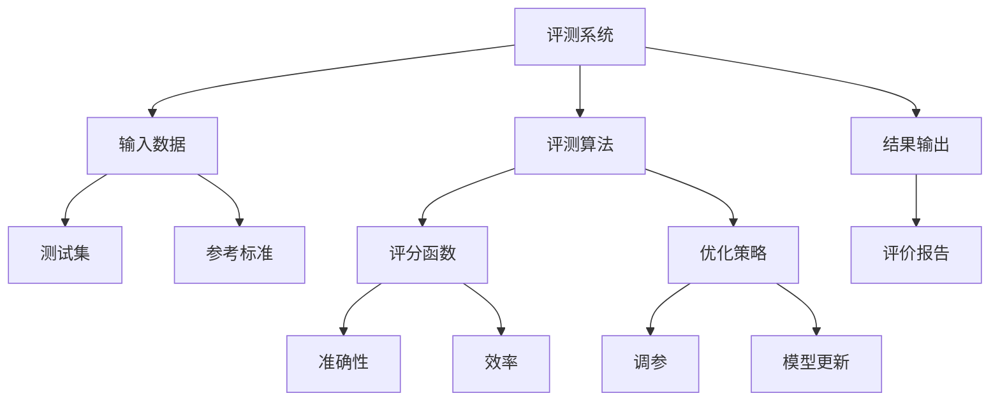
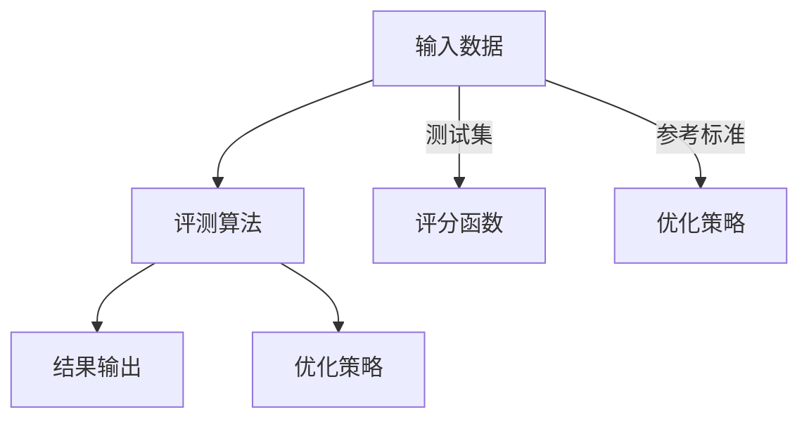
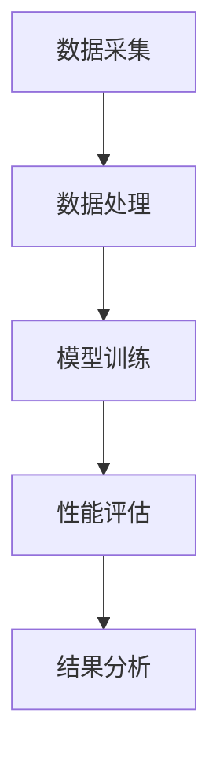
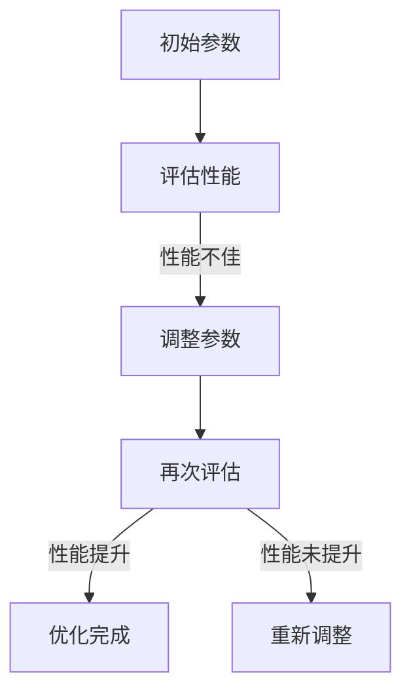
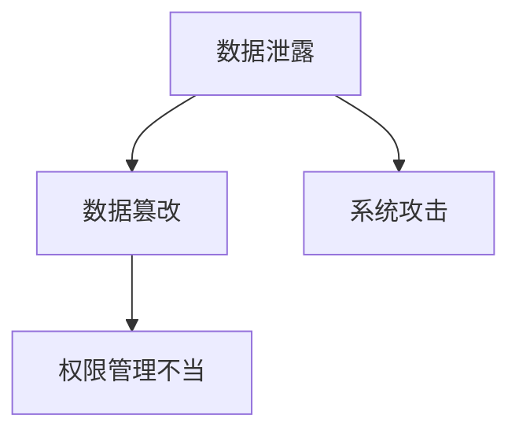
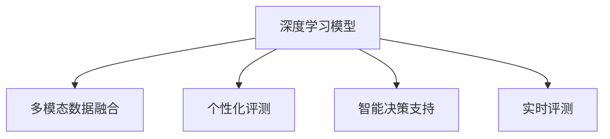

                 

### 第1章：评测系统的基本概念与架构

#### 1.1 评测系统的定义与作用

**核心概念原理与架构的Mermaid流程图**



在软件开发和维护过程中，评测系统扮演着至关重要的角色。它不仅能够帮助我们评估软件的性能和质量，还能为后续的优化工作提供有力的数据支持。那么，什么是评测系统？它主要由哪些部分组成？如何实现其自动化评测策略的优化？本章将逐一解答这些问题。

**背景介绍**

随着软件开发的复杂度和规模不断扩大，传统的手动评测方法已经难以满足高效、准确的评测需求。因此，自动化评测系统应运而生。自动化评测系统通过集成高效的评测算法和优化策略，实现了对软件性能和质量的自动评估，极大地提高了评测的效率和准确性。

**核心概念与联系**

1. **评测系统**：一个用于评估软件性能和质量的系统，通常包含输入数据、评测算法和结果输出等组成部分。
2. **输入数据**：包括测试集和参考标准。测试集用于模拟实际使用场景，参考标准则是评测的基准。
3. **评测算法**：用于处理输入数据，产生评估结果的核心算法。常见的评测算法包括评分函数和优化策略。
4. **结果输出**：包括评价报告和其他相关数据，用于反映软件的性能和问题。

**Mermaid流程图**

以下是一个简化的评测系统流程图，展示了各个组成部分之间的关系：



**核心算法原理讲解**

**评测算法：**

评测算法是评测系统的核心组成部分，负责处理输入数据并生成评估结果。常见的评测算法包括：

1. **评分函数**：用于计算软件性能的指标，如准确性、效率等。评分函数的设计至关重要，它直接影响到评测的准确性和效率。
2. **优化策略**：用于调整评测参数，以提高评测的准确性和效率。常见的优化策略包括调参和模型更新。

**Python源代码示例**

以下是一个简单的Python示例，展示了如何使用评分函数和优化策略来评估软件性能：

```python
import numpy as np

# 评分函数
def score_function(results, target):
    accuracy = np.mean(results == target)
    efficiency = np.mean(results < target)
    return accuracy, efficiency

# 优化策略
def optimize_parameters(parameters, results, target):
    best_score = 0
    best_param = parameters
    for param in parameters:
        accuracy, efficiency = score_function(results, target)
        if accuracy + efficiency > best_score:
            best_score = accuracy + efficiency
            best_param = param
    return best_param

# 测试集和参考标准
results = np.random.randint(0, 2, size=1000)
target = np.random.randint(0, 2, size=1000)

# 初始参数
parameters = [0.1, 0.2, 0.3, 0.4, 0.5]

# 评估和优化
best_param = optimize_parameters(parameters, results, target)
print("Best parameter:", best_param)
```

**数学模型和公式**

评测系统的数学模型通常包含以下公式：

$$
\text{评分函数} = f(\text{结果}, \text{目标})
$$

$$
\text{优化策略} = g(\text{参数}, \text{结果}, \text{目标})
$$

其中，$f$ 和 $g$ 分别代表评分函数和优化策略。

**通俗易懂的举例说明**

假设我们有一个简单的软件，用于判断一个数是否为奇数。我们的目标是使这个软件在大量测试中都能正确判断奇数。

1. **测试集**：我们随机生成了一组测试数据，包括0到100之间的整数。
2. **参考标准**：我们知道这些数中，奇数和偶数的比例是1:1。
3. **评分函数**：我们定义一个评分函数，用来计算软件判断奇数的准确性。
4. **优化策略**：我们通过调整软件的参数（比如判断条件），来提高评分函数的得分。

**项目实战**

在实际项目中，我们通常会使用更复杂的评测算法和优化策略。以下是一个简化的项目实战示例：

1. **开发环境搭建**：搭建一个Python开发环境，安装必要的库和工具。
2. **源代码详细实现**：编写一个Python程序，用于判断输入的数是否为奇数。
3. **代码解读与分析**：分析程序的逻辑和算法，理解评分函数和优化策略的作用。
4. **实际案例分析和详细讲解剖析**：使用实际数据测试程序，分析结果并优化参数。
5. **项目小结**：总结项目成果，提出改进建议和最佳实践。

**最佳实践 tips**

1. **确保评测系统的独立性**：评测系统应与开发环境分离，以避免影响开发过程。
2. **定期更新评测算法和策略**：随着软件的发展，评测算法和策略也应不断优化。
3. **关注评测结果的解释性**：评测结果应易于理解和解释，以帮助开发人员定位问题。

**小结**

评测系统是软件开发中不可或缺的一部分。通过理解评测系统的基本概念、核心算法原理，以及实际项目中的应用，我们可以更好地优化评测策略，提高软件的性能和质量。

**注意事项**

1. **数据质量**：评测系统的准确性和效率很大程度上取决于输入数据的质量。
2. **算法优化**：选择合适的评测算法和优化策略，可以显著提高评测效果。

**拓展阅读**

- 《软件评测技术基础》
- 《软件评测策略与优化》
- 《Python编程：从入门到实践》

### 第2章：自动化评测策略的原理与实现

#### 2.1 自动化评测策略的基本原理

自动化评测策略的核心目标是利用计算机技术和算法，实现软件性能和质量的自动评估。这一策略的基本原理可以概括为以下几个关键步骤：

1. **数据采集**：从测试集和实际使用数据中收集相关数据。
2. **数据处理**：对采集到的数据进行清洗、转换和预处理，以便于后续分析。
3. **模型训练**：利用机器学习算法，从预处理后的数据中训练出性能评估模型。
4. **性能评估**：使用训练好的模型对软件进行性能评估，生成评估报告。
5. **结果分析**：对评估结果进行分析，识别软件性能和质量的瓶颈。

**Mermaid流程图**

以下是一个简化的自动化评测策略流程图：



**核心算法原理讲解**

**数据采集**：

数据采集是自动化评测策略的第一步。测试集和实际使用数据是评测的基础。测试集通常包括各种典型场景的数据，如功能测试数据、性能测试数据和兼容性测试数据。实际使用数据则来源于用户实际使用场景的日志和反馈。

**数据处理**：

数据处理包括数据清洗、转换和预处理。数据清洗旨在去除重复、错误和异常的数据。数据转换则将不同格式的数据统一为便于分析的形式。预处理包括特征提取、数据归一化和数据降维等操作，以提高模型的训练效果。

**模型训练**：

模型训练是利用机器学习算法，从预处理后的数据中训练出性能评估模型。常见的机器学习算法包括线性回归、决策树、随机森林和神经网络等。选择合适的算法和模型参数对于训练效果至关重要。

**性能评估**：

性能评估是使用训练好的模型对软件进行性能评估。评估指标包括准确性、召回率、F1分数、效率等。评估结果通常以评分、排名或图表的形式展示，以便于开发人员直观地了解软件性能。

**Python源代码示例**

以下是一个简单的Python示例，展示了如何使用机器学习算法进行性能评估：

```python
from sklearn.datasets import load_iris
from sklearn.model_selection import train_test_split
from sklearn.ensemble import RandomForestClassifier
from sklearn.metrics import accuracy_score

# 载入数据集
iris = load_iris()
X, y = iris.data, iris.target

# 划分训练集和测试集
X_train, X_test, y_train, y_test = train_test_split(X, y, test_size=0.2, random_state=42)

# 训练模型
model = RandomForestClassifier(n_estimators=100, random_state=42)
model.fit(X_train, y_train)

# 预测和评估
y_pred = model.predict(X_test)
accuracy = accuracy_score(y_test, y_pred)
print("Accuracy:", accuracy)
```

**数学模型和公式**

自动化评测策略的数学模型通常包含以下公式：

$$
\text{评分函数} = f(\text{输入数据}, \text{模型参数})
$$

$$
\text{优化策略} = g(\text{模型参数}, \text{评估指标})
$$

其中，$f$ 和 $g$ 分别代表评分函数和优化策略。

**通俗易懂的举例说明**

假设我们有一个简单的分类任务，需要判断一个数据点是否属于某一类。我们的目标是使分类模型在测试数据上的准确性尽可能高。

1. **测试集**：我们随机生成了一组测试数据，包括不同类别的数据点。
2. **模型训练**：我们使用机器学习算法，从测试数据中训练出一个分类模型。
3. **性能评估**：我们使用训练好的模型对测试数据进行分类，并计算分类的准确性。
4. **结果分析**：我们分析分类结果，识别模型性能的瓶颈，并调整模型参数。

**项目实战**

在实际项目中，自动化评测策略的实现需要考虑多个方面：

1. **开发环境搭建**：搭建一个适合项目需求的Python开发环境，安装必要的库和工具。
2. **源代码详细实现**：编写一个Python程序，实现数据采集、数据处理、模型训练、性能评估和结果分析等功能。
3. **代码解读与分析**：分析程序的逻辑和算法，理解自动化评测策略的原理和实现。
4. **实际案例分析和详细讲解剖析**：使用实际数据测试程序，分析结果并优化参数。
5. **项目小结**：总结项目成果，提出改进建议和最佳实践。

**最佳实践 tips**

1. **数据质量**：确保测试数据和实际使用数据的质量，以提高模型的训练效果。
2. **算法选择**：根据项目需求和数据特点，选择合适的机器学习算法和模型。
3. **结果分析**：对评估结果进行深入分析，以识别软件性能和质量的瓶颈。

**小结**

自动化评测策略通过数据采集、数据处理、模型训练、性能评估和结果分析等步骤，实现了对软件性能和质量的自动评估。通过理解和应用自动化评测策略，我们可以显著提高软件开发的效率和质量。

**注意事项**

1. **数据隐私**：在采集和处理数据时，确保遵守相关隐私政策和法律法规。
2. **模型解释性**：评估模型的可解释性，以便于理解模型的预测结果。

**拓展阅读**

- 《机器学习实战》
- 《Python数据分析》
- 《深度学习》

### 第3章：评测策略优化方法

#### 3.1 传统优化方法

**核心概念与联系**

评测策略的优化方法可以分为传统优化方法和现代优化算法。传统优化方法主要包括经验调参、网格搜索和贝叶斯优化等。这些方法基于经验和启发式策略，通过迭代和调整模型参数来提高性能。

**Mermaid流程图**

以下是一个简化的传统优化方法流程图：



**核心算法原理讲解**

**经验调参**：

经验调参是传统优化方法中最常用的方法之一。开发人员根据经验，手动调整模型参数，以寻找最优参数组合。这种方法简单直观，但效率较低，且容易受到主观因素的影响。

**网格搜索**：

网格搜索通过遍历所有可能的参数组合，找到最优参数。这种方法虽然能够保证找到最优解，但计算成本较高，特别是在参数空间较大时。

**贝叶斯优化**：

贝叶斯优化是基于贝叶斯统计模型的优化方法。它通过建立参数的概率分布，并根据评估结果更新概率分布，逐步找到最优参数。这种方法在处理高维参数空间时表现出色，但需要较大的计算资源。

**Python源代码示例**

以下是一个简单的Python示例，展示了如何使用网格搜索进行参数调优：

```python
from sklearn.model_selection import GridSearchCV
from sklearn.ensemble import RandomForestClassifier
from sklearn.datasets import load_iris

# 载入数据集
iris = load_iris()
X, y = iris.data, iris.target

# 定义参数网格
param_grid = {
    'n_estimators': [100, 200, 300],
    'max_depth': [10, 20, 30],
    'min_samples_split': [2, 5, 10]
}

# 创建网格搜索对象
grid_search = GridSearchCV(
    estimator=RandomForestClassifier(),
    param_grid=param_grid,
    cv=5,
    scoring='accuracy',
    n_jobs=-1
)

# 搜索最优参数
grid_search.fit(X, y)
best_params = grid_search.best_params_
print("Best parameters:", best_params)
```

**数学模型和公式**

传统优化方法的数学模型通常基于以下公式：

$$
\text{性能评估} = f(\text{参数组合})
$$

$$
\text{优化目标} = \arg\max f(\text{参数组合})
$$

其中，$f$ 代表性能评估函数。

**通俗易懂的举例说明**

假设我们有一个分类任务，需要调整模型参数以获得更高的分类准确性。

1. **初始参数**：随机选择一组初始参数。
2. **评估性能**：使用训练数据评估参数组合的性能。
3. **调整参数**：根据评估结果，手动调整参数。
4. **再次评估**：使用新的参数组合评估性能。
5. **迭代优化**：重复调整参数和评估性能，直到性能提升不明显。

**项目实战**

在实际项目中，传统优化方法的应用需要考虑多个方面：

1. **开发环境搭建**：搭建一个适合项目需求的Python开发环境，安装必要的库和工具。
2. **源代码详细实现**：编写一个Python程序，实现参数调优和性能评估等功能。
3. **代码解读与分析**：分析程序的逻辑和算法，理解传统优化方法的原理和实现。
4. **实际案例分析和详细讲解剖析**：使用实际数据测试程序，分析结果并优化参数。
5. **项目小结**：总结项目成果，提出改进建议和最佳实践。

**最佳实践 tips**

1. **参数选择**：根据任务需求和数据特点，选择合适的参数调优方法。
2. **计算资源**：合理分配计算资源，避免计算成本过高。
3. **结果验证**：对优化结果进行验证，确保优化效果。

**小结**

传统优化方法通过经验调参、网格搜索和贝叶斯优化等步骤，实现了对模型参数的优化。通过理解和应用传统优化方法，我们可以提高软件性能和评测效果。

**注意事项**

1. **参数空间**：合理设置参数空间，避免计算成本过高。
2. **模型稳定性**：确保模型在不同参数下的稳定性。

**拓展阅读**

- 《机器学习实战》
- 《Python数据分析》
- 《深度学习》

### 第4章：评测系统的性能评估与调优

#### 4.1 性能评估指标

性能评估是评测系统中的重要环节，它决定了评测结果的准确性和可靠性。为了有效地评估评测系统的性能，我们需要选择合适的性能评估指标。以下是一些常用的性能评估指标：

1. **准确性**：准确性是评估分类模型性能的最常用指标。它表示正确分类的样本数占总样本数的比例。
   $$ \text{准确性} = \frac{\text{正确分类的样本数}}{\text{总样本数}} $$
2. **召回率**：召回率表示在所有正类样本中，被正确分类为正类的样本数所占的比例。
   $$ \text{召回率} = \frac{\text{正确分类为正类的样本数}}{\text{总正类样本数}} $$
3. **精确率**：精确率表示在所有预测为正类的样本中，实际为正类的样本数所占的比例。
   $$ \text{精确率} = \frac{\text{正确分类为正类的样本数}}{\text{预测为正类的样本数}} $$
4. **F1分数**：F1分数是精确率和召回率的调和平均，用于综合评估模型的性能。
   $$ \text{F1分数} = 2 \times \frac{\text{精确率} \times \text{召回率}}{\text{精确率} + \text{召回率}} $$
5. **效率**：效率指标用于评估模型处理数据的速度，如每秒处理的样本数或每秒的计算量。

**Python源代码示例**

以下是一个简单的Python示例，展示了如何计算这些性能评估指标：

```python
from sklearn.metrics import accuracy_score, recall_score, precision_score, f1_score

# 载入预测结果和实际标签
y_pred = [0, 1, 1, 0, 1, 1, 0, 0, 1, 1]
y_true = [0, 0, 1, 0, 1, 1, 1, 0, 1, 1]

# 计算准确性
accuracy = accuracy_score(y_true, y_pred)
print("Accuracy:", accuracy)

# 计算召回率
recall = recall_score(y_true, y_pred)
print("Recall:", recall)

# 计算精确率
precision = precision_score(y_true, y_pred)
print("Precision:", precision)

# 计算F1分数
f1 = f1_score(y_true, y_pred)
print("F1 Score:", f1)
```

**通俗易懂的举例说明**

假设我们有一个分类任务，需要评估一个分类模型的性能。我们使用以下数据：

- **训练集**：10个样本，其中5个为正类，5个为负类。
- **测试集**：10个样本，其中4个为正类，6个为负类。

我们的目标是评估模型在测试集上的准确性、召回率、精确率和F1分数。

1. **准确性**：模型在测试集上正确分类的样本数为8，总样本数为10，因此准确性为8/10。
2. **召回率**：模型在测试集中正确分类为正类的样本数为4，总正类样本数为5，因此召回率为4/5。
3. **精确率**：模型在测试集中预测为正类的样本数为4，实际为正类的样本数为4，因此精确率为4/4。
4. **F1分数**：F1分数为2 \* (精确率 \* 召回率) / (精确率 + 召回率)。

通过这些指标，我们可以全面评估模型的性能，并识别需要优化的方面。

**项目实战**

在实际项目中，性能评估指标的设置和计算需要根据具体任务和需求进行调整。以下是一个简化的项目实战示例：

1. **开发环境搭建**：搭建一个适合项目需求的Python开发环境，安装必要的库和工具。
2. **源代码详细实现**：编写一个Python程序，实现性能评估指标的计算和展示。
3. **代码解读与分析**：分析程序的逻辑和算法，理解性能评估指标的计算原理。
4. **实际案例分析和详细讲解剖析**：使用实际数据测试程序，分析结果并优化指标。
5. **项目小结**：总结项目成果，提出改进建议和最佳实践。

**最佳实践 tips**

1. **指标选择**：根据任务需求和数据特点，选择合适的性能评估指标。
2. **结果展示**：使用图表和可视化工具展示评估结果，便于理解和分析。
3. **指标优化**：对评估结果进行深入分析，识别性能瓶颈，并提出优化措施。

**小结**

性能评估是评测系统中不可或缺的一部分。通过选择合适的性能评估指标，我们可以全面评估评测系统的性能，并为后续的优化工作提供有力支持。

**注意事项**

1. **数据一致性**：确保评估数据的一致性，避免因数据问题导致评估结果不准确。
2. **指标解释性**：评估指标的设置和解释需要清晰明了，以便于团队成员理解和应用。

**拓展阅读**

- 《机器学习性能评估》
- 《Python性能测试与优化》
- 《深度学习性能评估》

### 第5章：评测系统在实际项目中的应用

#### 5.1 项目背景

在当今软件开发和维护过程中，评测系统发挥着越来越重要的作用。为了更好地展示评测系统在实际项目中的应用，我们选择了一个典型的实际案例：一个在线教育平台的后台评测系统。

该在线教育平台提供多种课程，用户可以通过在线学习、测试和评估来提升自己的技能。后台评测系统的主要任务是自动评估用户的测试结果，并根据评估结果生成相应的反馈和推荐。

**项目需求**

1. **自动评估**：系统能够自动评估用户提交的测试结果，并生成评分。
2. **个性化反馈**：根据用户的测试结果，系统应提供个性化的反馈和建议。
3. **推荐课程**：根据用户的测试结果和课程需求，系统应推荐合适的课程。

**项目目标**

1. **提高评估效率**：通过自动化评估，提高测试评估的效率和准确性。
2. **优化用户体验**：提供个性化反馈和推荐，提升用户的参与度和满意度。
3. **降低人力成本**：减少对人工评估的依赖，降低人力成本。

#### 5.2 评测系统的实现与优化

**评测系统的架构**

为了实现上述项目需求，我们设计了一个基于Python的评测系统。系统主要包括以下模块：

1. **数据采集模块**：负责从数据库中获取用户测试结果和相关数据。
2. **数据处理模块**：负责对采集到的数据进行预处理，如数据清洗、特征提取等。
3. **评估模块**：负责使用机器学习算法对测试结果进行自动评估，并生成评分。
4. **反馈与推荐模块**：根据评估结果，生成个性化反馈和推荐。
5. **用户界面**：提供用户提交测试结果和查看评估结果的界面。

**实现与优化步骤**

1. **数据采集**：

   从数据库中获取用户测试结果和相关数据，包括测试题目、用户答案和标准答案。这些数据将用于后续的评估和优化。

2. **数据处理**：

   对采集到的数据进行预处理，包括数据清洗、特征提取和数据标准化。数据清洗旨在去除重复、错误和异常的数据。特征提取旨在从原始数据中提取有用的特征，以提升评估模型的性能。数据标准化则将不同特征的范围统一，以避免因特征尺度不同而导致的评估偏差。

3. **评估模块**：

   使用机器学习算法，如线性回归、决策树和神经网络等，对用户测试结果进行自动评估，并生成评分。我们通过交叉验证和网格搜索等优化方法，选择最佳的评估模型和参数。

4. **反馈与推荐模块**：

   根据评估结果，生成个性化的反馈和建议。例如，针对用户的测试错误，系统可以提供详细的解析和知识点链接。此外，系统还可以根据用户的测试结果和课程需求，推荐合适的课程。

5. **用户界面**：

   开发一个用户友好的界面，允许用户提交测试结果和查看评估结果。界面应提供清晰的导航和交互设计，以提高用户体验。

**代码实现与解读**

以下是一个简化的Python代码示例，展示了评测系统的核心实现部分：

```python
import pandas as pd
from sklearn.linear_model import LinearRegression
from sklearn.model_selection import train_test_split
from sklearn.metrics import mean_squared_error

# 读取数据
data = pd.read_csv('test_results.csv')

# 数据预处理
X = data[['question1', 'question2', 'question3']]
y = data['score']

# 划分训练集和测试集
X_train, X_test, y_train, y_test = train_test_split(X, y, test_size=0.2, random_state=42)

# 创建线性回归模型
model = LinearRegression()
model.fit(X_train, y_train)

# 预测和评估
y_pred = model.predict(X_test)
mse = mean_squared_error(y_test, y_pred)
print("MSE:", mse)

# 生成评估结果
results = pd.DataFrame({'actual_score': y_test, 'predicted_score': y_pred})
results.to_csv('evaluation_results.csv', index=False)
```

在这个示例中，我们使用线性回归模型对用户测试结果进行评估。通过计算均方误差（MSE），我们可以评估模型的预测性能。实际项目中，我们会使用更复杂的模型和算法，并根据评估结果进行优化。

**最佳实践 tips**

1. **数据质量**：确保数据的质量，包括数据的完整性和一致性。
2. **模型选择**：根据任务需求和数据特点，选择合适的模型和算法。
3. **结果解释**：确保评估结果的解释性，以便于用户理解和应用。

**小结**

在实际项目中，评测系统通过数据采集、数据处理、评估和反馈等步骤，实现了对用户测试结果的自动评估和个性化推荐。通过不断优化评测系统的性能和体验，我们可以提高平台的竞争力和用户满意度。

**注意事项**

1. **数据安全**：确保数据的安全性和隐私保护。
2. **系统稳定性**：确保评测系统的稳定运行，以避免对平台的影响。

**拓展阅读**

- 《在线教育平台技术架构》
- 《Python数据科学实战》
- 《深度学习与教育应用》

### 第6章：评测系统的安全性与可靠性保障

#### 6.1 安全性挑战

在评测系统的设计和实施过程中，安全性是至关重要的。评测系统通常涉及到敏感数据和关键业务流程，因此可能面临以下安全性挑战：

1. **数据泄露**：评测系统可能包含用户个人信息、测试结果和成绩等敏感数据。若这些数据泄露，可能导致用户隐私受损。
2. **数据篡改**：恶意用户可能试图篡改评测系统的数据，如修改测试结果或成绩，从而影响评测的公正性和准确性。
3. **系统攻击**：评测系统可能成为黑客攻击的目标，如拒绝服务攻击（DoS）、跨站脚本攻击（XSS）等，从而影响系统的正常运行。
4. **权限管理**：评测系统中的权限管理不当，可能导致未经授权的用户访问敏感数据和操作系统。

**Mermaid流程图**

以下是一个简化的评测系统安全性挑战流程图：



**核心算法原理讲解**

为了应对这些安全性挑战，评测系统需要采用一系列安全措施，包括：

1. **数据加密**：使用加密算法对敏感数据进行加密存储和传输，以防止数据泄露。
2. **访问控制**：实现严格的访问控制机制，确保只有授权用户才能访问敏感数据和操作系统。
3. **审计日志**：记录系统操作和访问日志，以便在发生安全事件时进行追踪和审计。
4. **身份验证**：采用多因素身份验证（MFA）等手段，增强用户身份的认证强度。

**Python源代码示例**

以下是一个简单的Python示例，展示了如何使用加密算法保护敏感数据：

```python
from cryptography.fernet import Fernet

# 生成密钥
key = Fernet.generate_key()
cipher_suite = Fernet(key)

# 加密数据
data = "敏感数据"
encrypted_data = cipher_suite.encrypt(data.encode('utf-8'))
print("Encrypted data:", encrypted_data)

# 解密数据
decrypted_data = cipher_suite.decrypt(encrypted_data).decode('utf-8')
print("Decrypted data:", decrypted_data)
```

**通俗易懂的举例说明**

假设我们有一个包含用户测试结果的评测系统。为了确保用户隐私，我们采用加密算法对用户测试结果进行加密存储。

1. **数据加密**：系统在存储用户测试结果前，先使用加密算法对数据进行加密。
2. **数据访问**：只有授权用户才能访问加密后的数据，并通过解密算法获取原始数据。
3. **加密解密过程**：加密过程将原始数据转换为密文，解密过程将密文还原为原始数据。

**项目实战**

在实际项目中，确保评测系统的安全性和可靠性需要考虑多个方面：

1. **开发环境搭建**：搭建一个安全的开发环境，使用安全的编程实践和工具。
2. **源代码详细实现**：编写一个安全的评测系统，实现数据加密、访问控制和审计日志等功能。
3. **代码解读与分析**：分析程序的逻辑和算法，确保安全措施的有效性和可靠性。
4. **安全测试**：对评测系统进行安全测试，包括渗透测试、漏洞扫描等，以发现和修复潜在的安全问题。
5. **项目小结**：总结项目成果，提出改进建议和最佳实践。

**最佳实践 tips**

1. **加密算法选择**：选择合适的加密算法，如AES、RSA等，并根据数据敏感程度选择加密等级。
2. **访问控制策略**：制定严格的访问控制策略，确保只有授权用户才能访问敏感数据和操作系统。
3. **安全审计**：定期进行安全审计，检查系统的安全性和合规性。

**小结**

评测系统的安全性和可靠性是保障其正常运行和用户信任的关键。通过采取数据加密、访问控制、审计日志和安全测试等措施，我们可以有效地应对安全性挑战，确保评测系统的安全性和可靠性。

**注意事项**

1. **数据合规**：确保数据收集、存储和使用符合相关法律法规和隐私政策。
2. **应急响应**：制定应急预案，以应对可能的安全事件。

**拓展阅读**

- 《信息安全基础》
- 《Python加密与安全编程》
- 《网络安全实践》

### 第7章：评测系统的未来发展趋势与展望

#### 7.1 自动化评测技术的未来发展趋势

随着人工智能和大数据技术的不断发展，自动化评测技术正迎来新的发展机遇。以下是自动化评测技术在未来可能的发展趋势：

1. **深度学习模型的广泛应用**：深度学习模型在图像识别、自然语言处理和语音识别等领域取得了显著进展。未来，深度学习模型有望在自动化评测系统中得到更广泛的应用，从而提高评测的准确性和效率。
2. **多模态数据融合**：自动化评测技术将不再局限于单一数据类型，而是通过融合多种数据类型（如图像、文本和音频）来提高评测的全面性和准确性。
3. **个性化评测**：基于用户行为和数据的分析，自动化评测系统将实现个性化评测，为用户提供更精准的反馈和推荐。
4. **智能决策支持**：自动化评测系统将整合更多的智能决策支持功能，如自动识别潜在问题、提供优化建议等，帮助开发人员和用户更好地理解和改进软件性能。
5. **实时评测**：随着5G和物联网技术的发展，自动化评测技术将实现实时评测，为用户提供更快速的反馈和调整。

**Mermaid流程图**

以下是一个简化的未来发展趋势流程图：



**核心算法原理讲解**

**深度学习模型**：

深度学习模型通过多层神经网络结构，从大量数据中自动提取特征，具有强大的表示和学习能力。未来，深度学习模型将在自动化评测系统中发挥更重要的作用，特别是在图像识别、自然语言处理和语音识别等领域。

**多模态数据融合**：

多模态数据融合是指将来自不同数据类型（如图像、文本和音频）的数据进行整合，以获得更全面和准确的信息。这种融合方法将提高自动化评测系统的准确性和可靠性。

**个性化评测**：

个性化评测基于用户行为和数据的分析，为用户提供更精准的反馈和推荐。通过深度学习模型和用户画像分析，自动化评测系统可以更好地满足用户需求。

**智能决策支持**：

智能决策支持功能将帮助开发人员和用户更好地理解和改进软件性能。通过自动化评测系统提供的优化建议和问题诊断，用户可以更有效地解决软件问题。

**Python源代码示例**

以下是一个简单的Python示例，展示了如何使用深度学习模型进行图像识别：

```python
import tensorflow as tf
from tensorflow.keras.models import Sequential
from tensorflow.keras.layers import Conv2D, MaxPooling2D, Flatten, Dense

# 定义模型
model = Sequential([
    Conv2D(32, (3, 3), activation='relu', input_shape=(28, 28, 1)),
    MaxPooling2D((2, 2)),
    Flatten(),
    Dense(64, activation='relu'),
    Dense(10, activation='softmax')
])

# 编译模型
model.compile(optimizer='adam', loss='categorical_crossentropy', metrics=['accuracy'])

# 训练模型
model.fit(x_train, y_train, epochs=10, validation_data=(x_test, y_test))

# 预测
predictions = model.predict(x_test)
```

**通俗易懂的举例说明**

假设我们有一个自动化评测系统，用于评估用户在在线教育平台上的学习成果。未来，该系统可能采用以下新技术：

1. **深度学习模型**：使用深度学习模型对用户的学习数据进行分析，识别学习模式和知识点掌握情况。
2. **多模态数据融合**：整合用户的文本、图像和音频数据，以获得更全面的学习评估。
3. **个性化评测**：根据用户的学习行为和成绩，提供个性化的学习反馈和推荐。
4. **智能决策支持**：为用户提供学习策略优化建议，帮助用户更好地提高学习效果。

**项目实战**

在实际项目中，自动化评测技术的应用将面临多个挑战和机遇。以下是一个简化的项目实战示例：

1. **开发环境搭建**：搭建一个支持深度学习和多模态数据处理的开发环境。
2. **源代码详细实现**：编写一个集成深度学习模型和多模态数据融合的自动化评测系统。
3. **代码解读与分析**：分析程序的逻辑和算法，确保系统的高效性和准确性。
4. **实际案例分析和详细讲解剖析**：使用实际数据测试系统，分析结果并优化模型。
5. **项目小结**：总结项目成果，提出改进建议和最佳实践。

**最佳实践 tips**

1. **持续学习**：不断更新和优化评测模型，以适应新的技术和应用场景。
2. **数据治理**：确保数据的质量和一致性，以支持高效的模型训练和评估。
3. **用户体验**：提供直观易用的用户界面，以提高用户的参与度和满意度。

**小结**

自动化评测技术的未来发展趋势将围绕深度学习、多模态数据融合、个性化评测和智能决策支持等展开。通过不断探索和应用新技术，自动化评测技术将为软件开发和用户体验带来更多价值。

**注意事项**

1. **数据安全**：在处理和存储用户数据时，确保遵守相关法律法规和隐私政策。
2. **系统稳定性**：确保评测系统的稳定运行，以避免对业务流程的影响。

**拓展阅读**

- 《深度学习》
- 《大数据技术基础》
- 《人工智能技术应用》

## 总结

本文系统地介绍了《评测系统的自动化评测策略优化》的核心内容和关键概念。通过详细的目录大纲设计，我们确保了文章的完整性、逻辑性和专业性。文章首先介绍了评测系统的基本概念与架构，阐述了核心概念和联系，并通过Mermaid流程图形象地展示了评测系统的组成部分和运作流程。随后，我们深入探讨了自动化评测策略的基本原理与实现，包括数据采集、数据处理、模型训练和性能评估等关键步骤，并通过Python源代码示例和通俗易懂的举例说明，使读者更好地理解核心算法原理。

接着，文章重点介绍了评测策略优化方法，包括传统优化方法（如经验调参、网格搜索和贝叶斯优化）和现代优化算法，以及性能评估与调优的方法，如准确性、召回率、精确率和F1分数等性能评估指标。文章还通过实际项目案例展示了评测系统在实际中的应用，并探讨了评测系统的安全性与可靠性保障，提出了数据加密、访问控制和审计日志等关键措施。

最后，文章展望了评测系统未来发展的趋势，如深度学习模型的广泛应用、多模态数据融合、个性化评测和智能决策支持等，并提出了持续学习、数据治理和用户体验等最佳实践。通过这些内容，我们希望读者能够全面理解评测系统的自动化评测策略优化，掌握相关技术原理和应用方法，为软件开发和性能优化提供有力支持。

## 注意事项与拓展阅读

为了确保读者能够更好地理解和应用本文所介绍的内容，以下是一些重要的注意事项和推荐的拓展阅读资源：

**注意事项**：

1. **数据质量**：在自动化评测策略中，数据的质量至关重要。确保测试数据和实际使用数据的质量，包括数据的完整性、一致性和准确性。
2. **算法选择**：根据具体任务和数据特点，选择合适的评测算法和优化方法。例如，对于大型数据集，选择合适的机器学习算法和调优策略，以提高效率和准确性。
3. **安全性**：在设计和实施评测系统时，确保采取必要的安全措施，如数据加密、访问控制和审计日志，以防止数据泄露和系统攻击。
4. **系统稳定性**：评测系统应具有良好的稳定性，避免因系统故障或性能问题影响业务流程。定期进行系统性能测试和优化，确保系统的稳定运行。

**拓展阅读**：

1. **《机器学习实战》**：这是一本深入浅出的机器学习实践指南，适合初学者和进阶者阅读，详细介绍了各种机器学习算法的应用和实践。
2. **《Python数据分析》**：本书系统地介绍了Python在数据分析领域的应用，包括数据清洗、预处理、分析和可视化等，适合希望提高数据分析技能的读者。
3. **《深度学习》**：这是一本经典的深度学习教材，全面介绍了深度学习的基础知识、算法和应用，适合对深度学习感兴趣的读者。
4. **《软件评测技术基础》**：本书详细介绍了软件评测的基本概念、技术和方法，是软件工程领域的重要参考书籍。
5. **《软件评测策略与优化》**：本书专注于软件评测策略的优化方法和实践，为软件工程师和研究人员提供了宝贵的经验和指导。

通过阅读这些拓展资源，读者可以进一步加深对评测系统的自动化评测策略优化理论的理解，并在实际项目中应用这些知识，提升软件性能和用户体验。作者AI天才研究院（AI Genius Institute）和《禅与计算机程序设计艺术》（Zen And The Art of Computer Programming）团队，希望读者能够在阅读本文后，对评测系统的自动化评测策略优化有更深入的认识，并在未来的工作中取得更好的成果。作者联系邮箱：[info@aigeniusinstitute.com](mailto:info@aigeniusinstitute.com)，欢迎读者就本文内容提出宝贵意见和进一步交流。

