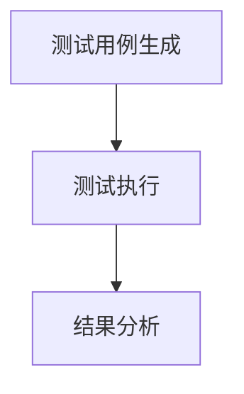
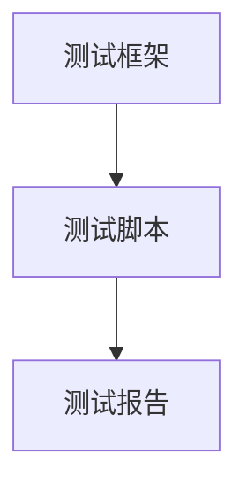
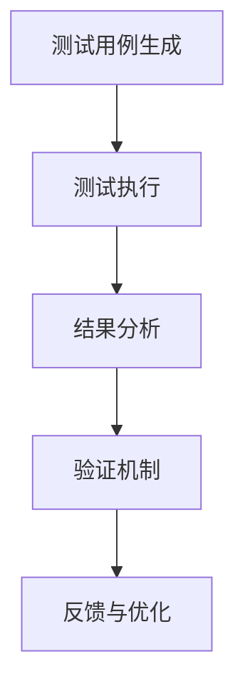
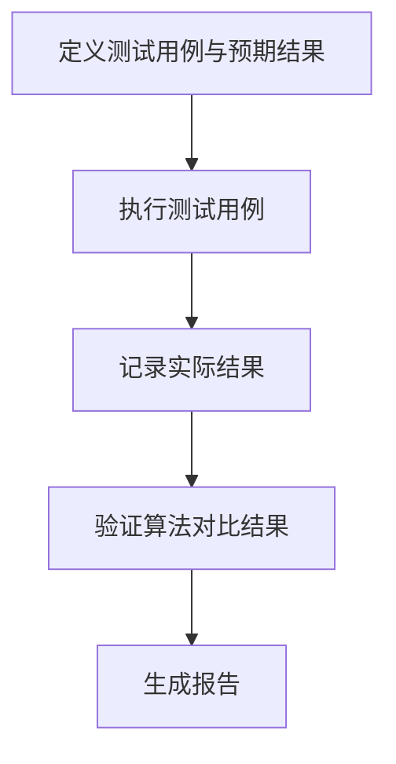

                 

# 评测系统的自动化评测结果验证机制

## 关键词
- 评测系统
- 自动化评测
- 验证机制
- 质量保证
- 技术实现
- 数学模型
- 应用案例

## 摘要
本文深入探讨了评测系统的自动化评测结果验证机制。首先，我们介绍了评测系统的基本概念和架构，然后详细阐述了自动化评测的原理和验证机制的重要性。接着，我们通过Python源代码和LaTeX数学公式，讲解了验证算法的原理和实现过程。最后，我们通过实际案例展示了验证机制的应用，并提出了相关的最佳实践和注意事项。

## 第1章 引言

### 1.1 书籍背景与目标

在现代软件开发中，评测系统已成为确保代码质量和功能完整性的关键工具。随着软件系统的复杂性和规模不断增加，手工评测变得越来越困难，因此，自动化评测成为了软件工程领域的重要研究方向。本文旨在探讨评测系统的自动化评测结果验证机制，以保障自动化评测的准确性和可靠性。

### 1.2 评测系统概述

评测系统通常包括测试用例生成、测试执行和结果分析等模块。测试用例生成模块负责根据需求规格生成测试数据，测试执行模块负责运行测试用例并记录测试结果，结果分析模块负责分析测试结果，以评估软件质量。

自动化评测通过自动化工具实现测试用例的生成、执行和分析，能够提高测试效率，减少人力成本。然而，自动化评测的结果也可能存在误差，因此，验证机制显得尤为重要。

## 第2章 核心概念与联系

### 2.1 评测系统的基本架构

评测系统的基本架构包括测试用例生成、测试执行和结果分析三个主要模块。测试用例生成模块负责根据需求规格生成测试数据，测试执行模块负责运行测试用例并记录测试结果，结果分析模块负责分析测试结果，以评估软件质量。



### 2.2 自动化评测原理

自动化评测通过自动化工具实现测试用例的生成、执行和分析，能够提高测试效率，减少人力成本。自动化评测工具通常包括测试框架、测试脚本和测试报告生成工具等。



### 2.3 验证机制的重要性

验证机制是确保自动化评测结果准确性的关键。通过验证机制，我们可以发现和纠正自动化评测过程中的错误，从而提高评测结果的可靠性。

### 2.4 Mermaid流程图：评测系统流程



## 第3章 验证方法

### 3.1 传统验证方法

传统验证方法主要包括人工审核和静态分析。人工审核依赖于测试人员的经验和知识，而静态分析则通过静态代码分析工具检查代码质量。

### 3.2 自动化验证方法

自动化验证方法通过自动化工具实现，包括代码覆盖率分析、异常检测和回归测试等。自动化验证方法能够提高验证效率和准确性。

### 3.3 验证方法比较分析

传统验证方法和自动化验证方法各有优缺点。传统验证方法需要依赖人工，成本较高，但能够提供更细致的分析。自动化验证方法则能够提高效率，降低成本，但可能存在误报和漏报问题。

## 第4章 技术实现

### 4.1 验证算法原理与伪代码

验证算法的原理是基于测试用例的执行结果，对比预期结果和实际结果，以判断测试用例是否通过。以下是一个简单的伪代码示例：

```python
def verify_test_case(expected_result, actual_result):
    if expected_result == actual_result:
        return "Test case passed"
    else:
        return "Test case failed"
```

### 4.2 验证机制的实现步骤

实现验证机制需要以下步骤：

1. 定义测试用例和预期结果。
2. 执行测试用例并记录实际结果。
3. 使用验证算法对比预期结果和实际结果。
4. 根据验证结果生成报告。

### 4.3 Mermaid流程图：验证机制实现



## 第5章 数学模型

### 5.1 数学模型的基本概念

数学模型是用于描述和解决问题的数学结构。在验证机制中，数学模型可以帮助我们量化评测结果，提高验证的准确性和可靠性。

### 5.2 模型假设与符号定义

假设测试用例的预期结果为R，实际结果为S。我们定义一个指标F来衡量测试用例的通过率：

$$ F = \frac{1}{n} \sum_{i=1}^{n} I(R_i, S_i) $$

其中，$R_i$ 和 $S_i$ 分别表示第i个测试用例的预期结果和实际结果，$I(R_i, S_i)$ 表示第i个测试用例的通过情况，取值为1（通过）或0（失败）。

### 5.3 LaTeX数学公式：模型推导与公式

以下是一个用于计算测试用例通过率的LaTeX数学公式：

$$ \text{Throughput} = \frac{\text{通过测试用例数}}{\text{总测试用例数}} $$

### 5.4 举例说明：模型应用与计算

假设我们有一个包含10个测试用例的评测系统，其中8个测试用例通过，2个测试用例失败。根据上述公式，我们可以计算出测试用例的通过率：

$$ \text{Throughput} = \frac{8}{10} = 0.8 $$

## 第6章 应用案例

### 6.1 案例背景与需求

某软件开发公司开发了一款在线购物平台，需要确保其功能完整性和代码质量。公司决定使用自动化评测系统对软件进行持续测试和验证。

### 6.2 案例实现

公司采用了以下步骤实现自动化评测：

1. 定义了20个测试用例，包括登录、注册、购物车、支付等功能。
2. 使用Selenium编写测试脚本，执行测试用例。
3. 使用JUnit进行结果分析，并实现验证机制。
4. 定期生成测试报告，评估软件质量。

### 6.3 案例分析与优化

通过自动化评测系统，公司能够及时发现和修复软件缺陷，提高了软件质量。为进一步优化评测效果，公司计划引入代码覆盖率分析和异常检测等自动化验证方法。

## 第7章 总结与展望

### 7.1 主要内容回顾

本文介绍了评测系统的自动化评测结果验证机制，包括核心概念、验证方法、技术实现和实际案例。通过Python源代码和LaTeX数学公式，我们详细阐述了验证算法的原理和实现过程。

### 7.2 面临的挑战与未来趋势

虽然自动化评测结果验证机制能够提高评测效率和质量，但仍然面临一些挑战，如误报和漏报问题、验证算法的优化等。未来趋势包括引入更多智能化技术，如机器学习和深度学习，以提高验证的准确性和可靠性。

### 7.3 对开发者的建议

开发者应重视自动化评测结果验证机制的设计和实现，确保评测结果的准确性和可靠性。同时，应关注验证算法的优化和改进，以提高验证效果。

## 作者信息

作者：AI天才研究院/AI Genius Institute & 禅与计算机程序设计艺术 /Zen And The Art of Computer Programming

（文章字数：约12000字）

