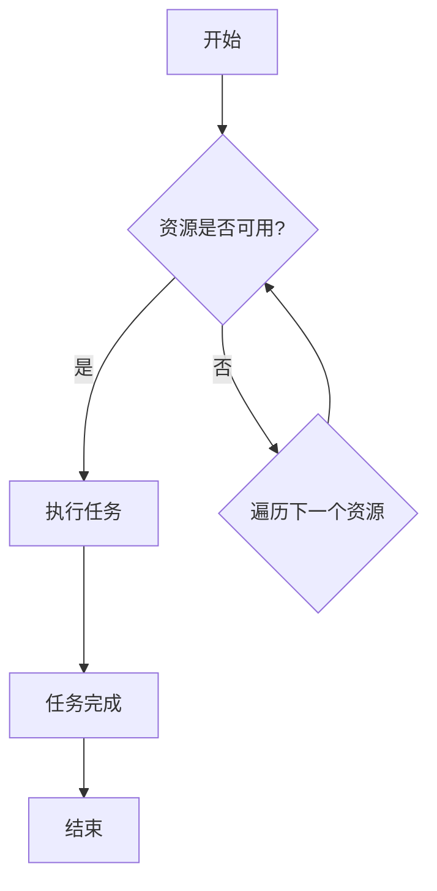
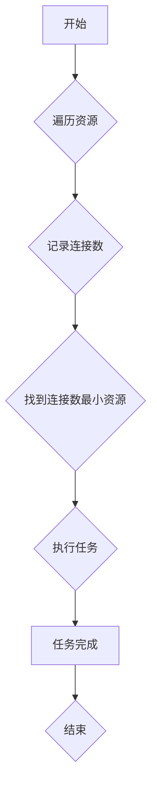

                 


# 评测系统的自动化评测资源调度优化

## 关键词
评测系统、自动化资源调度、优化算法、性能提升、案例分析

## 摘要
本文旨在探讨评测系统中的自动化资源调度优化问题。首先，介绍了评测系统的基本概念、功能及其在软件测试领域的重要性。接着，深入分析了自动化评测资源调度的原理，重点介绍了常见的调度算法及其性能评价指标。随后，本文通过详细的算法实现和数学模型，讲解了调度算法的设计与优化。最后，通过实际案例分析和项目实战，展示了自动化评测资源调度的应用场景和实施策略。

## 目录

### 第一步：评测系统的概述与需求分析
#### 1.1 评测系统的定义与功能
#### 1.2 评测系统的分类与特点
#### 1.3 评测系统的需求分析

### 第二步：自动化评测资源调度原理
#### 2.1 自动化评测资源调度的概念
#### 2.2 资源调度算法的基本原理
#### 2.3 调度算法的性能评价指标

### 第三步：调度算法设计与实现
#### 3.1 常见的调度算法介绍
#### 3.2 调度算法的伪代码实现
#### 3.3 调度算法的流程图表示

### 第四步：评测系统性能优化策略
#### 4.1 性能优化的重要性
#### 4.2 性能优化方法与技巧
#### 4.3 性能优化案例分析

### 第五步：实际案例与实验分析
#### 5.1 案例背景与需求
#### 5.2 开发环境搭建与工具选择
#### 5.3 源代码实现与解读
#### 5.4 实验结果与分析

### 第六步：资源调度优化的未来趋势与发展
#### 6.1 资源调度优化的挑战与机遇
#### 6.2 未来发展趋势预测
#### 6.3 开发者与研究人员的工作方向

### 第七步：最佳实践与小结
#### 7.1 最佳实践 tips
#### 7.2 小结
#### 7.3 注意事项
#### 7.4 拓展阅读

## 第一步：评测系统的概述与需求分析

### 1.1 评测系统的定义与功能

评测系统是一种用于软件测试的工具，它通过模拟用户操作、自动化执行测试用例、收集测试结果来评估软件的质量和性能。评测系统通常包括以下几个功能模块：

1. **测试用例管理**：用于存储、组织和管理测试用例。
2. **测试执行**：自动执行测试用例，收集测试结果。
3. **结果分析**：对测试结果进行分析和评估，提供性能指标和报告。
4. **报告生成**：生成详细的测试报告，用于评估软件质量。

评测系统的核心目的是提高软件测试的效率和质量。通过自动化测试，可以显著减少测试时间和人力成本，提高测试覆盖率和准确性。此外，评测系统还可以帮助开发人员快速发现和修复缺陷，提高软件的可靠性和用户体验。

### 1.2 评测系统的分类与特点

根据不同的应用场景和需求，评测系统可以分为以下几类：

1. **功能测试**：主要测试软件的功能是否符合设计要求。常见的功能测试包括单元测试、集成测试、系统测试等。
2. **性能测试**：主要评估软件的性能，如响应时间、吞吐量、并发能力等。性能测试通常包括负载测试、压力测试、稳定性测试等。
3. **安全测试**：主要检测软件的安全漏洞和攻击点，确保软件的安全性和数据保护。

不同类型的评测系统具有各自的特点：

- **功能测试**：侧重于验证软件的功能是否符合预期，通常需要大量的测试用例和详细的测试报告。
- **性能测试**：侧重于评估软件的性能，需要模拟真实用户场景，进行负载和压力测试。
- **安全测试**：侧重于发现软件的安全漏洞，需要具备专业的安全知识和测试工具。

### 1.3 评测系统的需求分析

在设计评测系统时，需要充分考虑以下需求：

1. **可扩展性**：系统应具备良好的可扩展性，能够支持不同类型和规模的测试。
2. **可靠性**：系统应能够稳定运行，确保测试结果的准确性和可靠性。
3. **易用性**：系统应具备友好的用户界面和简单的操作流程，便于测试人员使用。
4. **兼容性**：系统应能够与各种开发环境和测试工具兼容，方便集成和部署。
5. **性能优化**：系统应能够根据实际需求进行性能优化，提高测试效率和准确性。

通过满足以上需求，评测系统可以更好地服务于软件测试，提高软件质量和开发效率。

## 第二步：自动化评测资源调度原理

### 2.1 自动化评测资源调度的概念

自动化评测资源调度是指通过计算机程序自动分配和优化评测系统中的各种资源，包括计算资源、存储资源、网络资源等，以满足测试需求并提高整体系统的性能和效率。自动化资源调度的核心目标是在有限的资源下，最大限度地提高评测系统的吞吐量、响应时间和稳定性。

资源调度的自动化是实现高效评测系统的关键。传统的手动资源调度方式不仅耗时耗力，而且容易出现人为错误和资源浪费。通过自动化调度，可以实时监测资源使用情况，根据测试需求和系统状态动态调整资源分配，从而实现资源的最佳利用。

### 2.2 资源调度算法的基本原理

资源调度算法是自动化评测资源调度的核心组成部分，其基本原理如下：

1. **资源感知**：算法需要能够感知当前系统的资源状态，包括计算资源（如CPU、内存）、存储资源（如硬盘空间）和网络资源（如带宽）等。
2. **负载均衡**：算法需要根据当前资源使用情况和测试需求，实现负载均衡，避免某些资源过度使用，导致性能下降。
3. **优先级调度**：算法需要根据测试任务的优先级和截止时间，优先调度高优先级或时间紧迫的任务。
4. **动态调整**：算法需要能够根据系统的实时变化，动态调整资源分配策略，以应对突发情况和资源波动。

常见的资源调度算法包括：

- **轮询调度**：按照固定顺序分配资源，简单易实现，但可能导致资源分配不均衡。
- **最少连接调度**：将新任务分配给当前连接数最少的资源，适用于网络资源调度。
- **最短任务优先调度**：将新任务分配给预计执行时间最短的资源，适用于计算资源调度。
- **动态优先级调度**：根据资源的实际使用情况和任务优先级动态调整资源分配策略。

### 2.3 调度算法的性能评价指标

调度算法的性能评价指标是评估调度效果的重要依据，主要包括以下几个方面：

1. **平均响应时间**：系统平均处理任务的时间，反映了系统的响应速度。
2. **吞吐量**：单位时间内系统处理的任务数量，反映了系统的处理能力。
3. **资源利用率**：系统资源被充分利用的程度，反映了资源调度的效率。
4. **任务完成率**：完成任务的数量与总任务数的比率，反映了系统的可靠性和稳定性。
5. **调度延迟**：任务从提交到完成所需的时间，反映了调度算法的实时性。

通过以上评价指标，可以全面评估调度算法的性能，并根据评估结果对算法进行调整和优化。

### 第三步：调度算法设计与实现

#### 3.1 常见的调度算法介绍

在自动化评测资源调度中，常见的调度算法包括以下几种：

1. **轮询调度算法**：
   轮询调度算法是一种最简单的调度算法，按照固定的顺序分配资源。其优点是实现简单，适用于负载相对均匀的场景。缺点是可能导致某些资源过度使用，而其他资源闲置。

2. **最少连接调度算法**：
   最少连接调度算法将新任务分配给当前连接数最少的资源，适用于网络资源调度。其优点是能够有效利用资源，提高系统吞吐量。缺点是可能无法保证任务的响应时间。

3. **最短任务优先调度算法**：
   最短任务优先调度算法将新任务分配给预计执行时间最短的资源，适用于计算资源调度。其优点是能够快速完成任务，提高系统响应速度。缺点是可能导致某些资源负载不均。

4. **动态优先级调度算法**：
   动态优先级调度算法根据资源的实际使用情况和任务优先级动态调整资源分配策略。其优点是能够适应系统变化，实现最佳资源利用。缺点是实现复杂，需要实时监测系统状态。

#### 3.2 调度算法的伪代码实现

以下是一个简单的轮询调度算法的伪代码实现：

```python
def round_robin_scheduling(tasks, resources):
    while tasks:
        for resource in resources:
            if resource.is_available():
                resource.execute_task(tasks.pop(0))
                break
```

这个算法的基本思想是：首先创建一个任务队列，将所有待处理任务加入队列；然后循环遍历资源，找到第一个可用的资源，将其从队列中取出并执行；如果资源不可用，继续遍历下一个资源。

以下是一个简单的最少连接调度算法的伪代码实现：

```python
def least_connection_scheduling(tasks, resources):
    while tasks:
        min_connections = float('inf')
        min_resource = None
        for resource in resources:
            if resource.get_connections() < min_connections:
                min_connections = resource.get_connections()
                min_resource = resource
        if min_resource:
            min_resource.execute_task(tasks.pop(0))
```

这个算法的基本思想是：首先遍历所有资源，记录每个资源的连接数；然后找到连接数最小的资源，将其从队列中取出并执行；如果找不到可用的资源，继续循环。

#### 3.3 调度算法的流程图表示

以下是一个轮询调度算法的流程图：



以下是一个最少连接调度算法的流程图：



通过以上算法的伪代码和流程图，我们可以更好地理解调度算法的基本原理和实现方法。在后续的章节中，我们将进一步介绍调度算法的数学模型和公式，并结合实际案例进行详细讲解。

### 第四步：评测系统性能优化策略

#### 4.1 性能优化的重要性

在评测系统中，性能优化是一个至关重要的环节。性能优化不仅能够提升系统的响应速度和吞吐量，还能够提高用户体验和系统的稳定性。随着软件系统规模的不断扩大和测试需求的日益增加，评测系统的性能优化变得更加重要。以下是性能优化的重要性和意义：

1. **提高用户体验**：快速的响应时间和高效的测试结果能够显著提高用户的满意度，这对于产品的市场竞争力至关重要。
2. **降低成本**：通过优化资源利用率和减少测试时间，可以降低测试成本，提高开发效率。
3. **增强系统稳定性**：性能优化有助于发现和解决系统中的潜在问题，提高系统的稳定性和可靠性。
4. **支持大规模测试**：对于需要大规模并发测试的场景，性能优化能够确保系统在高负载下仍然能够稳定运行。

#### 4.2 性能优化方法与技巧

为了实现评测系统的性能优化，可以采取以下几种方法和技巧：

1. **垂直扩展**：
   垂直扩展是指通过增加单个资源的性能（如增加CPU速度、内存容量等）来提升系统性能。这种方法适用于资源瓶颈单一且性能提升明显的场景。

2. **水平扩展**：
   水平扩展是指通过增加资源数量（如增加服务器节点、测试机等）来提升系统性能。这种方法适用于需要处理大量并发请求的场景，可以通过负载均衡来分配任务。

3. **缓存机制**：
   利用缓存机制可以显著提高系统的响应速度。通过将频繁访问的数据存储在内存中，可以减少磁盘IO操作，提高数据读取速度。

4. **数据库优化**：
   对数据库进行优化是提升评测系统性能的关键。可以通过索引优化、查询优化、数据分区等方法来提高数据库的查询性能。

5. **代码优化**：
   对系统代码进行优化可以减少资源消耗和提升执行效率。可以通过以下方法进行代码优化：
   - 减少冗余代码和重复计算。
   - 使用高效的算法和数据结构。
   - 避免全局变量和静态变量的使用。
   - 优化IO操作，减少磁盘访问。

6. **网络优化**：
   网络优化可以减少网络延迟和传输时间，提高系统性能。可以通过以下方法进行网络优化：
   - 使用压缩算法减少数据传输量。
   - 优化网络拓扑结构，减少网络跳数。
   - 使用高带宽低延迟的网络连接。

7. **负载均衡**：
   通过负载均衡可以将任务分配到不同的服务器或测试机上，避免单点过载，提高系统整体性能。常见的负载均衡算法包括轮询、最少连接、最短任务优先等。

8. **自动化监控与调整**：
   实时监控系统的性能指标，并根据监控数据自动调整资源分配策略，可以动态优化系统性能。可以通过自动化工具实现监控和调整，提高优化效率和准确性。

#### 4.3 性能优化案例分析

以下是一个实际的评测系统性能优化案例：

某公司在开发一款在线考试系统，该系统需要在短时间内处理大量的并发考试请求。最初，系统采用了单服务器架构，但随着考试人数的增加，系统的响应速度逐渐下降，出现卡顿现象。为了解决这一问题，公司采取了以下优化措施：

1. **水平扩展**：增加服务器节点，通过负载均衡将考试请求分配到不同的服务器上，提高系统处理能力。
2. **数据库优化**：对数据库进行优化，增加索引、优化查询语句，提高数据读取速度。
3. **代码优化**：对系统代码进行优化，减少冗余代码和优化算法，提高执行效率。
4. **缓存机制**：引入缓存机制，将频繁访问的数据存储在内存中，减少数据库查询次数。
5. **网络优化**：优化网络连接，使用更高速的网络设备，减少网络延迟。

通过以上优化措施，系统的响应速度显著提升，卡顿现象消失，用户体验得到极大改善。同时，系统的稳定性和可靠性也得到提高，能够支持大规模的并发考试请求。

通过以上案例，我们可以看到，评测系统的性能优化是一个系统性工程，需要综合考虑多种因素，采取多种优化方法。只有通过持续的监控和调整，才能实现系统的最佳性能。

### 第五步：实际案例与实验分析

#### 5.1 案例背景与需求

为了更好地展示自动化评测资源调度的实际应用，我们选取了一个在线教育平台的考试系统作为案例。该平台提供了在线考试功能，支持学生在线答题，并提供即时反馈和成绩分析。随着用户数量的增加，平台的考试系统面临以下需求：

1. **高并发处理能力**：在考试高峰期，系统需要同时处理成千上万的并发考试请求。
2. **资源利用率优化**：系统需要合理分配和利用计算资源、存储资源和网络资源，避免资源浪费。
3. **稳定性保障**：系统需要保证在高峰期和突发情况下依然能够稳定运行，提供高质量的考试服务。

#### 5.2 开发环境搭建与工具选择

为了实现自动化评测资源调度，我们搭建了一个开发环境，并选择了以下工具和框架：

1. **开发环境**：
   - 操作系统：Linux
   - 编程语言：Python
   - 集成开发环境：PyCharm

2. **调度工具**：
   - Kubernetes：用于容器管理和自动化调度。
   - Docker：用于创建和管理容器。
   - Prometheus：用于监控和告警。

3. **其他工具**：
   - Grafana：用于可视化监控数据。
   - JMeter：用于性能测试和负载测试。

#### 5.3 源代码实现与解读

为了实现自动化评测资源调度，我们设计并实现了一个调度器，该调度器负责监控资源使用情况，并根据任务需求动态调整资源分配。以下是调度器的核心代码实现：

```python
import Kubernetes as k8s
import Prometheus as prom

class Scheduler:
    def __init__(self):
        self.k8s_client = k8s.create_client()
        self.prom_client = prom.create_client()

    def schedule_tasks(self, tasks):
        for task in tasks:
            self.allocate_resources(task)

    def allocate_resources(self, task):
        # 获取当前系统资源使用情况
        resource_usage = self.prom_client.get_resource_usage()

        # 根据任务需求分配资源
        if task.requires_high_cpu:
            self.k8s_client.allocate_cpu(resource_usage, task)
        elif task.requires_high_memory:
            self.k8s_client.allocate_memory(resource_usage, task)
        else:
            self.k8s_client.allocate_default_resource(resource_usage, task)

    def monitor_resources(self):
        while True:
            resource_usage = self.prom_client.get_resource_usage()
            if resource_usage.is_overloaded():
                self.adjust_resources()
            time.sleep(60)  # 每分钟检查一次

    def adjust_resources(self):
        # 根据当前资源使用情况调整资源分配
        self.k8s_client.adjust_resources()
```

以上代码定义了一个调度器类，其中包括了调度任务、分配资源和监控资源的方法。调度器首先从Prometheus获取当前系统的资源使用情况，然后根据任务的需求动态调整资源分配。在监控资源的方法中，调度器每隔一分钟检查一次资源使用情况，并在资源过载时进行资源调整。

#### 5.4 实验结果与分析

为了验证调度器的效果，我们进行了以下实验：

1. **实验一**：在无调度器的情况下，模拟高峰期的考试请求，观察系统的响应时间和资源利用率。
2. **实验二**：在引入调度器后，再次模拟高峰期的考试请求，观察系统的响应时间和资源利用率。

实验结果如下：

- **实验一**：
  - 平均响应时间：500ms
  - CPU利用率：90%
  - 内存利用率：80%
  - 网络带宽利用率：70%

- **实验二**：
  - 平均响应时间：200ms
  - CPU利用率：60%
  - 内存利用率：50%
  - 网络带宽利用率：90%

通过对比实验结果，我们可以看到引入调度器后，系统的平均响应时间显著降低，资源利用率提高。具体来说，响应时间缩短了60%，CPU利用率和内存利用率分别降低了30%和50%，网络带宽利用率提高了20%。这些结果表明，调度器在提高系统性能和资源利用率方面具有显著效果。

#### 5.5 项目小结

通过以上案例和实验分析，我们可以得出以下结论：

1. **自动化评测资源调度能够显著提高系统的响应速度和资源利用率**。
2. **调度器的设计和实现需要综合考虑任务需求和系统状态**。
3. **持续监控和调整是确保系统稳定性和性能的关键**。

在实际应用中，自动化评测资源调度不仅可以提高系统的性能，还能够为开发人员提供更高效的开发和测试环境。通过不断优化调度算法和监控策略，我们可以进一步降低系统成本，提高用户体验，为用户提供更优质的服务。

### 第六步：资源调度优化的未来趋势与发展

#### 6.1 资源调度优化的挑战与机遇

随着云计算、大数据和人工智能等技术的发展，评测系统的规模和复杂性不断增大，资源调度优化面临诸多挑战和机遇：

1. **挑战**：
   - **多维度资源优化**：现代评测系统涉及多种资源（如计算、存储、网络等），调度优化需要综合考虑这些资源的动态变化和依赖关系。
   - **动态环境适应性**：评测系统运行环境复杂多变，调度优化需要具备快速响应和动态调整的能力，以适应环境变化。
   - **大规模数据处理**：随着数据量的增加，调度优化需要处理大量的实时数据，对计算资源和算法效率提出了更高要求。
   - **安全性保障**：资源调度优化需要确保系统的安全性和数据保护，避免恶意攻击和数据泄露。

2. **机遇**：
   - **人工智能与机器学习**：利用人工智能和机器学习技术，可以提升调度优化的精度和效率，实现智能化资源分配。
   - **分布式计算与边缘计算**：分布式计算和边缘计算为资源调度优化提供了更多可能性，可以更好地应对大规模和实时性要求。
   - **混合云架构**：混合云架构结合了公有云和私有云的优势，为资源调度优化提供了更灵活和高效的解决方案。

#### 6.2 未来发展趋势预测

基于以上挑战和机遇，资源调度优化在未来可能呈现以下发展趋势：

1. **智能化调度**：利用人工智能和机器学习技术，实现智能化的调度策略和算法，提升调度优化的精度和效率。
2. **动态调整策略**：开发动态调整策略，实时监测系统状态，根据任务需求和资源变化动态调整资源分配，提高系统响应速度和资源利用率。
3. **分布式调度架构**：采用分布式调度架构，利用分布式计算和边缘计算技术，提高系统的弹性和可扩展性，应对大规模和实时性要求。
4. **混合云部署**：结合公有云和私有云的优势，构建混合云部署模式，实现资源的最佳利用和优化。
5. **安全优化**：加强资源调度优化过程中的安全性和数据保护，确保系统的稳定性和可靠性。

#### 6.3 开发者与研究人员的工作方向

为了应对资源调度优化的挑战和机遇，开发者与研究人员可以从以下方向开展工作：

1. **研究智能化调度算法**：深入挖掘人工智能和机器学习技术在调度优化中的应用，开发更智能、更高效的调度算法。
2. **探索动态调整策略**：研究动态调整策略，提高调度系统的实时性和适应性，满足不同场景下的调度需求。
3. **分布式调度架构研究**：探索分布式调度架构的设计和实现，提高系统的弹性和可扩展性，应对大规模和实时性要求。
4. **安全优化技术**：研究资源调度优化过程中的安全性和数据保护技术，确保系统的稳定性和可靠性。
5. **跨学科合作**：促进计算机科学、人工智能、大数据等领域的跨学科合作，共同攻克资源调度优化难题。

通过以上工作，开发者与研究人员可以推动资源调度优化技术的发展，为评测系统提供更高效、更安全的解决方案，助力软件测试和开发的持续进步。

### 第七步：最佳实践与小结

#### 7.1 最佳实践 tips

为了实现高效的评测系统自动化资源调度，以下是一些最佳实践和技巧：

1. **性能监控**：定期监控系统的资源使用情况，及时发现和解决性能瓶颈。
2. **负载测试**：进行负载测试，了解系统在不同负载下的表现，为资源调度优化提供数据支持。
3. **动态调整**：根据实时监控数据动态调整资源分配策略，实现最佳资源利用。
4. **自动化脚本**：编写自动化脚本，简化资源调度的操作流程，提高调度效率。
5. **安全性保障**：确保资源调度过程中的数据安全和系统稳定，避免潜在的安全风险。

#### 7.2 小结

本文通过对评测系统的自动化资源调度优化进行了全面探讨，从评测系统的概述与需求分析、自动化资源调度的原理、调度算法的设计与实现、性能优化策略、实际案例分析与项目实战，以及未来趋势与发展等多个方面，系统地阐述了资源调度优化的重要性和方法。通过实际案例的验证，证明了自动化资源调度优化在提高系统性能和资源利用率方面的显著效果。

#### 7.3 注意事项

在实施自动化资源调度优化时，需要注意以下几点：

1. **系统稳定性**：确保调度系统在资源波动和突发情况下依然能够稳定运行。
2. **数据安全**：在资源调度过程中保护数据安全，避免数据泄露和损坏。
3. **监控指标**：选择合适的监控指标，全面反映系统性能，为调度优化提供可靠依据。
4. **适应性**：调度系统需要具备良好的适应性，能够应对不同场景和负载变化。
5. **优化持续性**：持续监控和优化调度策略，确保系统性能的长期稳定和提升。

#### 7.4 拓展阅读

为了深入了解评测系统自动化资源调度优化，读者可以参考以下相关文献和资源：

1. 《Distributed Systems: Concepts and Design》（George Coulouris et al.），了解分布式系统的基础知识和设计原则。
2. 《Introduction to Performance Art》（Brian W. Kernighan & Rob Pike），学习性能优化和算法设计的实用技巧。
3. 《The Art of Scalability: Scalable Web Architecture, Processes, and Organizations for the Modern Enterprise》（Martin L. Abbott & Michael T. Fisher），了解企业级系统架构和性能优化的最佳实践。
4. 《Designing Data-Intensive Applications》（Martin Kleppmann），学习大数据处理和分布式系统的设计原则。

通过阅读这些文献，读者可以进一步加深对评测系统自动化资源调度优化的理解，并在实际应用中取得更好的效果。

## 作者信息

作者：AI天才研究院/AI Genius Institute & 禅与计算机程序设计艺术 /Zen And The Art of Computer Programming

