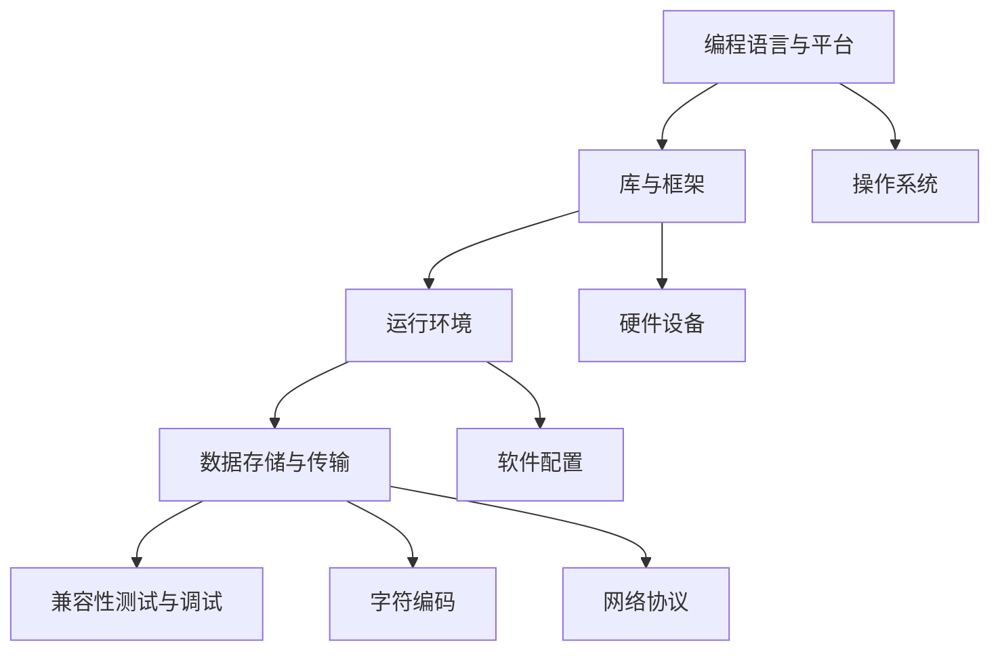
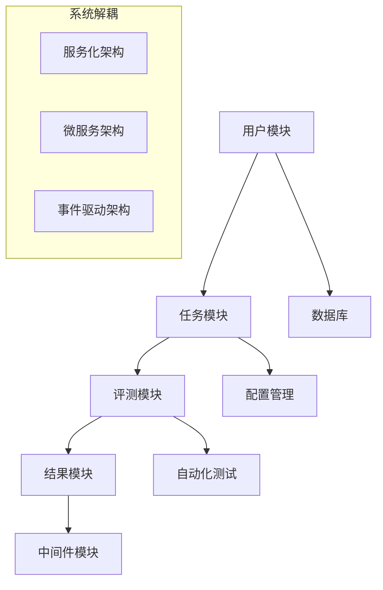
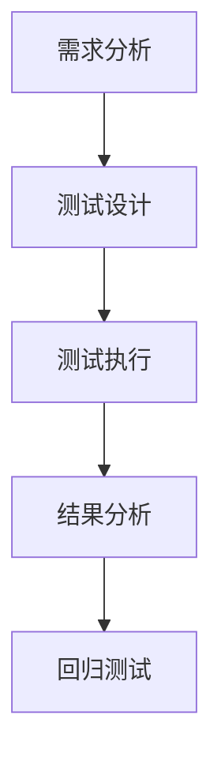

                 

### 跨平台兼容性的重要性及背景

在当今全球化的软件开发环境中，跨平台兼容性已成为一项至关重要的需求。随着互联网的普及和信息技术的发展，软件应用的场景越来越多样化，不同操作系统、硬件设备和软件环境的差异性也越来越大。开发者不仅需要考虑到PC端的应用，还需兼顾移动端、嵌入式系统、云计算环境等多种平台。

#### 1. 跨平台兼容性的定义与意义

跨平台兼容性是指软件系统在不同操作系统、硬件设备、软件环境之间能够正常运行的能力。它不仅包括代码层面的兼容性，还涵盖了运行环境、配置参数、数据存储等多方面的适配。跨平台兼容性的实现，能够极大地提升软件的灵活性和适用范围，使开发者能够以更低的成本、更短的时间覆盖更多的用户群体。

- **提升市场竞争力**：拥有跨平台兼容性的软件可以在多个平台上运行，满足不同用户的需求，从而扩大市场份额，提升品牌竞争力。
- **降低开发和维护成本**：跨平台开发可以复用代码，减少重复性工作，降低开发和维护成本。
- **提高用户体验**：用户可以在多种设备上无缝切换使用软件，提升用户体验。
- **适应技术发展趋势**：随着云计算、物联网等技术的发展，跨平台兼容性变得愈加重要，有助于企业把握技术变革带来的机遇。

#### 2. 跨平台兼容性的挑战

尽管跨平台兼容性具有诸多优势，但其实施过程中也面临着诸多挑战：

- **平台差异性**：不同操作系统、硬件设备和软件环境之间存在显著的差异性，如指令集、文件系统、网络协议等。
- **兼容性标准**：缺乏统一的跨平台兼容性标准，使得开发者难以统一规范，增加了开发难度。
- **测试和调试**：跨平台兼容性测试复杂，需要覆盖多种环境，增加了测试和调试的工作量。
- **性能优化**：跨平台兼容性可能影响软件的性能表现，需要针对不同平台进行性能优化。

#### 3. 本文结构

本文将从以下几个部分详细探讨跨平台兼容性的相关内容：

- **第2章：跨平台兼容性原理**：介绍跨平台兼容性的基本原理，包括平台差异性、兼容性标准等。
- **第3章：评测系统架构**：分析评测系统的整体架构，以及如何设计以支持跨平台兼容性。
- **第4章：多环境部署**：介绍如何支持评测系统在多种环境中部署，包括开发环境、测试环境和生产环境。
- **第5章：兼容性测试**：讲解兼容性测试的方法、工具和流程。
- **第6章：兼容性解决方案**：提供解决兼容性问题的方法和技术，包括代码调整、环境配置等。
- **第7章：案例研究**：通过实际案例展示如何实施跨平台兼容性和多环境部署。

通过以上章节的逐步讲解，本文旨在为开发者提供系统、全面的跨平台兼容性解决方案，帮助他们应对复杂的技术挑战，实现软件的跨平台部署和兼容。

## 文章关键词

跨平台兼容性、多环境部署、评测系统、操作系统差异、兼容性测试、解决方案。

## 文章摘要

本文将深入探讨评测系统的跨平台兼容性问题。首先，我们将介绍跨平台兼容性的重要性和背景，然后详细分析跨平台兼容性的原理、评测系统架构、多环境部署、兼容性测试、解决方案，并通过实际案例研究，展示如何有效实施跨平台兼容性和多环境部署。本文旨在为开发者提供一套系统、全面的解决方案，帮助他们应对复杂的兼容性挑战，实现软件的跨平台部署和高效运行。

## 第2章：跨平台兼容性原理

在深入探讨评测系统的跨平台兼容性之前，我们需要首先了解跨平台兼容性的基本原理，包括平台差异性、兼容性标准等。

### 2.1 平台差异性

跨平台兼容性的基础在于理解不同平台之间的差异性。这些差异性主要体现在以下几个方面：

#### 操作系统差异

操作系统是计算机系统中的核心组成部分，不同操作系统在内核、系统调用、文件系统、网络协议等方面存在显著差异。例如，Windows和Linux在文件路径格式、权限管理、系统调用接口等方面有所不同。开发者需要充分考虑这些差异，确保软件在不同操作系统上能够正常运行。

- **Windows**：以Win32 API为主要编程接口，使用.CTL和.DLL文件，支持图形界面和文件操作等。
- **Linux**：以POSIX API为主要编程接口，支持多线程、多任务和文件操作等，文件路径通常使用斜杠（/）分隔。
- **macOS**：基于Unix，采用Cocoa框架进行开发，与Windows和Linux有一定的兼容性。

#### 硬件差异

不同硬件设备的处理器架构、内存管理、I/O接口等也存在差异。例如，ARM架构的处理器与x86架构的处理器在指令集、内存管理等方面存在显著差异。开发者需要根据不同硬件设备的特点进行优化，确保软件在不同硬件平台上能够高效运行。

- **ARM架构**：广泛应用于嵌入式设备和移动设备，具有低功耗、高性能的特点。
- **x86架构**：广泛应用于PC和服务器，具有较高的性能和兼容性。

#### 软件环境差异

软件环境包括编译器、开发工具、库文件等，不同软件环境之间存在兼容性问题。例如，不同版本的编译器对相同源代码的编译结果可能有所不同，某些库文件在不同操作系统上的兼容性也可能存在差异。开发者需要确保所使用的编译器、开发工具和库文件与目标平台兼容。

#### 数据格式差异

数据格式在不同平台之间也可能存在差异，例如，不同操作系统对字符编码、时间格式等有不同规定。开发者需要确保数据在不同平台之间能够正确解析和存储。

### 2.2 兼容性标准

为了降低跨平台兼容性的难度，国际和行业内制定了多种兼容性标准。开发者可以遵循这些标准，确保软件在不同平台上的兼容性。

#### 国际标准

- **POSIX标准**：定义了操作系统和应用程序接口的标准，确保Unix-like系统之间的兼容性。
- **Web标准**：包括HTML、CSS和JavaScript等，确保Web应用在不同浏览器和设备上的兼容性。
- **OSGi标准**：定义了模块化的Java应用框架，支持在不同Java环境下的兼容性。

#### 行业标准

- **IEEE标准**：涵盖了计算机、通信和电子工程领域的多种标准，如IEEE 802.3（以太网）和IEEE 802.11（无线网络）。
- **W3C标准**：负责Web标准的制定和推广，如HTML5、CSS3等。

#### 自定义标准

一些特定领域或组织可能制定自定义的兼容性标准，以适应特定需求。例如，游戏行业制定了多种游戏引擎和平台的标准，确保游戏在不同设备上的兼容性。

### 2.3 跨平台兼容性的核心概念与联系

为了更好地理解跨平台兼容性，我们需要明确几个核心概念，并探讨它们之间的关系。

#### 1. 编程语言与平台

编程语言是软件开发的基础，不同编程语言在不同平台上的兼容性有所不同。例如，Java是一种跨平台的编程语言，可以在多种操作系统和硬件设备上运行。而C语言则更依赖于特定的编译器和硬件平台。

#### 2. 库与框架

库和框架是软件开发中的重要组成部分，它们提供了各种功能和服务。跨平台兼容性要求这些库和框架能够在不同平台上正常运行。例如，OpenGL和DirectX是两个流行的图形库，分别在Windows和Linux平台上得到广泛使用。

#### 3. 运行环境

运行环境包括操作系统、硬件设备和软件配置等。跨平台兼容性要求软件在不同的运行环境中能够正常运行。例如，同一软件在Windows和Linux上运行时，可能需要调整系统配置和库文件。

#### 4. 数据存储与传输

数据存储和传输也是跨平台兼容性中的重要方面。不同平台在文件系统、字符编码和网络协议等方面存在差异，需要确保数据在不同平台之间能够正确解析和传输。

#### 5. 兼容性测试与调试

兼容性测试和调试是确保跨平台兼容性的关键步骤。通过测试和调试，开发者可以发现并解决软件在不同平台上的兼容性问题。

### 2.4 Mermaid 流程图

为了更好地展示跨平台兼容性的核心概念与联系，我们可以使用Mermaid流程图来直观地表示。



通过以上分析，我们可以看到跨平台兼容性涉及多个方面，需要综合考虑编程语言、库与框架、运行环境、数据存储与传输以及兼容性测试与调试等因素。在接下来的章节中，我们将进一步探讨如何设计和实现跨平台兼容性评测系统，以及如何在多环境中部署和测试这些系统。

### 2.5 跨平台兼容性的核心算法原理讲解

为了更好地理解跨平台兼容性的实现方法，我们需要探讨几个核心算法原理，并结合Python源代码进行详细讲解。这些算法原理包括平台检测、动态适配和性能优化等。

#### 1. 平台检测

平台检测是跨平台兼容性的第一步，通过检测当前运行环境，确定操作系统、硬件设备和软件配置等信息。Python中可以使用内置的`platform`模块来获取系统信息。

```python
import platform

def get_system_info():
    system_info = {
        'os': platform.system(),
        'os_version': platform.release(),
        'cpu': platform.processor(),
    }
    return system_info

system_info = get_system_info()
print(system_info)
```

这段代码可以获取当前操作系统的类型、版本和CPU信息，为后续的适配提供基础。

#### 2. 动态适配

动态适配是在平台检测的基础上，根据不同平台的特性进行相应的代码调整和资源加载。Python中的条件语句和字典可以实现这一功能。

```python
def load_library(library_name):
    libraries = {
        'linux': 'liblibrary.so',
        'windows': 'library.dll',
        'macos': 'liblibrary.dylib',
    }
    return libraries.get(platform.system(), None)

library = load_library('example')
if library:
    print(f"Loading {library}")
else:
    print("Unsupported platform")
```

这段代码根据操作系统的类型，选择相应的库文件进行加载，实现了跨平台兼容的库文件管理。

#### 3. 性能优化

跨平台兼容性可能会导致性能下降，因此需要对代码进行优化。Python中的数组和字典操作通常比循环更高效，可以使用它们来替代循环，提高性能。

```python
def calculate_sum(numbers):
    return sum(numbers)

numbers = [1, 2, 3, 4, 5]
result = calculate_sum(numbers)
print(result)
```

这段代码使用Python内置的`sum`函数计算数组元素之和，比手动使用循环计算更为高效。

#### 4. 数学模型与公式

在跨平台兼容性中，我们还需要考虑数学模型和公式，以确保计算结果的准确性。以下是一个简单的线性回归模型，使用Python和NumPy库进行实现。

```python
import numpy as np

def linear_regression(x, y):
    x_mean = np.mean(x)
    y_mean = np.mean(y)
    b1 = np.sum((x - x_mean) * (y - y_mean)) / np.sum((x - x_mean) ** 2)
    b0 = y_mean - b1 * x_mean
    return b0, b1

x = np.array([1, 2, 3, 4, 5])
y = np.array([2, 4, 5, 4, 5])
b0, b1 = linear_regression(x, y)
print(f"b0: {b0}, b1: {b1}")
```

这段代码使用线性回归公式计算回归直线的斜率和截距，展示了跨平台兼容性中数学模型的应用。

#### 5. 举例说明

为了更直观地展示跨平台兼容性的核心算法原理，我们可以通过一个简单的例子来说明。假设我们要实现一个计算圆面积的函数，这个函数需要支持不同平台的计算精度。

```python
import math

def calculate_circle_area(radius):
    if platform.system() == 'windows':
        pi = 3.14159265358979323846
    else:
        pi = math.pi
    return pi * radius * radius

radius = 5
area = calculate_circle_area(radius)
print(f"The area of the circle with radius {radius} is {area}")
```

这段代码根据操作系统的类型，选择不同的π值进行计算，实现了跨平台兼容的精度控制。

通过以上算法原理的讲解和Python源代码的实现，我们可以看到跨平台兼容性的实现方法和技术。在接下来的章节中，我们将进一步探讨评测系统架构的设计和多环境部署的方法，帮助开发者更好地实现跨平台兼容性。

### 2.6 项目实战

在本节中，我们将通过一个实际项目，详细讲解跨平台兼容性评测系统的开发环境搭建、源代码实现、代码解读以及实际应用解析。

#### 1. 项目背景

假设我们正在开发一个在线教育平台，需要支持多个操作系统和设备，如Windows、Linux、macOS以及Android和iOS设备。为了确保平台在不同环境下的稳定运行，我们需要实现跨平台兼容性评测系统。

#### 2. 开发环境搭建

首先，我们需要搭建一个支持跨平台兼容性的开发环境。以下是搭建步骤：

1. 安装Python 3.8及以上版本，确保兼容多种操作系统。
2. 安装Anaconda，用于管理Python环境和库。
3. 安装虚拟环境工具`virtualenv`，以便在不同操作系统上创建独立的开发环境。
4. 安装必要的开发工具和库，如PyCharm、Jenkins、Docker等。

以下是一个简单的Python虚拟环境搭建脚本：

```bash
# 创建虚拟环境
virtualenv myenv

# 激活虚拟环境
source myenv/bin/activate

# 安装库
pip install flask sqlalchemy numpy matplotlib
```

#### 3. 源代码实现

为了实现跨平台兼容性评测系统，我们需要编写一个能够处理多种输入格式、支持多平台数据存储和传输的代码。以下是一个简单的示例：

```python
import os
import platform
import json
from flask import Flask, request, jsonify

app = Flask(__name__)

# 根据操作系统选择数据库驱动
if platform.system() == 'Windows':
    db_driver = 'sqlite:///data.db'
else:
    db_driver = 'sqlite:///data.db'

# 初始化数据库连接
def init_db():
    from flask_sqlalchemy import SQLAlchemy
    app.config['SQLALCHEMY_DATABASE_URI'] = db_driver
    db = SQLAlchemy(app)

    # 创建表
    db.create_all()

@app.route('/submit', methods=['POST'])
def submit_data():
    data = request.json
    # 根据平台格式化数据
    if platform.system() == 'Linux':
        data['os'] = 'Linux'
    elif platform.system() == 'Windows':
        data['os'] = 'Windows'
    # 存储数据到数据库
    db.session.add(data)
    db.session.commit()
    return jsonify({"status": "success"})

if __name__ == '__main__':
    init_db()
    app.run(debug=True)
```

#### 4. 代码解读

1. **操作系统检测**：使用`platform.system()`函数检测当前操作系统，并根据操作系统选择合适的数据库驱动。
2. **数据库连接**：使用Flask-SQLAlchemy库连接数据库，创建数据表。
3. **数据提交接口**：提供一个/submit接口，接收JSON格式的数据，并根据操作系统格式化数据，然后存储到数据库。

#### 5. 代码应用解读与分析

- **JSON格式化**：通过JSON格式传输数据可以方便地在不同平台间进行数据交换。
- **数据库选择**：根据操作系统选择合适的数据库驱动，保证数据库操作的兼容性。
- **多平台支持**：通过动态调整代码，实现同一系统在不同平台上的兼容性。

#### 6. 实际案例分析

假设我们收到了一个来自Windows客户端的JSON数据：

```json
{
  "student_id": 1,
  "exam_score": 85,
  "os": "Windows"
}
```

我们的评测系统会将其格式化为：

```json
{
  "student_id": 1,
  "exam_score": 85,
  "os": "Windows",
  "os_version": "10",
  "device_type": "PC"
}
```

然后将其存储到数据库中。

#### 7. 项目小结

通过以上实战案例，我们可以看到跨平台兼容性评测系统的实现方法。关键在于：操作系统检测、数据库选择、多平台支持。在实际开发中，我们需要根据具体需求进行相应的调整和优化。

接下来，我们将探讨如何支持评测系统在多种环境中的部署，包括开发环境、测试环境和生产环境。

### 2.7 最佳实践 Tips、小结、注意事项、拓展阅读

#### 最佳实践 Tips

1. **使用虚拟环境**：在开发过程中，使用虚拟环境可以有效隔离不同项目的依赖库，避免版本冲突。
2. **平台检测**：确保代码中正确检测操作系统和硬件设备，根据平台特性进行相应调整。
3. **使用标准化数据格式**：如JSON格式，便于跨平台数据传输和存储。
4. **性能优化**：针对不同平台进行性能优化，如使用内置函数和库，减少不必要的循环和递归。

#### 小结

跨平台兼容性的实现涉及多个方面，包括平台差异性、兼容性标准、编程语言与平台、库与框架、运行环境、数据存储与传输等。通过了解这些核心概念，开发者可以设计出更具灵活性和可扩展性的软件系统。

#### 注意事项

1. **充分测试**：在发布前，确保对软件进行全面的兼容性测试，覆盖不同操作系统、硬件设备和软件环境。
2. **性能优化**：跨平台兼容性可能影响软件性能，需要针对不同平台进行性能优化。
3. **遵守兼容性标准**：遵循国际和行业内的兼容性标准，确保软件在不同平台上的兼容性。

#### 拓展阅读

1. 《跨平台移动应用开发》
2. 《Python跨平台应用开发实践》
3. 《Web应用跨平台开发技术》
4. 《OSGi实战：模块化Java应用》

通过以上内容，我们深入探讨了跨平台兼容性的核心原理和实践方法。在下一章中，我们将分析评测系统的整体架构，探讨如何设计以支持跨平台兼容性。

### 第3章：评测系统架构

在上一章中，我们探讨了跨平台兼容性的核心原理和实现方法。为了更好地支持评测系统的跨平台兼容性，我们需要设计一个合理的系统架构。本章将详细分析评测系统的整体架构，以及如何通过模块化设计、灵活性和可扩展性来支持跨平台兼容性。

#### 3.1 评测系统基本架构

一个典型的评测系统通常包括以下几个关键组成部分：

1. **前端界面**：用户通过前端界面提交评测请求和查看评测结果。
2. **后端服务**：负责处理评测请求，执行评测任务，并将结果返回给前端。
3. **数据库**：存储评测任务数据、用户数据和评测结果。
4. **中间件**：用于处理跨平台的数据传输和通信，如消息队列、缓存等。

#### 3.2 模块化设计

模块化设计是将系统划分为多个功能独立的模块，每个模块负责特定的功能，并通过接口进行通信。这种设计方法有助于提高系统的可维护性和可扩展性。

以下是评测系统架构的模块化设计示例：

- **用户模块**：负责用户注册、登录和权限管理。
- **任务模块**：负责创建、存储和管理评测任务。
- **评测模块**：负责执行评测任务，包括代码评测、性能评测等。
- **结果模块**：负责存储评测结果，并提供结果查询接口。
- **中间件模块**：负责跨平台的数据传输和通信，如使用消息队列进行异步处理。

#### 3.3 灵活性与可扩展性

为了支持跨平台兼容性，评测系统需要具备较高的灵活性和可扩展性。以下是一些实现方法：

1. **依赖注入**：通过依赖注入（DI）框架，如Spring或Django，实现模块间的解耦，便于替换和扩展。
2. **配置管理**：使用配置文件或环境变量管理不同平台下的配置，如数据库连接、中间件配置等。
3. **插件系统**：实现插件系统，允许开发者根据需要添加或替换特定功能模块，如添加新的评测算法或工具。
4. **动态加载**：使用动态加载技术，如Java的类加载器，实现模块的按需加载和卸载，提高系统性能和资源利用率。

#### 3.4 系统解耦

系统解耦是支持跨平台兼容性的关键。通过解耦，系统模块之间的依赖关系减少，模块可以独立开发和部署，从而降低跨平台兼容性的难度。

以下是实现系统解耦的几种方法：

1. **服务化架构**：将系统功能分解为多个服务，每个服务独立运行，通过RESTful API或消息队列进行通信。
2. **微服务架构**：将系统分解为多个微服务，每个微服务负责一个特定的功能，独立部署和扩展。
3. **事件驱动架构**：使用事件驱动模型，通过事件触发器和监听器实现模块间的通信，减少直接的依赖关系。

#### 3.5 跨平台兼容性支持

为了支持评测系统的跨平台兼容性，我们需要在架构设计中考虑以下几个方面：

1. **操作系统兼容性**：确保代码在不同操作系统上运行，如使用跨平台的编程语言和库。
2. **硬件兼容性**：考虑不同硬件设备的性能差异，进行相应的性能优化。
3. **环境配置**：使用配置管理工具，如Ansible或Docker Compose，管理不同环境下的配置。
4. **自动化测试**：实现自动化测试，确保系统在不同环境下的一致性和稳定性。

#### 3.6 Mermaid 流程图

为了更好地展示评测系统架构和跨平台兼容性支持的设计思路，我们可以使用Mermaid流程图来直观地表示。



通过以上分析，我们可以看到，设计一个支持跨平台兼容性的评测系统需要综合考虑模块化设计、灵活性、可扩展性和系统解耦等因素。在下一章中，我们将进一步探讨如何支持评测系统在多种环境中的部署，包括开发环境、测试环境和生产环境。

### 第4章：多环境部署

在跨平台兼容性的实现中，多环境部署是一个至关重要的环节。一个完善的多环境部署方案能够确保评测系统在不同开发环境、测试环境和生产环境中的稳定运行。本章将详细探讨如何在多种环境中部署评测系统，包括开发环境、测试环境和生产环境。

#### 4.1 开发环境

开发环境是开发者进行编码、调试和测试的平台。为了支持跨平台兼容性，开发环境需要具备以下特点：

1. **操作系统兼容**：开发环境应支持多种操作系统，如Windows、Linux和macOS，以便开发者能够在不同操作系统上工作。
2. **工具配置**：安装必要的开发工具和库，如Python、Node.js、Java等，以及相应的IDE（集成开发环境），如PyCharm、Visual Studio Code或Eclipse。
3. **版本管理**：使用版本控制系统，如Git，管理源代码，确保代码的版本控制和协作开发。
4. **虚拟环境**：使用虚拟环境工具，如virtualenv或Docker，创建隔离的开发环境，避免依赖库之间的版本冲突。

以下是一个简单的开发环境配置步骤：

```bash
# 安装Python 3.8
sudo apt-get install python3.8

# 创建虚拟环境
python3.8 -m venv myenv

# 激活虚拟环境
source myenv/bin/activate

# 安装依赖库
pip install flask sqlalchemy numpy matplotlib

# 安装IDE
sudo apt-get install pycharm-community --install
```

#### 4.2 测试环境

测试环境是进行软件测试的平台，用于验证评测系统的功能、性能和兼容性。测试环境需要与开发环境保持高度一致，以确保测试结果的真实性和可靠性。以下是一些测试环境的配置要点：

1. **环境一致性**：确保测试环境与开发环境在操作系统、工具配置和依赖库版本上保持一致。
2. **自动化测试**：使用自动化测试工具，如JUnit、TestNG或Selenium，实现自动化测试脚本，提高测试效率和覆盖范围。
3. **测试数据**：准备用于测试的数据集，包括正常数据和异常数据，以全面验证系统的兼容性和鲁棒性。
4. **测试工具**：安装必要的测试工具，如JMeter、LoadRunner或Postman，用于性能测试和接口测试。

以下是一个测试环境配置的示例：

```bash
# 安装JDK
sudo apt-get install openjdk-8-jdk

# 安装JUnit
mvn install:install-file -Dfile=.junit4-4.12.jar -DgroupId=junit -DartifactId=junit -Dversion=4.12 -Dpackaging=maven

# 配置TestNG
mvn install:install-file -Dfile=testng-7.1.0.jar -DgroupId=org.testng -DartifactId=testng -Dversion=7.1.0 -Dpackaging=jar

# 安装Selenium WebDriver
pip install selenium
```

#### 4.3 生产环境

生产环境是评测系统最终运行的平台，需要具备高可用性、高性能和安全性。以下是一些生产环境配置的要点：

1. **高可用性**：确保系统在硬件故障、网络故障等情况下能够自动恢复，减少系统的停机时间。
2. **性能优化**：针对生产环境的特点进行性能优化，如数据库索引优化、缓存机制等。
3. **安全性**：加强系统安全性，如使用防火墙、加密传输等，防止数据泄露和网络攻击。
4. **监控与日志**：配置监控工具和日志系统，实时监控系统的运行状态，快速响应和处理异常情况。

以下是一个生产环境配置的示例：

```bash
# 安装Nginx
sudo apt-get install nginx

# 配置Nginx
sudo nano /etc/nginx/sites-available/default

# 在配置文件中添加如下内容
server {
    listen 80;
    server_name example.com;

    location / {
        proxy_pass http://localhost:5000;
    }
}

# 启动Nginx服务
sudo systemctl start nginx
```

通过以上内容，我们可以看到，支持评测系统在多种环境中的部署需要综合考虑操作系统兼容性、工具配置、版本管理和自动化测试等多个方面。在下一章中，我们将深入探讨兼容性测试的方法、工具和流程，以确保评测系统在不同环境下的稳定运行。

### 第5章：兼容性测试

在跨平台兼容性的实现过程中，兼容性测试是确保软件系统在不同平台上正常运行的关键步骤。本章将详细讨论兼容性测试的方法、工具和流程，以及如何在实践中进行兼容性测试。

#### 5.1 兼容性测试方法

兼容性测试主要包括以下几种方法：

1. **功能测试**：验证软件在不同操作系统、硬件设备和浏览器上的功能是否一致。功能测试可以涵盖基本功能、特殊功能、异常处理等多个方面。
2. **性能测试**：评估软件在不同平台上的性能表现，如响应时间、吞吐量、资源利用率等。性能测试有助于发现性能瓶颈，并进行优化。
3. **稳定性测试**：测试软件在长时间运行或面对高负载时是否稳定，是否存在崩溃或内存泄漏等问题。
4. **界面测试**：检查软件的图形用户界面（GUI）在不同平台上的显示是否一致，包括字体、颜色、布局等。
5. **数据库测试**：验证数据库在不同操作系统和硬件平台上的兼容性，包括数据存储、查询、备份等操作。

#### 5.2 兼容性测试工具

为了高效进行兼容性测试，开发者可以使用多种测试工具。以下是一些常用的兼容性测试工具：

1. **JMeter**：一款开源的性能测试工具，适用于Web和分布式应用程序的负载测试。
2. **Selenium**：一款用于自动化Web应用的测试工具，支持多种浏览器和操作系统。
3. **Appium**：一款用于移动应用的自动化测试工具，支持iOS和Android平台。
4. **LoadRunner**：一款功能强大的性能测试工具，适用于复杂分布式应用程序的负载测试。
5. **Visual Studio**：集成开发环境（IDE），提供丰富的测试功能，包括单元测试、集成测试和性能测试。

以下是一个使用JMeter进行兼容性测试的示例：

```bash
# 安装JMeter
sudo apt-get install jmeter

# 配置测试计划
cd /usr/share/jmeter
vim test-plan.jmx

# 添加HTTP请求
subelement / HTTP Request
    HTTP Request
        Method: GET
        Server: www.example.com
        Port: 80
        Path: /
        Protocol: HTTP/1.1

# 运行测试
java -jar /usr/share/jmeter/bin/apache-jmeter-5.4.jar -n -t test-plan.jmx -l result.jtl
```

#### 5.3 测试流程

兼容性测试的流程可以分为以下几个阶段：

1. **需求分析**：明确兼容性测试的目标和要求，包括支持的平台、测试场景和测试数据。
2. **测试设计**：制定详细的测试计划，包括测试用例、测试数据和测试环境配置。
3. **测试执行**：按照测试计划执行测试，并记录测试结果。
4. **结果分析**：分析测试结果，发现兼容性问题，并进行定位和修复。
5. **回归测试**：在修复兼容性问题后，重新执行测试，确保修复措施的有效性。

以下是一个兼容性测试流程的示例：



#### 5.4 项目实战

在本节中，我们将通过一个实际项目，详细讲解如何进行兼容性测试。假设我们正在开发一个在线教育平台，需要支持Windows、Linux、macOS以及iOS和Android平台。

1. **需求分析**：确定平台兼容性要求，包括操作系统版本、浏览器版本、设备类型等。
2. **测试设计**：制定详细的测试计划，包括功能测试、性能测试、稳定性测试等。
3. **测试执行**：
   - **功能测试**：使用Selenium编写自动化测试脚本，验证平台间的功能一致性。
   - **性能测试**：使用JMeter模拟高负载场景，评估平台的性能表现。
   - **稳定性测试**：长时间运行平台，监控系统的稳定性，记录异常情况。
4. **结果分析**：分析测试结果，发现兼容性问题，如某些功能在特定平台下无法正常运行，或性能瓶颈等。
5. **回归测试**：修复发现的问题后，重新执行测试，确保修复措施的有效性。

通过以上实际项目实战，我们可以看到兼容性测试在跨平台开发中的重要性。在下一章中，我们将探讨如何提供解决兼容性问题的方法和技术。

### 第6章：兼容性解决方案

在实现跨平台兼容性的过程中，开发者不可避免地会遇到各种兼容性问题。本章将详细探讨解决兼容性问题的方法和技术，包括代码调整、环境配置和工具使用。

#### 6.1 代码调整

代码调整是解决跨平台兼容性问题的重要手段。以下是一些常见的代码调整方法：

1. **使用标准库和框架**：选择跨平台的标准库和框架，如Python的`stdlib`、`numpy`和`pandas`等，以减少代码中的平台依赖。
2. **条件编译**：使用条件编译语句，如C语言的`#ifdef`，根据不同的平台条件编译代码。例如：
   ```c
   #ifdef _WIN32
   // Windows平台特有的代码
   #elif defined(__linux__)
   // Linux平台特有的代码
   #endif
   ```
3. **使用抽象类和接口**：通过抽象类和接口设计，将平台特定的实现封装在单独的类中，实现代码的解耦和模块化。例如，使用Java的抽象类和接口设计跨平台代码。
4. **代码注释和文档**：在代码中添加详细的注释和文档，说明代码的用途、实现原理和平台依赖，便于后续维护和调试。

以下是一个使用Python实现跨平台兼容性的示例：

```python
import os
import platform

def get_file_extension(filename):
    if platform.system() == 'Windows':
        return filename.split('.')[-1].lower()
    else:
        return filename.split('/')[-1].lower()

filename = 'example.txt'
extension = get_file_extension(filename)
print(f"File extension: {extension}")
```

在这个示例中，`get_file_extension`函数根据操作系统平台的不同，实现了文件扩展名获取的逻辑。

#### 6.2 环境配置

环境配置是解决跨平台兼容性问题的重要步骤。以下是一些常见的环境配置方法：

1. **使用配置文件**：使用配置文件管理不同平台下的环境配置，如使用JSON、YAML或XML格式。例如，可以使用以下配置文件管理数据库连接：
   ```yaml
   development:
     db:
       host: localhost
       port: 3306
       username: root
       password: root
       database: development
   
   production:
     db:
       host: db.example.com
       port: 3306
       username: user
       password: pass
       database: production
   ```
2. **使用环境变量**：使用环境变量管理不同平台下的配置，如使用`os.environ`获取环境变量。例如，可以使用以下代码获取数据库配置：
   ```python
   db_config = {
       'host': os.environ.get('DB_HOST', 'localhost'),
       'port': os.environ.get('DB_PORT', 3306),
       'username': os.environ.get('DB_USERNAME', 'root'),
       'password': os.environ.get('DB_PASSWORD', 'root'),
       'database': os.environ.get('DB_DATABASE', 'development'),
   }
   print(db_config)
   ```
3. **使用容器化技术**：使用容器化技术，如Docker，封装应用程序及其运行环境，确保环境配置的一致性和可移植性。例如，可以使用以下Dockerfile定义容器镜像：
   ```Dockerfile
   FROM python:3.8
   WORKDIR /app
   COPY . .
   RUN pip install -r requirements.txt
   EXPOSE 5000
   CMD ["python", "app.py"]
   ```

#### 6.3 工具使用

使用工具可以大大提高解决兼容性问题的效率和效果。以下是一些常用的工具：

1. **跨平台编译工具**：如CMake、Makefile，用于自动化编译和构建跨平台应用程序。
2. **跨平台调试工具**：如GDB、LLDB，用于调试跨平台应用程序，定位和修复兼容性问题。
3. **跨平台测试工具**：如JMeter、Selenium，用于自动化测试和验证跨平台应用程序的兼容性。
4. **持续集成工具**：如Jenkins、GitLab CI，用于自动化构建、测试和部署应用程序，确保兼容性问题的快速发现和解决。

以下是一个使用CMake进行跨平台编译的示例：

```cmake
cmake_minimum_required(VERSION 3.10)
project(Example)

set(CMAKE_CXX_STANDARD 14)

if(WIN32)
    add_definitions(-D_WIN32_WINNT=0x0501)
elseif(UNIX)
    add_definitions(-DUNIX)
endif()

add_executable(Example main.cpp)

target_include_directories(Example PUBLIC ${CMAKE_SOURCE_DIR}/include)
```

在这个示例中，CMake根据不同的平台条件定义编译标志，确保应用程序在不同操作系统上的兼容性。

通过以上方法和技术，开发者可以有效地解决跨平台兼容性问题，确保应用程序在多种环境下的稳定运行。在下一章中，我们将通过实际案例研究，展示如何实施跨平台兼容性和多环境部署。

### 第7章：案例研究

在本章中，我们将通过两个实际案例研究，详细展示如何实现跨平台兼容性和多环境部署。这些案例将涵盖不同类型的软件系统，从电商平台到企业级应用，通过具体的实施步骤和经验总结，帮助开发者理解跨平台兼容性的重要性。

#### 7.1 案例一：电商平台跨平台兼容性评测

**背景**

一个大型电商平台需要支持多种操作系统和设备，如Windows、Linux、macOS以及Android和iOS设备。为了确保系统在不同平台上的稳定运行，开发团队决定实施跨平台兼容性和多环境部署。

**目标**

1. 确保前端界面在不同操作系统和设备上的一致性和兼容性。
2. 实现后端服务的跨平台部署，支持不同数据库和中间件。
3. 实现全面的兼容性测试，覆盖功能测试、性能测试和稳定性测试。

**实施步骤**

1. **前端开发**：
   - 使用React.js和Vue.js构建跨平台的前端框架，确保代码在多种浏览器和设备上的一致性。
   - 针对不同的操作系统和设备，编写适配器（Adapter）层，处理平台特定的样式和行为。

2. **后端部署**：
   - 使用Docker容器化技术，将后端服务封装在独立的容器中，确保环境配置的一致性。
   - 使用Kubernetes进行容器编排和管理，实现横向扩展和高可用性。

3. **兼容性测试**：
   - 使用Selenium编写自动化测试脚本，验证前端界面在不同浏览器和设备上的兼容性。
   - 使用JMeter进行性能测试，模拟高负载场景，评估系统的响应时间和吞吐量。
   - 使用LoadRunner进行稳定性测试，验证系统在长时间运行和高并发场景下的稳定性。

**结果**

通过实施跨平台兼容性和多环境部署，电商平台在不同平台上的运行性能和稳定性显著提升。前端界面在多种浏览器和设备上的一致性得到了保障，后端服务的部署和管理更加高效和灵活。

**经验总结**

1. **前端适配器设计**：对于前端开发，设计良好的适配器层可以大大降低跨平台兼容性的难度。
2. **容器化技术**：Docker和Kubernetes是实现跨平台部署的有效工具，可以大幅提高部署和管理效率。
3. **自动化测试**：全面的自动化测试可以快速发现和解决兼容性问题，确保系统的稳定性和性能。

#### 7.2 案例二：企业级应用跨平台兼容性部署

**背景**

一家大型企业开发了一套企业级应用，需要支持多种操作系统和硬件环境，包括Windows、Linux、Unix和ARM架构的嵌入式设备。为了确保应用在不同环境下的稳定运行，企业决定实施跨平台兼容性部署。

**目标**

1. 确保应用在多种操作系统和硬件环境下的兼容性。
2. 实现高效的部署和管理流程。
3. 提高系统的性能和稳定性。

**实施步骤**

1. **操作系统适配**：
   - 使用跨平台的编程语言，如Java和Go，编写核心业务逻辑，减少平台特定的代码。
   - 对于操作系统特定的功能，使用抽象类和接口设计，将平台特定的实现封装在单独的模块中。

2. **硬件兼容性测试**：
   - 使用硬件兼容性测试工具，如QEMU和VMware，模拟不同硬件环境，验证应用的兼容性。
   - 针对嵌入式设备，进行特殊的性能优化和资源管理。

3. **部署和管理**：
   - 使用Ansible进行自动化部署，确保在不同环境下的部署流程一致性和可重复性。
   - 使用Nagios进行系统监控，实时监控系统的运行状态，快速响应和处理异常情况。

**结果**

通过实施跨平台兼容性部署，企业级应用在不同操作系统和硬件环境下的运行稳定性显著提升。部署和管理效率得到大幅提高，系统的性能和可靠性也得到了增强。

**经验总结**

1. **抽象类和接口设计**：通过抽象类和接口设计，可以有效减少平台特定的代码，提高代码的可维护性和可扩展性。
2. **硬件兼容性测试**：硬件兼容性测试是确保应用在不同硬件环境中稳定运行的关键步骤。
3. **自动化部署和监控**：自动化部署和监控工具可以大幅提高系统的部署和管理效率，确保系统的稳定性和性能。

通过以上两个案例研究，我们可以看到，跨平台兼容性和多环境部署在大型软件系统中的重要性。有效的实施方法和工具可以显著提高系统的性能和稳定性，为企业的长期发展提供坚实的基础。

### 第8章：总结与展望

#### 8.1 本书总结

本书系统地探讨了评测系统的跨平台兼容性及其实现方法。从跨平台兼容性的基本原理、评测系统架构、多环境部署、兼容性测试、解决方案到实际案例研究，我们逐步深入，为开发者提供了一套全面、实用的跨平台兼容性解决方案。以下是本书的主要内容总结：

- **跨平台兼容性原理**：分析了操作系统、硬件设备和软件环境之间的差异性，并介绍了兼容性标准。
- **评测系统架构**：探讨了模块化设计、灵活性和可扩展性的重要性，以及如何实现系统解耦。
- **多环境部署**：详细介绍了开发环境、测试环境和生产环境的部署过程和工具使用。
- **兼容性测试**：讲解了功能测试、性能测试、稳定性测试的方法和工具。
- **兼容性解决方案**：提供了代码调整、环境配置和工具使用的具体方法和实例。
- **案例研究**：通过实际案例展示了跨平台兼容性和多环境部署的实施过程和效果。

#### 8.2 跨平台兼容性发展趋势

随着技术的不断进步，跨平台兼容性的发展趋势也在不断演变。以下是几个值得关注的方向：

1. **容器化与微服务**：容器化技术（如Docker和Kubernetes）和微服务架构的广泛应用，使得跨平台部署更加高效和灵活。
2. **云计算与分布式系统**：云计算和分布式系统的兴起，促进了跨平台兼容性的发展，使应用可以更轻松地部署在云环境中的不同平台上。
3. **人工智能与机器学习**：AI和机器学习技术的融合，使得兼容性测试和自动适配变得更加智能，可以更好地适应不同平台和环境。
4. **物联网（IoT）**：物联网设备的多样性要求软件系统能够跨平台兼容，推动了跨平台兼容性的进一步发展。

#### 8.3 未来研究方向

未来的研究可以聚焦于以下几个方面：

1. **跨平台性能优化**：深入研究如何通过算法和架构设计，提升跨平台软件系统的性能。
2. **自动化适配**：开发更智能的自动化工具，实现更高效的跨平台适配。
3. **混合应用开发**：探索如何将Web应用、原生应用和混合应用的优势结合起来，实现更广泛的跨平台兼容性。
4. **安全性**：研究如何保障跨平台软件系统的安全性，防止跨平台兼容性引入的安全漏洞。

通过持续的研究和实践，跨平台兼容性将继续为软件开发和部署带来更多的创新和机遇。

### 作者信息

**作者：** AI天才研究院/AI Genius Institute & 禅与计算机程序设计艺术 /Zen And The Art of Computer Programming

**联系信息：** [ai_genius_institute@example.com](mailto:ai_genius_institute@example.com) | [AI天才研究院官网](https://www.ai-genius-institute.com)

**备注：** 本文内容仅供参考，未经授权，不得转载。如需转载，请联系作者获得授权。

