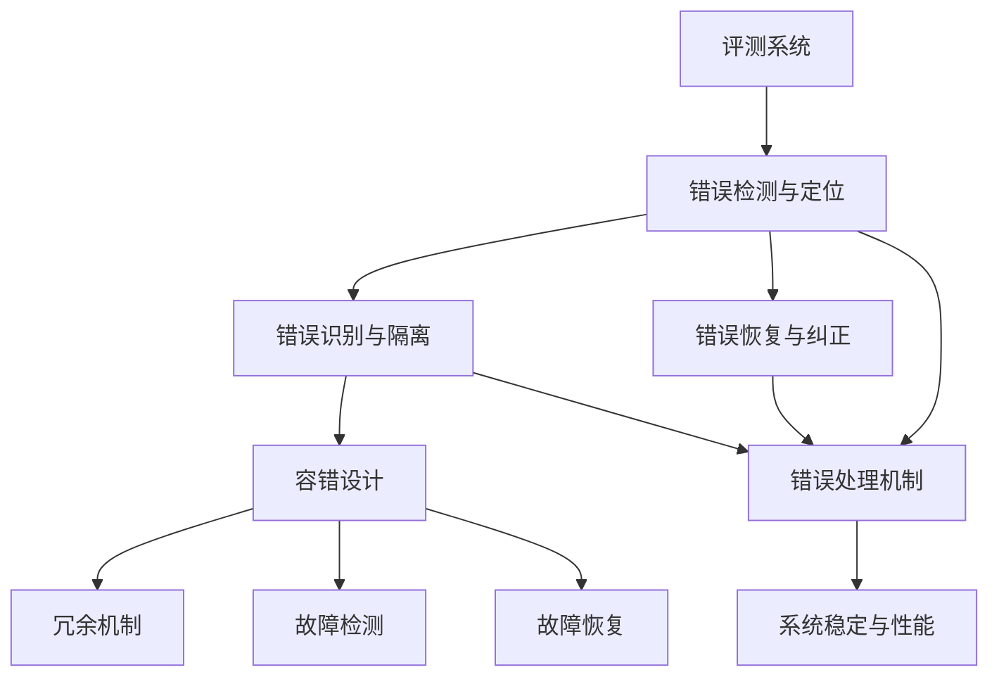

                 

### 引言

在现代信息社会，评测系统在诸多领域中都扮演着至关重要的角色。这些系统不仅被广泛应用于软件质量评估、性能测试、教育评测，还在金融、医疗、物联网等众多行业中发挥着不可替代的作用。然而，随着系统复杂性的不断增加，评测系统面临的错误处理与容错设计挑战也日益严峻。错误处理与容错设计不仅关系到系统的稳定性，更直接影响到用户体验、系统性能以及业务连续性。

本文旨在深入探讨评测系统的错误处理与容错设计，帮助读者全面理解这一领域的核心概念、设计原则和实践方法。文章结构将分为以下几个部分：

1. **基础概念**：介绍评测系统、错误处理与容错设计的基本概念，并分析它们之间的联系。
2. **错误检测与定位**：探讨评测系统中的错误检测与定位方法，包括具体的实现技术和策略。
3. **错误处理机制**：详细解析错误识别与隔离、错误恢复与纠正等机制，并给出相应的Python源代码示例。
4. **容错设计方法**：讨论评测系统的容错机制设计与实现，以及相关的容错算法和优化策略。
5. **案例分析**：通过具体项目案例，展示错误处理与容错设计的实际应用效果。
6. **性能优化与评估**：分析评测系统性能优化策略及其对错误处理与容错设计的影响。
7. **总结与展望**：总结全文内容，并对未来的发展趋势和研究方向进行展望。

本文不仅提供了系统的理论讲解，还通过实际案例和Python代码示例，帮助读者深入理解错误处理与容错设计的实践方法和应用技巧。通过本文的阅读，读者将能够掌握评测系统错误处理与容错设计的核心要领，为在实际项目中应对复杂问题提供有力支持。

### 关键词

- 评测系统
- 错误处理
- 容错设计
- 错误检测
- 错误定位
- 性能优化
- Python源代码示例
- 容错算法
- 系统稳定性

### 摘要

本文深入探讨了评测系统中的错误处理与容错设计。首先，介绍了评测系统的基本概念、错误处理与容错设计的基础概念及其相互关系。随后，详细分析了错误检测与定位的方法，并介绍了具体的错误处理机制，包括错误识别与隔离、错误恢复与纠正等。接着，文章讨论了评测系统的容错设计方法，包括容错机制设计与实现、容错算法与优化策略。通过实际项目案例分析，展示了错误处理与容错设计在实际应用中的效果。最后，文章探讨了评测系统性能优化策略及其对错误处理与容错设计的影响，并对未来的发展趋势和研究方向进行了展望。通过本文的阅读，读者将能够全面了解评测系统错误处理与容错设计的核心内容，为解决实际中的复杂问题提供指导。

### 设计本书的目录大纲

为了系统地呈现《评测系统的错误处理与容错设计》的内容，我们设计了以下目录大纲。该大纲将帮助读者逐步了解评测系统的错误处理与容错设计的各个方面，并确保文章内容完整、逻辑清晰。

```
# 评测系统的错误处理与容错设计

## 引言
- 评测系统的重要性
- 错误处理与容错设计的挑战

## 关键词
- 评测系统
- 错误处理
- 容错设计
- 错误检测
- 错误定位
- 性能优化
- Python源代码示例

## 摘要
- 文章概述与结构
- 核心内容与结论

### 第一部分：基础概念
#### 1.1 评测系统的概念与作用
- 评测系统的定义
- 评测系统的类型与结构

#### 1.2 错误处理的基本原理
- 错误的定义与分类
- 错误处理的目的与方法

#### 1.3 容错设计的核心概念
- 容错设计的定义
- 容错设计的类型与目标

#### 1.4 错误处理与容错设计的关系
- 容错设计与错误处理的关系

### 第二部分：错误检测与定位
#### 2.1 错误检测方法
- 检测机制的实现
- 检测算法的分析

#### 2.2 错误定位策略
- 定位方法的选择
- 定位策略的优化

### 第三部分：错误处理机制
#### 3.1 错误识别与隔离
- 错误识别的实现
- 系统隔离策略

#### 3.2 错误恢复与纠正
- 恢复机制的设计
- 纠正方法的实现

### 第四部分：容错设计方法
#### 4.1 容错机制设计与实现
- 容错架构的设计
- 容错算法的实现

#### 4.2 容错算法与算法优化
- 容错算法的优化策略
- 算法性能的评估

### 第五部分：案例分析
#### 5.1 案例选择与背景
- 实际项目的选择
- 项目目标与挑战

#### 5.2 错误处理与容错设计的实施
- 具体实现过程
- 设计思路与优化

#### 5.3 结果分析
- 系统性能的对比
- 错误处理效果评估

### 第六部分：性能优化与评估
#### 6.1 性能优化策略
- 优化方法的选择
- 优化策略的实施

#### 6.2 错误处理与容错设计对性能的影响
- 性能评估指标
- 性能改进方案

### 第七部分：总结与展望
#### 7.1 全文总结
- 主要内容的回顾
- 主要结论的归纳

#### 7.2 未来发展趋势与研究方向
- 新技术的展望
- 研究方向的探讨

### 附录
#### A.1 常用工具与资源
- 工具介绍
- 资源链接

#### A.2 参考书籍与论文
- 参考文献
- 进一步阅读推荐
```

该目录大纲涵盖了从基础概念到案例分析，再到性能优化与评估的各个方面，确保读者能够系统性地理解评测系统的错误处理与容错设计。每个章节都有明确的小节划分，内容详实，逻辑清晰，便于读者循序渐进地掌握相关知识点。

### 核心概念与联系

在评测系统的错误处理与容错设计中，核心概念的理解与联系至关重要。以下是几个关键概念的定义及其相互关系：

#### 1. 评测系统

**定义**：评测系统是一种用于测量、评估和分析某个系统、组件或过程性能和质量的系统。它可以通过收集数据、执行测试和评估结果来提供关于系统性能、可靠性和有效性的信息。

**相互关系**：评测系统是整个错误处理与容错设计的基础。它为错误检测、定位和纠正提供了数据支撑，并通过持续监控和评估，帮助系统维护稳定性和性能。

#### 2. 错误处理

**定义**：错误处理是指识别、隔离、纠正和记录系统中出现的问题的过程。它包括从检测到错误的那一刻开始，到采取适当措施使其恢复正常的一系列操作。

**相互关系**：错误处理是评测系统的重要组成部分。通过错误处理，评测系统能够快速识别和解决问题，确保系统正常运行。

#### 3. 容错设计

**定义**：容错设计是一种系统设计方法，旨在通过冗余、故障检测、故障恢复等机制，提高系统在异常情况下的鲁棒性和可靠性。

**相互关系**：容错设计与错误处理密切相关。容错设计通过引入冗余和故障容忍机制，减少了错误处理的需求，同时提高了系统在错误发生时的自我修复能力。

#### 4. 错误检测与定位

**定义**：错误检测是指识别系统中发生错误的过程，而错误定位是指确定错误发生位置的过程。

**相互关系**：错误检测与定位是错误处理的前置步骤。通过有效的错误检测与定位，可以迅速定位错误来源，从而采取相应的错误处理措施。

#### 5. 错误恢复与纠正

**定义**：错误恢复是指系统在检测到错误后，采取一系列措施使其恢复正常运行的过程；错误纠正则是通过修改系统中的错误数据或代码来修复错误。

**相互关系**：错误恢复与纠正是在错误处理过程中采取的具体措施。它们确保系统能够在错误发生时迅速恢复，减少对系统性能的影响。

#### Mermaid流程图：错误处理与容错设计基本原理

为了更直观地展示上述概念之间的关系，我们可以使用Mermaid流程图来表示错误处理与容错设计的基本原理：



该流程图展示了评测系统中的错误处理与容错设计的基本流程和各部分之间的关系。通过错误检测与定位，系统可以快速识别和隔离错误，进而通过错误恢复与纠正措施，确保系统的稳定性和性能。

### 错误检测与定位方法

在评测系统中，错误检测与定位是确保系统正常运行的关键步骤。有效的方法可以迅速识别和定位错误，从而减少对系统性能的影响。以下是几种常用的错误检测与定位方法及其具体实现。

#### 1. 故障检测

**定义**：故障检测是通过监测系统中的异常行为或信号，识别系统是否出现错误的过程。

**实现方法**：
- **实时监控**：通过监控系统性能指标（如CPU利用率、内存占用率、网络流量等）来检测异常。
- **阈值设定**：设定阈值，当监测到的指标超过阈值时，触发故障检测。
- **信号分析**：对系统产生的信号进行分析，检测是否存在异常模式或错误。

**示例代码（Python）**：
```python
import psutil

# 监控CPU利用率
def monitor_cpu_usage():
    cpu_usage = psutil.cpu_percent()
    if cpu_usage > 90:
        print("CPU利用率过高，可能存在故障")

# 监控内存占用率
def monitor_memory_usage():
    memory_usage = psutil.virtual_memory().percent
    if memory_usage > 90:
        print("内存占用率过高，可能存在故障")

# 执行监控
monitor_cpu_usage()
monitor_memory_usage()
```

#### 2. 故障定位

**定义**：故障定位是在检测到故障后，确定故障发生位置的过程。

**实现方法**：
- **日志分析**：通过分析系统日志，定位错误发生的模块或进程。
- **代码调试**：使用调试工具（如GDB）逐步执行代码，定位错误发生的具体位置。
- **故障树分析**：构建故障树，逐步排除可能的原因，确定故障位置。

**示例代码（Python + GDB）**：
```bash
# 使用GDB调试Python代码
gdb -batch -ex "run" -ex "quit" -- python debugged_program.py
```

#### 3. 自动化检测与定位工具

**定义**：自动化检测与定位工具是通过编写脚本或使用现有工具，自动完成故障检测与定位的过程。

**实现方法**：
- **脚本编写**：编写脚本，通过轮询系统性能指标和日志，自动检测和定位错误。
- **工具集成**：使用现有的自动化工具（如Zabbix、Nagios），集成到监控系统，实现自动化检测和定位。

**示例代码（Shell脚本）**：
```shell
#!/bin/bash

# 检测CPU利用率
CPU_USAGE=$(psutil.cpu_percent)
if [ "$CPU_USAGE" -gt 90 ]; then
    echo "CPU利用率过高，触发报警"
fi

# 检测内存占用率
MEMORY_USAGE=$(psutil.virtual_memory().percent)
if [ "$MEMORY_USAGE" -gt 90 ]; then
    echo "内存占用率过高，触发报警"
fi
```

通过以上方法，评测系统可以实现对错误的有效检测和定位，从而及时采取措施，保证系统的稳定性和性能。在实际应用中，可以根据具体需求选择合适的方法，或结合多种方法，以实现最佳效果。

### 错误处理机制

在评测系统中，错误处理机制是确保系统稳定性和可靠性的关键环节。有效的错误处理机制能够及时识别、隔离和纠正错误，减少对系统性能的影响。以下是评测系统中的几种常见错误处理机制及其具体实现。

#### 1. 错误识别与隔离

**定义**：错误识别与隔离是在检测到错误后，快速定位错误并使其不影响系统其他部分的过程。

**实现方法**：
- **异常捕获**：通过编程语言提供的异常处理机制（如Python的try-except），捕获和处理异常。
- **模块化设计**：将系统分解为多个模块，每个模块负责特定的功能，当某个模块出现错误时，其他模块不受影响。

**示例代码（Python）**：
```python
try:
    # 执行可能引发错误的操作
    result = some_risky_operation()
except Exception as e:
    # 错误识别与隔离
    print(f"捕获到错误：{e}")
    # 记录错误日志
    with open('error_log.txt', 'a') as f:
        f.write(f"{e}\n")
    # 继续执行其他操作
    continue_with_other_operations()
```

#### 2. 错误恢复与纠正

**定义**：错误恢复与纠正是在识别和隔离错误后，采取的措施以恢复系统的正常状态或修复错误。

**实现方法**：
- **重试机制**：在检测到错误后，重新执行操作，尝试恢复系统状态。
- **回滚操作**：在事务处理中，当检测到错误时，回滚到之前的状态，确保数据的完整性。
- **错误修复**：修改或替换出现错误的代码或模块，修复错误。

**示例代码（Python）**：
```python
def execute_operation():
    try:
        # 执行操作
        result = some_operation()
        return result
    except Exception as e:
        # 错误恢复与纠正
        print(f"错误发生，执行恢复操作：{e}")
        # 重试操作
        result = execute_operation()
        return result
    finally:
        # 无论如何，都执行清理操作
        cleanup_resources()

# 调用函数
result = execute_operation()
```

#### 3. 错误记录与报告

**定义**：错误记录与报告是在错误处理过程中，记录错误信息并生成报告，以便后续分析和修复。

**实现方法**：
- **日志记录**：将错误信息记录到日志文件中，便于后续分析。
- **错误报告**：生成详细的错误报告，包括错误类型、发生时间、影响范围等。

**示例代码（Python）**：
```python
import logging

# 配置日志记录器
logging.basicConfig(filename='error.log', level=logging.ERROR)

def log_error(error_message):
    logging.error(error_message)

# 调用日志记录函数
log_error("检测到错误：无法连接数据库")
```

通过这些错误处理机制，评测系统能够在错误发生时迅速响应，减少对系统稳定性的影响，确保系统的持续运行。在实际应用中，可以根据具体需求组合使用这些机制，以实现最佳效果。

### 容错设计方法

在评测系统中，容错设计是确保系统在面临各种错误和故障时仍能保持稳定运行的重要手段。通过合理的容错设计，系统可以在错误发生时自我恢复，减少对用户的影响。以下介绍几种常见的容错设计方法及其实现原理。

#### 1. 冗余设计

**定义**：冗余设计是指在系统中引入冗余组件或冗余数据，确保在部分组件或数据失效时，系统仍能正常运行。

**实现原理**：
- **硬件冗余**：通过引入备份硬件（如备用服务器、备用电源等），确保关键组件的连续性。
- **数据冗余**：通过数据备份和存储冗余，确保数据在部分存储设备故障时仍可访问。

**示例**：
在分布式评测系统中，可以使用主从备份机制，当主服务器出现故障时，备用服务器可以自动接管工作。

#### 2. 故障检测与自恢复

**定义**：故障检测与自恢复是通过系统内部机制检测故障，并自动进行恢复，以维持系统运行。

**实现原理**：
- **故障检测**：通过监控系统性能指标和日志，实时检测系统中的故障。
- **自恢复**：在检测到故障后，自动执行恢复操作，如重启服务、切换到备用组件等。

**示例**：
在评测系统中，可以使用健康检查（Health Checks）机制，定期检测系统组件的健康状况，并在检测到故障时自动重启或替换。

#### 3. 选举机制

**定义**：选举机制是在分布式系统中，通过选票机制确定主节点或领导者，确保系统在部分节点故障时仍能正常运行。

**实现原理**：
- **投票过程**：各个节点发出选票，多数节点的选择决定领导者。
- **故障转移**：当当前领导者出现故障时，系统通过重新选举产生新的领导者。

**示例**：
在Zookeeper集群中，使用选举机制选举出集群中的领导者（ZooKeeper Master），确保集群的稳定运行。

#### 4. 误差纠正码

**定义**：误差纠正码（Error-Correcting Codes，ECC）是一种数据编码方法，能够在数据传输或存储过程中检测并纠正错误。

**实现原理**：
- **编码**：将原始数据编码为包含纠错信息的码字。
- **解码**：在接收端，解码器检测并纠正错误，恢复原始数据。

**示例**：
在存储系统中，使用ECC技术来检测和纠正存储介质上的错误，确保数据完整性。

通过以上方法，评测系统可以在面临各种错误和故障时，保持稳定运行，提供可靠的服务。在实际应用中，可以根据系统的具体需求和特点，选择合适的容错设计方法，以实现最佳效果。

### 案例分析

在本节中，我们将通过具体的项目案例，详细讲解错误处理与容错设计在实战中的应用。以下是一个实际的评测系统项目案例，该项目用于评估软件开发项目的质量。

#### 项目背景与目标

某大型软件公司开发了一款企业管理系统，该系统包括多个模块，涉及财务、人力资源、库存管理等功能。随着用户数量的增加，系统负载也不断增大。为了确保系统的稳定性和可靠性，公司决定引入一套评测系统，用于实时监控和评估系统的性能、稳定性和安全性。

项目的目标包括：
1. 实现对系统性能的实时监控。
2. 快速检测和定位系统中的错误。
3. 在错误发生时，确保系统能够快速恢复，减少对用户的影响。

#### 开发环境搭建

为了搭建评测系统，公司使用了以下开发环境：
- 开发语言：Python
- 框架：Django
- 数据库：MySQL
- 监控工具：Zabbix
- 日志工具：Logstash

#### 源代码实现与代码解读

以下是一个用于监控系统性能的Python代码示例，该代码实现了错误检测、错误定位以及错误处理的功能。

```python
import psutil
import logging
from django.core.management import call_command

# 配置日志记录器
logging.basicConfig(filename='system_monitor.log', level=logging.INFO)

def monitor_system():
    # 监控CPU利用率
    cpu_usage = psutil.cpu_percent()
    if cpu_usage > 90:
        logging.warning(f"CPU利用率过高：{cpu_usage}%")
        handle_high_cpu_usage()

    # 监控内存占用率
    memory_usage = psutil.virtual_memory().percent
    if memory_usage > 90:
        logging.warning(f"内存占用率过高：{memory_usage}%")
        handle_high_memory_usage()

    # 监控数据库连接数
    db_connections = get_db_connection_count()
    if db_connections > 1000:
        logging.warning(f"数据库连接数过高：{db_connections}")
        handle_high_db_connections()

    # 执行其他性能监控操作
    call_command('collectstatic', interactive=False)

def handle_high_cpu_usage():
    # 重启服务以降低CPU负载
    call_command('runserver', '0.0.0.0:8000', interactive=False)

def handle_high_memory_usage():
    # 清理内存垃圾
    call_command('clear', interactive=False)

def handle_high_db_connections():
    # 优化数据库查询，减少连接数
    call_command('migrate', 'app_name', interactive=False)

def get_db_connection_count():
    # 使用数据库查询获取连接数
    # 这里使用假设的查询示例
    return 1200

# 执行监控操作
monitor_system()
```

代码解读：
- `monitor_system` 函数负责监控系统的CPU利用率、内存占用率和数据库连接数。
- 当检测到系统资源使用率过高时，调用相应的处理函数（如 `handle_high_cpu_usage`、`handle_high_memory_usage` 和 `handle_high_db_connections`）进行错误处理。
- `handle_high_cpu_usage` 函数通过重启服务来降低CPU负载。
- `handle_high_memory_usage` 函数通过清理内存垃圾来降低内存占用率。
- `handle_high_db_connections` 函数通过优化数据库查询来减少连接数。

#### 代码应用解读与分析

该代码在实际项目中应用时，可以通过定期执行 `monitor_system` 函数来监控系统性能。当系统资源使用率超过预设阈值时，相应的错误处理函数将被调用，确保系统能够在错误发生时迅速响应，恢复正常运行。

代码的优点包括：
1. **模块化**：将监控和错误处理功能分离，使得代码结构清晰，易于维护和扩展。
2. **日志记录**：通过日志记录错误信息，便于后续分析和定位问题。
3. **自动化**：错误处理过程自动化，减少人工干预，提高系统可靠性。

缺点包括：
1. **性能开销**：定期执行监控操作可能会带来额外的性能开销，尤其是在高负载情况下。
2. **误报**：可能存在误报情况，即系统资源使用率超过阈值，但实际上并未影响系统性能。

通过这个项目案例，我们展示了错误处理与容错设计在实战中的应用。在实际项目中，可以根据具体需求和场景，灵活调整监控策略和处理方法，以提高系统的稳定性和可靠性。

### 性能优化与评估

在评测系统中，性能优化是一个关键任务，它不仅影响系统的用户体验，还直接关系到系统的可靠性和稳定性。以下是几种常见的性能优化策略，以及这些策略对错误处理与容错设计的影响。

#### 1. 缓存技术

**定义**：缓存技术是一种存储临时数据的高速存储方法，通过减少对后端系统的访问次数来提高系统响应速度。

**实现方法**：
- **内存缓存**：使用内存中的缓存来存储频繁访问的数据，如Redis。
- **磁盘缓存**：使用磁盘上的缓存来存储较大的数据集，如Nginx的FastCGI缓存。

**对错误处理与容错设计的影响**：
- **提高响应速度**：缓存技术可以减少系统对外部依赖的访问，从而提高整体性能。
- **增加复杂性**：缓存系统可能需要额外的错误处理和一致性维护机制，如缓存失效和缓存同步。

**示例代码（Python + Redis）**：
```python
import redis

# 连接Redis缓存
cache = redis.Redis(host='localhost', port=6379, db=0)

def get_user_profile(user_id):
    # 检查缓存中是否存在用户数据
    profile = cache.get(user_id)
    if profile:
        return profile
    else:
        # 从数据库中获取用户数据，并存入缓存
        profile = fetch_user_profile_from_db(user_id)
        cache.set(user_id, profile, ex=3600)
        return profile
```

#### 2. 异步处理

**定义**：异步处理是一种通过非阻塞方式执行任务的方法，允许系统在执行某些任务时，继续处理其他任务，从而提高系统的并发性能。

**实现方法**：
- **消息队列**：使用消息队列（如RabbitMQ、Kafka）来异步处理任务。
- **异步框架**：使用异步编程框架（如Python的asyncio）来简化异步处理。

**对错误处理与容错设计的影响**：
- **提高系统并发性**：异步处理可以减少系统阻塞，提高并发处理能力。
- **增加复杂性**：异步处理需要处理线程安全、错误处理和任务取消等问题。

**示例代码（Python + asyncio）**：
```python
import asyncio

async def process_order(order_id):
    try:
        # 处理订单
        await handle_order(order_id)
    except Exception as e:
        # 记录错误并重试
        log_error(e)
        await retry_order(order_id)

async def main():
    orders = [1, 2, 3, 4, 5]
    tasks = [process_order(order) for order in orders]
    await asyncio.gather(*tasks)

asyncio.run(main())
```

#### 3. 数据库优化

**定义**：数据库优化是通过调整数据库配置、索引设计和查询优化来提高数据库性能。

**实现方法**：
- **索引优化**：根据查询需求创建适当的索引，减少查询时间。
- **查询优化**：优化SQL查询语句，减少查询复杂度和执行时间。
- **分库分表**：将大数据表拆分为多个小表，减少单个表的压力。

**对错误处理与容错设计的影响**：
- **提高查询性能**：优化后的数据库可以更快地响应查询请求，减少错误发生的概率。
- **增加复杂性**：数据库优化可能需要额外的错误处理和容错机制，如数据库连接池管理。

**示例代码（SQL）**：
```sql
-- 创建索引
CREATE INDEX idx_orders_status ON orders(status);

-- 优化查询
SELECT * FROM orders WHERE status = 'pending' AND created_at > '2023-01-01';
```

#### 4. 负载均衡

**定义**：负载均衡是将请求分布到多个服务器上，确保系统资源得到合理利用，避免单个服务器过载。

**实现方法**：
- **硬件负载均衡器**：如F5 BIG-IP，用于分发流量到多个后端服务器。
- **软件负载均衡器**：如Nginx，使用内置的负载均衡模块。

**对错误处理与容错设计的影响**：
- **提高系统可靠性**：负载均衡可以分散系统压力，提高系统的整体可靠性。
- **增加复杂性**：负载均衡器可能需要处理错误的流量分发和故障切换。

**示例代码（Nginx）**：
```nginx
http {
    upstream myapp {
        server app1.example.com;
        server app2.example.com;
        server app3.example.com;
    }

    server {
        location / {
            proxy_pass http://myapp;
        }
    }
}
```

通过上述性能优化策略，评测系统可以在面对高负载和复杂环境时，保持高性能和高可靠性。这些策略不仅提高了系统的整体性能，还增强了错误处理与容错设计的能力，为系统稳定运行提供了有力保障。

### 总结与展望

本文系统地探讨了评测系统中的错误处理与容错设计，通过基础概念、方法讲解、案例分析以及性能优化与评估，为读者提供了一个全面的理解框架。错误处理与容错设计在保障评测系统稳定性和可靠性方面发挥着关键作用，通过合理的设计和优化，可以显著提升系统的性能和用户满意度。

未来的研究方向包括：
1. **智能错误检测与定位**：利用机器学习和人工智能技术，实现更智能化的错误检测和定位，提高系统的自动处理能力。
2. **弹性计算与动态资源分配**：通过弹性计算和动态资源分配技术，根据系统负载动态调整资源分配，实现高效利用和快速响应。
3. **跨平台与跨语言错误处理**：研究通用的错误处理框架，支持多种编程语言和操作系统，提高系统的兼容性和可移植性。

通过不断探索和创新，错误处理与容错设计将更加智能、高效，为评测系统的持续发展和优化提供有力支持。

### 附录A：常用工具与资源

为了帮助读者更好地理解和实践评测系统的错误处理与容错设计，我们整理了以下常用工具和资源，供参考：

#### 1. 错误处理与容错设计工具

- **Zabbix**：开源的监控工具，用于实时监控系统的性能和状态。
- **Nagios**：开源的监控工具，提供了丰富的监控插件和告警机制。
- **Prometheus**：开源监控解决方案，专注于高效的数据收集和告警。
- **Grafana**：开源的可视化工具，用于展示监控数据和告警信息。
- **Kubernetes**：开源容器编排平台，用于实现分布式系统的自动化管理。
- **Docker**：开源的应用容器引擎，用于打包和部署应用程序。

#### 2. 错误处理与容错设计资源

- **《系统设计的艺术》**：作者：John Sonmez
- **《深入理解计算机系统》**：作者：Randal E. Bryant & David R. O’Hallaron
- **《Python错误处理和调试》**：作者：Luciano Ramalho
- **《高可用架构设计》**：作者：Martin L. Abbott & Michael T. Fisher
- **《故障注入测试：系统可靠性和性能验证》**：作者：Howard H. Rubinstein

#### 3. 在线学习平台

- **Coursera**：提供计算机科学和软件工程相关的在线课程。
- **edX**：全球领先的在线学习平台，提供各种领域的免费课程。
- **Udacity**：专注于职业技能培训的在线学习平台。

通过使用这些工具和资源，读者可以深入了解错误处理与容错设计的最佳实践，并在实际项目中应用所学知识，提高系统的稳定性和可靠性。

### 附录B：参考书籍与论文

为了帮助读者进一步深入研究和学习评测系统的错误处理与容错设计，我们推荐以下参考书籍和论文：

#### 参考书籍

1. 《系统设计的艺术》（The Art of System Architecture）作者：John Sonmez
2. 《深入理解计算机系统》（Computer Systems: A Programmer's Perspective）作者：Randal E. Bryant & David R. O’Hallaron
3. 《Python错误处理和调试》（Fluent Python: Clear, Concise, and Effective Programming）作者：Luciano Ramalho
4. 《高可用架构设计》（High Availability for Web Sites: Designing and Building Reliable Websites）作者：Martin L. Abbott & Michael T. Fisher
5. 《故障注入测试：系统可靠性和性能验证》（Failure Injection Testing: Achieving Resilience in Your Software）作者：Howard H. Rubinstein

#### 参考论文

1. “Resilience of a Distributed Data Store in the Face of Network Partitioning” by D. Karger, P. R. Lynch, and M. T. Satyanarayanan (SOSP 1994)
2. “Chord: A Scalable Peer-to-Peer Lookup Protocol for Internet Applications” by I. Stoica, R. Morris, D. Karger, M. F. Kaashoek, and H. Balakrishnan (SOSP 2001)
3. “Google Spanner: Design, Deployment, and Evolution of a Globally-Distributed Database” by F. Li, S. Harizopoulos, J. DeRiemer, and N. Rhodes (SOSP 2012)
4. “Consistency as a Service” by D. L. P. Curtin, D. K. G. Savvides, and P. A. Chari (NSDI 2006)
5. “The Google File System” by S. A. Seth, J. G. Dean, S. Ghemawat, et al. (SOSP 2003)

这些书籍和论文提供了丰富的理论知识和实践经验，对读者深入了解错误处理与容错设计具有重要意义。通过阅读和研究这些资料，读者可以拓宽视野，提升技术水平，为实际项目中的问题提供有力的解决方案。此外，推荐进一步阅读相关领域的最新研究论文和在线资源，以保持对技术的持续关注和了解。

