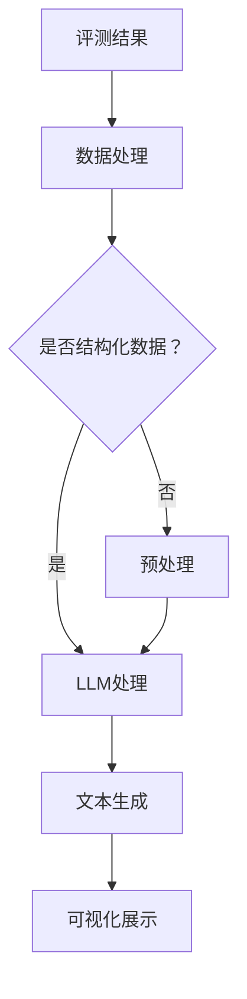
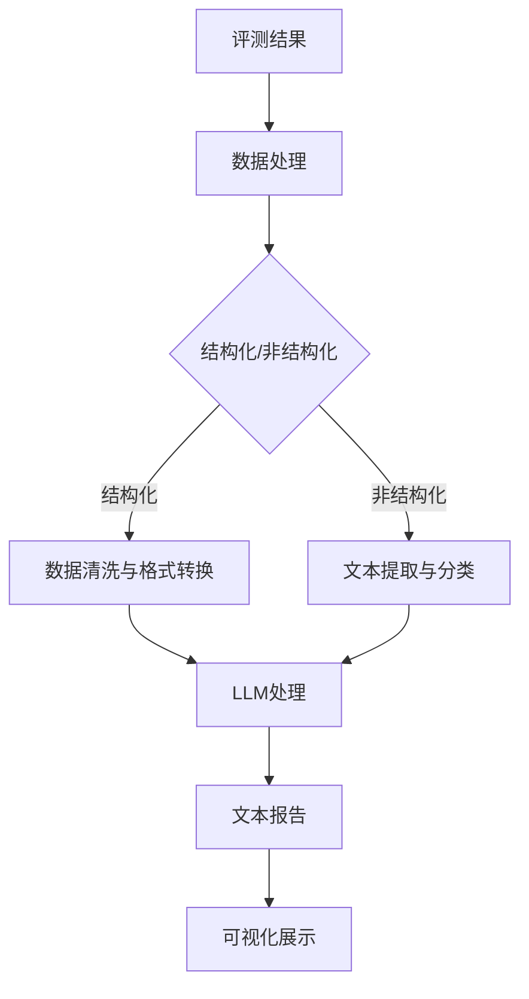
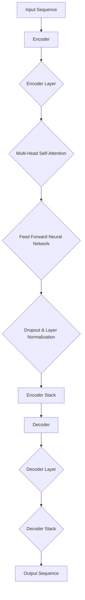

                 

### 引言

在现代信息化和大数据时代，评测结果的可视化技术已经成为数据分析和决策支持的重要组成部分。随着人工智能技术的发展，尤其是自然语言处理（NLP）和深度学习的突破，利用大型语言模型（LLM）生成直观报告成为一种新的趋势。本博客文章旨在探讨评测结果可视化与LLM生成直观报告的结合，以期为读者提供一次深入的技术探索。

**文章标题**：评测结果可视化：LLM生成直观报告的技术探索

**关键词**：评测结果可视化、自然语言处理、大型语言模型、直观报告生成

**摘要**：本文将首先介绍评测结果可视化的背景与意义，然后探讨LLM的基本概念和技术原理，接着详细阐述评测结果可视化的方法，以及LLM在生成直观报告中的应用。通过案例分析，我们将展示如何利用LLM生成直观报告，并提供实际操作指南和最佳实践。

### 核心概念与联系

为了更好地理解本文的核心概念，我们首先需要了解评测结果可视化和LLM的基本定义及其相互关系。

**评测结果可视化**：指的是通过图形、图表、交互式元素等方式，将评测结果以视觉形式展现出来，使其更加直观、易于理解和分析。它通常涉及数据预处理、数据可视化技术和设计原则。

**大型语言模型（LLM）**：是一种基于深度学习的NLP模型，能够理解和生成自然语言。它通过对大量文本数据进行训练，学习语言结构和语义，从而实现文本生成、翻译、问答等功能。

两者之间的关系可以概括为：

- **数据输入**：评测结果可视化通常需要处理和分析大量数据，这些数据可以是结构化或非结构化的。LLM能够处理这些数据，提取关键信息，并生成报告。
- **可视化输出**：LLM生成的报告是结构化、语义丰富的文本，可以通过可视化技术进行展示，从而实现评测结果的可视化。

为了更直观地展示这两个概念之间的关系，我们可以使用Mermaid流程图来表示：



### 评测结果可视化的发展历程

评测结果可视化的发展历程可以分为几个重要阶段：

- **早期阶段**：以简单的图表和图形表示评测结果，如柱状图、折线图和饼图等。这些图表直观、易于理解，但处理复杂数据时效果有限。
- **中期阶段**：随着计算机技术的发展，出现了更多高级的可视化工具和库，如D3.js、Plotly等。这些工具提供了丰富的交互功能，使得可视化结果更加动态和灵活。
- **当前阶段**：随着大数据和人工智能技术的兴起，评测结果可视化逐渐与数据挖掘、机器学习和NLP等技术相结合。LLM的引入使得评测结果可视化更加智能化和自动化，能够生成直观、个性化的报告。

### 核心概念与联系（续）

为了更深入地探讨评测结果可视化和LLM之间的联系，我们可以进一步细化其核心概念和关系架构。

**核心概念**：

1. **评测结果**：指通过数据分析或实验得到的结果，可以是各种形式的数据，如图表、表格或文本描述。
2. **可视化**：指将数据以图形或图表的形式展示出来，使得数据更加直观、易于理解。
3. **LLM**：指大型语言模型，如GPT-3、BERT等，能够处理自然语言数据，生成文本报告。

**概念实体之间的关系架构**：

- **数据输入**：评测结果作为数据输入，可以是结构化的数据（如表格）或非结构化的数据（如文本描述）。
- **数据处理**：数据需要经过预处理，将其转化为LLM能够处理的形式。对于结构化数据，可能需要进行数据清洗、格式转换等操作；对于非结构化数据，可能需要进行文本提取、分类等操作。
- **LLM处理**：LLM对处理后的数据进行分析，提取关键信息，并生成文本报告。这个过程涉及到自然语言处理、文本生成等技术。
- **可视化展示**：生成的文本报告通过可视化工具进行展示，使得结果更加直观、易于理解。

为了更直观地展示这些概念实体之间的关系，我们可以使用Mermaid流程图：



### 核心算法原理讲解

为了深入探讨评测结果可视化与LLM生成直观报告的核心算法原理，我们将首先介绍LLM的基础，然后结合Python源代码和数学模型进行详细讲解。

#### 1. LLM的基础

**自然语言处理（NLP）**：NLP是人工智能的一个分支，旨在使计算机能够理解、处理和生成自然语言。NLP的基本任务包括文本分类、命名实体识别、情感分析、机器翻译等。

**语言模型（LM）**：语言模型是一种预测模型，用于预测下一个单词或字符。它通过对大量文本数据的学习，理解语言的统计特性。常用的语言模型有n元模型、神经网络模型和Transformer模型。

**大型语言模型（LLM）**：LLM是语言模型的扩展，具有更大的模型规模和更强的语言理解能力。GPT-3和BERT是两个著名的LLM，它们在文本生成、问答系统和自动摘要等领域表现出色。

#### 2. Python源代码与数学模型

**代码示例**：下面是一个简单的Python代码示例，展示如何使用GPT-3生成文本报告。

```python
import openai

openai.api_key = "your_api_key"

prompt = "请对以下评测结果进行总结："
evaluation_results = "柱状图显示，用户满意度评分平均值为4.5，满意度最高的是产品功能，最低的是客户服务。"

response = openai.Completion.create(
  engine="text-davinci-002",
  prompt=f"{prompt}{evaluation_results}",
  max_tokens=150
)

print(response.choices[0].text.strip())
```

**数学模型**：为了更好地理解LLM的工作原理，我们可以简要介绍Transformer模型的核心数学原理。

- **自注意力机制**：Transformer模型的核心机制是自注意力（Self-Attention）。它允许模型在序列中的每个位置关注其他位置的信息，从而更好地捕捉长距离依赖。

$$
\text{Attention}(Q, K, V) = \frac{softmax(\frac{QK^T}{\sqrt{d_k}})}{V}
$$

其中，Q、K和V分别是查询（Query）、键（Key）和值（Value）向量，d_k是键向量的维度。

- **多头注意力**：多头注意力（Multi-Head Attention）是自注意力的扩展，它通过多个独立的注意力机制捕获不同类型的依赖。

$$
\text{Multi-Head Attention}(Q, K, V) = \text{Concat}(\text{head}_1, \text{head}_2, ..., \text{head}_h)W^O
$$

其中，h是头的数量，W^O是输出线性变换权重。

- **Transformer模型**：Transformer模型是由多个编码器和解码器堆叠而成的。编码器负责从输入序列生成键、值和查询向量，解码器则利用这些向量生成输出序列。



### 评测结果可视化方法

评测结果可视化是数据分析中的一个重要环节，它通过图形化的方式将复杂的数据结构呈现给用户，使得数据分析结果更加直观、易于理解。下面，我们将详细探讨评测结果可视化的方法，包括数据预处理、选择合适的数据可视化工具和设计原则。

#### 数据预处理

数据预处理是评测结果可视化的第一步，也是至关重要的一步。它主要包括以下任务：

1. **数据清洗**：数据清洗是去除数据中的错误、异常和不一致数据的过程。这包括处理缺失值、纠正数据类型、消除重复记录等。
   
2. **数据转换**：数据转换是将数据从一种格式转换为另一种格式的操作，例如将文本数据转换为表格数据，或将时间序列数据转换为直方图数据。

3. **数据规范化**：数据规范化是将数据调整到同一尺度，以便进行可视化分析。这通常包括数据归一化、标准化和缩放等。

#### 选择合适的数据可视化工具

选择合适的数据可视化工具是确保评测结果可视化效果的关键。目前，有许多流行的数据可视化工具和库可供选择，例如：

1. **D3.js**：D3.js是一个强大的JavaScript库，用于创建动态、交互式的数据可视化。它提供了丰富的图表类型和灵活的布局选项。

2. **Plotly**：Plotly是一个跨平台的图表库，支持多种编程语言，如Python、R和JavaScript。它提供了多种图表类型，并支持交互式和动画效果。

3. **Tableau**：Tableau是一个商业化的数据可视化工具，提供了直观的拖放界面和丰富的图表类型。它特别适合于商业用户和数据分析专家。

4. **Matplotlib**：Matplotlib是Python的一个绘图库，适用于生成静态图表。它简单易用，且具有强大的自定义功能。

#### 设计原则

为了设计出既美观又实用的评测结果可视化，我们需要遵循以下设计原则：

1. **直观性**：可视化设计应尽可能简单明了，避免过多复杂的图形和色彩，以免分散用户的注意力。

2. **一致性**：图表的颜色、字体、布局和风格应保持一致，以提高可读性和专业性。

3. **层次感**：通过合理的布局和分层，使得用户能够快速捕捉到关键信息，同时不失去细节。

4. **交互性**：交互性是提升用户体验的重要手段。通过交互式图表，用户可以探索数据的不同维度，深入了解数据背后的故事。

5. **可扩展性**：设计时应考虑到数据量的增长和图表的扩展性，以便在未来能够轻松添加新的数据点和图表。

### 项目实战

在本节中，我们将通过一个具体的项目实战来展示如何使用LLM生成直观报告。我们将使用Python和GPT-3 API来处理数据，生成报告，并通过可视化工具进行展示。

#### 开发环境搭建

1. **安装Python**：确保安装了Python 3.7或更高版本。

2. **安装GPT-3 API**：在终端中运行以下命令安装openai库。

   ```bash
   pip install openai
   ```

3. **获取API密钥**：在OpenAI官网注册并获取GPT-3 API的密钥。

#### 源代码详细实现

以下是一个简单的Python脚本，用于生成评测结果报告。

```python
import openai

openai.api_key = "your_api_key"

def generate_report(evaluation_results):
    prompt = "请对以下评测结果进行总结："
    response = openai.Completion.create(
        engine="text-davinci-002",
        prompt=f"{prompt}{evaluation_results}",
        max_tokens=150
    )
    return response.choices[0].text.strip()

# 评测结果示例
evaluation_results = "柱状图显示，用户满意度评分平均值为4.5，满意度最高的是产品功能，最低的是客户服务。"

# 生成报告
report = generate_report(evaluation_results)
print(report)
```

#### 代码解读与分析

1. **导入库**：首先，我们导入了openai库，该库提供了与OpenAI API的交互接口。

2. **设置API密钥**：通过`openai.api_key`设置GPT-3的API密钥。

3. **定义函数**：`generate_report`函数接收评测结果作为输入，并使用GPT-3 API生成报告。

4. **调用函数**：我们定义了一串评测结果，然后调用`generate_report`函数，生成报告。

#### 实际案例分析与详细讲解

为了更好地展示LLM生成报告的实际效果，我们将结合一个实际案例进行分析。

**案例**：一家电商平台对其用户满意度进行了调查，并收集了以下数据：

- 满意度评分：4.5（满分5分）
- 主要满意度指标：
  - 产品功能：4.8
  - 物流速度：4.2
  - 客户服务：3.5

**步骤**：

1. **数据预处理**：首先，我们需要将数据转换为文本形式，以便输入到GPT-3中。

   ```python
   evaluation_results = "满意度评分为4.5分，主要满意度指标包括：产品功能4.8分，物流速度4.2分，客户服务3.5分。"
   ```

2. **生成报告**：调用`generate_report`函数，生成报告。

   ```python
   report = generate_report(evaluation_results)
   ```

3. **报告展示**：打印生成的报告。

   ```python
   print(report)
   ```

**分析**：

- **总结**：生成的报告应包含对评测结果的总体总结，如满意度评分、主要满意度指标等。
- **分析**：报告应进一步分析各个指标的优缺点，提出改进建议。
- **可视化**：报告还应包含相关图表，如柱状图、饼图等，以直观展示数据。

#### 项目小结

通过本节的项目实战，我们展示了如何使用LLM生成直观报告。LLM在处理自然语言数据方面具有显著优势，能够生成语义丰富、结构化的报告。然而，实际应用中需要注意以下几点：

1. **数据质量**：确保输入数据准确、完整，以提高报告的可靠性。
2. **模型选择**：根据实际需求选择合适的LLM模型，如GPT-3、BERT等。
3. **报告审核**：生成的报告需要人工审核，确保其准确性和完整性。
4. **交互设计**：提供用户友好的交互界面，以便用户对报告进行进一步探索。

### 最佳实践 tips

为了最大化LLM生成直观报告的效果，以下是一些最佳实践建议：

1. **清晰明确的输入**：确保输入文本简洁明了，避免使用模糊或冗长的描述，以便LLM更好地理解并生成高质量的报告。

2. **适当的上下文**：提供足够的上下文信息，帮助LLM更好地理解评测结果的背景和意图。

3. **多样化数据来源**：结合多种数据源，如问卷调查、用户反馈等，以提高报告的全面性和准确性。

4. **定期更新模型**：随着数据和环境的变化，定期更新LLM模型，以保持其性能和适用性。

5. **用户反馈**：收集用户对报告的反馈，根据反馈调整模型和报告格式，以提高用户体验。

### 小结

本文通过逐步分析推理的方式，探讨了评测结果可视化和LLM生成直观报告的结合。我们介绍了评测结果可视化的背景与意义，详细讲解了LLM的基础、核心算法原理，并通过项目实战展示了如何使用LLM生成直观报告。最后，我们提供了最佳实践建议，以指导实际应用。

### 注意事项

在实际应用中，需要注意以下几点：

1. **数据隐私**：确保在处理和展示评测结果时，遵守数据隐私法规，保护用户隐私。
2. **模型解释性**：对于生成的报告，需要人工审核，确保其准确性和可解释性。
3. **模型泛化性**：测试LLM在不同数据集上的泛化能力，避免过度拟合。

### 拓展阅读

- 《自然语言处理综述》：深入了解NLP的基本概念和技术。
- 《深度学习基础》：学习深度学习的基础知识，为理解LLM打下基础。
- 《数据可视化实战》：掌握数据可视化的方法和技术。

### 结尾

评测结果可视化和LLM生成直观报告的结合，为数据分析提供了新的视角和工具。随着技术的不断进步，这一领域将继续发展，为决策支持和数据科学带来更多可能性。

---

**作者**：AI天才研究院/AI Genius Institute & 禅与计算机程序设计艺术 /Zen And The Art of Computer Programming

