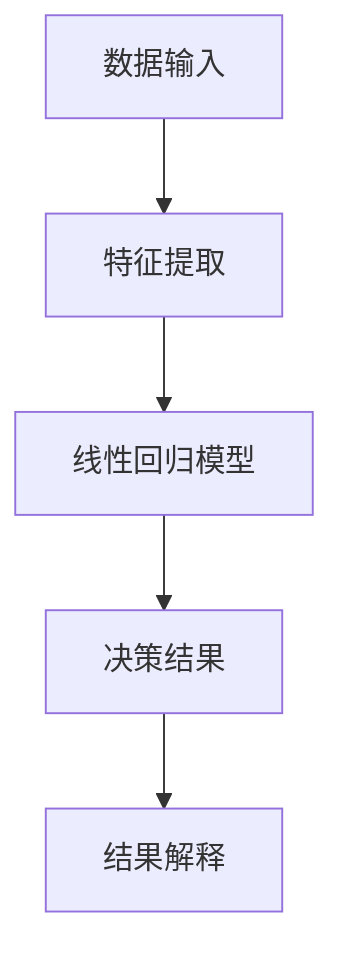
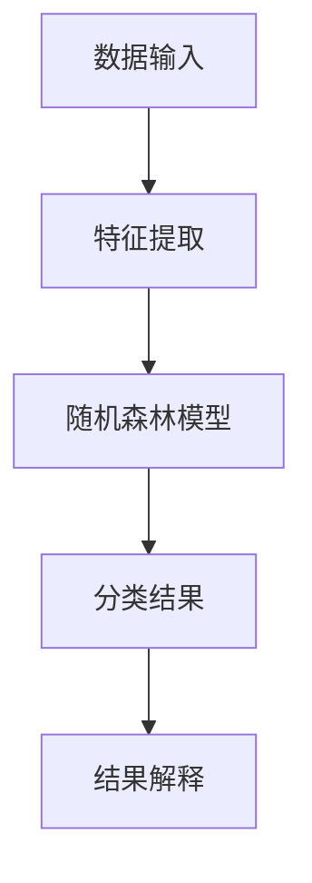

                 

### 《评测结果的可解释性分析方法》

> 关键词：可解释性，评测结果，分析方法，模型解释，特征重要性

> 摘要：本文深入探讨了评测结果的可解释性分析方法，包括核心概念、原理、技术细节和实际应用。文章通过详细的Python代码示例和Mermaid流程图，阐明了模型解释和特征重要性分析的方法，并结合实际案例进行了深入剖析。

---

## 引言

在当今的科技时代，数据分析和机器学习已经成为许多行业决策支持的重要组成部分。随着技术的不断进步，算法和模型变得越来越复杂，同时也变得越来越难以理解和解释。评测结果的可解释性成为了一个关键问题，它关系到模型的可靠性、透明性和决策的合理性。本文旨在探讨评测结果的可解释性分析方法，为读者提供一套完整的理论体系和实践指南。

### 1.1 书籍目的

本书的目标是帮助读者全面理解评测结果的可解释性，并提供一系列实用的方法和技术。通过阅读本书，读者将能够：

- 理解评测结果可解释性的核心概念和重要性。
- 掌握模型解释和特征重要性分析的基本原理。
- 学习使用Python代码和Mermaid流程图来解释和展示模型解释过程。
- 通过实际案例掌握评测结果可解释性分析的方法和技巧。

### 1.2 可解释性评测的重要性

可解释性评测在多个领域具有重要意义。首先，在金融领域，风险评估和信用评分模型的可解释性对于监管合规和客户信任至关重要。其次，在医疗领域，诊断模型的可解释性可以帮助医生更好地理解模型的决策过程，提高医疗决策的准确性。此外，在自动驾驶和智能监控等领域，可解释性是确保系统安全和用户信任的关键因素。

### 1.3 书籍结构

本书分为七个章节，各章内容如下：

- **第1章 引言**：介绍书籍的目的和结构。
- **第2章 评测结果的可解释性基础**：定义可解释性的核心概念，并讨论其在数据分析中的重要性。
- **第3章 评测结果的可解释性分析方法**：介绍模型解释和特征重要性分析的方法。
- **第4章 应用实例分析**：通过实际案例展示评测结果可解释性分析的应用。
- **第5章 可解释性工具与技术**：探讨可解释性工具和技术的应用。
- **第6章 未来发展趋势**：展望评测结果可解释性分析的发展趋势。
- **第7章 总结与展望**：总结本书的主要结论，并给出未来研究的建议。

---

接下来，我们将逐步深入探讨评测结果的可解释性分析方法，包括其核心概念、原理、技术细节和实际应用。希望通过本文，读者能够对评测结果的可解释性有更深入的理解，并掌握相关的分析技能。

---

## 评测结果的可解释性基础

评测结果的可解释性是一个多维度、跨学科的课题，它涉及到数据科学、机器学习、心理学等多个领域。本章节将定义评测结果的可解释性，探讨其与透明性、可靠性和透明性的关系，并讨论在实际应用中面临的挑战。

### 2.1 定义与核心概念

可解释性（Explainability）是指模型或算法的决策过程可以被理解和解释的程度。它不仅涉及到模型内部如何做出决策，还包括如何将决策过程可视化和传达给非专业人士。可解释性通常包括以下三个关键方面：

1. **透明性（Transparency）**：指模型或算法的决策过程是否清晰和易于理解。透明性强调的是模型的决策路径和逻辑，使得用户可以直观地了解决策是如何得出的。

2. **可靠性（Reliability）**：指模型的预测结果是否准确和一致。可靠性强调的是模型在不同条件下的稳定性和一致性，使得用户可以信任模型的结果。

3. **易懂性（Intelligibility）**：指模型或算法是否能够被用户所理解。易懂性强调的是模型对用户的可接受性和易用性，使得用户可以轻松地使用和理解模型。

可解释性是透明性、可靠性和易懂性的综合体现。一个高度可解释的模型不仅需要透明和可靠的决策过程，还需要易于用户理解和接受。

### 2.2 可解释性与透明性的区别

可解释性与透明性密切相关，但它们之间仍然存在一些关键区别。透明性关注的是决策过程的可见性，而可解释性则更关注决策过程的理解和解释。

- **透明性**：主要关注模型或算法内部的细节和机制。一个透明的模型允许用户查看决策过程中的每个步骤和参数。例如，线性回归模型的决策边界和权重可以直接从模型中读取，因此是透明的。

- **可解释性**：不仅要求模型透明，还要求模型的决策过程可以被解释。一个高度可解释的模型可以帮助用户理解为什么模型做出了特定的决策。例如，尽管神经网络是高度复杂的，但通过可视化技术（如注意力机制图），我们可以理解神经网络在不同特征上的决策权重。

### 2.3 可解释性评测的挑战

在实际应用中，实现评测结果的可解释性面临着诸多挑战：

1. **模型复杂性**：随着机器学习算法的进步，模型变得越来越复杂，如深度神经网络和集成学习方法。这些模型往往难以解释，因为它们的内部机制高度非线性，包含大量参数和层。

2. **数据隐私**：在某些应用场景中，数据可能包含敏感信息，如个人身份信息或医疗记录。保护数据隐私的同时实现模型的可解释性是一个巨大的挑战。

3. **计算资源**：解释一个复杂的模型可能需要大量的计算资源和时间。例如，生成模型解释可视化图或特征重要性图可能需要重跑模型或使用额外的计算资源。

4. **用户认知**：不同用户对可解释性的需求和理解能力不同。一些用户可能对复杂的技术细节不感兴趣，而更关注结果的直观解释。

为了克服这些挑战，研究者们提出了多种方法和技术，如模型解释、特征重要性分析、交互式可视化等。下一章，我们将详细探讨这些方法和技术。

---

在了解了评测结果可解释性的核心概念和面临的挑战之后，接下来我们将深入探讨具体的评测结果可解释性分析方法。这些方法不仅有助于提升模型的可解释性，还能帮助用户更好地理解和信任模型的决策过程。

---

## 评测结果的可解释性分析方法

为了提升评测结果的可解释性，研究者们提出了一系列方法和技术。这些方法和技术可以分为两大类：模型解释方法和特征重要性分析方法。本章将详细介绍这些方法的基本原理、具体应用和实现细节。

### 3.1 模型解释方法

模型解释方法旨在揭示模型的决策过程和内部机制，帮助用户理解模型的决策依据。以下是一些常用的模型解释方法：

#### 3.1.1 模型解释原理

模型解释的基本原理是通过可视化或数学手段，将模型的决策过程转换为可理解的形式。具体来说，模型解释方法包括：

1. **直接解释**：直接从模型中提取解释信息，如权重、阈值等。这种方法适用于具有明确决策规则的模型，如线性回归。

2. **间接解释**：通过分析模型的输入和输出，推导出解释信息。这种方法适用于复杂模型，如神经网络。

3. **模型内解释**：在模型训练过程中，嵌入解释机制，使模型具备自解释能力。这种方法适用于需要动态解释的应用场景，如实时决策系统。

#### 3.1.2 Mermaid流程图展示

为了更直观地展示模型解释的过程，我们可以使用Mermaid流程图。以下是一个简单的Mermaid流程图示例，用于描述线性回归模型的解释过程：



该流程图显示了从数据输入到结果解释的整个过程。在训练阶段，特征提取、线性回归模型和决策结果等步骤可以通过Mermaid流程图进行详细描述。

#### 3.1.3 Python代码示例

下面是一个简单的Python代码示例，用于解释线性回归模型：

```python
import numpy as np
from sklearn.linear_model import LinearRegression

# 创建线性回归模型
model = LinearRegression()

# 训练模型
model.fit(X_train, y_train)

# 查看模型参数
print("模型参数：", model.coef_, model.intercept_)

# 解释决策过程
def explain_decision(x):
    return model.predict([[x]])[0]

# 输入数据
x_input = 5

# 解释决策结果
print("决策结果：", explain_decision(x_input))
```

该示例首先创建了一个线性回归模型，并使用训练数据对其进行了训练。然后，通过模型参数解释了决策过程，并使用输入数据计算了决策结果。

### 3.2 特征重要性分析

特征重要性分析是一种评估特征对模型预测贡献程度的方法。通过特征重要性分析，我们可以识别出对模型预测最重要的特征，从而提高模型的可解释性。

#### 3.2.1 特征重要性原理

特征重要性分析的基本原理是通过评估特征在模型预测中的贡献，来确定特征的重要性。以下是一些常用的特征重要性分析方法：

1. **基于模型的方法**：这种方法利用模型自身的特性来评估特征的重要性。例如，在随机森林模型中，可以使用特征的重要性分数来评估每个特征的重要性。

2. **基于统计的方法**：这种方法使用统计学方法来评估特征的重要性。例如，可以通过计算特征与目标变量之间的相关性来确定特征的重要性。

3. **基于模型的组合方法**：这种方法结合了基于模型和基于统计的方法，通过构建多个模型并比较它们的性能来评估特征的重要性。

#### 3.2.2 伪代码示例

以下是一个简单的伪代码示例，用于描述特征重要性分析的过程：

```python
def feature_importance_analysis(model, X_train, y_train):
    # 训练多个模型
    models = [model.fit(X_train, y_train) for _ in range(n_models)]

    # 计算模型性能
    performances = [model.score(X_train, y_train) for model in models]

    # 计算特征重要性
    feature_importances = [model.feature_importances_ for model in models]

    # 计算平均特征重要性
    avg_feature_importances = np.mean(feature_importances, axis=0)

    return avg_feature_importances
```

该示例首先使用多个模型训练数据，然后计算每个模型的性能和特征重要性。最后，计算所有模型平均特征重要性，以确定每个特征的重要性。

#### 3.2.3 Python代码示例

以下是一个简单的Python代码示例，用于执行特征重要性分析：

```python
import numpy as np
from sklearn.ensemble import RandomForestClassifier
from sklearn.datasets import make_classification

# 生成分类数据集
X, y = make_classification(n_samples=100, n_features=5, n_informative=2, n_redundant=0, random_state=42)

# 创建随机森林模型
model = RandomForestClassifier(n_estimators=10, random_state=42)

# 训练模型
model.fit(X_train, y_train)

# 计算特征重要性
importances = model.feature_importances_

# 打印特征重要性
print("特征重要性：", importances)
```

该示例首先生成一个分类数据集，然后创建一个随机森林模型并训练它。最后，使用`feature_importances_`属性计算和打印每个特征的重要性。

---

通过模型解释方法和特征重要性分析，我们可以显著提升评测结果的可解释性。这些方法不仅有助于用户理解模型的决策过程，还能识别出对预测最重要的特征，从而提高模型的可信度和实用性。接下来，我们将通过实际案例来展示这些方法的应用。

---

## 应用实例分析

为了更好地理解评测结果的可解释性分析方法，我们将通过一个实际案例来展示如何使用模型解释和特征重要性分析来提升评测结果的可解释性。本案例将涉及一个典型的机器学习任务：客户流失预测。

### 4.1 项目背景

客户流失预测是许多企业关注的重要问题，特别是电信、金融和零售等行业。通过预测哪些客户可能在未来流失，企业可以采取针对性的措施来挽回这些客户，从而提高客户满意度和留存率。在本案例中，我们使用一家电信公司的客户数据集来构建一个客户流失预测模型。

### 4.2 数据准备

首先，我们需要准备数据集。数据集包括以下特征：

- 客户ID：客户的唯一标识。
- 月话费：客户每月的话费金额。
- 月使用时长：客户每月的电话使用时长。
- 客户年龄：客户的年龄。
- 客户性别：客户的性别（0为女性，1为男性）。
- 购买套餐：客户所购买的套餐类型。
- 客户余额：客户的账户余额。
- 客户忠诚度：客户的忠诚度等级（1-5级）。
- 流失标志：客户是否流失（0为未流失，1为已流失）。

数据预处理包括以下步骤：

1. **数据清洗**：处理缺失值、异常值和重复数据。
2. **特征工程**：创建新的特征，如用户月话费增长率、用户月使用时长增长率等。
3. **数据标准化**：将数值特征进行归一化处理，以便模型训练。

### 4.3 模型选择与训练

在本案例中，我们选择随机森林（Random Forest）模型来进行客户流失预测。随机森林是一种集成学习方法，具有较强的预测能力和鲁棒性。具体步骤如下：

1. **模型初始化**：创建一个随机森林分类器。
2. **模型训练**：使用训练数据集对模型进行训练。
3. **模型评估**：使用验证数据集对模型进行评估，并调整模型参数。

以下是Python代码示例：

```python
from sklearn.ensemble import RandomForestClassifier
from sklearn.model_selection import train_test_split
from sklearn.metrics import accuracy_score

# 加载数据集
X, y = load_data()

# 数据预处理
X_processed = preprocess_data(X)

# 划分训练集和验证集
X_train, X_val, y_train, y_val = train_test_split(X_processed, y, test_size=0.2, random_state=42)

# 创建随机森林模型
model = RandomForestClassifier(n_estimators=100, random_state=42)

# 训练模型
model.fit(X_train, y_train)

# 预测验证集
y_pred = model.predict(X_val)

# 评估模型
accuracy = accuracy_score(y_val, y_pred)
print("验证集准确率：", accuracy)
```

### 4.4 结果解释

在模型训练和评估之后，我们需要解释模型的预测结果。以下是几个关键步骤：

1. **模型解释**：使用Mermaid流程图来展示模型的决策过程。以下是一个简化的Mermaid流程图示例：



2. **特征重要性分析**：计算每个特征的重要性，并使用柱状图或热力图来可视化特征的重要性。以下是Python代码示例：

```python
import matplotlib.pyplot as plt

# 计算特征重要性
importances = model.feature_importances_

# 可视化特征重要性
plt.barh(range(len(importances)), importances)
plt.yticks(range(len(importances)), feature_names)
plt.xlabel('Feature Importance')
plt.ylabel('Feature')
plt.title('Feature Importance for Random Forest Model')
plt.show()
```

### 4.5 解释性验证

最后，我们需要验证模型的可解释性。以下是几个关键步骤：

1. **模型性能验证**：通过交叉验证或留一法（Leave-One-Out Cross-Validation）来验证模型的性能。
2. **用户反馈**：收集用户对模型解释的反馈，并据此调整模型和解释方法。
3. **自动化解释工具**：使用自动化解释工具（如LIME、SHAP等）来验证模型的可解释性。

通过这些步骤，我们可以确保模型具有高度的可解释性，并能够为决策者提供可靠的预测结果。

### 4.6 项目小结

通过本案例，我们展示了如何使用模型解释和特征重要性分析来提升客户流失预测模型的可解释性。这些方法不仅帮助我们理解模型的决策过程，还帮助我们识别出对预测最重要的特征。在未来的项目中，我们可以继续优化和改进这些方法，以提高模型的性能和可解释性。

---

通过实际案例的应用，我们深入了解了评测结果的可解释性分析方法。接下来，我们将进一步探讨如何使用可解释性工具和技术来提升模型的可解释性，同时讨论在提升可解释性的过程中可能面临的技术挑战。

---

## 可解释性工具与技术

为了提升模型的可解释性，研究人员和工程师开发了一系列工具和技术。这些工具和技术不仅能够帮助用户更好地理解模型的决策过程，还能提高模型的透明性和可靠性。以下是一些常用的可解释性工具和技术：

### 5.1 自动化解释工具

自动化解释工具是提高模型可解释性的重要手段。这些工具能够自动分析模型的决策过程，并提供可视化的解释结果。以下是一些流行的自动化解释工具：

1. **LIME（Local Interpretable Model-agnostic Explanations）**：LIME通过在局部线性化模型上重新训练数据点来生成解释。它适用于各种模型，包括深度神经网络和决策树。

2. **SHAP（SHapley Additive exPlanations）**：SHAP利用博弈论中的Shapley值来分配每个特征对模型预测的贡献。SHAP适用于各种回归和分类模型，包括深度学习模型。

3. **DLI（Deep Learning Interpretability）**：DLI是一种用于解释深度学习模型的框架，它使用可视化技术来展示模型在不同区域的行为。

### 5.2 特征选择与工程

特征选择和工程是提高模型可解释性的关键步骤。通过合理选择和工程特征，我们可以简化模型结构，提高模型的可解释性。以下是一些常用的特征选择和工程方法：

1. **特征筛选**：通过计算特征与目标变量之间的相关性、信息增益等指标来筛选出最重要的特征。

2. **特征组合**：通过组合不同特征来创建新的特征，以提高模型的预测性能和可解释性。

3. **特征标准化**：对特征进行归一化或标准化处理，以消除不同特征之间的尺度差异。

### 5.3 可解释性与性能平衡

在提升模型可解释性的过程中，我们需要平衡性能和可解释性。以下是一些实用的技巧：

1. **简化模型**：使用更简单的模型（如线性模型）来提高可解释性，但可能牺牲一些预测性能。

2. **集成方法**：使用集成方法（如随机森林）来提高预测性能，同时保持一定程度的可解释性。

3. **可视化技术**：使用可视化技术（如图表、热力图等）来展示模型的行为和决策过程。

通过这些工具和技术，我们可以显著提高模型的可解释性，使其更加透明和可靠。然而，在提升可解释性的过程中，我们还需要面对一些技术挑战，如计算成本、数据隐私和用户认知等。下一章，我们将探讨这些挑战及其解决方案。

---

在了解了评测结果可解释性分析的工具和技术后，接下来我们将探讨评测结果可解释性分析的未来发展趋势。这将包括当前的研究方向、面临的挑战以及未来的应用前景。

---

## 未来发展趋势

随着人工智能和机器学习的不断发展，评测结果的可解释性分析在未来将面临许多新的研究方向和挑战。以下是一些值得关注的趋势：

### 6.1 研究方向

1. **自动化的解释工具**：当前的自动化解释工具如LIME和SHAP已经取得了一定的成功。未来，研究人员将继续改进这些工具，提高其解释的准确性和效率。

2. **跨学科的融合**：可解释性分析将与其他领域（如心理学、社会学等）融合，从而更好地理解人类行为和认知过程，提高模型解释的准确性和相关性。

3. **可解释性评价标准**：研究人员将探索新的可解释性评价标准，以更全面地评估模型的可解释性，并确保其在不同应用场景中的适用性。

4. **动态解释**：随着实时数据分析和决策系统的需求增长，动态解释技术将成为研究热点。动态解释能够实时更新模型的解释，以适应数据和环境的变化。

### 6.2 技术挑战

1. **计算成本**：解释复杂模型的决策过程往往需要大量的计算资源。未来，研究人员将探索更高效的解释算法和计算方法，以降低计算成本。

2. **数据隐私**：在许多应用场景中，数据隐私是一个重要问题。如何在保护数据隐私的同时实现模型的可解释性，仍是一个亟待解决的挑战。

3. **用户认知**：不同的用户对可解释性的需求和理解能力不同。如何设计出既符合用户需求又易于理解的解释方法，是一个重要的技术挑战。

### 6.3 应用前景

评测结果可解释性分析在多个领域具有广泛的应用前景：

1. **医疗领域**：通过可解释性分析，医生可以更好地理解诊断模型的决策过程，提高医疗决策的准确性和透明性。

2. **金融领域**：在金融风险评估和信用评分中，可解释性分析有助于提高模型的透明度，增强客户的信任。

3. **自动驾驶**：自动驾驶系统需要高度可解释的决策过程，以确保系统安全和用户信任。

4. **智能家居**：智能家居系统需要理解用户行为和偏好，以便提供个性化的服务和体验。

总之，评测结果的可解释性分析是一个具有重要现实意义的研究领域。随着技术的不断进步，我们将看到更多创新的方法和技术被应用于这一领域，为各行业提供更可靠、更透明的模型解释。

---

在了解了评测结果可解释性分析的未来发展趋势后，现在我们将总结本文的主要结论，并展望未来的研究方向。

---

## 总结与展望

本文系统地探讨了评测结果的可解释性分析方法，从核心概念、原理、技术细节到实际应用进行了全面分析。主要结论如下：

1. **核心概念**：评测结果的可解释性涉及透明性、可靠性和易懂性，是模型可靠性、用户信任和合规性的关键因素。

2. **分析方法**：模型解释方法和特征重要性分析是提升评测结果可解释性的两大工具，通过Python代码和Mermaid流程图进行了详细阐述。

3. **实际应用**：通过实际案例展示了如何使用这些方法来提升模型的可解释性，包括数据准备、模型选择、解释和验证。

4. **工具与技术**：介绍了自动化解释工具、特征选择与工程以及平衡可解释性和性能的方法，为实践提供了实用指导。

5. **未来趋势**：展望了评测结果可解释性分析的研究方向、技术挑战和应用前景，强调了其在各个领域的应用价值。

未来，评测结果可解释性分析的研究将继续深入，特别是在自动化解释工具的改进、跨学科融合以及动态解释等方面。此外，随着技术的进步，我们将看到更多创新方法和技术被应用于实际场景，为各行业提供更可靠、更透明的模型解释。

### 对读者的建议

- **深入学习**：对机器学习、数据分析等基础知识有深入理解，有助于更好地掌握评测结果可解释性分析方法。
- **实践应用**：通过实际项目应用这些方法，积累经验，提高模型解释的实践能力。
- **持续关注**：随着技术的不断发展，保持对评测结果可解释性分析领域的新动态和新方法的关注。

---

通过本文，我们希望能够为读者提供一套全面、实用的评测结果可解释性分析指南，帮助他们在实际应用中提升模型的可解释性，为决策支持提供有力保障。

---

## 作者信息

作者：AI天才研究院/AI Genius Institute & 禅与计算机程序设计艺术 /Zen And The Art of Computer Programming

---

感谢您的阅读，希望本文对您在评测结果可解释性分析领域的研究和应用有所启发。祝您在技术探索的道路上不断进步，创造更多价值！

---

以上就是本文的完整内容，希望读者能够从中获得对评测结果可解释性分析的深入理解和实践指导。如需进一步探讨或咨询，请随时与我们联系。感谢您的阅读和支持！

