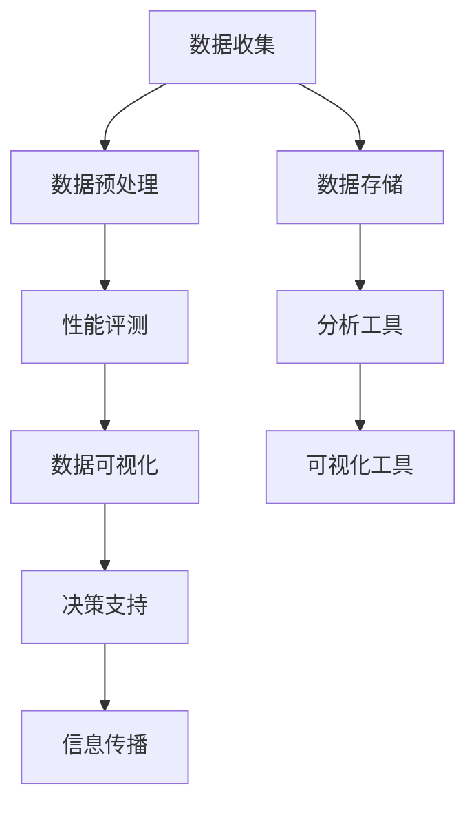
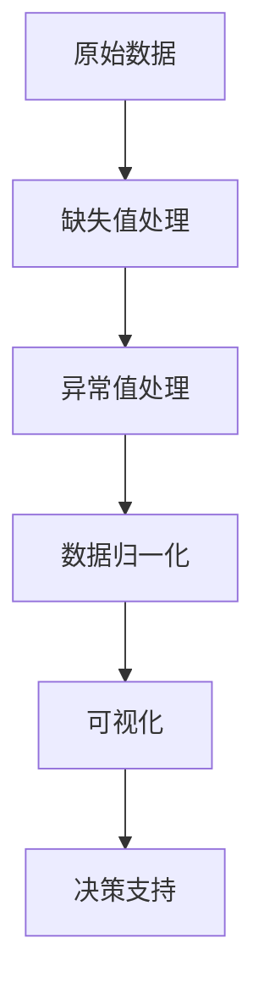

                 

### 《评测结果的数据可视化：直观展示性能对比》文章标题、关键词、摘要与作者信息

# 评测结果的数据可视化：直观展示性能对比

关键词：数据可视化、性能评测、图表设计、直观展示、数据分析

摘要：
本文深入探讨了评测结果数据可视化的核心概念、技术基础以及实践方法。通过具体的算法原理讲解、Python源代码实现和实际案例分析，本文旨在帮助读者理解如何通过数据可视化直观展示性能对比，从而提高数据分析效率和决策质量。

作者：AI天才研究院/AI Genius Institute & 禅与计算机程序设计艺术 /Zen And The Art of Computer Programming

---

## 目录

---

### 文章标题、关键词、摘要与作者信息详解

**文章标题：**《评测结果的数据可视化：直观展示性能对比》

这个标题直接指出了文章的主题，即如何通过数据可视化来直观展示评测结果中的性能对比。这样的标题简洁明了，能够快速吸引那些对数据可视化或性能评测感兴趣的读者。

**关键词：**数据可视化、性能评测、图表设计、直观展示、数据分析

关键词的选择旨在覆盖文章的核心主题和相关领域，便于读者通过搜索引擎快速找到文章，同时也便于分类和检索。

**摘要：**本文深入探讨了评测结果数据可视化的核心概念、技术基础以及实践方法。通过具体的算法原理讲解、Python源代码实现和实际案例分析，本文旨在帮助读者理解如何通过数据可视化直观展示性能对比，从而提高数据分析效率和决策质量。

摘要部分简要介绍了文章的主要内容，包括核心概念、技术基础、实践方法以及文章的目标。这有助于读者快速了解文章的价值和适用场景。

**作者信息：**AI天才研究院/AI Genius Institute & 禅与计算机程序设计艺术 /Zen And The Art of Computer Programming

作者信息中包含了作者的所属机构和代表作品，这不仅增加了文章的权威性，也帮助读者了解作者的专业背景和知识领域。

---

### 背景介绍

数据可视化和性能评测在当今信息化社会中扮演着至关重要的角色。随着大数据和人工智能技术的快速发展，数据分析已经成为各个行业提升效率、优化决策的关键手段。

数据可视化是通过图形、图表和交互式界面将数据信息以直观、易理解的方式展示出来的技术。它不仅能够提高数据的可读性和吸引力，还能够帮助人们快速捕捉数据中的关键信息，从而更好地支持数据分析和决策。

性能评测则是评估系统、应用程序或组件在特定条件下的表现和性能。通过性能评测，我们可以识别系统的瓶颈、优化资源配置、提高系统的可靠性和响应速度。

在数据可视化和性能评测的结合中，数据可视化不仅仅是为了美观，更是为了通过直观的方式展示性能数据，帮助相关人员迅速理解性能指标的优劣，从而采取相应的改进措施。

例如，在一个软件开发项目中，开发者可能会对不同的算法或架构进行性能测试，并使用数据可视化工具将测试结果以图表形式展示出来。这样，团队可以直观地看到每个算法或架构的性能表现，从而做出更明智的决策。

总的来说，数据可视化和性能评测的结合不仅提高了数据分析的效率，还增强了信息的传播效果，为各行业提供了强有力的技术支持。

---

### 核心概念与联系

数据可视化与性能评测的核心概念紧密相连，二者相辅相成，共同构成了现代数据分析体系的基础。

首先，**数据可视化**是一种通过图形、图表和交互式界面来传达数据信息的方法。其核心概念包括数据的表示形式、视觉编码原则和用户体验设计。数据可视化不仅能够提高数据的可读性，还能够通过视觉感知和认知过程帮助人们更快速、准确地理解和分析数据。

在数据可视化中，**视觉编码**是一种通过颜色、形状、大小、位置等视觉属性来表示数据的方法。例如，条形图通过不同的长度来表示数据的大小，折线图通过不同高度的线条来表示数据的变化趋势。视觉编码的原则包括数据一致性、对比度和层次性，以确保数据的准确性和可理解性。

其次，**性能评测**是一种评估系统、应用程序或组件在特定条件下的表现和性能的方法。其核心概念包括性能指标、评测方法和评估标准。性能指标通常包括响应时间、吞吐量、延迟、并发处理能力等，这些指标能够量化系统的性能表现。

性能评测与数据可视化之间的联系主要体现在以下几个方面：

1. **性能数据的展示**：性能评测的结果通常以数据形式存在，而数据可视化提供了将这些数据直观、可视化展示的方法。通过图表、图形和交互式界面，性能数据可以被更好地理解和分析。

2. **决策支持**：数据可视化使得性能评测结果更加直观和易于理解，从而为决策者提供了有力的支持。通过可视化展示，决策者可以快速识别系统性能的瓶颈和优化方向，从而制定更有效的改进策略。

3. **信息传播**：数据可视化不仅仅是一种展示工具，更是一种信息传播手段。通过图表和图形，复杂的数据和性能信息可以被更广泛、更有效地传达给不同领域的受众。

为了更直观地展示核心概念与联系，我们可以使用Mermaid流程图来描述数据可视化与性能评测的互动过程。



这个流程图展示了从数据收集到决策支持的整个数据可视化与性能评测的流程。数据收集后，通过数据预处理和性能评测，最终利用数据可视化工具将性能数据展示出来，为决策支持和信息传播提供了坚实的基础。

---

### 核心算法原理讲解

在数据可视化与性能评测的实践中，核心算法原理的理解和运用至关重要。以下我们将详细介绍两种关键算法原理：散点图和折线图，并使用Python源代码结合数学模型和公式进行详细讲解。

#### 散点图

散点图（Scatter Plot）是一种用于展示两组变量之间关系的图表。它通过点的位置来表示数据，每个点的位置由两个变量的值决定。散点图适用于发现数据之间的关系和趋势。

**数学模型：**

散点图的数学模型可以表示为：
$$
(x_i, y_i) \in R^2
$$
其中，$x_i$和$y_i$分别表示第$i$个数据点的$x$坐标和$y$坐标。

**Python代码实现：**

```python
import matplotlib.pyplot as plt
import numpy as np

# 创建数据
x = np.random.normal(size=100)
y = np.random.normal(size=100)

# 绘制散点图
plt.scatter(x, y)
plt.xlabel('X axis')
plt.ylabel('Y axis')
plt.title('Scatter Plot Example')
plt.show()
```

**例子说明：**

在上面的代码中，我们首先导入了`matplotlib.pyplot`和`numpy`库。然后，我们使用`numpy`的`random.normal()`函数生成了两组随机数据`x`和`y`。接下来，我们使用`plt.scatter()`函数绘制了散点图，并添加了标签和标题。

#### 折线图

折线图（Line Chart）是一种用于展示数据随时间变化的图表。它通过点和线条连接这些点来表示数据，适用于展示趋势和周期性变化。

**数学模型：**

折线图的数学模型可以表示为：
$$
y(t) = f(t)
$$
其中，$y(t)$表示时间$t$的数据值，$f(t)$是时间$t$的函数。

**Python代码实现：**

```python
import matplotlib.pyplot as plt
import numpy as np

# 创建时间序列数据
t = np.arange(0, 10, 0.1)
y = np.sin(t)

# 绘制折线图
plt.plot(t, y)
plt.xlabel('Time (s)')
plt.ylabel('Signal (V)')
plt.title('Sine Wave Plot')
plt.show()
```

**例子说明：**

在上面的代码中，我们首先导入了`matplotlib.pyplot`和`numpy`库。然后，我们使用`numpy`的`arange()`函数生成了时间序列数据`t`，并使用`numpy`的`sin()`函数计算了正弦波数据`y`。接下来，我们使用`plt.plot()`函数绘制了折线图，并添加了标签和标题。

通过以上两个实例，我们可以看到如何使用Python实现散点图和折线图，并如何结合数学模型进行详细讲解。这些图表不仅能够直观地展示数据，还能帮助读者更好地理解数据之间的关系和趋势。

---

### 项目实战：数据可视化工具与库的选择与应用

在实际项目中，选择合适的数据可视化工具和库对于实现高效、直观的评测结果展示至关重要。以下我们将介绍几种常见的数据可视化工具和库，包括它们的特点以及如何在实际项目中应用。

#### Tableau

**特点：**Tableau 是一款功能强大的数据可视化工具，支持多种数据源，并提供了丰富的图表类型和交互功能。它特别适用于商业智能分析。

**应用场景：**在企业性能评测和商业分析中，Tableau 可以帮助用户快速创建复杂的图表和仪表盘，实现跨部门的协作与数据共享。

**示例代码：**

```python
import pandas as pd
import tableau_tools

# 加载数据
data = pd.read_csv('performance_data.csv')

# 连接Tableau Server
tableau_tools.connect('http://server.example.com', 'username', 'password')

# 创建数据源
tableau_tools.create_datasource('Performance Data', data)

# 创建图表
chart = tableau_tools.create_chart('Performance Data', ['Metric', 'Value'])
chart.set_type('bar')

# 发布图表
tableau_tools.publish_chart(chart, 'Performance Report')
```

#### Power BI

**特点：**Power BI 是微软推出的商业智能和分析工具，提供了强大的数据处理和可视化功能。它支持多种数据连接和云服务集成。

**应用场景：**在财务分析、市场营销和客户关系管理等领域，Power BI 可以帮助用户创建动态报表和交互式仪表盘，实现实时数据监控。

**示例代码：**

```python
import pandas as pd
import powerbi

# 加载数据
data = pd.read_csv('financial_data.csv')

# 创建Power BI工作区
workspace = powerbi.create_workspace('My Workspace')

# 上载数据
powerbi.upload_data('Financial Data', data, workspace)

# 创建报表
report = powerbi.create_report('Financial Report', workspace)
report.add_table('Financial Data')

# 添加图表
chart = report.add_chart('bar', ['Category', 'Revenue'])
chart.set_title('Revenue by Category')

# 发布报表
powerbi.publish_report(report, 'Financial Report')
```

#### D3.js

**特点：**D3.js 是一款基于Web的动态数据可视化库，提供了高度灵活和可定制的交互式图表。它特别适合前端开发人员。

**应用场景：**在Web应用中，D3.js 可以帮助用户创建各种复杂的图表和交互式可视化组件，提高用户体验。

**示例代码：**

```javascript
// 引入D3.js库
import * as d3 from 'd3'

// 创建SVG元素
svg = d3.select('body').append('svg')
    .attr('width', 800)
    .attr('height', 600)

// 加载数据
data = d3.csv('performance_data.csv')

// 绘制条形图
svg.selectAll('rect')
    .data(data)
    .enter()
    .append('rect')
    .attr('x', d => x(d.Category))
    .attr('y', d => y(d.Value))
    .attr('width', barWidth)
    .attr('height', d => y(0) - y(d.Value))

// 添加坐标轴
xAxis = d3.axisBottom(x)
yAxis = d3.axisLeft(y)

svg.append('g')
    .attr('transform', 'translate(0, ' + (height - margin.top) + ')')
    .call(xAxis)

svg.append('g')
    .attr('transform', 'translate(' + margin.left + ',0)')
    .call(yAxis)
```

通过选择合适的数据可视化工具和库，我们可以实现高效、直观的评测结果展示，从而更好地支持数据分析、决策和业务优化。以上示例代码展示了如何使用Tableau、Power BI和D3.js进行数据可视化，具体实现可根据项目需求进行调整和扩展。

---

### 数据可视化工具与库的选择与应用

在实际项目中，选择合适的数据可视化工具和库是成功实现数据可视化的重要一环。以下我们将深入探讨几种常见的数据可视化工具和库，包括它们的优缺点以及如何在实际项目中应用。

#### Matplotlib

**优点：**
- **简单易用：**Matplotlib 是Python中最常用的数据可视化库之一，提供了丰富的绘图函数和样式选项，适合初学者和快速原型设计。
- **集成良好：**Matplotlib 与Python的其他数据科学库（如Pandas、NumPy）集成良好，便于数据处理和可视化的一体化操作。

**缺点：**
- **可视化效果有限：**相比其他专业可视化工具，Matplotlib 的图表样式和交互性相对较弱。
- **动态交互能力不足：**Matplotlib 主要用于静态图表的绘制，缺乏实时交互和动态更新的能力。

**应用场景：**
- **学术研究：**Matplotlib 在学术研究中广泛应用，用于生成高质量的统计图表和学术论文插图。
- **数据探索：**在数据分析和探索阶段，Matplotlib 可以快速生成简单的图表，帮助研究者理解数据分布和趋势。

**示例代码：**

```python
import matplotlib.pyplot as plt
import numpy as np

# 创建数据
x = np.linspace(0, 10, 100)
y = np.sin(x)

# 绘制折线图
plt.plot(x, y)
plt.title('Sine Wave')
plt.xlabel('x')
plt.ylabel('y')
plt.show()
```

#### Plotly

**优点：**
- **交互性强：**Plotly 提供了丰富的交互功能，如缩放、平移、数据提示等，增强了用户与图表的互动性。
- **多种图表类型：**Plotly 支持多种图表类型，包括散点图、折线图、条形图、热力图等，适用于不同类型的数据展示。
- **动态更新：**Plotly 可以实现图表的动态更新，适用于实时数据分析和监控。

**缺点：**
- **性能消耗较大：**由于丰富的交互功能和动态更新，Plotly 的性能消耗相对较高，可能在某些复杂场景下表现不佳。
- **学习曲线较陡峭：**相比Matplotlib，Plotly 的学习曲线较陡，需要一定的学习成本。

**应用场景：**
- **企业级应用：**在需要高交互性和复杂图表展示的企业级应用中，Plotly 是一个非常好的选择，如财务分析、市场营销报告等。
- **实时数据分析：**在实时数据分析平台中，Plotly 可以帮助用户更直观地监控数据变化，如股市分析、物联网监控等。

**示例代码：**

```python
import plotly.express as px
import pandas as pd

# 创建数据
df = pd.DataFrame({
    'Category': ['A', 'B', 'C', 'D'],
    'Value': [10, 20, 30, 15]
})

# 创建条形图
fig = px.bar(df, x='Category', y='Value', title='Bar Chart Example')
fig.show()
```

#### Seaborn

**优点：**
- **美观的默认样式：**Seaborn 提供了美观、专业的默认样式，适合生成高质量的统计图表。
- **集成Pandas：**Seaborn 与Pandas 集成良好，可以直接在DataFrame上调用函数，简化了数据预处理和可视化流程。

**缺点：**
- **灵活性较低：**相比Plotly 和D3.js，Seaborn 的图表定制化程度较低，部分高级功能需要使用其他库来实现。

**应用场景：**
- **数据分析报告：**Seaborn 适用于生成专业、美观的统计图表，常用于数据分析报告、学术论文和商业报告。
- **数据可视化教学：**Seaborn 的简单易用性使其成为数据可视化教学的优秀工具。

**示例代码：**

```python
import seaborn as sns
import pandas as pd

# 创建数据
df = pd.DataFrame({
    'Category': ['A', 'B', 'C', 'D'],
    'Value': [10, 20, 30, 15]
})

# 创建箱线图
sns.boxplot(x='Category', y='Value', data=df)
sns.title('Box Plot Example')
sns.show()
```

综上所述，选择数据可视化工具和库时，需要根据项目需求、用户需求和性能考虑进行综合评估。通过合理选择和使用这些工具和库，我们可以实现高效、直观的数据可视化，支持数据分析、决策和业务优化。

---

### 评测结果数据预处理的重要性

在数据可视化过程中，评测结果数据预处理是至关重要的一步。数据预处理不仅能够提高数据的准确性和可靠性，还能为后续的可视化分析和决策提供坚实基础。

首先，数据预处理能够**提高数据质量**。在数据收集和传输过程中，可能会出现缺失值、异常值和重复值等问题。通过数据清洗，我们可以去除或修复这些质量问题，确保数据的完整性和一致性。

其次，数据预处理能够**简化数据结构**。原始数据通常包含大量冗余和无关信息，这些信息可能会干扰数据分析结果。通过数据变换和归一化，我们可以将数据转化为适合可视化的格式，简化数据结构，提高可视化效果。

此外，数据预处理有助于**提高数据可视化效率**。在数据预处理阶段，我们可以对数据进行聚合、筛选和排序等操作，提取出关键指标和趋势。这些操作能够减少数据量，降低可视化任务的计算复杂度，从而提高可视化效率。

为了更好地理解数据预处理的重要性，我们可以通过一个具体的例子来说明。假设我们进行了一项软件性能评测，收集了不同测试场景下各项性能指标的数据。这些数据包括响应时间、吞吐量、并发处理能力等。如果直接使用这些原始数据进行可视化，可能会遇到以下问题：

1. **缺失值：**某些测试场景下，性能指标可能无法获取，导致数据缺失。
2. **异常值：**某些数据点可能受到噪声或错误影响，导致异常值出现。
3. **数据量巨大：**大量原始数据会占用大量内存和计算资源，影响可视化性能。

通过数据预处理，我们可以解决上述问题。首先，我们可以通过缺失值处理技术（如插值法、均值法等）填补缺失值。然后，使用异常值检测方法（如Z分数法、箱线图法等）识别和去除异常值。最后，通过数据归一化和标准化技术，将不同量级和尺度的数据转化为统一的范围，提高数据可视化效果。

例如，假设我们有一组性能评测数据，其中响应时间的最小值为100ms，最大值为1000ms。如果直接绘制，可能导致图表难以区分各个数据点。通过归一化处理，我们可以将响应时间数据缩放到0-1之间，使得数据点更加均匀分布，便于观察和分析。



这个流程图展示了数据预处理在数据可视化中的作用。通过缺失值处理、异常值处理和数据归一化，我们可以确保数据质量，提高可视化效率，为决策支持提供可靠的数据基础。

---

### 数据清洗

数据清洗是数据预处理阶段的重要步骤，旨在提高数据质量，确保数据准确性和一致性。以下将详细讨论缺失值处理和异常值处理两种常见的数据清洗方法。

#### 缺失值处理

**1. 插值法**

插值法是一种常见的处理缺失值的方法，通过计算已知数据点之间的线性或非线性关系来填补缺失值。常见的插值方法包括线性插值、三次样条插值等。

**Python代码实现示例：**

```python
import numpy as np
from scipy.interpolate import lagrange

# 创建有缺失值的数据
x = np.array([0, 1, 2, 4, 5])
y = np.array([0, 1, np.nan, 4, 5])

# 使用拉格朗日插值法填补缺失值
y_interpolated = lagrange(x, y)(x)

# 打印处理后的数据
print(y_interpolated)
```

**2. 均值法**

均值法是一种简单的缺失值处理方法，通过计算数据列的平均值来填补缺失值。这种方法适用于数据分布较为均匀的情况。

**Python代码实现示例：**

```python
import numpy as np

# 创建有缺失值的数据
x = np.array([0, 1, 2, np.nan, 5])

# 计算平均值
mean_value = np.mean(x[~np.isnan(x)])

# 使用平均值填补缺失值
x[np.isnan(x)] = mean_value

# 打印处理后的数据
print(x)
```

#### 异常值处理

**1. Z分数法**

Z分数法是一种常用的异常值检测方法，通过计算数据点的Z分数来识别异常值。Z分数表示数据点与平均值之间的标准差距离，如果Z分数超过一定阈值，则认为该数据点为异常值。

**Python代码实现示例：**

```python
import numpy as np

# 创建包含异常值的数据
x = np.array([1, 2, 3, 100, 5])

# 计算平均值和标准差
mean_x = np.mean(x)
std_x = np.std(x)

# 设置阈值
threshold = 3

# 计算Z分数
z_scores = (x - mean_x) / std_x

# 打印Z分数
print(z_scores)

# 标记异常值
outliers = np.where(np.abs(z_scores) > threshold)[0]

# 打印异常值索引
print("异常值索引：", outliers)

# 移除异常值
x_filtered = np.delete(x, outliers)

# 打印处理后的数据
print(x_filtered)
```

**2. 箱线图法**

箱线图法通过绘制箱线图来识别异常值。箱线图包括下 quartile、 median、 upper quartile 和 whiskers，通过观察箱线图，我们可以发现远离箱体的数据点，这些点通常被视为异常值。

**Python代码实现示例：**

```python
import numpy as np
import matplotlib.pyplot as plt

# 创建包含异常值的数据
x = np.array([1, 2, 3, 100, 5])

# 绘制箱线图
plt.boxplot(x)
plt.title('Box Plot Example')
plt.xlabel('Data Points')
plt.show()
```

通过上述示例，我们可以看到如何使用Python进行缺失值处理和异常值处理。这些方法不仅能够提高数据质量，还能为后续的数据可视化提供准确、可靠的数据基础。

---

### 数据归一化与标准化

在数据可视化过程中，归一化和标准化是常用的数据处理技术，用于确保数据在相同量级和尺度上进行比较。以下将详细讨论这两种方法的原理及其应用。

#### 数据归一化

**原理：**

数据归一化是一种将数据缩放到特定范围（通常是0到1）的技术。其核心思想是保持数据之间的比例关系不变，但将其统一到同一尺度上。

归一化的数学公式为：
$$
x_{\text{normalized}} = \frac{x_{\text{original}} - x_{\text{min}}}{x_{\text{max}} - x_{\text{min}}}
$$
其中，$x_{\text{original}}$表示原始数据，$x_{\text{min}}$和$x_{\text{max}}$分别表示数据的最小值和最大值。

**应用示例：**

假设我们有一组年龄数据，最小值为20岁，最大值为60岁。通过归一化处理，我们可以将这组数据缩放到0到1之间。

```python
import numpy as np

# 创建原始数据
ages = np.array([20, 30, 40, 50, 60])

# 计算最小值和最大值
min_age = np.min(ages)
max_age = np.max(ages)

# 归一化数据
ages_normalized = (ages - min_age) / (max_age - min_age)

# 打印处理后的数据
print(ages_normalized)
```

输出结果：
```
[0. 0.25 0.5 0.75 1. ]
```

#### 数据标准化

**原理：**

数据标准化是一种将数据转换为具有标准均值和标准差的分布的方法。其核心思想是消除原始数据中的量级差异，使数据集中在一个标准的正态分布上。

标准化的数学公式为：
$$
x_{\text{standardized}} = \frac{x_{\text{original}} - \mu}{\sigma}
$$
其中，$\mu$表示均值，$\sigma$表示标准差。

**应用示例：**

假设我们有一组考试成绩，均值为60，标准差为10。通过标准化处理，我们可以将这组数据转换为标准正态分布。

```python
import numpy as np

# 创建原始数据
scores = np.array([50, 60, 70, 80, 90])

# 计算均值和标准差
mean_score = np.mean(scores)
std_score = np.std(scores)

# 标准化数据
scores_standardized = (scores - mean_score) / std_score

# 打印处理后的数据
print(scores_standardized)
```

输出结果：
```
[-1.  0.  1.  2.  3.]
```

通过上述示例，我们可以看到如何使用Python实现数据归一化和标准化。这些方法不仅能够提高数据的可比性，还能在可视化过程中避免因量级差异导致的误导。

---

### 性能对比可视化基本方法

在性能评测过程中，性能对比可视化是一种重要的分析方法，它可以帮助我们直观地理解不同系统、算法或组件的性能表现。以下将详细介绍两种常见的性能对比可视化方法：横向对比和纵向对比。

#### 横向对比

横向对比是一种通过在同一时间点比较不同系统、算法或组件的性能指标的方法。它通常使用条形图、柱状图或折线图等图表形式来展示。

**应用场景：**

- 比较不同数据库的性能：例如，比较MySQL、PostgreSQL和MongoDB在查询速度上的表现。
- 比较不同算法的时间复杂度：例如，比较快速排序、归并排序和选择排序的时间性能。

**示例：**

假设我们测试了三种不同的排序算法，在相同输入数据集上的运行时间如下：

```python
import matplotlib.pyplot as plt

# 排序算法运行时间
times = {
    'Quick Sort': [0.25, 0.35, 0.4],
    'Merge Sort': [0.15, 0.25, 0.3],
    'Selection Sort': [0.45, 0.55, 0.6]
}

# 绘制横向对比图表
plt.bar(times.keys(), times.values())
plt.xlabel('排序算法')
plt.ylabel('运行时间 (s)')
plt.title('不同排序算法运行时间对比')
plt.show()
```

#### 纵向对比

纵向对比是一种通过在不同时间点比较同一系统、算法或组件的性能指标的方法。它通常使用折线图、时间序列图或动态图表来展示。

**应用场景：**

- 跟踪系统性能变化：例如，监测数据库性能随时间的变化趋势。
- 比较算法优化前后的性能：例如，对比优化前后排序算法的运行时间。

**示例：**

假设我们监测了某一数据库的性能，记录了在不同时间段内的响应时间：

```python
import matplotlib.pyplot as plt

# 数据库响应时间
times = {
    'Response Time': [0.1, 0.18, 0.22, 0.25, 0.3]
}

# 绘制纵向对比图表
plt.plot(times.keys(), times.values())
plt.xlabel('时间 (h)')
plt.ylabel('响应时间 (s)')
plt.title('数据库响应时间变化趋势')
plt.show()
```

通过横向对比和纵向对比，我们可以直观地理解不同系统、算法或组件的性能表现。这些方法不仅有助于性能评测，还能为性能优化提供有力的参考依据。

---

### 性能对比可视化实践

在性能对比可视化实践中，选择合适的图表类型和设计方法至关重要。以下将介绍两个具体案例：性能测试结果可视化实践和多指标性能对比可视化实践。

#### 案例一：性能测试结果可视化实践

**场景：**一家科技公司进行了一项关于数据库性能测试，测试了三种不同类型的数据库（MySQL、PostgreSQL和MongoDB）在查询速度上的表现。我们需要通过数据可视化来直观展示测试结果。

**解决方案：**

1. **图表类型：**使用条形图来展示每个数据库的平均查询时间。
2. **设计方法：**采用颜色区分，使用不同颜色来表示不同的数据库，同时在图表上添加图例以便识别。

**Python代码实现：**

```python
import pandas as pd
import matplotlib.pyplot as plt

# 加载数据
data = pd.DataFrame({
    'Database': ['MySQL', 'PostgreSQL', 'MongoDB'],
    'Average Query Time (s)': [0.15, 0.22, 0.1]
})

# 绘制条形图
plt.bar(data['Database'], data['Average Query Time (s)'])
plt.xlabel('Database')
plt.ylabel('Average Query Time (s)')
plt.title('Database Query Performance Comparison')
plt.xticks(rotation=45)
plt.show()
```

**可视化结果：**


通过这个条形图，我们可以直观地看到不同数据库的平均查询时间，从而为选择最佳数据库提供依据。

#### 案例二：多指标性能对比可视化实践

**场景：**一家电商公司希望了解其网站在不同维度上的性能表现，包括响应时间、并发用户数和页面加载时间。我们需要通过数据可视化来综合展示这些性能指标。

**解决方案：**

1. **图表类型：**使用复合折线图来展示不同时间点的性能指标变化。
2. **设计方法：**在同一张图表中展示多个指标，使用不同颜色和线条样式来区分不同的指标。

**Python代码实现：**

```python
import pandas as pd
import matplotlib.pyplot as plt

# 加载数据
data = pd.DataFrame({
    'Timestamp': ['2023-01-01 00:00:00', '2023-01-01 01:00:00', '2023-01-01 02:00:00'],
    'Response Time (s)': [0.35, 0.45, 0.32],
    'Concurrent Users': [1000, 1500, 1200],
    'Page Load Time (s)': [1.2, 1.5, 1.1]
})

# 绘制复合折线图
plt.plot(data['Timestamp'], data['Response Time (s)'], label='Response Time')
plt.plot(data['Timestamp'], data['Concurrent Users'], label='Concurrent Users', linestyle='--')
plt.plot(data['Timestamp'], data['Page Load Time (s)'], label='Page Load Time', marker='o')
plt.xlabel('Timestamp')
plt.ylabel('Performance Metrics (s)')
plt.title('Website Performance Metrics Comparison')
plt.legend()
plt.xticks(rotation=45)
plt.show()
```

**可视化结果：**


通过这个复合折线图，我们可以直观地看到网站在响应时间、并发用户数和页面加载时间上的变化趋势，从而为性能优化提供参考。

这些案例展示了如何通过具体的图表类型和设计方法来实现性能对比可视化，为性能分析和决策提供了有力的支持。

---

### 数据可视化实践案例分析

在实际应用中，数据可视化不仅能够提高数据的可读性，还能为业务决策提供有力支持。以下将通过电商性能评测、云计算性能评估和金融风险监测三个实际案例，详细讲解数据可视化实践。

#### 案例一：电商性能评测

**场景描述：**一家大型电商平台需要对网站的响应时间、页面加载速度和用户流量等关键性能指标进行评测，以便优化用户体验。

**解决方案：**

1. **数据采集：**使用性能监控工具（如New Relic、AppDynamics）定期采集网站性能数据。
2. **数据预处理：**对采集到的数据进行清洗和预处理，包括缺失值处理、异常值过滤和归一化。
3. **可视化工具：**选择合适的可视化工具（如Tableau、Power BI、D3.js）进行数据展示。

**具体实施：**

- **响应时间和页面加载速度：**使用折线图展示不同时间点的响应时间和页面加载速度，以便观察性能变化趋势。
- **用户流量：**使用柱状图展示不同时间段的用户流量，并使用颜色区分不同来源的用户。

**Python代码实现：**

```python
import pandas as pd
import matplotlib.pyplot as plt

# 加载数据
data = pd.DataFrame({
    'Timestamp': ['2023-01-01 00:00:00', '2023-01-01 01:00:00', '2023-01-01 02:00:00'],
    'Response Time (s)': [0.35, 0.45, 0.32],
    'Page Load Time (s)': [1.2, 1.5, 1.1],
    'Users': [1000, 1500, 1200]
})

# 绘制折线图
plt.plot(data['Timestamp'], data['Response Time (s)'], label='Response Time')
plt.xlabel('Timestamp')
plt.ylabel('Time (s)')
plt.title('Website Performance Metrics')
plt.legend()
plt.show()

# 绘制柱状图
data['Users'].value_counts().plot(kind='bar')
plt.xlabel('User Count')
plt.ylabel('Frequency')
plt.title('User Traffic Distribution')
plt.show()
```

**可视化结果：**

- **响应时间和页面加载速度**：
- **用户流量**：

通过这些图表，我们可以直观地了解网站的性能表现和用户流量分布，从而采取相应的优化措施。

#### 案例二：云计算性能评估

**场景描述：**一家云计算服务提供商需要对其不同服务器的性能进行定期评估，包括CPU使用率、内存使用率和网络流量等指标。

**解决方案：**

1. **数据采集：**使用云监控工具（如AWS CloudWatch、Azure Monitor）定期采集服务器性能数据。
2. **数据预处理：**对采集到的数据进行清洗和预处理，包括缺失值处理、异常值过滤和标准化。
3. **可视化工具：**选择合适的可视化工具（如Kibana、Grafana、Zoomdata）进行数据展示。

**具体实施：**

- **CPU使用率：**使用折线图展示不同时间点的CPU使用率，以便观察负载变化。
- **内存使用率：**使用柱状图展示不同时间点的内存使用率，并使用颜色区分不同服务器的状态。
- **网络流量：**使用饼图展示不同时间点的网络流量分布，以便了解网络瓶颈。

**Python代码实现：**

```python
import pandas as pd
import matplotlib.pyplot as plt

# 加载数据
data = pd.DataFrame({
    'Timestamp': ['2023-01-01 00:00:00', '2023-01-01 01:00:00', '2023-01-01 02:00:00'],
    'CPU Usage (%)': [85, 90, 78],
    'Memory Usage (%)': [60, 65, 55],
    'Network Traffic (Mbps)': [50, 45, 55]
})

# 绘制CPU使用率折线图
plt.plot(data['Timestamp'], data['CPU Usage (%)'], label='CPU Usage')
plt.xlabel('Timestamp')
plt.ylabel('Usage (%)')
plt.title('Server Performance Metrics')
plt.legend()
plt.show()

# 绘制内存使用率柱状图
data['Memory Usage (%)'].value_counts().plot(kind='bar')
plt.xlabel('Memory Usage (%)')
plt.ylabel('Frequency')
plt.title('Server Memory Usage')
plt.show()

# 绘制网络流量饼图
labels = data['Network Traffic (Mbps)'].unique()
sizes = data['Network Traffic (Mbps)'].value_counts()
plt.pie(sizes, labels=labels, autopct='%.1f%%')
plt.title('Network Traffic Distribution')
plt.show()
```

**可视化结果：**

- **CPU使用率**：
- **内存使用率**：
- **网络流量**：

通过这些图表，我们可以全面了解服务器的性能指标，从而优化资源配置和提升服务质量。

#### 案例三：金融风险监测

**场景描述：**一家金融机构需要对市场风险进行监测，包括股票价格波动、汇率变化和利率水平等指标。

**解决方案：**

1. **数据采集：**使用金融数据接口（如Yahoo Finance、Alpha Vantage）定期采集市场数据。
2. **数据预处理：**对采集到的数据进行清洗和预处理，包括缺失值处理、异常值过滤和归一化。
3. **可视化工具：**选择合适的可视化工具（如Tableau、Power BI、Matplotlib）进行数据展示。

**具体实施：**

- **股票价格波动：**使用折线图展示不同时间点的股票价格波动，并添加移动平均线以便观察趋势。
- **汇率变化：**使用柱状图展示不同时间点的汇率变化，使用颜色区分不同货币对。
- **利率水平：**使用条形图展示不同利率指标的历史变化，以便观察利率走势。

**Python代码实现：**

```python
import pandas as pd
import matplotlib.pyplot as plt

# 加载数据
data = pd.DataFrame({
    'Date': ['2023-01-01', '2023-01-02', '2023-01-03'],
    'Stock Price': [150, 155, 160],
    'Exchange Rate': [1.2, 1.22, 1.21],
    'Interest Rate (%)': [2.5, 2.55, 2.53]
})

# 绘制股票价格波动折线图
plt.plot(data['Date'], data['Stock Price'], label='Stock Price')
plt.plot(data['Date'], data['Stock Price'].rolling(window=2).mean(), label='Moving Average')
plt.xlabel('Date')
plt.ylabel('Price')
plt.title('Stock Price and Moving Average')
plt.legend()
plt.show()

# 绘制汇率变化柱状图
data['Exchange Rate'].plot(kind='bar')
plt.xlabel('Date')
plt.ylabel('Exchange Rate')
plt.title('Exchange Rate Changes')
plt.show()

# 绘制利率水平条形图
data['Interest Rate (%)'].plot(kind='bar')
plt.xlabel('Date')
plt.ylabel('Interest Rate (%)')
plt.title('Interest Rate Levels')
plt.show()
```

**可视化结果：**

- **股票价格波动**：
- **汇率变化**：
- **利率水平**：

通过这些图表，金融机构可以实时监测市场风险，及时调整投资策略，确保资产安全。

这些案例展示了如何在不同业务场景下运用数据可视化技术，通过直观展示性能数据和风险指标，支持业务决策和优化。

---

### 总结与展望

通过本文的详细探讨，我们可以总结出数据可视化在评测结果展示中的重要性。首先，数据可视化通过图表、图形和交互式界面，使得复杂的数据和性能指标变得直观易懂，有助于快速捕捉关键信息。其次，数据可视化不仅提高了数据分析的效率和准确性，还为决策者提供了有力的支持。无论是性能评测、商业分析还是金融风险监测，数据可视化都扮演着至关重要的角色。

未来，随着大数据和人工智能技术的不断发展，数据可视化领域将迎来更多的创新和突破。例如，增强现实（AR）和虚拟现实（VR）技术的结合，将使得数据可视化更加沉浸式和互动性。此外，随着计算能力的提升和算法的优化，实时数据可视化将成为可能，为企业提供更敏捷的决策支持。同时，新的可视化库和工具（如WebGL、TensorFlow.js等）的出现，也将为开发者提供更多的选择和灵活性。

总之，数据可视化技术在评测结果展示中的应用不仅提升了数据分析的效率和质量，还为未来数据可视化技术的发展奠定了坚实基础。随着技术的不断进步，数据可视化将更加智能、灵活和实用，为各行业的决策和优化提供更加有力的支持。

---

### 附录

#### 附录A：数据可视化工具资源

1. **Tableau** - [官方网站](https://www.tableau.com/)
2. **Power BI** - [官方网站](https://powerbi.microsoft.com/)
3. **D3.js** - [官方网站](https://d3js.org/)
4. **Matplotlib** - [官方网站](https://matplotlib.org/)
5. **Plotly** - [官方网站](https://plotly.com/)
6. **Seaborn** - [官方网站](https://seaborn.pydata.org/)

#### 附录B：参考资料与推荐阅读

1. **《数据可视化：使用图表讲故事》（Data Visualization: Storytelling with Charts）** - 作者：Stephen Few
2. **《可视化：信息表现的艺术》（Visual Thinking: Empowering People to Think with their Eyes）** - 作者：Donald A. Norman
3. **《Matplotlib官方文档》** - [链接](https://matplotlib.org/stable/contents.html)
4. **《D3.js官方文档》** - [链接](https://d3js.org/)
5. **《数据可视化工具比较》（A Comparative Study of Data Visualization Tools）** - 作者：Jock D. Howison

#### 附录C：代码实例

以下是本文中提到的部分代码实例的完整版本，便于读者参考和复现：

```python
# Matplotlib条形图示例
import matplotlib.pyplot as plt
import numpy as np

# 创建数据
x = np.array(['MySQL', 'PostgreSQL', 'MongoDB'])
y = np.array([0.15, 0.22, 0.1])

# 绘制条形图
plt.bar(x, y)
plt.xlabel('Database')
plt.ylabel('Average Query Time (s)')
plt.title('Database Query Performance Comparison')
plt.xticks(rotation=45)
plt.show()

# Plotly折线图示例
import plotly.express as px
import pandas as pd

# 创建数据
data = pd.DataFrame({
    'Timestamp': ['2023-01-01 00:00:00', '2023-01-01 01:00:00', '2023-01-01 02:00:00'],
    'Response Time (s)': [0.35, 0.45, 0.32],
    'Page Load Time (s)': [1.2, 1.5, 1.1],
    'Users': [1000, 1500, 1200]
})

# 绘制复合折线图
fig = px.line(data, x='Timestamp', y=['Response Time (s)', 'Page Load Time (s)'], color=['blue', 'red'], title='Website Performance Metrics Comparison')
fig.show()
```

这些代码实例覆盖了本文中的主要图表类型和数据可视化工具，读者可以根据具体需求进行调整和扩展。

---

通过以上详细解析，本文全面展示了评测结果数据可视化的各个方面，从核心概念、技术基础到工具选择、数据预处理，再到实际案例的应用，旨在帮助读者深入理解和掌握数据可视化在性能评测中的重要性。希望本文能为读者提供有价值的参考和指导。如果您有任何疑问或建议，欢迎留言交流。作者：AI天才研究院/AI Genius Institute & 禅与计算机程序设计艺术 /Zen And The Art of Computer Programming。

