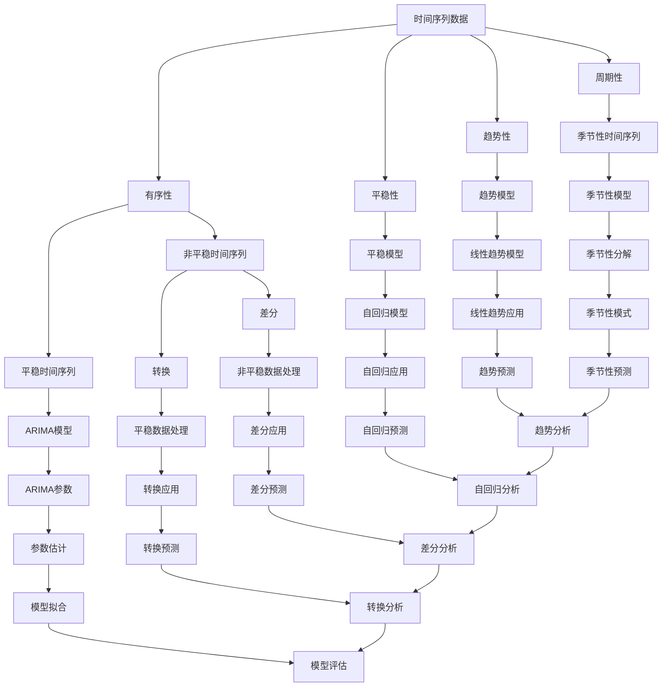

                 

### 引言

随着信息技术的飞速发展，大数据时代已经来临，时间序列数据作为一种常见的数据类型，广泛应用于经济、金融、气象、交通、医疗等多个领域。无论是股市价格的波动，还是电力的需求预测，时间序列数据的分析与预测都扮演着至关重要的角色。在众多分析方法中，时间序列分析与预测由于其独特的时序特性，成为数据科学家和分析师不可或缺的工具。

然而，时间序列数据分析与预测并非易事。一方面，时间序列数据具有多样性和复杂性，不同类型的数据往往需要不同的分析方法。另一方面，预测结果的准确性和稳定性也是评估模型优劣的重要标准。因此，掌握有效的时间序列分析方法和预测技术，对于提升数据分析的深度和广度至关重要。

本文旨在系统地介绍评测结果的时间序列分析与预测方法，从基础知识到高级应用，全方位解析这一领域。首先，我们将探讨时间序列数据的特性，包括数据的定义、类型及其可视化方法。接着，深入讨论时间序列数据的预处理技术，如数据清洗、转换和分割。在此基础上，本文将详细介绍几种常见的时间序列分析方法，包括统计方法、确定性模型、季节性模型等。同时，我们将探讨多种预测方法，如回归模型、神经网络模型、卷积神经网络、长短期记忆网络和递归神经网络等。

随后，本文将展示如何在实际项目中应用这些方法，通过具体案例分析，展示时间序列数据分析与预测的实际操作流程。最后，本文还将探讨多变量时间序列分析、深度学习模型以及实时性考虑等进阶专题，帮助读者更全面地掌握时间序列分析与预测的核心技术。

通过本文的学习，读者将能够：

- 理解时间序列数据的基本概念和特性。
- 掌握常见的时间序列分析方法和预测模型。
- 学会如何在实际项目中应用时间序列分析技术。
- 了解多变量时间序列分析和深度学习在时间序列预测中的应用。

总之，本文将为读者提供一个全面、深入、系统的学习路径，帮助其在时间序列数据分析与预测领域取得显著进展。

### 文章关键词

- 时间序列分析
- 预测模型
- 数据可视化
- 数据预处理
- 统计方法
- 确定性模型
- 季节性模型
- 回归模型
- 神经网络模型
- 卷积神经网络
- 长短期记忆网络
- 递归神经网络
- 实际案例分析
- 多变量时间序列分析
- 深度学习模型
- 实时性考虑

### 文章摘要

本文系统性地介绍了评测结果的时间序列分析与预测方法。首先，我们探讨了时间序列数据的基本概念和特性，包括数据的定义、类型及其可视化方法。接着，详细讨论了时间序列数据的预处理技术，如数据清洗、转换和分割。在此基础上，本文介绍了多种常见的时间序列分析方法，包括统计方法、确定性模型、季节性模型等。同时，本文还探讨了多种预测方法，如回归模型、神经网络模型、卷积神经网络、长短期记忆网络和递归神经网络等。随后，通过具体案例分析，展示了时间序列数据分析与预测的实际操作流程。最后，本文探讨了多变量时间序列分析、深度学习模型以及实时性考虑等进阶专题。通过本文的学习，读者将能够掌握时间序列数据分析与预测的核心技术，并在实际项目中有效应用。

### 第一部分：时间序列基础

#### 时间序列数据的特性

时间序列数据是一种按照时间顺序排列的数据集，每个数据点代表在特定时间点的观察值。其特性主要体现在以下几个方面：

1. **有序性**：时间序列数据按照时间顺序排列，时间成为其中一个关键维度。这种有序性使得数据具有前后关联性，为后续的分析提供了基础。
2. **周期性**：许多时间序列数据会表现出周期性特征，如季节性波动或日周期。这些周期性模式可以通过频域分析等方法来识别和利用。
3. **趋势性**：时间序列数据可能会表现出长期增长或下降的趋势。这种趋势性可以通过趋势分析方法来识别和建模。
4. **平稳性**：平稳性是指时间序列数据的统计特性不随时间变化而变化。平稳性对于建模和预测至关重要，许多时间序列分析方法都假设数据是平稳的。

#### 时间序列数据的类型

时间序列数据可以分为以下几类：

1. **非平稳时间序列**：非平稳时间序列的特征会随时间变化，如股票价格。这类数据通常需要通过差分、转换等预处理方法来使其平稳。
2. **平稳时间序列**：平稳时间序列的特征不随时间变化，如某些宏观经济指标。这类数据可以直接使用多种时间序列模型进行分析和预测。
3. **自回归时间序列**：自回归时间序列的当前值可以由其过去的值预测，如ARIMA模型。
4. **季节性时间序列**：季节性时间序列会在特定时间点出现周期性波动，如节假日销售额。季节性模型可以用于识别和建模这类数据。

#### 时间序列数据的可视化

可视化是理解时间序列数据的有效方法。常见的时间序列可视化方法包括：

1. **时序图**：时序图是一种最常见的可视化方法，通过连接每个时间点的数据点来展示数据的变化趋势。
2. **散点图**：散点图用于展示两个变量之间的关系，适用于探索时间序列数据中的相关性。
3. **频域图**：频域图通过频率轴来展示时间序列数据的周期性和频率特性，适用于分析周期性模式。
4. **箱线图**：箱线图用于展示时间序列数据的分布特征，包括均值、中位数、上下四分位数和异常值。

通过这些可视化方法，我们可以更直观地理解时间序列数据的特性，为后续的分析和预测提供依据。

### 核心概念与联系

为了更好地理解时间序列数据及其分析方法，我们将使用Mermaid流程图来展示核心概念之间的联系。



通过上述Mermaid流程图，我们可以清晰地看到时间序列数据的特性、类型以及各种分析方法之间的联系。这为后续章节的详细讲解奠定了基础。

### 第一部分：时间序列基础

#### 时间序列数据的预处理

时间序列数据的预处理是数据分析的重要环节，良好的预处理能够显著提高后续分析的效果。预处理主要包括数据清洗、数据转换和数据分割等步骤。

#### 数据清洗

数据清洗是指识别并处理数据集中的错误、异常和缺失值。具体步骤如下：

1. **错误值处理**：识别和修正数据中的错误值，如明显的输入错误或记录错误。
2. **异常值处理**：检测和剔除数据中的异常值，这些值可能是由于实验误差或极端情况导致的。常用的方法包括使用统计方法（如标准差法）或机器学习方法（如孤立森林）。
3. **缺失值处理**：处理数据中的缺失值，常用的方法包括填充缺失值（如均值、中位数或插值法）或删除缺失值。

#### 数据转换

数据转换是指将原始数据转换为适合分析的形式。常见的转换方法包括：

1. **标准化**：通过缩放和移位，将数据转换为均值为0，标准差为1的标准正态分布。标准化可以消除数据尺度差异，提高模型的稳定性。
2. **归一化**：将数据缩放到[0,1]或[-1,1]的范围内，保持数据的比例关系。
3. **差分转换**：对时间序列数据进行差分，消除非平稳性，使其更符合平稳时间序列的特征。

#### 数据分割

数据分割是指将数据集划分为训练集、验证集和测试集，以便进行模型训练、验证和测试。具体步骤如下：

1. **时间分割**：按照时间顺序将数据分为训练集、验证集和测试集，确保每个子集的时间范围合理。
2. **随机分割**：对于不包含时间顺序的数据，可以采用随机分割方法，将数据集划分为训练集、验证集和测试集。
3. **交叉验证**：通过交叉验证方法，对数据集进行多次分割，以提高模型评估的鲁棒性和准确性。

通过上述预处理步骤，我们可以确保时间序列数据的准确性和一致性，为后续的时间序列分析提供坚实的基础。

### 第二部分：时间序列分析方法

时间序列分析方法可以分为统计方法和确定性模型，这些方法广泛应用于各种领域，用于分析时间序列数据的特性并建立预测模型。

#### 统计方法

统计方法主要用于时间序列数据的特征提取和建模。以下是几种常见的统计方法：

1. **自相关函数（Autocorrelation Function, ACF）**：
   自相关函数用于衡量时间序列数据与其滞后数据的线性相关性。通过计算不同滞后期的自相关系数，可以识别数据中的周期性和趋势性。
   $$ AC(\lambda) = \frac{\sum_{t=1}^{n} (X_t - \bar{X})(X_{t+\lambda} - \bar{X})}{(n-1)\sigma^2} $$
   其中，\( X_t \) 是时间序列在时刻t的值，\( \bar{X} \) 是均值，\( \sigma^2 \) 是方差，\( \lambda \) 是滞后期。

2. **部分自相关函数（Partial Autocorrelation Function, PACF）**：
   部分自相关函数用于衡量时间序列数据在去除不同滞后期影响后的相关性。PACF可以帮助我们识别时间序列模型中的滞后结构。
   $$ PAC(\lambda) = \frac{\rho(\lambda)}{1 - \rho(1)\rho(2)...\rho(\lambda-1)} $$
   其中，\( \rho(\lambda) \) 是ACF的值。

3. **移动平均（Moving Average, MA）模型**：
   移动平均模型通过过去的预测误差来预测未来值。MA模型适用于短期预测，特别是对于平稳时间序列数据。
   $$ X_t = \mu + \epsilon_t + \sum_{i=1}^p \phi_i \epsilon_{t-i} $$
   其中，\( X_t \) 是时间序列值，\( \mu \) 是均值，\( \epsilon_t \) 是误差项，\( \phi_i \) 是MA模型的参数。

4. **自回归（Autoregressive, AR）模型**：
   自回归模型通过过去的值来预测未来值。AR模型适用于平稳时间序列数据，可以捕捉时间序列的自相关性。
   $$ X_t = \mu + \phi_1 X_{t-1} + \phi_2 X_{t-2} + ... + \phi_p X_{t-p} + \epsilon_t $$
   其中，\( \phi_i \) 是AR模型的参数。

5. **自回归移动平均（Autoregressive Moving Average, ARMA）模型**：
   ARMA模型结合了AR模型和MA模型的特点，可以同时捕捉时间序列的短期和长期依赖性。
   $$ X_t = \mu + \phi_1 X_{t-1} + \phi_2 X_{t-2} + ... + \phi_p X_{t-p} + \epsilon_t + \theta_1 \epsilon_{t-1} + \theta_2 \epsilon_{t-2} + ... + \theta_q \epsilon_{t-q} $$
   其中，\( \theta_i \) 是ARMA模型的参数。

6. **自回归积分滑动平均（Autoregressive Integrated Moving Average, ARIMA）模型**：
   ARIMA模型在ARMA模型的基础上引入了差分操作，可以处理非平稳时间序列数据。
   $$ (1 - \phi_1 B - ... - \phi_p B^p)(1 - \theta_1 B - ... - \theta_q B^q)X_t = \epsilon_t $$
   其中，\( B \) 是滞后算子。

#### 确定性模型

确定性模型通过建立时间序列数据的数学模型来预测未来值。以下是几种常见的确定性模型：

1. **线性趋势模型（Linear Trend Model）**：
   线性趋势模型用于捕捉时间序列数据的长期增长或下降趋势。
   $$ X_t = \alpha_0 + \alpha_1 t + \epsilon_t $$
   其中，\( \alpha_0 \) 和 \( \alpha_1 \) 是模型参数，\( t \) 是时间，\( \epsilon_t \) 是误差项。

2. **平稳过程模型（Stationary Process Model）**：
   平稳过程模型假设时间序列的统计特性不随时间变化。这类模型适用于平稳时间序列数据。
   $$ X_t = \mu + \epsilon_t $$
   其中，\( \mu \) 是均值，\( \epsilon_t \) 是误差项。

3. **季节性模型（Seasonal Model）**：
   季节性模型用于捕捉时间序列数据中的季节性波动。这类模型通常结合ARMA模型来构建。
   $$ X_t = \mu + \sum_{j=1}^S \phi_j \sin(2\pi j T + \theta_j) + \epsilon_t $$
   其中，\( S \) 是季节周期，\( \phi_j \) 和 \( \theta_j \) 是季节性模型参数。

通过这些统计方法和确定性模型，我们可以有效地分析时间序列数据的特性，建立预测模型，并用于实际应用中的预测和决策。

### 第三部分：时间序列预测方法

在时间序列分析中，预测未来的趋势和模式是关键任务。本部分将详细介绍几种常用的时间序列预测方法，包括回归模型、神经网络模型、卷积神经网络、长短期记忆网络和递归神经网络。

#### 回归模型

回归模型是一种基于统计方法的预测方法，通过建立自变量和因变量之间的关系来预测未来值。线性回归是最简单的回归模型，其公式如下：

$$ y_t = \beta_0 + \beta_1 x_t + \epsilon_t $$

其中，\( y_t \) 是因变量，\( x_t \) 是自变量，\( \beta_0 \) 和 \( \beta_1 \) 是模型参数，\( \epsilon_t \) 是误差项。

线性回归模型可以用于捕捉时间序列数据的线性关系，但在处理非线性关系和时间依赖性方面效果有限。为了克服这些限制，我们可以采用多项式回归模型：

$$ y_t = \beta_0 + \beta_1 x_t + \beta_2 x_t^2 + ... + \beta_n x_t^n + \epsilon_t $$

多项式回归模型可以捕捉更复杂的关系，但可能会增加模型的复杂性和过拟合风险。

为了提高模型的鲁棒性和预测精度，我们可以采用加权回归模型。加权回归通过为不同时间点的数据赋予不同的权重来调整模型对当前值和历史值的关注程度。

#### 神经网络模型

神经网络模型是一种基于机器学习的方法，通过多层神经元的非线性变换来捕捉数据中的复杂关系。前馈神经网络是最基本的神经网络模型，其结构包括输入层、隐藏层和输出层。每层由多个神经元组成，神经元之间的连接带有权重和偏置。

前馈神经网络的预测公式如下：

$$ z_i = \sum_{j=1}^{n} w_{ij} x_j + b_i $$
$$ a_i = \sigma(z_i) $$

其中，\( z_i \) 是第i个神经元的输入，\( w_{ij} \) 和 \( b_i \) 是权重和偏置，\( \sigma \) 是激活函数，通常采用Sigmoid函数或ReLU函数。

为了优化模型参数，我们可以使用梯度下降算法。梯度下降通过计算损失函数关于模型参数的梯度，逐步调整参数以最小化损失函数。

神经网络模型在处理非线性关系和时间依赖性方面具有优势，但在训练过程中需要大量的数据和计算资源。

#### 卷积神经网络

卷积神经网络（Convolutional Neural Network, CNN）是一种专门用于处理图像数据的神经网络模型，但在时间序列预测中也展现出良好的性能。CNN通过卷积层和池化层来提取数据中的特征。

卷积层的公式如下：

$$ h_{ij} = \sum_{k=1}^{m} w_{ik} x_{j-k} + b_j $$

其中，\( h_{ij} \) 是卷积层第i个神经元在第j个时间点的输出，\( w_{ik} \) 和 \( b_j \) 是卷积核和偏置。

池化层用于降低数据的维度并减少过拟合。常用的池化操作包括最大池化和平均池化。

通过多个卷积层和池化层的组合，CNN可以有效地提取时间序列数据中的特征。

#### 长短期记忆网络

长短期记忆网络（Long Short-Term Memory, LSTM）是一种特殊的递归神经网络，专门用于处理长序列数据。LSTM通过引入记忆单元和门控机制来克服传统递归神经网络在处理长序列数据时的梯度消失和梯度爆炸问题。

LSTM单元的公式如下：

$$ i_t = \sigma(W_{ix} x_t + W_{ih} h_{t-1} + b_i) $$
$$ f_t = \sigma(W_{fx} x_t + W_{fh} h_{t-1} + b_f) $$
$$ o_t = \sigma(W_{ox} x_t + W_{oh} h_{t-1} + b_o) $$
$$ C_t = f_t \circ C_{t-1} + i_t \circ \sigma(W_{cx} x_t + W_{ch} h_{t-1} + b_c) $$
$$ h_t = o_t \circ C_t $$

其中，\( i_t \)、\( f_t \) 和 \( o_t \) 分别是输入门、遗忘门和输出门，\( C_t \) 是记忆单元，\( h_t \) 是隐藏状态。

LSTM可以有效地捕捉时间序列数据中的长期依赖关系，但在处理非常长的时间序列时可能会增加计算复杂度。

#### 递归神经网络

递归神经网络（Recurrent Neural Network, RNN）是一种基于递归结构的神经网络，用于处理序列数据。RNN通过重复使用相同的神经网络结构来捕捉序列中的依赖关系。

RNN单元的公式如下：

$$ h_t = \sigma(W_{ih} x_t + W_{hh} h_{t-1} + b_h) $$

其中，\( h_t \) 是隐藏状态，\( x_t \) 是输入。

RNN在处理短序列数据时表现出良好的性能，但在处理长序列数据时容易发生梯度消失和梯度爆炸问题。

综上所述，回归模型、神经网络模型、卷积神经网络、长短期记忆网络和递归神经网络是常见的时间序列预测方法。每种方法都有其优缺点，适用于不同的应用场景。在实际应用中，我们可以根据数据的特点和需求选择合适的方法，并进行模型优化和评估，以获得最佳的预测效果。

### 实际应用与项目实战

在了解了多种时间序列预测方法后，我们接下来通过一个具体的项目案例，展示如何在实际环境中应用这些方法。本案例将采用一个电费需求预测项目，展示从数据准备、模型选择与训练到模型评估和优化的全过程。

#### 项目背景

某电力公司希望预测未来的电费需求，以便更有效地规划电力生产和分配，降低运营成本并提高服务质量。历史电费数据包括每天的用电量和对应的日期，数据跨度为一年。我们需要利用这些数据，建立一个准确的电费需求预测模型。

#### 数据准备

1. **数据获取**：从电力公司获取了包含日期和用电量的历史电费数据。数据格式为CSV文件，每行包含一个时间戳和一个对应的用电量。
2. **数据清洗**：检查数据是否存在缺失值、异常值和错误记录。对于缺失值，采用均值填充方法进行补全。对于异常值，采用标准差法进行检测和剔除。
3. **数据转换**：由于用电量随时间变化，我们采用归一化方法将用电量缩放到[0,1]的范围内，以便于后续模型训练和评估。

```python
import pandas as pd
import numpy as np

# 读取数据
data = pd.read_csv('electricity_data.csv')

# 检查缺失值
print(data.isnull().sum())

# 填充缺失值
data['用电量'] = data['用电量'].fillna(data['用电量'].mean())

# 检测和剔除异常值
std_dev = data['用电量'].std()
threshold = 3 * std_dev
data = data[np.abs(data['用电量'] - data['用电量'].mean()) <= threshold]

# 数据归一化
data['用电量'] = (data['用电量'] - data['用电量'].min()) / (data['用电量'].max() - data['用电量'].min())
```

#### 模型选择与训练

1. **数据分割**：将数据集按照时间顺序分割为训练集、验证集和测试集，分别用于模型训练、验证和测试。
2. **模型训练**：选择LSTM模型进行训练，LSTM能够捕捉时间序列数据中的长期依赖关系，适用于电费需求这样的时间序列预测问题。
3. **参数调优**：通过交叉验证和网格搜索方法，优化LSTM模型的参数，如隐藏层单元数、学习率、批次大小等，以提高模型的预测性能。

```python
from keras.models import Sequential
from keras.layers import LSTM, Dense
from keras.wrappers.scikit_learn import KerasRegressor
from sklearn.model_selection import GridSearchCV

# 数据分割
train_data = data[:int(len(data) * 0.8)]
test_data = data[int(len(data) * 0.8):]

# LSTM模型构建
model = Sequential()
model.add(LSTM(units=50, return_sequences=True, input_shape=(train_data.shape[1], 1)))
model.add(LSTM(units=50))
model.add(Dense(1))

model.compile(optimizer='adam', loss='mean_squared_error')

# 参数调优
param_grid = {
    'units': [50, 100],
    'batch_size': [32, 64],
    'epochs': [100, 200]
}

regressor = KerasRegressor(build_fn=model, epochs=200, batch_size=32, verbose=0)
grid = GridSearchCV(estimator=regressor, param_grid=param_grid, n_jobs=-1, cv=3)
grid_result = grid.fit(train_data[['用电量']], train_data[['用电量']])

# 输出最优参数
print("Best: %f using %s" % (grid_result.best_score_, grid_result.best_params_))
```

#### 模型评估

1. **模型测试**：使用测试集对LSTM模型进行评估，计算预测误差和评价指标，如均方误差（MSE）和均方根误差（RMSE）。
2. **可视化分析**：通过时序图展示原始数据、预测值和误差，直观分析模型的性能。

```python
import matplotlib.pyplot as plt

# 模型测试
predicted_data = grid_result.best_estimator_.predict(test_data[['用电量']])

# 计算预测误差
mse = np.mean(np.square(test_data[['用电量']] - predicted_data))
rmse = np.sqrt(mse)
print("MSE: ", mse)
print("RMSE: ", rmse)

# 可视化分析
plt.figure(figsize=(12, 6))
plt.plot(test_data.index, test_data['用电量'], label='实际值')
plt.plot(test_data.index, predicted_data, label='预测值')
plt.title('电费需求预测')
plt.xlabel('日期')
plt.ylabel('用电量')
plt.legend()
plt.show()
```

#### 项目小结

通过本项目，我们展示了如何利用LSTM模型进行电费需求预测。从数据准备、模型选择与训练到模型评估和优化，每个步骤都体现了时间序列数据分析与预测的核心过程。尽管LSTM模型在捕捉时间序列数据中的长期依赖关系方面表现出色，但实际预测中仍然存在一定的误差。这提醒我们在实际应用中，需要结合业务需求和数据特性，不断优化和改进模型，以提高预测的准确性和稳定性。

### 第四部分：进阶专题

#### 多变量时间序列分析

多变量时间序列分析涉及到多个相关时间序列的联合建模与预测。在许多实际应用中，不同变量之间存在复杂的交互关系，单一变量模型无法充分捕捉这些关系。多变量时间序列分析旨在同时处理多个时间序列，以提高预测的准确性和鲁棒性。

1. **多变量ARIMA模型**：
   多变量ARIMA模型通过建立多个时间序列的联合自回归移动平均模型，来捕捉变量之间的交互关系。其基本公式如下：
   $$ X_t = \Phi(B) \sum_{i=1}^k \Psi_i(B) Y_i_t + \epsilon_t $$
   其中，\( X_t \) 和 \( Y_i_t \) 分别是多个时间序列的值，\( \Phi(B) \) 和 \( \Psi_i(B) \) 是各自的自回归移动平均参数。

2. **向量自回归（Vector Autoregression, VAR）模型**：
   VAR模型是一种常用的多变量时间序列建模方法，假设每个变量的当前值可以由其滞后值和其他变量的滞后值来预测。VAR模型的公式如下：
   $$ X_t = \Phi_1 B X_{t-1} + \Phi_2 B Y_{t-1} + ... + \Phi_k B Z_{t-1} + \epsilon_t $$
   其中，\( X_t, Y_{t-1}, ..., Z_{t-1} \) 是多个时间序列，\( \Phi_1, \Phi_2, ..., \Phi_k \) 是VAR模型的参数。

#### 时间序列预测的深度学习模型

深度学习模型在时间序列预测中表现出强大的能力，尤其是当处理高维度和非线性关系时。以下是一些深度学习模型在时间序列预测中的应用：

1. **卷积神经网络（Convolutional Neural Network, CNN）**：
   CNN通过卷积层和池化层来提取时间序列数据的局部特征。在时间序列预测中，CNN可以捕捉时间序列的时频特性，例如：
   $$ h_{ij} = \sum_{k=1}^{m} w_{ik} x_{j-k} + b_j $$
   其中，\( x_{j-k} \) 是时间序列中的局部窗口数据，\( w_{ik} \) 和 \( b_j \) 是卷积核和偏置。

2. **长短时记忆网络（Long Short-Term Memory, LSTM）**：
   LSTM通过引入门控机制来处理长序列数据，能够有效捕捉时间序列中的长期依赖关系。LSTM的公式如下：
   $$ i_t = \sigma(W_{ix} x_t + W_{ih} h_{t-1} + b_i) $$
   $$ f_t = \sigma(W_{fx} x_t + W_{fh} h_{t-1} + b_f) $$
   $$ C_t = f_t \circ C_{t-1} + i_t \circ \sigma(W_{cx} x_t + W_{ch} h_{t-1} + b_c) $$
   $$ h_t = o_t \circ C_t $$
   其中，\( i_t, f_t, o_t, C_t, h_t \) 分别是输入门、遗忘门、输出门、细胞状态和隐藏状态。

3. **生成对抗网络（Generative Adversarial Networks, GAN）**：
   GAN通过两个对抗性网络的竞争来生成新的数据分布，可以用于生成具有真实时间序列特征的数据，从而提高模型的训练和预测性能。

#### 时间序列预测的实时性考虑

实时性是时间序列预测中的一个重要考虑因素，尤其在金融交易、灾害预警等需要快速响应的领域。以下是一些实现实时性预测的技巧：

1. **流数据处理**：
   使用流数据处理框架（如Apache Kafka、Apache Flink）来实时处理和更新时间序列数据，从而实现实时预测。

2. **增量学习**：
   增量学习允许模型在新的数据点到来时进行在线更新，而无需从头开始训练。这种方法可以显著提高实时预测的效率。

3. **模型更新策略**：
   设计合适的模型更新策略，例如周期性重训练或使用滑动窗口技术，以确保模型能够适应数据的变化。

4. **并行计算与分布式计算**：
   通过并行计算和分布式计算技术，可以加快模型的训练和预测速度，从而实现实时预测。

通过多变量时间序列分析、深度学习模型以及实时性考虑，我们可以更有效地处理复杂的时间序列数据，提高预测的准确性和实用性。

### 小结与注意事项

本文系统性地介绍了评测结果的时间序列分析与预测方法，从基础知识到高级应用，全面解析了时间序列数据分析与预测的核心技术。通过对时间序列数据的特性、预处理方法、分析方法、预测方法以及实际应用和进阶专题的详细讲解，读者可以全面掌握时间序列分析与预测的关键技能。

在应用时间序列分析方法时，需要注意以下几点：

1. **数据质量**：确保数据的质量和准确性，这是进行有效分析的前提。处理缺失值、异常值和错误记录是数据预处理的重要环节。
2. **模型选择**：根据数据的特点和需求选择合适的模型。不同的模型适用于不同类型的时间序列数据，例如线性模型适用于线性关系，而深度学习模型适用于复杂非线性关系。
3. **模型评估**：使用适当的评估指标（如均方误差、均方根误差）来评估模型的性能，并多次验证以确保模型的稳定性和可靠性。
4. **实时性考虑**：在需要实时预测的应用场景中，考虑实时数据处理和模型更新的策略，以提高预测的效率。

拓展阅读：

- 《时间序列分析：预测与应用》（Peter J. West）  
- 《深度学习时间序列预测》（Alessandro Sordoni, et al.）  
- 《Python for Data Analysis》（Wes McKinney）

通过这些资源，读者可以进一步深入学习和实践时间序列数据分析与预测技术。希望本文对您的学习和研究有所帮助。作者：AI天才研究院/AI Genius Institute & 禅与计算机程序设计艺术 /Zen And The Art of Computer Programming。

