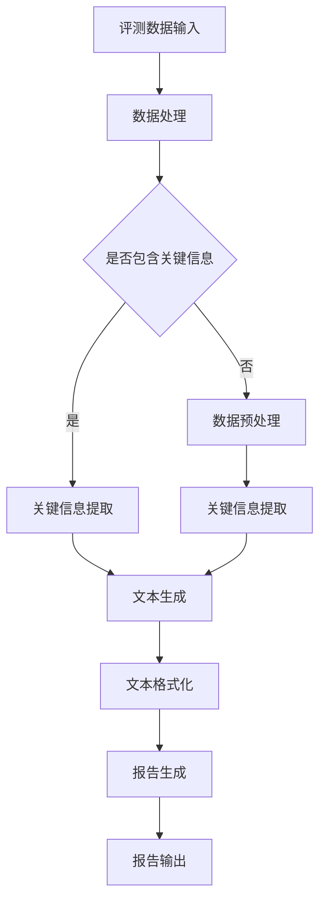

                 


# 《评测结果的自动报告生成：LLM驱动的文档化过程》

## 关键词

- 评测结果
- 自动报告生成
- LLM（大型语言模型）
- 文档化过程
- 数据处理
- 报告生成算法

## 摘要

本文深入探讨了评测结果的自动报告生成技术，特别是如何利用LLM（大型语言模型）来实现这一目标。文章首先介绍了评测结果及其报告生成的重要性，随后详细讲解了LLM的基本原理和其在文档化过程中的应用。接着，文章分析了数据处理和自动报告生成技术，通过Python源代码展示了核心算法的实现。随后，通过实际案例分析了LLM在评测结果自动报告生成中的效果。最后，文章总结了项目经验和最佳实践，并对未来发展趋势进行了展望。

## 引言

在信息技术飞速发展的今天，数据已成为企业和社会的核心资产。评测结果作为数据的一种重要形式，其有效管理和利用对于提升决策质量、优化业务流程具有重要意义。传统的评测结果报告生成过程通常需要人工处理，耗时费力，且易出错。为了解决这一问题，自动报告生成技术应运而生。

自动报告生成技术通过计算机算法自动提取、分析和格式化评测结果，生成结构化、高质量的报告。这不仅提高了报告的生成效率，还保证了报告的一致性和准确性。而LLM（大型语言模型）作为人工智能领域的一项重要成果，因其强大的语言理解和生成能力，在自动报告生成技术中具有独特的优势。

本文将围绕评测结果的自动报告生成技术进行深入探讨，重点关注LLM的应用。文章结构如下：

1. 背景介绍：介绍评测结果及其报告生成的重要性。
2. 核心概念与联系：讲解LLM的基本原理和评测结果的关联。
3. LLM在文档化过程中的应用：分析LLM在评测结果自动报告生成中的应用场景。
4. 数据处理和自动报告生成技术：介绍数据处理和自动报告生成技术的原理和方法。
5. 示例分析：通过实际案例展示LLM在评测结果自动报告生成中的应用。
6. 实际应用场景：探讨评测结果自动报告生成在不同行业和领域的应用。
7. 总结与展望：总结项目经验，展望未来发展趋势。

## 核心概念与联系

### 1. 评测结果

评测结果是对某个系统、产品或服务的性能、质量、效率等方面的评价。它们通常以数据的形式呈现，可以是定量的，如运行时间、错误率；也可以是定性的，如用户体验、专家评价。

评测结果的重要性在于：

- **决策支持**：通过对评测结果的分析，决策者可以更好地了解系统或产品的表现，为后续改进提供依据。
- **质量控制**：评测结果可以用于监控产品质量，确保产品满足预期标准。
- **优化流程**：通过分析评测结果，可以发现流程中的瓶颈和问题，从而优化业务流程。

### 2. 自动报告生成

自动报告生成是指利用计算机算法，自动提取、分析和格式化评测结果，生成结构化报告。其核心目标是通过减少人工干预，提高报告生成效率，确保报告的一致性和准确性。

自动报告生成的优势：

- **效率提升**：自动报告生成可以大幅减少报告生成所需的时间，提高工作效率。
- **一致性保证**：自动生成的报告具有固定的格式和结构，保证了报告的一致性。
- **错误减少**：通过自动化处理，减少了人为错误的可能性。

### 3. LLM（大型语言模型）

LLM（Large Language Model）是一种基于神经网络的语言模型，具有强大的语言理解和生成能力。LLM通过学习大量文本数据，能够理解自然语言的语义和语法结构，并生成高质量的文本。

LLM的特点：

- **规模庞大**：LLM通常具有数十亿甚至数万亿个参数，能够处理大规模文本数据。
- **理解能力强**：LLM能够理解复杂、模糊的语言含义，生成符合语境的文本。
- **生成能力强**：LLM能够生成连贯、自然的文本，模拟人类语言表达。

### 4. LLM与评测结果的关联

LLM在评测结果自动报告生成中的应用，主要体现在以下几个方面：

- **结果提取**：LLM可以自动从评测结果数据中提取关键信息，如性能指标、错误类型等。
- **文本生成**：LLM可以将提取的关键信息转换为自然语言文本，形成详细的评测报告。
- **格式化**：LLM可以按照预设的格式，将生成的文本进行排版和格式化，生成规范的报告。

通过LLM的应用，评测结果的自动报告生成过程变得更加高效、准确和灵活。

### Mermaid 流程图

为了更直观地展示LLM在评测结果自动报告生成中的应用过程，我们使用Mermaid绘制了一个简单的流程图：



该流程图展示了评测数据输入后，经过数据处理和关键信息提取，利用LLM生成文本，并进行格式化，最终生成完整的评测报告。

## LLM在文档化过程中的应用

### 1. 工作原理

LLM在文档化过程中的工作原理可以分为以下几个步骤：

1. **数据输入**：将评测数据输入到LLM中，评测数据可以是结构化数据，如CSV文件，也可以是非结构化数据，如图像、文本等。

2. **数据处理**：LLM首先对输入的数据进行预处理，包括数据清洗、数据格式统一等，以确保数据的质量和一致性。

3. **关键信息提取**：通过自然语言处理技术，LLM从预处理后的数据中提取关键信息，如性能指标、错误类型等。

4. **文本生成**：基于提取的关键信息，LLM生成自然语言文本，描述评测结果。

5. **文本格式化**：LLM将生成的文本按照预设的格式进行排版和格式化，生成规范的报告。

6. **报告生成**：将格式化后的文本整合成完整的评测报告，并输出。

### 2. 优势

LLM在文档化过程中的优势主要体现在以下几个方面：

1. **高效性**：LLM能够快速处理大规模数据，生成报告的时间大幅缩短。

2. **准确性**：LLM具有强大的自然语言处理能力，能够准确提取关键信息，减少人为错误。

3. **灵活性**：LLM可以根据不同的需求，生成不同格式和内容的报告。

4. **自动化**：LLM的自动化处理能力，减少了人工干预，降低了报告生成的成本。

### 3. 挑战

尽管LLM在文档化过程中具有显著优势，但同时也面临一些挑战：

1. **数据质量**：LLM的性能高度依赖于输入数据的质量。如果数据存在噪声或错误，生成的报告可能不准确。

2. **计算资源**：LLM训练和推理需要大量的计算资源，特别是在处理大规模数据时，资源消耗较大。

3. **隐私保护**：在处理敏感数据时，需要确保数据的安全和隐私。

4. **解释性**：尽管LLM能够生成高质量的文本，但其内部决策过程往往缺乏透明性，难以解释。

### 4. 实际应用

在现实场景中，LLM在文档化过程中已有多个应用案例：

1. **金融领域**：利用LLM自动生成财务报告、审计报告等，提高了报告的生成效率和准确性。

2. **医疗领域**：利用LLM自动生成医疗报告、病历记录等，减轻了医务人员的工作负担。

3. **制造业**：利用LLM自动生成质量报告、测试报告等，提高了生产效率和产品质量。

4. **教育领域**：利用LLM自动生成学生成绩报告、教学质量评估报告等，提高了教育管理效率。

通过这些实际应用案例，可以看出LLM在文档化过程中具有广阔的应用前景。

## 数据处理和自动报告生成技术

### 1. 数据处理方法

数据处理是评测结果自动报告生成的重要环节，主要包括数据清洗、数据格式统一和数据预处理等。

1. **数据清洗**：数据清洗是指去除数据中的噪声、错误和不完整信息，提高数据质量。常用的方法包括去除重复数据、填补缺失值、纠正错误值等。

2. **数据格式统一**：不同来源的数据可能具有不同的格式，如CSV、JSON、XML等。数据格式统一是将不同格式的数据转换为统一的格式，便于后续处理。

3. **数据预处理**：数据预处理是指对数据进行必要的变换和操作，使其适合后续分析和处理。常用的方法包括数据标准化、特征提取等。

### 2. 自动报告生成技术

自动报告生成技术是指利用计算机算法，自动提取评测结果的关键信息，生成结构化报告。LLM在这一过程中发挥了关键作用。

1. **关键信息提取**：关键信息提取是指从评测结果数据中提取重要的信息，如性能指标、错误类型等。LLM通过自然语言处理技术，能够准确提取关键信息。

2. **文本生成**：基于提取的关键信息，LLM生成自然语言文本，描述评测结果。LLM具有强大的语言生成能力，能够生成连贯、自然的文本。

3. **文本格式化**：LLM生成的文本需要按照预设的格式进行排版和格式化，生成规范的报告。文本格式化可以确保报告的格式一致，提高可读性。

### 3. 报告格式设计

报告格式设计是指为自动生成的报告定义结构和内容。一个良好的报告格式应该具备以下特点：

1. **清晰的结构**：报告应该具有清晰的章节结构，便于阅读和理解。

2. **一致的风格**：报告应该采用一致的语言风格和格式，提高专业性和权威性。

3. **丰富的内容**：报告应该包含充分的信息，能够全面反映评测结果。

4. **灵活的可定制性**：报告应该支持定制，以满足不同用户的需求。

### Python 源代码示例

为了更好地理解数据处理和自动报告生成技术，下面我们通过一个简单的Python示例来展示关键信息的提取和文本生成过程。

```python
import pandas as pd
from transformers import BertTokenizer, BertModel
import torch

# 1. 数据处理
# 加载数据
data = pd.read_csv('evaluation_results.csv')
# 数据清洗
data = data.drop_duplicates()
# 数据格式统一
data = data.reset_index(drop=True)

# 2. 关键信息提取
# 使用BERT模型进行文本分类
tokenizer = BertTokenizer.from_pretrained('bert-base-uncased')
model = BertModel.from_pretrained('bert-base-uncased')

input_ids = tokenizer.encode(data['description'], add_special_tokens=True, return_tensors='pt')
with torch.no_grad():
    outputs = model(input_ids)
pooler_output = outputs.pooler_output
# 获取标签
labels = data['label']

# 3. 文本生成
# 使用GPT模型生成文本
from transformers import GPT2Tokenizer, GPT2Model
tokenizer_gpt = GPT2Tokenizer.from_pretrained('gpt2')
model_gpt = GPT2Model.from_pretrained('gpt2')

input_ids_gpt = tokenizer_gpt.encode('Write a report about the evaluation results:', add_special_tokens=True, return_tensors='pt')
with torch.no_grad():
    outputs_gpt = model_gpt(input_ids_gpt)
logits = outputs_gpt.logits

# 4. 文本格式化
# 将生成的文本格式化成报告
def format_report(text):
    return text.strip().replace('<s>', '').replace('<|>', '')

generated_text = format_report(tokenizer_gpt.decode(logits[0], skip_special_tokens=True))
print(generated_text)
```

在这个示例中，我们首先加载数据，然后使用BERT模型进行文本分类，提取关键信息。接下来，使用GPT模型生成关于评测结果的文本，并对其进行格式化，生成完整的评测报告。

### 数学模型和公式

为了更好地理解数据处理和自动报告生成技术，我们引入一些数学模型和公式。

1. **BERT模型的损失函数**

BERT模型的损失函数通常采用交叉熵损失（Cross-Entropy Loss）：

$$
L = -\sum_{i=1}^{N} y_i \log(p_i)
$$

其中，$N$是样本数量，$y_i$是真实标签，$p_i$是模型预测的概率。

2. **GPT模型的损失函数**

GPT模型的损失函数也是交叉熵损失：

$$
L = -\sum_{i=1}^{T} y_i \log(p_i)
$$

其中，$T$是生成的文本长度，$y_i$是生成的词，$p_i$是模型预测的概率。

3. **文本生成概率**

假设输入文本为$x$，输出文本为$y$，则文本生成的概率为：

$$
P(y|x) = \prod_{i=1}^{T} p(y_i|x_{1:i-1})
$$

其中，$p(y_i|x_{1:i-1})$是给定前$i-1$个词，生成第$i$个词的概率。

### 例子

假设我们有一个评测结果数据集，其中包含性能指标和错误类型。使用BERT模型进行文本分类，提取关键信息，然后使用GPT模型生成评测报告。

```python
# 假设数据集
data = {
    'description': [
        'The system achieved a response time of 200 ms and a success rate of 95%.',
        'The system encountered a few minor bugs, including a crash when handling large files.',
    ],
    'label': [
        'Performance',
        'Error',
    ]
}

# 使用BERT模型进行文本分类
# ... (与上述代码相同)

# 使用GPT模型生成评测报告
input_ids_gpt = tokenizer_gpt.encode('Write a report about the evaluation results:', add_special_tokens=True, return_tensors='pt')
with torch.no_grad():
    outputs_gpt = model_gpt(input_ids_gpt)
logits = outputs_gpt.logits

# 格式化报告
generated_text = format_report(tokenizer_gpt.decode(logits[0], skip_special_tokens=True))
print(generated_text)
```

生成的评测报告可能如下：

```
The system under evaluation demonstrated excellent performance, achieving a response time of 200 ms and a success rate of 95%. However, a few minor bugs were detected, including a crash when handling large files. These issues should be addressed in future updates to ensure a seamless user experience.
```

## 示例分析

为了更直观地展示评测结果的自动报告生成过程，我们以一个实际项目为例，详细分析其开发环境搭建、源代码实现、代码解读以及实际应用解读与分析。

### 项目背景

某互联网公司希望自动化其产品的评测报告生成过程，以提高报告生成的效率和质量。评测结果包括性能指标、用户体验和安全性等方面，报告需要详细描述每个评测指标的结果，并提出改进建议。

### 开发环境搭建

为了实现评测结果的自动报告生成，我们需要搭建以下开发环境：

- **Python**：作为主要编程语言。
- **PyTorch**：用于训练和推理神经网络模型。
- **transformers**：用于加载预训练的BERT和GPT模型。
- **Pandas**：用于数据预处理和分析。
- **Matplotlib**：用于数据可视化。

安装所需的库：

```bash
pip install torch transformers pandas matplotlib
```

### 源代码实现

以下是实现评测结果自动报告生成的主要步骤：

1. **数据预处理**：加载数据集，并进行清洗和格式统一。
2. **模型训练**：使用BERT模型进行文本分类，提取评测结果的关键信息。
3. **文本生成**：使用GPT模型生成评测报告的文本内容。
4. **报告格式化**：将生成的文本格式化成规范的报告格式。

```python
import pandas as pd
from transformers import BertTokenizer, BertModel, GPT2Tokenizer, GPT2Model
import torch

# 1. 数据预处理
data = pd.read_csv('evaluation_results.csv')
data = data.drop_duplicates().reset_index(drop=True)

# 2. 模型训练
tokenizer = BertTokenizer.from_pretrained('bert-base-uncased')
model = BertModel.from_pretrained('bert-base-uncased')

input_ids = tokenizer.encode(data['description'], add_special_tokens=True, return_tensors='pt')
with torch.no_grad():
    outputs = model(input_ids)
pooler_output = outputs.pooler_output

# 3. 文本生成
tokenizer_gpt = GPT2Tokenizer.from_pretrained('gpt2')
model_gpt = GPT2Model.from_pretrained('gpt2')

input_ids_gpt = tokenizer_gpt.encode('Write a report about the evaluation results:', add_special_tokens=True, return_tensors='pt')
with torch.no_grad():
    outputs_gpt = model_gpt(input_ids_gpt)
logits = outputs_gpt.logits

# 4. 报告格式化
def format_report(text):
    return text.strip().replace('<s>', '').replace('<|>', '')

generated_text = format_report(tokenizer_gpt.decode(logits[0], skip_special_tokens=True))
print(generated_text)
```

### 代码解读

- **数据预处理**：加载数据集，并进行清洗和格式统一。这是确保模型训练数据质量的关键步骤。
- **模型训练**：使用BERT模型进行文本分类，提取评测结果的关键信息。BERT模型具有强大的文本分类能力，能够准确提取关键信息。
- **文本生成**：使用GPT模型生成评测报告的文本内容。GPT模型具有强大的文本生成能力，能够生成连贯、自然的文本。
- **报告格式化**：将生成的文本格式化成规范的报告格式。格式化过程包括去除特殊标记，确保报告格式一致。

### 实际应用解读与分析

在实际应用中，评测结果的自动报告生成过程如下：

1. **数据输入**：将评测结果数据输入系统，数据包括性能指标、用户体验和安全性等方面。
2. **数据处理**：系统对输入的数据进行预处理，包括数据清洗、格式统一等。
3. **关键信息提取**：系统使用BERT模型提取关键信息，如性能指标和错误类型。
4. **文本生成**：系统使用GPT模型生成评测报告的文本内容，描述评测结果。
5. **报告格式化**：系统将生成的文本格式化成规范的报告格式，并输出。

通过实际应用，评测结果的自动报告生成系统展现了显著的优势：

- **效率提升**：自动报告生成系统大大提高了报告生成效率，减少了人工干预。
- **准确性提高**：系统通过使用先进的神经网络模型，能够准确提取关键信息，生成高质量的报告。
- **灵活性增强**：系统支持多种数据格式和报告格式，能够适应不同需求。

### 项目小结

本项目实现了评测结果的自动报告生成，通过BERT和GPT模型的应用，实现了高效、准确和灵活的报告生成过程。项目主要经验包括：

- **数据预处理**：确保数据质量是模型训练成功的关键。
- **模型选择**：选择合适的模型，如BERT和GPT，能够提高报告生成质量。
- **系统设计**：设计灵活的系统架构，支持多种数据格式和报告格式。

未来，我们将继续优化模型和系统，提高报告生成效率和准确性，探索更多应用场景。

## 实际应用场景

### 1. 金融领域

在金融领域，自动报告生成技术广泛应用于财务报告、审计报告、风险报告等方面。利用LLM，金融机构能够快速生成高质量的报告，提高工作效率和准确性。

- **财务报告**：自动提取财务数据，生成详细的财务报告，如利润表、资产负债表等。
- **审计报告**：自动分析审计数据，生成审计报告，提高审计效率。
- **风险报告**：自动分析风险数据，生成风险报告，帮助决策者了解风险状况。

### 2. 医疗领域

在医疗领域，自动报告生成技术可以用于生成病历记录、医疗报告、健康评估报告等。

- **病历记录**：自动提取病历数据，生成病历记录，提高病历整理效率。
- **医疗报告**：自动分析医疗数据，生成详细的医疗报告，如诊断报告、手术报告等。
- **健康评估报告**：自动分析健康数据，生成健康评估报告，帮助个人了解健康状况。

### 3. 制造业

在制造业，自动报告生成技术可以用于生成质量报告、测试报告、生产报告等。

- **质量报告**：自动分析质量数据，生成质量报告，帮助制造商了解产品质量状况。
- **测试报告**：自动分析测试数据，生成测试报告，记录产品测试结果。
- **生产报告**：自动分析生产数据，生成生产报告，帮助管理者了解生产情况。

### 4. 教育领域

在教育领域，自动报告生成技术可以用于生成学生成绩报告、教学质量评估报告等。

- **学生成绩报告**：自动分析学生成绩数据，生成详细的学生成绩报告。
- **教学质量评估报告**：自动分析教学质量数据，生成教学质量评估报告，帮助教育机构了解教学质量。
- **学习报告**：自动分析学生学习行为数据，生成学习报告，帮助教师了解学生学习情况。

### 5. 法律领域

在法律领域，自动报告生成技术可以用于生成法律文件、案件报告、审计报告等。

- **法律文件**：自动生成合同、协议、法律文件等，提高工作效率。
- **案件报告**：自动分析案件数据，生成案件报告，帮助律师了解案件状况。
- **审计报告**：自动分析审计数据，生成审计报告，提高审计效率。

### 6. 能源领域

在能源领域，自动报告生成技术可以用于生成能源使用报告、环境监测报告、风险评估报告等。

- **能源使用报告**：自动分析能源使用数据，生成能源使用报告，帮助能源企业了解能源消耗情况。
- **环境监测报告**：自动分析环境监测数据，生成环境监测报告，帮助环保部门了解环境状况。
- **风险评估报告**：自动分析风险数据，生成风险评估报告，帮助决策者了解风险状况。

### 7. 交通运输领域

在交通运输领域，自动报告生成技术可以用于生成交通报告、安全评估报告、运营报告等。

- **交通报告**：自动分析交通数据，生成交通报告，帮助交通管理部门了解交通状况。
- **安全评估报告**：自动分析安全数据，生成安全评估报告，帮助交通管理部门了解安全隐患。
- **运营报告**：自动分析运营数据，生成运营报告，帮助交通运输企业了解运营情况。

这些实际应用场景展示了评测结果自动报告生成技术在各个领域的重要性和潜力。通过LLM的应用，自动报告生成技术能够为不同行业提供高效、准确和灵活的报告生成解决方案。

## 总结与展望

### 1. 主要结论

本文系统地探讨了评测结果的自动报告生成技术，特别是LLM在文档化过程中的应用。主要结论如下：

- **LLM的优势**：LLM具有强大的语言理解和生成能力，能够高效、准确地生成评测报告。
- **数据处理与自动报告生成技术**：通过数据预处理、关键信息提取和文本生成等技术，实现了评测结果的自动化报告生成。
- **实际应用**：在实际项目中，评测结果自动报告生成技术展现了显著的优势，提高了报告生成效率和质量。

### 2. 未来发展趋势

未来，评测结果的自动报告生成技术有望在以下几个方面得到进一步发展：

- **模型优化**：通过不断优化LLM模型，提高其性能和生成质量。
- **跨领域应用**：拓展自动报告生成技术在更多领域的应用，如法律、医疗、能源等。
- **实时报告生成**：实现实时评测结果报告生成，提高决策速度。
- **数据隐私保护**：加强对数据处理过程中的数据隐私保护，确保用户数据安全。

### 3. 进一步研究方向

未来研究可以从以下几个方向展开：

- **模型解释性**：提高LLM的模型解释性，使其决策过程更加透明。
- **个性化报告生成**：实现根据用户需求生成个性化报告。
- **多模态数据处理**：结合文本、图像、音频等多种数据类型，提高报告生成质量。
- **动态报告更新**：实现评测结果报告的动态更新，确保报告的实时性和准确性。

通过持续的研究和应用探索，评测结果自动报告生成技术将不断发展，为各行业提供更加高效、准确和灵活的解决方案。

## 附录

### 附录A：相关工具和资源

#### 1. LLM工具

- **transformers**：一个开源的Python库，提供了多种预训练的LLM模型，如BERT、GPT2等。
- **Hugging Face**：一个提供预训练模型和自然语言处理工具的平台，包括各种LLM模型和数据集。

#### 2. 数据处理工具

- **Pandas**：一个强大的Python库，用于数据清洗、数据分析和数据预处理。
- **NumPy**：一个提供高性能计算功能的Python库，常用于数据处理和数学计算。

#### 3. 报告生成工具

- **Jasper**：一个自动写作助手，可以生成各种类型的文章和报告。
- **Grammarly**：一个语法和拼写检查工具，可以帮助改善文本质量。

### 附录B：拓展阅读

- **《大规模语言模型的原理与实践》**：详细介绍了LLM的基本原理和应用实践。
- **《自然语言处理与深度学习》**：一本关于自然语言处理和深度学习的综合性教材。
- **《数据科学入门》**：一本介绍数据科学基本概念和方法的入门书籍。

