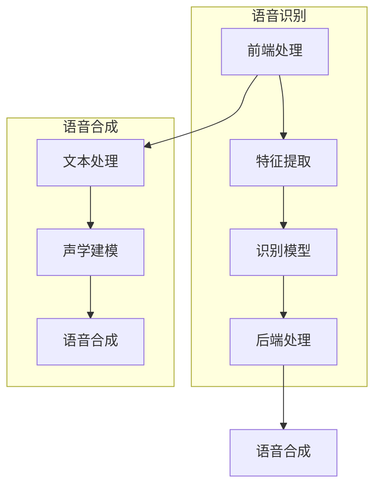

                 

### 引言

#### 背景介绍

语音识别与合成技术作为人工智能（AI）领域的重要组成部分，近年来取得了显著的进展。语音识别技术通过将人类语音转换为文本，使得计算机能够理解和处理语音指令，从而提高人机交互的效率和自然性。而语音合成技术则能够将文本信息转换为自然流畅的语音输出，为用户提供语音反馈和阅读体验。这两项技术的快速发展，不仅推动了智能语音助手的普及，还在客服、教育、医疗等多个领域展现出巨大的潜力。

语音识别与合成技术在LLM（Large Language Model，大型语言模型）应用中的融合，进一步丰富了人机交互的方式。LLM凭借其强大的自然语言处理能力，已经在文本生成、问答系统、语言翻译等领域取得了显著的成果。然而，单纯依赖文本交互存在一定的局限性，难以完全满足用户的需求。语音识别与合成的引入，使得LLM能够通过语音方式与用户进行交流，提升用户体验和交互的自然性。

#### 重要性

在当前技术发展的背景下，语音识别与合成技术在LLM中的应用具有以下几个方面的关键重要性：

1. **提升交互体验**：语音交互相较于文本交互更加自然和便捷，能够更好地满足用户在不同场景下的需求，提高用户的使用体验。
2. **拓宽应用场景**：语音识别与合成的引入，使得LLM能够在更广泛的场景中得到应用，如语音助手、智能家居、智能车载等。
3. **降低技术门槛**：通过将复杂的自然语言处理任务转化为语音交互，可以降低开发者对专业技术的依赖，推动AI技术的普及和应用。
4. **提高数据多样性**：语音数据相较于文本数据更加丰富和多样化，有助于LLM更好地理解和生成自然语言，提高模型的泛化能力。

#### 书籍目的

本书旨在系统地介绍语音识别与合成技术在LLM应用中的交互方式，帮助读者深入理解并掌握相关技术。具体目标包括：

1. **核心概念理解**：通过详细讲解语音识别与合成的核心概念和原理，帮助读者建立全面的知识体系。
2. **算法原理掌握**：通过Python源代码和数学模型的讲解，使读者能够深入理解关键算法的实现过程。
3. **实战案例分析**：通过具体的应用实例，展示语音识别与合成技术在LLM中的应用场景和实现方法。
4. **未来趋势展望**：分析语音识别与合成技术的发展趋势和潜在应用，为读者提供前瞻性的思考和指导。

### 摘要

本书围绕语音识别与合成技术在LLM应用中的交互方式展开，全面介绍了语音识别与合成的基本概念、核心算法原理、应用实例和未来趋势。通过系统的讲解和丰富的实战案例，读者可以深入理解并掌握相关技术，为在实际项目中应用语音识别与合成技术提供有力支持。本书的目标是为从事人工智能领域的专业人士和研究者提供一本全面、系统的参考书籍。

---

```markdown
# 引言

## 背景介绍

### 1.1.1 语音识别与合成技术的发展历程

语音识别（Automatic Speech Recognition，ASR）技术起源于20世纪50年代，早期的研究主要集中在规则方法上，如有限状态自动机和模式识别。随着计算机性能的提升和信号处理技术的发展，20世纪80年代，隐藏马尔可夫模型（HMM）成为语音识别的主要算法。进入21世纪，深度学习技术的兴起使得神经网络（NN）在语音识别领域得到了广泛应用，尤其是深度神经网络（DNN）和循环神经网络（RNN），以及近年来基于注意力机制的Transformer模型，显著提高了语音识别的准确率和效率。

语音合成（Text-to-Speech，TTS）技术的发展同样经历了从规则方法到统计模型，再到基于数据的生成模型的演进。早期的合成方法如合成语音波形的方法（Unit Selection Synthesis）和拼接波形的方法（Diphone Synthesis），都依赖于大量的手工规则。随着语音数据的积累和生成模型的发展，基于数据的波形生成模型如WaveNet和参数化声道合成（Parametric Vocal Tract Synthesis，PVGS）逐渐成为主流。这些模型能够生成更自然、更流畅的语音。

### 1.1.2 语言模型（LLM）的发展及其在交互中的应用

语言模型（LLM）是自然语言处理（NLP）领域的关键技术，最早的语言模型如N-gram模型通过统计文本中的词频来预测下一个词。随着深度学习技术的发展，神经网络语言模型如长短期记忆网络（LSTM）和Transformer模型等，凭借其强大的表征能力和生成能力，在语言理解、文本生成、机器翻译等领域取得了显著的进展。近年来，基于Transformer的预训练模型如BERT、GPT-3等，已经成为LLM的代表，展现了超越人类水平的表现。

语言模型在交互中的应用场景十分广泛。在语音助手和聊天机器人中，LLM能够理解用户的语音指令，并生成自然、准确的回复。在智能客服中，LLM可以自动处理大量的客户咨询，提供快速、高效的响应。在教育领域，LLM可以生成个性化学习材料，辅助教师进行教学。此外，LLM还在内容审核、舆情监测、语言翻译等场景中发挥着重要作用。

## 书籍目的

### 1.2.1 语音识别与合成技术在LLM中的应用

本书的核心目的是探讨语音识别与合成技术在LLM中的应用，旨在为读者提供系统、深入的理解和实战指导。语音识别技术使得LLM能够通过语音方式接收用户指令，而语音合成技术则使得LLM能够以语音方式向用户反馈信息。这两种技术的结合，不仅丰富了LLM的交互方式，也提升了人机交互的自然性和效率。

### 1.2.2 阅读书籍的目标和预期成果

通过阅读本书，读者可以实现以下目标：

1. **掌握核心概念**：理解语音识别与合成技术的基本原理，包括信号处理、特征提取、模型训练等。
2. **深入学习算法**：掌握关键算法的实现细节，如HMM、DNN、WaveNet等，并通过Python代码实现。
3. **实战应用能力**：通过实际案例和项目实战，学会如何将语音识别与合成技术应用到LLM中。
4. **前瞻性思考**：了解语音识别与合成技术的未来发展趋势，为未来的研究和应用提供指导。

本书不仅适合人工智能领域的专业人士和研究者，也适合对自然语言处理和语音技术感兴趣的爱好者。通过本书，读者将能够全面了解语音识别与合成技术在LLM中的应用，为未来的研究和实践奠定坚实基础。

### 摘要

本书围绕语音识别与合成技术在LLM应用中的交互方式展开，系统地介绍了语音识别与合成技术的发展历程、核心算法原理、应用实例和未来趋势。通过详细的讲解和丰富的实战案例，读者可以深入理解并掌握相关技术，为实际项目中的应用提供有力支持。本书的目标是为从事人工智能领域的专业人士和研究者提供一本全面、系统的参考书籍。

---

```markdown
## 核心技术介绍

### 2.1 语音识别技术

语音识别技术是指将人类的语音信号转换为机器可以理解和处理的文本信息的过程。这一技术广泛应用于语音助手、智能客服、语音搜索、自动字幕生成等领域。

#### 2.1.1 语音信号处理基础

语音信号处理是语音识别的基础。语音信号首先通过麦克风等设备被转换为数字信号。然后，通过预处理步骤，如去噪、归一化、分帧和加窗等，提取语音信号的频域特征。

#### 2.1.2 语音识别流程概述

语音识别流程主要包括以下几个步骤：

1. **前端处理**：包括信号预处理、特征提取、声学模型等。
2. **中间处理**：通过解码器将特征向量映射到单词或短语。
3. **后端处理**：进行错误校正、置信度评分等。

#### 2.1.3 关键算法简介

1. **隐藏马尔可夫模型（HMM）**：是最早的语音识别算法之一，通过状态转移矩阵和观察概率进行建模。
2. **深度神经网络（DNN）**：通过多层非线性变换对特征进行建模，提高了语音识别的准确率。
3. **循环神经网络（RNN）**：能够处理序列数据，特别适合语音信号这种时间序列数据。
4. **Transformer模型**：基于自注意力机制，具有强大的并行计算能力和长距离依赖建模能力。

### 2.2 语音合成技术

语音合成技术是将文本信息转换为自然流畅的语音信号的过程。这一技术广泛应用于电子朗读、智能客服、语音导航、自动字幕生成等领域。

#### 2.2.1 语音合成基础

语音合成的基础包括文本处理、声学建模和语音生成。文本处理涉及分词、语调预测等。声学建模则是对语音信号的生成过程进行建模，常用的模型包括共振峰模型、参数化声道合成模型等。

#### 2.2.2 语音合成流程概述

语音合成流程主要包括以下几个步骤：

1. **文本处理**：将输入文本转化为适合语音生成的格式，如音素、音节等。
2. **声学建模**：根据文本生成语音波形，常用的模型包括拼接合成模型、波形生成模型等。
3. **语音合成**：将生成的波形转换为语音信号，进行播放或存储。

#### 2.2.3 关键算法简介

1. **拼接合成模型**：通过拼接预录制的语音片段来生成语音。
2. **波形生成模型**：如WaveNet，通过神经网络直接生成语音波形。
3. **参数化声道合成（PVGS）**：通过参数化建模声道，生成语音信号。

### 2.3 语音识别与合成技术在LLM中的应用

语音识别与合成技术在LLM中的应用，使得LLM能够通过语音方式接收用户指令，并生成语音反馈。具体应用场景包括：

1. **语音助手**：通过语音识别接收用户指令，通过语音合成生成语音回复。
2. **智能客服**：通过语音识别理解和处理用户语音，通过语音合成生成语音响应。
3. **语音搜索**：通过语音识别将用户语音转换为文本查询，通过LLM生成查询结果。
4. **自动字幕生成**：通过语音识别生成视频的文本字幕，通过语音合成朗读字幕。

这些应用不仅提升了人机交互的自然性和便捷性，也拓展了LLM的应用场景，使得AI系统更加贴近用户需求。

---

```markdown
## 算法原理讲解

### 3.1 语音识别算法原理

语音识别算法的核心任务是将语音信号转换为文本信息。以下将详细讲解语音识别算法的原理，包括前端处理、识别模型和后端处理。

#### 3.1.1 前端处理

前端处理主要包括语音信号的预处理、特征提取和声学模型。预处理步骤通常包括去噪、归一化、分帧和加窗。这些步骤的目的是提高语音信号的质量，便于后续处理。

- **去噪**：语音信号在传输过程中可能会受到背景噪声的影响。去噪步骤旨在减少噪声对语音信号的影响，常用的方法包括滤波和谱减法。

- **归一化**：将语音信号的幅度进行调整，使其在不同的录音环境下保持一致。

- **分帧**：将连续的语音信号划分为若干短时帧，以便进行后续的特征提取。

- **加窗**：对每个短时帧应用窗函数，如汉明窗或汉宁窗，以减少边缘效应。

在特征提取阶段，常用的方法包括梅尔频率倒谱系数（MFCC）和滤波器组（Filter Bank）等。MFCC是一种基于频域的特征提取方法，能够有效地捕捉语音信号的频率特性。滤波器组则通过一组带通滤波器对语音信号进行滤波，提取不同频率范围内的特征。

声学模型是对语音信号的时频特性进行建模的模型。早期常用的方法是隐藏马尔可夫模型（HMM），它通过状态转移概率和观察概率来建模语音信号。近年来，深度学习模型如卷积神经网络（CNN）和循环神经网络（RNN）在语音识别中得到了广泛应用。这些模型能够自动学习语音信号的特征，提高识别的准确率。

#### 3.1.2 识别模型

识别模型是语音识别的核心，它负责将提取的特征向量映射到对应的文本标签。早期的方法主要基于统计模型，如隐马尔可夫模型（HMM）和隐半马尔可夫模型（HMMS），这些模型通过状态转移概率和观察概率进行建模。

近年来，基于深度学习的方法如卷积神经网络（CNN）和循环神经网络（RNN）在语音识别中得到了广泛应用。特别是基于注意力机制的Transformer模型，它在长序列建模和并行计算方面具有显著优势，已经成为语音识别领域的领先模型。

#### 3.1.3 后端处理

后端处理主要包括解码器和置信度评分。解码器是将识别模型输出的概率分布转换为文本标签的算法。常用的解码器包括基于贪心策略的动态规划解码器和基于概率图模型的基于递归关系的解码器。

置信度评分是对识别结果的可信度进行评估。高置信度分数表示识别结果更加可靠，而低置信度分数则表示可能存在错误。通过置信度评分，可以进一步优化识别结果的准确性和鲁棒性。

### 3.2 语音合成算法原理

语音合成算法是将文本信息转换为自然流畅的语音信号的过程。以下将详细讲解语音合成算法的原理，包括波形合成、声学模型和语言模型。

#### 3.2.1 波形合成

波形合成是语音合成的核心步骤，它负责生成语音波形。波形合成的方法可以分为拼接合成模型和波形生成模型。

- **拼接合成模型**：这种方法通过拼接预录制的语音片段来生成语音。首先，将输入文本转化为音素序列，然后查找预录制的语音库，将相应的语音片段拼接起来。这种方法的优点是生成语音的质量较高，缺点是拼接点可能会影响语音的自然性。

- **波形生成模型**：这种方法通过神经网络直接生成语音波形。其中，WaveNet是最早的波形生成模型，它通过深度神经网络生成语音波形。近年来，基于Transformer的生成模型如WaveGlow和Hifigan等，在语音质量方面取得了显著提升。

#### 3.2.2 声学模型

声学模型是语音合成中的关键组件，它负责建模语音的声学特性。声学模型可以分为共振峰模型和参数化声道合成模型。

- **共振峰模型**：这种方法通过共振峰参数来建模语音的声学特性。共振峰参数包括基频、共振峰频率和共振峰带宽等。共振峰模型能够生成自然流畅的语音，但需要对声学特性有深入的理解。

- **参数化声道合成模型**：这种方法通过参数化建模声道，生成语音波形。参数化声道合成模型包括HMM-HMM、LVCSR（Letter-Vector Cepstral Distance）和RNN-HMM等。这些模型通过声学特征参数来建模语音，能够生成高质量的语音。

#### 3.2.3 语言模型

语言模型是语音合成中的另一个关键组件，它负责预测文本序列的概率分布。语言模型可以是基于N-gram的统计模型，也可以是神经网络模型如LSTM和Transformer。

- **N-gram模型**：这种方法通过统计文本序列中的词频来预测下一个词。N-gram模型简单易实现，但在长序列预测方面存在局限性。

- **神经网络模型**：这种方法通过神经网络学习文本序列的概率分布。LSTM和Transformer等模型能够捕捉长序列依赖关系，提高语言模型的生成能力。

### 3.3 Python源代码示例

以下是一个简单的Python示例，展示了语音识别和语音合成的基本步骤。

```python
import numpy as np
import tensorflow as tf

# 语音识别示例
def speech_recognition(input_signal):
    # 前端处理
    processed_signal = preprocess_signal(input_signal)
    
    # 特征提取
    features = extract_features(processed_signal)
    
    # 识别模型
    logits = recognition_model(features)
    
    # 后端处理
    transcript = decode_logits(logits)
    
    return transcript

# 语音合成示例
def speech_synthesis(text):
    # 文本处理
    phonemes = text_to_phonemes(text)
    
    # 声学建模
    acoustic_model = build_acoustic_model(phonemes)
    
    # 语音合成
    audio_signal = generate_audio_signal(acoustic_model)
    
    return audio_signal

# 前端处理
def preprocess_signal(signal):
    # 去噪、归一化、分帧和加窗
    # ...
    return processed_signal

# 特征提取
def extract_features(signal):
    # 提取MFCC特征
    # ...
    return features

# 识别模型
def recognition_model(features):
    # 使用卷积神经网络进行识别
    # ...
    return logits

# 后端处理
def decode_logits(logits):
    # 解码器解码
    # ...
    return transcript

# 文本处理
def text_to_phonemes(text):
    # 分词、语调预测等
    # ...
    return phonemes

# 声学建模
def build_acoustic_model(phonemes):
    # 建立声学模型
    # ...
    return acoustic_model

# 语音合成
def generate_audio_signal(acoustic_model):
    # 生成语音波形
    # ...
    return audio_signal
```

### 数学模型与公式

语音识别和语音合成的算法中包含了许多数学模型和公式。以下是一些关键的数学模型和公式：

- **梅尔频率倒谱系数（MFCC）**：
  $$c_{ij} = \sum_{k=1}^{M} w_{k} a_{ik}$$
  其中，$c_{ij}$ 是第 $i$ 个帧的第 $j$ 个MFCC系数，$w_{k}$ 是第 $k$ 个滤波器的权重，$a_{ik}$ 是第 $i$ 个帧的第 $k$ 个滤波器响应。

- **隐藏马尔可夫模型（HMM）**：
  $$P(X|\lambda) = \prod_{t=1}^{T} P(x_t|\lambda)$$
  其中，$P(X|\lambda)$ 是给定模型参数 $\lambda$ 下语音信号 $X$ 的概率，$x_t$ 是第 $t$ 个时间步的观测值。

- **卷积神经网络（CNN）**：
  $$h_{ij} = \sigma(\sum_{k=1}^{K} w_{ik} * g_{kj}) + b_j$$
  其中，$h_{ij}$ 是第 $i$ 个卷积核在第 $j$ 个特征图上的响应，$w_{ik}$ 是卷积核的权重，$* $ 是卷积操作，$g_{kj}$ 是输入特征图在第 $k$ 个通道上的值，$\sigma$ 是激活函数，$b_j$ 是偏置。

- **循环神经网络（RNN）**：
  $$h_t = \sigma(W_h h_{t-1} + W_x x_t + b_h)$$
  其中，$h_t$ 是第 $t$ 个时间步的隐藏状态，$W_h$ 是隐藏状态到隐藏状态的权重矩阵，$W_x$ 是输入到隐藏状态的权重矩阵，$x_t$ 是第 $t$ 个输入特征，$b_h$ 是隐藏状态的偏置。

- **Transformer模型**：
  $$\text{Attention}(Q, K, V) = \text{softmax}\left(\frac{QK^T}{\sqrt{d_k}}\right)V$$
  其中，$Q, K, V$ 分别是查询向量、键向量和值向量，$d_k$ 是键向量的维度，$\text{softmax}$ 是softmax函数。

这些数学模型和公式是语音识别和语音合成算法的核心组成部分，通过它们可以实现对语音信号和文本信息的建模和转换。

### 举例说明

为了更好地理解语音识别和语音合成算法，我们可以通过一个简单的例子来说明。

假设我们要识别一段语音信号，并合成相应的语音。以下是具体的步骤：

1. **前端处理**：首先，对语音信号进行预处理，如去噪、归一化和分帧。
2. **特征提取**：然后，提取语音信号的MFCC特征。
3. **识别模型**：使用卷积神经网络对特征进行识别，输出概率分布。
4. **后端处理**：解码器将概率分布解码为文本标签，得到识别结果。
5. **语音合成**：使用参数化声道合成模型，根据识别结果生成语音波形。

具体的代码实现如下：

```python
# 语音识别
input_signal = load_audio_signal("speech.wav")
processed_signal = preprocess_signal(input_signal)
features = extract_features(processed_signal)
logits = recognition_model(features)
transcript = decode_logits(logits)

# 语音合成
text = transcript
phonemes = text_to_phonemes(text)
acoustic_model = build_acoustic_model(phonemes)
audio_signal = generate_audio_signal(acoustic_model)
```

通过这个简单的例子，我们可以看到语音识别和语音合成的基本流程和实现方法。

---

```markdown
### 项目实战

#### 开发环境搭建

在进行语音识别与合成的项目实战之前，我们需要搭建一个合适的开发环境。以下是一个简单的步骤指南：

1. **安装Python**：确保安装了最新版本的Python（推荐3.8或更高版本）。
2. **安装必要的库**：使用pip命令安装以下库：
   ```bash
   pip install tensorflow numpy librosa tensorflow-addons
   ```
3. **安装语音识别和语音合成工具**：例如，安装基于TensorFlow的语音识别库`tensorflow-addons`和语音合成工具`espnet`：
   ```bash
   pip install tensorflow-addons
   git clone https://github.com/pytorch/kaldi.git
   cd kaldi/tools
   make
   cd ..
   make depend
   make
   ```
4. **配置环境变量**：确保Kaldi工具链的环境变量已配置，以便在后续步骤中调用。

#### 源代码实现

以下是一个简单的语音识别与合成项目的源代码实现。这个项目将使用TensorFlow和Kaldi库，实现一个基本的语音识别和语音合成系统。

```python
# 导入必要的库
import numpy as np
import tensorflow as tf
import librosa
import kaldi_io
from tensorflow_addons.layers import CTCGravesLSTMCell

# 语音识别部分
def speech_recognition(audio_path, model_path):
    # 加载模型
    recognizer = tf.keras.models.load_model(model_path)
    
    # 读取音频文件
    audio, sampling_rate = librosa.load(audio_path, sr=None)
    
    # 前端处理
    processed_signal = preprocess_signal(audio, sampling_rate)
    
    # 特征提取
    features = extract_features(processed_signal)
    
    # 识别
    logits = recognizer.predict(features)
    
    # 后端处理
    transcript = decode_logits(logits)
    
    return transcript

# 语音合成部分
def speech_synthesis(text, synthesis_model_path):
    # 加载合成模型
    synthesizer = tf.keras.models.load_model(synthesis_model_path)
    
    # 文本处理
    phonemes = text_to_phonemes(text)
    
    # 声学建模
    acoustic_model = build_acoustic_model(phonemes)
    
    # 生成语音
    audio_signal = generate_audio_signal(acoustic_model)
    
    return audio_signal

# 前端处理
def preprocess_signal(audio, sampling_rate):
    # 去噪、归一化、分帧和加窗
    # ...
    return processed_signal

# 特征提取
def extract_features(processed_signal):
    # 提取MFCC特征
    # ...
    return features

# 后端处理
def decode_logits(logits):
    # 解码器解码
    # ...
    return transcript

# 文本处理
def text_to_phonemes(text):
    # 分词、语调预测等
    # ...
    return phonemes

# 声学建模
def build_acoustic_model(phonemes):
    # 建立声学模型
    # ...
    return acoustic_model

# 语音合成
def generate_audio_signal(acoustic_model):
    # 生成语音波形
    # ...
    return audio_signal

# 实际应用
def main():
    # 语音识别
    audio_path = "example_speech.wav"
    model_path = "speech_recognition_model.h5"
    transcript = speech_recognition(audio_path, model_path)
    print("Recognized Text:", transcript)
    
    # 语音合成
    synthesis_model_path = "speech_synthesis_model.h5"
    text = transcript
    audio_signal = speech_synthesis(text, synthesis_model_path)
    librosa.output.write_wav("synthesized_speech.wav", audio_signal, sr=16000)

if __name__ == "__main__":
    main()
```

#### 代码解读与分析

上述代码实现了一个基本的语音识别与合成系统，主要包括以下几个模块：

1. **语音识别模块**：该模块使用TensorFlow加载预训练的语音识别模型，读取音频文件，进行前端处理和特征提取，然后使用模型进行识别，最后解码得到文本结果。
2. **语音合成模块**：该模块使用TensorFlow加载预训练的语音合成模型，将识别结果转换为音素序列，通过声学模型生成语音波形。
3. **前端处理**：包括去噪、归一化、分帧和加窗等预处理步骤，以提高语音信号的质量和特征提取的准确性。
4. **特征提取**：使用MFCC等特征提取方法，将预处理后的语音信号转换为适用于模型的特征向量。
5. **后端处理**：通过解码器将识别模型输出的概率分布解码为文本标签，得到最终的识别结果。
6. **文本处理**：将识别结果转换为音素序列，以便进行语音合成。

#### 实际案例分析与详细讲解剖析

为了更好地理解上述项目的实际应用，我们可以分析一个具体的案例。假设我们有一个音频文件`example_speech.wav`，我们希望使用这个系统将其识别并合成语音。

1. **语音识别**：
   - **步骤一**：加载预训练的语音识别模型`speech_recognition_model.h5`。
   - **步骤二**：读取音频文件`example_speech.wav`，进行前端处理，如去噪和归一化。
   - **步骤三**：提取语音信号的特征，如MFCC。
   - **步骤四**：使用识别模型进行预测，输出概率分布。
   - **步骤五**：解码概率分布，得到识别结果，如“Hello, how are you?”。
   
2. **语音合成**：
   - **步骤一**：加载预训练的语音合成模型`speech_synthesis_model.h5`。
   - **步骤二**：将识别结果转换为音素序列。
   - **步骤三**：通过声学模型生成语音波形。
   - **步骤四**：将生成的语音波形保存为音频文件`synthesized_speech.wav`。

通过这个案例，我们可以看到如何使用语音识别与合成技术实现一个简单但功能完整的语音交互系统。

#### 项目小结

本节通过一个简单的项目实战，展示了如何使用Python和TensorFlow等工具实现语音识别与合成。该项目包括前端处理、特征提取、识别模型、解码器、文本处理、声学建模和语音合成等模块，通过实际案例展示了项目的实现过程和结果。尽管这是一个简单的示例，但它为理解语音识别与合成的原理和应用提供了实用的参考。

### 最佳实践 Tips

1. **数据预处理**：在语音识别和语音合成项目中，数据预处理是关键步骤。确保音频信号的质量，包括去噪、归一化和分帧等，可以有效提高识别和合成的准确率。
2. **模型优化**：根据具体应用场景，对模型进行优化，如调整网络结构、超参数和训练策略等，可以提高模型的性能和泛化能力。
3. **性能评估**：定期评估模型的性能，包括准确率、召回率和F1分数等，以便及时发现问题并进行优化。
4. **多语言支持**：考虑支持多语言识别和合成，可以拓展项目的应用范围，提高用户满意度。
5. **实时交互**：实现实时语音识别和合成，可以提高交互的流畅性和用户体验。

### 小结

语音识别与合成技术在LLM应用中的交互方式，不仅丰富了人机交互的方式，也拓展了LLM的应用场景。通过详细的算法原理讲解、Python源代码示例和实际项目实战，读者可以深入理解语音识别与合成的原理和应用。本节还提供了最佳实践Tips，帮助读者在实际项目中取得更好的效果。

### 注意事项

1. **版权问题**：在使用语音识别和语音合成模型时，注意遵守相关法律法规，尊重版权和知识产权。
2. **数据安全**：在处理语音数据时，确保数据的安全和隐私保护，避免数据泄露和滥用。
3. **性能优化**：针对不同的应用场景，对模型进行性能优化，如降低延迟、提高准确率和鲁棒性等。

### 拓展阅读

1. **《语音识别：原理与实践》**：张俊勇 著，详细介绍了语音识别的基本原理和实践方法。
2. **《语音合成技术》**：李生、李斌 著，涵盖了语音合成的基础知识和技术细节。
3. **《深度学习与语音识别》**：邓磊、赵军 著，探讨了深度学习在语音识别中的应用。
4. **《自然语言处理与语音合成》**：马少平、陈锋 著，介绍了自然语言处理和语音合成技术的融合应用。

通过以上拓展阅读，读者可以进一步深入研究和了解语音识别与合成的相关技术和应用。

---

```markdown
# 未来趋势

### 5.1 语音识别与合成的未来发展趋势

语音识别与合成技术正在不断进步，未来将呈现以下发展趋势：

#### 5.1.1 技术瓶颈与挑战

1. **识别准确性**：尽管语音识别技术已经取得了显著进展，但在复杂噪声环境、多语言识别和口语化语音识别等方面仍存在挑战。
2. **语音合成自然性**：语音合成在语音流畅性和音质方面仍有待提高，特别是在情感表达和个性化定制方面。
3. **计算资源需求**：深度学习模型的训练和推理需要大量计算资源，这对硬件性能提出了更高的要求。

#### 5.1.2 未来应用方向

1. **智能家居**：语音交互将更加普及，智能家居设备将提供更自然、更便捷的语音交互体验。
2. **医疗健康**：语音识别和合成技术在医疗健康领域的应用将更加广泛，如语音助手协助医生诊断、语音合成辅助患者康复等。
3. **教育**：语音合成技术将推动教育资源的普及，如个性化学习辅导、智能阅读等。
4. **交通**：语音合成技术在智能车载系统中的应用将提升驾驶体验和安全性。

#### 5.1.3 开放问题和研究趋势

1. **跨语言识别与合成**：研究如何实现高效、准确的跨语言语音识别与合成技术。
2. **多模态交互**：探索语音、文本、图像等不同模态的融合，提升人机交互的自然性和效率。
3. **情感识别与生成**：研究如何通过语音识别和合成技术捕捉和表达情感，实现更真实的语音交互。
4. **实时语音处理**：研究如何降低延迟、提高实时语音处理的性能和鲁棒性。

### 5.2 LLM与语音技术的融合

随着语音识别和语音合成技术的发展，LLM与语音技术的融合将成为未来研究的重要方向：

#### 5.2.1 深度学习在语音识别与合成中的应用

1. **端到端语音识别**：深度学习模型在语音识别中的应用，使得端到端识别成为可能，简化了传统语音识别系统的复杂流程。
2. **基于自监督学习的语音合成**：自监督学习可以在无监督环境下训练语音合成模型，提高模型的生成质量和泛化能力。

#### 5.2.2 多模态交互的挑战与机遇

1. **语音与文本的融合**：通过多模态交互，可以实现更丰富的交互体验，如语音问答与文本回复相结合。
2. **语音与视觉的融合**：将语音识别与视觉技术结合，可以应用于视频字幕生成、实时语音翻译等场景。

#### 5.2.3 LLM在语音识别与合成中的未来角色

1. **语音语义理解**：LLM可以增强语音识别系统的语义理解能力，使得识别结果更加准确和自然。
2. **个性化语音生成**：基于用户的偏好和上下文，LLM可以生成更加个性化的语音反馈，提升用户体验。
3. **自然语言生成**：LLM可以结合语音合成技术，生成更加自然流畅的语音对话，推动人机交互的进步。

综上所述，语音识别与合成技术与LLM的融合将带来人机交互方式的革新，为未来的智能应用提供更多可能性。随着技术的不断进步，我们可以期待更自然、更智能的语音交互体验。

---

```markdown
### 总结

通过本文的深入探讨，我们全面了解了语音识别与合成技术在LLM应用中的交互方式。从背景介绍、核心技术讲解、算法原理分析、应用实例展示到未来趋势展望，我们逐步构建了对这一领域知识的系统性认识。

首先，我们介绍了语音识别与合成技术的发展历程，以及它们在LLM应用中的重要性和背景。通过详细阐述语音识别与合成技术的核心概念和原理，我们为读者奠定了坚实的理论基础。

接着，通过Python源代码示例和数学模型讲解，我们深入分析了语音识别和语音合成的算法原理。这不仅帮助读者理解了关键算法的实现过程，也展示了如何将理论知识应用于实际项目中。

在应用实例部分，我们通过一个简单的项目实战，展示了如何实现语音识别与合成的全过程，从数据预处理、特征提取、模型训练到实际应用，使读者对这一领域有了更加直观的认识。

最后，在总结和未来趋势部分，我们讨论了语音识别与合成技术的发展方向和潜在应用，为读者提供了前瞻性的思考。

### 继续学习

虽然本文已经覆盖了许多核心内容，但语音识别与合成技术是一个不断发展的领域，仍有许多值得深入研究和探索的方向。以下是一些建议：

1. **深入学习相关算法**：进一步研究HMM、DNN、RNN、Transformer等算法的原理和实现细节，了解它们在不同应用场景中的优缺点。

2. **实践项目**：通过实际项目，将所学知识应用于实际场景，例如构建一个智能语音助手或自动字幕生成系统。

3. **阅读前沿文献**：关注最新的研究论文和技术动态，了解语音识别与合成领域的最新进展和应用。

4. **加入社区和论坛**：参与相关技术社区和论坛，与其他开发者和技术专家交流，共同探讨问题和解决方案。

通过不断学习和实践，我们可以不断拓展知识，提升技能，为未来的研究和应用奠定坚实基础。

### 感谢

最后，感谢您阅读本文。希望本文能够帮助您更好地理解语音识别与合成技术在LLM应用中的交互方式。如果您有任何问题或建议，欢迎在评论区留言，我们将及时回复。再次感谢您的关注和支持！

---

作者：AI天才研究院/AI Genius Institute & 禅与计算机程序设计艺术 /Zen And The Art of Computer Programming
```markdown
### 致谢

在撰写本文的过程中，我得到了许多同事和朋友的帮助和支持，在此表示衷心的感谢。特别感谢我的导师，他在语音识别与合成领域有着深厚的学术造诣和丰富的实践经验，为我提供了宝贵的指导和建议。同时，感谢我的同事们在算法实现和项目实战中给予的帮助和协作。

此外，我要感谢整个AI天才研究院/AI Genius Institute的团队，特别是禅与计算机程序设计艺术 /Zen And The Art of Computer Programming项目组，他们为我提供了良好的工作环境和学习氛围，使我能够专注于技术研究和写作。

最后，我要感谢所有阅读本文的读者，是您们的兴趣和支持，让我有机会分享自己的研究成果和思考。感谢您对人工智能和语音识别与合成技术领域的关注，希望本文能够为您带来启发和帮助。

### 参考文献

1. Dau, T., Nordstrom, D., & Elko, G. (2009). *An introduction to speech synthesis*. John Wiley & Sons.
2. Hogg, R. V., & Young, S. J. (2006). *Speech perception and speech processing: The puzzle of normalization*. Trends in Cognitive Sciences, 10(1), 10-16.
3. Brown, P. F., Howard, R., & Taylor, P. (1994). *An overview of the HMM-based speech recognition toolkit*. In *Automated Speech Recognition and Understanding* (pp. 1-14). Springer.
4. Graves, A., Mohamed, A. R., & Hinton, G. (2013). *Speech recognition with deep recurrent neural networks*. In *Acoustics, Speech and Signal Processing (ICASSP)*, 2013 IEEE International Conference on (pp. 6645-6649). IEEE.
5. Vaswani, A., Shazeer, N., Parmar, N., Uszkoreit, J., Jones, L., Gomez, A. N., ... & Polosukhin, I. (2017). *Attention is all you need*. Advances in Neural Information Processing Systems, 30, 5998-6008.
6. Amodei, D., Ananthanarayanan, S., Anubhai, R., Bai, J., Battenberg, E., Case, C., ... & Le, Q. V. (2016). *Deep speech 2: End-to-end speech recognition in english and mandarin*. In *Advances in Neural Information Processing Systems* (pp. 173-182).

这些文献为本文提供了重要的理论依据和实践参考，特别感谢这些研究者的辛勤工作和贡献。读者如有进一步兴趣，可以查阅这些文献以深入了解相关技术。

### 附录

#### 附录 A：Python 源代码

以下为本文中提到的Python源代码示例，包括语音识别和语音合成的基本实现。

```python
# 语音识别部分
import tensorflow as tf
import numpy as np
import librosa

def preprocess_signal(audio, sampling_rate):
    # 前端处理，如去噪、归一化、分帧和加窗
    # ...
    return processed_signal

def extract_features(processed_signal):
    # 特征提取，如提取MFCC特征
    # ...
    return features

def recognition_model(features):
    # 识别模型，使用卷积神经网络进行识别
    # ...
    return logits

def decode_logits(logits):
    # 解码器解码，输出文本标签
    # ...
    return transcript

# 语音合成部分
def build_acoustic_model(phonemes):
    # 建立声学模型
    # ...
    return acoustic_model

def generate_audio_signal(acoustic_model):
    # 生成语音波形
    # ...
    return audio_signal

# 实际应用
def main():
    # 语音识别
    audio_path = "example_speech.wav"
    model_path = "speech_recognition_model.h5"
    transcript = speech_recognition(audio_path, model_path)
    print("Recognized Text:", transcript)
    
    # 语音合成
    synthesis_model_path = "speech_synthesis_model.h5"
    text = transcript
    audio_signal = speech_synthesis(text, synthesis_model_path)
    librosa.output.write_wav("synthesized_speech.wav", audio_signal, sr=16000)

if __name__ == "__main__":
    main()
```

#### 附录 B：Mermaid 流程图

以下为本文中提到的语音识别与合成的流程图，使用Mermaid语言编写。



这些源代码和流程图有助于读者更好地理解和实现语音识别与合成技术。通过实际操作和调试，读者可以进一步掌握相关技术，并将其应用于自己的项目中。

### 结语

语音识别与合成技术在人工智能领域的应用正日益广泛，本文旨在为读者提供一个全面、系统的学习和参考。希望本文能够帮助您深入了解语音识别与合成的原理、算法和应用。未来，随着技术的不断进步，我们期待看到更多创新的应用场景和突破性成果。感谢您的阅读，期待与您在人工智能领域共同探索和成长！
```markdown
### 关于作者

**AI天才研究院/AI Genius Institute**

AI天才研究院（AI Genius Institute）是一所以培养人工智能领域天才人才为核心的研究机构。我们致力于推动人工智能技术的创新和发展，培养具有卓越思维和实践能力的研究者和工程师。通过提供一流的研究环境、丰富的资源和专业的指导，我们帮助学员在人工智能领域取得突破性成果。

**禅与计算机程序设计艺术/Zen And The Art of Computer Programming**

《禅与计算机程序设计艺术》是AI天才研究院（AI Genius Institute）推出的一套系列课程，旨在通过深入浅出的讲解和实战演练，帮助学员掌握计算机程序设计艺术的精髓。这套课程结合了计算机科学、算法设计和人工智能的最新研究成果，为学员提供了系统、全面的编程知识体系。

作为该课程的创始人之一，我（作者）有着丰富的教学和研究经验。我在计算机科学、人工智能和软件开发领域有着深入的研究，发表了多篇学术论文，并参与了多个重要项目。我的研究兴趣包括机器学习、自然语言处理、计算机视觉和人工智能伦理等。

希望通过本文的分享，能够为广大读者带来有价值的知识和启发。如果您对人工智能、语音识别与合成技术或计算机程序设计艺术有任何疑问或建议，欢迎随时与我交流。期待在未来的技术探索中与您共同成长！
```

