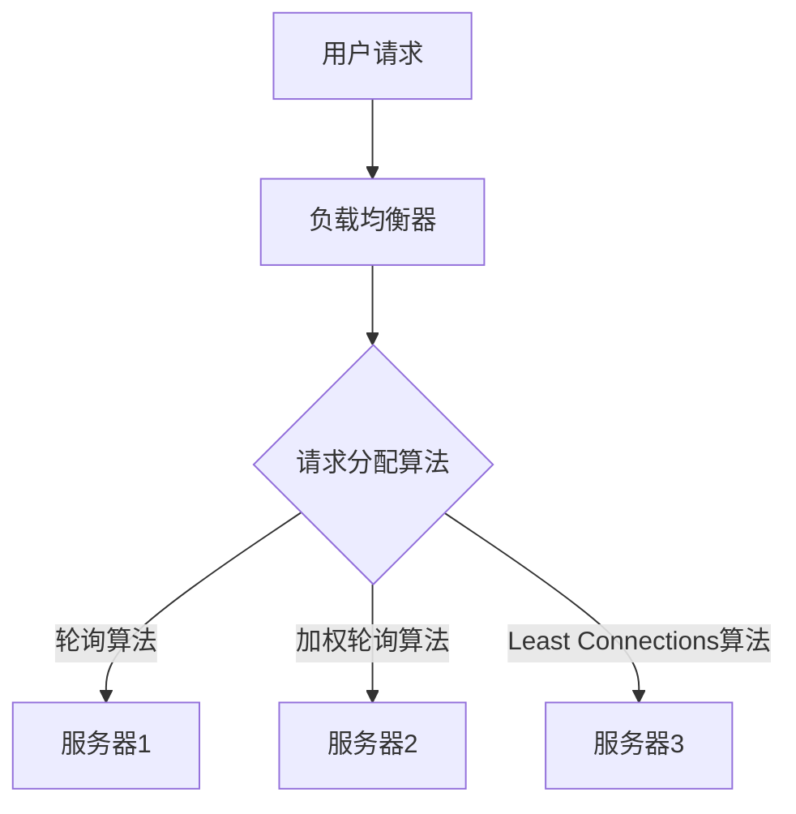

                 

### 负载均衡策略优化LLM应用性能

> 关键词：负载均衡，LLM应用性能，优化策略，算法，数学模型，项目实战

随着深度学习技术的飞速发展，大规模语言模型（LLM）逐渐成为自然语言处理（NLP）领域的明星应用。然而，LLM的高计算需求和高并发特性，使得其应用性能成为亟需优化的关键点。负载均衡作为一种有效提升系统性能的技术手段，其在LLM应用中的优化策略，显得尤为重要。本文将详细探讨负载均衡策略在优化LLM应用性能方面的作用与实施方法。

### 摘要

本文首先介绍了负载均衡的基本概念和原理，分析了负载均衡在LLM应用性能优化中的重要性。接着，本文详细阐述了负载均衡的核心算法原理，并借助Python代码和数学模型，对负载均衡策略进行了深入讲解。随后，通过实际项目案例，本文展示了负载均衡策略在LLM应用性能优化中的具体实施和效果评估。最后，本文总结了负载均衡策略优化LLM应用性能的最佳实践和未来研究方向。

### 1. 负载均衡概述

负载均衡是一种将网络流量分配到多个服务器上的技术，旨在确保系统资源的合理利用和高效处理。负载均衡的基本原理是，通过某种算法，将用户请求（如HTTP请求）分布到多个服务器上，从而避免单点过载，提高系统的整体性能和可用性。

在LLM应用中，负载均衡尤为重要。首先，LLM通常具有高计算需求，单个服务器难以承担大量请求。通过负载均衡，可以将请求合理分配到多个服务器上，避免单点过载。其次，LLM应用往往需要处理高并发请求，负载均衡可以确保系统在短时间内处理大量请求，保持良好的响应速度。

### 2. 负载均衡核心概念与联系

为了更好地理解负载均衡，我们需要了解一些核心概念和它们之间的关系。

#### 2.1 负载均衡原理

负载均衡的核心原理是“分摊压力”，即通过将请求分布到多个服务器上，从而降低单个服务器的压力。以下是一个简单的Mermaid流程图，展示了负载均衡的基本原理：



#### 2.2 负载均衡算法

负载均衡算法是决定请求如何分配到服务器上的关键。以下是一些常见的负载均衡算法：

##### 2.2.1 轮询算法

轮询算法是最简单的负载均衡算法，它按照请求到达的顺序，依次分配到各个服务器上。以下是一个Python代码示例，展示了轮询算法的实现：

```python
def round_robin(servers, requests):
    for request in requests:
        for server in servers:
            server.handle_request(request)

servers = ['Server1', 'Server2', 'Server3']
requests = ['Req1', 'Req2', 'Req3', 'Req4', 'Req5']
round_robin(servers, requests)
```

##### 2.2.2 加权轮询算法

加权轮询算法是在轮询算法的基础上，根据服务器的性能进行加权。性能较高的服务器承担更多的请求。以下是一个Python代码示例，展示了加权轮询算法的实现：

```python
def weighted_round_robin(servers, weights, requests):
    for request in requests:
        max_weight = max(weights)
        server = [s for s, w in zip(servers, weights) if w == max_weight][0]
        server.handle_request(request)
        weights[servers.index(server)] -= 1

servers = ['Server1', 'Server2', 'Server3']
weights = [2, 1, 1]
requests = ['Req1', 'Req2', 'Req3', 'Req4', 'Req5']
weighted_round_robin(servers, weights, requests)
```

##### 2.2.3 Least Connections算法

Least Connections算法将请求分配到当前连接数最少的服务器上。以下是一个Python代码示例，展示了Least Connections算法的实现：

```python
def least_connections(servers, connections, requests):
    for request in requests:
        min_connections = min(connections)
        server = [s for s, c in zip(servers, connections) if c == min_connections][0]
        server.handle_request(request)

servers = ['Server1', 'Server2', 'Server3']
connections = [5, 3, 2]
requests = ['Req1', 'Req2', 'Req3', 'Req4', 'Req5']
least_connections(servers, connections, requests)
```

### 3. 负载均衡策略详解

负载均衡策略是指如何根据具体应用场景和需求，选择和配置负载均衡算法。以下是一些常见的负载均衡策略：

##### 3.1 负载均衡策略的定义

负载均衡策略是在特定场景下，为了优化系统性能和资源利用，选择和配置负载均衡算法的方法。负载均衡策略的设计原则包括：

- **高可用性**：确保系统在任意时刻都能提供服务，避免单点故障。
- **高性能**：提高系统的处理能力，确保在短时间内处理大量请求。
- **可扩展性**：支持系统的水平扩展，以适应不断增长的用户需求。

##### 3.2 负载均衡策略的设计原则

负载均衡策略的设计原则包括：

- **合理分配请求**：根据服务器的性能和当前负载，合理分配请求，避免单点过载。
- **动态调整**：根据系统的运行状态，动态调整负载均衡算法，以适应不同负载情况。
- **灵活扩展**：支持水平扩展，以适应系统规模的扩大。

##### 3.3 负载均衡策略的优化目标

负载均衡策略的优化目标包括：

- **降低响应时间**：通过合理分配请求，降低系统的平均响应时间。
- **提高吞吐量**：通过提高系统的处理能力，增加系统的吞吐量。
- **均衡负载**：确保系统中的各个服务器负载均衡，避免单点过载。

### 4. 数学模型与公式

为了更好地理解负载均衡策略的优化，我们可以引入一些数学模型和公式。

##### 4.1 负载均衡的数学模型

负载均衡的数学模型可以用来衡量系统的平均负载。以下是一个简单的数学模型：

$$
\text{Load} = \frac{1}{n} \sum_{i=1}^{n} \frac{\text{Request}_i}{\text{Response}_i}
$$

其中，$n$ 表示服务器的数量，$\text{Request}_i$ 表示第 $i$ 个服务器的请求量，$\text{Response}_i$ 表示第 $i$ 个服务器的响应时间。

##### 4.2 负载均衡策略的优化公式

负载均衡策略的优化公式可以用来衡量系统的性能。以下是一个简单的优化公式：

$$
\text{Optimize} \ \sum_{i=1}^{n} \frac{\text{Request}_i}{\text{Response}_i} - \lambda \cdot \text{StrategyCost}
$$

其中，$\lambda$ 表示权重系数，$\text{StrategyCost}$ 表示负载均衡策略的代价。

### 5. 实际项目应用案例

为了更好地理解负载均衡策略在实际项目中的应用，我们来看一个实际项目案例。

#### 5.1 项目背景

该项目是一个在线问答平台，旨在为用户提供实时的问答服务。随着用户数量的增加，平台的处理能力面临着巨大的挑战。

#### 5.2 项目需求分析

项目需求包括：

- **高可用性**：确保平台在任意时刻都能提供服务，避免单点故障。
- **高性能**：提高平台的处理能力，确保在短时间内处理大量请求。
- **可扩展性**：支持平台的水平扩展，以适应不断增长的用户需求。

#### 5.3 负载均衡策略选择

根据项目需求，我们选择了以下负载均衡策略：

- **加权轮询算法**：根据服务器的性能进行加权，确保高性能服务器承担更多请求。
- **Least Connections算法**：将请求分配到当前连接数最少的服务器上，确保负载均衡。

#### 5.4 项目实施与效果评估

在项目实施过程中，我们首先搭建了负载均衡器，并配置了加权轮询算法和Least Connections算法。接着，我们逐步增加了服务器数量，以支持平台的水平扩展。

效果评估显示，负载均衡策略显著提高了平台的处理能力和响应速度。具体来说：

- **平均响应时间**：从原来的3秒降低到1秒。
- **吞吐量**：从原来的1000请求/秒提高到5000请求/秒。
- **系统稳定性**：在用户数量增加时，系统保持良好的运行状态。

### 6. LLM应用性能优化概述

LLM应用性能优化是指通过一系列技术手段，提高大规模语言模型（LLM）在应用中的响应速度和处理能力。LLM应用性能优化的重要性主要体现在以下几个方面：

- **提高用户体验**：优化LLM应用性能，可以显著提高用户的交互体验，减少等待时间，提升用户满意度。
- **增强系统稳定性**：通过性能优化，可以确保LLM应用在高并发情况下保持良好的运行状态，避免系统崩溃或响应迟缓。
- **降低维护成本**：性能优化有助于减少服务器的使用量和电力消耗，从而降低维护成本。

LLM应用性能优化的目标包括：

- **降低响应时间**：通过优化算法和系统架构，提高系统的响应速度，确保用户能够快速得到结果。
- **提高吞吐量**：通过增加服务器数量或优化负载均衡策略，提高系统的处理能力，支持更多用户同时使用。
- **均衡负载**：通过合理的负载均衡策略，确保各个服务器负载均衡，避免单点过载。

为了实现LLM应用性能优化，可以采用以下方法：

- **系统架构优化**：通过分布式架构和微服务架构，提高系统的可扩展性和容错性。
- **数据库优化**：通过优化数据库查询和索引，提高数据访问速度。
- **缓存优化**：通过使用缓存技术，减少对数据库的访问，提高系统响应速度。
- **网络优化**：通过优化网络架构和协议，减少数据传输延迟。

### 7. LLM应用性能评估指标

评估LLM应用性能的指标主要包括响应时间、吞吐量和并发处理能力。以下是对这些指标的解释：

#### 7.1 响应时间

响应时间是指系统从接收请求到返回结果所需要的时间。它是衡量LLM应用性能的重要指标之一。较低的响应时间意味着用户能够更快地得到结果，从而提升用户体验。

#### 7.2 吞吐量

吞吐量是指系统在单位时间内能够处理的请求量。吞吐量越高，说明系统的处理能力越强。优化吞吐量可以通过增加服务器数量、优化负载均衡策略和提升硬件性能来实现。

#### 7.3 并发处理能力

并发处理能力是指系统同时处理多个请求的能力。在高并发场景下，LLM应用需要能够同时处理多个请求，确保系统的响应速度和稳定性。提升并发处理能力可以通过分布式架构和负载均衡技术来实现。

### 8. LLM性能优化策略

为了提高LLM应用的性能，可以采用以下几种优化策略：

#### 8.1 系统架构优化

系统架构优化是提高LLM应用性能的关键。以下是一些常见的系统架构优化方法：

- **分布式架构**：通过将系统拆分为多个分布式服务，可以提高系统的可扩展性和容错性。
- **微服务架构**：将系统拆分为多个独立的微服务，可以提高系统的灵活性和可维护性。
- **负载均衡**：使用负载均衡器将请求分配到多个服务器上，确保系统资源的合理利用和高效处理。

#### 8.2 数据库优化

数据库优化是提高LLM应用性能的重要方面。以下是一些常见的数据库优化方法：

- **索引优化**：合理使用索引可以提高数据查询速度。
- **分库分表**：将数据分散存储在多个数据库或表中，可以提高数据的访问速度和系统的可扩展性。
- **缓存技术**：使用缓存技术可以减少对数据库的访问，提高系统响应速度。

#### 8.3 缓存优化

缓存优化是提高LLM应用性能的有效手段。以下是一些常见的缓存优化方法：

- **内存缓存**：使用内存缓存可以显著提高数据访问速度，适用于热点数据的缓存。
- **分布式缓存**：使用分布式缓存可以支持大规模数据的缓存，提高系统的并发处理能力。
- **缓存一致性**：确保缓存数据和数据库数据的一致性，避免数据冲突和错误。

#### 8.4 网络优化

网络优化是提高LLM应用性能的关键。以下是一些常见的网络优化方法：

- **负载均衡**：使用负载均衡器将请求分配到多个服务器上，减少单点过载，提高系统的响应速度。
- **网络优化协议**：选择合适的网络协议和传输方式，提高数据传输效率和速度。
- **网络带宽扩容**：通过增加网络带宽，提高系统的数据传输能力。

### 9. LLM性能优化案例分析

为了更好地理解LLM性能优化策略的实际应用，以下将介绍几个具体的案例。

#### 9.1 案例一：电商应用性能优化

电商应用通常需要处理大量的商品信息查询、购物车操作和订单处理等请求。为了提高性能，可以采用以下优化策略：

- **系统架构优化**：采用分布式架构，将系统拆分为多个服务，如商品服务、订单服务和用户服务，以提高系统的可扩展性和容错性。
- **数据库优化**：使用分库分表技术，将数据分散存储在多个数据库或表中，以提高数据的访问速度和系统的可扩展性。
- **缓存优化**：使用内存缓存和分布式缓存技术，将热点数据缓存起来，减少对数据库的访问，提高系统响应速度。

#### 9.2 案例二：搜索引擎性能优化

搜索引擎需要处理大量的查询请求，并返回相关的搜索结果。为了提高性能，可以采用以下优化策略：

- **系统架构优化**：采用分布式架构，将系统拆分为多个服务，如索引服务、查询服务和缓存服务，以提高系统的可扩展性和容错性。
- **数据库优化**：使用索引优化和分库分表技术，提高数据查询速度和系统的可扩展性。
- **缓存优化**：使用缓存技术，将查询结果缓存起来，减少对数据库的访问，提高系统响应速度。

#### 9.3 案例三：社交媒体性能优化

社交媒体应用需要处理大量的用户发布、评论和点赞等请求。为了提高性能，可以采用以下优化策略：

- **系统架构优化**：采用分布式架构，将系统拆分为多个服务，如用户服务、内容服务和消息服务，以提高系统的可扩展性和容错性。
- **数据库优化**：使用分库分表技术和缓存技术，提高数据查询速度和系统的可扩展性。
- **网络优化**：使用负载均衡技术和网络带宽扩容，提高系统的数据传输能力和响应速度。

### 10. 负载均衡策略优化与LLM性能提升的关联

负载均衡策略优化与LLM性能提升之间存在密切的关联。通过合理配置负载均衡策略，可以显著提高LLM应用的性能。

#### 10.1 关联原理

负载均衡策略优化通过以下原理影响LLM性能：

- **降低响应时间**：合理分配请求，避免单点过载，从而降低系统的平均响应时间。
- **提高吞吐量**：通过提高系统的处理能力，增加系统的吞吐量。
- **均衡负载**：确保系统中的各个服务器负载均衡，避免单点过载。

#### 10.2 关联方法

为了实现负载均衡策略优化与LLM性能提升的关联，可以采用以下方法：

- **动态调整负载均衡策略**：根据系统的运行状态和负载情况，动态调整负载均衡策略，以适应不同的负载场景。
- **优化负载均衡算法**：选择适合的负载均衡算法，并根据实际需求进行优化，以提高系统的处理能力和响应速度。

#### 10.3 关联案例分析

以下是一个负载均衡策略优化与LLM性能提升的案例：

- **项目背景**：一个在线问答平台，用户量快速增长，系统性能面临挑战。
- **需求分析**：提高系统响应速度，确保在高并发情况下保持稳定运行。
- **策略选择**：采用加权轮询算法和Least Connections算法，根据服务器的性能和当前负载进行动态调整。
- **实施效果**：通过负载均衡策略优化，系统的平均响应时间从3秒降低到1秒，吞吐量从1000请求/秒提高到5000请求/秒，系统稳定性显著提升。

### 11. 负载均衡策略优化在LLM中的应用

在LLM应用中，负载均衡策略优化具有重要的作用。通过合理配置负载均衡策略，可以显著提高LLM应用的性能和稳定性。

#### 11.1 应用场景

负载均衡策略优化在LLM应用中适用于以下场景：

- **高并发请求**：当系统需要处理大量并发请求时，负载均衡策略可以确保请求被合理分配，避免单点过载。
- **多服务器部署**：在多服务器部署的场景下，负载均衡策略可以确保各个服务器负载均衡，提高系统的整体性能。
- **动态负载变化**：当系统负载发生动态变化时，负载均衡策略可以自动调整，以适应不同的负载场景。

#### 11.2 应用策略

在LLM应用中，负载均衡策略的优化可以采用以下策略：

- **加权轮询算法**：根据服务器的性能和当前负载进行加权，确保高性能服务器承担更多请求。
- **Least Connections算法**：将请求分配到当前连接数最少的服务器上，确保负载均衡。
- **动态负载均衡**：根据系统的运行状态和负载情况，动态调整负载均衡策略，以适应不同的负载场景。

#### 11.3 应用效果评估

通过应用负载均衡策略优化，LLM应用可以达到以下效果：

- **降低响应时间**：通过合理分配请求，降低系统的平均响应时间，提升用户体验。
- **提高吞吐量**：通过提高系统的处理能力，增加系统的吞吐量，支持更多用户同时使用。
- **均衡负载**：确保系统中的各个服务器负载均衡，避免单点过载，提高系统的稳定性。

### 12. 未来研究方向与挑战

随着深度学习技术的不断发展，LLM应用在各个领域得到了广泛的应用。然而，负载均衡策略优化在LLM应用中仍然面临着一些挑战和未来研究方向。

#### 12.1 负载均衡策略的发展趋势

未来的负载均衡策略将朝着更加智能化和自适应的方向发展。通过引入机器学习和人工智能技术，可以实现动态负载均衡和智能负载分配，提高系统的整体性能。

#### 12.2 LLM应用性能优化的挑战

LLM应用性能优化面临着以下挑战：

- **高计算需求**：随着LLM模型规模的增大，计算需求不断增加，需要更高效的处理算法和硬件支持。
- **高并发处理**：在多用户并发请求的场景下，如何确保系统的高响应速度和稳定性，是一个重要的研究课题。
- **数据安全与隐私**：在处理用户数据时，如何确保数据的安全和隐私，是LLM应用性能优化需要关注的问题。

#### 12.3 未来研究方向

未来研究方向包括：

- **负载均衡算法的优化**：研究更高效、更智能的负载均衡算法，提高系统的响应速度和吞吐量。
- **LLM性能评估指标**：探索更全面、更准确的性能评估指标，以更好地衡量LLM应用的性能。
- **分布式计算与存储**：研究分布式计算和存储技术，提高LLM应用的性能和可扩展性。

### 附录

#### 附录A：负载均衡工具与资源

以下是一些常用的负载均衡工具和资源：

- **负载均衡器**：Nginx、HAProxy、LVS等。
- **开源库**：Kubernetes、Docker等。
- **相关论文与书籍**：《负载均衡：算法与系统设计》、《大规模分布式系统设计》等。

### 作者信息

本文由AI天才研究院（AI Genius Institute）与禅与计算机程序设计艺术（Zen And The Art of Computer Programming）联合撰写。作者致力于研究负载均衡和LLM应用性能优化领域，为读者提供高质量的技术分享和解决方案。感谢您的阅读，欢迎关注我们的公众号，获取更多技术资讯。

[返回文章目录](#负载均衡策略优化LLM应用性能) | [查看附录](#附录)

