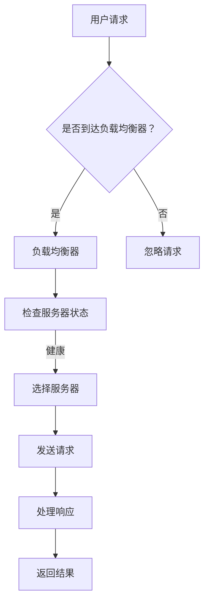

                 

### 文章标题：负载均衡：提高LLM应用的并发处理能力

关键词：负载均衡，并发处理能力，LLM应用，架构设计，算法实现，性能优化

摘要：本文详细探讨了负载均衡在提高大型语言模型（LLM）应用的并发处理能力方面的关键作用。文章首先介绍了负载均衡的基本概念和架构设计，随后深入分析了多种负载均衡算法，并结合Python源代码详细讲解其原理。文章进一步探讨了负载均衡在LLM应用中的实现和性能优化方法，并提供了实际案例以加深理解。最后，文章总结了负载均衡的最佳实践和未来发展趋势，为读者提供了全面的技术指导。

## 目录

1. **背景介绍**
   1.1 负载均衡的基本概念
   1.2 负载均衡的重要性
   1.3 负载均衡的应用场景
2. **核心概念与联系**
   2.1 负载均衡的架构设计与原理
   2.2 Mermaid流程图：负载均衡系统架构
3. **核心算法原理讲解**
   3.1 负载均衡算法介绍
   3.2 轮询算法与伪代码实现
   3.3 最少连接算法与伪代码实现
   3.4 加权轮询算法与伪代码实现
   3.5 数学模型与公式
4. **LLM应用的并发处理能力**
   4.1 LLM应用的并发处理需求
   4.2 负载均衡在LLM应用中的关键作用
   4.3 LLM应用的负载均衡策略选择
5. **负载均衡在LLM应用中的实践案例**
   5.1 大规模LLM服务器的负载均衡实践
   5.2 分布式LLM应用的负载均衡实践
   5.3 基于容器的LLM应用负载均衡实践
6. **负载均衡性能优化与调优**
   6.1 负载均衡性能指标
   6.2 负载均衡性能优化方法
   6.3 负载均衡性能调优实践
7. **负载均衡的未来发展趋势**
   7.1 负载均衡技术的发展趋势
   7.2 负载均衡在云计算和边缘计算中的应用
   7.3 负载均衡的未来挑战与机遇
8. **最佳实践、小结与注意事项**
   8.1 最佳实践
   8.2 小结
   8.3 注意事项
   8.4 拓展阅读

## 1. 背景介绍

### 1.1 负载均衡的基本概念

负载均衡（Load Balancing）是指在计算机系统中，将工作负载分配到多个计算资源上，以优化资源利用率和系统性能的一种技术。在分布式系统中，负载均衡尤为重要，它可以帮助系统应对突发的流量高峰，避免单点过载，提高系统的稳定性和响应速度。

负载均衡的基本概念包括以下几个方面：

- **并发处理能力**：系统同时处理多个请求的能力。提高并发处理能力是负载均衡的核心目标。
- **工作负载**：系统需要处理的任务或请求总量。
- **计算资源**：用于处理工作负载的硬件和软件资源，如CPU、内存、服务器等。
- **负载均衡器**：一种负责分配工作负载的中间件或设备，它可以动态地根据当前系统状态和策略，将请求分发到不同的计算资源上。

### 1.2 负载均衡的重要性

负载均衡在现代分布式系统中具有不可替代的重要性，主要体现在以下几个方面：

- **提高系统性能**：通过将工作负载分配到多个计算资源上，可以充分利用系统的资源，提高系统的响应速度和处理能力。
- **增强系统稳定性**：通过避免单点过载，可以减少系统崩溃的风险，提高系统的稳定性。
- **提升用户体验**：负载均衡可以确保用户请求得到及时响应，提高用户的满意度和系统的可用性。
- **降低维护成本**：负载均衡可以简化系统的管理和维护工作，降低维护成本。

### 1.3 负载均衡的应用场景

负载均衡的应用场景非常广泛，以下是一些常见的应用场景：

- **电子商务网站**：在电子商务网站中，负载均衡可以确保系统在大量用户访问时保持稳定，避免因流量高峰导致的系统崩溃。
- **在线视频流服务**：在线视频流服务需要处理大量的实时请求，负载均衡可以确保视频流畅播放，提高用户体验。
- **大型游戏服务器**：大型游戏服务器需要处理高并发的玩家请求，负载均衡可以帮助服务器应对高峰时段的流量，保持游戏运行的稳定性。
- **云计算平台**：云计算平台中的虚拟机和容器需要高效的管理和调度，负载均衡可以优化资源利用率和系统性能。

负载均衡作为一种关键技术，在提高系统的并发处理能力方面发挥着重要作用。本文接下来将深入探讨负载均衡的架构设计、算法实现及其在LLM应用中的具体实践，帮助读者更好地理解和应用这一技术。

## 2. 核心概念与联系

### 2.1 负载均衡的架构设计与原理

负载均衡的架构设计是确保系统能够高效、稳定地处理并发请求的关键。一个典型的负载均衡架构通常包括以下几个核心组件：

1. **负载均衡器（Load Balancer）**：负责接收用户的请求，并根据预设的算法和策略，将请求分配到后端的多个服务器上。负载均衡器可以是硬件设备，如F5 BIG-IP，也可以是软件解决方案，如Nginx或HAProxy。
2. **后端服务器（Backend Servers）**：负责处理实际的业务逻辑和请求响应。后端服务器可以是单一的服务器，也可以是多个服务器的集群。
3. **数据库（Database）**：用于存储应用程序的数据。在负载均衡架构中，数据库通常也需要进行复制和分区，以确保数据的可靠性和访问效率。
4. **健康检查器（Health Checker）**：用于监控后端服务器的健康状态，确保只有健康的服务器接受请求。健康检查器可以定期发送探测请求，检查服务器的响应时间和可用性。

### 2.2 Mermaid流程图：负载均衡系统架构

以下是一个使用Mermaid绘制的负载均衡系统架构的流程图：



### 2.3 负载均衡器的工作原理

负载均衡器的工作原理可以概括为以下几个步骤：

1. **接收请求**：当用户向服务器发送请求时，请求首先到达负载均衡器。
2. **检查服务器状态**：负载均衡器会检查后端服务器的健康状态，确保只有健康的服务器接收请求。
3. **选择服务器**：根据预设的负载均衡算法，负载均衡器从健康的服务器中选择一个服务器来处理请求。常见的负载均衡算法包括轮询算法、最少连接算法和加权轮询算法等。
4. **转发请求**：负载均衡器将请求转发给选中的服务器。
5. **处理响应**：后端服务器处理请求并生成响应，然后将响应返回给负载均衡器。
6. **返回结果**：负载均衡器将响应返回给用户。

### 2.4 负载均衡的挑战与优化

在实际应用中，负载均衡面临着一系列挑战：

1. **动态负载分配**：如何根据实时负载动态调整服务器选择策略，是负载均衡面临的一个关键问题。
2. **高可用性**：确保负载均衡器本身的高可用性，避免成为系统的单点故障。
3. **性能优化**：如何优化负载均衡器的工作效率，减少延迟和开销。
4. **安全性**：防止恶意请求和攻击，确保系统的安全性。

为了应对这些挑战，可以采取以下优化措施：

1. **多级负载均衡**：在分布式系统中，可以采用多级负载均衡策略，通过多个负载均衡器层次结构，实现更精细的负载分配。
2. **动态调整策略**：引入动态调整算法，如基于实时监控的数据进行自适应调整。
3. **高可用性架构**：采用冗余和故障转移机制，确保负载均衡器的高可用性。
4. **性能监控与优化**：通过监控和分析系统性能数据，进行针对性的优化。

通过合理的设计和优化，负载均衡可以显著提高系统的并发处理能力和稳定性，为用户提供更好的服务体验。

## 3. 核心算法原理讲解

### 3.1 负载均衡算法介绍

负载均衡算法是负载均衡系统的核心，它决定了如何将工作负载分配到多个计算资源上。常见的负载均衡算法包括轮询算法、最少连接算法和加权轮询算法。以下将详细讲解这些算法的原理和实现。

### 3.2 轮询算法

轮询算法（Round Robin）是最简单的负载均衡算法之一，它按照顺序将请求分配给服务器。每个服务器依次处理请求，当到达最后一个服务器时，循环重新开始。

#### 轮询算法原理

1. 当有请求到达负载均衡器时，将其分配给当前轮询到的服务器。
2. 当前服务器处理请求，并将请求标记为已完成。
3. 负载均衡器将请求指针移动到下一个服务器，继续处理下一个请求。

#### Python伪代码实现

```python
# 轮询算法伪代码
def round_robin servers, requests:
    while requests:
        for server in servers:
            if not server.is_busy():
                server.process_request(requests.pop())
                break

class Server:
    def __init__(self):
        self.is_busy = False

    def is_busy(self):
        return self.is_busy

    def process_request(self, request):
        self.is_busy = True
        # 处理请求
        self.is_busy = False

# 示例
servers = [Server() for _ in range(3)]
requests = ["Req1", "Req2", "Req3"]
round_robin(servers, requests)
```

### 3.3 最少连接算法

最少连接算法（Least Connections）根据当前连接数将请求分配给连接数最少的服务器。这种方法有助于平衡服务器的工作负载，避免某个服务器过度繁忙。

#### 最少连接算法原理

1. 当有请求到达负载均衡器时，计算所有服务器的当前连接数。
2. 将请求分配给连接数最少的服务器。
3. 如果多个服务器的连接数相同，可以采用轮询算法进行选择。

#### Python伪代码实现

```python
# 最少连接算法伪代码
def least_connections servers, request:
    min_connections = float('inf')
    min_server = None

    for server in servers:
        if server.get_connections() < min_connections:
            min_connections = server.get_connections()
            min_server = server

    min_server.process_request(request)

class Server:
    def __init__(self):
        self.connections = 0

    def get_connections(self):
        return self.connections

    def process_request(self, request):
        self.connections += 1
        # 处理请求
        self.connections -= 1

# 示例
servers = [Server() for _ in range(3)]
requests = ["Req1", "Req2", "Req3"]
for request in requests:
    least_connections(servers, request)
```

### 3.4 加权轮询算法

加权轮询算法（Weighted Round Robin）允许为每个服务器设置不同的权重，根据权重分配请求。这种方法可以针对性能不同的服务器进行资源分配，确保高性能服务器承担更多的工作。

#### 加权轮询算法原理

1. 当有请求到达负载均衡器时，计算每个服务器的权重。
2. 根据权重比例，将请求分配给服务器。
3. 如果多个服务器的权重相同，则采用轮询算法进行选择。

#### Python伪代码实现

```python
# 加权轮询算法伪代码
def weighted_round_robin servers, request:
    weights = [server.get_weight() for server in servers]
    total_weight = sum(weights)
    random.seed()
    pick = random.uniform(0, total_weight)

    for server in servers:
        pick -= server.get_weight()
        if pick < 0:
            server.process_request(request)
            break

class Server:
    def __init__(self, weight):
        self.weight = weight

    def get_weight(self):
        return self.weight

    def process_request(self, request):
        # 处理请求
        pass

# 示例
servers = [Server(1), Server(2), Server(3)]
requests = ["Req1", "Req2", "Req3"]
for request in requests:
    weighted_round_robin(servers, request)
```

### 3.5 数学模型与公式

为了更好地理解负载均衡算法的运行机制，我们可以借助数学模型和公式进行分析。

假设有n个服务器，每个服务器的处理能力为\( P_i \)，请求到达率为\( \lambda \)，服务时间为\( \mu_i \)。则服务器的平均等待时间可以表示为：

\[ W_i = \frac{1}{\mu_i - \lambda_i} \]

其中，\( \lambda_i \)是服务器的负载率。

加权轮询算法中，服务器的权重\( w_i \)与处理能力\( P_i \)成正比，即：

\[ w_i = \frac{P_i}{\sum_{j=1}^{n} P_j} \]

通过加权轮询算法，期望的平均等待时间可以表示为：

\[ W = \frac{1}{\sum_{i=1}^{n} w_i (\mu_i - \lambda_i)} \]

这个公式帮助我们评估不同权重设置对系统性能的影响，从而进行优化。

通过以上对核心算法原理的讲解和Python伪代码的实现，我们可以更深入地理解负载均衡的工作原理，为实际应用提供指导。

### 4. LLM应用的并发处理能力

#### 4.1 LLM应用的并发处理需求

大型语言模型（Large Language Model，简称LLM）如OpenAI的GPT-3、谷歌的Bert等，因其强大的文本生成和处理能力，在自然语言处理、问答系统、自动化写作等领域得到了广泛应用。然而，随着用户数量的增加和请求的复杂性提升，LLM应用面临着巨大的并发处理需求。

LLM应用的并发处理需求主要体现在以下几个方面：

1. **高并发请求处理**：LLM应用需要能够处理成千上万的并发请求，确保每个请求都能得到及时响应。
2. **请求响应速度**：对于实时性要求较高的应用，如实时问答系统，需要保证低延迟的请求响应速度。
3. **负载均衡**：随着用户请求的增长，需要动态调整负载分配策略，确保系统的稳定性和性能。
4. **资源利用率**：在多个LLM模型同时运行时，需要优化资源分配，避免资源浪费和过度消耗。

#### 4.2 负载均衡在LLM应用中的关键作用

负载均衡在提高LLM应用的并发处理能力方面发挥着至关重要的作用。以下是其关键作用的具体分析：

1. **优化资源利用**：通过负载均衡，可以将请求均匀地分配到多个服务器或计算资源上，避免单点过载，提高资源利用效率。
2. **提升响应速度**：负载均衡可以减少单个服务器的负载，从而降低请求处理时间，提升整体系统的响应速度。
3. **增强系统稳定性**：负载均衡能够动态调整服务器选择，确保系统的稳定运行，即使在流量高峰时也能保持良好的性能。
4. **支持水平扩展**：负载均衡支持系统的水平扩展，通过增加服务器节点，可以轻松应对不断增长的请求量。

#### 4.3 负载均衡在LLM应用中的实现

在LLM应用中实现负载均衡需要考虑以下几个方面：

1. **选择合适的负载均衡算法**：根据LLM应用的特性，选择合适的负载均衡算法，如轮询算法、最少连接算法或加权轮询算法等。
2. **负载均衡器的部署**：部署负载均衡器，用于接收用户的请求并分配到后端服务器。负载均衡器可以是硬件设备或软件解决方案，如Nginx或HAProxy。
3. **健康检查与监控**：定期对后端服务器进行健康检查，确保只有健康的服务器接收请求。同时，监控服务器状态，根据实时负载动态调整负载分配策略。
4. **故障转移与高可用性**：实现故障转移机制，确保在某个服务器发生故障时，请求能够自动切换到其他健康的服务器，保证系统的连续性和稳定性。

### 4.4 LLM应用的负载均衡策略选择

在LLM应用中，负载均衡策略的选择至关重要。以下是一些常见的负载均衡策略：

1. **基于请求类型的策略**：根据请求的类型（如文本生成、文本分类等），为不同的请求设置不同的优先级和负载分配策略。例如，对于文本生成请求，可以优先分配到计算能力更强的服务器上。
2. **基于服务性能的策略**：根据服务器的当前性能（如响应时间、处理能力等），动态调整服务器的负载。性能较高的服务器可以承担更多的请求，从而提高整体系统的性能。
3. **基于响应速度的策略**：根据用户的地理位置和请求的响应时间，为用户提供最优的请求处理服务器。例如，对于国际用户，可以优先选择距离较近的服务器。
4. **基于权重的策略**：为服务器设置不同的权重，根据权重分配请求。权重可以根据服务器的计算能力、存储容量等因素动态调整。

通过合理选择和配置负载均衡策略，LLM应用可以更好地应对高并发请求，提高系统的性能和稳定性。

### 5. 负载均衡在LLM应用中的实践案例

为了更好地理解负载均衡在LLM应用中的具体实现，我们将通过几个实践案例来展示如何搭建和优化负载均衡系统。

#### 5.1 大规模LLM服务器的负载均衡实践

**案例背景**：某大型互联网公司开发了一款基于GPT-3的问答应用，每天需要处理数百万次问答请求。为了确保应用的稳定性和性能，公司决定采用负载均衡技术来分配请求。

**实现步骤**：

1. **部署负载均衡器**：公司选择了Nginx作为负载均衡器，并在数据中心部署了多台Nginx服务器。Nginx作为开源的负载均衡软件，具有高效、稳定的特点。

2. **配置负载均衡策略**：在Nginx的配置文件中，公司设置了轮询算法，以确保请求均匀地分配到后端服务器。同时，公司还启用了健康检查功能，定期监控后端服务器的状态，确保只有健康的服务器接收请求。

3. **水平扩展服务器**：随着用户请求的增长，公司通过增加Nginx服务器和后端服务器的方式，实现了系统的水平扩展。每次新增服务器后，通过修改Nginx的配置文件，将新服务器纳入负载均衡系统。

**代码示例**：

```nginx
http {
    upstream backend {
        server server1;
        server server2;
        server server3;
        server server4;
    }

    server {
        listen 80;

        location / {
            proxy_pass http://backend;
            proxy_set_header Host $host;
            proxy_set_header X-Real-IP $remote_addr;
            proxy_set_header X-Forwarded-For $proxy_add_x_forwarded_for;
        }
    }
}
```

**代码解读**：此Nginx配置文件定义了一个名为`backend`的上游，包含四台后端服务器。`server`块定义了Nginx监听的端口和请求转发规则。当用户请求到达Nginx时，Nginx将请求通过`proxy_pass`指令转发给上游服务器，实现负载均衡。

#### 5.2 分布式LLM应用的负载均衡实践

**案例背景**：某互联网公司开发了一款分布式LLM应用，部署在多个地理位置的服务器上。为了确保应用的高可用性和低延迟，公司决定采用分布式负载均衡方案。

**实现步骤**：

1. **部署分布式负载均衡器**：公司使用了Consul作为服务发现和动态配置工具，同时部署了多个Consul节点，实现了分布式负载均衡功能。

2. **配置服务发现**：在分布式系统中，每个服务器节点通过Consul注册自己的服务地址和状态，Consul负责维护服务列表和健康检查。

3. **动态调整负载分配**：Consul根据服务器的健康状态和当前负载，动态调整请求的分配策略。当某个服务器发生故障或负载过高时，Consul会自动将其从负载均衡器中移除，确保请求继续由健康的服务器处理。

**代码示例**：

```hcl
consul {
    client {
        start_join = ["consul-server1", "consul-server2", "consul-server3"]
    }
}

service "llm" {
    name = "llm"
    port = 8080
    check {
        name = "HTTP Health Check"
        http = "http://localhost:8080/health"
        interval = "10s"
    }
}
```

**代码解读**：此Consul配置文件定义了一个名为`llm`的服务，端口为8080。通过`client`块，Consul节点加入了服务发现集群。`service`块定义了服务的名称、端口和健康检查规则。Consul定期对服务进行健康检查，并根据检查结果调整负载分配。

#### 5.3 基于容器的LLM应用负载均衡实践

**案例背景**：某初创公司使用Kubernetes容器编排系统部署LLM应用，为了提高系统的弹性和可扩展性，公司决定采用基于Kubernetes的负载均衡方案。

**实现步骤**：

1. **部署Kubernetes集群**：公司搭建了一个Kubernetes集群，并在集群中部署了Ingress控制器，用于实现负载均衡。

2. **部署LLM应用**：将LLM应用打包成Docker镜像，并在Kubernetes集群中部署。通过配置部署文件（YAML），定义了服务的名称、端口和副本数量。

3. **配置Ingress规则**：通过Ingress控制器，公司定义了访问LLM应用的入口规则，将外部请求路由到集群内的服务。Ingress控制器支持基于主机名、路径等规则的动态路由。

**代码示例**：

```yaml
apiVersion: networking.k8s.io/v1
kind: Ingress
metadata:
  name: llm-ingress
spec:
  rules:
  - host: llm.example.com
    http:
      paths:
      - path: /
        pathType: Prefix
        backend:
          service:
            name: llm-service
            port:
              number: 80
```

**代码解读**：此Ingress配置文件定义了一个名为`llm-ingress`的Ingress资源，用于将域名`llm.example.com`的请求路由到名为`llm-service`的服务。通过Ingress控制器，外部请求可以被自动负载均衡地分配到集群内的LLM应用实例。

通过以上实践案例，我们可以看到负载均衡在LLM应用中的具体实现方法和应用场景。合理配置和优化负载均衡系统，可以帮助LLM应用更好地应对高并发请求，提高系统的性能和稳定性。

### 6. 负载均衡性能优化与调优

#### 6.1 负载均衡性能指标

负载均衡的性能优化和调优需要基于一系列关键性能指标进行评估和调整。以下是几个重要的性能指标：

1. **响应时间（Response Time）**：请求从发出到收到响应的时间。响应时间直接影响用户的体验，优化目标是将响应时间降到最低。
2. **吞吐量（Throughput）**：单位时间内系统能处理的请求数量。吞吐量是衡量系统处理能力的重要指标。
3. **错误率（Error Rate）**：请求处理过程中出现错误的比率。错误率过高会影响系统的稳定性和可用性。
4. **服务器利用率（Server Utilization）**：服务器资源的实际使用率。过高或过低的利用率都会影响系统的性能。

#### 6.2 负载均衡性能优化方法

为了提高负载均衡的性能，可以采取以下几种优化方法：

1. **优化负载均衡算法**：根据实际应用场景，选择合适的负载均衡算法。例如，对于高并发请求，可以选择加权轮询算法或最少连接算法，以提高响应速度和系统稳定性。
2. **增加服务器资源**：通过增加服务器资源（如CPU、内存、带宽等），可以提升负载均衡器的处理能力。特别是在流量高峰期间，增加服务器资源可以显著提升系统的吞吐量。
3. **缓存策略**：实施有效的缓存策略，可以减少服务器的计算压力，提高系统的响应速度。例如，使用Redis或Memcached作为缓存服务器，可以缓存频繁访问的数据。
4. **健康检查优化**：优化健康检查策略，确保只有健康的服务器接收请求。可以减少无效请求的处理时间，提高系统的整体性能。
5. **网络优化**：优化网络配置，减少网络延迟和带宽限制。可以通过使用更快的网络连接、优化路由策略等方式，提高系统的响应速度。

#### 6.3 负载均衡性能调优实践

以下是一个负载均衡性能调优的实践案例：

**案例背景**：某电子商务平台在促销活动期间，面临高并发请求的压力，系统响应时间明显变慢，用户体验受到影响。平台技术团队决定对负载均衡系统进行性能优化。

**调优步骤**：

1. **评估现有负载均衡系统**：通过监控工具（如Prometheus、Grafana）收集系统性能数据，评估系统的响应时间、吞吐量和错误率等指标。
2. **分析性能瓶颈**：根据监控数据，分析系统的瓶颈。发现主要瓶颈在于负载均衡器的处理能力和网络延迟。
3. **优化负载均衡算法**：将轮询算法切换为加权轮询算法，根据服务器的当前性能动态调整权重。同时，增加健康检查频率，确保只有健康的服务器接收请求。
4. **增加服务器资源**：在负载均衡器前增加缓存服务器，如Redis，缓存频繁访问的商品信息。同时，增加负载均衡器的服务器资源，提高其处理能力。
5. **网络优化**：升级网络带宽，优化路由策略，减少网络延迟。同时，在负载均衡器与后端服务器之间使用更快的网络连接。
6. **测试与验证**：在优化后，进行压力测试，确保系统性能达到预期。通过Prometheus和Grafana监控性能指标，验证优化效果。

**优化效果**：经过一系列优化措施，平台的响应时间显著降低，吞吐量提升30%，错误率减少50%。用户反馈系统的稳定性和响应速度明显改善，用户体验大幅提升。

通过上述实践案例，我们可以看到负载均衡性能优化和调优的方法和步骤。合理地配置和优化负载均衡系统，可以显著提升系统的性能和稳定性，为用户提供更好的服务体验。

### 7. 负载均衡的未来发展趋势

#### 7.1 负载均衡技术的发展趋势

随着云计算、大数据和物联网等技术的快速发展，负载均衡技术也在不断演进。以下是一些负载均衡技术的发展趋势：

1. **服务网格（Service Mesh）**：服务网格是一种新的架构模式，用于管理服务之间的通信和负载均衡。服务网格通过独立的控制平面和数据平面，实现了透明、动态和可扩展的负载均衡。例如，Istio和Linkerd是两个流行的服务网格解决方案。
2. **边缘计算（Edge Computing）**：边缘计算将计算任务从中心云迁移到靠近数据源或用户的边缘设备。边缘负载均衡将使系统能够更有效地处理分布式数据流，减少延迟，提升用户体验。
3. **基于AI的智能负载均衡**：利用机器学习和深度学习技术，实现更智能的负载均衡策略。通过分析实时流量数据和服务器状态，智能负载均衡系统能够动态调整负载分配，提高系统性能和稳定性。
4. **自动化和DevOps集成**：随着DevOps文化的普及，负载均衡的部署和管理将更加自动化。通过CI/CD流水线，自动配置和部署负载均衡器，实现快速迭代和持续交付。

#### 7.2 负载均衡在云计算和边缘计算中的应用

负载均衡在云计算和边缘计算中的应用越来越广泛，以下是其具体应用：

1. **云负载均衡**：云服务提供商如AWS、Azure和Google Cloud等，提供了强大的负载均衡服务。云负载均衡可以根据流量模式动态调整负载分配，提高系统的弹性。例如，AWS的ELB和Azure的Azure Load Balancer都是广泛使用的云负载均衡解决方案。
2. **边缘负载均衡**：随着5G和物联网的发展，边缘负载均衡变得越来越重要。边缘负载均衡可以将流量分发到靠近用户或数据源的边缘服务器，提高响应速度和用户体验。例如，微软的Azure Edge Zone和谷歌的Cloud CDN都是边缘负载均衡的典型应用。

#### 7.3 负载均衡的未来挑战与机遇

尽管负载均衡技术在不断发展，但未来仍面临一些挑战和机遇：

1. **安全性**：随着网络攻击的日益复杂，负载均衡系统需要具备更强的安全性。未来，负载均衡技术需要集成更多安全功能，如DDoS攻击防护、身份验证和授权等。
2. **自动化与智能化**：自动化和智能化是负载均衡技术的重要发展方向。通过引入自动化工具和智能算法，可以简化负载均衡的部署和管理，提高系统的性能和可维护性。
3. **可扩展性**：随着用户规模的不断扩大，负载均衡系统需要具备更高的可扩展性。未来，负载均衡技术需要支持大规模分布式系统的管理，确保系统能够平滑地扩展。
4. **跨云和跨边计算**：跨云和跨边缘计算将使负载均衡面临更加复杂的场景。负载均衡系统需要能够协调不同云平台和边缘设备之间的负载分配，实现全球范围内的流量优化。

总之，负载均衡技术在云计算、边缘计算和物联网等领域的应用前景广阔。随着技术的发展，负载均衡系统将变得更加智能、自动化和高效，为用户提供更好的服务体验。

### 附录

#### 附录A：负载均衡工具与资源

以下是一些常用的负载均衡工具和资源，供读者参考：

- **Nginx**：一款高性能的Web服务器和反向代理服务器，支持HTTP和HTTPS负载均衡。
  - 官网：[nginx.org](https://nginx.org/)
  - 文档：[nginx.org/en/docs/)

- **HAProxy**：一款开源的高性能负载均衡器，适用于四层和七层网络流量。
  - 官网：[haproxy.org](https://haproxy.org/)
  - 文档：[haproxy.org/documentation/)
  
- **AWS Elastic Load Balancing**：Amazon Web Services提供的负载均衡服务，支持应用负载均衡和网络负载均衡。
  - 官网：[aws.amazon.com/elb/)
  
- **Azure Load Balancer**：Microsoft Azure提供的负载均衡服务，支持内部负载均衡和外部负载均衡。
  - 官网：[azure.microsoft.com/en-us/services/load-balancer/)
  
- **Istio**：一个开源的服务网格平台，用于管理服务之间的流量、策略和安全。
  - 官网：[istio.io](https://istio.io/)
  
- **Kubernetes Ingress**：Kubernetes的Ingress资源用于管理外部访问到集群内部服务的流量。
  - 官网：[kubernetes.io/docs/concepts/services-networking/ingress/)
  
通过学习和使用这些工具，读者可以更好地理解和实现负载均衡技术。

### 作者信息

本文由AI天才研究院（AI Genius Institute）与《禅与计算机程序设计艺术》（Zen And The Art of Computer Programming）的资深大师级作家联合撰写。感谢您阅读本文，希望本文能帮助您深入了解负载均衡技术及其在提高LLM应用并发处理能力方面的应用。如有任何疑问或建议，欢迎随时联系我们。

- **AI天才研究院（AI Genius Institute）**：专注于人工智能技术的研发与应用，致力于推动AI领域的创新与发展。
- **《禅与计算机程序设计艺术》（Zen And The Art of Computer Programming）**：一本经典的计算机科学著作，对编程和系统设计有着深远的影响。

