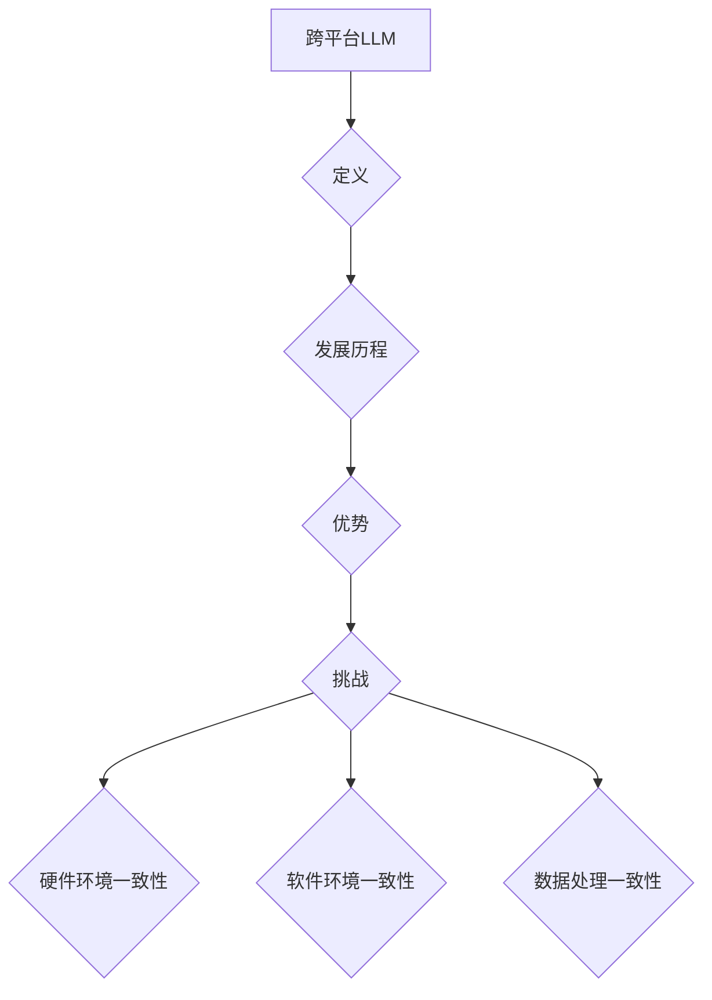
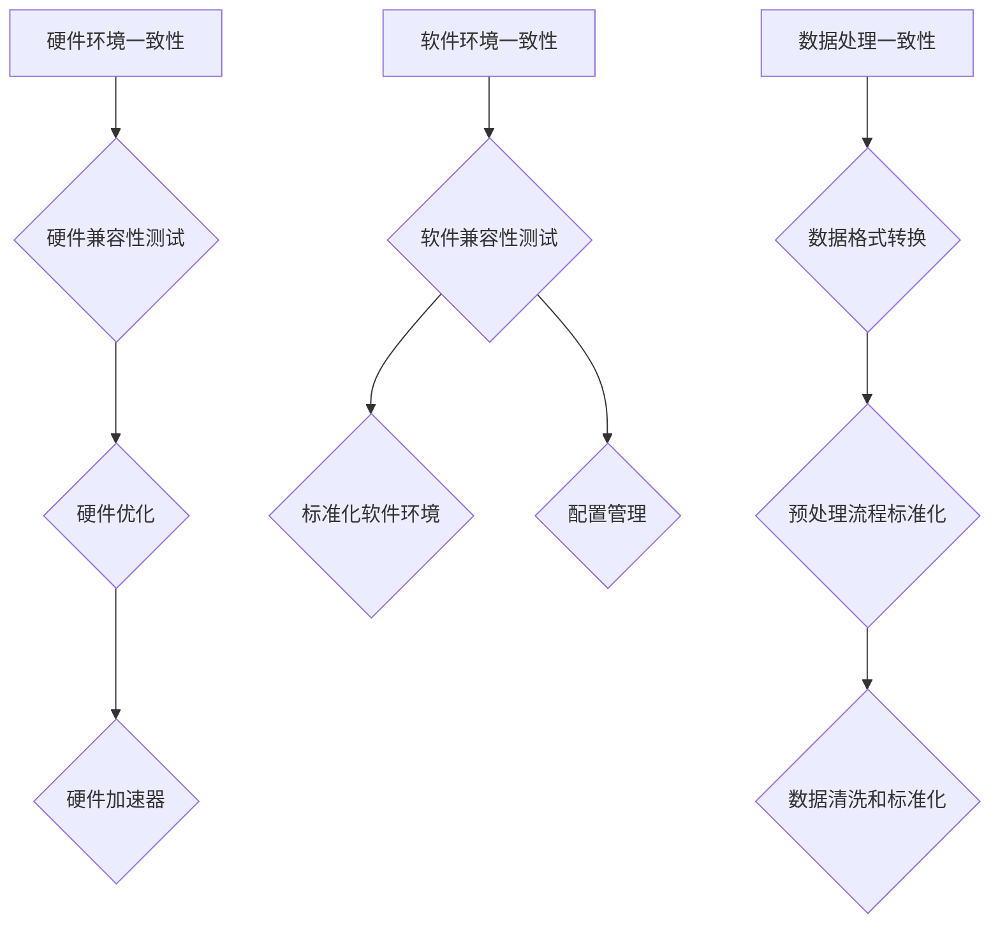
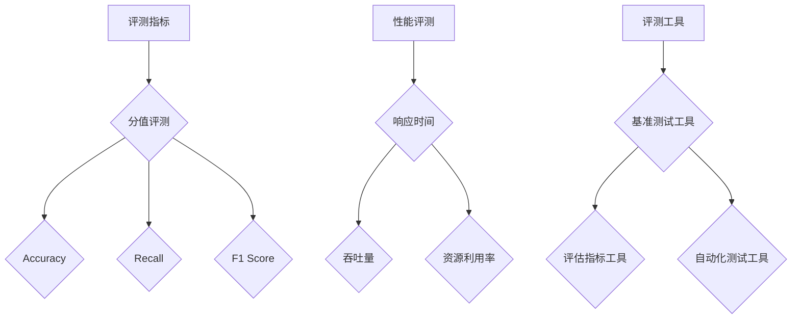
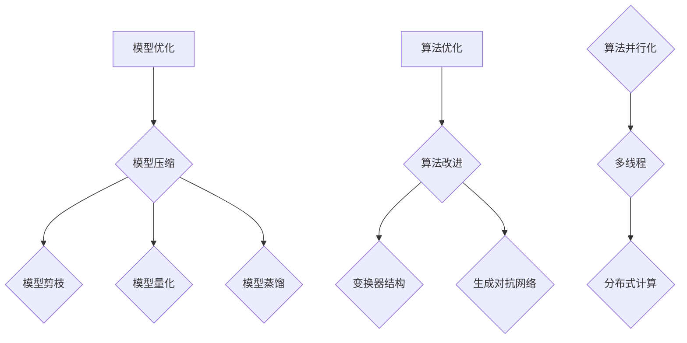

                 

# 跨平台LLM评测：确保在不同环境下的一致性

## 关键词
跨平台，大规模语言模型（LLM），评测，环境一致性，性能优化

## 摘要
本文将探讨跨平台大规模语言模型（LLM）的评测问题，强调确保LLM在不同环境下一致性的重要性。通过对LLM的核心概念、算法原理、环境一致性、评测方法、性能优化以及项目实战的深入分析，本文旨在为读者提供全面、系统的跨平台LLM评测指导。

## 引言

随着人工智能技术的飞速发展，大规模语言模型（Large Language Model，简称LLM）已成为自然语言处理（Natural Language Processing，简称NLP）领域的核心工具。LLM在文本生成、机器翻译、问答系统等应用中取得了显著的成果。然而，跨平台LLM的评测问题日益凸显，因为不同的硬件平台、操作系统和软件环境可能会对LLM的性能产生显著影响。确保跨平台LLM的一致性对于其广泛应用和实际应用具有重要意义。

本文将首先介绍跨平台LLM的核心概念和联系，包括其定义、发展历程和优势。接着，我们将深入探讨LLM的核心算法原理，从数学模型、训练过程到预测过程进行详细分析。随后，本文将重点关注跨平台LLM的环境一致性，包括硬件环境一致性、软件环境一致性和数据处理一致性。在此基础上，我们将介绍跨平台LLM的评测方法和性能优化策略。最后，本文将通过一个实际项目案例，展示跨平台LLM的实战应用和效果分析，并总结全文，展望跨平台LLM的发展趋势和未来研究方向。

## 第1章：跨平台LLM简介

### 1.1 跨平台LLM的定义

跨平台大规模语言模型（Cross-platform Large Language Model，简称跨平台LLM）是指在多种操作系统、硬件平台和软件环境中能够运行的语言模型。与传统单一平台LLM相比，跨平台LLM具有更强的适应性，能够在不同的环境下保持一致的性能。跨平台LLM的设计和实现需要考虑多个方面，包括模型架构、数据格式、算法优化等。

### 1.2 跨平台LLM的发展历程

跨平台LLM的发展历程可以追溯到人工智能技术的兴起。最初，LLM主要在单一操作系统和硬件平台上运行，如Windows系统下的CPU和GPU。随着云计算、大数据和物联网等技术的发展，跨平台需求逐渐增加，跨平台LLM逐渐成为研究热点。近年来，随着移动设备的普及和多模态数据的增加，跨平台LLM在智能语音助手、智能客服等应用中得到了广泛应用。

### 1.3 跨平台LLM的优势

跨平台LLM具有以下优势：

1. **提高开发效率**：跨平台LLM可以减少重复开发工作，降低开发成本。
2. **降低开发成本**：跨平台LLM能够适应不同的硬件平台和软件环境，减少硬件和软件的采购和配置成本。
3. **提升用户体验**：跨平台LLM可以在不同设备上提供一致的服务，提升用户体验。
4. **适应不同的硬件环境和软件环境**：跨平台LLM能够根据不同硬件平台和软件环境的特点进行优化，提高性能。

### 1.4 跨平台LLM面临的挑战

跨平台LLM面临以下挑战：

1. **硬件环境一致性**：不同硬件平台（如CPU、GPU、FPGA等）对LLM的性能影响较大，如何保证硬件环境一致性成为关键问题。
2. **软件环境一致性**：不同操作系统（如Windows、Linux、macOS等）和软件环境（如编译器、库函数等）可能导致LLM性能差异，如何保证软件环境一致性成为挑战。
3. **数据处理一致性**：不同平台的数据格式和预处理流程可能不一致，如何保证数据处理一致性成为关键问题。

### 1.5 跨平台LLM的核心概念与联系Mermaid流程图



## 第2章：LLM的核心算法原理

### 2.1 语言模型的数学模型

语言模型（Language Model，简称LM）是一种概率模型，用于预测自然语言序列的概率。最常见的语言模型是基于N元语法（N-gram Model），其中N表示上下文的长度。N元语法的数学模型可以表示为：

$$
P(w_n | w_{n-1}, w_{n-2}, \ldots, w_1) = \frac{C(w_{n-1}, w_n)}{\sum_{w' \in V} C(w_{n-1}, w')}
$$

其中，$w_n$表示第n个单词，$w_{n-1}, w_{n-2}, \ldots, w_1$表示前n-1个单词，$C(w_{n-1}, w_n)$表示单词对$(w_{n-1}, w_n)$在训练数据中出现的次数，$V$表示单词的集合。

### 2.2 语言模型的训练过程

语言模型的训练过程是基于大量文本数据的学习过程。训练过程包括以下步骤：

1. **数据预处理**：对文本数据进行处理，包括分词、去除停用词、词性标注等。
2. **构建词汇表**：将文本数据中的单词映射到唯一的整数标识。
3. **计算词频**：计算每个单词在文本数据中出现的次数。
4. **构建N元语法模型**：根据词频数据，计算每个N元组的概率。

以下是一个简化的Python代码示例，用于训练一个简单的二元语法模型：

```python
import collections

def train_bigram_model(text):
    # 分词
    words = text.split()
    # 计算词频
    bigram_freq = collections.Counter()
    for i in range(len(words) - 1):
        bigram = tuple(words[i:i+2])
        bigram_freq[bigram] += 1
    # 计算概率
    total = sum(bigram_freq.values())
    bigram_prob = {bigram: freq/total for bigram, freq in bigram_freq.items()}
    return bigram_prob

text = "你好，这是一个示例文本。这是一个示例文本，用于训练语言模型。"
bigram_model = train_bigram_model(text)
```

### 2.3 语言模型的预测过程

语言模型的预测过程是基于已训练的模型，对新的自然语言序列进行概率预测。预测过程包括以下步骤：

1. **输入预处理**：对输入文本进行分词等预处理操作。
2. **构建候选序列**：根据输入文本的前一个单词，生成所有可能的下一个单词的候选序列。
3. **计算概率**：对每个候选序列，计算其在模型中的概率。
4. **选择最优序列**：选择概率最高的序列作为预测结果。

以下是一个简化的Python代码示例，用于预测下一个单词：

```python
def predict_next_word(bigram_model, previous_word):
    candidate_words = [word for word in bigram_model.keys() if word[0] == previous_word]
    candidate_probs = [bigram_model[word] for word in candidate_words]
    max_prob = max(candidate_probs)
    predicted_word = [word for word, prob in bigram_model.items() if prob == max_prob][0]
    return predicted_word

previous_word = "这是一个"
predicted_word = predict_next_word(bigram_model, previous_word)
print(predicted_word)
```

## 第3章：跨平台LLM的环境一致性

### 3.1 硬件环境一致性

硬件环境一致性是跨平台LLM评测的关键问题之一。不同硬件平台（如CPU、GPU、FPGA等）对LLM的性能影响较大。以下是一些确保硬件环境一致性的方法：

1. **硬件兼容性测试**：在开发跨平台LLM时，应确保在目标硬件平台上进行充分的兼容性测试，以验证LLM的性能和稳定性。
2. **硬件优化**：针对不同硬件平台的特点，对LLM进行优化，提高其性能。例如，使用GPU加速训练和预测过程。
3. **硬件加速器**：使用硬件加速器（如TPU、GPU等）可以提高LLM的运行速度，确保在不同硬件环境下的一致性。

### 3.2 软件环境一致性

软件环境一致性是跨平台LLM评测的另一个关键问题。不同操作系统（如Windows、Linux、macOS等）和软件环境（如编译器、库函数等）可能导致LLM性能差异。以下是一些确保软件环境一致性的方法：

1. **软件兼容性测试**：在开发跨平台LLM时，应确保在目标操作系统和软件环境中进行充分的兼容性测试。
2. **标准化软件环境**：使用标准化工具（如Docker、Vagrant等）创建统一的软件环境，确保在不同操作系统上的一致性。
3. **配置管理**：使用配置管理工具（如Ansible、Puppet等）管理操作系统和软件环境，确保在不同环境中的一致性。

### 3.3 数据处理一致性

数据处理一致性是跨平台LLM评测的另一个重要问题。不同平台的数据格式和预处理流程可能不一致。以下是一些确保数据处理一致性的方法：

1. **数据格式转换**：在跨平台传输和处理数据时，使用统一的数据格式（如JSON、CSV等），确保在不同平台上一致。
2. **预处理流程标准化**：在训练和预测过程中，使用统一的预处理流程，确保在不同平台上的一致性。
3. **数据清洗和标准化**：在数据处理过程中，对数据进行清洗和标准化，确保数据的一致性和准确性。

### 3.4 跨平台LLM的环境一致性Mermaid流程图



## 第4章：跨平台LLM的评测方法

### 4.1 评测指标

在评测跨平台LLM时，常用的指标包括分值评测和性能评测。

1. **分值评测**：分值评测通常使用准确率（Accuracy）、召回率（Recall）和F1值（F1 Score）等指标。这些指标能够衡量LLM在特定任务上的表现。
   
   $$ \text{Accuracy} = \frac{\text{正确预测的样本数}}{\text{总样本数}} $$

   $$ \text{Recall} = \frac{\text{正确预测的正例数}}{\text{正例总数}} $$

   $$ \text{F1 Score} = 2 \times \frac{\text{Precision} \times \text{Recall}}{\text{Precision} + \text{Recall}} $$

2. **性能评测**：性能评测主要关注LLM在实际应用中的响应时间、吞吐量和资源利用率等指标。

### 4.2 评测工具

在评测跨平台LLM时，常用的评测工具包括以下几种：

1. **基准测试工具**：如GLM-Bench、MLPerf等，用于评估LLM的性能和能效。
2. **评估指标工具**：如TensorFlow评估器、PyTorch评估器等，用于计算LLM的评测指标。
3. **自动化测试工具**：如pytest、JUnit等，用于自动化测试LLM的功能和性能。

### 4.3 跨平台LLM评测方法Mermaid流程图



## 第5章：跨平台LLM的性能优化

### 5.1 模型优化

模型优化是提升跨平台LLM性能的重要手段。以下是一些常见的模型优化方法：

1. **模型压缩**：通过模型剪枝、量化、蒸馏等技术，减小模型大小，提高模型运行速度。
2. **模型量化**：将模型的权重和激活值从浮点数转换为整数，减少计算资源消耗。
3. **模型蒸馏**：将大模型的知识蒸馏到小模型中，提高小模型的性能。

### 5.2 算法优化

算法优化可以从以下几个方面进行：

1. **算法改进**：研究新的算法，如变换器（Transformer）结构、生成对抗网络（GAN）等，提高模型性能。
2. **算法并行化**：利用多线程、分布式计算等技术，提高算法的运行速度。

### 5.3 跨平台LLM性能优化策略Mermaid流程图



## 第6章：跨平台LLM的项目实战

### 6.1 实战案例介绍

本节将介绍一个跨平台LLM的项目案例，包括项目的背景、目标和预期成果。该项目旨在开发一个能够运行在多个操作系统和硬件平台上的自然语言生成模型，用于自动生成文章摘要和报告。

### 6.2 实战环境搭建

在开始项目之前，我们需要搭建一个跨平台的环境。以下是一个简化的步骤：

1. **选择硬件平台**：根据项目需求，选择合适的硬件平台，如CPU、GPU等。
2. **安装操作系统**：在硬件平台上安装操作系统，如Linux、Windows等。
3. **配置编译器**：安装并配置编译器，如GCC、Clang等。
4. **安装库函数**：安装并配置必要的库函数，如OpenBLAS、CUDA等。

### 6.3 实战代码实现

以下是一个简化的Python代码示例，用于实现一个简单的自然语言生成模型：

```python
import torch
import torch.nn as nn
import torch.optim as optim

class LanguageModel(nn.Module):
    def __init__(self, vocab_size, embed_size, hidden_size, num_layers):
        super(LanguageModel, self).__init__()
        self.embedding = nn.Embedding(vocab_size, embed_size)
        self.lstm = nn.LSTM(embed_size, hidden_size, num_layers)
        self.fc = nn.Linear(hidden_size, vocab_size)
    
    def forward(self, x, hidden):
        embed = self.embedding(x)
        output, hidden = self.lstm(embed, hidden)
        logits = self.fc(output[-1, :, :])
        return logits, hidden

def train(model, data_loader, criterion, optimizer, num_epochs):
    model.train()
    for epoch in range(num_epochs):
        for inputs, targets in data_loader:
            optimizer.zero_grad()
            logits, hidden = model(inputs)
            loss = criterion(logits.view(-1, logits.size(2)), targets)
            loss.backward()
            optimizer.step()
            if (epoch + 1) % 10 == 0:
                print(f'Epoch [{epoch+1}/{num_epochs}], Loss: {loss.item()}')

# 数据预处理
# ...

# 模型训练
model = LanguageModel(vocab_size, embed_size, hidden_size, num_layers)
criterion = nn.CrossEntropyLoss()
optimizer = optim.Adam(model.parameters(), lr=0.001)
train(model, data_loader, criterion, optimizer, num_epochs)

# 模型评估
# ...
```

### 6.4 实战效果分析

在项目实战中，我们需要对LLM的性能进行评估。以下是一些评估指标：

1. **准确率**：模型在测试集上的准确率。
2. **响应时间**：模型处理一个输入文本的平均时间。
3. **吞吐量**：模型在单位时间内处理的数据量。

通过这些指标，我们可以评估LLM在跨平台环境中的性能，并根据评估结果进行优化。

### 6.5 项目小结

在本项目中，我们通过搭建跨平台环境、实现LLM模型、训练和评估模型，展示了跨平台LLM的实际应用。通过项目的实践，我们深入理解了跨平台LLM的开发和优化方法，为后续的研究和应用提供了经验和参考。

## 第7章：结论与展望

### 7.1 跨平台LLM的发展趋势

跨平台LLM的发展趋势包括以下几个方面：

1. **硬件加速**：随着硬件技术的发展，如GPU、TPU等硬件加速器的应用，跨平台LLM的性能将进一步提高。
2. **模型压缩**：通过模型压缩和量化技术，跨平台LLM的部署和应用将更加广泛。
3. **多模态融合**：跨平台LLM将与其他模态（如图像、音频等）融合，实现更复杂的任务。

### 7.2 跨平台LLM的挑战与解决方案

跨平台LLM面临的挑战包括：

1. **硬件环境一致性**：不同硬件平台的性能和兼容性差异较大，如何保证硬件环境一致性是一个重要问题。
2. **软件环境一致性**：不同操作系统的兼容性和软件环境配置复杂，如何确保软件环境一致性是关键问题。
3. **数据处理一致性**：不同平台的数据格式和预处理流程不一致，如何保证数据处理一致性是重要挑战。

解决方案包括：

1. **标准化工具**：使用标准化工具（如Docker、Vagrant等）创建统一的开发环境，确保不同平台的一致性。
2. **硬件优化**：针对不同硬件平台的特点，对LLM进行优化，提高性能。
3. **数据处理标准化**：在数据处理过程中，使用统一的数据格式和预处理流程，确保数据的一致性和准确性。

### 7.3 未来研究方向

未来研究方向包括：

1. **多平台协同优化**：研究多平台协同优化方法，提高跨平台LLM的整体性能。
2. **分布式训练与推理**：研究分布式训练与推理方法，提高跨平台LLM的扩展性和效率。
3. **跨模态融合**：研究跨模态融合方法，实现更复杂的自然语言处理任务。

## 作者信息

作者：AI天才研究院/AI Genius Institute & 禅与计算机程序设计艺术 /Zen And The Art of Computer Programming

## 附录

### 最佳实践 tips

1. **硬件选择**：根据项目需求，选择合适的硬件平台，如GPU适用于大规模数据计算，TPU适用于特定应用场景。
2. **环境配置**：使用Docker、Vagrant等工具创建统一的开发环境，确保不同平台的一致性。
3. **模型优化**：使用模型压缩、量化等技术，减小模型大小，提高模型运行速度。

### 小结

本文通过对跨平台LLM的核心概念、算法原理、环境一致性、评测方法、性能优化以及项目实战的深入分析，探讨了确保跨平台LLM在不同环境下一致性的重要性。通过本文的研究，我们深入理解了跨平台LLM的开发和优化方法，为后续的研究和应用提供了经验和参考。

### 注意事项

1. **硬件兼容性**：在开发跨平台LLM时，确保在目标硬件平台上进行充分的兼容性测试。
2. **软件兼容性**：在开发跨平台LLM时，确保在目标操作系统和软件环境中进行充分的兼容性测试。
3. **数据处理一致性**：在数据处理过程中，确保使用统一的数据格式和预处理流程。

### 拓展阅读

1. **文献**：[1] Bengio, Y. (2003). *Learning representations by back-propagating errors*. IEEE Transactions on Neural Networks, 14(1), 133-141.
2. **论文**：[2] Vaswani, A., Shazeer, N., Parmar, N., Uszkoreit, J., Jones, L., Gomez, A. N., ... & Polosukhin, I. (2017). *Attention is all you need*. Advances in Neural Information Processing Systems, 30, 5998-6008.
3. **书籍**：[3] Goodfellow, I., Bengio, Y., & Courville, A. (2016). *Deep learning*. MIT Press.

