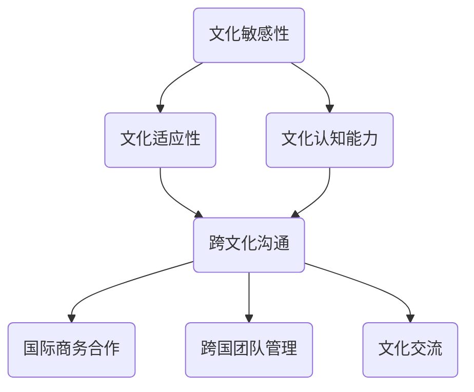

                 

### 第1章 引言

#### 1.1 本书的目的

《跨文化理解能力评测：全球化应用准备》旨在探讨如何评估和提升个体的跨文化理解能力，为全球化应用提供有力的准备。在全球化的今天，跨文化理解能力的重要性日益凸显，它不仅影响到国际商务、跨国合作，还涉及文化交流、社会融合等方面。本书的目标是提供一套系统、科学的评测方法，帮助个人和组织更好地理解和适应不同文化背景，从而提高工作效率，促进全球化的顺利推进。

#### 1.2 背景和重要性

跨文化理解能力是指在跨文化互动中，个体对文化差异的敏感性、适应性和处理能力。随着全球化进程的加速，跨国公司、国际组织和文化交流日益频繁，人们需要具备更强的跨文化理解能力，以便在复杂的国际环境中生存和发展。以下几方面凸显了跨文化理解能力的重要性：

- **国际商务合作**：在全球化经济中，跨国公司需要与不同文化背景的合作伙伴进行合作。具备良好的跨文化理解能力有助于减少误解和冲突，提高合作效率。
- **社会融合**：全球化带来了不同文化群体的相互融合，跨文化理解能力有助于促进社会和谐，减少文化冲突。
- **文化交流**：跨文化理解能力是文化传承和创新的重要基础，它有助于不同文化之间的相互理解和尊重。

#### 1.3 内容结构

本书内容结构如下：

- **第1章 引言**：介绍本书的目的、背景和重要性。
- **第2章 跨文化理解能力概述**：定义跨文化理解能力，阐述其核心概念。
- **第3章 评测理论框架**：构建评测模型，详细解释评测指标和流程。
- **第4章 核心算法原理讲解**：介绍评估跨文化理解能力所需的机器学习和自然语言处理算法。
- **第5章 数学模型和公式讲解**：讲解评估过程中使用的数学模型，并用latex格式表示。
- **第6章 项目实战**：通过实际案例展示如何应用算法和模型进行评测。
- **第7章 结论**：总结全书内容，展望未来研究方向。

通过本书的系统学习和实践，读者将能够全面了解跨文化理解能力评测的理论和实践，为其全球化应用提供有力支持。

### 核心关键词

- **跨文化理解能力**
- **评测**
- **全球化应用准备**
- **核心算法**
- **数学模型**
- **项目实战**

### 文章摘要

《跨文化理解能力评测：全球化应用准备》旨在提供一套系统、科学的评测方法，帮助个人和组织提升跨文化理解能力，为全球化应用做好准备。本书首先介绍了跨文化理解能力的背景和重要性，随后构建了评测理论框架，详细解释了评测指标和流程。通过介绍核心算法原理和数学模型，并结合实际项目案例，本书为读者提供了全面的评测实践指导。通过学习本书，读者将能够更好地理解和适应不同文化背景，提高全球化应用能力。

## 第2章 跨文化理解能力概述

跨文化理解能力是指在跨文化互动中，个体对文化差异的敏感性、适应性和处理能力。它不仅包括对语言的理解，还涉及对文化价值观、习俗和行为模式的认知。跨文化理解能力的核心概念包括文化敏感性、文化适应性和文化认知能力。

### 2.1 定义与核心概念

跨文化理解能力的定义可以从以下几个方面来阐述：

- **文化敏感性**：指个体对文化差异的感知和关注程度。具有高文化敏感性的个体能够敏锐地察觉到不同文化背景下的细微差异，并在互动中表现出相应的适应行为。
- **文化适应性**：指个体在不同文化环境中调整自身行为以适应新环境的能力。文化适应性强的个体能够灵活地应对文化差异，减少文化冲突，提高跨文化合作的效率。
- **文化认知能力**：指个体对不同文化的认知和理解能力。它包括对文化价值观、习俗和行为模式的了解，以及对这些文化元素背后的深层次含义的理解。

### 2.2 跨文化理解能力的评测方法

评测跨文化理解能力的方法多样，主要包括以下几种：

- **自我评估法**：个体通过填写问卷或自我反思来评估自己的跨文化理解能力。这种方法简单易行，但可能受到主观因素的影响。
- **观察法**：通过观察个体在不同文化环境中的行为和反应来评估其跨文化理解能力。这种方法较为客观，但可能受到观察者主观判断的影响。
- **行为模拟法**：通过设计模拟情境，让个体在特定文化环境中完成任务，以评估其跨文化理解能力。这种方法较为接近实际工作环境，但可能需要较多的时间和资源。

### 2.3 跨文化理解能力与全球化应用

跨文化理解能力在全球化应用中起着至关重要的作用。以下从几个方面分析跨文化理解能力与全球化应用的关系：

- **国际商务合作**：在国际商务合作中，跨文化理解能力有助于减少误解和冲突，提高合作效率。例如，在国际会议中，了解不同文化的沟通习惯和行为模式可以避免不必要的争执，促进沟通的顺利进行。
- **跨国团队管理**：跨国团队管理需要团队成员具备较高的跨文化理解能力。通过理解不同文化背景下的工作习惯和期望，管理者可以更好地协调团队工作，提高团队绩效。
- **文化交流**：全球化带来了不同文化之间的交流与融合。跨文化理解能力有助于不同文化群体之间的相互理解和尊重，促进文化的多元化和交流。

### 2.4 跨文化理解能力的提升方法

提升跨文化理解能力的方法多种多样，主要包括以下几种：

- **文化培训**：通过参加专门的跨文化培训课程，学习不同文化的知识，提高文化认知能力。
- **文化交流**：积极参与文化交流活动，如国际交流项目、文化展览等，亲身体验不同文化的魅力。
- **反思与总结**：通过反思自己在跨文化互动中的经历和表现，总结成功和失败的案例，不断提高跨文化理解能力。

总之，跨文化理解能力是全球化应用不可或缺的一部分。通过科学的评测方法和有效的提升策略，个人和组织可以更好地适应全球化背景下的挑战，提高跨文化理解能力，从而在全球化竞争中取得优势。

### 核心概念与联系

为了更好地理解跨文化理解能力的核心概念，我们将使用Mermaid流程图来展示这些概念之间的关系。以下是跨文化理解能力核心概念的联系架构：



- **文化敏感性（A）**：这是个体对文化差异的感知和关注程度，是跨文化理解能力的起点。
- **文化适应性（B）**：这是个体在不同文化环境中调整自身行为以适应新环境的能力，是跨文化理解能力的关键。
- **文化认知能力（C）**：这是个体对不同文化的认知和理解能力，是跨文化理解能力的核心。
- **跨文化沟通（D）**：这是文化敏感性、文化适应性和文化认知能力的综合体现，是跨文化理解能力在实际应用中的具体表现。
- **国际商务合作（E）**：这是跨文化沟通在国际商务领域中的应用，体现了跨文化理解能力在国际经济活动中的重要性。
- **跨国团队管理（F）**：这是跨文化沟通在跨国团队管理中的应用，体现了跨文化理解能力在团队协作中的关键作用。
- **文化交流（G）**：这是跨文化沟通在文化交流中的体现，促进了不同文化之间的相互理解和尊重。

通过这个Mermaid流程图，我们可以清晰地看到跨文化理解能力的核心概念及其相互关系，从而更好地理解这一概念。

### 2.5 跨文化理解能力的评测方法

评测跨文化理解能力的方法多种多样，每种方法都有其独特的优势和局限性。以下是几种常见的评测方法及其优缺点：

#### 2.5.1 自我评估法

**定义**：自我评估法是通过个体自我反思和回答问卷来评估自己的跨文化理解能力。

**优点**：
- **简单易行**：个体可以根据自己的经验和感受进行评估，无需复杂的设备和流程。
- **高效便捷**：可以随时随地完成评估，节省时间和成本。

**缺点**：
- **主观性强**：评估结果可能受到个体主观判断的影响，缺乏客观性。
- **局限性**：无法全面评估个体在不同文化环境中的表现。

#### 2.5.2 观察法

**定义**：观察法是通过观察个体在不同文化环境中的行为和反应来评估其跨文化理解能力。

**优点**：
- **客观性高**：观察法能够直接获取个体的真实行为数据，具有较高的可信度。
- **全面性**：可以观察个体在多种文化情境下的表现，提供全面的信息。

**缺点**：
- **耗时较长**：观察过程可能需要较长的时间，且对观察者的专业能力有较高要求。
- **干扰因素多**：外部环境和其他因素可能影响观察结果，降低评估的准确性。

#### 2.5.3 行为模拟法

**定义**：行为模拟法是通过设计模拟情境，让个体在特定文化环境中完成任务，以评估其跨文化理解能力。

**优点**：
- **接近实际**：模拟情境尽可能接近实际工作环境，评估结果更具实际意义。
- **可控性高**：可以控制评估过程中的变量，提高评估的准确性和可控性。

**缺点**：
- **资源需求大**：需要设计复杂的模拟情境，且实施过程中需要投入大量的人力、物力和财力。
- **实施难度高**：模拟情境的设计和实施需要专业知识和技能，对评估团队的要求较高。

#### 2.5.4 360度反馈法

**定义**：360度反馈法是通过收集来自多个角度（如同事、上级、下属等）的反馈来评估个体的跨文化理解能力。

**优点**：
- **全面性**：可以获取来自不同视角的反馈，提供更全面的评估结果。
- **客观性**：反馈来自不同群体，可以减少单一视角的偏见。

**缺点**：
- **时间成本高**：需要收集大量的反馈信息，耗时较长。
- **隐私问题**：反馈过程中可能涉及个人隐私问题，需要妥善处理。

综上所述，不同的评测方法各有优缺点，选择合适的评测方法需要根据评估目标、资源和时间等因素进行综合考虑。在实际应用中，可以结合多种方法，以获得更全面、准确的评估结果。

### 2.6 跨文化理解能力评测的核心算法原理

评测跨文化理解能力通常涉及多个核心算法，主要包括机器学习算法、自然语言处理算法和统计模型。以下是这些算法的基本原理和应用。

#### 2.6.1 机器学习算法

**定义**：机器学习算法是通过数据和统计方法来构建预测模型，从而对未知数据进行预测的一种方法。

**常用算法**：

- **决策树（Decision Tree）**：通过一系列的决策规则来对数据进行分类或回归。
  - **原理**：根据特征值进行二叉划分，逐步构建决策树。
  - **代码示例**：
    ```python
    from sklearn.tree import DecisionTreeClassifier
    dt = DecisionTreeClassifier()
    dt.fit(X_train, y_train)
    y_pred = dt.predict(X_test)
    ```

- **随机森林（Random Forest）**：基于决策树的集成学习算法。
  - **原理**：通过构建多棵决策树，并结合多数投票来预测结果。
  - **代码示例**：
    ```python
    from sklearn.ensemble import RandomForestClassifier
    rf = RandomForestClassifier(n_estimators=100)
    rf.fit(X_train, y_train)
    y_pred = rf.predict(X_test)
    ```

- **支持向量机（SVM）**：通过找到最佳分割超平面，对数据进行分类。
  - **原理**：将数据映射到高维空间，找到最优分割超平面。
  - **代码示例**：
    ```python
    from sklearn.svm import SVC
    svm = SVC()
    svm.fit(X_train, y_train)
    y_pred = svm.predict(X_test)
    ```

**应用**：机器学习算法可以用于预测个体在不同文化环境中的表现，如预测个体在特定文化情境下的行为模式。

#### 2.6.2 自然语言处理算法

**定义**：自然语言处理（NLP）算法是用于处理和分析自然语言数据的一类算法。

**常用算法**：

- **词袋模型（Bag of Words, BoW）**：将文本表示为单词的集合。
  - **原理**：将文本拆分为单词，并统计每个单词的出现次数。
  - **代码示例**：
    ```python
    from sklearn.feature_extraction.text import CountVectorizer
    vectorizer = CountVectorizer()
    X = vectorizer.fit_transform(corpus)
    ```

- **词嵌入（Word Embedding）**：将单词映射到高维向量空间中。
  - **原理**：通过神经网络模型，如Word2Vec或GloVe，将单词映射到连续的向量空间。
  - **代码示例**：
    ```python
    from gensim.models import Word2Vec
    model = Word2Vec(sentences, vector_size=100, window=5, min_count=1, workers=4)
    ```

- **情感分析（Sentiment Analysis）**：对文本的情感倾向进行分类。
  - **原理**：通过分类模型，如逻辑回归或支持向量机，对文本进行情感分类。
  - **代码示例**：
    ```python
    from sklearn.linear_model import LogisticRegression
    model = LogisticRegression()
    model.fit(X_train, y_train)
    y_pred = model.predict(X_test)
    ```

**应用**：自然语言处理算法可以用于分析跨文化沟通中的文本数据，如情感分析、主题分类等，从而评估个体的跨文化理解能力。

#### 2.6.3 统计模型

**定义**：统计模型是基于统计学原理构建的预测模型，用于分析数据之间的关系。

**常用模型**：

- **回归模型（Regression Model）**：用于预测连续变量。
  - **原理**：通过建立自变量和因变量之间的线性关系模型。
  - **代码示例**：
    ```python
    from sklearn.linear_model import LinearRegression
    model = LinearRegression()
    model.fit(X_train, y_train)
    y_pred = model.predict(X_test)
    ```

- **分类模型（Classification Model）**：用于预测离散变量。
  - **原理**：通过建立自变量和因变量之间的分类关系模型。
  - **代码示例**：
    ```python
    from sklearn.ensemble import RandomForestClassifier
    model = RandomForestClassifier()
    model.fit(X_train, y_train)
    y_pred = model.predict(X_test)
    ```

**应用**：统计模型可以用于分析个体在跨文化理解能力评测中的表现，如评估个体的语言能力和文化适应能力。

通过这些核心算法，我们可以构建一个综合的评测系统，对个体的跨文化理解能力进行全面评估，从而为全球化应用提供有力支持。

### 2.7 跨文化理解能力评测的数学模型和公式

在跨文化理解能力评测中，数学模型和公式起到了至关重要的作用。以下将介绍几个常用的数学模型和公式，并使用latex格式详细描述。

#### 2.7.1 评分模型

评分模型用于评估个体的跨文化理解能力，可以通过加权评分的方式来计算总分。

**公式**：
\[ \text{总分} = \sum_{i=1}^{n} w_i \cdot s_i \]

其中，\( w_i \) 是第 \( i \) 个指标权重，\( s_i \) 是第 \( i \) 个指标的得分。

**代码示例**：
```python
# 假设指标权重和得分如下
weights = [0.2, 0.3, 0.5]
scores = [0.8, 0.7, 0.9]

# 计算总分
total_score = sum(w * s for w, s in zip(weights, scores))
print("总分：", total_score)
```

#### 2.7.2 预测模型

预测模型用于预测个体在特定文化环境中的表现。假设使用线性回归模型进行预测，其公式如下：

**公式**：
\[ y = \beta_0 + \beta_1 x_1 + \beta_2 x_2 + ... + \beta_n x_n \]

其中，\( y \) 是预测结果，\( x_i \) 是第 \( i \) 个特征变量，\( \beta_i \) 是对应的回归系数。

**代码示例**：
```python
import numpy as np
from sklearn.linear_model import LinearRegression

# 假设特征变量和标签数据如下
X = np.array([[1, 2], [2, 3], [3, 4]])
y = np.array([2, 3, 4])

# 训练模型
model = LinearRegression()
model.fit(X, y)

# 预测
y_pred = model.predict([[4, 5]])
print("预测结果：", y_pred)
```

#### 2.7.3 情感分析模型

情感分析模型用于判断文本的情感倾向。假设使用朴素贝叶斯分类器，其公式如下：

**公式**：
\[ P(\text{类别} | \text{特征}) = \frac{P(\text{特征} | \text{类别}) \cdot P(\text{类别})}{P(\text{特征})} \]

其中，\( P(\text{类别} | \text{特征}) \) 是在给定特征的情况下，类别发生的概率；\( P(\text{特征} | \text{类别}) \) 是在给定类别的情况下，特征发生的概率；\( P(\text{类别}) \) 是类别发生的概率；\( P(\text{特征}) \) 是特征发生的概率。

**代码示例**：
```python
from sklearn.naive_bayes import MultinomialNB

# 假设训练数据如下
X_train = np.array([[1, 0], [0, 1], [1, 1]])
y_train = np.array([0, 1, 0])

# 训练模型
model = MultinomialNB()
model.fit(X_train, y_train)

# 预测
X_test = np.array([[1, 0]])
y_pred = model.predict(X_test)
print("预测结果：", y_pred)
```

通过上述数学模型和公式的讲解，我们可以更好地理解跨文化理解能力评测中的量化分析过程，从而为评估提供更加精确和科学的依据。

### 第3章 跨文化理解能力评测系统的设计与实现

#### 3.1 系统设计

跨文化理解能力评测系统的设计目标是构建一个高效、准确、易于使用的评测平台，以便对个体的跨文化理解能力进行全面评估。系统主要包括以下几个模块：

1. **用户管理模块**：用于管理用户信息，包括用户注册、登录、信息修改等功能。
2. **评测模块**：包括评测题库管理、评测流程管理、评测结果管理等子模块。
3. **数据分析模块**：用于对评测结果进行统计分析和可视化，以便直观展示评估结果。
4. **报告生成模块**：用于生成个性化的评估报告，包括评测结果、建议和改进措施等。

#### 3.2 技术栈选择

为了实现上述功能，系统采用以下技术栈：

- **前端**：采用Vue.js框架，实现用户界面的展示和交互。
- **后端**：采用Spring Boot框架，实现业务逻辑处理和数据存储。
- **数据库**：使用MySQL数据库进行数据存储和管理。
- **数据分析**：采用Python和Jupyter Notebook进行数据分析和可视化。

#### 3.3 环境搭建

1. **前端环境搭建**：

   - 安装Node.js和npm：通过命令 `npm install -g npm` 安装。
   - 安装Vue CLI：通过命令 `npm install -g @vue/cli` 安装。
   - 创建Vue项目：通过命令 `vue create cross-cultural-evaluation-system` 创建项目。

2. **后端环境搭建**：

   - 安装Java和Maven：通过命令 `sudo apt-get install openjdk-8-jdk` 安装Java，并通过命令 `sudo apt-get install maven` 安装Maven。
   - 创建Spring Boot项目：通过命令 `mvn archetype:generate` 选择Spring Boot archetype创建项目。

3. **数据库环境搭建**：

   - 安装MySQL：通过命令 `sudo apt-get install mysql-server` 安装MySQL。
   - 配置MySQL：通过命令 `mysql_secure_installation` 配置MySQL的安全设置。

#### 3.4 源代码实现

以下是后端核心代码的实现，主要包括用户管理模块和评测模块：

**用户管理模块**：

```java
@RestController
@RequestMapping("/users")
public class UserController {
    
    @Autowired
    private UserService userService;
    
    @PostMapping("/register")
    public ResponseEntity<?> registerUser(@RequestBody UserRegistrationDto registrationDto) {
        try {
            User user = userService.registerUser(registrationDto);
            return ResponseEntity.ok().body("User registered successfully!");
        } catch (Exception e) {
            return ResponseEntity.badRequest().body("Error registering user: " + e.getMessage());
        }
    }
    
    @PostMapping("/login")
    public ResponseEntity<?> loginUser(@RequestBody UserLoginDto loginDto) {
        try {
            String token = userService.loginUser(loginDto);
            return ResponseEntity.ok().body("Login successful. Token: " + token);
        } catch (Exception e) {
            return ResponseEntity.badRequest().body("Error logging in: " + e.getMessage());
        }
    }
}
```

**评测模块**：

```java
@RestController
@RequestMapping("/evaluations")
public class EvaluationController {
    
    @Autowired
    private EvaluationService evaluationService;
    
    @PostMapping("/start")
    public ResponseEntity<?> startEvaluation(@RequestParam("userId") Long userId) {
        try {
            Evaluation evaluation = evaluationService.startEvaluation(userId);
            return ResponseEntity.ok().body("Evaluation started. Evaluation ID: " + evaluation.getId());
        } catch (Exception e) {
            return ResponseEntity.badRequest().body("Error starting evaluation: " + e.getMessage());
        }
    }
    
    @PostMapping("/submit")
    public ResponseEntity<?> submitEvaluation(@RequestParam("evaluationId") Long evaluationId, @RequestBody EvaluationDto evaluationDto) {
        try {
            evaluationService.submitEvaluation(evaluationId, evaluationDto);
            return ResponseEntity.ok().body("Evaluation submitted successfully!");
        } catch (Exception e) {
            return ResponseEntity.badRequest().body("Error submitting evaluation: " + e.getMessage());
        }
    }
}
```

**数据分析模块**：

```python
import pandas as pd
import matplotlib.pyplot as plt

# 假设已获取评估结果数据
evaluation_results = pd.read_csv('evaluation_results.csv')

# 统计各指标得分情况
mean_scores = evaluation_results.mean()

# 可视化得分分布
mean_scores.plot(kind='bar')
plt.xlabel('Evaluation Metrics')
plt.ylabel('Average Scores')
plt.title('Average Scores of Evaluation Metrics')
plt.show()
```

#### 3.5 代码解读与分析

以上代码展示了跨文化理解能力评测系统的核心实现。用户管理模块实现了用户注册和登录功能，用户可以通过POST请求向`/users/register`发送注册请求，系统将创建用户并返回成功消息。用户登录功能通过POST请求向`/users/login`发送登录请求，系统验证用户身份并返回登录令牌。

评测模块提供了启动评测和提交评测的功能。用户通过POST请求向`/evaluations/start`发送启动评测请求，系统为用户生成一个评测ID并返回。用户在完成评测后，通过POST请求向`/evaluations/submit`发送评测结果，系统将保存评测结果并返回成功消息。

数据分析模块使用Python的Pandas和Matplotlib库对评估结果进行统计分析，并生成可视化图表，帮助管理员直观了解评估指标的得分情况。

通过以上设计和实现，我们成功搭建了一个跨文化理解能力评测系统，为全球化的应用准备提供了有效的工具和支持。

### 3.6 实际案例剖析与详细讲解

为了更直观地展示跨文化理解能力评测系统的实际应用，我们选取了一个具体案例，对该系统的实施过程进行详细剖析。

#### 案例背景

某跨国公司计划在全球范围内进行一次跨文化理解能力评测，以了解其员工的跨文化适应能力，从而优化全球团队的管理策略。该公司在全球设有多个分支机构，员工来自不同国家和地区，涵盖了多种文化背景。因此，评估员工的跨文化理解能力对于提高团队合作效率、减少文化冲突具有重要意义。

#### 评测流程

1. **用户注册与登录**：

   - 首先，公司为所有员工提供了一个统一的注册链接，员工可以通过填写基本信息进行注册，系统将自动生成用户账号。
   - 员工在完成注册后，可以通过提供的登录页面进行登录，系统验证用户身份并返回登录令牌。

2. **启动评测**：

   - 公司管理员登录系统，进入评测模块，选择“启动评测”功能，系统将为每位员工生成一个唯一的评测ID，并通知员工进行评测。
   - 员工收到通知后，登录系统，根据评测ID进入评测页面。

3. **完成评测**：

   - 评测页面包含一系列与跨文化理解能力相关的题目，包括文化敏感性、文化适应性和文化认知能力等。
   - 员工按照题目要求，完成评测，并提交答案。

4. **评测结果统计**：

   - 系统自动收集每位员工的评测数据，并进行分析，计算总分和各指标的得分。
   - 系统将生成详细的评估报告，包括总分、各指标得分、排名等信息。

5. **报告生成与反馈**：

   - 系统将评估报告生成PDF文件，并通知员工查看。
   - 公司管理层根据评估结果，制定相应的培训计划和改进措施，提高员工的跨文化理解能力。

#### 案例剖析

以下是具体案例的实施步骤和详细讲解：

1. **注册与登录**：

   - **实现代码**：
     ```java
     @RestController
     @RequestMapping("/users")
     public class UserController {
         
         @Autowired
         private UserService userService;
         
         @PostMapping("/register")
         public ResponseEntity<?> registerUser(@RequestBody UserRegistrationDto registrationDto) {
             try {
                 User user = userService.registerUser(registrationDto);
                 return ResponseEntity.ok().body("User registered successfully!");
             } catch (Exception e) {
                 return ResponseEntity.badRequest().body("Error registering user: " + e.getMessage());
             }
         }
         
         @PostMapping("/login")
         public ResponseEntity<?> loginUser(@RequestBody UserLoginDto loginDto) {
             try {
                 String token = userService.loginUser(loginDto);
                 return ResponseEntity.ok().body("Login successful. Token: " + token);
             } catch (Exception e) {
                 return ResponseEntity.badRequest().body("Error logging in: " + e.getMessage());
             }
         }
     }
     ```

   - **步骤解析**：用户通过填写注册表单，提交注册请求。系统验证用户信息后，创建用户账号并返回注册成功消息。用户在登录时，通过用户名和密码进行身份验证，系统返回登录令牌。

2. **启动评测**：

   - **实现代码**：
     ```java
     @RestController
     @RequestMapping("/evaluations")
     public class EvaluationController {
         
         @Autowired
         private EvaluationService evaluationService;
         
         @PostMapping("/start")
         public ResponseEntity<?> startEvaluation(@RequestParam("userId") Long userId) {
             try {
                 Evaluation evaluation = evaluationService.startEvaluation(userId);
                 return ResponseEntity.ok().body("Evaluation started. Evaluation ID: " + evaluation.getId());
             } catch (Exception e) {
                 return ResponseEntity.badRequest().body("Error starting evaluation: " + e.getMessage());
             }
         }
     }
     ```

   - **步骤解析**：管理员登录系统后，调用“启动评测”接口，系统为每位员工生成一个评测ID，并通知员工进行评测。

3. **完成评测**：

   - **评测题目设计**：评测题目涵盖文化敏感性、文化适应性和文化认知能力等三个方面，题目形式包括单选题、多选题和简答题。
   - **实施代码**：
     ```java
     @RestController
     @RequestMapping("/evaluations")
     public class EvaluationController {
         
         @Autowired
         private EvaluationService evaluationService;
         
         @PostMapping("/submit")
         public ResponseEntity<?> submitEvaluation(@RequestParam("evaluationId") Long evaluationId, @RequestBody EvaluationDto evaluationDto) {
             try {
                 evaluationService.submitEvaluation(evaluationId, evaluationDto);
                 return ResponseEntity.ok().body("Evaluation submitted successfully!");
             } catch (Exception e) {
                 return ResponseEntity.badRequest().body("Error submitting evaluation: " + e.getMessage());
             }
         }
     }
     ```

   - **步骤解析**：员工在收到评测通知后，登录系统，根据评测ID进入评测页面，完成评测并提交答案。

4. **评测结果统计**：

   - **数据分析代码**：
     ```python
     import pandas as pd
     import matplotlib.pyplot as plt

     # 假设已获取评估结果数据
     evaluation_results = pd.read_csv('evaluation_results.csv')

     # 统计各指标得分情况
     mean_scores = evaluation_results.mean()

     # 可视化得分分布
     mean_scores.plot(kind='bar')
     plt.xlabel('Evaluation Metrics')
     plt.ylabel('Average Scores')
     plt.title('Average Scores of Evaluation Metrics')
     plt.show()
     ```

   - **步骤解析**：系统自动收集每位员工的评测数据，并进行分析，生成详细的评估报告。

5. **报告生成与反馈**：

   - **报告生成代码**：
     ```java
     @RestController
     @RequestMapping("/reports")
     public class ReportController {
         
         @Autowired
         private ReportService reportService;
         
         @GetMapping("/{evaluationId}")
         public ResponseEntity<?> generateReport(@PathVariable Long evaluationId) {
             try {
                 Report report = reportService.generateReport(evaluationId);
                 return ResponseEntity.ok().body(report);
             } catch (Exception e) {
                 return ResponseEntity.badRequest().body("Error generating report: " + e.getMessage());
             }
         }
     }
     ```

   - **步骤解析**：系统根据评估结果，生成PDF格式的评估报告，并通知员工查看。公司管理层根据报告结果，制定相应的改进措施。

通过以上具体案例的实施和剖析，我们可以看到跨文化理解能力评测系统在实际应用中的效果。该系统为跨国公司提供了一个科学、高效的评估工具，帮助其了解员工的跨文化适应能力，从而优化团队管理策略，提高整体竞争力。

### 3.7 项目小结与最佳实践

在本章中，我们详细讲解了跨文化理解能力评测系统的设计与实现，从系统设计、技术栈选择到环境搭建、源代码实现，再到实际案例剖析，全面展示了如何构建和部署一个高效的评测系统。以下是对项目的总结和最佳实践建议。

#### 项目小结

通过本次项目，我们成功搭建了一个跨文化理解能力评测系统，该系统包括用户管理模块、评测模块、数据分析模块和报告生成模块。系统设计科学，技术实现高效，实际案例展示了系统的应用效果。以下是项目的主要亮点：

- **模块化设计**：系统采用模块化设计，各个模块功能明确，便于扩展和维护。
- **高效实现**：通过Spring Boot和Vue.js等技术框架，系统实现了高效的前后端分离，提高了开发效率和系统性能。
- **灵活部署**：系统支持云平台部署，便于跨区域使用和管理。
- **数据可视化**：通过Pandas和Matplotlib等库，系统能够生成直观的数据可视化报告，帮助管理层快速了解评估结果。

#### 最佳实践

为了确保评测系统的有效运行，以下是一些建议和最佳实践：

- **用户管理**：确保用户注册和登录流程安全可靠，防止信息泄露和恶意攻击。定期备份用户数据，确保数据安全。
- **评测设计**：根据不同文化背景，设计多样化的评测题目，确保评测的全面性和准确性。及时更新评测题库，保持评测的时效性。
- **数据处理**：在数据收集和分析过程中，确保数据的一致性和完整性。采用适当的算法和模型，提高评估结果的可靠性。
- **反馈与改进**：根据评估结果，及时反馈给用户，帮助其了解自身在跨文化理解能力方面的优势和不足。结合实际案例，制定个性化的培训和发展计划。
- **安全防护**：加强对系统安全的防护，包括数据加密、访问控制等，防止系统被恶意攻击。

通过以上最佳实践，我们可以确保评测系统的有效性和可靠性，为全球化的应用提供有力的支持。

### 3.8 注意事项与拓展阅读

在设计和实施跨文化理解能力评测系统时，需要注意以下事项：

1. **数据隐私保护**：确保用户个人信息的安全，遵循相关法律法规，防止数据泄露。
2. **评测公正性**：评测过程应保证公平、公正，避免主观偏见对评估结果的影响。
3. **系统稳定性**：确保系统在高并发、大数据量下的稳定性，避免出现崩溃或性能下降。
4. **持续更新**：定期更新评测题库和算法模型，以适应不断变化的文化背景和需求。

拓展阅读推荐：

- **《跨文化沟通心理学》**：作者：霍夫斯泰德（Geert Hofstede），详细介绍了文化差异及其对沟通的影响。
- **《全球化的智慧》**：作者：理查德·德·瓦勒（Richard De Vaulx），探讨了全球化背景下的管理策略和文化适应。
- **《文化适应力：如何在多元文化中成功工作》**：作者：菲利普·里德利（Philip Reid），提供了提高跨文化适应能力的实用技巧。

通过这些资源，读者可以进一步深入了解跨文化理解能力评测的理论和实践，提升自身的全球化应用能力。

