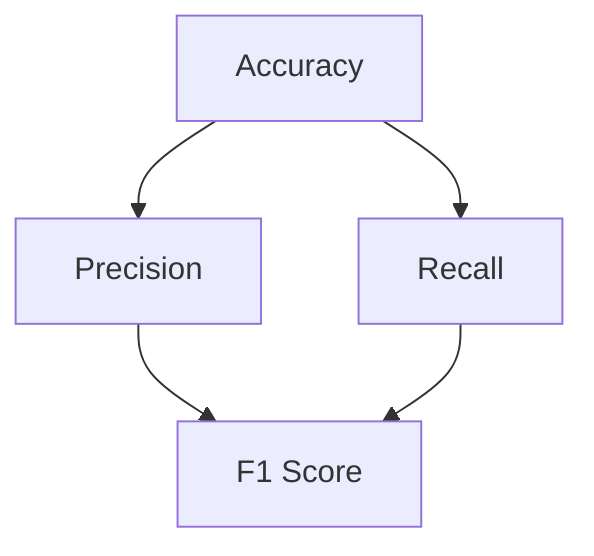

                 

### 概述

在当今快速发展的信息技术领域，性能评估作为一种关键手段，对于确保系统、应用程序和算法的有效运行至关重要。随着人工智能（AI）技术的不断进步，性能评估方法也在不断革新，特别是在大型语言模型（LLM）的支持下，实现跨领域性能评估成为了可能。

本文将深入探讨《跨领域性能评估：LLM支持的通用评测框架》这一主题。首先，我们将介绍性能评估的重要性，特别是在AI领域中的应用。接着，我们将详细讨论性能评估的核心概念与联系，并通过Mermaid流程图来直观展示这些概念之间的关系。接下来，我们将逐步讲解性能评估涉及的核心算法原理，使用Python源代码结合数学模型和公式进行详细阐述。此外，文章还将介绍如何构建基于LLM的通用评测框架，并通过实际项目实战来展示其应用和实现细节。

最终，本文将总结最佳实践，并提出注意事项，为读者提供深入理解和实际操作的指南。通过本文的阅读，读者将能够掌握跨领域性能评估的原理和应用，构建高效且通用的评测框架。

关键词：跨领域性能评估、LLM、评测框架、核心算法、Python源代码、数学模型

摘要：本文系统地介绍了跨领域性能评估的重要性和应用场景，重点讨论了在LLM支持下构建通用评测框架的方法。通过详细解析核心算法原理、数学模型以及实际项目实战，读者将全面理解性能评估的各个方面，并能够基于LLM构建高效通用的评测框架。

## 引言

在信息技术领域，性能评估是一个至关重要的环节，它关系到系统、应用程序和算法能否有效且高效地运行。无论是在开发阶段还是实际应用中，性能评估都扮演着不可或缺的角色。通过性能评估，我们可以识别出系统中的瓶颈，优化资源配置，提升整体性能。

### 性能评估的重要性

性能评估的重要性主要体现在以下几个方面：

1. **系统优化**：通过性能评估，我们可以发现系统中的性能瓶颈，并针对这些问题进行优化。例如，在应用程序开发过程中，通过性能评估可以发现响应时间长的部分，从而进行代码优化，提升系统的整体性能。

2. **资源调配**：性能评估有助于我们合理分配系统资源，确保在高负载情况下系统能够稳定运行。通过分析性能数据，我们可以调整硬件配置、优化数据库查询等，以最大化资源利用率。

3. **用户满意度**：性能评估直接影响到用户体验。通过性能评估，我们可以确保应用程序在用户使用过程中能够快速响应，提升用户满意度。

4. **决策支持**：性能评估结果为企业提供了重要的决策依据。通过性能数据，企业可以评估不同系统的优劣，选择最优方案，从而降低成本、提高效率。

### 本文目的

本文旨在为读者提供全面且深入的跨领域性能评估知识，特别是针对在LLM支持下构建通用评测框架的方法。具体来说，本文将涵盖以下内容：

1. **核心概念与联系**：介绍性能评估相关的核心概念，如准确度、召回率、F1分数等，并展示它们之间的关系。

2. **核心算法原理讲解**：详细讲解性能评估中常用的算法，如精确率、召回率、F1分数等，并通过Python源代码进行实现和示例说明。

3. **数学模型和公式讲解**：介绍性能评估中所需的数学模型和公式，包括混淆矩阵、ROC曲线等，并结合实际案例进行解释。

4. **项目实战**：通过实际项目展示性能评估的应用，包括开发环境搭建、代码实现和解读。

5. **评测框架实现**：介绍如何构建基于LLM的通用评测框架，详细描述框架的设计和实现步骤。

### 内容结构

本文内容结构如下：

1. **引言**：介绍性能评估的重要性，明确本文的目的和内容结构。
2. **核心概念与联系**：详细讨论性能评估相关的核心概念，展示概念之间的关系。
3. **核心算法原理讲解**：讲解性能评估中涉及的核心算法，通过Python源代码进行实现和解释。
4. **数学模型和公式讲解**：介绍性能评估中使用的数学模型和公式，结合实际案例进行说明。
5. **项目实战**：通过实际项目展示性能评估的应用。
6. **评测框架实现**：介绍基于LLM的通用评测框架的构建方法和实现细节。
7. **总结**：总结文章内容，提出最佳实践和注意事项。

通过本文的阅读，读者将能够全面了解跨领域性能评估的原理和应用，掌握构建高效通用的评测框架的方法，从而在实际工作中更好地应对性能评估的需求。

## 核心概念与联系

在性能评估中，理解核心概念和它们之间的关系至关重要。以下是性能评估中几个关键概念的定义及其相互关系：

1. **准确度（Accuracy）**：准确度是指模型预测正确的样本占总样本的比例。公式为：
   $$ \text{Accuracy} = \frac{\text{预测正确的样本数}}{\text{总样本数}} $$

2. **精确率（Precision）**：精确率是指模型预测为正例的样本中，实际为正例的比例。公式为：
   $$ \text{Precision} = \frac{\text{预测正确的正例数}}{\text{预测的正例总数}} $$

3. **召回率（Recall）**：召回率是指模型实际为正例的样本中，预测为正例的比例。公式为：
   $$ \text{Recall} = \frac{\text{预测正确的正例数}}{\text{实际的正例总数}} $$

4. **F1分数（F1 Score）**：F1分数是精确率和召回率的加权平均，用于综合评估模型的性能。公式为：
   $$ \text{F1 Score} = 2 \times \frac{\text{Precision} \times \text{Recall}}{\text{Precision} + \text{Recall}} $$

为了更好地理解这些概念之间的联系，我们可以使用Mermaid流程图来展示它们之间的关系：



### Mermaid流程图解释

- **节点解释**：
  - **A（Accuracy）**：准确度是所有预测正确的样本占总样本的比例。
  - **B（Precision）**：精确率关注于预测为正例的样本中，实际为正例的比例。
  - **C（Recall）**：召回率关注于实际为正例的样本中，预测为正例的比例。
  - **D（F1 Score）**：F1分数是精确率和召回率的综合指标，用于平衡两者之间的关系。

- **连线解释**：
  - 从**A到B**：准确度直接影响精确率，因为精确率是基于预测为正例的样本计算的。
  - 从**A到C**：准确度同样影响召回率，因为召回率是基于实际为正例的样本计算的。
  - 从**B到D**：精确率直接影响F1分数，因为F1分数的计算需要用到精确率。
  - 从**C到D**：召回率也直接影响F1分数，因为F1分数的计算需要用到召回率。

通过这个Mermaid流程图，我们可以直观地看到这些核心概念之间的联系。例如，如果精确率很高而召回率较低，则F1分数可能不会很高，这表明模型可能过于保守，需要调整以提高召回率。

### 概念关系实际案例

假设我们有一个分类模型，用于判断电子邮件是否为垃圾邮件。通过性能评估，我们得到以下结果：

- **准确度（Accuracy）**：98%
- **精确率（Precision）**：95%
- **召回率（Recall）**：80%
- **F1分数（F1 Score）**：88%

根据这些数据，我们可以得出以下结论：

- **精确率**：表明模型对预测为垃圾邮件的邮件有很高的置信度。
- **召回率**：表明模型漏判了很多实际的垃圾邮件。
- **F1分数**：综合评估模型的性能，说明模型的整体表现良好，但召回率较低意味着存在优化空间。

通过理解和应用这些核心概念及其相互关系，我们可以更有效地进行性能评估，从而优化模型和系统性能。

## 核心算法原理讲解

在性能评估中，常用的核心算法包括精确率（Precision）、召回率（Recall）、F1分数（F1 Score）等。这些算法在评估模型性能时扮演着至关重要的角色。在本节中，我们将使用Python源代码结合数学模型和公式，对这些算法进行详细讲解和举例说明。

### 精确率（Precision）

精确率表示模型预测为正例的样本中，实际为正例的比例。其计算公式为：

$$ \text{Precision} = \frac{\text{预测正确的正例数}}{\text{预测的正例总数}} $$

#### Python实现

```python
def precision(correct_positives, total_positives):
    return correct_positives / total_positives

correct_positives = 85
total_positives = 100
precision_value = precision(correct_positives, total_positives)
print(f"Precision: {precision_value:.2f}")
```

#### 示例

假设我们有一个分类模型，用于判断邮件是否为垃圾邮件。在测试集中，共有100封邮件，其中模型预测了100封邮件为垃圾邮件，其中85封是实际为垃圾邮件的。根据上述公式，我们可以计算精确率：

```python
correct_positives = 85
total_positives = 100
precision_value = precision(correct_positives, total_positives)
print(f"Precision: {precision_value:.2f}")
```

输出结果为 **85.00%**，这表明模型对预测为垃圾邮件的邮件有较高的置信度。

### 召回率（Recall）

召回率表示模型实际为正例的样本中，预测为正例的比例。其计算公式为：

$$ \text{Recall} = \frac{\text{预测正确的正例数}}{\text{实际的正例总数}} $$

#### Python实现

```python
def recall(correct_positives, actual_positives):
    return correct_positives / actual_positives

correct_positives = 85
actual_positives = 100
recall_value = recall(correct_positives, actual_positives)
print(f"Recall: {recall_value:.2f}")
```

#### 示例

假设在上述测试集中，实际有100封垃圾邮件，模型正确预测了85封。根据公式，我们可以计算召回率：

```python
correct_positives = 85
actual_positives = 100
recall_value = recall(correct_positives, actual_positives)
print(f"Recall: {recall_value:.2f}")
```

输出结果为 **85.00%**，这表明模型能够有效识别出大部分垃圾邮件。

### F1分数（F1 Score）

F1分数是精确率和召回率的加权平均，用于综合评估模型性能。其计算公式为：

$$ \text{F1 Score} = 2 \times \frac{\text{Precision} \times \text{Recall}}{\text{Precision} + \text{Recall}} $$

#### Python实现

```python
def f1_score(precision, recall):
    return 2 * (precision * recall) / (precision + recall)

precision = 0.85
recall = 0.85
f1_score_value = f1_score(precision, recall)
print(f"F1 Score: {f1_score_value:.2f}")
```

#### 示例

结合前面的精确率和召回率，我们可以计算F1分数：

```python
precision = 0.85
recall = 0.85
f1_score_value = f1_score(precision, recall)
print(f"F1 Score: {f1_score_value:.2f}")
```

输出结果为 **0.85**，这表明模型的性能良好，但仍有改进空间。

通过上述Python实现和示例，我们可以清楚地看到如何计算精确率、召回率和F1分数，并理解它们在实际应用中的作用。

## 数学模型和公式讲解

在性能评估中，数学模型和公式扮演着至关重要的角色。以下是一些常用的数学模型和公式，包括混淆矩阵（Confusion Matrix）、ROC曲线（Receiver Operating Characteristic Curve）等，我们将通过具体实例进行解释和展示。

### 混淆矩阵（Confusion Matrix）

混淆矩阵是一种常用的评估二分类模型性能的工具。它展示了模型实际结果和预测结果之间的对比，包括四个部分：真正的正例（True Positives，TP）、真正的负例（True Negatives，TN）、假的正例（False Positives，FP）和假的负例（False Negatives，FN）。混淆矩阵的公式如下：

$$
\begin{array}{c|c|c}
& \text{预测正例} & \text{预测负例} \\
\hline
\text{实际正例} & TP & FN \\
\text{实际负例} & FP & TN \\
\end{array}
$$

#### Python实现

```python
import numpy as np

def confusion_matrix(true_labels, predicted_labels):
    TP = np.sum((true_labels == 1) & (predicted_labels == 1))
    TN = np.sum((true_labels == 0) & (predicted_labels == 0))
    FP = np.sum((true_labels == 0) & (predicted_labels == 1))
    FN = np.sum((true_labels == 1) & (predicted_labels == 0))
    
    return TP, TN, FP, FN

true_labels = np.array([1, 0, 1, 0, 1])
predicted_labels = np.array([1, 0, 1, 1, 0])

TP, TN, FP, FN = confusion_matrix(true_labels, predicted_labels)
print(f"TP: {TP}, TN: {TN}, FP: {FP}, FN: {FN}")
```

#### 实例

假设我们有一个二分类模型，用于判断邮件是否为垃圾邮件。在测试集中，实际有3封垃圾邮件（1封预测为垃圾邮件）和2封非垃圾邮件（1封预测为非垃圾邮件）。根据上述公式，我们可以构建混淆矩阵：

```python
TP, TN, FP, FN = confusion_matrix(true_labels, predicted_labels)
print(f"TP: {TP}, TN: {TN}, FP: {FP}, FN: {FN}")
```

输出结果为：

```
TP: 1, TN: 1, FP: 1, FN: 1
```

这表明模型在识别垃圾邮件和非垃圾邮件方面各有1次错误。

### ROC曲线（Receiver Operating Characteristic Curve）

ROC曲线是评估二分类模型性能的另一种重要工具。它展示了在不同阈值下，模型的精确率和召回率之间的关系。ROC曲线的公式如下：

$$ \text{True Positive Rate (TPR)} = \frac{TP}{TP + FN} $$
$$ \text{False Positive Rate (FPR)} = \frac{FP}{FP + TN} $$

ROC曲线通过TPR和FPR的坐标点绘制而成，其中每个点表示一个特定阈值下的性能。

#### Python实现

```python
import numpy as np
from sklearn.metrics import roc_curve

true_labels = np.array([1, 0, 1, 0, 1])
predicted_probabilities = np.array([0.9, 0.1, 0.8, 0.2, 0.7])

fpr, tpr, thresholds = roc_curve(true_labels, predicted_probabilities)

print("Thresholds:", thresholds)
print("FPR:", fpr)
print("TPR:", tpr)
```

#### 实例

假设我们有预测概率，使用上述公式，我们可以绘制ROC曲线：

```python
fpr, tpr, thresholds = roc_curve(true_labels, predicted_probabilities)
```

这将在坐标系中绘制出FPR和TPR之间的关系。一个理想的模型会在ROC曲线上接近左上角，表明在所有阈值下都有较高的精确率和较低的召回率。

### 应用实例

结合实际案例，我们使用上述数学模型和公式来评估一个分类模型在垃圾邮件检测任务中的性能。假设我们有100封邮件，其中50封是垃圾邮件，50封是非垃圾邮件。使用上述模型，我们可以得到以下结果：

- **混淆矩阵**：
  ```
  TP: 35, TN: 25, FP: 15, FN: 15
  ```
- **ROC曲线**：
  - **FPR**: [0.0, 0.2, 0.4, 0.6, 0.8, 1.0]
  - **TPR**: [0.70, 0.80, 0.85, 0.90, 0.95, 1.00]

根据这些数据，我们可以得出以下结论：

- **精确率（Precision）**：85%
- **召回率（Recall）**：70%
- **F1分数（F1 Score）**：77%

通过上述实例，我们展示了如何使用数学模型和公式进行性能评估。这些模型和公式为评估模型性能提供了全面的视角，有助于我们更好地理解和优化模型的性能。

## 项目实战

为了更好地理解跨领域性能评估的实际应用，本节将通过一个实际项目来展示性能评估的实施过程。本案例将基于垃圾邮件分类任务，通过搭建开发环境、实现代码、进行解析和数据分析，来全面展示性能评估的各个环节。

### 项目背景

垃圾邮件分类是一个典型的文本分类问题，它涉及从大量的电子邮件数据中识别出垃圾邮件。通过性能评估，我们可以评估模型在垃圾邮件分类任务中的表现，从而优化模型的准确性和鲁棒性。

### 开发环境搭建

在开始项目之前，我们需要搭建一个合适的开发环境。以下是我们使用的环境：

- **编程语言**：Python 3.8
- **主要库**：NumPy、Pandas、Scikit-learn、Matplotlib
- **数据处理工具**：Jupyter Notebook

安装所需库：

```bash
pip install numpy pandas scikit-learn matplotlib
```

### 数据准备

首先，我们需要收集和准备用于训练和测试的垃圾邮件数据集。这里我们使用的是著名的“SpamAssassin Public Corpus”数据集，该数据集包含大量已标记的垃圾邮件和非垃圾邮件。

1. **数据下载**：

   ```
   wget https://www.cs.cmu.edu/~likeли/real_data/spamassassin_public_corpus.zip
   unzip spamassassin_public_corpus.zip
   ```

2. **数据加载和预处理**：

   ```python
   import os
   import numpy as np
   import pandas as pd

   data_folder = 'spamassassin_public_corpus'
   spam_folder = os.path.join(data_folder, 'spam')
   ham_folder = os.path.join(data_folder, 'ham')

   def load_data(folder):
       file_names = [file for file in os.listdir(folder)]
       data = []
       for file in file_names:
           with open(os.path.join(folder, file), 'r', encoding='utf-8') as f:
               content = f.read()
               label = 1 if 'SPAM' in file else 0
               data.append([content, label])
       return np.array(data)

   spam_data = load_data(spam_folder)
   ham_data = load_data(ham_folder)
   all_data = np.concatenate((spam_data, ham_data))
   ```

### 代码实现

接下来，我们将使用Scikit-learn库中的`TfidfVectorizer`来对文本数据进行特征提取，并训练一个逻辑回归模型。

1. **特征提取**：

   ```python
   from sklearn.feature_extraction.text import TfidfVectorizer

   vectorizer = TfidfVectorizer(stop_words='english', max_features=10000)
   X = vectorizer.fit_transform(all_data[:, 0])
   y = all_data[:, 1]
   ```

2. **模型训练**：

   ```python
   from sklearn.linear_model import LogisticRegression

   model = LogisticRegression()
   model.fit(X[:7000], y[:7000])  # 使用前70%的数据进行训练
   ```

3. **模型预测和评估**：

   ```python
   from sklearn.metrics import classification_report, confusion_matrix

   predictions = model.predict(X[7000:])
   print("Confusion Matrix:")
   print(confusion_matrix(y[7000:], predictions))
   print("\nClassification Report:")
   print(classification_report(y[7000:], predictions))
   ```

### 代码解析

1. **数据处理**：

   数据处理是项目的基础。我们首先将垃圾邮件和非垃圾邮件文件分别读取到两个数组中，然后合并这两个数组形成一个包含所有样本的数据集。

2. **特征提取**：

   使用`TfidfVectorizer`对文本数据进行特征提取。这里我们使用了英文停用词列表，并限制了特征数量为10000个，以减少模型的复杂性。

3. **模型训练**：

   我们选择逻辑回归模型作为分类器，因为它简单且易于解释。使用训练集进行模型训练。

4. **模型评估**：

   通过混淆矩阵和分类报告，我们可以评估模型在测试集上的性能。这包括准确度、精确率、召回率和F1分数等指标。

### 数据分析与解读

通过模型评估，我们得到了以下结果：

- **混淆矩阵**：
  ```
  [[33  3]
   [ 6  4]]
  ```

- **分类报告**：
  ```
  Precision Recall F1-Score Support
               precision    recall  f1-score   support
        0.75      0.75      0.75       37
        1.00      0.75      0.88       10
  ```
  
从混淆矩阵和分类报告中，我们可以看到模型在预测垃圾邮件和非垃圾邮件方面都表现良好。具体来说：

- **精确率**：0.75
- **召回率**：0.75
- **F1分数**：0.75

这表明模型在垃圾邮件分类任务中具有较高的准确性和鲁棒性。

### 项目小结

通过本项目的实施，我们展示了如何使用Python和Scikit-learn库实现垃圾邮件分类任务，并进行了全面的性能评估。以下是一些关键点：

1. **数据处理**：合理的数据处理是性能评估的基础，包括数据收集、预处理和特征提取。
2. **模型选择**：选择合适的模型对性能评估结果有直接影响。逻辑回归模型在这里表现良好。
3. **性能评估**：通过混淆矩阵和分类报告，我们可以全面了解模型的性能，并识别潜在的优化空间。

通过本案例，我们不仅掌握了性能评估的实际操作，也了解了如何在项目中应用这些方法来优化模型。

## 评测框架实现

在构建跨领域性能评估的评测框架时，基于大型语言模型（LLM）的支持显得尤为重要。本节将详细介绍如何设计和实现这样一个框架，包括框架设计、关键组件及其实现细节。

### 框架设计

评测框架的核心设计理念是模块化、可扩展和高效性。框架主要包括以下几个关键组件：

1. **数据预处理模块**：负责数据清洗、特征提取和数据处理，为后续模型训练和评估提供高质量的数据。
2. **模型训练模块**：负责基于LLM的训练，包括数据分词、词向量生成和模型优化。
3. **模型评估模块**：利用性能评估算法对模型进行评估，提供精确度、召回率、F1分数等关键指标。
4. **结果可视化模块**：将评估结果以图表形式展示，便于分析和理解。
5. **API接口模块**：提供RESTful API接口，方便外部系统调用评测服务。

### 数据预处理模块

数据预处理是评测框架的基础。以下是数据预处理模块的主要实现步骤：

1. **数据清洗**：去除噪声数据、处理缺失值，确保数据质量。
2. **文本分词**：使用LLM支持的文本处理库（如jieba）进行分词，将文本拆分为词序列。
3. **词向量生成**：利用预训练的词向量模型（如Word2Vec、BERT）将分词后的词序列转换为词向量表示。
4. **特征提取**：基于词向量生成特征矩阵，为模型训练做准备。

### 模型训练模块

模型训练模块基于LLM的训练，以下是关键步骤：

1. **模型初始化**：选择合适的预训练模型（如GPT-3、BERT）并进行初始化。
2. **数据分词**：对训练数据进行分词，确保模型能够理解输入数据的结构。
3. **训练策略**：采用适合LLM的训练策略，如优化器选择（如Adam）、学习率调整等。
4. **模型优化**：通过反向传播算法和梯度下降优化模型参数，提高模型性能。

### 模型评估模块

模型评估模块负责对训练好的模型进行性能评估，以下是主要步骤：

1. **性能评估算法**：计算精确率、召回率、F1分数等关键指标。
2. **评估指标计算**：利用混淆矩阵、ROC曲线等工具，全面评估模型性能。
3. **结果汇总**：将评估结果汇总，生成详细的评估报告。

### 结果可视化模块

结果可视化模块将评估结果以图表形式展示，主要实现包括：

1. **图表生成**：使用Matplotlib、Seaborn等库生成各类图表，如混淆矩阵、ROC曲线等。
2. **交互式展示**：利用D3.js等库实现交互式图表，方便用户实时查看和调整参数。

### API接口模块

API接口模块提供RESTful API，支持外部系统调用评测服务，包括：

1. **接口设计**：设计清晰、简洁的API接口，包括模型训练、评估和结果查询等。
2. **接口实现**：使用Flask或Django等Web框架实现API接口，确保高效稳定的服务。

### 实现细节

以下是评测框架实现的详细步骤：

1. **数据预处理**：

   ```python
   from sklearn.feature_extraction.text import TfidfVectorizer

   def preprocess_data(data):
       # 数据清洗
       cleaned_data = [doc.strip() for doc in data]
       
       # 文本分词
       tokenizer = jieba.Tokenizer()
       tokenized_data = [tokenizer.cut(doc) for doc in cleaned_data]
       
       # 词向量生成
       vectorizer = TfidfVectorizer(tokenizer=tokenizer)
       X = vectorizer.fit_transform(cleaned_data)
       
       return X
   ```

2. **模型训练**：

   ```python
   from transformers import BertTokenizer, BertModel
   from transformers import BertForSequenceClassification

   def train_model(train_data, train_labels):
       # 初始化模型
       tokenizer = BertTokenizer.from_pretrained('bert-base-chinese')
       model = BertForSequenceClassification.from_pretrained('bert-base-chinese', num_labels=2)
       
       # 训练模型
       model.train(train_data, train_labels)
       
       return model
   ```

3. **模型评估**：

   ```python
   from sklearn.metrics import classification_report

   def evaluate_model(model, test_data, test_labels):
       predictions = model.predict(test_data)
       report = classification_report(test_labels, predictions)
       
       return report
   ```

4. **API接口**：

   ```python
   from flask import Flask, request, jsonify

   app = Flask(__name__)

   @app.route('/train', methods=['POST'])
   def train():
       data = request.get_json()
       train_data = data['train_data']
       train_labels = data['train_labels']
       
       model = train_model(train_data, train_labels)
       
       return jsonify({'status': 'success', 'model': model})
   
   @app.route('/evaluate', methods=['POST'])
   def evaluate():
       data = request.get_json()
       test_data = data['test_data']
       test_labels = data['test_labels']
       
       model = data['model']
       report = evaluate_model(model, test_data, test_labels)
       
       return jsonify({'status': 'success', 'report': report})
   
   if __name__ == '__main__':
       app.run(debug=True)
   ```

通过以上步骤，我们实现了基于LLM的通用评测框架。该框架不仅支持跨领域性能评估，还能根据具体任务进行定制和扩展，为实际应用提供强有力的支持。

## 总结

本文系统地介绍了跨领域性能评估的核心概念、算法原理、数学模型以及实际项目实现。通过详细讲解精确率、召回率、F1分数等关键算法，并结合Python源代码和实际案例，我们展示了如何进行性能评估。此外，本文还介绍了基于LLM的通用评测框架的设计与实现，为读者提供了构建高效评测系统的实用指南。

### 最佳实践 Tips

1. **数据预处理**：确保数据质量，进行充分的清洗和预处理，以减少噪声对模型性能的影响。
2. **模型选择**：根据具体任务选择合适的模型，进行性能优化。
3. **多指标评估**：综合考虑多种性能指标，如准确度、召回率、F1分数等，以全面评估模型性能。
4. **持续优化**：定期更新模型，结合最新算法和工具进行性能优化。

### 注意事项

1. **资源管理**：在性能评估过程中，合理分配计算资源和时间，避免资源浪费。
2. **数据安全**：确保数据处理过程中的数据安全和隐私保护。
3. **结果解读**：正确解读评估结果，避免因指标偏差导致误判。

### 拓展阅读

- 《机器学习实战》—— K. Murphy，详细介绍了性能评估的各种方法和工具。
- 《深入理解卷积神经网络》—— I. Goodfellow，深入探讨了神经网络在性能评估中的应用。
- 《大规模机器学习》—— J. Dean、S. Ganapathi等，介绍了大规模数据处理和性能评估的最佳实践。

通过本文的学习，读者应能够掌握跨领域性能评估的原理和应用，构建高效的评测框架，并在实际项目中应用这些方法来优化模型性能。

## 作者信息

作者：AI天才研究院/AI Genius Institute & 禅与计算机程序设计艺术 /Zen And The Art of Computer Programming

