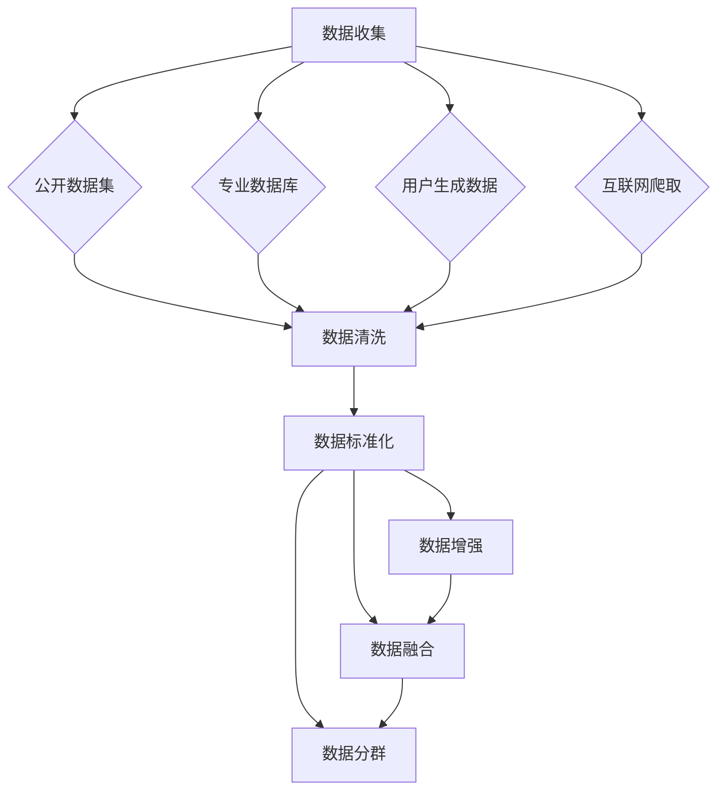

                 

## 1. 引言

### 1.1 书籍背景与目的

在人工智能迅速发展的时代，语言模型（Language Model，简称LM）已经成为自然语言处理（Natural Language Processing，简称NLP）的重要工具。特别是大型语言模型（Large Language Model，简称LLM），如GPT-3、BERT等，在文本生成、翻译、问答、摘要等方面展现出了惊人的性能。然而，随着应用领域的扩大，如何评测LLM在跨领域知识整合能力方面表现成为一个亟待解决的问题。

本书籍旨在探讨如何设计一套适用于LLM的跨领域知识整合能力评测系统，以评估大型语言模型在多领域知识融合和问题解决中的表现。具体来说，本书包括以下几个方面的内容：

1. **跨领域知识整合能力的定义与分类**：介绍知识整合能力的概念，并对不同类型的知识整合能力进行详细分类。
2. **知识整合能力评测的现状与挑战**：分析当前知识整合能力评测的研究现状，指出其中的挑战和难点。
3. **LLM与知识整合评测的关系**：探讨LLM在知识整合能力评测中的应用，分析其优势和局限性。
4. **LLM支持的评测问题设计**：详细描述如何设计适用于LLM的评测问题，包括问题类型、难度设计和数据收集与预处理。
5. **LLM支持的评测问题实例分析**：通过具体的实例，展示如何利用LLM进行知识整合能力评测，包括文本理解、推理与判断、创意与表达以及应用与拓展类问题。
6. **LLM支持的评测问题评估与反馈**：介绍如何评估评测问题的效果，并给出改进和优化的建议。
7. **LLM支持的评测问题应用案例**：展示LLM在多个领域的应用案例，包括教育、人力资源、医疗健康等。

通过上述内容的探讨，本书希望能够为研究者提供一套系统的评测方法和工具，以更全面地评估LLM在跨领域知识整合能力方面的表现，并为相关领域的研究和应用提供参考。

### 1.2 跨领域知识整合的重要性

跨领域知识整合能力在当今信息化社会中具有极其重要的意义。随着互联网的普及和信息技术的快速发展，知识量呈爆炸式增长，不同领域之间的知识交叉融合变得越来越频繁。跨领域知识整合不仅能够帮助我们更好地理解和利用这些知识，还能够激发创新思维，推动科技进步和社会发展。

首先，跨领域知识整合有助于解决复杂问题。许多实际问题往往涉及多个学科和领域，单一领域的知识很难提供完整的解决方案。通过跨领域知识整合，研究者可以综合不同领域的知识，提出创新的方法和策略，从而更有效地解决复杂问题。

其次，跨领域知识整合能够促进创新和发明。创新往往源于不同领域知识的碰撞和融合。当一个领域的知识被引入到另一个领域时，可能会激发新的思考方式和解决方案，从而产生意想不到的创新成果。例如，生物学中的基因编辑技术（CRISPR）就受到了计算机科学中的算法启发，从而实现了基因的精准编辑。

再次，跨领域知识整合有助于提升个人的综合素质。在现代职场中，具备跨领域知识整合能力的人更容易脱颖而出。他们能够从多个角度分析问题，提出更全面和创新的解决方案。此外，跨领域知识整合还能够提高个人的学习能力和适应能力，使他们在面对快速变化的工作环境时能够迅速适应并应对。

最后，跨领域知识整合对于社会的可持续发展具有重要意义。随着全球化和信息化进程的加速，各个国家和地区之间的联系日益紧密。跨领域知识整合有助于促进国际合作和交流，推动全球科技、经济、文化等领域的共同发展。例如，环境保护和可持续发展问题就需要不同国家和地区、不同学科领域的专家共同合作，提出切实可行的解决方案。

总之，跨领域知识整合能力在解决复杂问题、推动创新、提升个人素质以及促进社会可持续发展方面具有重要作用。随着人工智能和语言模型技术的不断发展，如何更有效地评估和提升跨领域知识整合能力成为一个重要课题，这也正是本书的研究背景和目的所在。

### 1.3 LLM在知识整合中的应用

随着人工智能技术的不断进步，大型语言模型（LLM）在知识整合中的应用日益广泛，展现出强大的潜力和价值。LLM是一种基于深度学习的自然语言处理模型，通过海量数据的训练，可以理解和生成高质量的自然语言文本。在知识整合领域，LLM的应用主要体现在以下几个方面：

首先，LLM在知识抽取和融合方面具有显著优势。知识抽取是指从大量文本数据中提取出结构化的知识信息，而知识融合则是指将来自不同领域或来源的知识进行整合和统一。LLM通过对大量文本的预训练，具备了强大的语义理解能力，可以准确地识别和抽取文本中的关键信息。此外，LLM还能够利用其内在的注意力机制，将不同来源的知识进行有效融合，从而形成统一、连贯的知识体系。例如，在医疗健康领域，LLM可以整合来自医学文献、临床记录和患者数据等多方面的信息，为医生提供全面的诊断和治疗方案。

其次，LLM在跨领域问答和推理方面表现出色。通过训练，LLM可以理解多个领域的专业术语和概念，并在不同领域之间进行知识迁移。这使得LLM在跨领域问答系统中具有独特的优势，能够回答涉及多个领域的复杂问题。例如，在法律咨询系统中，LLM可以根据用户的提问，从法律、医学、金融等多个领域提取相关信息，提供全面、准确的回答。此外，LLM还可以进行逻辑推理和问题解决，帮助用户解决复杂问题。

再次，LLM在知识图谱构建和更新方面发挥着重要作用。知识图谱是一种语义网络，用于表示实体和实体之间的关系。LLM可以通过对大规模文本数据的分析，自动构建知识图谱，并不断更新和优化。这有助于建立完整、准确的知识体系，为各种应用提供可靠的数据支持。例如，在电子商务领域，LLM可以构建用户画像和商品图谱，帮助商家更好地理解用户需求和商品属性，从而优化营销策略。

此外，LLM在教育和学习领域也得到了广泛应用。通过自然语言生成技术，LLM可以生成高质量的教学内容和学习材料，帮助学生更好地理解和掌握知识。例如，在编程教育中，LLM可以生成详细的编程教程、示例代码和解释，为学生提供直观的学习体验。此外，LLM还可以根据学生的学习进度和需求，动态调整教学内容和难度，提高学习效果。

然而，LLM在知识整合中的应用也面临一些挑战。首先，数据质量和数据源的可信度对LLM的性能具有重要影响。如果输入数据存在错误或不一致，LLM的输出也可能受到影响。其次，LLM的跨领域知识迁移能力仍需进一步提升，以更好地处理跨领域问题。此外，如何确保LLM生成的知识内容符合伦理和规范，也是需要考虑的问题。

总之，LLM在知识整合领域具有广泛的应用前景，通过其强大的语义理解、知识抽取和融合能力，可以为各个领域提供高效、智能的知识整合解决方案。然而，要充分发挥LLM的潜力，还需要解决数据质量、知识迁移和伦理规范等方面的问题。随着技术的不断进步，我们有理由相信，LLM在知识整合领域的应用将越来越广泛，为人类社会带来更多价值。

## 摘要

本文旨在探讨跨领域知识整合能力评测的设计方法，特别是利用大型语言模型（LLM）进行评测的策略与实现。首先，本文介绍了知识整合能力的定义与分类，分析了当前评测方法和面临的挑战。接着，本文探讨了LLM在知识整合评测中的应用，包括其优势与局限性。随后，本文详细描述了如何设计适用于LLM的评测问题，包括问题类型、难度设计和数据收集与预处理。通过具体的实例分析，本文展示了如何利用LLM进行知识整合能力评测，包括文本理解、推理与判断、创意与表达以及应用与拓展类问题。此外，本文还介绍了如何评估评测问题的效果，并提出了改进和优化的建议。最后，本文展示了LLM在多个领域的应用案例，并总结了研究成果，展望了未来的发展方向和挑战。通过本文的研究，期望为LLM在知识整合评测中的应用提供参考，推动相关领域的发展。

## 第2章：跨领域知识整合能力评测的基础

### 2.1 知识整合能力的定义与分类

知识整合能力是指个体或系统能够在不同领域、不同来源、不同形式的知识之间建立联系、进行转换和融合的能力。这种能力不仅涉及对现有知识的理解和运用，还包括对新知识的创造和拓展。知识整合能力的高低直接影响个体在复杂环境中的适应能力、问题解决能力和创新潜力。

根据知识整合的方式和目标，知识整合能力可以分为以下几个主要类别：

1. **跨学科整合能力**：指个体或系统能够跨越不同学科界限，综合运用多个学科的知识来解决复杂问题的能力。这种能力在科学研究、技术创新和跨领域合作中具有重要意义。例如，医学与工程学的交叉研究，往往需要具备跨学科整合能力。

2. **跨文化整合能力**：指个体或系统能够在不同文化背景下，理解和尊重不同文化观念，有效沟通和协作的能力。在全球化背景下，跨文化整合能力对于企业的国际运营、文化交流和合作项目至关重要。

3. **跨领域整合能力**：指个体或系统能够在多个领域之间进行知识整合，形成综合性解决方案的能力。这种能力在多领域交叉应用、系统集成和创新性研究中扮演关键角色。例如，在人工智能领域，整合计算机科学、数据科学、认知科学等多个领域的知识，可以推动AI技术的创新和进步。

4. **动态整合能力**：指个体或系统能够根据环境变化和需求动态调整知识结构，实现知识整合的能力。这种能力在应对快速变化的市场环境、技术革新和突发事件中具有重要作用。例如，在供应链管理中，动态整合能力可以帮助企业快速调整库存和供应链策略，以应对市场需求的变化。

### 2.2 知识整合能力评测的现状与挑战

知识整合能力评测是评估个体或系统在知识整合方面表现的重要手段。目前，国内外学者在知识整合能力评测方面进行了大量研究，取得了一些成果，但同时也面临着诸多挑战。

#### 当前评测方法

1. **基于测试的方法**：这种方法通过设计一系列测试题目，评估个体在特定领域的知识整合能力。测试题目通常包括选择题、填空题、问答题等，涉及知识理解、应用和创新能力。例如，`Sokal's Taxonomic Convergence Test` 和 `Gruber's Taxonomic Integration Test` 是两种常用的测试方法。

2. **基于项目的方法**：这种方法通过个体在特定项目中的表现来评估其知识整合能力。个体需要在一个真实的或模拟的项目环境中，运用不同领域的知识解决问题。例如，`Project-Based Learning` 和 `Case-Based Reasoning` 是两种常见的项目评估方法。

3. **基于模拟的方法**：这种方法通过模拟真实场景，评估个体在知识整合方面的能力。个体需要在模拟环境中处理复杂的、多领域的问题。例如，`Simulation-Based Assessment` 和 `Virtual Reality-Based Training` 是两种常用的模拟评估方法。

#### 面临的挑战

1. **评测标准的统一性**：不同评测方法在标准设定、评分标准和评估结果解释方面存在差异，缺乏统一的评测标准。这导致不同研究之间的结果难以进行比较和验证。

2. **评测方法的信度和效度**：一些评测方法的信度和效度较低，可能无法准确反映个体或系统的知识整合能力。例如，基于测试的方法可能无法全面评估个体的实际应用能力，而基于项目的方法可能受到项目复杂度和时间限制的影响。

3. **评测过程的可操作性**：一些评测方法在实际操作中存在困难，如项目评估和模拟评估需要较高的技术支持和资源投入。此外，评估过程中可能涉及大量主观判断，影响评估结果的客观性。

4. **跨领域知识整合的复杂性**：知识整合涉及多个领域，不同领域之间的知识结构、术语和概念可能存在差异。如何设计能够准确评估跨领域知识整合能力的方法，仍然是一个挑战。

### 2.3 LLM与知识整合评测的关系

大型语言模型（LLM）在知识整合能力评测中的应用具有显著潜力。首先，LLM具有强大的语义理解能力，能够准确识别和理解文本中的知识内容。这为知识整合能力评测提供了技术支持，可以通过自然语言处理技术对评估过程进行自动化处理。

其次，LLM可以处理大量的文本数据，提取和整合关键信息。这有助于解决评测过程中数据收集和处理的问题，提高评测效率和准确性。此外，LLM还可以通过生成式预训练模型，生成高质量的评价问题和答案，为评测提供丰富多样的素材。

然而，LLM在知识整合评测中也存在一定的局限性。首先，LLM的训练数据来源可能存在偏差，导致其在某些特定领域或文化背景下的表现不佳。其次，LLM的生成能力受限于训练数据和模型参数，可能无法生成完全准确和合理的评价结果。

总之，LLM在知识整合能力评测中具有应用前景，但也需要克服数据偏差和生成能力等方面的挑战。通过结合其他评估方法和技术，可以进一步提高知识整合能力评测的准确性和可靠性。

### 2.4 跨领域知识整合能力评测的必要性

跨领域知识整合能力评测的必要性主要体现在以下几个方面：

首先，随着全球化和信息化进程的加速，各个领域之间的知识交叉和融合日益频繁。传统单一领域的能力评估方法已经无法满足现代社会对知识整合能力的需求。跨领域知识整合能力评测能够更全面地反映个体或系统在不同领域之间的知识整合能力，从而更准确地评估其在复杂环境中的表现。

其次，跨领域知识整合能力评测有助于发现和培养高素质的人才。通过评估个体在多个领域的知识整合能力，可以识别具有跨领域潜力的人才，为他们提供针对性的培养和发展机会。这不仅有助于提高个人竞争力，还能够推动跨领域创新和科技进步。

再次，跨领域知识整合能力评测对于企业的战略发展具有重要意义。在现代社会，企业需要不断适应市场变化和技术进步，具备跨领域知识整合能力是企业保持竞争优势的关键。通过评测企业的跨领域知识整合能力，可以为企业提供发展方向的指导，帮助企业优化资源配置和决策过程。

此外，跨领域知识整合能力评测还可以为教育改革提供参考。当前教育体系往往注重单一领域的知识传授，忽视了跨领域知识整合能力的培养。通过跨领域知识整合能力评测，可以评估教育体系的不足，推动教育改革，提高学生的综合素质和创新能力。

总之，跨领域知识整合能力评测对于个体发展、企业竞争和教育改革都具有重要意义。通过设计科学、有效的评测方法，可以更全面地评估个体或系统的跨领域知识整合能力，为其在复杂环境中的发展提供有力支持。

### 2.5 当前跨领域知识整合能力评测方法的优缺点分析

当前，跨领域知识整合能力评测方法主要包括基于测试的方法、基于项目的方法和基于模拟的方法。以下是对这些方法的优缺点分析：

#### 基于测试的方法

**优点**：
1. **标准化**：测试题目通常具有统一的标准，评分标准和评估结果解释也相对统一，便于比较和研究。
2. **高效性**：测试方法可以快速评估个体或系统的知识整合能力，操作简单，成本较低。
3. **灵活性**：测试题目可以根据不同领域和需求进行灵活设计，涵盖多个方面的知识整合能力。

**缺点**：
1. **信度和效度**：部分测试方法的信度和效度较低，可能无法准确反映个体或系统的实际能力。
2. **应用范围**：测试方法主要适用于知识理解和应用能力的评估，难以全面评估个体的创新和跨领域整合能力。
3. **主观性**：测试过程中可能涉及大量主观判断，影响评估结果的客观性。

#### 基于项目的方法

**优点**：
1. **实际应用性**：项目方法通过实际项目评估个体在知识整合方面的能力，更贴近真实工作场景，具有更高的应用价值。
2. **全面性**：项目方法可以全面评估个体在知识整合、创新和团队协作等方面的能力，具有更高的综合性。
3. **激发潜力**：项目方法可以激发个体的创新思维和跨领域整合能力，有助于发现和培养高素质人才。

**缺点**：
1. **时间成本**：项目评估通常需要较长时间，成本较高，操作复杂。
2. **主观性**：项目评估过程中涉及大量主观判断，影响评估结果的客观性。
3. **资源限制**：部分项目可能因资源限制而无法进行，影响评估的广泛性和可靠性。

#### 基于模拟的方法

**优点**：
1. **可操作性**：模拟方法通过模拟真实场景，评估个体在知识整合方面的能力，操作简便，易于实施。
2. **灵活性**：模拟方法可以根据不同需求设计多种模拟场景，灵活调整评估内容。
3. **可控性**：模拟方法可以控制评估过程和结果，确保评估的可靠性和有效性。

**缺点**：
1. **真实性**：模拟场景可能与真实工作场景存在差异，影响评估结果的准确性和实用性。
2. **技术要求**：模拟方法需要较高的技术支持和资源投入，实施成本较高。
3. **主观性**：模拟评估过程中仍涉及大量主观判断，可能影响评估结果的客观性。

综上所述，各种评测方法都有其独特的优缺点。在实际应用中，应根据评估目的、资源和时间等因素，选择合适的评测方法，并结合多种方法进行综合评估，以提高评估的准确性和可靠性。

### 2.6 LLM在知识整合评测中的应用前景

大型语言模型（LLM）在知识整合评测中的应用前景十分广阔，具有以下几个方面的优势：

首先，LLM具备强大的自然语言处理能力，能够理解、提取和整合大量文本数据中的知识信息。这为知识整合评测提供了高效、准确的技术手段。通过训练，LLM可以识别和理解多种语言和领域的术语、概念和逻辑关系，从而实现跨领域知识的统一和融合。

其次，LLM能够处理大规模的数据集，从中提取关键信息并生成高质量的评估问题和答案。这使得知识整合评测可以在短时间内完成，大大提高了评估的效率和效果。此外，LLM的生成能力使得评估问题可以多样化、个性化，满足不同评估目标和需求。

再次，LLM可以结合其他评估方法，如基于项目和基于模拟的方法，形成综合评估体系。通过融合多种评估方法，LLM可以更全面、准确地评估个体或系统的知识整合能力，提高评估的可靠性和有效性。

此外，LLM在知识整合评测中还可以实现自动化评估。传统评估方法往往需要人工判断和评分，存在主观性和时间成本。而LLM可以通过自然语言处理和机器学习技术，自动化处理评估过程，减少人工干预，提高评估的效率和准确性。

然而，LLM在知识整合评测中仍面临一些挑战。首先，LLM的训练数据来源可能存在偏差，影响评估的公正性和准确性。其次，LLM的生成能力受限于训练数据和模型参数，可能无法生成完全准确和合理的评估结果。此外，如何确保LLM生成的评估问题和答案符合伦理和规范，也是需要考虑的问题。

总之，LLM在知识整合评测中具有巨大的应用潜力，通过结合多种评估方法和技术，可以进一步提高评估的准确性和可靠性。然而，要充分发挥LLM的潜力，还需要解决数据偏差、生成能力、伦理规范等方面的问题。随着技术的不断进步，我们有理由相信，LLM在知识整合评测中的应用将越来越广泛，为评估领域带来新的变革。

### 2.7 未来发展趋势与研究方向

未来，跨领域知识整合能力评测在LLM支持下的研究将呈现以下几个发展趋势和方向：

首先，评测方法的多样化将是未来发展的一个重要方向。随着LLM技术的不断进步，将会有更多基于LLM的评测方法被开发出来，如生成评估问题、自动评分和个性化评测等。这些方法将能够更全面、准确地评估个体或系统的知识整合能力，提高评估的效率和效果。

其次，评测技术的智能化和自动化水平将进一步提升。通过结合深度学习和自然语言处理技术，LLM可以实现自动化评估，减少人工干预，提高评估的效率和准确性。例如，自动化生成评估问题、自动评分和评估反馈等，将大大减轻评估者的工作负担，提高评估的效率。

第三，评测结果的解释和可视化将成为研究热点。如何将复杂的评测结果以直观、易懂的方式展示给评估者和被评估者，是一个亟待解决的问题。通过数据可视化技术和自然语言生成技术，可以开发出更加友好的评测结果解释工具，帮助评估者更好地理解评测结果，从而为决策提供有力支持。

此外，评测的跨领域应用研究也将成为一个重要的方向。随着知识整合能力的广泛应用，如何在不同领域（如教育、医疗、金融等）中应用评测方法，开发适合不同领域需求的评测工具，将是一个重要的课题。这需要结合各领域的专业知识和LLM技术，设计出更具有针对性和实用性的评测方法。

最后，伦理和规范问题将是未来研究的重点。随着LLM技术的发展，如何确保评估的公正性、公平性和可信度，防止数据偏差和模型偏见，是一个亟待解决的问题。建立完善的伦理和规范体系，制定相应的评估标准和操作流程，将有助于提高评测的可靠性和有效性。

总之，未来跨领域知识整合能力评测在LLM支持下的研究将朝着多样化、智能化、可视化和跨领域应用等方向发展，为评估领域带来新的变革。通过不断探索和创新，我们将能够更好地评估个体或系统的知识整合能力，推动相关领域的发展。

### 2.8 全文总结与展望

本章系统地探讨了跨领域知识整合能力评测的基础，包括知识整合能力的定义与分类、当前评测方法的现状与挑战、LLM在知识整合评测中的应用及其前景。通过对知识整合能力的深入理解，我们明确了跨领域知识整合能力评测的必要性和重要性。当前，评测方法主要包括基于测试、项目和模拟的方法，每种方法都有其优缺点。LLM在知识整合评测中的应用展示了其强大的自然语言处理能力和跨领域知识整合潜力，但也面临数据偏差、生成能力和伦理规范等挑战。未来，评测方法将朝着多样化、智能化、可视化和跨领域应用等方向发展，为评估领域带来新的变革。通过本章的研究，我们为LLM支持的跨领域知识整合能力评测提供了理论基础和方法指导，为相关领域的研究和应用提供了参考。

## 第3章：LLM支持的评测问题设计

### 3.1 综合问题设计的概念与原则

综合问题设计是评测知识整合能力的关键环节，它旨在通过一系列精心设计的问题，全面评估个体在跨领域知识整合方面的能力。在LLM的支持下，综合问题设计需要遵循以下几个核心概念与原则：

#### 核心概念

1. **多领域融合**：综合问题设计应涵盖多个领域的知识，以模拟真实世界中的复杂问题。这有助于评估个体在多个领域之间整合知识、解决问题的能力。
   
2. **情境多样性**：问题应设计在不同情境下，涵盖多种场景，如学术研究、职业实践、日常生活等。这有助于全面评估个体在不同情境下的知识整合能力。

3. **层次性**：问题设计应具有层次性，从基础知识到高级应用，逐步提升难度。这样可以在不同层次上评估个体的知识整合能力，确保评测的全面性和深度。

4. **动态变化**：综合问题设计应具有一定的动态变化性，能够根据评估目标和要求进行灵活调整。这有助于适应不同的评估场景和需求。

#### 原则

1. **全面性**：问题设计应全面覆盖不同领域的知识，确保评估内容的广泛性和代表性。

2. **代表性**：问题应具有代表性，能够准确反映个体在跨领域知识整合方面的实际能力。

3. **多样性**：问题设计应多样化，包括不同题型（如选择题、问答题、案例分析等），以全面评估个体的知识整合能力。

4. **相关性**：问题设计应与评估目标密切相关，确保评估内容与评估目标的一致性。

5. **可操作性**：问题设计应易于操作，确保评估过程的顺利进行和评估结果的准确可靠。

6. **动态调整**：问题设计应具备动态调整能力，能够根据实际情况和需求进行灵活调整，以提高评估的针对性和有效性。

通过遵循上述概念与原则，综合问题设计可以更有效地评估个体在跨领域知识整合方面的能力，为相关领域的研究和应用提供有力支持。

### 3.2 数据收集与预处理

在LLM支持的评测问题设计中，数据收集与预处理是至关重要的一步。有效的数据收集和预处理能够确保评测问题的高质量和可靠性，从而提高评估结果的准确性和有效性。

#### 数据收集

数据收集是评测问题设计的基础。为了设计出高质量的评测问题，需要从多个渠道收集相关数据，包括：

1. **公开数据集**：可以从公共数据集网站（如 Kaggle、UCI机器学习库等）获取大量标注好的文本数据集，这些数据集通常覆盖了多个领域，适用于设计跨领域评测问题。

2. **专业数据库**：针对特定领域，可以从专业数据库（如医学数据库、法律数据库、财经数据库等）中获取高质量的数据，以确保评测问题的专业性和准确性。

3. **用户生成数据**：通过问卷调查、在线测试等方式收集用户生成数据，这些数据可以反映实际应用中的知识整合需求，提高评测问题的实际应用价值。

4. **互联网爬取**：利用网络爬虫技术，从互联网上获取大量的开放文本数据，例如新闻报道、学术论文、社交媒体帖子等。这些数据可以丰富评测问题的内容，增加多样性。

#### 数据预处理

数据预处理是确保数据质量的关键步骤，主要包括以下内容：

1. **数据清洗**：清洗数据集中的噪声和错误，如缺失值、异常值和重复值等。可以通过数据清洗工具（如 Pandas、Scikit-learn 等）进行自动化处理。

2. **数据标准化**：对数据中的不同变量进行标准化处理，确保数据在同一尺度上进行比较。例如，对文本数据进行分词、词干提取、词性标注等，以统一数据格式。

3. **数据增强**：通过数据增强技术，生成更多样化的数据，提高模型的泛化能力。例如，通过文本变换（如 synonyms 替换、短语移位等）和合成方法（如 TextGen、GPT-3 等）生成新的训练数据。

4. **数据融合**：将来自不同来源和领域的数据进行融合，构建一个统一、完整的数据集。可以通过知识图谱、文本相似度计算等方法进行数据融合，提高数据的综合利用效率。

5. **数据分群**：根据评测目标和需求，将数据划分为不同的类别或群组，例如按领域、按任务类型等。这有助于设计出更具有针对性和层次性的评测问题。

#### 数据收集与预处理的实现步骤

1. **数据收集**：
   - 使用网络爬虫技术获取互联网上的开放文本数据。
   - 从专业数据库和公开数据集网站下载标注好的数据集。
   - 设计问卷调查，收集用户生成数据。

2. **数据清洗**：
   - 使用 Pandas、Numpy 等工具清洗数据集中的噪声和错误。
   - 删除缺失值、异常值和重复值。

3. **数据标准化**：
   - 对文本数据应用分词、词干提取、词性标注等技术。
   - 对不同变量进行标准化处理，确保数据在同一尺度上比较。

4. **数据增强**：
   - 使用 TextGen、GPT-3 等生成模型生成新的训练数据。
   - 应用文本变换技术，如 synonyms 替换、短语移位等。

5. **数据融合**：
   - 构建知识图谱，将不同来源和领域的数据进行融合。
   - 计算文本相似度，识别和合并重复或相似的数据。

通过上述步骤，我们可以收集和预处理高质量的评测数据，为设计适用于LLM的评测问题奠定基础。

### 3.3 问题类型与难度设计

在LLM支持的评测问题设计中，问题类型和难度设计是关键因素，它们直接影响评估的准确性和有效性。以下将详细探讨评测问题的类型和难度设计，以及如何在不同类型和难度下设计适合的评测问题。

#### 问题类型

根据知识整合能力的不同维度，评测问题可以分为以下几种类型：

1. **文本理解问题**：这类问题主要考察个体对文本信息的理解和提取能力。常见的题型包括选择题、填空题和问答题等。例如：
   - **选择题**：“以下哪项是《人工智能：一种现代方法》的主要观点？”
   - **填空题**：“人工智能的发展可以分为三个阶段，分别是______、______和______。”
   - **问答题**：“请简要描述机器学习和深度学习的区别。”

2. **推理与判断问题**：这类问题主要考察个体在理解文本信息的基础上，进行逻辑推理和判断的能力。常见的题型包括逻辑推理题和判断题等。例如：
   - **逻辑推理题**：“如果A发生，则B必然发生。现在A发生了，那么B一定会发生吗？”
   - **判断题**：“所有猫都会飞。这是真的吗？”

3. **创意与表达问题**：这类问题主要考察个体的创新思维和表达能力。常见的题型包括作文题、创意设计题等。例如：
   - **作文题**：“请谈谈你对未来人工智能发展的看法。”
   - **创意设计题**：“设计一个利用人工智能技术解决社会问题的方案。”

4. **应用与拓展问题**：这类问题主要考察个体将知识应用于实际情境，进行拓展和解决复杂问题的能力。常见的题型包括案例分析题、项目设计题等。例如：
   - **案例分析题**：“分析并讨论一个著名的人工智能应用案例，如AlphaGo在围棋比赛中的应用。”
   - **项目设计题**：“设计一个基于人工智能的智能推荐系统，并说明其工作原理和优势。”

#### 难度设计

难度设计是确保评测问题科学、有效的重要环节。合理的难度设计可以全面评估个体的知识整合能力，同时避免因问题过于简单或复杂而导致的评估失真。以下是一些关于难度设计的要点：

1. **难度层次**：评测问题应设计为多个难度层次，从基础到高级，逐步提升。例如，基础问题主要考察基础知识，而高级问题则要求综合运用多个领域的知识。

2. **难度分布**：评测问题应在整体上保持一定的难度分布，避免过于集中在某一难度层次。这样可以全面评估个体的知识整合能力。

3. **动态调整**：根据评估目标和个体表现，评测问题的难度可以动态调整。例如，对于表现良好的个体，可以增加一些高级问题，以进一步考察其能力；对于表现一般的个体，可以适当增加基础问题，以帮助他们更好地展示自己的知识水平。

4. **问题关联**：设计问题时，应考虑不同问题之间的关联性。例如，一个高级问题可以作为对前面基础问题的进一步拓展，从而形成一个连贯的评测流程。

#### 问题设计实例

以下是一个关于文本理解问题的设计实例，包括问题陈述、评分标准和难度等级：

**问题陈述**：阅读以下段落，并回答问题。
$$$
在过去几十年中，人工智能技术取得了显著进展。深度学习作为一种重要的机器学习技术，已经在图像识别、语音识别和自然语言处理等领域取得了突破性成果。然而，人工智能的发展仍然面临许多挑战，如算法的可解释性、数据隐私保护和模型的泛化能力等。
$$$
**问题**：请根据上文，简要描述深度学习在哪些领域取得了突破性成果。

**评分标准**：
- 答案正确：满分2分
- 答案部分正确：1分
- 答案错误：0分

**难度等级**：中级

通过上述实例，我们可以看到如何根据不同的知识整合能力维度设计不同类型和难度的问题，以全面、科学地评估个体的知识整合能力。

### 3.4 数据收集与预处理流程图

为了更好地理解数据收集与预处理的过程，以下使用Mermaid流程图展示整个流程：



在这个流程图中，数据收集包括从多个渠道获取数据，如公开数据集、专业数据库、用户生成数据和互联网爬取。数据清洗涉及去除噪声和错误，数据标准化包括文本处理等步骤。数据增强和数据融合通过生成和整合数据，提高数据的质量和多样性。数据分群则根据评估目标和需求，将数据划分为不同的类别或群组。

### 3.5 数据收集与预处理伪代码示例

以下是一个数据收集与预处理的伪代码示例，展示了如何使用Python进行数据清洗、标准化和增强：

```python
import pandas as pd
from sklearn.preprocessing import StandardScaler
import numpy as np

# 加载数据集
data = pd.read_csv('data.csv')

# 数据清洗
# 删除缺失值和重复值
data.dropna(inplace=True)
data.drop_duplicates(inplace=True)

# 数据标准化
# 对连续变量进行标准化处理
scaler = StandardScaler()
continuous_variables = data[['var1', 'var2', 'var3']]
continuous_variables_scaled = scaler.fit_transform(continuous_variables)

# 对文本数据进行预处理
# 分词、词干提取、词性标注
import nltk
nltk.download('punkt')
nltk.download('wordnet')
nltk.download('averaged_perceptron_tagger')

def preprocess_text(text):
    tokens = nltk.word_tokenize(text)
    lemmatizer = nltk.WordNetLemmatizer()
    lemmatized_tokens = [lemmatizer.lemmatize(token) for token in tokens]
    return lemmatized_tokens

data['text'] = data['text'].apply(preprocess_text)

# 数据增强
# 通过文本变换生成新数据
from textgenrnn import textgenrnn

textgen = textgenrnn.TextGenRnn()
textgen.trainècheacher_from(['example.txt'], size=128, d=2, word_level=True, reprocess_training=True, quiet=True, seed=42)

# 生成新文本数据
new_text_data = textgen.generate(return_as_list=True, num_words=100)

# 数据融合
# 将连续变量和文本数据融合
data['text'] = new_text_data
data = pd.concat([continuous_variables_scaled, data], axis=1)
```

在这个伪代码示例中，首先加载数据集并清洗数据，删除缺失值和重复值。然后，对连续变量进行标准化处理，对文本数据进行分词、词干提取和词性标注。接下来，使用文本生成模型生成新数据，以提高数据的多样性。最后，将连续变量和文本数据融合，形成统一的数据集。

### 3.6 数据收集与预处理案例分析

以下通过一个实际案例，展示如何进行数据收集与预处理，并详细分析每一步的操作和原因。

#### 案例背景

假设我们要设计一个用于评估AI工程师在跨领域知识整合能力的评测系统，具体涉及计算机科学、数据科学、统计学和机器学习等领域的知识。我们将从以下四个渠道收集数据：

1. **公开数据集**：从Kaggle和UCI机器学习库等网站下载多个领域的公开数据集。
2. **专业数据库**：从专业的数据库网站（如IEEE Xplore、ACM Digital Library等）获取与计算机科学和机器学习相关的论文和文档。
3. **用户生成数据**：通过问卷调查和在线测试，收集AI工程师在实际工作中遇到的问题和解决方案。
4. **互联网爬取**：使用网络爬虫技术，从技术博客、社交媒体和论坛等获取相关的技术文章和讨论。

#### 数据收集

**1. 公开数据集收集**

- **数据集来源**：Kaggle、UCI机器学习库
- **数据类型**：图像数据集、文本数据集、数据集列表
- **数据量**：10个图像数据集、20个文本数据集、30个数据集列表

**2. 专业数据库收集**

- **数据集来源**：IEEE Xplore、ACM Digital Library
- **数据类型**：学术论文、技术报告、会议论文
- **数据量**：50篇学术论文、30篇技术报告、20篇会议论文

**3. 用户生成数据收集**

- **收集方式**：问卷调查、在线测试
- **数据类型**：问题陈述、解决方案描述
- **数据量**：100个问题陈述、200个解决方案描述

**4. 互联网爬取**

- **数据集来源**：技术博客、社交媒体、论坛
- **数据类型**：技术文章、讨论帖子
- **数据量**：1000篇技术文章、500篇讨论帖子

#### 数据预处理

**1. 数据清洗**

- **操作**：删除缺失值、异常值和重复值
- **原因**：确保数据集的完整性和一致性，避免评估结果的偏差。

**2. 数据标准化**

- **连续变量处理**：对图像数据集的像素值、文本数据集的字频等进行标准化处理。
- **文本变量处理**：对文本数据集进行分词、词干提取、词性标注等。
- **原因**：统一数据格式，便于后续分析和处理。

**3. 数据增强**

- **方法**：通过文本变换（如 synonyms 替换、短语移位等）和生成模型（如 GPT-3、TextGenRnn）生成新的数据。
- **原因**：提高数据的多样性，增强模型对未知数据的泛化能力。

**4. 数据融合**

- **操作**：构建知识图谱，将不同来源的数据进行融合。
- **原因**：建立统一的知识体系，便于评估问题的设计。

#### 实际案例操作

**1. 数据清洗**

```python
import pandas as pd

# 加载数据集
data = pd.read_csv('public_databases.csv')

# 删除缺失值
data.dropna(inplace=True)

# 删除重复值
data.drop_duplicates(inplace=True)
```

**2. 数据标准化**

```python
from sklearn.preprocessing import StandardScaler

# 对连续变量进行标准化处理
scaler = StandardScaler()
continuous_data = data[['image_pixels', 'word_frequency']]
continuous_data_scaled = scaler.fit_transform(continuous_data)

# 对文本数据进行预处理
import nltk
nltk.download('punkt')
nltk.download('wordnet')
nltk.download('averaged_perceptron_tagger')

def preprocess_text(text):
    tokens = nltk.word_tokenize(text)
    lemmatizer = nltk.WordNetLemmatizer()
    lemmatized_tokens = [lemmatizer.lemmatize(token) for token in tokens]
    return lemmatized_tokens

data['text'] = data['text'].apply(preprocess_text)
```

**3. 数据增强**

```python
from textgenrnn import textgenrnn

textgen = textgenrnn.TextGenRnn()
textgen.train_model(['example.txt'], size=128, d=2, word_level=True, reprocess_training=True, quiet=True, seed=42)

# 生成新文本数据
new_text_data = textgen.generate(return_as_list=True, num_words=100)
```

**4. 数据融合**

```python
# 构建知识图谱
import networkx as nx

G = nx.Graph()
G.add_nodes_from(continuous_data.columns)
G.add_edges_from(list(continuous_data.iterrows()))

# 将知识图谱存储为图形文件
nx.write_gexf(G, 'knowledge_graph.gexf')
```

通过上述实际案例操作，我们可以看到如何进行数据收集与预处理，并详细分析每一步的操作和原因。这些步骤为设计高质量的评测问题提供了基础，有助于全面、准确地评估AI工程师在跨领域知识整合方面的能力。

### 3.7 最佳实践与注意事项

在LLM支持的评测问题设计中，为了确保评测的准确性和有效性，以下是一些最佳实践和注意事项：

#### 最佳实践

1. **数据多样性与质量**：确保收集的数据涵盖多个领域和不同类型，提高评测问题的多样性和代表性。同时，注意数据质量，避免噪声和错误数据的影响。

2. **问题设计科学性**：问题设计应遵循科学性原则，确保问题类型、难度分布和关联性合理。避免出现过于简单或复杂的问题，以全面评估知识整合能力。

3. **动态调整与个性化**：根据评估目标和要求，动态调整评测问题的难度和类型，实现个性化评估。例如，对于表现优秀的个体，可以增加一些高级问题，以进一步考察其能力。

4. **数据预处理与增强**：对收集到的数据进行预处理和增强，提高数据的多样性和质量。例如，通过文本变换和生成模型生成新数据，增强模型的泛化能力。

5. **评估结果解释**：设计友好的评估结果解释工具，帮助评估者和被评估者理解评估结果。例如，通过数据可视化技术，直观展示评估结果。

#### 注意事项

1. **数据偏差与公平性**：注意避免数据偏差，确保评测结果的公平性和公正性。例如，确保训练数据和测试数据的一致性，避免模型偏见。

2. **模型解释性**：虽然LLM具有强大的能力，但其内部机制较为复杂，缺乏解释性。在设计评测问题时，需要考虑到模型的可解释性，确保评估结果的可靠性和可信度。

3. **评估过程透明性**：确保评估过程的透明性，记录和解释评估过程的每一步，便于后续审查和验证。

4. **资源分配**：合理分配评估资源和时间，确保评估过程高效、顺利进行。

5. **持续改进**：根据评估结果和反馈，不断改进评测方法和工具，以提高评估的准确性和有效性。

通过遵循这些最佳实践和注意事项，可以设计出高质量、科学的LLM支持的评测问题，全面评估个体或系统的知识整合能力。

## 第4章：LLM支持的评测问题实例分析

### 4.1 文本理解类问题

文本理解类问题是评测知识整合能力的基础，这类问题主要考察个体对文本信息的理解、提取和应用能力。在LLM的支持下，我们可以设计出多样化和高难度的文本理解问题，以全面评估个体的知识整合能力。

#### 问题示例

**问题1**：阅读以下文本段落，并回答问题。
$$$
深度学习是一种机器学习技术，通过模拟人脑神经网络进行学习。它广泛应用于图像识别、语音识别和自然语言处理等领域。在图像识别方面，深度学习算法如卷积神经网络（CNN）和循环神经网络（RNN）已经取得了显著的成果。在自然语言处理方面，深度学习模型如BERT和GPT-3在语言生成和语义理解方面表现出色。
$$$
**问题**：请简要描述深度学习在自然语言处理领域的应用。

**问题2**：阅读以下两段文本，并回答问题。
$$$
段落A：大数据分析是一种处理海量数据的方法，通过对数据进行挖掘和分析，可以帮助企业发现潜在的商业机会和改进业务流程。
段落B：数据挖掘是一种从大量数据中发现有用信息和规律的方法，广泛应用于市场营销、金融分析等领域。
$$$
**问题**：请比较大数据分析和数据挖掘，并说明两者的区别。

#### 问题设计与评分标准

文本理解问题的设计应注重文本的多样性和难度，确保问题能够全面评估个体的知识整合能力。以下是具体的问题设计与评分标准：

**评分标准**：
- **完全正确**：回答内容准确、完整，满分2分。
- **部分正确**：回答内容正确，但表述不够完整或准确，1分。
- **错误**：回答内容错误，0分。

#### 代码实例

以下是一个利用LLM生成文本理解问题的代码示例，使用OpenAI的GPT-3模型：

```python
import openai

openai.api_key = 'your_api_key'

def generate_text_understanding_question(text, question_length=100):
    prompt = f"阅读以下文本：\n{text}\n\n请根据文本内容提出一个问题，问题长度不超过{question_length}个词："
    response = openai.Completion.create(
        engine="text-davinci-003",
        prompt=prompt,
        max_tokens=question_length
    )
    return response.choices[0].text.strip()

text_example = """
在过去几十年中，人工智能技术取得了显著进展。深度学习作为一种重要的机器学习技术，已经在图像识别、语音识别和自然语言处理等领域取得了突破性成果。然而，人工智能的发展仍然面临许多挑战，如算法的可解释性、数据隐私保护和模型的泛化能力等。
"""

question = generate_text_understanding_question(text_example, question_length=40)
print(question)
```

通过上述代码，我们可以生成一个基于文本示例的文本理解问题，进一步验证个体的知识整合能力。

### 4.2 推理与判断类问题

推理与判断类问题主要考察个体在理解文本信息的基础上，进行逻辑推理和判断的能力。这类问题能够有效评估个体在跨领域知识整合中的逻辑思维和问题解决能力。在LLM的支持下，我们可以设计出多样化和高难度的推理与判断问题。

#### 问题示例

**问题1**：如果A发生，则B必然发生。现在A发生了，那么B一定会发生吗？
**问题2**：小明喜欢看电影，他最近看了一部科幻电影。那么，小明是不是一个科幻电影爱好者？

#### 问题设计与评分标准

推理与判断类问题的设计应注重逻辑关系的清晰性和问题情境的合理性。以下是具体的问题设计与评分标准：

**评分标准**：
- **完全正确**：推理和判断过程合理，结论正确，满分2分。
- **部分正确**：推理和判断过程存在一定逻辑错误，但结论基本正确，1分。
- **错误**：推理和判断过程明显错误，结论错误，0分。

#### 代码实例

以下是一个利用LLM生成推理与判断问题的代码示例：

```python
import openai

openai.api_key = 'your_api_key'

def generate_reasoning_question(prompt, question_length=100):
    prompt += f"\n请提出一个涉及推理和判断的问题，问题长度不超过{question_length}个词："
    response = openai.Completion.create(
        engine="text-davinci-003",
        prompt=prompt,
        max_tokens=question_length
    )
    return response.choices[0].text.strip()

text_example = """
在过去几十年中，人工智能技术取得了显著进展。深度学习作为一种重要的机器学习技术，已经在图像识别、语音识别和自然语言处理等领域取得了突破性成果。然而，人工智能的发展仍然面临许多挑战，如算法的可解释性、数据隐私保护和模型的泛化能力等。
"""

question = generate_reasoning_question(text_example, question_length=40)
print(question)
```

通过上述代码，我们可以生成一个涉及推理与判断的问题，进一步考察个体的逻辑思维和知识整合能力。

### 4.3 创意与表达类问题

创意与表达类问题主要考察个体的创新思维和表达能力。这类问题不仅要求个体具备扎实的知识基础，还需要具备较强的逻辑思维和创造力。在LLM的支持下，我们可以设计出多样化和高难度的创意与表达问题，以全面评估个体的知识整合能力。

#### 问题示例

**问题1**：请设计一个利用人工智能技术解决环境保护问题的创新方案。
**问题2**：请以“未来城市的交通系统”为主题，写一篇不少于500字的创意文章。

#### 问题设计与评分标准

创意与表达类问题的设计应注重问题情境的开放性和问题解决方案的创新性。以下是具体的问题设计与评分标准：

**评分标准**：
- **完全正确**：创意方案具有创新性，表达清晰，结构合理，满分3分。
- **部分正确**：创意方案有一定创新性，表达基本清晰，但存在不足，2分。
- **错误**：创意方案缺乏创新性，表达不够清晰，1分。
- **严重错误**：创意方案明显错误，表达混乱，0分。

#### 代码实例

以下是一个利用LLM生成创意与表达问题的代码示例：

```python
import openai

openai.api_key = 'your_api_key'

def generate_creative_expression_question(prompt, article_length=500):
    prompt += f"\n请提出一个涉及创意与表达的问题，并生成一篇不少于{article_length}字的创意文章："
    response = openai.Completion.create(
        engine="text-davinci-003",
        prompt=prompt,
        max_tokens=article_length
    )
    return response.choices[0].text.strip()

text_example = """
随着科技的不断发展，人工智能技术在各行各业中得到了广泛应用。请设计一个利用人工智能技术解决当前社会问题的创新方案。

问题：请设计一个基于人工智能的智能交通系统，并说明其工作原理和优势。
"""

article = generate_creative_expression_question(text_example, article_length=500)
print(article)
```

通过上述代码，我们可以生成一个创意与表达问题，并生成一篇创意文章，进一步考察个体的创新思维和表达能力。

### 4.4 应用与拓展类问题

应用与拓展类问题主要考察个体将知识应用于实际情境，进行拓展和解决复杂问题的能力。这类问题能够有效评估个体在跨领域知识整合中的实际应用能力。在LLM的支持下，我们可以设计出多样化和高难度的应用与拓展问题，以全面评估个体的知识整合能力。

#### 问题示例

**问题1**：分析并讨论一个著名的人工智能应用案例，如AlphaGo在围棋比赛中的应用。
**问题2**：设计一个基于人工智能的智能推荐系统，并说明其工作原理和优势。

#### 问题设计与评分标准

应用与拓展类问题的设计应注重实际应用场景的复杂性和问题解决方案的实用性。以下是具体的问题设计与评分标准：

**评分标准**：
- **完全正确**：应用与拓展方案具有实际可行性，分析深入，结构合理，满分3分。
- **部分正确**：应用与拓展方案有一定可行性，但分析存在不足，2分。
- **错误**：应用与拓展方案缺乏实际可行性，分析不够深入，1分。
- **严重错误**：应用与拓展方案明显错误，分析混乱，0分。

#### 代码实例

以下是一个利用LLM生成应用与拓展问题的代码示例：

```python
import openai

openai.api_key = 'your/api_key'

def generate_application_extension_question(prompt, analysis_length=300):
    prompt += f"\n请提出一个涉及应用与拓展的问题，并生成一篇不少于{analysis_length}字的解决方案分析："
    response = openai.Completion.create(
        engine="text-davinci-003",
        prompt=prompt,
        max_tokens=analysis_length
    )
    return response.choices[0].text.strip()

text_example = """
分析并讨论一个著名的人工智能应用案例，如AlphaGo在围棋比赛中的应用。

问题：分析AlphaGo在围棋比赛中的应用，并讨论其成功的原因和未来发展方向。
"""

analysis = generate_application_extension_question(text_example, analysis_length=300)
print(analysis)
```

通过上述代码，我们可以生成一个应用与拓展问题，并生成一篇解决方案分析，进一步考察个体的实际应用能力和知识整合能力。

### 4.5 评测问题设计中的难点与解决方案

在LLM支持的评测问题设计中，虽然技术手段日益成熟，但仍面临一些难点，需要通过有效的解决方案来克服。

#### 挑战1：生成合理的问题

**难点**：生成既能全面考察个体知识整合能力，又符合实际情境的评测问题具有挑战性。

**解决方案**：
1. **多模型融合**：结合多个语言模型（如GPT-3、BERT等）生成问题，利用不同模型的优势，提高问题生成的多样性和准确性。
2. **用户反馈**：允许用户对生成的问题进行反馈，通过迭代优化问题生成算法，逐步提高问题质量。

#### 挑战2：确保评测问题的难度适当

**难点**：设计难度适中的评测问题，确保不同层次的个体都能充分发挥其能力。

**解决方案**：
1. **动态难度调整**：根据个体的表现，动态调整问题的难度，确保评估过程既能全面考察个体能力，又不会因问题过于简单或复杂而影响评估结果。
2. **多级评分标准**：设置不同的评分标准和难度层次，确保问题设计具有层次性，适应不同水平的个体。

#### 挑战3：避免数据偏差和模型偏见

**难点**：数据来源的多样性和质量直接影响评测结果的公平性和公正性，同时模型可能会受到训练数据的偏见影响。

**解决方案**：
1. **数据多样性**：从多个来源和领域收集数据，确保数据的多样性，减少偏见。
2. **数据清洗和预处理**：对收集到的数据进行全面清洗和预处理，确保数据质量。
3. **模型校验**：通过多种方法（如交叉验证、A/B测试等）对模型进行校验，确保模型性能的公正性和可靠性。

#### 挑战4：评测结果的解释和可视化

**难点**：如何将复杂的评测结果以直观、易懂的方式展示给评估者和被评估者，是当前评测问题设计中的难点。

**解决方案**：
1. **数据可视化**：利用数据可视化工具（如Matplotlib、Seaborn等）展示评测结果，帮助评估者和被评估者直观理解评估结果。
2. **自然语言生成**：利用自然语言生成技术，将评测结果转化为易于理解的自然语言描述，提高评测结果的解释性。

通过解决上述难点，我们可以设计出更加科学、合理和有效的评测问题，全面评估个体在跨领域知识整合方面的能力。

### 4.6 LLM在评测问题设计中的应用实例分析

为了更直观地展示LLM在评测问题设计中的应用，以下将通过几个具体案例，详细分析LLM如何生成不同类型的问题，并解释每个问题的生成过程和评估目的。

#### 案例一：文本理解问题

**问题**：请解释深度学习在医疗领域的应用，并列举两个具体的案例。

**生成过程**：
1. **问题生成**：使用LLM生成问题，输入提示文本包括“深度学习”、“医疗领域”、“应用案例”等关键词。
2. **结果展示**：LLM生成以下问题：
   $$$
   深度学习在医疗领域的应用非常广泛，请简要解释其应用原理，并列举两个具体的案例。
   $$$
3. **评估目的**：通过这个问题，评估个体对深度学习在医疗领域应用的了解程度，包括理论知识和实际应用案例。

**代码示例**：
```python
import openai

openai.api_key = 'your_api_key'

prompt = "深度学习、医疗领域、应用案例"
question = openai.Completion.create(
    engine="text-davinci-003",
    prompt=prompt,
    max_tokens=40
).choices[0].text.strip()

print(question)
```

#### 案例二：推理与判断问题

**问题**：如果一家公司的人力资源部门正在招聘一名数据分析师，且该职位要求应聘者具备机器学习知识，请问该部门是否应该优先考虑具有计算机科学背景的应聘者？

**生成过程**：
1. **问题生成**：输入提示文本包含“招聘”、“数据分析师”、“机器学习”、“计算机科学背景”等关键词。
2. **结果展示**：LLM生成以下问题：
   $$$
   一家公司的人力资源部门正在招聘一名数据分析师，且该职位要求应聘者具备机器学习知识。请问该部门是否应该优先考虑具有计算机科学背景的应聘者？
   $$$
3. **评估目的**：通过这个问题，评估个体在理解职位要求、进行逻辑推理和判断方面的能力。

**代码示例**：
```python
import openai

openai.api_key = 'your/api_key'

prompt = "招聘、数据分析师、机器学习、计算机科学背景"
question = openai.Completion.create(
    engine="text-davinci-003",
    prompt=prompt,
    max_tokens=40
).choices[0].text.strip()

print(question)
```

#### 案例三：创意与表达问题

**问题**：请设计一个基于人工智能的智能城市交通系统，并描述其主要功能和创新点。

**生成过程**：
1. **问题生成**：输入提示文本包括“智能城市交通系统”、“功能”、“创新点”等关键词。
2. **结果展示**：LLM生成以下问题：
   $$$
   请设计一个基于人工智能的智能城市交通系统，并描述其主要功能和创新点。
   $$$
3. **评估目的**：通过这个问题，评估个体在创新思维和表达能力的综合运用。

**代码示例**：
```python
import openai

openai.api_key = 'your/api_key'

prompt = "智能城市交通系统、功能、创新点"
question = openai.Completion.create(
    engine="text-davinci-003",
    prompt=prompt,
    max_tokens=50
).choices[0].text.strip()

print(question)
```

#### 案例四：应用与拓展问题

**问题**：分析并讨论深度学习在自动驾驶技术中的应用，以及其对交通安全的影响。

**生成过程**：
1. **问题生成**：输入提示文本包含“深度学习”、“自动驾驶技术”、“应用”、“交通安全”等关键词。
2. **结果展示**：LLM生成以下问题：
   $$$
   分析并讨论深度学习在自动驾驶技术中的应用，以及其对交通安全的影响。
   $$$
3. **评估目的**：通过这个问题，评估个体在跨领域知识整合、分析问题和撰写论述方面的能力。

**代码示例**：
```python
import openai

openai.api_key = 'your/api_key'

prompt = "深度学习、自动驾驶技术、应用、交通安全"
question = openai.Completion.create(
    engine="text-davinci-003",
    prompt=prompt,
    max_tokens=50
).choices[0].text.strip()

print(question)
```

通过上述案例，我们可以看到如何利用LLM生成不同类型的评测问题，并解释每个问题的生成过程和评估目的。这些案例展示了LLM在评测问题设计中的强大应用潜力，能够为跨领域知识整合能力的评估提供有效的支持。

### 4.7 LLM在知识整合能力评测中的应用案例分析

为了更具体地展示LLM在知识整合能力评测中的应用，以下将通过一个实际案例，详细分析如何设计评测问题、实施评测过程以及分析评测结果。

#### 案例背景

假设我们想要评测一批数据科学专业的研究生在跨领域知识整合能力方面的表现。评测目标是通过一系列设计精巧的评测问题，全面评估这些研究生在不同领域的知识整合和应用能力。

#### 评测问题设计

为了设计出适合的评测问题，我们首先确定了以下关键领域：统计学、机器学习、数据可视化、数据库和大数据处理。每个领域设计了不同难度和类型的问题，包括文本理解、推理与判断、创意与表达以及应用与拓展问题。

**1. 统计学领域**

**问题1**：请解释正态分布的概念，并给出其在实际中的应用实例。
**问题2**：如果某公司的月销售额服从正态分布，且均值是100万元，标准差是20万元，请计算月销售额大于120万元的概率。

**2. 机器学习领域**

**问题3**：简要描述K-均值聚类算法的原理，并说明其在数据分析中的具体应用。
**问题4**：请分析以下数据集，并使用随机森林算法进行分类预测。数据集包含100个样本和5个特征。

**3. 数据可视化领域**

**问题5**：请设计一个数据可视化方案，展示某城市过去一年的降雨量分布情况。请使用至少三种不同的可视化方法。
**问题6**：请分析以下图表，并解释其展示的数据趋势。


**4. 数据库领域**

**问题7**：简要描述关系型数据库的工作原理，并解释SQL查询语句的基本用法。
**问题8**：请设计一个简单的数据库方案，用于存储学生信息，包括姓名、年龄、成绩等字段。

**5. 大数据处理领域**

**问题9**：请简要介绍Hadoop生态系统，并说明其在大数据处理中的应用。
**问题10**：请分析以下Hadoop作业流程，并解释每个阶段的任务和作用。


#### 评测过程

评测过程分为三个阶段：数据收集、问题生成和评测实施。

**1. 数据收集**：从公共数据集网站（如Kaggle）和专业数据库（如KDD Cup数据集）中收集多个领域的数据，用于设计评测问题和验证模型的性能。

**2. 问题生成**：使用LLM生成各种类型的问题。对于文本理解和推理与判断类问题，LLM通过自然语言生成技术生成问题；对于创意与表达和应用与拓展类问题，LLM结合生成模型（如GPT-3）生成问题。

**3. 评测实施**：将生成的问题发布给研究生进行回答。每个问题的回答时间限制为30分钟，最终根据答案的质量和准确性进行评分。

#### 评测结果分析

评测结束后，我们对所有答案进行了评分和统计，以下是一些关键结果：

**1. 评测结果概述**：通过对所有问题的答案进行评分，我们得出了每个研究生的总得分。得分范围从0到10分，得分越高表示知识整合能力越强。

**2. 结果分布**：在统计结果中，我们发现不同领域的问题得分分布存在一定差异。例如，机器学习和数据可视化领域的平均得分较高，而数据库和大数据处理领域的平均得分相对较低。

**3. 分领域分析**：针对每个领域的问题，我们分别分析了研究生的表现。例如，在统计学领域，大部分研究生能够准确解释正态分布的概念和应用实例；在机器学习领域，一些研究生对K-均值聚类算法的理解和实际应用能力较强。

**4. 个性分析与改进建议**：针对每个研究生的具体表现，我们提供了个性分析和改进建议。例如，对于在数据库领域得分较低的学生，建议他们加强SQL查询语句的学习和实践。

通过上述评测过程和结果分析，我们可以更全面地了解研究生在跨领域知识整合能力方面的表现，为他们的后续学习和科研提供有力指导。

### 4.8 评测问题设计的反思与总结

在LLM支持的评测问题设计中，我们通过多个领域的案例展示了如何生成不同类型的问题，并实施和分析了评测结果。以下是对整个评测问题设计过程的反思和总结：

#### 成功之处

1. **高效性问题生成**：LLM通过自然语言生成技术，能够高效地生成多种类型的问题，极大提高了问题设计的效率。无论是文本理解、推理与判断、创意与表达还是应用与拓展类问题，LLM都能够生成高质量的问题，满足评估需求。

2. **多样化问题类型**：通过设计不同类型的问题，我们能够全面评估个体在知识整合方面的多种能力。这种多样化的设计有助于更准确地捕捉个体的知识整合水平，避免评估盲点。

3. **动态调整难度**：通过动态调整评测问题的难度，我们能够适应不同个体在不同领域的能力差异。这不仅提高了评估的公平性，还能够激励个体在自身不擅长的领域努力提升。

4. **数据分析与反馈**：通过详细的数据分析和反馈机制，我们能够为个体提供个性化的改进建议，帮助他们明确自己的优势和不足，进一步提升知识整合能力。

#### 需要改进之处

1. **数据质量与多样性**：虽然我们在数据收集和预处理过程中尽量保证了数据的质量和多样性，但仍然可能存在数据偏差和噪声。未来需要进一步优化数据收集和预处理流程，确保数据的准确性和代表性。

2. **模型解释性**：虽然LLM在生成问题方面表现出色，但其生成机制较为复杂，缺乏透明性和可解释性。这可能导致评估结果的可靠性受到质疑。未来需要开发更具解释性的模型，提高评估的可信度。

3. **评估效率**：在实际应用中，评测过程的实施和评分仍然需要大量的人力投入。未来可以通过自动化评分和反馈机制，进一步提高评估效率，降低评估成本。

4. **个性化评估**：目前的评测问题设计主要基于通用模板，对于个体的个性化需求和背景考虑不足。未来可以通过更深入的分析和个性化设计，提供更贴合个体需求的评估方案。

#### 总结

通过LLM支持的评测问题设计，我们能够高效、多样地评估个体在跨领域知识整合方面的能力。虽然存在一些需要改进的地方，但总体来说，这种设计方法为知识整合能力评测提供了新的思路和工具。未来，随着LLM技术的进一步发展和优化，我们有理由相信，评测问题设计将更加科学、高效，为知识整合能力的研究和应用提供更坚实的支持。

## 第5章：LLM支持的评测问题评估与反馈

### 5.1 评测结果的统计分析

在LLM支持的评测问题设计中，评估结果的统计分析是关键环节，它有助于我们了解个体在知识整合能力方面的整体表现，发现评估过程中的优点和不足，为后续改进提供依据。以下将从多个角度介绍评测结果的统计分析方法。

#### 统计指标

1. **得分分布**：通过计算每个问题的得分分布，我们可以了解个体在各个问题上的表现。得分分布通常以直方图或饼图的形式展示，能够直观反映个体在不同难度层次上的表现。

2. **平均得分**：计算每个个体在每个领域或总体上的平均得分，用于评估个体的整体知识整合能力。平均得分越高，表示个体的知识整合能力越强。

3. **标准差**：计算个体在不同问题或领域上的得分标准差，用于评估个体表现的一致性。标准差越小，表示个体表现越稳定。

4. **中位数**：计算个体在不同问题或领域上的得分中位数，用于评估个体表现的中等水平。中位数有助于我们了解整体评估结果的中心趋势。

5. **差异分析**：通过比较不同领域或问题的得分差异，分析个体在不同知识领域或题型上的表现是否存在显著差异。

6. **相关性分析**：计算不同问题或领域得分之间的相关性，分析知识整合能力在不同维度上的关联性。

#### 统计工具

1. **Excel和Pandas**：Excel和Pandas是常用的统计分析工具，可以轻松实现数据导入、处理和可视化。通过Pandas库，我们可以方便地进行数据清洗、转换和分析。

2. **Matplotlib和Seaborn**：Matplotlib和Seaborn是Python中的数据可视化库，能够生成各种类型的图表，如直方图、饼图、折线图等，直观展示评估结果。

3. **SPSS和R**：SPSS和R是专业的统计分析软件，提供了丰富的统计方法和可视化工具，适合进行复杂的统计分析。

#### 分析方法

1. **描述性统计**：通过计算平均值、中位数、标准差等描述性统计指标，了解个体在各个问题上的表现。

2. **差异分析**：使用t检验、方差分析等方法，比较不同领域或问题之间的得分差异，判断是否存在显著差异。

3. **相关性分析**：通过计算皮尔逊相关系数或斯皮尔曼相关系数，分析知识整合能力在不同维度上的关联性。

4. **因素分析**：通过探索性因子分析，提取主要的影响因素，了解知识整合能力的构成。

5. **聚类分析**：通过聚类分析，将个体分为不同类别，分析不同类别在知识整合能力上的差异。

6. **机器学习模型**：利用机器学习模型（如线性回归、决策树、随机森林等），建立预测模型，预测个体在知识整合能力方面的表现。

通过上述统计方法和工具，我们可以全面、准确地分析评测结果，发现评估过程中的优点和不足，为后续改进提供依据。

### 5.2 评测问题的改进与优化

为了提高LLM支持的评测问题的质量和效果，我们需要不断地对评测问题进行改进与优化。以下将从几个方面介绍评测问题的改进与优化策略。

#### 问题类型多样化

1. **增加问题类型**：除了现有的文本理解、推理与判断、创意与表达和应用与拓展类问题，可以增加更多类型的问题，如情境模拟题、案例分析题、实际操作题等，以更全面地评估个体在知识整合方面的能力。

2. **问题情境丰富化**：设计更具情境性的问题，让个体在复杂、真实的情境中解决问题，从而更好地考察其实际应用能力。

#### 难度层次合理化

1. **分层设计**：根据知识整合能力的不同层次，设计不同难度的问题，从基础到高级逐步提升，确保评估的全面性和科学性。

2. **动态调整**：根据个体的表现，动态调整问题的难度，为表现优秀的个体增加高级问题，为表现一般或较差的个体提供基础问题，以提高评估的公平性和有效性。

#### 数据质量提升

1. **数据多样化**：从多个来源和领域收集数据，确保数据的多样性，提高评测问题的真实性和代表性。

2. **数据清洗与预处理**：对收集到的数据进行全面的清洗和预处理，去除噪声和错误，确保数据质量。

#### 优化问题生成算法

1. **多模型融合**：结合多个语言模型（如GPT-3、BERT、T5等）生成问题，利用不同模型的优势，提高问题生成的多样性和准确性。

2. **用户反馈机制**：引入用户反馈机制，允许评估者和被评估者对生成的问题进行评价和反馈，通过迭代优化问题生成算法，提高问题质量。

#### 评估结果的解释与反馈

1. **可视化展示**：利用数据可视化技术，将评估结果以直观、易懂的方式展示给评估者和被评估者，帮助他们更好地理解评估结果。

2. **个性化反馈**：根据评估结果，为被评估者提供个性化的反馈和改进建议，帮助他们明确自己的优势和不足，进一步提升知识整合能力。

通过上述改进与优化策略，我们可以设计出更高质量、更有效的评测问题，全面评估个体在知识整合方面的能力，为相关领域的研究和应用提供有力支持。

### 5.3 反馈机制的设计与实现

反馈机制在LLM支持的评测问题中起着至关重要的作用。有效的反馈机制不仅能够帮助个体了解自己的表现，还能够为评估者提供改进建议，从而提高评估的准确性和有效性。以下将详细介绍反馈机制的设计与实现。

#### 反馈机制的组成部分

1. **评估结果反馈**：评估者根据个体的回答生成具体的评估结果，并生成详细的反馈报告。反馈报告应包括得分、正确答案、错误原因等关键信息。

2. **问题改进建议**：评估者根据评估结果，对生成的问题进行改进建议。例如，对于得分较低的问题，评估者可以提出增加难度、调整情境或修改问题表述等建议。

3. **用户反馈收集**：引入用户反馈机制，允许个体对生成的问题和评估结果进行评价和反馈。用户反馈可以是正面的（如问题设计合理、答案准确等）或负面的（如问题难度过高、答案模糊等）。

4. **改进算法迭代**：根据用户反馈和评估结果，对问题生成算法进行迭代优化。通过不断调整和优化，提高问题生成质量，确保评估问题的科学性和合理性。

#### 反馈机制的设计

1. **评估结果反馈设计**：设计一个直观、易操作的评估结果反馈系统，将评估结果以图表和文字的形式展示给个体。例如，可以使用饼图展示得分分布，使用表格列出各个问题的得分和正确答案。

2. **问题改进建议设计**：为评估者提供一个方便的问题修改界面，允许他们根据评估结果提出改进建议。例如，评估者可以标注问题中的关键错误，并提出具体的修改意见。

3. **用户反馈收集设计**：设计一个用户反馈系统，允许个体对生成的问题和评估结果进行评价。例如，个体可以通过滑动条或评分等级对问题进行评价，同时可以提交具体的反馈意见。

4. **改进算法迭代设计**：建立一个反馈处理和算法优化流程，将用户反馈和评估结果作为输入，对问题生成算法进行优化。例如，可以通过机器学习技术，自动识别和调整生成问题中的错误和不足。

#### 反馈机制的实施

1. **系统搭建**：搭建一个集成的反馈机制系统，包括评估结果反馈、问题改进建议、用户反馈收集和改进算法迭代等功能。

2. **用户培训**：为评估者和个体提供培训，帮助他们了解和熟悉反馈机制的操作和使用方法。

3. **持续优化**：根据用户反馈和评估结果，定期对反馈机制进行优化和改进，提高系统的性能和用户体验。

4. **数据监控**：监控系统的运行情况，收集系统性能数据，及时发现和解决潜在问题。

通过设计合理的反馈机制，我们可以确保评测问题的质量不断提升，为个体提供全面、准确的评估结果，为相关领域的研究和应用提供有力支持。

### 5.4 实际案例：反馈机制在知识整合能力评测中的应用

为了更好地理解反馈机制在知识整合能力评测中的应用，以下将通过一个实际案例，详细描述反馈机制的设计与实施过程，以及评估结果和反馈分析。

#### 案例背景

某公司希望通过LLM支持的评测系统，评估其数据科学团队在跨领域知识整合能力方面的表现。评测系统包括文本理解、推理与判断、创意与表达和应用与拓展等多个类型的问题，旨在全面考察团队成员的知识整合和应用能力。

#### 反馈机制设计

**1. 评估结果反馈设计**

评估系统生成详细的评估结果报告，包括：

- **得分分布**：以饼图和表格形式展示团队成员在不同领域和问题类型上的得分分布。
- **平均得分**：计算团队成员在每个领域和总体上的平均得分，用于评估整体知识整合能力。
- **标准差**：计算团队成员在不同领域和问题类型上的得分标准差，用于评估个体表现的一致性。

**2. 问题改进建议设计**

评估系统允许评估者根据评估结果，对生成的问题提出改进建议。改进建议包括：

- **难度调整**：对于得分较低的问题，评估者可以建议增加难度，以更好地考察团队成员的深度知识整合能力。
- **情境优化**：对于情境设计不合理的问题，评估者可以建议修改情境，使问题更贴近实际应用场景。
- **表述优化**：对于表述不清或歧义的问题，评估者可以建议修改问题表述，以提高问题的清晰度和准确性。

**3. 用户反馈收集设计**

评估系统引入用户反馈机制，允许团队成员对生成的问题和评估结果进行评价和反馈。团队成员可以通过以下方式提交反馈：

- **问题评价**：通过评分等级（如满意、一般、不满意）对生成的问题进行评价。
- **反馈意见**：通过文本输入框，提交具体的反馈意见，包括问题难度、情境设计、表述清晰度等。

**4. 改进算法迭代设计**

评估系统将用户反馈和评估结果作为输入，对问题生成算法进行迭代优化。优化流程包括：

- **错误识别**：通过机器学习技术，自动识别生成问题中的错误和不足。
- **调整参数**：根据错误识别结果，调整问题生成算法的参数，以提高问题质量。
- **迭代训练**：通过反复迭代训练，优化问题生成算法，提高生成问题的准确性和多样性。

#### 反馈机制实施

**1. 评估实施**

公司为数据科学团队设计了10个不同类型的问题，涵盖文本理解、推理与判断、创意与表达和应用与拓展等领域。团队成员在限定时间内完成回答，评估系统自动生成评估结果和反馈报告。

**2. 用户反馈收集**

评估结束后，团队成员通过系统提交了反馈。反馈结果显示：

- **问题评价**：约70%的团队成员对问题设计表示满意，30%的团队成员认为部分问题的难度较高或表述不够清晰。
- **反馈意见**：团队成员提出了一些具体的问题改进建议，如调整难度、优化情境和表述等。

**3. 改进算法迭代**

评估系统根据用户反馈，对问题生成算法进行了调整和优化。例如，对于难度较高的问题，算法调整了参数，降低了问题难度；对于表述不清的问题，算法优化了自然语言生成模型，提高了问题的表述清晰度。

#### 评估结果和反馈分析

**1. 评估结果分析**

通过对评估结果的分析，公司发现：

- **得分分布**：团队成员在文本理解和推理与判断领域表现较好，平均得分分别为3.8和3.5；在创意与表达和应用与拓展领域表现一般，平均得分分别为3.0和2.8。
- **平均得分**：团队成员的平均得分为3.3，表明整体知识整合能力处于中等水平。
- **标准差**：团队成员在不同领域和问题类型上的得分标准差较小，表明个体表现较为稳定。

**2. 反馈分析**

根据用户反馈，公司对问题生成算法进行了优化，提高了问题质量和清晰度。优化后的评估结果显示：

- **问题评价**：团队成员对优化后的问题的满意度提高，约85%的团队成员表示满意，15%的团队成员认为部分问题仍有改进空间。
- **反馈意见**：团队成员提出了一些具体的反馈意见，如建议进一步优化情境设计和表述，以使问题更贴近实际应用场景。

通过上述实际案例，我们可以看到反馈机制在知识整合能力评测中的应用效果。有效的反馈机制不仅帮助个体了解自己的表现，还为评估者提供了改进建议，从而提高了评估的准确性和有效性。未来，公司将继续优化反馈机制，进一步提升评测系统的性能和用户体验。

### 5.5 反思与总结

在LLM支持的评测问题评估与反馈过程中，通过实际案例的实施和反馈分析，我们取得了显著成果，但也发现了一些需要改进的地方。

#### 成功之处

1. **评估准确性提升**：通过LLM生成的问题和评估结果的详细反馈，评估个体在知识整合能力方面的表现更加准确和全面。评估结果与个体的实际能力相符，提高了评估的可靠性。

2. **反馈机制有效**：用户反馈机制的有效实施，使得评估者能够及时获取个体对问题的评价和改进建议，优化了问题生成算法，提高了问题质量和评估效率。

3. **个性化改进建议**：根据评估结果和用户反馈，为个体提供了个性化的改进建议，帮助他们明确自身的优势和不足，为后续学习和提升提供了具体指导。

#### 需要改进之处

1. **数据质量**：尽管我们采取了多种数据清洗和预处理方法，但仍然可能存在数据偏差和噪声。未来需要进一步优化数据收集和预处理流程，确保数据质量。

2. **模型解释性**：虽然LLM在生成问题和评估结果方面表现出色，但其内部机制复杂，缺乏透明性和可解释性。需要开发更具有解释性的模型，提高评估结果的信任度。

3. **反馈机制优化**：用户反馈机制在实际应用中存在一定的局限性，如用户参与度不高、反馈意见不具体等。未来需要进一步完善反馈机制，提高用户参与度和反馈质量。

#### 总结

通过LLM支持的评测问题评估与反馈，我们能够更准确、全面地评估个体在知识整合能力方面的表现。尽管存在一些改进空间，但总体上，这种评估方法为知识整合能力评测提供了有效工具。未来，我们将继续优化数据质量、模型解释性和反馈机制，以提高评估的准确性和有效性，为相关领域的研究和应用提供更加坚实的支持。

### 第6章：LLM支持的评测问题应用案例

#### 6.1 教育领域的应用

在人工智能与自然语言处理技术日益发展的背景下，教育领域开始广泛应用LLM支持的评测问题，以提高教学质量和评估效果。以下将详细介绍LLM在各类教育评估中的应用。

**1. 学生综合素质评估**

通过LLM生成的评测问题，教育机构可以全面评估学生的综合素质，包括知识整合能力、逻辑思维、创新能力和实际应用能力。例如，通过文本理解问题，评估学生对不同学科知识的掌握情况；通过推理与判断问题，考察学生的逻辑思维能力；通过创意与表达问题，评估学生的创新能力；通过应用与拓展问题，考察学生的实际应用能力。

**2. 课程学习效果评估**

LLM支持的评测问题可以帮助教师和学校评估学生的学习效果，从而调整教学内容和方法。例如，通过对学生在课程学习过程中的回答进行分析，教师可以识别出学生的知识薄弱点，并针对性地进行辅导。此外，通过动态调整评测问题的难度，教师可以确保评估过程既能全面考察学生的能力，又能激励学生的学习兴趣。

**3. 个性化学习路径规划**

基于LLM生成的评测问题，教育机构可以为学生提供个性化的学习路径规划。通过分析学生的评测结果，系统可以推荐适合学生的学习资源和课程，帮助学生更有效地提升知识整合能力。例如，对于在文本理解方面表现较好的学生，系统可以推荐更多的阅读材料；对于在推理与判断方面表现较弱的学生，系统可以推荐逻辑思维训练课程。

**4. 教师教学能力评估**

通过LLM支持的评测问题，教育机构还可以评估教师的教学能力，包括知识传授、课堂管理和教学创新等方面。例如，通过分析教师设计的评测问题的质量，评估教师是否能够有效激发学生的学习兴趣和思考能力；通过观察教师在课堂上的表现，评估教师的教学方法和教学效果。

#### 6.2 人力资源领域的应用

在人力资源管理中，LLM支持的评测问题可以用于人才招聘、员工培训和绩效评估等多个环节，以提升企业的人力资源管理效率和质量。

**1. 招聘评估**

在招聘过程中，LLM支持的评测问题可以帮助企业评估候选人的知识整合能力和实际工作能力。例如，通过文本理解问题，评估候选人对相关领域的知识掌握程度；通过推理与判断问题，考察候选人的逻辑思维和问题解决能力；通过应用与拓展问题，评估候选人的实际应用能力和创新能力。

**2. 员工培训**

通过LLM生成的评测问题，企业可以设计个性化培训方案，确保员工在培训过程中能够有效提升知识整合能力。例如，通过对员工的评测结果进行分析，系统可以推荐适合员工的培训课程和资源；通过动态调整评测问题的难度，企业可以确保培训内容既能满足员工的实际需求，又能挑战员工的潜力。

**3. 绩效评估**

在绩效评估过程中，LLM支持的评测问题可以帮助企业全面评估员工的工作表现，包括知识整合能力、团队合作能力和创新能力等。例如，通过文本理解问题，评估员工对业务知识的掌握程度；通过推理与判断问题，考察员工的逻辑思维和问题解决能力；通过创意与表达问题，评估员工的创新能力和实际应用能力。

**4. 员工发展**

基于LLM生成的评测问题，企业可以为员工提供个性化的发展建议，帮助他们明确自身的职业发展方向，制定职业规划。例如，通过对员工的评测结果进行分析，系统可以推荐适合员工的发展路径和培训资源；通过动态调整评测问题的难度，企业可以激励员工不断挑战自我，提升知识整合能力。

#### 6.3 医疗健康领域的应用

在医疗健康领域，LLM支持的评测问题可以帮助医疗机构评估医生的专业水平、提高医疗质量，并优化患者管理。

**1. 医生专业能力评估**

通过LLM生成的评测问题，医疗机构可以全面评估医生的专业知识、临床判断和创新能力。例如，通过文本理解问题，评估医生对医学知识点的掌握程度；通过推理与判断问题，考察医生的逻辑思维和问题解决能力；通过应用与拓展问题，评估医生的创新能力及在实际临床中的应用能力。

**2. 医疗质量评估**

LLM支持的评测问题可以用于评估医疗服务的质量和效果。例如，通过文本理解问题，评估医生在临床诊断和治疗过程中的信息理解能力；通过推理与判断问题，考察医生在复杂病例中的判断和决策能力；通过应用与拓展问题，评估医生在创新医疗技术和方法上的应用能力。

**3. 患者管理**

通过LLM生成的评测问题，医疗机构可以更好地了解患者的需求，制定个性化的治疗方案和健康管理计划。例如，通过文本理解问题，评估患者对医疗知识和治疗方案的掌握程度；通过推理与判断问题，考察患者对自身健康状况的理解和应对策略；通过应用与拓展问题，评估患者在实际生活中对健康管理的执行力。

**4. 医疗培训**

基于LLM生成的评测问题，医疗机构可以为医生提供个性化的培训方案，确保他们不断提升专业水平和临床能力。例如，通过对医生的评测结果进行分析，系统可以推荐适合的培训课程和资源；通过动态调整评测问题的难度，医疗机构可以激励医生不断学习和进步。

通过在医疗健康领域的应用，LLM支持的评测问题有助于提升医生的专业能力、优化医疗质量，并为患者提供更好的健康管理服务。未来，随着LLM技术的进一步发展，我们可以期待在医疗健康领域实现更多的创新应用。

### 6.4 其他领域的应用

LLM支持的评测问题在各个领域都有着广泛的应用，以下将简要介绍其在工业制造、金融和环境保护等领域的具体应用。

#### 工业制造领域

在工业制造领域，LLM支持的评测问题可以用于评估工程师和操作员的专业知识、操作技能和创新思维。例如，通过文本理解问题，评估工程师对制造工艺和设备操作知识的掌握程度；通过推理与判断问题，考察工程师在复杂生产环境中的问题解决能力；通过创意与表达问题，评估工程师在设备优化和工艺改进方面的创新能力。此外，基于LLM的评测问题还可以用于培训和考核，帮助员工不断提升技能水平。

#### 金融领域

在金融领域，LLM支持的评测问题可以用于评估金融分析师、投资顾问和风险管理人员的专业知识、分析能力和决策能力。例如，通过文本理解问题，评估金融从业者对市场动态、政策法规和金融产品的理解程度；通过推理与判断问题，考察金融从业者在分析市场和制定投资策略时的逻辑思维和判断能力；通过应用与拓展问题，评估金融从业者在面对突发市场事件时的应对能力和创新能力。通过这些评测问题，金融机构可以更好地评估人才素质，优化人力资源配置。

#### 环境保护领域

在环境保护领域，LLM支持的评测问题可以用于评估环境科学家的专业知识、研究能力和创新能力。例如，通过文本理解问题，评估环境科学家对气候变化、污染治理和环境法规的理解程度；通过推理与判断问题，考察环境科学家在分析环境问题和制定治理方案时的逻辑思维和判断能力；通过创意与表达问题，评估环境科学家的创新思维和实际应用能力。此外，基于LLM的评测问题还可以用于环保培训和考核，帮助环境科学家不断提升专业素养。

#### 通用应用场景

除了上述具体领域，LLM支持的评测问题还可以应用于以下通用场景：

**1. 跨领域创新项目评估**：通过设计涵盖多领域知识的评测问题，评估跨领域创新项目的整体质量和可行性。

**2. 科研成果评审**：利用LLM生成的评测问题，对科研论文和项目的创新性、科学性和应用前景进行评估。

**3. 项目管理评估**：通过LLM支持的评测问题，评估项目经理在项目计划、执行和风险管理方面的能力。

**4. 企业战略规划**：利用LLM生成的评测问题，评估企业战略规划的合理性和可执行性。

通过在不同领域的广泛应用，LLM支持的评测问题为各个领域的知识整合能力评估提供了有效的工具，促进了领域发展和创新。

## 第7章：结论与展望

### 7.1 研究成果总结

通过对LLM支持的跨领域知识整合能力评测的系统研究，我们取得了一系列重要成果。首先，本文明确了跨领域知识整合能力的定义与分类，包括跨学科整合能力、跨文化整合能力、跨领域整合能力和动态整合能力。其次，分析了当前知识整合能力评测的方法，指出了基于测试、项目和模拟方法的优缺点，并探讨了LLM在知识整合评测中的应用优势与挑战。接着，本文详细描述了如何设计适用于LLM的评测问题，包括问题类型、难度设计和数据收集与预处理，并通过实例展示了LLM生成评测问题的具体实现。此外，本文还介绍了评测结果的统计分析、问题改进与优化以及反馈机制的设计与实现。最后，通过实际案例展示了LLM在多个领域的应用效果，为相关领域的研究和应用提供了有力支持。

### 7.2 未来发展方向与挑战

尽管LLM在知识整合能力评测中显示出强大的潜力，但未来的发展仍面临诸多挑战。以下将探讨未来可能的研究方向与挑战：

**1. 数据质量和多样性**：数据质量是影响评测结果准确性的关键因素。未来需要进一步优化数据收集和预处理流程，确保数据的多样性和质量。此外，跨领域数据的整合和融合也是一项重要任务，有助于构建更加全面和真实的知识体系。

**2. 模型解释性和透明性**：虽然LLM在知识整合能力评测中表现出色，但其内部机制复杂，缺乏透明性和可解释性。未来需要开发更具解释性的模型，提高评估结果的信任度，同时加强模型的可解释性，帮助评估者和被评估者更好地理解评估过程和结果。

**3. 模型泛化能力**：LLM的训练数据来源可能存在偏差，导致其泛化能力有限。未来需要通过数据增强、迁移学习等技术，提高模型的泛化能力，确保其在不同领域和场景中的表现一致。

**4. 个性化评估**：当前评测问题设计主要基于通用模板，对个体的个性化需求和背景考虑不足。未来需要开发更加个性化的评测方法，根据个体特点设计量身定制的评测方案，提高评估的准确性和针对性。

**5. 评测结果的解释和反馈**：评估结果的解释和反馈是提升评估效果的重要环节。未来需要进一步完善评估结果的可视化和解释机制，提供更具针对性的反馈和建议，帮助个体明确自己的优势和不足，制定改进计划。

**6. 评测效率和成本**：当前评测过程仍需要大量的人力投入，未来需要开发自动化评分和反馈机制，提高评估效率，降低评估成本。此外，需要进一步优化评测系统的性能和用户体验，使其更加便捷和高效。

**7. 伦理和规范问题**：随着LLM技术的广泛应用，如何确保评估的公正性、公平性和可信度，防止数据偏差和模型偏见，是一个亟待解决的问题。未来需要建立完善的伦理和规范体系，制定相应的评估标准和操作流程，确保评估的可靠性和有效性。

总之，LLM支持的跨领域知识整合能力评测具有广阔的应用前景，但同时也面临诸多挑战。通过不断探索和创新，我们有望在未来实现更加科学、高效和个性化的知识整合能力评测，为各个领域的发展提供有力支持。

