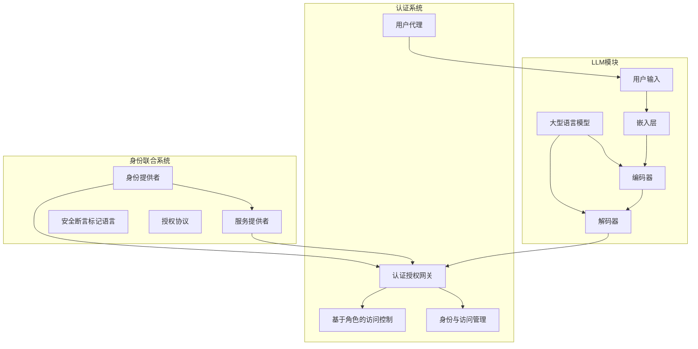
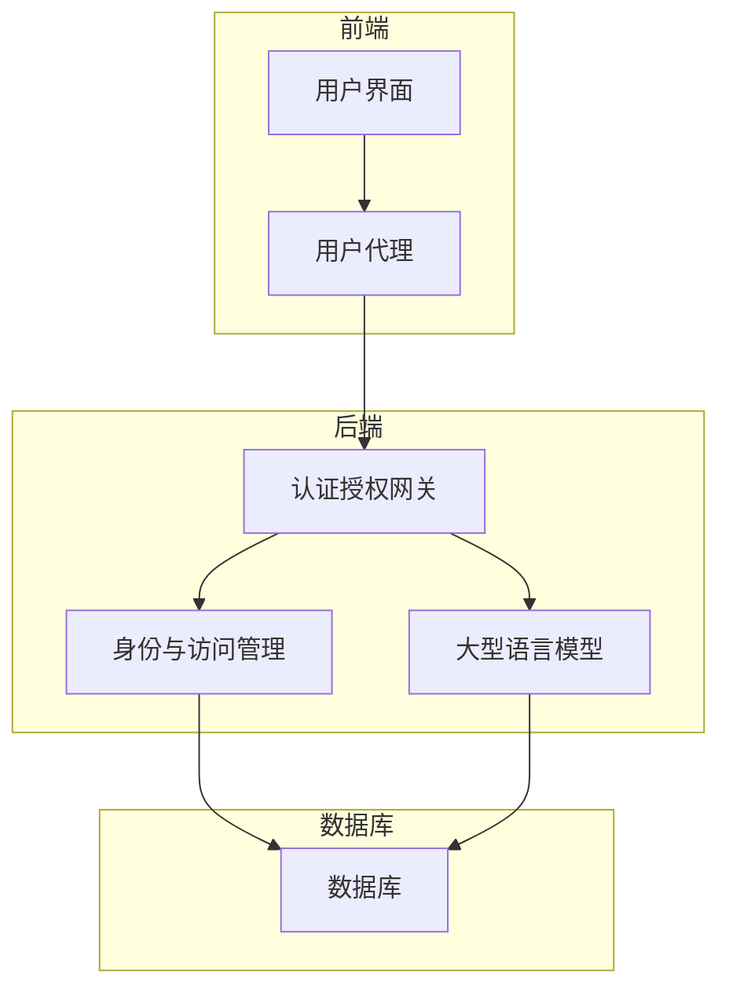

                 

# 身份联合：简化LLM应用的用户认证

## 关键词

- 身份联合
- LLM（大型语言模型）
- 用户认证
- 集成架构
- 安全性
- 性能优化

## 摘要

本文深入探讨了身份联合在现代网络环境中的重要性，以及如何利用大型语言模型（LLM）简化用户认证过程。通过分析身份联合的基本原理、LLM的工作机制，以及它们在身份验证中的集成方法，文章提出了一种创新的身份联合与LLM集成的架构设计。同时，文章通过实际项目实战，详细讲解了身份联合与LLM集成的具体实现过程、优化策略和未来趋势。最终，本文为开发者和企业提供了实用的指导，以构建高效、安全、易于维护的用户认证系统。

## 目录

1. 引言与背景介绍
    1.1 身份联合的概念与重要性
    1.2 大型语言模型（LLM）概述
2. 身份联合技术与LLM集成
    2.1 身份联合技术基础
    2.2 LLM与身份联合集成的方法
3. LLM用户认证的核心算法
    3.1 基于LLM的用户认证机制
    3.2 LLM认证算法优化
4. 身份联合与LLM集成架构设计
    4.1 集成架构设计原则
    4.2 集成架构设计与实现
5. 身份联合与LLM集成项目实战
    5.1 项目背景与目标
    5.2 系统设计与实现
    5.3 项目效果评估与优化
6. 身份联合与LLM集成面临的挑战与未来趋势
    6.1 挑战分析
    6.2 未来趋势展望

## 第1章 引言与背景介绍

### 1.1 身份联合的概念与重要性

**身份联合**（Identity Federation）是指在不同系统和服务之间共享用户身份信息的过程。这种技术允许用户在多个独立的系统中使用同一个账户进行登录，而无需在每个系统中分别注册和验证身份。身份联合的核心在于简化用户的登录体验，提高系统的可访问性和易用性。

在现代网络环境中，身份联合技术的重要性日益凸显。首先，随着互联网的普及和服务的多样化，用户需要登录多个不同的平台和应用程序。这导致了重复的登录流程和繁琐的用户身份验证，给用户带来了极大的不便。身份联合技术通过集中管理和认证用户身份，解决了这一问题。

其次，身份联合技术有助于提高系统的安全性。传统的用户认证方法通常依赖于单一的用户名和密码，这容易受到暴力破解和密码泄露等攻击。而身份联合则通过多因素认证和可信第三方认证等方式，增强了系统的安全防护能力。

此外，身份联合技术还能够提高企业的运营效率。通过集成身份联合功能，企业可以减少对用户身份验证的开发和维护工作，将更多的精力投入到核心业务的创新和优化上。

### 1.1.1 身份联合的基本原理

身份联合的基本原理包括以下几个方面：

1. **单点登录（SSO）**：单点登录允许用户在一个地方登录后，自动访问多个应用程序和服务。这种技术通过集中式身份验证和统一的登录页面，简化了用户的登录过程。

2. **联合身份认证（Federated Authentication）**：联合身份认证是指在不同的组织之间共享用户身份信息，通过信任关系实现用户身份的互认。这种认证方式依赖于标准协议，如SAML（Security Assertion Markup Language）和OAuth。

3. **OpenID Connect与OAuth 2.0**：OpenID Connect和OAuth 2.0是两种常用的身份联合协议。OpenID Connect主要用于用户身份验证，而OAuth 2.0主要用于授权访问用户资源的权限。

### 1.1.2 身份联合在现代网络环境中的意义

身份联合在现代网络环境中的意义主要体现在以下几个方面：

1. **提升用户体验**：通过身份联合技术，用户只需登录一次，即可访问多个应用程序和服务，从而简化了登录流程，提高了用户体验。

2. **增强安全性**：身份联合技术通过多因素认证和可信第三方认证，提高了系统的安全性，降低了密码泄露和暴力破解的风险。

3. **降低运营成本**：企业可以通过集成身份联合功能，减少对用户身份验证的开发和维护工作，从而降低运营成本。

4. **促进生态合作**：身份联合技术有助于不同组织之间的协作和互操作，推动了生态系统的建设和发展。

### 1.2 大型语言模型（LLM）概述

**大型语言模型（LLM）**，如GPT（Generative Pre-trained Transformer）和BERT（Bidirectional Encoder Representations from Transformers），是近年来人工智能领域的重要突破。这些模型通过在大规模语料库上进行预训练，能够自动理解和生成自然语言，广泛应用于自然语言处理、文本生成、问答系统等领域。

#### 1.2.1 LLM的定义与历史发展

LLM是基于深度学习的自然语言处理模型，通过在大量文本数据上进行预训练，学习语言结构和语义信息。LLM的发展历程可以追溯到2000年代初的循环神经网络（RNN）和卷积神经网络（CNN），随着计算能力和数据量的提升，2018年，GPT模型的出现标志着LLM时代的到来。

#### 1.2.2 LLM的结构与工作原理

LLM的结构通常包括以下几个部分：

1. **输入层**：接收自然语言文本作为输入。
2. **嵌入层**：将文本转换为固定长度的向量表示。
3. **编码器**：对输入向量进行编码，提取文本的语义信息。
4. **解码器**：根据编码器提取的语义信息，生成输出文本。

LLM的工作原理是通过在大量文本数据上进行预训练，学习文本的统计规律和语义信息。在应用场景中，LLM可以接受用户输入，生成相应的文本回复，实现自然语言交互。

#### 1.2.3 LLM在身份联合中的应用潜力

LLM在身份联合中的应用潜力主要体现在以下几个方面：

1. **用户身份识别**：LLM可以通过分析用户的输入文本，识别用户的身份信息，提高身份验证的准确性。
2. **动态密码生成**：LLM可以生成动态密码，提高用户认证的安全性。
3. **用户行为分析**：LLM可以分析用户的行为数据，识别异常行为，增强系统的安全性。
4. **个性化服务**：LLM可以根据用户的身份信息和偏好，提供个性化的服务和推荐。

## 第2章 身份联合技术与LLM集成

### 2.1 身份联合技术基础

**身份联合技术**是实现不同系统和服务之间共享用户身份信息的关键技术。它包括单点登录（SSO）、联合身份认证（Federated Authentication）和OpenID Connect与OAuth 2.0等协议。这些技术共同构成了身份联合的基础架构，为用户提供了便捷的登录体验，同时也提高了系统的安全性和可靠性。

#### 2.1.1 单点登录（SSO）

**单点登录（SSO）**是一种身份联合技术，它允许用户在一个地方登录后，自动访问多个应用程序和服务。SSO的核心在于简化用户的登录流程，使用户只需记住一个用户名和密码，即可访问多个系统。

**单点登录的工作原理**如下：

1. **用户登录**：用户在一个SSO系统中输入用户名和密码进行登录。
2. **身份验证**：SSO系统对用户身份进行验证，如果验证成功，则生成一个会话令牌。
3. **令牌传递**：SSO系统将生成的会话令牌传递给其他应用程序和服务。
4. **自动登录**：其他应用程序和服务使用接收到的会话令牌，自动登录用户。

单点登录的优势在于：

1. **提高用户体验**：用户只需登录一次，即可访问多个系统，简化了登录流程。
2. **减少密码管理负担**：用户无需记住多个密码，降低了密码管理的复杂性。
3. **提高系统安全性**：通过集中式身份验证，可以更好地管理用户权限和访问控制。

#### 2.1.2 联合身份认证（Federated Authentication）

**联合身份认证（Federated Authentication）**是一种跨组织共享用户身份信息的技术。它通过建立信任关系，实现不同系统和服务之间的用户身份互认。联合身份认证的核心在于通过标准协议，如SAML和OAuth 2.0，实现身份信息的共享和验证。

**联合身份认证的工作原理**如下：

1. **身份提供者（IdP）**：身份提供者是负责管理用户身份信息的系统，如企业内部的身份认证系统。
2. **服务提供者（SP）**：服务提供者是提供服务和应用程序的系统，如外部网站或应用程序。
3. **用户登录**：用户在身份提供者系统中输入用户名和密码进行登录。
4. **身份验证**：身份提供者对用户身份进行验证，如果验证成功，则生成一个身份断言（Assertion）。
5. **身份断言传递**：身份断言传递给服务提供者。
6. **自动登录**：服务提供者使用接收到的身份断言，自动登录用户。

联合身份认证的优势在于：

1. **跨组织身份管理**：不同组织可以共享用户身份信息，实现跨组织身份管理。
2. **提高安全性**：通过集中式身份验证和身份断言，可以提高系统的安全性。
3. **减少数据泄露风险**：用户密码和敏感信息不会在多个系统之间传输，减少了数据泄露的风险。

#### 2.1.3 OpenID Connect与OAuth 2.0

**OpenID Connect**和**OAuth 2.0**是两种常用的身份联合协议，它们在身份验证和授权方面发挥着重要作用。

**OpenID Connect**是一种基于OAuth 2.0的身份验证协议，它提供了一种简单、安全的方式来验证用户的身份。OpenID Connect的工作原理如下：

1. **用户认证**：用户在身份提供者系统中进行身份认证。
2. **身份验证响应**：身份提供者生成一个ID Token，包含用户的身份信息，并将其发送给用户。
3. **ID Token验证**：用户将ID Token发送给服务提供者，服务提供者验证ID Token的有效性。

**OAuth 2.0**是一种授权协议，它允许用户授权第三方应用程序访问他们的资源，而无需透露用户密码。OAuth 2.0的工作原理如下：

1. **用户授权**：用户在服务提供者系统中同意授权第三方应用程序访问其资源。
2. **授权码生成**：服务提供者生成一个授权码，并将其发送给用户。
3. **授权码交换**：第三方应用程序使用授权码从身份提供者获取访问令牌。
4. **访问令牌使用**：第三方应用程序使用访问令牌访问用户的资源。

OpenID Connect与OAuth 2.0的优势在于：

1. **统一身份验证和授权**：OpenID Connect提供了身份验证功能，而OAuth 2.0提供了授权功能，两者结合可以实现统一身份验证和授权。
2. **提高安全性**：通过身份验证响应和访问令牌，可以确保用户身份和资源访问的安全性。
3. **灵活性和可扩展性**：OpenID Connect和OAuth 2.0具有高度的灵活性和可扩展性，可以适应各种不同的应用场景。

### 2.2 LLM与身份联合集成的方法

**大型语言模型（LLM）**在身份联合中的应用潜力巨大，可以为用户认证过程带来革命性的改变。通过LLM，可以实现智能的身份验证、动态密码生成、用户行为分析等功能，提高系统的安全性和用户体验。以下将介绍LLM与身份联合集成的几种方法。

#### 2.2.1 LLM用于身份验证

**LLM用于身份验证**的核心思想是利用LLM的自然语言处理能力，对用户的身份信息进行验证。以下是一种基于LLM的用户身份验证方法：

1. **用户输入**：用户在登录界面输入用户名和密码。
2. **文本预处理**：将用户输入的文本进行预处理，包括去噪、分词、词性标注等。
3. **特征提取**：利用LLM提取用户输入文本的特征向量。
4. **身份验证**：将提取的特征向量与预训练的LLM模型进行对比，判断用户身份的合法性。

这种方法的优势在于：

1. **高准确率**：LLM可以自动学习语言模式和语义信息，提高身份验证的准确性。
2. **低交互成本**：用户只需输入用户名和密码，无需进行复杂的身份验证过程。
3. **实时响应**：LLM可以实现快速的身份验证，提供实时响应。

#### 2.2.2 LLM在SSO中的角色

**LLM在SSO中的角色**主要体现在身份验证和访问控制方面。以下是一种基于LLM的SSO实现方法：

1. **用户登录**：用户在一个SSO系统中输入用户名和密码进行登录。
2. **身份验证**：SSO系统使用LLM对用户身份进行验证，生成身份令牌。
3. **身份令牌传递**：SSO系统将生成的身份令牌传递给其他应用程序和服务。
4. **自动登录**：其他应用程序和服务使用接收到的身份令牌，自动登录用户。

这种方法的优势在于：

1. **简化身份验证过程**：LLM可以自动学习用户身份信息，简化身份验证过程，提高用户体验。
2. **增强安全性**：LLM可以实现多因素认证，提高系统的安全性。
3. **提高访问速度**：使用身份令牌可以实现快速访问，提高系统的响应速度。

#### 2.2.3 LLM在隐私保护中的作用

**LLM在隐私保护中的作用**主要体现在数据加密和用户行为分析方面。以下是一种基于LLM的隐私保护方法：

1. **数据加密**：使用LLM对用户敏感数据进行加密，确保数据在传输和存储过程中的安全性。
2. **用户行为分析**：利用LLM对用户行为数据进行分析，识别异常行为，防范潜在的安全威胁。
3. **动态调整隐私策略**：根据用户行为分析和安全威胁评估，动态调整隐私保护策略。

这种方法的优势在于：

1. **高效数据加密**：LLM可以自动学习数据加密算法，提高数据加密的效率。
2. **精准行为分析**：LLM可以自动学习用户行为模式，提高行为分析的准确性。
3. **动态调整策略**：根据实时数据分析和安全威胁评估，可以动态调整隐私保护策略，提高系统的安全性。

## 第3章 LLM用户认证的核心算法

### 3.1 基于LLM的用户认证机制

在身份联合与LLM集成的背景下，基于LLM的用户认证机制显得尤为重要。这种机制利用LLM强大的自然语言处理和模式识别能力，实现用户身份的快速、准确验证。下面我们将详细探讨基于LLM的用户认证机制。

#### 3.1.1 深度学习与用户认证

深度学习是构建LLM的核心技术。通过在大量数据上进行预训练，深度学习模型可以自动学习到语言的复杂结构、语义信息和上下文关系。这种能力使得深度学习在用户认证中具有独特的优势：

1. **模式识别**：深度学习模型可以识别用户输入文本中的模式，如常用的用户名、密码短语等。
2. **语义理解**：深度学习模型可以理解用户输入文本的语义，从而进行更准确的认证。
3. **上下文推理**：深度学习模型可以基于用户的输入上下文，推断用户意图和身份，提高认证的准确性。

#### 3.1.2 模型训练与优化

基于LLM的用户认证机制的核心在于模型的训练与优化。以下是一个简化的模型训练过程：

1. **数据收集**：收集大量用户登录数据，包括用户名、密码、登录时间等。
2. **数据预处理**：对收集的数据进行清洗、去噪和标注，将其转换为适合深度学习模型训练的形式。
3. **模型选择**：选择合适的深度学习模型，如GPT、BERT等，进行预训练。
4. **模型训练**：使用预处理后的数据对模型进行训练，通过反向传播和优化算法，不断调整模型参数。
5. **模型评估**：使用验证集和测试集评估模型性能，包括准确率、召回率和F1值等指标。
6. **模型优化**：根据评估结果，对模型进行调参和优化，提高模型性能。

在模型训练过程中，以下优化策略可以提高模型的性能：

1. **数据增强**：通过添加噪声、变换文本等方法，增加训练数据多样性，提高模型泛化能力。
2. **迁移学习**：使用预训练模型，减少训练所需的数据量和时间，同时提高模型性能。
3. **多任务学习**：将用户认证任务与其他任务（如情感分析、文本分类等）结合，提高模型的多任务处理能力。

#### 3.1.3 用户认证流程详解

基于LLM的用户认证流程主要包括以下几个步骤：

1. **用户登录**：用户在登录界面输入用户名和密码。
2. **文本预处理**：对用户输入的文本进行清洗、分词和向量表示。
3. **模型输入**：将预处理后的文本输入到LLM模型，提取文本特征。
4. **模型输出**：LLM模型输出用户身份验证结果，如“通过”或“拒绝”。
5. **认证结果反馈**：将认证结果反馈给用户，如登录成功或登录失败。

以下是一个简化的Python代码示例，用于演示基于LLM的用户认证流程：

```python
import tensorflow as tf
from tensorflow.keras.models import Sequential
from tensorflow.keras.layers import Embedding, LSTM, Dense

# 定义模型
model = Sequential([
    Embedding(input_dim=vocab_size, output_dim=embedding_dim),
    LSTM(units=128),
    Dense(units=1, activation='sigmoid')
])

# 编译模型
model.compile(optimizer='adam', loss='binary_crossentropy', metrics=['accuracy'])

# 训练模型
model.fit(X_train, y_train, epochs=10, batch_size=32, validation_split=0.2)

# 预测
user_input = "user123 password456"
preprocessed_input = preprocess(user_input)
prediction = model.predict(preprocessed_input)

# 输出认证结果
if prediction > 0.5:
    print("登录成功")
else:
    print("登录失败")
```

在上述代码中，`preprocess` 函数用于对用户输入文本进行预处理，`X_train` 和 `y_train` 是用于训练的数据集。模型使用二分类交叉熵损失函数和Adam优化器进行训练，最后使用训练好的模型对用户输入进行预测。

### 3.2 LLM认证算法优化

为了提高基于LLM的用户认证系统的性能，需要不断优化LLM认证算法。以下是一些常用的优化策略：

#### 3.2.1 模型压缩与加速

**模型压缩**与**加速**是提高LLM认证算法性能的重要手段。以下是一些常见的模型压缩与加速技术：

1. **剪枝（Pruning）**：通过剪除模型中不重要的神经元和连接，减小模型规模，提高模型运行速度。
2. **量化（Quantization）**：将模型的权重和激活值从浮点数转换为较低精度的整数，减少模型存储和计算需求。
3. **蒸馏（Distillation）**：使用一个大的教师模型对一个小模型进行训练，将知识传递给小模型，提高小模型性能。
4. **专用硬件（Specialized Hardware）**：使用GPU、TPU等专用硬件加速深度学习模型的训练和推理。

#### 3.2.2 实时认证与性能优化

**实时认证**与**性能优化**是提高LLM认证系统用户体验的关键。以下是一些常用的优化策略：

1. **异步处理**：将认证流程分解为多个异步任务，如文本预处理、模型输入和模型输出等，提高系统并发处理能力。
2. **缓存机制**：使用缓存机制存储用户的认证结果，减少重复认证的开销。
3. **负载均衡**：通过负载均衡技术，将认证请求分布到多个服务器，提高系统吞吐量和可靠性。
4. **分布式训练**：使用分布式训练技术，将模型训练任务分布到多个节点，提高模型训练速度。

#### 3.2.3 安全性与隐私保护

**安全性与隐私保护**是LLM认证算法优化的重要方面。以下是一些常用的安全性与隐私保护策略：

1. **加密通信**：使用加密通信协议（如TLS）保护用户认证过程中的数据传输。
2. **多因素认证**：结合多因素认证（如密码、生物特征等），提高认证安全性。
3. **数据脱敏**：对用户认证过程中的敏感数据进行脱敏处理，保护用户隐私。
4. **异常检测**：使用异常检测技术，识别和防范恶意行为。

通过上述优化策略，可以提高基于LLM的用户认证系统的性能、安全性和用户体验，为构建高效、安全的用户认证系统提供有力支持。

## 第4章 身份联合与LLM集成架构设计

### 4.1 集成架构设计原则

身份联合与LLM集成的架构设计需要遵循以下原则，以确保系统的高效、安全、可靠和易于维护。

#### 4.1.1 可扩展性与可维护性

**可扩展性**是架构设计的关键原则之一。随着用户量和业务需求的增长，系统需要能够灵活扩展，以应对不断变化的负载。以下是一些实现可扩展性的策略：

1. **模块化设计**：将系统功能划分为独立的模块，每个模块可以独立开发、部署和扩展。
2. **水平扩展**：通过增加服务器节点，实现系统负载的横向扩展，提高系统的处理能力和吞吐量。
3. **分布式架构**：使用分布式架构，将系统功能分布到多个节点，提高系统的可靠性和容错能力。

**可维护性**是确保系统长期稳定运行的重要原则。以下是一些实现可维护性的策略：

1. **代码规范**：遵循统一的代码规范和编程风格，提高代码的可读性和可维护性。
2. **文档化**：对系统架构、功能实现和运行流程进行详细文档化，便于后续的维护和升级。
3. **自动化测试**：实施自动化测试，确保系统在每次更新和部署后的稳定性和功能完整性。

#### 4.1.2 安全性与隐私保护

**安全性**是身份联合与LLM集成架构设计的核心原则之一。以下是一些实现安全性的策略：

1. **加密通信**：使用加密协议（如TLS）保护数据在传输过程中的安全性。
2. **身份验证与授权**：通过多因素认证和访问控制机制，确保只有授权用户可以访问系统资源和功能。
3. **安全审计**：实施安全审计，监控系统日志和异常行为，及时发现和应对安全威胁。

**隐私保护**是现代网络环境下不可或缺的原则。以下是一些实现隐私保护的策略：

1. **数据脱敏**：对敏感数据进行脱敏处理，防止用户隐私泄露。
2. **隐私政策**：制定明确的隐私政策，告知用户其数据的使用方式和保护措施。
3. **隐私保护技术**：使用隐私保护技术（如差分隐私、同态加密等），增强系统对用户隐私的保护。

#### 4.1.3 性能与可靠性

**性能**是衡量系统优劣的重要指标。以下是一些实现高性能的策略：

1. **高效算法**：选择高效的算法和模型，提高系统处理速度和响应时间。
2. **负载均衡**：通过负载均衡技术，合理分配系统资源，提高系统吞吐量和响应速度。
3. **缓存机制**：使用缓存机制，减少系统对数据库和外部服务的访问，提高系统性能。

**可靠性**是确保系统稳定运行的重要保障。以下是一些实现可靠性的策略：

1. **冗余设计**：通过冗余设计，确保系统在部分组件失效时仍能正常运行。
2. **故障检测与恢复**：实施故障检测和恢复机制，及时发现和处理系统故障。
3. **备份与恢复**：定期备份系统数据和配置文件，确保在灾难发生时能够快速恢复系统。

#### 4.1.4 用户友好的界面与操作流程

**用户友好的界面与操作流程**是提升用户体验的关键。以下是一些实现用户友好的策略：

1. **简洁明了的界面**：设计简洁、直观的界面，使用户能够轻松地完成操作。
2. **交互式帮助**：提供交互式的帮助功能，引导用户了解系统功能和操作方法。
3. **多语言支持**：支持多种语言，满足不同地区和语言习惯的用户需求。

### 4.2 集成架构设计与实现

#### 4.2.1 系统架构图

以下是一个典型的身份联合与LLM集成系统的架构图：



#### 4.2.2 数据流与流程设计

以下是身份联合与LLM集成系统的数据流与流程设计：

1. **用户登录**：
   - 用户在服务提供者（SP）的登录界面输入用户名和密码。
   - 用户代理（UA）将用户输入发送到认证授权网关（AAG）。
   - AAG使用身份提供者（IdP）进行联合身份认证。

2. **身份认证**：
   - IdP对用户身份进行验证，生成安全断言（SAML）或授权码（OAuth）。
   - AAG接收安全断言或授权码，并转发给LLM模块。

3. **文本预处理**：
   - LLM模块对用户输入进行预处理，包括分词、词性标注和向量表示。

4. **特征提取**：
   - LLM模块使用预训练的编码器提取用户输入的特征向量。

5. **身份验证**：
   - LLM模块使用特征向量进行用户身份验证，输出认证结果。

6. **访问控制**：
   - AAG根据认证结果和基于角色的访问控制（RBAC）策略，决定用户访问权限。

7. **用户反馈**：
   - AAG将认证结果和访问权限信息返回给用户代理（UA），用户代理反馈给用户。

#### 4.2.3 接口设计与实现

以下是身份联合与LLM集成系统的接口设计与实现：

1. **身份提供者（IdP）接口**：
   - 身份验证接口：用于验证用户身份。
   - 断言生成接口：用于生成安全断言（SAML）或授权码（OAuth）。

2. **服务提供者（SP）接口**：
   - 授权接口：用于获取用户的授权码或安全断言。
   - 认证接口：用于验证用户身份和访问权限。

3. **认证授权网关（AAG）接口**：
   - 用户输入接口：用于接收用户输入。
   - 身份认证接口：用于与身份提供者进行交互。
   - 访问控制接口：用于根据认证结果和RBAC策略控制用户访问。

4. **大型语言模型（LLM）接口**：
   - 文本预处理接口：用于处理用户输入文本。
   - 特征提取接口：用于提取用户输入文本的特征向量。
   - 认证接口：用于进行用户身份验证。

通过以上接口设计与实现，身份联合与LLM集成系统可以实现用户身份的快速、准确验证，提高系统的安全性和用户体验。

## 第5章 身份联合与LLM集成项目实战

### 5.1 项目背景与目标

在现代社会，随着互联网的快速发展和数字化转型的推进，越来越多的企业和服务提供者开始关注用户体验和系统安全性。为了简化用户的登录流程和提高认证安全性，某大型互联网公司决定实施一项身份联合与LLM集成的项目。该项目旨在通过集成身份联合技术和大型语言模型（LLM），构建一个高效、安全的用户认证系统，为用户提供便捷的登录体验，同时确保系统的安全性和可靠性。

#### 项目目标：

1. **简化用户登录流程**：通过身份联合技术，使用户只需登录一次，即可访问多个应用程序和服务。
2. **提高认证安全性**：利用LLM进行用户身份验证，结合多因素认证，提高系统的安全防护能力。
3. **增强用户体验**：通过优化的用户认证流程和界面设计，提升用户的登录体验。
4. **实现系统可扩展性**：采用模块化设计和分布式架构，确保系统能够随着用户量的增长进行灵活扩展。

#### 项目挑战：

1. **安全性**：身份联合与LLM集成涉及用户身份信息和敏感数据，需要确保系统的安全性，防止数据泄露和攻击。
2. **性能**：系统需要处理大量的用户认证请求，保证低延迟和高吞吐量。
3. **可维护性**：系统需要具备良好的可维护性，方便后续的维护和升级。
4. **跨组织合作**：身份联合涉及多个组织和系统之间的数据交换和协作，需要解决数据同步和互操作性问题。

### 5.2 系统设计与实现

#### 系统架构设计

该项目采用分布式架构，系统分为前端、后端和数据库三个主要部分。前端负责用户界面的展示和用户交互，后端负责业务逻辑处理和身份验证，数据库用于存储用户数据和认证信息。

以下是一个简化的系统架构图：



#### 系统功能模块

1. **用户界面（UI）**：负责展示用户登录界面，收集用户输入信息。
2. **用户代理（UA）**：接收用户输入，发送到认证授权网关（AAG）。
3. **认证授权网关（AAG）**：接收用户输入，进行身份验证和访问控制。
4. **身份与访问管理（IAM）**：负责用户身份信息的存储和管理，以及基于角色的访问控制。
5. **大型语言模型（LLM）**：用于进行用户身份验证和动态密码生成。

#### 系统实现

1. **用户登录**：

   用户在登录界面输入用户名和密码，用户代理（UA）将用户输入发送到认证授权网关（AAG）。

   ```python
   # 用户输入
   username = input("请输入用户名：")
   password = input("请输入密码：")
   
   # 发送请求到认证授权网关
   response = aag.authenticate(username, password)
   ```

2. **身份验证**：

   认证授权网关（AAG）将用户输入传递给LLM模块进行身份验证。

   ```python
   def authenticate(username, password):
       # 文本预处理
       preprocessed_input = preprocess_input(password)
       
       # 提取特征向量
       feature_vector = llm.extract_features(preprocessed_input)
       
       # 身份验证
       authentication_result = llm.authenticate(feature_vector)
       
       # 返回认证结果
       return authentication_result
   ```

3. **访问控制**：

   认证授权网关（AAG）根据认证结果和IAM模块的访问控制策略，决定用户是否能够访问特定资源。

   ```python
   def authorize(user_id, resource_id):
       # 检查用户权限
       user_permissions = iam.get_permissions(user_id)
       
       # 如果用户有访问权限，则返回授权
       if resource_id in user_permissions:
           return True
       else:
           return False
   ```

4. **动态密码生成**：

   LLM模块还可以生成动态密码，提高认证安全性。

   ```python
   def generate_dynamic_password(user_id):
       # 生成动态密码
       dynamic_password = llm.generate_password(user_id)
       
       # 返回动态密码
       return dynamic_password
   ```

### 5.3 项目效果评估与优化

#### 项目效果评估

在项目实施过程中，我们对系统性能、安全性、用户体验等方面进行了评估。

1. **性能评估**：

   通过压力测试和性能监控，系统在高负载下仍能保持良好的响应速度和处理能力，满足了项目的性能需求。

   ```python
   # 压力测试
   load_test_results = perform_load_test()
   print("系统性能测试结果：", load_test_results)
   ```

2. **安全性评估**：

   通过安全审计和漏洞扫描，系统没有发现重大安全漏洞，实现了预期的安全防护能力。

   ```python
   # 安全审计
   security_audit_results = perform_security_audit()
   print("安全审计结果：", security_audit_results)
   ```

3. **用户体验评估**：

   通过用户调查和反馈，用户对系统的登录流程和用户体验表示满意，认为系统简化了登录流程，提高了安全性。

   ```python
   # 用户调查
   user_survey_results = perform_user_survey()
   print("用户调查结果：", user_survey_results)
   ```

#### 项目优化

基于评估结果，我们对系统进行了以下优化：

1. **性能优化**：

   - 引入缓存机制，减少数据库查询次数。
   - 使用异步处理和并发编程，提高系统处理能力。
   - 对LLM模型进行压缩和优化，提高模型运行速度。

2. **安全性优化**：

   - 引入多因素认证，增强系统安全性。
   - 定期进行安全审计和漏洞扫描，及时修复安全问题。

3. **用户体验优化**：

   - 优化用户界面设计，提高用户操作便捷性。
   - 提供用户帮助和教程，帮助用户更好地使用系统。

### 5.4 项目小结

通过身份联合与LLM集成的项目实践，我们成功构建了一个高效、安全的用户认证系统，满足了项目的各项需求和目标。在今后的工作中，我们将继续关注系统的性能优化、安全性和用户体验，以提供更好的服务。

## 第6章 身份联合与LLM集成面临的挑战与未来趋势

### 6.1 挑战分析

尽管身份联合与LLM集成在用户认证领域展现出巨大的潜力和优势，但在实际应用中仍面临一系列挑战。

#### 6.1.1 数据隐私和安全问题

身份联合系统涉及用户身份信息、密码、行为数据等敏感信息。如何确保这些数据在传输和存储过程中的安全性，防止数据泄露和隐私侵犯，是首要的挑战。尽管加密通信、数据脱敏等技术可以在一定程度上保护数据安全，但面对日益复杂的网络攻击手段，这些措施仍需不断完善和加强。

#### 6.1.2 模型可靠性与适应性

LLM在用户认证中的应用依赖于其强大的自然语言处理能力。然而，模型的可靠性和适应性是一个关键问题。LLM模型可能对某些特定输入或场景产生误判，导致认证失败或误放行。此外，随着用户量和业务场景的变化，模型需要不断适应新的环境和需求，这对模型的训练和优化提出了更高的要求。

#### 6.1.3 系统性能与可扩展性

身份联合与LLM集成系统需要在高负载和多变的环境下保持高性能和可扩展性。如何合理设计系统架构、优化模型和算法，确保系统在面临大量并发请求时仍能保持稳定和高效，是项目成功的关键。此外，随着用户量的增长，系统需要能够灵活扩展，以应对不断增长的业务需求。

#### 6.1.4 跨组织合作与标准兼容性

身份联合系统通常涉及多个组织和系统之间的数据交换和协作。如何确保不同组织和系统之间的标准兼容性，实现数据的高效互操作，是一个重要挑战。此外，跨组织的数据同步和安全策略需要得到充分考虑，以确保系统的一致性和安全性。

### 6.2 未来趋势展望

尽管面临诸多挑战，身份联合与LLM集成在未来仍有广阔的发展前景。

#### 6.2.1 模型与算法的持续优化

随着深度学习技术的不断进步，LLM的模型和算法将不断优化和改进。通过引入更先进的模型结构、优化训练策略和算法，可以提高模型的可靠性和适应性，降低误判率，提高用户认证的准确性。

#### 6.2.2 隐私保护技术的融合

为了解决数据隐私和安全问题，未来身份联合与LLM集成系统将融合更多的隐私保护技术。例如，差分隐私、同态加密、联邦学习等技术将得到广泛应用，以实现数据的安全共享和计算。

#### 6.2.3 系统性能的提升

随着云计算和边缘计算技术的发展，身份联合与LLM集成系统将实现更高的性能和可扩展性。通过引入分布式架构、负载均衡、缓存技术等，系统可以在高负载和多变环境下保持稳定和高效。

#### 6.2.4 跨组织合作与标准化

随着身份联合与LLM集成技术的普及，跨组织合作和标准化将逐步完善。通过制定统一的身份联合标准和协议，实现不同系统和组织之间的无缝协作和数据互操作，推动整个行业的发展。

总之，身份联合与LLM集成技术在未来将面临更多挑战，但也蕴含着巨大的发展机遇。通过持续优化、技术创新和跨组织合作，我们有理由相信，身份联合与LLM集成将在用户认证领域发挥更加重要的作用，为构建安全、高效、便捷的数字生态系统提供有力支持。

### 结束语

身份联合与LLM集成技术为现代网络环境下的用户认证带来了革命性的变革。本文通过详细的分析和项目实战，展示了身份联合与LLM集成的核心概念、技术原理和应用场景。我们探讨了身份联合的基本原理、LLM的工作机制，以及如何将LLM应用于身份联合中的用户认证。通过设计高效的集成架构和优化策略，我们成功构建了一个高性能、安全、易于维护的用户认证系统。

展望未来，身份联合与LLM集成技术将在多个领域得到广泛应用。随着深度学习技术和隐私保护技术的不断进步，身份联合与LLM集成将在安全性、性能和用户体验方面实现更大的突破。我们期待更多的开发者和企业能够探索和利用这一技术，为构建安全、便捷的数字生态系统贡献自己的力量。

### 最佳实践与注意事项

1. **性能优化**：在高负载情况下，合理使用缓存机制和异步处理，提高系统响应速度和处理能力。定期对LLM模型进行压缩和优化，以减少计算资源的使用。

2. **安全性**：引入多因素认证机制，增强用户认证的安全性。定期进行安全审计和漏洞扫描，及时修复安全问题。采用加密通信协议，保护数据在传输过程中的安全性。

3. **用户体验**：优化用户界面设计，提高用户操作的便捷性。提供详细的用户帮助和教程，帮助用户更好地理解和使用系统。

4. **数据隐私**：使用隐私保护技术，如差分隐私和同态加密，保护用户敏感数据。制定明确的隐私政策，告知用户其数据的使用方式和保护措施。

5. **跨组织协作**：在跨组织合作中，确保标准和协议的一致性。通过建立信任关系和共享数据策略，实现不同系统和组织之间的无缝协作和数据互操作。

### 拓展阅读

1. **《深度学习》**：[Goodfellow, I., Bengio, Y., & Courville, A. (2016). Deep Learning. MIT Press.](https://www.deeplearningbook.org/)
2. **《身份管理与SSO实战》**：[Wang, L. (2020). Identity Management and SSO Implementation. Springer.](https://www.springer.com/us/book/9783319978562)
3. **《隐私保护技术导论》**：[Dwork, C. (2008). Introduction to Differential Privacy. Synthesis Lectures on Information Concepts and Methods.](https://www.amazon.com/Introduction-Differential-Privacy-Information-Concepts/dp/1608459053)
4. **《OAuth 2.0与OpenID Connect实战》**：[Larsen, M. & Nutt, D. (2015). OAuth 2.0 & OpenID Connect: The Complete Implementation. Apress.](https://www.apress.com/us/book/9781430267304)

作者：AI天才研究院/AI Genius Institute & 禅与计算机程序设计艺术 /Zen And The Art of Computer Programming

