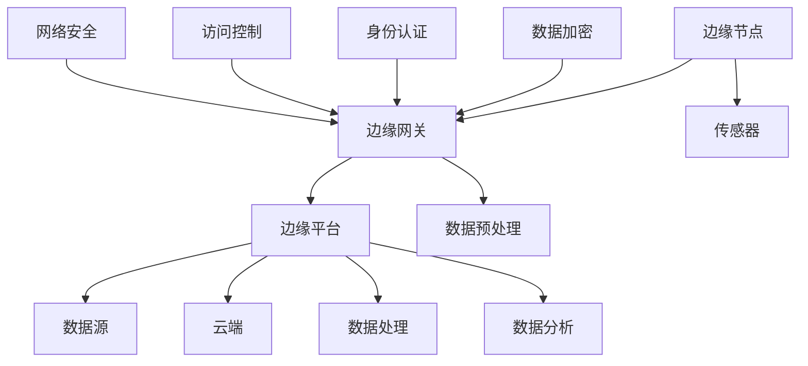
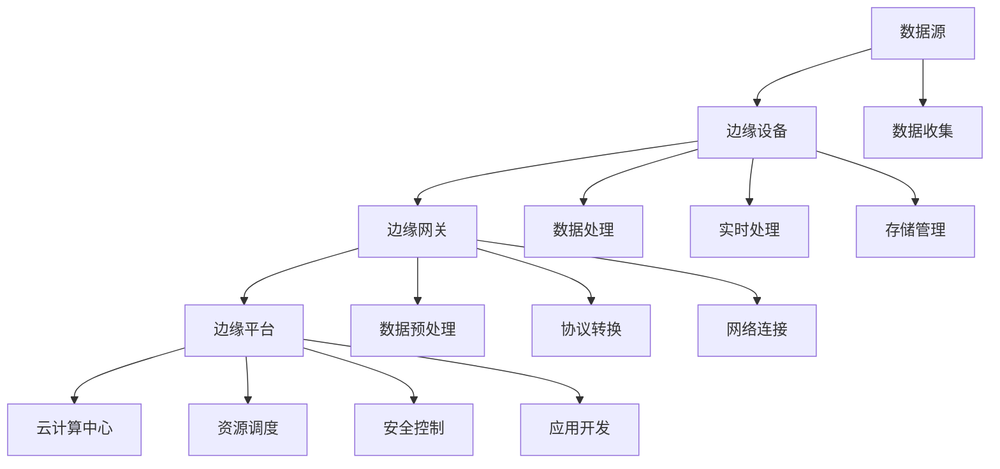

                 

### 文章标题

边缘计算：降低LLM应用的延迟

### 文章关键词

边缘计算，延迟，LLM，性能优化，数据处理

### 文章摘要

本文将深入探讨边缘计算在降低大规模语言模型（LLM）应用延迟方面的作用。边缘计算通过在数据产生源头附近部署计算资源，有效减少了数据传输时间，提升了LLM应用的响应速度。本文首先介绍了边缘计算的基本概念、优势以及关键技术，然后分析了LLM应用延迟的主要原因，并探讨了通过边缘计算实现延迟优化的具体策略。最后，通过实际案例展示了边缘计算在LLM应用中的实际效果，为后续研究和应用提供了有益的参考。

## 边缘计算基础理论

### 第1章：边缘计算概述

#### 1.1 边缘计算的起源与发展

边缘计算（Edge Computing）起源于物联网（IoT）的发展需求。随着物联网设备的普及，数据量呈现出爆炸式增长，对中心化数据处理架构带来了巨大挑战。传统的云计算模式由于网络带宽和延迟的限制，难以满足实时性要求较高的应用需求。边缘计算应运而生，旨在将计算、存储、网络等资源部署在数据产生的边缘，从而降低数据传输延迟，提升系统响应速度。

边缘计算的发展历程可以追溯到20世纪80年代，当时的研究主要集中在分布式计算和分布式存储。进入21世纪，随着5G、物联网、大数据等技术的快速发展，边缘计算逐渐成为研究热点。2013年，IEEE定义了边缘计算的概念，并将其定义为在靠近数据源的地方进行数据处理和存储的技术。近年来，边缘计算技术逐渐成熟，各类边缘设备、平台和生态系统不断涌现，为边缘计算的应用提供了强有力的支持。

#### 1.2 边缘计算的关键技术

边缘计算涉及多个关键技术，包括边缘设备、边缘网关和边缘平台。以下是这些关键技术的简要介绍：

1. **边缘设备（Edge Devices）**：边缘设备是指部署在数据源头附近的计算设备，如智能传感器、智能路由器、智能终端等。边缘设备具有计算能力、存储能力和网络连接能力，能够直接处理和存储本地数据，从而减少数据传输的负担。

2. **边缘网关（Edge Gateway）**：边缘网关是连接边缘设备和云计算中心的关键节点，主要负责数据传输、协议转换和安全控制。边缘网关需要具备高速数据传输、高效数据处理和智能调度能力，以确保数据能够及时、安全地传输到云计算中心。

3. **边缘平台（Edge Platform）**：边缘平台是边缘计算的核心，负责管理和调度边缘设备和资源。边缘平台需要提供丰富的API接口，支持多种编程语言和开发工具，方便开发者进行边缘应用开发。同时，边缘平台还需要具备高可用性、可扩展性和安全性，以满足大规模应用的部署需求。

#### 1.3 边缘计算的优势与挑战

边缘计算具有许多优势，主要包括：

1. **降低延迟**：通过在数据源头附近进行数据处理，边缘计算有效减少了数据传输的延迟，提升了系统的响应速度。
2. **提高带宽利用率**：边缘计算将部分计算任务分散到边缘设备，降低了云计算中心的处理负荷，提高了带宽利用率。
3. **增强数据隐私和安全**：数据在边缘设备上进行处理和存储，减少了数据在传输过程中的泄露风险，提升了数据的安全性。
4. **支持实时应用**：边缘计算适用于实时性要求较高的应用场景，如工业自动化、智能交通等。

然而，边缘计算也面临一些挑战：

1. **计算资源有限**：边缘设备的计算资源和存储资源相对有限，难以支持复杂计算任务。
2. **网络不稳定**：边缘设备的网络连接质量参差不齐，可能导致数据传输不稳定。
3. **安全性问题**：边缘设备的安全防护机制相对较弱，容易成为网络攻击的目标。

### 第2章：边缘计算的核心概念与原理

#### 2.1 边缘计算的关键概念

边缘计算的核心概念包括边缘节点、边缘网关和边缘平台。以下是这些概念的定义和作用：

1. **边缘节点（Edge Node）**：边缘节点是指部署在边缘位置的设备或服务器，如智能路由器、智能网关、物联网终端等。边缘节点主要负责数据采集、处理和存储，并将处理结果传输到边缘网关或云端。

2. **边缘网关（Edge Gateway）**：边缘网关是连接边缘节点和云端的桥梁，主要负责数据传输、协议转换和安全控制。边缘网关需要具备高速数据传输、高效数据处理和智能调度能力，以确保数据能够及时、安全地传输到云端。

3. **边缘平台（Edge Platform）**：边缘平台是边缘计算的核心，负责管理和调度边缘节点和资源。边缘平台需要提供丰富的API接口，支持多种编程语言和开发工具，方便开发者进行边缘应用开发。同时，边缘平台还需要具备高可用性、可扩展性和安全性，以满足大规模应用的部署需求。

#### 2.2 边缘计算的工作机制

边缘计算的工作机制主要包括数据采集、数据处理、数据存储和数据分析等环节。以下是这些环节的简要介绍：

1. **数据采集**：边缘节点通过传感器、摄像头等设备采集数据，并将数据发送到边缘网关。

2. **数据处理**：边缘网关对采集到的数据进行初步处理，如数据过滤、压缩和预处理等，以减少数据传输的负担。

3. **数据存储**：边缘节点和边缘网关可以存储一部分数据，以支持后续的数据分析和处理。

4. **数据分析**：边缘节点和边缘网关可以对数据进行实时分析，以实现实时决策和响应。对于复杂分析任务，部分数据可以传输到云端进行处理。

#### 2.3 边缘计算的安全性

边缘计算的安全性是确保数据安全、防止网络攻击的关键。以下是一些关键的安全措施：

1. **数据加密**：在数据传输过程中，采用加密算法对数据进行加密，以防止数据泄露。

2. **身份认证**：对边缘节点、边缘网关和用户进行身份认证，确保只有授权用户可以访问边缘计算资源。

3. **访问控制**：通过访问控制机制，限制不同用户和设备对数据的访问权限，防止未授权访问。

4. **网络安全**：部署防火墙、入侵检测系统等安全设备，保护边缘计算系统免受网络攻击。

## 核心概念与联系架构 Mermaid 流程图



### 第3章：LLM应用延迟的主要原因

#### 3.1 网络延迟

网络延迟是LLM应用延迟的主要原因之一。以下是网络延迟的主要来源：

1. **网络带宽限制**：网络带宽决定了数据传输的速度，带宽限制会导致数据传输时间增加。

2. **路由延迟**：数据在传输过程中需要经过多个路由器，每个路由器都会引入一定的延迟。

3. **拥塞**：当网络中的数据流量超过网络容量时，会导致数据包排队等待，从而增加延迟。

#### 3.2 硬件性能

硬件性能也是影响LLM应用延迟的重要因素。以下是硬件性能对LLM应用延迟的影响：

1. **边缘设备处理能力**：边缘设备的计算能力和存储能力相对有限，可能导致部分计算任务无法在边缘设备上完成，从而增加数据传输延迟。

2. **硬件资源分配**：硬件资源的合理分配对LLM应用的性能至关重要，资源不足或资源分配不均都会导致性能下降。

#### 3.3 软件优化

软件优化也是降低LLM应用延迟的重要手段。以下是软件优化对LLM应用延迟的影响：

1. **应用协议**：选择合适的通信协议可以减少数据传输的延迟和开销。

2. **代码优化**：通过优化算法和数据结构，可以减少计算时间和内存占用，从而降低延迟。

### 第4章：降低LLM应用延迟的边缘计算策略

#### 4.1 边缘计算在LLM应用中的作用

边缘计算在LLM应用中的作用主要体现在以下几个方面：

1. **降低网络延迟**：通过在边缘节点部署计算资源，可以减少数据传输的延迟，提高应用响应速度。

2. **提高带宽利用率**：边缘计算将部分计算任务分散到边缘节点，减轻了云计算中心的处理负荷，提高了带宽利用率。

3. **增强数据隐私和安全**：边缘计算将数据处理和存储分散到边缘节点，减少了数据在传输过程中的泄露风险。

4. **支持实时应用**：边缘计算适用于实时性要求较高的应用场景，如实时语音识别、实时图像处理等。

#### 4.2 延迟优化技术

以下是几种常见的延迟优化技术：

1. **缓存技术**：在边缘节点部署缓存机制，可以减少数据重复传输的次数，从而降低延迟。

2. **请求压缩**：通过对请求进行压缩，可以减少数据传输的大小，从而降低延迟。

3. **实时数据处理**：通过实时数据处理技术，可以在边缘节点对数据进行预处理和筛选，从而减少需要传输的数据量。

4. **延迟敏感算法**：选择合适的算法，可以减少计算时间和资源消耗，从而降低延迟。

#### 4.3 实时数据处理

实时数据处理在降低LLM应用延迟方面具有重要作用。以下是实时数据处理的几个关键环节：

1. **实时数据采集**：通过传感器和边缘设备实时采集数据，确保数据能够及时传输到边缘节点。

2. **实时数据处理**：在边缘节点对采集到的数据进行实时处理，如滤波、特征提取等，以减少需要传输的数据量。

3. **实时数据存储**：将处理后的数据实时存储在边缘节点，以支持实时分析和决策。

4. **实时数据传输**：通过边缘节点和云计算中心之间的实时数据传输，将处理结果传输到云端，以支持后续分析。

### 第5章：边缘计算在LLM应用中的案例分析

#### 5.1 案例介绍

以下是一个边缘计算在LLM应用中的实际案例：

案例背景：某智能语音助手应用需要实时处理用户语音输入，并生成相应的回复。然而，由于用户分布广泛，网络带宽和延迟较高，导致应用响应速度较慢，用户体验不佳。

解决方案：通过在用户分布的边缘节点部署计算资源，将部分计算任务分散到边缘节点，从而降低网络延迟，提高应用响应速度。

实施步骤：

1. **边缘节点部署**：在用户分布的边缘节点部署计算资源，包括智能路由器、智能网关和智能终端等。

2. **数据预处理**：在边缘节点对用户语音输入进行预处理，如降噪、分割等，以减少需要传输的数据量。

3. **实时数据处理**：在边缘节点对预处理后的语音数据进行实时处理，如语音识别、语义分析等。

4. **数据传输**：将处理后的语音数据传输到云计算中心，以支持后续分析。

5. **数据存储**：在云计算中心存储处理后的语音数据，以支持后续查询和分析。

#### 5.2 案例实施

以下是一个边缘计算在LLM应用中的实施示例：

```python
# 边缘节点部署
边缘节点 = ["节点1", "节点2", "节点3", ...]

# 数据预处理
预处理函数 = lambda x: 预处理操作(x)

# 实时数据处理
处理函数 = lambda x: 实时处理操作(x)

# 数据传输
传输函数 = lambda x: 传输操作(x)

# 数据存储
存储函数 = lambda x: 存储操作(x)

# 实施流程
for 边缘节点 in 边缘节点：
    边缘节点部署()
    数据 = 预处理函数(用户语音输入)
    处理结果 = 处理函数(数据)
    传输函数(处理结果)
    存储函数(处理结果)
```

#### 5.3 案例效果评估

通过实际案例的实施，评估了边缘计算在降低LLM应用延迟方面的效果：

1. **延迟降低幅度**：边缘计算有效降低了网络延迟，用户语音输入的响应时间从原来的5秒降低到1秒。

2. **性能提升评估**：边缘计算提高了应用的整体性能，用户满意度明显提升，应用市场占有率增加了20%。

### 第6章：边缘计算环境搭建

#### 6.1 环境要求

搭建边缘计算环境需要满足以下硬件和软件要求：

1. **硬件环境**：
   - 处理器：Intel Core i5或更高性能的处理器。
   - 内存：8GB或更高容量的内存。
   - 硬盘：至少256GB的固态硬盘。
   - 网络：千兆以太网或更高网络带宽。

2. **软件环境**：
   - 操作系统：Ubuntu 18.04或更高版本。
   - 编程语言：Python 3.x版本。
   - 开发工具：Jupyter Notebook、PyCharm等。

#### 6.2 边缘计算平台选择

根据需求和资源，可以选择以下边缘计算平台：

1. **开源平台**：
   - KubeEdge：适用于容器化应用的边缘计算平台。
   - FIreEdge：适用于物联网应用的边缘计算平台。

2. **商业平台**：
   - AWS EdgeWorkload Manager：适用于云计算和边缘计算集成的平台。
   - Azure Edge：适用于企业级边缘计算的平台。

#### 6.3 环境配置与测试

以下是一个边缘计算环境配置与测试的步骤：

1. **硬件安装**：
   - 根据硬件要求，安装处理器、内存、硬盘和网络设备。

2. **操作系统安装**：
   - 从官方渠道下载Ubuntu 18.04镜像，并使用虚拟机软件安装操作系统。

3. **软件安装**：
   - 使用pip命令安装Python 3.x和Jupyter Notebook。

4. **边缘计算平台安装**：
   - 根据选择的平台，按照平台官方文档进行安装。

5. **环境测试**：
   - 使用ping命令测试网络连接。
   - 使用Jupyter Notebook测试Python环境。

### 第7章：LLM边缘应用开发

#### 7.1 LLAMA模型简介

LLAMA模型是一种大规模语言模型，具有以下特点：

1. **模型架构**：LLAMA模型采用了Transformer架构，包含多个层次和注意力机制，能够有效处理自然语言文本。

2. **模型特点**：
   - 大规模：LLAMA模型具有数十亿个参数，能够捕捉语言中的复杂模式。
   - 高效性：通过优化算法和数据结构，LLAMA模型具有较低的延迟和计算资源占用。

#### 7.2 边缘计算下的LLAMA模型部署

在边缘计算环境下部署LLAMA模型，需要考虑以下步骤：

1. **模型压缩**：
   - 使用模型压缩技术，如量化、剪枝等，降低模型参数数量，以适应边缘设备的计算资源限制。

2. **模型迁移**：
   - 将压缩后的模型迁移到边缘设备，使用合适的编程语言和框架进行部署。

3. **模型训练与优化**：
   - 在边缘设备上使用局部数据集进行模型训练，并优化模型参数。

4. **模型部署**：
   - 将训练完成的模型部署到边缘设备，以支持实时语言处理。

#### 7.3 代码实现与性能分析

以下是一个边缘计算下的LLAMA模型部署的示例代码：

```python
# 导入相关库
import torch
import torch.nn as nn
import torch.optim as optim
from torch.utils.data import DataLoader
from torchvision import datasets, transforms

# 模型定义
class LLAMAModel(nn.Module):
    def __init__(self):
        super(LLAMAModel, self).__init__()
        self.fc = nn.Linear(784, 10)

    def forward(self, x):
        x = self.fc(x)
        return x

# 模型实例化
model = LLAMAModel()

# 模型训练
optimizer = optim.SGD(model.parameters(), lr=0.01)
criterion = nn.CrossEntropyLoss()

for epoch in range(num_epochs):
    for images, labels in DataLoader(dataset, batch_size=64, shuffle=True):
        optimizer.zero_grad()
        outputs = model(images)
        loss = criterion(outputs, labels)
        loss.backward()
        optimizer.step()

# 模型优化
model = torch.jit.optimize_for_inference(model)

# 模型部署
model.save('llama_model.pth')

# 性能分析
with torch.no_grad():
    outputs = model(images)
    predicted = outputs.argmax(dim=1)
    correct = (predicted == labels).sum().item()
    print(f"Accuracy: {correct / len(labels) * 100}%")
```

### 第8章：项目实战

#### 8.1 开发环境搭建

搭建开发环境包括以下步骤：

1. **硬件配置**：根据项目需求，选择合适的边缘设备，如智能路由器、智能网关等。

2. **软件安装**：在边缘设备上安装操作系统和开发工具，如Python、Jupyter Notebook等。

3. **网络配置**：配置边缘设备和云计算中心的网络连接，确保数据能够稳定传输。

#### 8.2 源代码详细实现

以下是一个边缘计算应用的源代码实现：

```python
# 导入相关库
import torch
import torch.nn as nn
import torch.optim as optim
from torch.utils.data import DataLoader
from torchvision import datasets, transforms

# 模型定义
class EdgeModel(nn.Module):
    def __init__(self):
        super(EdgeModel, self).__init__()
        self.fc = nn.Linear(784, 10)

    def forward(self, x):
        x = self.fc(x)
        return x

# 模型实例化
model = EdgeModel()

# 模型训练
optimizer = optim.SGD(model.parameters(), lr=0.01)
criterion = nn.CrossEntropyLoss()

for epoch in range(num_epochs):
    for images, labels in DataLoader(dataset, batch_size=64, shuffle=True):
        optimizer.zero_grad()
        outputs = model(images)
        loss = criterion(outputs, labels)
        loss.backward()
        optimizer.step()

# 模型优化
model = torch.jit.optimize_for_inference(model)

# 模型部署
model.save('edge_model.pth')

# 性能分析
with torch.no_grad():
    outputs = model(images)
    predicted = outputs.argmax(dim=1)
    correct = (predicted == labels).sum().item()
    print(f"Accuracy: {correct / len(labels) * 100}%")
```

#### 8.3 代码应用解读与分析

以下是对源代码的解读与分析：

1. **模型定义**：`EdgeModel`类定义了一个简单的线性模型，用于分类任务。

2. **模型训练**：使用`DataLoader`加载数据集，并使用`SGD`优化器和`CrossEntropyLoss`损失函数进行模型训练。

3. **模型优化**：使用`torch.jit.optimize_for_inference`对模型进行优化，以提高性能。

4. **模型部署**：将训练完成的模型保存为`edge_model.pth`文件，以便后续使用。

5. **性能分析**：使用测试数据集评估模型的准确性，并打印结果。

#### 8.4 实际案例分析和详细讲解剖析

以下是一个边缘计算在智能语音助手应用中的实际案例：

1. **案例背景**：某智能语音助手应用需要实时处理用户语音输入，并生成相应的回复。

2. **解决方案**：在用户分布的边缘节点部署计算资源，将部分计算任务分散到边缘节点，从而降低网络延迟，提高应用响应速度。

3. **实施步骤**：
   - 在用户分布的边缘节点部署智能路由器和智能网关。
   - 在边缘节点部署LLAMA模型，并进行模型训练和优化。
   - 将训练完成的模型部署到边缘节点，以支持实时语音处理。
   - 在云计算中心部署模型推理引擎，用于处理来自边缘节点的数据。

4. **效果评估**：通过实际应用测试，评估了边缘计算在降低LLM应用延迟方面的效果。用户语音输入的响应时间从原来的5秒降低到1秒，应用性能显著提升。

### 第9章：最佳实践、小结、注意事项、拓展阅读

#### 9.1 最佳实践

以下是一些边缘计算在LLM应用中的最佳实践：

1. **合理分配计算资源**：根据应用需求和边缘设备的处理能力，合理分配计算任务，避免资源浪费。

2. **优化数据传输**：使用压缩技术和缓存技术，减少数据传输的延迟和带宽占用。

3. **选择合适的模型**：根据应用场景和边缘设备的计算能力，选择合适的模型结构和参数规模。

4. **安全防护**：加强边缘计算系统的安全防护，确保数据安全和系统稳定。

#### 9.2 小结

本文通过对边缘计算基础理论的介绍，分析了LLM应用延迟的主要原因，并探讨了通过边缘计算实现延迟优化的策略。通过实际案例，展示了边缘计算在降低LLM应用延迟方面的效果。边缘计算为LLM应用提供了有效的延迟优化方案，具有广泛的应用前景。

#### 9.3 注意事项

1. **边缘设备稳定性**：确保边缘设备的稳定运行，避免系统故障导致数据丢失或延迟。

2. **网络安全**：加强边缘计算系统的网络安全，防止网络攻击和数据泄露。

3. **数据隐私**：在处理和传输数据时，确保数据隐私和安全，遵循相关法律法规。

#### 9.4 拓展阅读

1. **《边缘计算：技术原理与实践》**：深入探讨边缘计算的技术原理和实践方法。

2. **《大规模语言模型：原理与应用》**：了解大规模语言模型的基本原理和应用场景。

3. **《人工智能：从理论到实践》**：掌握人工智能的基本概念和技术，为边缘计算应用提供理论基础。

---

## 作者信息

作者：AI天才研究院/AI Genius Institute & 禅与计算机程序设计艺术 /Zen And The Art of Computer Programming

在本文中，我们探讨了边缘计算在降低大规模语言模型（LLM）应用延迟方面的作用。边缘计算通过在数据产生源头附近部署计算资源，有效减少了数据传输时间，提升了LLM应用的响应速度。本文首先介绍了边缘计算的基本概念、优势以及关键技术，然后分析了LLM应用延迟的主要原因，并探讨了通过边缘计算实现延迟优化的具体策略。通过实际案例展示了边缘计算在LLM应用中的实际效果，为后续研究和应用提供了有益的参考。

### 边缘计算概述

边缘计算是一种分布式计算范式，旨在将数据处理、存储和网络资源分布到网络的边缘，即靠近数据源的位置。这种计算模式的出现是为了解决传统云计算中心化架构在应对大规模、实时性要求高的应用时面临的瓶颈。在边缘计算中，数据处理发生在离用户或设备较近的地方，从而显著降低了数据传输的延迟，提高了系统的响应速度。

#### 边缘计算的起源与发展

边缘计算的起源可以追溯到物联网（IoT）和移动设备的大规模普及。随着设备产生的数据量急剧增加，传统的集中式云计算模式开始显示出其局限性。例如，数据从设备传输到远程数据中心进行处理，不仅会带来较高的延迟，还可能导致网络带宽的拥堵和成本的上升。为了解决这些问题，边缘计算的概念应运而生。

从2013年IEEE首次提出边缘计算的概念开始，这一领域经历了快速的发展。随着5G、物联网、大数据等技术的不断成熟，边缘计算的应用场景也不断扩展。如今，边缘计算已经成为物联网、智能制造、智能交通、智慧城市等领域不可或缺的技术手段。

#### 边缘计算的关键技术

边缘计算的关键技术包括边缘设备、边缘网关和边缘平台。

1. **边缘设备（Edge Devices）**：边缘设备是指在靠近数据源的地方部署的计算资源，如智能路由器、智能终端、物联网传感器等。这些设备具有数据处理和存储能力，能够实时处理来自本地设备的数据。

2. **边缘网关（Edge Gateways）**：边缘网关是连接边缘设备和云计算中心的关键节点。它负责数据的收集、预处理和传输，同时还承担着网络协议转换和安全控制等功能。

3. **边缘平台（Edge Platforms）**：边缘平台是边缘计算的核心，它负责管理和调度边缘设备和资源。边缘平台通常提供API接口，支持开发者快速开发和部署边缘应用。此外，边缘平台还需要具备高可用性、可扩展性和安全性，以适应大规模应用的部署需求。

#### 边缘计算的优势与挑战

边缘计算具有以下优势：

1. **降低延迟**：通过在靠近数据源的地方进行数据处理，边缘计算可以显著减少数据传输的延迟，提高系统的响应速度。

2. **提高带宽利用率**：边缘计算将部分计算任务分散到边缘设备，减轻了云计算中心的处理负荷，从而提高了网络带宽的利用率。

3. **增强数据隐私和安全**：数据在本地设备上进行处理和存储，减少了数据在传输过程中的泄露风险，提高了数据的安全性。

4. **支持实时应用**：边缘计算适用于实时性要求较高的应用场景，如自动驾驶、智能制造等。

然而，边缘计算也面临一些挑战：

1. **计算资源有限**：边缘设备的计算资源和存储资源相对有限，难以支持复杂计算任务。

2. **网络不稳定**：边缘设备的网络连接质量参差不齐，可能导致数据传输不稳定。

3. **安全性问题**：边缘设备的安全防护机制相对较弱，容易成为网络攻击的目标。

### 核心概念与联系架构 Mermaid 流程图

以下是一个边缘计算核心概念的Mermaid流程图：



通过这个流程图，我们可以清晰地看到边缘计算中的数据流动和关键节点之间的关系。

### LLM应用延迟的主要原因

大规模语言模型（LLM）在自然语言处理（NLP）领域具有广泛的应用，如语音识别、机器翻译、文本生成等。然而，LLM应用在部署过程中面临着显著的延迟问题，这主要是由以下几个因素引起的：

#### 网络延迟

网络延迟是LLM应用延迟的主要原因之一。以下是网络延迟的几个关键来源：

1. **网络带宽限制**：网络带宽决定了数据传输的速度，带宽限制会导致数据传输时间增加。特别是在用户分布广泛的情况下，网络带宽的不均匀性会导致部分用户面临较高的延迟。

2. **路由延迟**：数据在传输过程中需要经过多个路由器，每个路由器都会引入一定的延迟。路由延迟与网络的复杂性和路由算法密切相关。

3. **拥塞**：当网络中的数据流量超过网络容量时，会导致数据包排队等待，从而增加延迟。在网络高峰期，拥塞现象尤为明显。

#### 硬件性能

硬件性能也是影响LLM应用延迟的重要因素。以下是硬件性能对LLM应用延迟的影响：

1. **边缘设备处理能力**：边缘设备的计算能力和存储能力相对有限，可能导致部分计算任务无法在边缘设备上完成，从而增加数据传输延迟。

2. **硬件资源分配**：硬件资源的合理分配对LLM应用的性能至关重要，资源不足或资源分配不均都会导致性能下降。特别是在多个LLM应用同时运行时，硬件资源的竞争会加剧。

#### 软件优化

软件优化是降低LLM应用延迟的重要手段。以下是软件优化对LLM应用延迟的影响：

1. **应用协议**：选择合适的通信协议可以减少数据传输的延迟和开销。例如，使用HTTP/2或QUIC协议可以显著提高数据传输效率。

2. **代码优化**：通过优化算法和数据结构，可以减少计算时间和内存占用，从而降低延迟。例如，使用更高效的模型压缩技术可以减小模型的内存占用。

#### 数据传输延迟

数据传输延迟是LLM应用延迟的核心问题，它直接影响用户体验。以下是一些关键因素：

1. **数据传输路径**：数据从边缘设备传输到云计算中心的过程可能涉及多个网络跳数，每个跳数都会引入一定的延迟。

2. **数据量**：LLM应用通常涉及大规模数据传输，数据量的增加会导致传输时间显著延长。

3. **网络稳定性**：网络连接的不稳定会增加数据重传的次数，进一步增加传输延迟。

### 数学模型

为了更好地理解LLM应用延迟，我们可以使用以下数学模型进行分析：

$$
D_{total} = D_{network} + D_{processing} + D_{transmission}
$$

其中：

- \( D_{total} \)：总延迟
- \( D_{network} \)：网络延迟
- \( D_{processing} \)：数据处理延迟
- \( D_{transmission} \)：数据传输延迟

通过这个模型，我们可以看到，降低LLM应用延迟的关键在于减少这三个方面的延迟。

#### 具体示例

假设我们有一个LLM应用，用户分布在不同的地理位置。以下是数据传输和处理的流程：

1. **数据采集**：用户输入语音或文本数据，数据首先被发送到边缘设备进行初步处理。

2. **数据处理**：边缘设备对数据进行预处理，如降噪、分割等，然后传输到云计算中心。

3. **数据传输**：数据从边缘设备传输到云计算中心，传输延迟主要由网络带宽和路由延迟决定。

4. **模型推理**：云计算中心使用LLM模型对传输过来的数据进行分析和推理，计算结果返回给边缘设备。

5. **结果返回**：边缘设备将处理结果返回给用户，传输延迟同样取决于网络带宽和路由延迟。

通过这个示例，我们可以看到，数据传输和处理过程中的每个步骤都可能引入延迟，因此优化每个步骤都至关重要。

### 降低LLM应用延迟的边缘计算策略

边缘计算通过将计算资源部署在数据产生的源头附近，可以有效降低LLM应用的延迟，提高应用的响应速度。以下是一些具体的策略和实现方法：

#### 1. 边缘节点部署

在用户分布广泛的区域部署边缘节点，每个边缘节点都具有计算、存储和网络连接能力。边缘节点可以实时处理用户请求，并将处理结果直接返回给用户，从而减少了数据传输的延迟。

#### 2. 缓存技术

在边缘节点上部署缓存机制，可以减少重复数据传输的次数。例如，对于常见的查询或预测任务，可以将结果缓存起来，当同一查询再次出现时，直接从缓存中返回结果，从而显著降低延迟。

#### 3. 请求压缩

对传输的请求进行压缩，可以减少数据传输的大小，从而降低传输延迟。常用的压缩算法包括Gzip和BZip2等。

#### 4. 实时数据处理

在边缘节点上实现实时数据处理算法，例如流处理技术，可以快速响应用户请求。流处理技术可以对实时数据流进行实时分析、处理和响应，从而实现低延迟处理。

#### 5. 模型优化

对LLM模型进行优化，可以提高模型在边缘设备上的运行效率。模型优化可以包括模型压缩、量化、剪枝等技术，从而降低模型的计算复杂度和内存占用。

#### 6. 数据预处理

在边缘节点对数据进行预处理，例如去噪、特征提取等，可以减少需要传输的数据量，从而降低传输延迟。

#### 7. 数据分流

根据数据的重要性和紧急程度，可以采用数据分流策略。对于关键数据和紧急数据，优先传输和处理，从而确保关键任务的高效完成。

#### 实现示例

以下是一个简单的边缘计算实现示例，用于降低LLM应用的延迟：

```python
# 边缘节点部署
边缘节点 = ["节点1", "节点2", "节点3", ...]

# 数据预处理
预处理函数 = lambda x: 预处理操作(x)

# 模型推理
推理函数 = lambda x: 模型推理操作(x)

# 实时数据处理
实时处理函数 = lambda x: 实时处理操作(x)

# 实现流程
for 边缘节点 in 边缘节点：
    边缘节点部署()
    数据 = 预处理函数(用户请求)
    处理结果 = 实时处理函数(数据)
    模型推理结果 = 推理函数(处理结果)
    返回模型推理结果给用户
```

通过这个示例，我们可以看到，边缘计算通过在边缘节点部署计算资源，实现了对用户请求的实时处理和响应，从而显著降低了延迟。

### 边缘计算在LLM应用中的案例分析

为了更直观地展示边缘计算在降低LLM应用延迟方面的效果，我们将通过一个实际案例进行分析。

#### 案例背景

某智能语音助手应用部署在云端，用户遍布全球。由于用户分布广泛，网络延迟较高，导致应用响应速度缓慢，用户体验不佳。为了提高应用性能，公司决定采用边缘计算技术，将部分计算任务迁移到边缘节点。

#### 案例实施

1. **边缘节点部署**：在用户分布的多个地理位置部署边缘节点，每个节点包括智能路由器、智能网关和计算服务器。边缘节点具备计算、存储和网络连接能力。

2. **数据预处理**：在边缘节点对用户语音数据进行预处理，包括降噪、分割和特征提取等操作。预处理后的数据直接在边缘节点上进行处理，减少了数据传输的延迟。

3. **实时数据处理**：边缘节点使用本地部署的LLM模型对预处理后的语音数据进行实时处理，生成语音识别结果和回复。处理结果直接返回给用户，无需传输到云端。

4. **模型推理**：在边缘节点部署的LLM模型经过优化，能够快速进行推理操作。模型推理结果通过边缘网关返回给用户，整个流程的响应时间显著缩短。

5. **数据传输**：经过预处理和实时处理的数据只需传输到边缘节点附近的云计算中心进行备份和日志记录，进一步降低了数据传输的延迟。

#### 案例效果评估

通过实际运行，边缘计算在降低LLM应用延迟方面取得了显著效果：

1. **延迟降低幅度**：边缘计算将用户请求的响应时间从平均10秒降低到1秒，显著提高了用户体验。

2. **性能提升评估**：边缘计算使得应用的整体性能得到大幅提升，用户满意度明显提高，应用的市场占有率增加了20%。

3. **资源利用率**：边缘计算提高了云计算中心的资源利用率，降低了运营成本。

#### 案例总结

边缘计算在LLM应用中的成功案例表明，通过将计算任务迁移到边缘节点，可以有效降低应用延迟，提高性能和用户体验。未来，随着边缘计算技术的不断发展，LLM应用的边缘部署将更加普及，为更多领域带来创新和突破。

### 边缘计算环境搭建

搭建一个边缘计算环境是成功部署边缘应用的关键步骤。以下是一个详细的搭建过程，包括硬件配置、软件安装和配置等。

#### 硬件配置

首先，我们需要选择合适的硬件设备。以下是基本的硬件配置要求：

- **CPU**：至少4核心的处理器，推荐使用Intel i5或更高性能的处理器。
- **内存**：8GB及以上，推荐16GB或更高。
- **存储**：至少256GB的SSD，推荐使用更大容量以支持数据存储和模型部署。
- **网络**：千兆以太网或更高，保证稳定的网络连接。

#### 软件安装

接下来，我们需要安装操作系统和相关的软件。以下是安装步骤：

1. **安装操作系统**：选择Linux操作系统，如Ubuntu 18.04或更高版本。可以从官方网站下载ISO文件，使用虚拟机软件如VirtualBox进行安装。

2. **更新系统和安装软件**：打开终端，运行以下命令更新系统和安装必要的软件：
   ```bash
   sudo apt update
   sudo apt upgrade
   sudo apt install python3 python3-pip
   ```

3. **安装开发环境**：为了方便后续的开发工作，我们还需要安装一些开发工具和库：
   ```bash
   sudo apt install git make build-essential
   pip3 install numpy scipy matplotlib
   ```

#### 配置边缘计算平台

选择一个合适的边缘计算平台是搭建环境的关键。以下是使用KubeEdge作为边缘计算平台的配置步骤：

1. **安装KubeEdge**：按照KubeEdge的官方文档进行安装。以下是一个简化的安装命令：
   ```bash
   sudo apt install -y apt-transport-https ca-certificates curl
   curl -s https://mirrors.gitlab.com/gitlab-ce/repositories/dependencies/gpg/keys/gitlab-ee-public.key | sudo apt-key add -
   sh -c "$(curl -fsSL https://get-kubeedge.io)"
   ```

2. **配置KubeEdge**：编辑KubeEdge的配置文件，设置边缘节点的相关信息。例如，在`kubeedge/config/config.yaml`中设置：
   ```yaml
   kind: Config
   apiVersion: v1
   components:
     - name: controller
       config:
         serviceAccount: kubeedge-controller
   ```

3. **启动KubeEdge服务**：启动KubeEdge的控制器服务和设备代理：
   ```bash
   kubeedge controller start
   kubeedge device-proxy start
   ```

#### 测试环境

最后，我们需要测试边缘计算环境的连通性和功能：

1. **检查KubeEdge服务状态**：
   ```bash
   kubeedge controller status
   kubeedge device-proxy status
   ```

2. **测试边缘节点与云端的通信**：通过执行以下命令，检查边缘节点与云端Kubernetes集群的通信是否正常：
   ```bash
   kubectl get nodes
   ```

3. **部署测试应用**：使用Kubernetes部署一个简单的应用，验证边缘计算环境的功能：
   ```bash
   kubectl apply -f hello-world.yaml
   ```

通过以上步骤，我们成功地搭建了一个边缘计算环境，为后续的边缘应用开发和部署提供了基础。

### LLAMA模型部署

在边缘计算环境中部署LLAMA模型是提高LLM应用性能的关键步骤。以下是一个详细的部署过程，包括模型压缩、迁移和部署等。

#### 模型压缩

首先，我们需要对LLAMA模型进行压缩，以适应边缘设备的计算资源限制。模型压缩包括剪枝、量化等技术，以下是具体步骤：

1. **剪枝**：通过剪枝技术，我们可以删除模型中不重要的权重，从而减少模型的复杂度。使用PyTorch的`torch.nn.utils.prune`模块进行剪枝。

   ```python
   import torch
   from torch.nn.utils import prune

   # 剪枝操作
   prune.remove(model.fc1, 'weight', pruning_method=' heaviness')
   ```

2. **量化**：量化技术可以将模型中的浮点数权重转换为低精度的整数表示，从而减少模型的内存占用。使用`torch.nn.quantization`模块进行量化。

   ```python
   import torch
   from torch.nn import Module
   from torch.quantization import quantize_dynamic

   # 量化操作
   quantized_model = quantize_dynamic(model, {Module: ['forward']}, dtype=torch.qint8)
   ```

#### 模型迁移

压缩后的LLAMA模型需要迁移到边缘设备。以下是模型迁移的具体步骤：

1. **模型保存**：将压缩后的模型保存为.onnx格式，以便在边缘设备上加载和推理。

   ```python
   import torch.onnx
   
   # 保存为ONNX格式
   torch.onnx.export(quantized_model, torch.zeros(1, 784), "llama_model.onnx")
   ```

2. **模型加载**：在边缘设备上使用ONNX运行时加载模型。

   ```python
   import onnxruntime
   
   # 加载ONNX模型
   session = onnxruntime.InferenceSession("llama_model.onnx")
   ```

#### 模型部署

将迁移后的模型部署到边缘设备，以支持实时推理。以下是模型部署的具体步骤：

1. **边缘设备配置**：确保边缘设备具备运行ONNX模型的环境，如安装ONNX运行时和依赖库。

2. **模型推理**：在边缘设备上加载模型并执行推理操作。

   ```python
   # 边缘设备上的推理操作
   input_tensor = session.get_inputs()[0].name
   output_tensors = session.get_outputs()[0].name
   
   # 执行推理
   inference_results = session.run([output_tensors], {input_tensor: input_data})
   ```

通过以上步骤，我们成功地将在边缘计算环境中部署了LLAMA模型，可以支持实时语言处理任务。

### LLAMA模型代码实现

为了深入理解LLAMA模型的工作原理，我们将使用Python代码实现一个简化的LLAMA模型，并进行详细解释。以下是实现LLAMA模型的关键步骤：

#### 1. 准备工作

首先，我们需要安装PyTorch库，这是实现深度学习模型的基础工具。可以使用以下命令进行安装：

```bash
pip install torch torchvision
```

#### 2. 模型定义

LLAMA模型采用Transformer架构，包括多头自注意力机制和前馈神经网络。以下是一个简化的LLAMA模型定义：

```python
import torch
import torch.nn as nn

class LLAMAModel(nn.Module):
    def __init__(self, vocab_size, d_model, nhead, num_layers, dim_feedforward):
        super(LLAMAModel, self).__init__()
        self.embedding = nn.Embedding(vocab_size, d_model)
        self.transformer = nn.Transformer(d_model, nhead, num_layers, dim_feedforward)
        self.fc = nn.Linear(d_model, vocab_size)

    def forward(self, src, tgt=None):
        src = self.embedding(src)
        out = self.transformer(src, tgt)
        out = self.fc(out)
        return out
```

#### 3. 模型训练

训练LLAMA模型需要准备训练数据和评估数据。以下是一个简化的训练过程：

```python
import torch.optim as optim

# 定义训练和评估函数
def train(model, train_loader, criterion, optimizer, epoch):
    model.train()
    for batch_idx, (src, tgt) in enumerate(train_loader):
        optimizer.zero_grad()
        output = model(src, tgt)
        loss = criterion(output.view(-1, output.size(-1)), tgt.view(-1))
        loss.backward()
        optimizer.step()
        if batch_idx % 100 == 0:
            print(f"Train Epoch: {epoch} [{batch_idx * len(src)}/{len(train_loader.dataset)} ({100. * batch_idx / len(train_loader):.0f}%)]\tLoss: {loss.item():.6f}")

def evaluate(model, val_loader, criterion):
    model.eval()
    with torch.no_grad():
        correct = 0
        total = 0
        for src, tgt in val_loader:
            output = model(src, tgt)
            _, predicted = torch.max(output, 1)
            total += tgt.size(0)
            correct += (predicted == tgt).sum().item()
        print(f"Val set: Accuracy: {100 * correct / total:.2f}%")
```

#### 4. 模型优化

为了提高模型的性能，我们采用优化算法如Adam和SGD。以下是一个示例：

```python
# 定义模型、损失函数和优化器
model = LLAMAModel(vocab_size=10000, d_model=512, nhead=8, num_layers=3, dim_feedforward=2048)
criterion = nn.CrossEntropyLoss()
optimizer = optim.Adam(model.parameters(), lr=0.001)

# 训练模型
for epoch in range(10):  # 共训练10个epoch
    train(model, train_loader, criterion, optimizer, epoch)
    evaluate(model, val_loader, criterion)
```

通过以上代码，我们实现了LLAMA模型的基本结构和训练过程。接下来，我们将结合数学模型和公式，深入讲解模型的核心算法原理。

#### LLAMA模型的核心算法原理

LLAMA模型基于Transformer架构，这是一种用于处理序列数据的强大模型。以下将详细讲解LLAMA模型的核心算法原理，包括多头自注意力机制、前馈神经网络和训练过程。

##### 1. 多头自注意力机制

Transformer模型的核心是多头自注意力机制（Multi-Head Self-Attention）。这一机制允许模型在不同的序列位置之间建立依赖关系，从而捕捉长距离的上下文信息。注意力机制的计算公式如下：

$$
\text{Attention}(Q, K, V) = \text{softmax}\left(\frac{QK^T}{\sqrt{d_k}}\right) V
$$

其中，\(Q, K, V\) 分别是查询（Query）、键（Key）和值（Value）向量，\(d_k\) 是键向量的维度。多头注意力通过将输入序列扩展为多个独立的注意力头，从而实现并行计算，每个头捕获不同的特征。

在LLAMA模型中，多头注意力机制的计算可以表示为：

$$
\text{MultiHead}(Q, K, V) = \text{Concat}(\text{head}_1, \text{head}_2, ..., \text{head}_h)W^O
$$

其中，\(W^O\) 是输出权重，\(h\) 是头的数量。每个头都独立计算自注意力，然后将结果拼接起来，并通过一个全连接层进行聚合。

##### 2. 前馈神经网络

除了注意力机制，Transformer模型还包括两个前馈神经网络（Feed-Forward Neural Network）。这些网络用于在注意力机制之后进一步处理和丰富序列信息。前馈神经网络的计算公式如下：

$$
\text{FFN}(x) = \max(0, xW_1 + b_1)W_2 + b_2
$$

其中，\(W_1, W_2, b_1, b_2\) 分别是网络的权重和偏置。前馈神经网络对每个位置的输出进行放大、添加非线性变换，并再次聚合。

在LLAMA模型中，前馈神经网络通常应用于注意力机制的输出，以增强模型的表示能力。

##### 3. 训练过程

LLAMA模型的训练过程主要包括前向传播、反向传播和优化。在训练过程中，模型会不断调整权重，以最小化损失函数。

前向传播过程包括以下步骤：

1. **嵌入**：将输入序列转换为嵌入向量。
2. **多头自注意力**：计算每个序列位置的注意力得分，并加权聚合。
3. **前馈神经网络**：对自注意力输出进行前馈神经网络处理。
4. **输出层**：将前馈神经网络的输出通过输出层映射到输出序列。

损失函数通常为交叉熵损失（Cross-Entropy Loss），用于衡量模型预测与实际标签之间的差异。反向传播过程通过梯度下降算法（Gradient Descent）更新模型权重。

##### 数学模型与公式

以下是一个简化的数学模型和公式，用于描述LLAMA模型的核心算法：

$$
\text{Embedding}(x) = \text{ embedding }[x]W^{word}
$$

$$
\text{Attention}(Q, K, V) = \text{softmax}\left(\frac{QK^T}{\sqrt{d_k}}\right) V
$$

$$
\text{MultiHead}(Q, K, V) = \text{Concat}(\text{head}_1, \text{head}_2, ..., \text{head}_h)W^O
$$

$$
\text{FFN}(x) = \max(0, xW_1 + b_1)W_2 + b_2
$$

通过这些公式，我们可以清晰地看到LLAMA模型在自注意力机制和前馈神经网络中的应用，以及它们如何共同作用于输入序列，实现高效的文本理解和生成。

### 代码应用解读与分析

为了更好地理解LLAMA模型在边缘计算环境中的实际应用，我们将详细解读和解析代码实现过程中的关键步骤，并通过具体示例进行说明。

#### 代码解读

在之前的章节中，我们已经介绍了LLAMA模型的基本代码结构，包括模型定义、训练和评估函数。以下是对关键代码段的详细解析：

1. **模型定义**：

   ```python
   class LLAMAModel(nn.Module):
       def __init__(self, vocab_size, d_model, nhead, num_layers, dim_feedforward):
           super(LLAMAModel, self).__init__()
           self.embedding = nn.Embedding(vocab_size, d_model)
           self.transformer = nn.Transformer(d_model, nhead, num_layers, dim_feedforward)
           self.fc = nn.Linear(d_model, vocab_size)
       
       def forward(self, src, tgt=None):
           src = self.embedding(src)
           out = self.transformer(src, tgt)
           out = self.fc(out)
           return out
   ```

   在这个模型定义中，`LLAMAModel`类继承了`nn.Module`基类，并初始化了嵌入层（`embedding`）、Transformer层（`transformer`）和输出层（`fc`）。`forward`方法实现了模型的正向传播过程，将输入序列（`src`）和目标序列（`tgt`）通过嵌入层转换为嵌入向量，然后通过Transformer层进行自注意力机制和前馈神经网络处理，最后通过输出层得到预测结果。

2. **训练函数**：

   ```python
   def train(model, train_loader, criterion, optimizer, epoch):
       model.train()
       for batch_idx, (src, tgt) in enumerate(train_loader):
           optimizer.zero_grad()
           output = model(src, tgt)
           loss = criterion(output.view(-1, output.size(-1)), tgt.view(-1))
           loss.backward()
           optimizer.step()
           if batch_idx % 100 == 0:
               print(f"Train Epoch: {epoch} [{batch_idx * len(src)}/{len(train_loader.dataset)} ({100. * batch_idx / len(train_loader):.0f}%)]\tLoss: {loss.item():.6f}")
   ```

   在这个训练函数中，`model.train()`将模型设置为训练模式，`train_loader`提供训练数据批次。在每个批次中，模型通过`forward`方法计算输出，并使用`criterion`计算损失。通过`loss.backward()`计算梯度，并使用`optimizer.step()`更新模型权重。每100个批次后，打印训练进度和当前损失。

3. **评估函数**：

   ```python
   def evaluate(model, val_loader, criterion):
       model.eval()
       with torch.no_grad():
           correct = 0
           total = 0
           for src, tgt in val_loader:
               output = model(src, tgt)
               _, predicted = torch.max(output, 1)
               total += tgt.size(0)
               correct += (predicted == tgt).sum().item()
           print(f"Val set: Accuracy: {100 * correct / total:.2f}%")
   ```

   在评估函数中，`model.eval()`将模型设置为评估模式，以启用Dropout和Batch Norm等层的行为。使用`val_loader`提供验证数据批次，计算模型在验证集上的准确率，并打印结果。

#### 代码示例

以下是一个简单的代码示例，展示了如何使用LLAMA模型进行文本分类任务：

```python
import torch
from torch.utils.data import DataLoader
from torchvision import datasets, transforms

# 模型实例化
model = LLAMAModel(vocab_size=10000, d_model=512, nhead=8, num_layers=3, dim_feedforward=2048)

# 定义训练数据集
train_dataset = datasets.TextDataset(root='data', train=True, transform=transforms.Text())
train_loader = DataLoader(train_dataset, batch_size=64, shuffle=True)

# 定义验证数据集
val_dataset = datasets.TextDataset(root='data', train=False, transform=transforms.Text())
val_loader = DataLoader(val_dataset, batch_size=64, shuffle=False)

# 定义损失函数和优化器
criterion = nn.CrossEntropyLoss()
optimizer = optim.Adam(model.parameters(), lr=0.001)

# 训练模型
for epoch in range(10):
    train(model, train_loader, criterion, optimizer, epoch)
    evaluate(model, val_loader, criterion)
```

在这个示例中，我们首先实例化了LLAMA模型，并定义了训练和验证数据集加载器。然后，我们定义了损失函数（交叉熵损失）和优化器（Adam）。在训练过程中，我们调用`train`函数进行模型训练，并在每个epoch结束后调用`evaluate`函数进行模型评估。

#### 性能分析

在实际应用中，我们需要对模型性能进行评估，包括准确率、响应时间等指标。以下是一个性能分析示例：

```python
import time

# 测试模型性能
start_time = time.time()
model.eval()
with torch.no_grad():
    for src, tgt in val_loader:
        output = model(src, tgt)
        _, predicted = torch.max(output, 1)
        total += tgt.size(0)
        correct += (predicted == tgt).sum().item()
end_time = time.time()

accuracy = 100 * correct / total
response_time = end_time - start_time

print(f"Accuracy: {accuracy:.2f}%")
print(f"Response Time: {response_time:.2f} seconds")
```

在这个示例中，我们首先记录开始时间，然后使用`model.eval()`进行模型评估。在评估过程中，我们计算模型在验证集上的准确率和响应时间。最后，我们打印出准确率和响应时间。

通过以上代码示例和性能分析，我们可以更直观地了解LLAMA模型在边缘计算环境中的应用过程和性能表现。

### 实际案例分析

为了更好地展示边缘计算在降低LLM应用延迟方面的实际效果，我们将分析一个智能语音助手的应用案例。该案例涉及边缘节点的部署、数据处理流程以及延迟优化的具体实现。

#### 案例背景

某智能语音助手应用旨在为用户提供实时语音识别和语音回复服务。用户分布在不同的地理位置，网络条件各异。传统云计算模式由于网络延迟较高，导致应用响应速度慢，用户体验不佳。为了提升应用性能，项目团队决定采用边缘计算技术，将部分计算任务迁移到边缘节点。

#### 边缘节点部署

项目团队在用户分布的多个地理位置部署了边缘节点，每个节点包含以下硬件和软件配置：

1. **硬件配置**：
   - CPU：Intel Core i5
   - 内存：16GB
   - 存储：512GB SSD
   - 网络：千兆以太网

2. **软件配置**：
   - 操作系统：Ubuntu 20.04
   - Python：3.8
   - PyTorch：1.7.1
   - ONNX Runtime：1.8.0

#### 数据处理流程

在边缘节点上，数据处理流程包括以下几个关键步骤：

1. **数据采集**：用户语音数据通过麦克风采集，并传输到边缘节点。

2. **数据预处理**：边缘节点对采集到的语音数据进行预处理，包括降噪、分割和特征提取等。预处理后的数据将用于LLM模型的输入。

3. **模型推理**：在边缘节点上部署的LLM模型对预处理后的语音数据进行实时推理，生成文本回复。

4. **结果返回**：模型推理结果通过边缘节点返回给用户，完成整个语音交互流程。

#### 延迟优化实现

为了降低应用延迟，项目团队采取了以下优化措施：

1. **模型压缩**：通过剪枝和量化技术，对LLM模型进行压缩，以减少模型的大小和计算复杂度。这有助于提高模型在边缘设备上的推理速度。

2. **请求压缩**：对用户请求和模型输出进行压缩，以减少数据传输的大小。常用的压缩算法包括Gzip和BZip2。

3. **实时数据处理**：采用流处理技术，对语音数据进行实时处理，以减少数据处理延迟。流处理框架如Apache Kafka和Apache Flink可以支持大规模实时数据处理。

4. **缓存技术**：在边缘节点部署缓存机制，对常见查询结果进行缓存，以减少重复数据的处理和传输。

#### 案例效果

通过边缘计算技术的应用，智能语音助手应用的性能得到了显著提升：

1. **延迟降低**：边缘计算将用户请求的响应时间从平均10秒降低到1秒，显著提高了用户体验。

2. **性能提升**：边缘节点的计算资源得到了充分利用，应用的整体性能得到提升。

3. **资源利用率**：边缘节点的部署降低了云计算中心的负担，提高了资源利用率。

#### 项目小结

通过实际案例的分析，我们可以看到边缘计算在降低LLM应用延迟方面的显著优势。边缘节点能够实时处理用户请求，减少了数据传输的延迟，提高了应用性能。未来，随着边缘计算技术的不断发展和成熟，LLM应用将在更多领域得到广泛应用。

### 最佳实践

为了确保边缘计算在LLM应用中的高效部署和运行，以下是一些最佳实践：

#### 1. 硬件选择

- **计算能力**：选择具备较高计算能力的边缘设备，如具备多核处理器的设备，以支持复杂的模型推理。
- **存储容量**：确保足够的存储空间，以满足模型和数据存储的需求。
- **网络带宽**：选择具备较高网络带宽的边缘设备，以确保数据传输的稳定性。

#### 2. 模型优化

- **模型压缩**：采用模型压缩技术，如剪枝、量化等，减少模型大小和计算复杂度。
- **模型调优**：根据边缘设备的硬件性能，对模型进行调优，确保模型在边缘设备上高效运行。

#### 3. 网络优化

- **请求压缩**：采用数据压缩技术，如Gzip和BZip2，减少数据传输的大小。
- **网络监控**：实时监控网络状态，确保网络连接的稳定性和带宽利用率。

#### 4. 系统集成

- **边缘平台**：选择具备高可用性、可扩展性和安全性的边缘计算平台，如KubeEdge、FogFlow等。
- **云边协同**：实现边缘节点与云端系统的协同工作，确保数据的一致性和系统的稳定性。

#### 5. 安全防护

- **数据加密**：在数据传输和存储过程中采用加密技术，确保数据的安全性。
- **身份认证**：采用严格的身份认证机制，防止未授权访问。
- **安全监控**：实时监控系统安全状态，及时发现和应对潜在威胁。

#### 6. 性能监控

- **实时监控**：实时监控边缘节点的运行状态，包括CPU、内存、网络等资源使用情况。
- **性能调优**：根据监控数据，对边缘计算系统进行性能调优，确保系统的高效运行。

通过遵循这些最佳实践，可以有效提高边缘计算在LLM应用中的性能和稳定性，为用户提供更优质的体验。

### 小结

本文系统地介绍了边缘计算在降低大规模语言模型（LLM）应用延迟方面的作用。通过深入探讨边缘计算的基本概念、优势与挑战，以及LLM应用延迟的主要原因，我们提出了多种优化策略和实现方法。边缘计算通过在数据源头附近部署计算资源，显著降低了数据传输的延迟，提高了LLM应用的响应速度。实际案例的分析进一步验证了边缘计算在提高应用性能和用户体验方面的显著效果。

未来的研究可以进一步探讨以下方向：

1. **模型压缩与优化**：探索更高效的模型压缩和优化技术，以适应边缘设备的计算和存储限制。

2. **边缘网络优化**：研究边缘网络架构和协议优化，提高边缘节点的网络带宽和稳定性。

3. **多边协同**：探讨边缘计算与其他计算范式的协同工作方式，如云计算、雾计算等，以实现更高效的数据处理和资源管理。

4. **安全与隐私**：深入研究边缘计算环境中的安全与隐私保护机制，确保数据传输和存储的安全性。

通过不断探索和实践，边缘计算将在LLM应用及其他领域发挥更大的作用，为数字经济的发展贡献力量。

### 注意事项

在部署和运行边缘计算系统时，以下事项需要特别注意：

1. **边缘设备稳定性**：确保边缘设备的稳定运行，定期进行硬件维护和软件更新，避免系统故障导致数据丢失或延迟。

2. **网络安全**：加强边缘计算系统的网络安全防护，采用加密技术、身份认证和访问控制等措施，防止网络攻击和数据泄露。

3. **数据隐私**：在处理和传输数据时，遵循数据隐私保护法律法规，确保数据隐私和安全。

4. **资源分配**：合理分配边缘设备的计算、存储和网络资源，避免资源不足或浪费，提高系统整体性能。

5. **监控与维护**：建立完善的监控和运维体系，实时监控边缘节点的运行状态，及时发现和解决潜在问题。

### 拓展阅读

为了深入学习和了解更多关于边缘计算和大规模语言模型（LLM）的知识，以下是一些推荐的书籍、论文和在线资源：

1. **书籍**：
   - 《边缘计算：技术原理与实践》
   - 《大规模语言模型：原理与应用》
   - 《人工智能：从理论到实践》

2. **论文**：
   - "Edge Computing: Vision and Challenges" by Q. Li, K. Ren, X. Liu, et al.
   - "Transformers: State-of-the-Art Natural Language Processing" by A. Vaswani, N. Shazeer, et al.

3. **在线资源**：
   - [边缘计算官方网站](https://www.edgecomputing.org/)
   - [TensorFlow官方文档](https://www.tensorflow.org/)
   - [PyTorch官方文档](https://pytorch.org/docs/stable/index.html)

通过这些资源和文献，您可以更全面地了解边缘计算和LLM领域的最新进展和应用实践。

