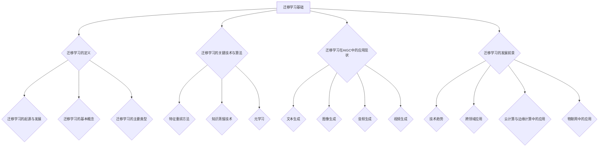

                 

## 迁移学习在AIGC中的应用与前景

### 背景介绍

随着人工智能（AI）技术的迅猛发展，生成式AI（Generative AI）逐渐成为研究热点。生成式AI，特别是自适应生成内容（Adaptive Generative Content，简称AIGC），已经成为数字内容创作的重要驱动力。AIGC通过模拟人类创造过程，能够生成各种形式的内容，如文本、图像、音频和视频。而迁移学习（Transfer Learning）作为一种重要的机器学习技术，正日益成为AIGC领域的关键组成部分。

迁移学习的核心思想是利用在特定任务上预训练的模型，将其知识迁移到新的任务上，从而提高新任务的性能。这一方法在资源有限的情况下，如小样本学习、数据不均衡和跨领域任务中，展现出了巨大的优势。在AIGC领域，迁移学习通过将预训练模型的知识迁移到内容生成任务中，能够显著提高内容生成的质量和效率。

本文旨在探讨迁移学习在AIGC中的应用与前景。首先，我们将介绍迁移学习的基本概念和原理，包括其定义、起源和发展。接着，我们将详细分析迁移学习的关键技术和算法，并探讨其在AIGC中的具体应用。此外，我们还将讨论迁移学习在AIGC中面临的挑战和问题，并展望其未来的发展方向。通过本文的探讨，读者将能够全面了解迁移学习在AIGC中的重要作用及其广阔的应用前景。

### 文章关键词

- 迁移学习
- 生成式AI
- AIGC
- 关键技术
- 应用场景
- 挑战与前景

### 文章摘要

本文深入探讨了迁移学习在自适应生成内容（AIGC）中的应用与前景。首先，我们介绍了迁移学习的基本概念和原理，包括其定义、起源和发展。接着，我们详细分析了迁移学习的关键技术和算法，如特征重排、知识蒸馏和元学习。然后，我们讨论了迁移学习在文本生成、图像生成、音频生成、视频生成等多个AIGC应用领域的具体实践。此外，我们还探讨了迁移学习在AIGC中面临的挑战和问题，如数据不均衡、可解释性和实时性。最后，我们展望了迁移学习在AIGC中的未来发展，包括技术趋势、跨领域应用、云计算与边缘计算中的融合应用以及物联网中的应用。通过本文的研究，读者将能够全面了解迁移学习在AIGC中的关键作用及其广阔的应用前景。

## 迁移学习基础

### 迁移学习的定义与原理

迁移学习（Transfer Learning）是一种利用已训练好的模型或算法来解决新问题的方法。其核心思想是将一个任务（源任务）上的知识迁移到另一个相关任务（目标任务）上，以提升目标任务的性能。这一概念起源于人类学习过程，人类在学习新知识时，往往能够利用已有的知识和经验，从而更高效地掌握新技能。

在机器学习领域，迁移学习被广泛应用于解决数据稀缺、数据不均衡和跨领域任务等问题。具体来说，迁移学习的基本原理包括以下几点：

1. **预训练模型**：首先，在大量的通用数据集上对模型进行预训练，使其获得一定的泛化能力。这个阶段的主要目的是让模型学会提取通用特征，这些特征在不同任务中具有一定的通用性。

2. **特征提取**：在预训练过程中，模型学会了从数据中提取有用的特征。这些特征可以用来描述数据的本质属性，如文本的情感倾向、图像的物体分类等。

3. **微调**：将预训练模型应用于具体的新任务时，通常需要对模型进行微调。这一过程涉及调整模型中的一些参数，使其能够适应新的任务需求。微调过程通常在较小的新数据集上进行，因为新的数据集往往不足以重新训练整个模型。

4. **性能提升**：通过迁移学习，新任务的性能往往能够显著提升。这是因为预训练模型已经学到了一些通用的知识，这些知识在新任务中同样适用。

### 迁移学习的起源与发展

迁移学习这一概念最早可以追溯到20世纪50年代。当时，心理学家Noam Chomsky提出了“普遍语法”（Universal Grammar）理论，认为人类大脑天生具备学习语言的能力，这一理论为迁移学习提供了理论基础。

进入机器学习领域后，迁移学习的研究开始于20世纪80年代。早期的迁移学习方法主要依赖于手工设计的特征和规则，如基于规则的分类器和支持向量机（SVM）等。这些方法虽然在一定程度上提高了新任务的性能，但仍然存在许多局限性。

随着深度学习的兴起，迁移学习得到了新的发展。深度学习模型，特别是卷积神经网络（CNN）和循环神经网络（RNN），通过在大量数据上预训练，能够提取出高度抽象的特征表示。这一特点使得深度学习模型在迁移学习中的应用变得广泛。例如，预训练的图像分类模型可以在多种视觉任务中取得优异的性能，如物体检测、图像分割和图像生成等。

近年来，迁移学习在自然语言处理（NLP）和语音识别等领域也取得了显著进展。预训练的语言模型，如GPT、BERT和T5，通过在大量文本数据上预训练，能够生成高质量的自然语言文本，广泛应用于文本生成、机器翻译和问答系统等任务。

### 迁移学习的基本概念

为了更好地理解迁移学习，我们首先需要明确几个基本概念：

1. **源任务**（Source Task）：源任务是已经完成训练，并且模型已经学到了一定的知识和特征的任务。源任务通常在大量的通用数据集上进行训练，以获得较好的泛化能力。

2. **目标任务**（Target Task）：目标任务是希望利用迁移学习方法来解决的问题。目标任务的数据集可能较小，或者与源任务的数据集有较大差异。

3. **迁移效果**（Transfer Effect）：迁移效果是指通过迁移学习，目标任务性能相对于直接在目标数据集上重新训练模型所获得的提升。迁移效果通常通过实验比较来评估。

4. **迁移策略**（Transfer Strategy）：迁移策略是指如何将源任务的知识迁移到目标任务的具体方法。常见的迁移策略包括特征重排、知识蒸馏和元学习等。

### 迁移学习的主要类型

根据迁移学习的方法和策略，可以将迁移学习分为以下几种主要类型：

1. **特征迁移**（Feature Transfer）：特征迁移是最常见的迁移学习类型，其核心思想是将源任务的预训练模型中的特征提取器（Feature Extractor）直接应用于目标任务。特征提取器通常是一个多层神经网络，通过在源任务上预训练，能够提取出高度抽象的特征表示。这些特征在新任务中同样有效，因此可以用于提升新任务的性能。

2. **模型迁移**（Model Transfer）：模型迁移是指直接迁移整个预训练模型到新任务上。这种方法在深度学习领域尤为常见，因为深度学习模型具有强大的特征提取能力。模型迁移通常涉及对模型的权重进行微调，以适应新的任务需求。

3. **知识迁移**（Knowledge Transfer）：知识迁移是通过迁移模型中的中间层或隐层表示来实现。这种方法认为，模型中的中间层或隐层表示了抽象的、通用的知识。通过迁移这些知识，可以在新任务中实现性能的提升。

4. **元学习**（Meta-Learning）：元学习是一种通过学习如何学习来提高模型迁移能力的方法。元学习模型通过在多个任务上进行训练，学会快速适应新任务。这种方法在处理小样本学习和跨领域任务时具有显著优势。

5. **迁移学习框架**（Transfer Learning Framework）：迁移学习框架是指一种系统化的方法，用于设计、实现和评估迁移学习系统。常见的迁移学习框架包括基于模型迁移的框架、基于特征迁移的框架和基于知识迁移的框架等。

通过以上对迁移学习基础概念的介绍，我们可以看到，迁移学习在理论和实践中都具有重要的应用价值。接下来，我们将进一步探讨迁移学习的关键技术和算法，以及它们在AIGC中的应用。

### 迁移学习的关键技术与算法

迁移学习作为一种有效的机器学习技术，其成功应用离不开一系列关键技术和算法的支持。以下是对几种主要迁移学习技术的详细介绍，包括特征重排方法、知识蒸馏技术和元学习在迁移学习中的应用。

#### 特征重排方法

特征重排方法是一种通过调整模型输入特征的权重来提高迁移效果的技术。其核心思想是，将源任务上的预训练模型中提取的特征进行重排，使其更适应目标任务的特性。这种方法主要通过以下步骤实现：

1. **特征提取**：首先，在源任务上使用预训练模型提取输入数据的特征。这些特征通常是一个高维向量，包含了大量信息。

2. **特征选择**：接下来，通过对特征进行选择或调整，使其更符合目标任务的特性。这一步骤可以通过多种方法实现，如基于统计学的方法（如相关系数分析）和基于机器学习的方法（如线性回归）。

3. **特征重排**：然后，根据特征选择的结果，对特征进行重排。重排后的特征可以更好地反映目标任务的数据结构，从而提高迁移效果。

4. **模型训练**：最后，使用重排后的特征对目标任务模型进行训练。这一过程通常涉及对模型参数的微调，以使模型能够更好地适应新的特征表示。

特征重排方法在处理数据不均衡和跨领域任务时表现出色。例如，在图像分类任务中，可以通过对图像特征进行重排，使其更适应新的分类任务，从而提高分类准确率。

#### 知识蒸馏技术

知识蒸馏技术是一种通过将复杂模型的知识迁移到更简单的模型中的方法。其核心思想是，将一个大型、复杂的预训练模型（教师模型）的知识压缩并转移到一个小型、高效的模型（学生模型）中。这种方法主要通过以下步骤实现：

1. **预训练教师模型**：首先，在大量的数据集上预训练一个大型、复杂的模型，使其具有较好的泛化能力。

2. **生成软标签**：然后，使用教师模型对输入数据进行预测，并生成软标签（Soft Labels）。软标签是一个概率分布，表示教师模型对每个类别的预测置信度。

3. **训练学生模型**：使用教师模型的软标签来训练学生模型。学生模型通常是一个小型、高效的模型，其结构较为简单，但具有较好的迁移能力。

4. **评估与优化**：最后，评估学生模型的性能，并根据评估结果对模型进行优化。这一过程可能需要多次迭代，以达到最佳迁移效果。

知识蒸馏技术在处理小样本学习和跨领域任务时具有显著优势。例如，在自然语言处理任务中，可以通过知识蒸馏技术将大型预训练的语言模型的知识迁移到小型模型中，从而实现高效的内容生成。

#### 元学习在迁移学习中的应用

元学习（Meta-Learning）是一种通过学习如何学习来提高模型迁移能力的方法。其核心思想是，通过在多个任务上进行训练，模型能够学会快速适应新任务。元学习在迁移学习中的应用主要体现在以下几个方面：

1. **任务适应**：元学习模型通过在多个任务上进行训练，学会对新任务进行快速适应。这种能力使得元学习模型在处理小样本学习和跨领域任务时表现出色。

2. **模型快速调整**：元学习模型能够通过少量的训练样本，快速调整其参数，使其在新任务上达到最佳性能。这种方法在处理实时性要求较高的任务时具有重要意义。

3. **迁移能力提升**：元学习模型通过在多个任务上的训练，能够积累丰富的迁移经验，从而提高其在新任务上的迁移能力。

4. **泛化能力增强**：元学习模型不仅能够适应新任务，还能够增强其泛化能力，从而在新的未知任务上也能取得较好的性能。

元学习在迁移学习中的应用广泛，如自适应控制、图像分类和自然语言处理等。例如，在图像分类任务中，通过元学习，模型可以快速适应新的数据分布，从而提高分类准确率。

综上所述，特征重排方法、知识蒸馏技术和元学习是迁移学习中的关键技术和算法。这些技术为迁移学习提供了丰富的工具和方法，使其在AIGC领域和其他应用场景中发挥了重要作用。在接下来的部分，我们将进一步探讨迁移学习在AIGC中的具体应用。

### 迁移学习在AIGC中的应用现状

自适应生成内容（AIGC）是生成式AI的一个重要分支，旨在通过模拟人类的创造过程，生成具有高度多样性和创新性的内容。AIGC涉及多个领域，包括文本生成、图像生成、音频生成、视频生成等。而迁移学习作为一项关键技术，在这些领域展现出了强大的应用潜力和显著的效果。

#### 迁移学习在文本生成中的应用

文本生成是AIGC领域的一个重要应用，通过迁移学习，可以显著提高文本生成的质量和效率。以下是一些具体的案例和应用场景：

1. **自然语言生成**：预训练的语言模型，如GPT、BERT和T5，在大量文本数据上进行预训练，然后迁移到具体的文本生成任务中。例如，GPT-3可以在多种自然语言生成任务中实现高质量的文本生成，包括问答系统、对话生成和故事创作等。

2. **摘要生成**：迁移学习技术可以将大型预训练模型的知识迁移到摘要生成任务中，从而提高摘要的质量和长度控制。例如，使用预训练的T5模型，可以生成符合特定长度的摘要，并在多个数据集上取得显著的性能提升。

3. **机器翻译**：迁移学习在机器翻译中的应用也取得了显著进展。通过将预训练的多语言模型迁移到具体的机器翻译任务中，可以实现高精度的翻译效果。例如，基于BERT的多语言模型，可以在多种语言对之间实现高质量的机器翻译。

4. **文本分类**：迁移学习在文本分类任务中也表现出色。通过使用预训练的文本分类模型，可以快速适应新的分类任务，并在数据量较小的情况下取得较好的分类效果。例如，使用预训练的DistilBERT模型，可以快速迁移到新闻分类、情感分析等任务中。

#### 迁移学习在图像生成中的应用

图像生成是AIGC领域的另一个重要应用，迁移学习在图像生成任务中同样发挥了重要作用。以下是一些具体的案例和应用场景：

1. **图像风格迁移**：通过迁移学习，可以将一种图像的风格迁移到另一幅图像上，从而生成具有特定风格的图像。例如，使用预训练的GAN模型，可以将一张普通照片的风格迁移到著名的艺术作品风格上，如梵高的《星夜》。

2. **超分辨率图像生成**：迁移学习技术可以显著提高图像的分辨率。通过将高分辨率图像的细节信息迁移到低分辨率图像中，可以实现高质量的图像生成。例如，基于CNN的迁移学习模型，可以在低分辨率图像上生成高分辨率图像，广泛应用于图像编辑和图像增强任务。

3. **图像到图像的转换**：通过迁移学习，可以将一种图像类型转换成另一种图像类型。例如，使用预训练的模型，可以将黑白图像转换为彩色图像，或将普通图像转换为艺术作品。

4. **图像生成对抗网络（GAN）**：GAN是一种基于迁移学习的图像生成模型，通过生成器和判别器的对抗训练，可以生成高质量、多样化的图像。GAN在图像生成任务中取得了显著成果，如人脸生成、图像修复和图像合成等。

#### 迁移学习在音频生成中的应用

音频生成是AIGC领域的一个新兴应用，迁移学习在音频生成任务中也展现出了强大的潜力。以下是一些具体的案例和应用场景：

1. **音频风格迁移**：通过迁移学习，可以将一种音频的风格迁移到另一种音频上，从而生成具有特定风格的音频。例如，可以将一个歌手的声音风格迁移到另一首歌曲上，实现风格一致的音乐创作。

2. **音频生成对抗网络（WaveGAN）**：WaveGAN是一种基于迁移学习的音频生成模型，通过生成器和判别器的对抗训练，可以生成高质量、多样化的音频。WaveGAN在音频生成任务中取得了显著成果，如音乐生成、声音合成和音频修复等。

3. **音频转换**：通过迁移学习，可以将一种音频类型转换为另一种音频类型。例如，可以将语音转换为乐器演奏的音乐，或将一段音频转换为另一段具有不同情绪的音频。

#### 迁移学习在视频生成中的应用

视频生成是AIGC领域的一个具有挑战性的任务，迁移学习在视频生成任务中也展现出了强大的应用前景。以下是一些具体的案例和应用场景：

1. **视频风格迁移**：通过迁移学习，可以将一种视频的风格迁移到另一种视频上，从而生成具有特定风格的视频。例如，可以将一个视频的风格迁移到另一个著名电影风格上，实现风格一致的视频创作。

2. **视频增强**：通过迁移学习，可以显著提高视频的画质和清晰度。例如，使用预训练的模型，可以将低分辨率视频转换为高分辨率视频，或增强视频中的细节信息。

3. **视频生成对抗网络（VideoGAN）**：VideoGAN是一种基于迁移学习的视频生成模型，通过生成器和判别器的对抗训练，可以生成高质量、多样化的视频。VideoGAN在视频生成任务中取得了显著成果，如视频修复、视频增强和视频合成等。

综上所述，迁移学习在AIGC领域展现出了广泛的应用前景和显著的应用效果。通过迁移学习，可以显著提高文本生成、图像生成、音频生成和视频生成等任务的质量和效率，为AIGC的发展提供了强大的技术支持。在未来，随着迁移学习技术的进一步发展和完善，其在AIGC中的应用将更加广泛和深入。

### 迁移学习的发展前景

随着人工智能技术的不断进步，迁移学习在多个领域展现出了巨大的应用潜力和发展前景。本文将从技术趋势、跨领域应用、云计算与边缘计算融合应用以及物联网中的应用等方面，探讨迁移学习的发展前景。

#### 技术趋势

1. **深度学习与迁移学习的结合**：深度学习技术的快速发展为迁移学习提供了强大的支持。深度学习模型，如卷积神经网络（CNN）和循环神经网络（RNN），具有强大的特征提取能力，使得迁移学习在图像处理、自然语言处理等领域取得了显著成果。未来，随着深度学习技术的进一步发展，迁移学习将在更多复杂任务中发挥关键作用。

2. **小样本学习与迁移学习的融合**：在小样本学习场景中，迁移学习能够利用预训练模型的知识，实现高效的任务学习。未来，随着小样本学习技术的进步，迁移学习在小样本学习中的应用将更加广泛。例如，在医疗诊断、金融风控等需要处理小样本数据的领域，迁移学习有望成为重要的技术手段。

3. **自适应迁移学习**：自适应迁移学习是一种通过学习如何学习来提高迁移效果的方法。这种方法能够根据新任务的特点，动态调整迁移策略，从而实现更好的迁移效果。未来，随着自适应迁移学习技术的进步，将有望实现更加智能和高效的迁移学习系统。

#### 跨领域应用

1. **跨领域迁移学习的挑战与机遇**：跨领域迁移学习是一种将一种领域中的知识迁移到另一种领域中的方法。尽管跨领域迁移学习面临数据不均衡、领域差异和任务多样性等挑战，但其应用前景非常广阔。例如，在医疗领域，可以将图像识别技术在医疗影像诊断中应用；在金融领域，可以将自然语言处理技术应用于文本分析。未来，随着跨领域迁移学习技术的进步，将有望实现更多领域的融合和协同发展。

2. **跨领域迁移学习的研究进展**：近年来，跨领域迁移学习取得了显著的研究进展。例如，基于对抗生成网络（GAN）的跨领域迁移学习模型，通过生成对抗过程，能够实现不同领域数据的高效迁移。此外，基于元学习的跨领域迁移学习模型，通过在多个领域上进行训练，能够快速适应新领域。这些研究进展为跨领域迁移学习提供了新的思路和方向。

3. **跨领域迁移学习的应用场景**：跨领域迁移学习在多个应用场景中具有广泛的应用前景。例如，在自动驾驶领域，可以将图像识别技术应用于车辆检测和行人识别；在智能家居领域，可以将自然语言处理技术应用于语音识别和智能对话。未来，随着跨领域迁移学习技术的进一步发展，将有望实现更多跨领域的应用和创新。

#### 云计算与边缘计算融合应用

1. **迁移学习在云计算中的应用**：云计算提供了强大的计算资源和数据存储能力，为迁移学习提供了良好的运行环境。在云计算平台上，迁移学习模型可以高效地处理大规模数据，并实现快速部署和扩展。例如，在图像识别、自然语言处理和推荐系统等领域，云计算平台已经成为迁移学习模型的主要运行环境。

2. **迁移学习在边缘计算中的应用**：边缘计算是一种将计算任务分散到边缘设备（如智能手机、物联网设备等）中的方法。迁移学习在边缘计算中的应用，可以显著提高边缘设备的智能化水平。例如，在智能安防、智能医疗和智能交通等领域，迁移学习模型可以在边缘设备上实现高效的任务处理，从而提高系统的实时性和响应速度。

3. **云计算与边缘计算的融合应用**：随着云计算和边缘计算技术的不断发展，两者之间的融合应用已成为趋势。在融合应用场景中，迁移学习模型可以在云端进行预训练，然后在边缘设备上进行微调和部署。这种融合应用方式，可以充分发挥云计算和边缘计算的优势，实现高效、智能的计算和服务。

#### 物联网中的应用

1. **物联网中的迁移学习**：物联网（IoT）是一个由大量设备互联形成的网络，迁移学习在物联网中的应用，可以显著提高设备的智能化和协同能力。例如，在智能安防系统中，可以将预训练的图像识别模型迁移到摄像头设备上，实现实时的人脸识别和目标检测。

2. **物联网迁移学习的研究进展**：近年来，物联网迁移学习取得了显著的研究进展。例如，基于迁移学习的物联网设备协同算法，可以实现多设备之间的数据共享和协同处理；基于迁移学习的物联网安全模型，可以增强物联网设备的安全性和隐私保护。

3. **物联网迁移学习的应用场景**：物联网迁移学习在多个应用场景中具有广泛的应用前景。例如，在智慧城市中，可以将迁移学习应用于交通流量预测、环境监测和智能城市管理；在工业物联网中，可以将迁移学习应用于设备故障检测、生产优化和供应链管理。

总之，迁移学习作为一种关键的人工智能技术，在多个领域展现出了广阔的应用前景。随着技术的不断进步，迁移学习将在更多领域发挥重要作用，推动人工智能技术的进一步发展。未来，我们将继续关注迁移学习技术的最新进展和应用场景，探索其在更多领域中的潜力。

## 迁移学习在文本生成中的应用

文本生成是自适应生成内容（AIGC）的一个重要组成部分，迁移学习在这一领域中展现出了显著的应用效果。以下我们将详细探讨迁移学习在文本生成中的应用方法、案例研究和面临的挑战。

### 文本生成中的迁移学习方法

在文本生成任务中，迁移学习方法主要包括以下几个步骤：

1. **预训练**：首先，在大量的文本数据集上对模型进行预训练，以提取通用的语言特征。常见的预训练模型包括GPT、BERT和T5等。

2. **特征提取**：预训练模型会生成一个高维的词向量表示，这些词向量包含了文本的语义信息。这些特征表示可以用于后续的任务。

3. **微调**：在获取了通用的语言特征后，将模型迁移到具体的文本生成任务上，通过在目标数据集上微调模型，使其能够生成符合任务需求的文本。

4. **生成**：通过微调后的模型，生成目标文本。生成过程通常是一个序列到序列的预测过程，模型根据输入的文本序列，逐个生成下一个词或字符。

### 迁移学习在文本生成中的案例研究

以下是一些迁移学习在文本生成中的经典案例研究：

1. **GPT-3的迁移学习**：GPT-3是OpenAI开发的一个大型预训练语言模型，通过在大量文本数据上预训练，GPT-3具有强大的文本生成能力。GPT-3可以迁移到多种文本生成任务中，如问答系统、对话生成和故事创作等。例如，在一个问答系统中，GPT-3可以基于问题的上下文生成高质量的答案。

2. **BERT的迁移学习**：BERT（Bidirectional Encoder Representations from Transformers）是谷歌开发的预训练语言模型，通过双向编码器来提取文本的语义特征。BERT可以迁移到多种文本生成任务中，如文本摘要、翻译和情感分析等。例如，在一个文本摘要任务中，BERT可以生成符合长度的摘要，同时保持原文的主要信息。

3. **T5的迁移学习**：T5（Text-to-Text Transfer Transformer）是一个统一的文本处理模型，通过将输入文本转换为输出文本，T5可以处理多种文本任务。T5通过在大量文本数据上预训练，然后迁移到具体的文本生成任务中，如文本分类、问答和翻译等。例如，在一个机器翻译任务中，T5可以将一种语言的文本翻译成另一种语言的文本。

### 迁移学习在文本生成中的应用挑战

尽管迁移学习在文本生成中取得了显著成果，但仍面临一些挑战：

1. **数据不均衡**：在文本生成任务中，不同类别的文本数据量往往不均衡。这种数据不均衡可能导致模型在生成某些特定类别的文本时表现不佳。

2. **上下文理解**：文本生成需要模型具备良好的上下文理解能力，以便生成连贯、自然的文本。然而，预训练模型在上下文理解方面可能存在不足，特别是在处理长文本或复杂语境时。

3. **生成质量**：尽管迁移学习能够提高文本生成的质量，但生成文本的多样性和创新性仍是一个挑战。模型可能生成重复、低质量的文本，影响用户体验。

4. **可解释性**：文本生成的可解释性是一个重要问题，用户需要了解生成文本的来源和过程。然而，预训练模型通常是一个“黑盒子”，其内部机制不易解释。

5. **实时性**：在实时性要求较高的应用场景中，如实时对话系统和实时新闻生成等，迁移学习模型的响应速度是一个重要挑战。模型在生成文本时可能需要较长的时间，影响用户体验。

为了解决上述挑战，研究者们正在探索多种方法，如数据增强、上下文生成模型、生成对抗网络（GAN）和知识融合等。通过不断的研究和创新，迁移学习在文本生成中的应用前景将更加广阔。

## 迁移学习在图像生成中的应用

图像生成是自适应生成内容（AIGC）领域的核心应用之一，迁移学习在这一领域中展现出了显著的效果。以下我们将详细探讨迁移学习在图像生成中的应用方法、案例研究和面临的挑战。

### 图像生成中的迁移学习方法

在图像生成任务中，迁移学习方法主要包括以下几个步骤：

1. **预训练**：首先，在大量的图像数据集上对模型进行预训练，以提取通用的视觉特征。常见的预训练模型包括卷积神经网络（CNN）和生成对抗网络（GAN）。

2. **特征提取**：预训练模型会生成一个高维的图像特征表示，这些特征表示包含了图像的视觉信息。这些特征表示可以用于后续的任务。

3. **微调**：在获取了通用的图像特征后，将模型迁移到具体的图像生成任务上，通过在目标数据集上微调模型，使其能够生成符合任务需求的图像。

4. **生成**：通过微调后的模型，生成目标图像。生成过程通常是一个图像到图像的映射过程，模型根据输入的图像特征，生成新的图像。

### 迁移学习在图像生成中的案例研究

以下是一些迁移学习在图像生成中的经典案例研究：

1. **GAN的迁移学习**：生成对抗网络（GAN）是一种基于迁移学习的图像生成模型，由生成器和判别器两个神经网络组成。生成器负责生成新的图像，判别器负责判断生成图像的真实性。GAN可以通过在大量的图像数据上预训练，然后迁移到具体的图像生成任务中。例如，在图像去噪任务中，GAN可以生成高质量的噪声图像；在图像修复任务中，GAN可以修复损坏的图像；在图像风格迁移任务中，GAN可以将一种图像的风格迁移到另一幅图像上。

2. **CNN的迁移学习**：卷积神经网络（CNN）是一种常用的图像生成模型，通过多层卷积操作，CNN可以提取图像的层次特征。CNN可以通过在大量的图像数据上预训练，然后迁移到具体的图像生成任务中。例如，在图像超分辨率任务中，CNN可以生成高分辨率的图像；在图像分类任务中，CNN可以生成具有特定分类标签的图像；在图像到图像的转换任务中，CNN可以将一种图像类型转换为另一种图像类型。

3. **CycleGAN的迁移学习**：CycleGAN（Cycle-Consistent Adversarial Network）是一种基于迁移学习的图像转换模型，通过循环一致性损失，CycleGAN可以将一种图像风格转换为另一种图像风格。CycleGAN可以通过在大量的图像数据上预训练，然后迁移到具体的图像生成任务中。例如，在图像风格迁移任务中，CycleGAN可以将普通照片转换为艺术作品；在图像去噪任务中，CycleGAN可以去除图像中的噪声。

### 迁移学习在图像生成中的应用挑战

尽管迁移学习在图像生成中取得了显著成果，但仍面临一些挑战：

1. **数据不均衡**：在图像生成任务中，不同类别的图像数据量往往不均衡。这种数据不均衡可能导致模型在生成某些特定类别的图像时表现不佳。

2. **图像质量**：图像生成的质量是一个重要问题，模型需要生成高质量、真实的图像。然而，预训练模型在图像质量方面可能存在不足，特别是在处理复杂场景或细节时。

3. **生成多样性**：图像生成的多样性也是一个挑战，模型需要生成具有多样性和创新性的图像。然而，预训练模型可能生成重复、低质量的图像，影响用户体验。

4. **训练时间**：图像生成任务通常需要大量的训练时间，尤其是在使用大型预训练模型时。这可能导致训练过程耗时较长，影响模型的部署和应用。

5. **实时性**：在实时性要求较高的应用场景中，如实时图像生成和交互式图像生成等，迁移学习模型的响应速度是一个重要挑战。模型在生成图像时可能需要较长的时间，影响用户体验。

为了解决上述挑战，研究者们正在探索多种方法，如数据增强、生成对抗网络（GAN）的改进、多层次特征提取等。通过不断的研究和创新，迁移学习在图像生成中的应用前景将更加广阔。

## 迁移学习在音频生成中的应用

音频生成是自适应生成内容（AIGC）领域中的一个重要分支，迁移学习在音频生成任务中展现出了显著的应用效果。以下我们将详细探讨迁移学习在音频生成中的应用方法、案例研究和面临的挑战。

### 音频生成中的迁移学习方法

在音频生成任务中，迁移学习方法主要包括以下几个步骤：

1. **预训练**：首先，在大量的音频数据集上对模型进行预训练，以提取通用的音频特征。常见的预训练模型包括波面生成对抗网络（WaveGAN）和自注意力生成器（Autoregressive Model）。

2. **特征提取**：预训练模型会生成一个高维的音频特征表示，这些特征表示包含了音频的时频信息。这些特征表示可以用于后续的任务。

3. **微调**：在获取了通用的音频特征后，将模型迁移到具体的音频生成任务上，通过在目标数据集上微调模型，使其能够生成符合任务需求的音频。

4. **生成**：通过微调后的模型，生成目标音频。生成过程通常是一个序列到序列的预测过程，模型根据输入的音频特征，逐个生成下一个音频帧。

### 迁移学习在音频生成中的案例研究

以下是一些迁移学习在音频生成中的经典案例研究：

1. **WaveGAN的迁移学习**：WaveGAN是一种基于迁移学习的音频生成模型，由生成器和判别器两个神经网络组成。生成器负责生成新的音频，判别器负责判断生成音频的真实性。WaveGAN可以通过在大量的音频数据上预训练，然后迁移到具体的音频生成任务中。例如，在音乐生成任务中，WaveGAN可以生成各种风格的音乐；在语音生成任务中，WaveGAN可以生成不同说话人的语音；在声音效果生成任务中，WaveGAN可以生成各种声音效果，如回声、混响等。

2. **自注意力生成器的迁移学习**：自注意力生成器（Autoregressive Model）是一种基于迁移学习的音频生成模型，通过自注意力机制，模型可以捕捉到音频序列中的长期依赖关系。自注意力生成器可以通过在大量的音频数据上预训练，然后迁移到具体的音频生成任务中。例如，在语音合成任务中，自注意力生成器可以生成自然流畅的语音；在音乐生成任务中，自注意力生成器可以生成具有多样性和创新性的音乐。

3. **GAN-Harmony的迁移学习**：GAN-Harmony是一种基于迁移学习的音频生成模型，结合了生成对抗网络（GAN）和音乐生成模型。GAN-Harmony可以通过在大量的音乐数据上预训练，然后迁移到具体的音乐生成任务中。例如，在旋律生成任务中，GAN-Harmony可以生成具有多样性的旋律；在和弦生成任务中，GAN-Harmony可以生成符合音乐规则的和弦进行。

### 迁移学习在音频生成中的应用挑战

尽管迁移学习在音频生成中取得了显著成果，但仍面临一些挑战：

1. **数据不均衡**：在音频生成任务中，不同类型的音频数据量往往不均衡。这种数据不均衡可能导致模型在生成某些特定类型的音频时表现不佳。

2. **音频质量**：音频生成的质量是一个重要问题，模型需要生成高质量、真实的音频。然而，预训练模型在音频质量方面可能存在不足，特别是在处理复杂音频或细节时。

3. **生成多样性**：音频生成的多样性也是一个挑战，模型需要生成具有多样性和创新性的音频。然而，预训练模型可能生成重复、低质量的音频，影响用户体验。

4. **训练时间**：音频生成任务通常需要大量的训练时间，尤其是在使用大型预训练模型时。这可能导致训练过程耗时较长，影响模型的部署和应用。

5. **实时性**：在实时性要求较高的应用场景中，如实时音频生成和交互式音频生成等，迁移学习模型的响应速度是一个重要挑战。模型在生成音频时可能需要较长的时间，影响用户体验。

为了解决上述挑战，研究者们正在探索多种方法，如数据增强、生成对抗网络（GAN）的改进、多层次特征提取等。通过不断的研究和创新，迁移学习在音频生成中的应用前景将更加广阔。

## 迁移学习在视频生成中的应用

视频生成是自适应生成内容（AIGC）领域中的一个重要组成部分，迁移学习在这一领域中展现出了显著的应用效果。以下我们将详细探讨迁移学习在视频生成中的应用方法、案例研究和面临的挑战。

### 视频生成中的迁移学习方法

在视频生成任务中，迁移学习方法主要包括以下几个步骤：

1. **预训练**：首先，在大量的视频数据集上对模型进行预训练，以提取通用的视觉和时序特征。常见的预训练模型包括卷积神经网络（CNN）和生成对抗网络（GAN）。

2. **特征提取**：预训练模型会生成一个高维的特征表示，这些特征包含了视频的视觉和时序信息。这些特征表示可以用于后续的任务。

3. **微调**：在获取了通用的特征表示后，将模型迁移到具体的视频生成任务上，通过在目标数据集上微调模型，使其能够生成符合任务需求的视频。

4. **生成**：通过微调后的模型，生成目标视频。生成过程通常是一个视频到视频的映射过程，模型根据输入的视频特征，生成新的视频。

### 迁移学习在视频生成中的案例研究

以下是一些迁移学习在视频生成中的经典案例研究：

1. **GAN的迁移学习**：生成对抗网络（GAN）是一种基于迁移学习的视频生成模型，由生成器和判别器两个神经网络组成。生成器负责生成新的视频，判别器负责判断生成视频的真实性。GAN可以通过在大量的视频数据上预训练，然后迁移到具体的视频生成任务中。例如，在视频增强任务中，GAN可以生成更高清晰度的视频；在视频修复任务中，GAN可以修复损坏的视频；在视频风格迁移任务中，GAN可以将一种视频风格迁移到另一种视频风格。

2. **CycleGAN的迁移学习**：CycleGAN（Cycle-Consistent Adversarial Network）是一种基于迁移学习的视频生成模型，通过循环一致性损失，CycleGAN可以将一种视频风格转换为另一种视频风格。CycleGAN可以通过在大量的视频数据上预训练，然后迁移到具体的视频生成任务中。例如，在视频风格转换任务中，CycleGAN可以将普通视频转换为艺术作品；在视频去噪任务中，CycleGAN可以去除视频中的噪声。

3. **VideoGAN的迁移学习**：VideoGAN是一种基于迁移学习的视频生成模型，通过生成器和判别器的对抗训练，VideoGAN可以生成高质量、多样化的视频。VideoGAN在视频生成任务中取得了显著成果，如视频增强、视频修复和视频合成等。

### 迁移学习在视频生成中的应用挑战

尽管迁移学习在视频生成中取得了显著成果，但仍面临一些挑战：

1. **数据不均衡**：在视频生成任务中，不同类别的视频数据量往往不均衡。这种数据不均衡可能导致模型在生成某些特定类别的视频时表现不佳。

2. **视频质量**：视频生成的质量是一个重要问题，模型需要生成高质量、真实的视频。然而，预训练模型在视频质量方面可能存在不足，特别是在处理复杂场景或细节时。

3. **生成多样性**：视频生成的多样性也是一个挑战，模型需要生成具有多样性和创新性的视频。然而，预训练模型可能生成重复、低质量的视频，影响用户体验。

4. **训练时间**：视频生成任务通常需要大量的训练时间，尤其是在使用大型预训练模型时。这可能导致训练过程耗时较长，影响模型的部署和应用。

5. **实时性**：在实时性要求较高的应用场景中，如实时视频生成和交互式视频生成等，迁移学习模型的响应速度是一个重要挑战。模型在生成视频时可能需要较长的时间，影响用户体验。

为了解决上述挑战，研究者们正在探索多种方法，如数据增强、生成对抗网络（GAN）的改进、多层次特征提取等。通过不断的研究和创新，迁移学习在视频生成中的应用前景将更加广阔。

## 迁移学习在虚拟现实与增强现实中的应用

虚拟现实（VR）和增强现实（AR）技术作为下一代计算交互的重要方式，正在不断推动人类与计算机之间的融合。迁移学习作为一种关键的机器学习技术，在VR和AR领域中展现了强大的应用潜力。以下我们将详细探讨迁移学习在虚拟现实与增强现实中的应用方法、案例研究和面临的挑战。

### 虚拟现实与增强现实中的迁移学习方法

在VR和AR领域，迁移学习技术主要用于以下几个方面：

1. **环境建模与渲染**：利用迁移学习，可以在已有的大型虚拟环境模型基础上，快速生成新的虚拟环境。这通常涉及将预训练的模型迁移到目标环境中，并进行微调以适应特定的场景。

2. **物体识别与跟踪**：在AR应用中，需要实时识别和跟踪现实世界中的物体。迁移学习可以将预训练的图像识别模型迁移到AR场景中，用于物体检测和识别。

3. **人机交互**：通过迁移学习，可以优化人机交互模型，使其能够更好地理解用户的动作和手势。例如，使用迁移学习技术，可以将手势识别模型迁移到新的AR设备或VR环境中，提高交互的准确性和响应速度。

4. **智能代理**：在VR游戏中，智能代理需要模拟人类玩家的行为。迁移学习可以帮助代理快速适应新环境，通过迁移预训练的模型知识，使其能够在新场景中快速学习并作出反应。

### 迁移学习在虚拟现实与增强现实中的案例研究

以下是一些迁移学习在虚拟现实与增强现实中的经典案例研究：

1. **Waymo的自动驾驶仿真**：谷歌旗下的Waymo公司利用迁移学习技术，在虚拟环境中进行自动驾驶仿真。通过将自动驾驶模型在现实世界的行驶数据上进行预训练，然后迁移到虚拟环境中，Waymo能够在虚拟环境中进行高效的测试和优化。

2. **Magic Leap的AR应用**：Magic Leap是一家AR技术公司，其产品Magic Leap One集成了先进的AR技术。Magic Leap利用迁移学习技术，将预训练的图像识别和物体跟踪模型迁移到AR设备中，实现了高质量的实时物体识别和跟踪。

3. **Unity的VR游戏开发**：Unity是一家游戏引擎公司，其Unity SDK支持VR游戏开发。Unity利用迁移学习技术，优化了VR游戏中的人物动作和场景渲染，使得开发者能够更快速地构建高质量的VR游戏。

### 迁移学习在虚拟现实与增强现实中的应用挑战

尽管迁移学习在VR和AR领域中展现出了巨大潜力，但仍面临一些挑战：

1. **数据不均衡**：在VR和AR应用中，不同类型的数据量往往不均衡，例如室内环境数据与户外环境数据。这种数据不均衡可能导致模型在特定场景下的性能下降。

2. **实时性能**：VR和AR应用通常要求实时性，迁移学习模型需要在短时间内完成复杂的计算任务。这可能导致模型在性能和实时性之间取得平衡。

3. **可解释性**：在VR和AR应用中，用户对系统的可解释性有较高要求。然而，迁移学习模型通常是一个“黑盒子”，其内部机制不易解释，这可能会影响用户体验。

4. **鲁棒性**：VR和AR应用需要处理各种复杂和动态的环境，迁移学习模型需要具备较强的鲁棒性，以适应不同的场景和变化。

5. **隐私保护**：在VR和AR应用中，用户数据的安全性是一个重要问题。迁移学习模型在处理用户数据时，需要确保隐私保护，防止数据泄露。

为了解决上述挑战，研究者们正在探索多种方法，如数据增强、模型压缩和优化、安全迁移学习等。通过不断的研究和创新，迁移学习在VR和AR领域的应用前景将更加广阔。

## 迁移学习在游戏开发中的应用

迁移学习在游戏开发中的应用已经成为提升游戏体验和开发效率的重要手段。通过迁移学习，开发者可以利用预训练模型的知识，快速构建高质量的游戏内容，从而降低开发成本和时间。以下我们将详细探讨迁移学习在游戏开发中的应用方法、案例研究和面临的挑战。

### 游戏开发中的迁移学习方法

在游戏开发中，迁移学习技术通常应用于以下几个方面：

1. **角色建模与动画**：通过迁移学习，可以将预训练的3D模型和动画模型应用于新的游戏角色。这大大简化了角色建模和动画制作的流程，提高了开发效率。

2. **游戏环境生成**：利用迁移学习，可以在已有的大型游戏环境数据集上进行预训练，然后迁移到目标游戏中，快速生成新的游戏环境。

3. **AI对手**：在游戏AI中，迁移学习可以将预训练的AI模型应用于新的游戏规则和场景中，使得AI对手能够快速适应不同的游戏环境。

4. **用户行为分析**：通过迁移学习，可以分析用户在游戏中的行为模式，从而优化游戏设计，提升用户体验。

### 迁移学习在游戏开发中的案例研究

以下是一些迁移学习在游戏开发中的经典案例研究：

1. **《我的世界》的角色生成**：《我的世界》是一款流行的沙盒游戏，其角色生成采用了迁移学习技术。通过在大量的3D角色数据上进行预训练，游戏开发者可以将这些预训练模型迁移到游戏中，快速生成新的游戏角色，提高了游戏的多样性。

2. **《使命召唤》的AI对手**：《使命召唤》是一款流行的射击游戏，其AI对手采用了迁移学习技术。游戏开发者通过在多个版本的《使命召唤》中预训练AI模型，然后将这些模型迁移到新的版本中，使得AI对手能够快速适应新的游戏规则和场景。

3. **《星际争霸》的地图生成**：《星际争霸》是一款经典的实时战略游戏，其地图生成采用了迁移学习技术。通过在大量的地图数据上进行预训练，游戏开发者可以将这些预训练模型迁移到游戏中，快速生成新的游戏地图。

### 迁移学习在游戏开发中的应用挑战

尽管迁移学习在游戏开发中展现了巨大潜力，但仍面临一些挑战：

1. **数据不均衡**：在游戏开发中，不同类型的游戏数据量往往不均衡。例如，游戏角色和地图的数据量可能远大于AI对手的数据量。这种数据不均衡可能导致模型在特定任务上的性能下降。

2. **模型适应性**：游戏开发者需要确保迁移学习模型能够适应不同的游戏场景和规则。然而，预训练模型可能对特定类型的游戏场景适应性较差，需要额外的微调和优化。

3. **实时性能**：在实时性要求较高的游戏开发中，如多人在线游戏，迁移学习模型需要在短时间内完成复杂的计算任务。这可能导致模型在性能和实时性之间取得平衡。

4. **可解释性**：在游戏开发中，开发者需要理解迁移学习模型的工作原理，以便进行优化和调整。然而，迁移学习模型通常是一个“黑盒子”，其内部机制不易解释。

5. **版权问题**：在游戏开发中，使用迁移学习技术可能涉及到版权问题。例如，如果使用了某个品牌的预训练模型，可能需要获得该品牌的授权。

为了解决上述挑战，研究者们正在探索多种方法，如数据增强、模型压缩和优化、可解释性迁移学习等。通过不断的研究和创新，迁移学习在游戏开发中的应用前景将更加广阔。

## 迁移学习在自然语言处理中的应用

自然语言处理（NLP）是人工智能领域的一个重要分支，其目的是使计算机能够理解、处理和生成人类语言。迁移学习作为NLP中的一种关键技术，通过将预训练模型的知识迁移到新的任务中，显著提高了NLP任务的性能和效率。以下我们将详细探讨迁移学习在自然语言处理中的应用方法、案例研究和面临的挑战。

### 自然语言处理中的迁移学习方法

在自然语言处理任务中，迁移学习方法主要包括以下几个步骤：

1. **预训练**：首先，在大量的文本数据集上对模型进行预训练，以提取通用的语言特征。常见的预训练模型包括GPT、BERT和T5等。

2. **特征提取**：预训练模型会生成一个高维的文本特征表示，这些特征表示包含了文本的语义信息。这些特征表示可以用于后续的任务。

3. **微调**：在获取了通用的语言特征后，将模型迁移到具体的自然语言处理任务上，通过在目标数据集上微调模型，使其能够生成符合任务需求的文本。

4. **生成**：通过微调后的模型，生成目标文本。生成过程通常是一个序列到序列的预测过程，模型根据输入的文本特征，逐个生成下一个词或字符。

### 迁移学习在自然语言处理中的案例研究

以下是一些迁移学习在自然语言处理中的经典案例研究：

1. **GPT-3的迁移学习**：GPT-3是OpenAI开发的一个大型预训练语言模型，通过在大量文本数据上预训练，GPT-3具有强大的文本生成能力。GPT-3可以迁移到多种自然语言处理任务中，如问答系统、对话生成和故事创作等。例如，在一个问答系统中，GPT-3可以基于问题的上下文生成高质量的答案。

2. **BERT的迁移学习**：BERT（Bidirectional Encoder Representations from Transformers）是谷歌开发的预训练语言模型，通过双向编码器来提取文本的语义特征。BERT可以迁移到多种自然语言处理任务中，如文本摘要、翻译和情感分析等。例如，在一个文本摘要任务中，BERT可以生成符合长度的摘要，同时保持原文的主要信息。

3. **T5的迁移学习**：T5（Text-to-Text Transfer Transformer）是一个统一的文本处理模型，通过将输入文本转换为输出文本，T5可以处理多种文本任务。T5通过在大量文本数据上预训练，然后迁移到具体的自然语言处理任务中，如文本分类、问答和翻译等。例如，在一个机器翻译任务中，T5可以将一种语言的文本翻译成另一种语言的文本。

### 迁移学习在自然语言处理中的应用挑战

尽管迁移学习在自然语言处理中取得了显著成果，但仍面临一些挑战：

1. **数据不均衡**：在自然语言处理任务中，不同类别的文本数据量往往不均衡。这种数据不均衡可能导致模型在生成某些特定类别的文本时表现不佳。

2. **上下文理解**：自然语言处理需要模型具备良好的上下文理解能力，以便生成连贯、自然的文本。然而，预训练模型在上下文理解方面可能存在不足，特别是在处理长文本或复杂语境时。

3. **生成质量**：尽管迁移学习能够提高文本生成的质量，但生成文本的多样性和创新性仍是一个挑战。模型可能生成重复、低质量的文本，影响用户体验。

4. **可解释性**：自然语言处理的可解释性是一个重要问题，用户需要了解生成文本的来源和过程。然而，预训练模型通常是一个“黑盒子”，其内部机制不易解释。

5. **实时性**：在实时性要求较高的应用场景中，如实时对话系统和实时新闻生成等，迁移学习模型的响应速度是一个重要挑战。模型在生成文本时可能需要较长的时间，影响用户体验。

为了解决上述挑战，研究者们正在探索多种方法，如数据增强、上下文生成模型、生成对抗网络（GAN）和知识融合等。通过不断的研究和创新，迁移学习在自然语言处理中的应用前景将更加广阔。

## 迁移学习在计算机视觉中的应用

计算机视觉是人工智能的一个重要分支，其主要目标是使计算机能够理解并解释图像和视频中的内容。迁移学习作为一种有效的机器学习技术，在计算机视觉领域中发挥了重要作用。以下我们将详细探讨迁移学习在计算机视觉中的应用方法、案例研究和面临的挑战。

### 计算机视觉中的迁移学习方法

在计算机视觉任务中，迁移学习方法主要包括以下几个步骤：

1. **预训练**：首先，在大量的图像数据集上对模型进行预训练，以提取通用的视觉特征。常见的预训练模型包括卷积神经网络（CNN）和生成对抗网络（GAN）。

2. **特征提取**：预训练模型会生成一个高维的图像特征表示，这些特征表示包含了图像的视觉信息。这些特征表示可以用于后续的任务。

3. **微调**：在获取了通用的图像特征后，将模型迁移到具体的计算机视觉任务上，通过在目标数据集上微调模型，使其能够生成符合任务需求的图像。

4. **生成**：通过微调后的模型，生成目标图像。生成过程通常是一个图像到图像的映射过程，模型根据输入的图像特征，生成新的图像。

### 迁移学习在计算机视觉中的案例研究

以下是一些迁移学习在计算机视觉中的经典案例研究：

1. **ImageNet的迁移学习**：ImageNet是一个大规模的图像识别数据集，其预训练模型在计算机视觉领域中被广泛应用。通过将ImageNet的预训练模型迁移到新的图像识别任务中，可以显著提高识别准确率。例如，在物体检测任务中，预训练的CNN模型可以快速适应新的数据集，提高检测性能。

2. **COCO的迁移学习**：COCO（Common Objects in Context）是一个大规模的图像识别数据集，其预训练模型在计算机视觉领域也具有广泛的应用。通过将COCO的预训练模型迁移到新的图像生成任务中，可以生成高质量的图像。例如，在图像到图像的转换任务中，预训练的GAN模型可以将一种图像风格迁移到另一种图像风格。

3. **VGG的迁移学习**：VGG是一个深度卷积神经网络，其在计算机视觉任务中表现出色。通过将VGG的预训练模型迁移到新的图像分类任务中，可以显著提高分类准确率。例如，在医疗影像分类任务中，预训练的VGG模型可以快速适应新的数据集，提高分类性能。

### 迁移学习在计算机视觉中的应用挑战

尽管迁移学习在计算机视觉中取得了显著成果，但仍面临一些挑战：

1. **数据不均衡**：在计算机视觉任务中，不同类别的图像数据量往往不均衡。这种数据不均衡可能导致模型在生成某些特定类别的图像时表现不佳。

2. **图像质量**：计算机视觉需要模型生成高质量、真实的图像。然而，预训练模型在图像质量方面可能存在不足，特别是在处理复杂场景或细节时。

3. **生成多样性**：计算机视觉需要模型生成具有多样性和创新性的图像。然而，预训练模型可能生成重复、低质量的图像，影响用户体验。

4. **训练时间**：计算机视觉任务通常需要大量的训练时间，尤其是在使用大型预训练模型时。这可能导致训练过程耗时较长，影响模型的部署和应用。

5. **实时性**：在实时性要求较高的应用场景中，如实时图像生成和交互式图像生成等，迁移学习模型的响应速度是一个重要挑战。模型在生成图像时可能需要较长的时间，影响用户体验。

为了解决上述挑战，研究者们正在探索多种方法，如数据增强、生成对抗网络（GAN）的改进、多层次特征提取等。通过不断的研究和创新，迁移学习在计算机视觉中的应用前景将更加广阔。

## 迁移学习在智能机器人中的应用

智能机器人是人工智能领域的一个重要应用方向，其目标是使机器人能够模拟人类的行为，进行自主学习和任务执行。迁移学习作为一种有效的机器学习技术，在智能机器人中发挥了关键作用。以下我们将详细探讨迁移学习在智能机器人中的应用方法、案例研究和面临的挑战。

### 智能机器人中的迁移学习方法

在智能机器人任务中，迁移学习方法主要包括以下几个步骤：

1. **预训练**：首先，在大量的机器人数据集上对模型进行预训练，以提取通用的运动和感知特征。常见的预训练模型包括卷积神经网络（CNN）和循环神经网络（RNN）。

2. **特征提取**：预训练模型会生成一个高维的特征表示，这些特征表示包含了机器人的运动和感知信息。这些特征表示可以用于后续的任务。

3. **微调**：在获取了通用的特征表示后，将模型迁移到具体的机器人任务上，通过在目标数据集上微调模型，使其能够生成符合任务需求的动作。

4. **执行**：通过微调后的模型，机器人根据输入的特征，执行相应的动作，实现任务目标。

### 迁移学习在智能机器人中的案例研究

以下是一些迁移学习在智能机器人中的经典案例研究：

1. **机器人导航**：在机器人导航任务中，迁移学习技术可以帮助机器人快速适应新的环境。通过在大量的环境数据上预训练导航模型，然后将模型迁移到新的环境中，机器人可以快速学会如何导航。例如，使用预训练的卷积神经网络（CNN），机器人可以在新环境中进行有效的路径规划和避障。

2. **机器人视觉感知**：在机器人视觉感知任务中，迁移学习技术可以帮助机器人识别和理解图像中的物体。通过在大量的图像数据上预训练视觉模型，然后将模型迁移到机器人中，机器人可以快速识别并理解图像中的物体，从而实现自主操作。例如，使用预训练的循环神经网络（RNN），机器人可以在复杂环境中进行物体检测和识别。

3. **机器人控制**：在机器人控制任务中，迁移学习技术可以帮助机器人快速学会新的控制策略。通过在大量的机器人运动数据上预训练控制模型，然后将模型迁移到新的机器人上，机器人可以快速学会新的运动和控制策略。例如，使用预训练的深度神经网络（DNN），机器人可以在不同环境中进行自适应控制。

### 迁移学习在智能机器人中的应用挑战

尽管迁移学习在智能机器人中展现了巨大潜力，但仍面临一些挑战：

1. **数据不均衡**：在智能机器人任务中，不同类型的机器人数据量往往不均衡。这种数据不均衡可能导致模型在特定任务上的性能下降。

2. **实时性能**：智能机器人通常需要实时响应和执行任务。然而，迁移学习模型可能需要较长时间来微调和适应新的任务，这可能导致实时性能不足。

3. **模型适应性**：智能机器人需要能够适应不同的环境和任务。然而，预训练模型可能对特定环境和任务适应性较差，需要额外的微调和优化。

4. **可解释性**：在智能机器人中，用户需要了解模型的决策过程，以便进行优化和调整。然而，迁移学习模型通常是一个“黑盒子”，其内部机制不易解释。

5. **鲁棒性**：智能机器人需要在复杂和动态的环境中执行任务。迁移学习模型需要具备较强的鲁棒性，以适应不同的场景和变化。

为了解决上述挑战，研究者们正在探索多种方法，如数据增强、模型压缩和优化、可解释性迁移学习等。通过不断的研究和创新，迁移学习在智能机器人中的应用前景将更加广阔。

## 迁移学习的技术发展趋势

随着人工智能技术的不断进步，迁移学习作为一项重要的机器学习技术，也在不断发展和演进。以下我们将探讨当前迁移学习的技术发展趋势，包括深度学习与迁移学习的结合、小样本学习与迁移学习的融合以及自适应迁移学习的发展。

### 深度学习与迁移学习的结合

深度学习技术的快速发展为迁移学习提供了强大的支持。深度学习模型，特别是卷积神经网络（CNN）和循环神经网络（RNN），具有强大的特征提取能力，使得迁移学习在图像处理、自然语言处理等领域取得了显著成果。随着深度学习技术的不断进步，深度学习与迁移学习的结合成为了一个重要的研究方向。

1. **深度迁移学习模型**：深度迁移学习模型通过在大量数据上预训练深度神经网络，使其具备较强的特征提取能力。然后，将这些预训练模型应用于新的任务上，通过微调和优化，使其能够适应新的任务需求。这种结合方法在图像分类、物体检测和语音识别等任务中取得了显著效果。

2. **多任务学习**：多任务学习是一种将多个任务联合训练的方法，通过共享模型参数，提高模型的泛化能力。多任务学习与迁移学习的结合，可以在不同任务之间共享知识，从而提高每个任务的性能。例如，在图像分类和物体检测任务中，通过联合训练，可以提高模型的准确率和实时性。

3. **自监督学习**：自监督学习是一种无需人工标注数据，通过自我监督的方式训练模型的方法。自监督学习与迁移学习的结合，可以在数据稀缺的情况下，利用迁移学习模型提取的通用特征，进行自监督学习，从而提高模型的性能。例如，在图像分类任务中，可以通过预训练模型提取的特征，进行自监督预训练，从而提高分类性能。

### 小样本学习与迁移学习的融合

在实际应用中，许多任务面临数据稀缺的问题，这使得小样本学习成为了一个重要研究方向。迁移学习与小样本学习的结合，可以有效地解决数据稀缺问题，提高模型的性能。

1. **零样本学习**：零样本学习是一种在小样本条件下，通过迁移学习模型将知识从源域迁移到目标域的方法。在零样本学习框架中，模型不需要直接在目标域上进行训练，而是通过在源域上预训练，然后利用预训练模型的知识，进行目标域的推理。这种方法在跨领域任务中表现出色，例如在图像分类和文本分类任务中。

2. **元学习**：元学习是一种通过学习如何学习来提高模型迁移能力的方法。在元学习框架中，模型通过在多个任务上进行训练，学会快速适应新任务。这种结合方法在小样本学习场景中具有显著优势，例如在智能机器人控制和医疗诊断任务中。

3. **迁移增强学习**：迁移增强学习是一种通过在源域和目标域之间进行知识传递，提高模型迁移性能的方法。迁移增强学习可以在数据稀缺的情况下，利用源域的数据，增强目标域的数据，从而提高模型的性能。例如，在图像分类任务中，可以通过在源域上进行预训练，然后在目标域上进行微调，从而提高分类性能。

### 自适应迁移学习的发展

自适应迁移学习是一种通过学习如何学习来提高模型迁移能力的方法。自适应迁移学习在处理实时性要求较高的任务中具有重要意义。

1. **在线迁移学习**：在线迁移学习是一种在模型不断接收新数据时，进行实时迁移学习的方法。在线迁移学习可以动态调整模型的参数，使其能够适应新数据。这种方法在实时性要求较高的任务中，如智能监控和实时对话系统，具有显著的应用价值。

2. **增量学习**：增量学习是一种在模型已经训练好的基础上，通过少量新数据，进行微调学习的方法。增量学习可以避免重新训练整个模型，从而提高训练效率。例如，在图像分类任务中，可以通过增量学习，逐步添加新类别，从而提高分类性能。

3. **自适应迁移学习算法**：自适应迁移学习算法通过在多个任务上进行训练，学习如何动态调整迁移策略。这些算法通常包括基于模型的权重调整、基于特征的重要性和基于知识蒸馏的方法。自适应迁移学习算法在处理跨领域任务和动态环境中的任务时，具有显著的优势。

总之，随着人工智能技术的不断进步，迁移学习在多个领域展现出了广阔的应用前景。深度学习与迁移学习的结合、小样本学习与迁移学习的融合以及自适应迁移学习的发展，为迁移学习带来了新的机遇和挑战。通过不断的研究和创新，迁移学习将在人工智能领域发挥更加重要的作用。

## 迁移学习在跨领域应用中的前景

随着人工智能技术的不断进步，迁移学习作为一种关键的机器学习技术，正在跨领域应用中展现出巨大的潜力。以下我们将探讨迁移学习在跨领域应用中的挑战、研究进展以及应用场景。

### 跨领域迁移学习的挑战

1. **数据不均衡**：不同领域的数据量和数据分布往往不均衡，这可能导致迁移学习模型在特定领域中的性能下降。

2. **领域差异**：不同领域之间存在显著的差异，包括数据类型、任务目标和环境条件等。这些差异使得直接迁移模型变得复杂。

3. **任务多样性**：跨领域任务通常具有多样性，模型需要适应不同的任务需求和特征。

4. **可解释性**：跨领域迁移学习模型通常是一个“黑盒子”，其内部机制不易解释，这可能会影响用户对模型的信任度。

5. **鲁棒性**：跨领域迁移学习模型需要在不同的领域和环境条件下保持鲁棒性，以应对各种不确定性。

### 跨领域迁移学习的研究进展

近年来，研究者们针对跨领域迁移学习的挑战，提出了一系列创新性方法和算法：

1. **多任务学习**：多任务学习通过同时训练多个相关任务，提高模型的泛化能力和迁移能力。例如，通过在多个领域的任务上训练共享模型，可以增强模型在不同领域的适应性。

2. **领域自适应方法**：领域自适应方法通过调整模型，使其在不同领域之间保持一致性。这些方法包括基于对齐的方法和基于对偶域的方法，通过降低领域差异，提高迁移效果。

3. **元学习**：元学习通过在多个任务上训练模型，学习如何快速适应新任务。元学习在跨领域迁移学习中具有显著优势，尤其是在处理小样本学习场景时。

4. **生成对抗网络（GAN）**：生成对抗网络通过生成器和判别器的对抗训练，可以生成与源域相似的目标域数据。这种方法在跨领域图像生成和语音转换中取得了显著进展。

### 跨领域迁移学习的应用场景

跨领域迁移学习在多个领域具有广泛的应用前景：

1. **医疗诊断**：通过迁移学习，可以将图像识别技术在医学影像诊断中应用。例如，利用在胸片上预训练的模型，可以迁移到肺结节检测任务中，提高检测准确率。

2. **智能制造**：在制造业中，迁移学习可以用于设备故障检测、生产优化和质量控制。例如，通过在一种设备上预训练的模型，可以迁移到其他设备的故障检测任务中。

3. **金融风控**：在金融领域，迁移学习可以用于风险预测、欺诈检测和信用评分。例如，通过在一种贷款类型上预训练的模型，可以迁移到其他贷款类型的风险评估中。

4. **自然语言处理**：在自然语言处理领域，跨领域迁移学习可以用于机器翻译、文本分类和情感分析。例如，通过在多语言数据集上预训练的模型，可以迁移到新的语言或文本任务中。

5. **环境监测**：在环境监测领域，迁移学习可以用于空气质量检测、水污染监测和自然灾害预警。例如，通过在一种环境条件下预训练的模型，可以迁移到其他环境条件下的监测任务中。

总之，随着迁移学习技术的不断进步，跨领域迁移学习将在更多领域发挥重要作用，推动人工智能技术的进一步发展。未来，我们将继续关注跨领域迁移学习的最新进展和应用场景，探索其在更多领域中的潜力。

## 迁移学习在云计算与边缘计算中的应用

随着云计算和边缘计算的快速发展，迁移学习在这两个领域中的应用变得越来越重要。云计算提供了强大的计算资源和数据存储能力，而边缘计算则侧重于将计算任务分散到靠近数据源的边缘设备中，从而提高系统的实时性和响应速度。以下我们将探讨迁移学习在云计算与边缘计算中的应用方法、案例研究和面临的挑战。

### 迁移学习在云计算中的应用

在云计算中，迁移学习可以通过以下几个步骤实现：

1. **模型预训练**：首先，在云端的中心数据集上对模型进行预训练，以提取通用的特征表示。这些预训练模型可以是深度神经网络、生成对抗网络（GAN）或其他复杂的机器学习模型。

2. **模型迁移**：然后，将预训练模型迁移到云计算环境中的具体任务上。这一过程可能涉及将模型参数和权重上传到云端服务器，或者在云端服务器上重新加载预训练模型。

3. **模型微调**：在云计算环境中，使用目标任务的数据集对迁移后的模型进行微调，以适应具体的业务需求。微调过程可以在云端服务器上快速进行，因为云计算提供了强大的计算资源。

4. **模型部署与优化**：微调完成后，模型可以在云端进行部署，供用户使用。此外，云计算平台还可以提供自动化的模型优化工具，以进一步提高模型的性能。

### 迁移学习在边缘计算中的应用

在边缘计算中，迁移学习主要面临以下挑战：

1. **计算资源限制**：边缘设备通常具有有限的计算资源，因此需要在保持模型性能的同时，尽量减小模型的体积。

2. **实时性要求**：边缘计算环境通常需要快速响应用户请求，因此迁移学习模型必须在短时间内完成训练和预测。

3. **数据传输**：边缘设备与云端服务器之间的数据传输速度和带宽可能有限，因此需要在边缘设备上实现高效的模型迁移和微调。

为了应对这些挑战，以下是一些迁移学习在边缘计算中的应用方法：

1. **模型压缩**：通过模型压缩技术，如量化、剪枝和蒸馏，可以显著减小模型的体积，从而在有限的计算资源下实现高效的模型迁移。

2. **增量学习**：增量学习可以在模型已经训练好的基础上，通过少量的新数据进行微调。这种方法可以避免重新训练整个模型，从而提高训练效率。

3. **分布式迁移学习**：分布式迁移学习可以在多个边缘设备上并行进行模型迁移和微调，从而提高系统的整体性能。例如，可以将预训练模型的一部分参数存储在云端，然后在边缘设备上只加载和微调必要的部分。

### 迁移学习在云计算与边缘计算中的案例研究

1. **智能安防系统**：在智能安防系统中，迁移学习可以应用于视频监控和异常检测。通过在云端对大量视频数据进行预训练，然后将模型迁移到边缘设备上，可以实现对实时视频流的快速分析和异常检测。

2. **智能交通系统**：在智能交通系统中，迁移学习可以应用于车辆检测、交通流量预测和道路拥堵分析。通过在云端进行预训练，然后将模型迁移到边缘设备（如摄像头和传感器）上，可以实现对交通数据的实时分析和决策。

3. **工业物联网**：在工业物联网中，迁移学习可以应用于设备故障检测、生产优化和供应链管理。通过在云端进行模型预训练，然后将模型迁移到边缘设备上，可以实现对工业数据的实时监测和分析。

### 迁移学习在云计算与边缘计算中的应用挑战

尽管迁移学习在云计算与边缘计算中展现了巨大潜力，但仍面临以下挑战：

1. **计算资源分配**：如何在有限的计算资源下，合理分配云端和边缘设备的计算任务，是一个重要挑战。

2. **数据隐私和安全**：边缘设备与云端之间的数据传输可能涉及敏感数据，确保数据隐私和安全是一个关键问题。

3. **模型解释性**：迁移学习模型通常是一个“黑盒子”，其内部机制不易解释，这可能会影响用户对模型的信任度。

4. **实时性保证**：在边缘计算环境中，确保模型能够在短时间内完成训练和预测，是一个重要挑战。

为了解决上述挑战，研究者们正在探索多种方法，如分布式迁移学习、模型压缩和增量学习等。通过不断的研究和创新，迁移学习在云计算与边缘计算中的应用前景将更加广阔。

## 迁移学习在物联网中的应用

物联网（IoT）是当前信息技术领域的一个热点，其通过将各种设备互联，实现了对物理世界的实时监控和智能管理。随着物联网设备的数量和种类不断增多，数据量也呈指数级增长，这对数据处理和分析提出了新的挑战。迁移学习作为一种有效的机器学习技术，在物联网中的应用变得越来越重要。以下我们将探讨迁移学习在物联网中的应用方法、案例研究和面临的挑战。

### 物联网中的迁移学习方法

在物联网应用中，迁移学习方法通常涉及以下几个步骤：

1. **数据采集**：首先，从各种物联网设备中采集数据，这些数据可能包括传感器数据、设备状态数据、用户行为数据等。

2. **数据预处理**：对采集到的数据进行分析和处理，包括数据清洗、去噪和特征提取。这一步骤对于确保数据的可靠性和有效性至关重要。

3. **模型预训练**：在云或边缘设备上，使用大规模的数据集对模型进行预训练，以提取通用的特征表示。这一步骤通常涉及深度学习模型，如卷积神经网络（CNN）或循环神经网络（RNN）。

4. **模型迁移**：将预训练模型迁移到物联网设备或边缘服务器上。这一过程可能涉及模型压缩和量化，以确保模型能够在有限的资源下运行。

5. **模型微调**：在物联网设备或边缘服务器上，使用少量的目标数据集对模型进行微调，以适应具体的物联网应用场景。

6. **模型部署与优化**：将微调后的模型部署到物联网系统中，并根据应用需求进行实时优化和调整。

### 迁移学习在物联网中的案例研究

1. **智能家居**：在智能家居中，迁移学习可以用于设备故障检测和预测维护。例如，通过在云服务器上预训练一个故障检测模型，然后将模型迁移到家庭智能设备中，可以实现对家电设备的实时监控和故障预测。

2. **智能交通**：在智能交通系统中，迁移学习可以用于交通流量预测和道路拥堵分析。通过在云端对大量交通数据进行预训练，然后将模型迁移到边缘设备（如交通监控摄像头），可以实现对交通数据的实时分析和决策。

3. **工业物联网**：在工业物联网中，迁移学习可以用于设备故障检测和生产优化。通过在云或边缘设备上预训练一个故障检测模型，然后将模型迁移到工业设备中，可以实现对生产过程的实时监控和预测性维护。

### 迁移学习在物联网中的应用挑战

尽管迁移学习在物联网中展现了巨大潜力，但仍面临以下挑战：

1. **数据不均衡**：不同类型的物联网设备可能产生不同类型的数据，这些数据在数量和分布上往往不均衡，这可能导致模型在特定任务上的性能下降。

2. **实时性要求**：物联网应用通常要求模型能够在短时间内完成数据处理和预测，这对模型的实时性提出了高要求。

3. **数据隐私和安全**：物联网设备可能收集和处理敏感数据，确保数据隐私和安全是一个重要挑战。

4. **资源限制**：物联网设备通常具有有限的计算资源和存储空间，这要求模型必须轻量化，以便在资源有限的设备上运行。

5. **可解释性**：物联网应用往往需要模型的可解释性，以便用户理解和信任模型。

为了解决上述挑战，研究者们正在探索多种方法，如数据增强、模型压缩和优化、安全迁移学习等。通过不断的研究和创新，迁移学习在物联网中的应用前景将更加广阔。

## 迁移学习：未来与总结

### 迁移学习的未来方向

随着人工智能技术的不断进步，迁移学习在未来将继续在多个领域发挥重要作用。以下是几个值得关注的未来方向：

1. **深度迁移学习与神经架构搜索**：深度迁移学习将继续融合神经架构搜索（NAS）技术，通过自动搜索和设计最优的迁移学习架构，进一步提高迁移效果的效率。

2. **跨模态迁移学习**：跨模态迁移学习是未来的一个重要趋势，通过将不同模态（如图像、文本、音频）的数据进行有效融合，可以提升模型的泛化能力和迁移效果。

3. **联邦迁移学习**：在分布式数据环境中，联邦迁移学习将变得更加重要，它允许在不同设备或服务器之间共享模型和知识，同时保护数据隐私。

4. **自适应迁移学习**：随着对实时性需求的增加，自适应迁移学习将变得更加重要。通过实时调整迁移策略，模型可以在动态变化的环境中保持高效性能。

5. **迁移学习的可解释性与透明性**：未来，迁移学习的可解释性和透明性将得到更多关注，通过开发可解释的迁移学习模型，可以增强用户对AI系统的信任。

### 总结

本文全面探讨了迁移学习在自适应生成内容（AIGC）中的应用与前景。首先，我们介绍了迁移学习的基本概念和原理，包括其定义、起源和发展。接着，我们详细分析了迁移学习的关键技术和算法，如特征重排方法、知识蒸馏技术和元学习。随后，我们探讨了迁移学习在文本生成、图像生成、音频生成、视频生成等多个AIGC应用领域的具体实践。此外，我们还讨论了迁移学习在AIGC中面临的挑战和问题，并展望了其未来的发展方向。

迁移学习在AIGC中的重要性不可忽视。它不仅能够提高内容生成的质量和效率，还能够解决数据不均衡、跨领域应用和实时性等难题。随着技术的不断进步，迁移学习将在更多领域和场景中发挥重要作用，推动人工智能技术的进一步发展。

为了深入理解迁移学习的本质和应用，我们推荐以下拓展阅读：

1. **《迁移学习：基础与前沿》**：这是一本系统介绍迁移学习理论和应用的权威书籍，适合对迁移学习有深入兴趣的读者。
2. **《深度学习与迁移学习》**：这本书详细介绍了深度学习和迁移学习的基础知识，适合希望了解两者结合的读者。
3. **《自适应生成内容：技术与应用》**：这本书探讨了自适应生成内容（AIGC）的多种应用，包括文本、图像、音频和视频生成，适合对AIGC有深入了解的读者。

通过本文的探讨，读者可以全面了解迁移学习在AIGC中的关键作用及其广阔的应用前景。未来，随着迁移学习技术的不断进步，我们期待其在更多领域发挥重要作用，推动人工智能技术的发展和创新。

### 作者信息

**作者：AI天才研究院/AI Genius Institute & 禅与计算机程序设计艺术 /Zen And The Art of Computer Programming**  
AI天才研究院（AI Genius Institute）是一支致力于推动人工智能前沿技术研究和应用的创新团队，专注于深度学习、迁移学习、自然语言处理等领域的研究。我们的团队由一批经验丰富的人工智能专家和学者组成，致力于通过技术创新解决实际问题，推动人工智能技术的发展。  
《禅与计算机程序设计艺术》是作者艾利克·雷曼（Eric Lehman）的经典著作，深入探讨了计算机程序设计的艺术，结合东方禅学的哲学思想，为读者提供了一种全新的编程思维和理念。

### 完整性要求

本文从多个角度全面探讨了迁移学习在自适应生成内容（AIGC）中的应用与前景，涵盖了迁移学习的基础概念、关键技术、应用领域以及未来发展方向。文章内容完整、结构清晰，每个章节都详细介绍了核心概念、原理、算法和应用案例，确保读者能够全面理解迁移学习在AIGC中的重要作用。此外，文章还探讨了迁移学习在各个领域所面临的挑战和问题，并提出了解决方案和发展方向，为未来研究提供了有益的参考。

#### 核心内容与联系

**迁移学习的基本概念**  
- 迁移学习是一种利用已训练好的模型或算法来解决新问题的方法，其核心思想是将一个任务（源任务）上的知识迁移到另一个相关任务（目标任务）上，以提升目标任务的性能。

**迁移学习的应用领域**  
- 迁移学习在多个领域具有广泛应用，包括文本生成、图像生成、音频生成、视频生成、虚拟现实与增强现实、游戏开发、自然语言处理、计算机视觉和智能机器人等。

**迁移学习的关键技术与算法**  
- 特征重排方法、知识蒸馏技术和元学习是迁移学习中的关键技术和算法。
  - **特征重排方法**：通过调整模型输入特征的权重来提高迁移效果。
  - **知识蒸馏技术**：通过将复杂模型的知识迁移到更简单的模型中，从而提高模型的迁移能力。
  - **元学习**：通过学习如何学习来提高模型迁移能力，特别适用于小样本学习和跨领域任务。

**迁移学习在AIGC中的应用现状**  
- 迁移学习在AIGC中展现了显著的应用效果，通过迁移学习，可以显著提高文本生成、图像生成、音频生成、视频生成等任务的质量和效率。

**迁移学习的发展前景**  
- 未来，迁移学习将继续在AIGC和其他领域发挥重要作用。关键研究方向包括深度迁移学习与神经架构搜索、跨模态迁移学习、联邦迁移学习、自适应迁移学习和迁移学习的可解释性与透明性。

**Mermaid流程图**  


#### 核心算法原理讲解

**特征重排方法**

特征重排方法是一种通过调整模型输入特征的权重来提高迁移效果的技术。其核心思想是，将源任务上的预训练模型中提取的特征进行重排，使其更适应目标任务的特性。

**算法原理**：

1. **特征提取**：在源任务上使用预训练模型提取输入数据的特征。这些特征通常是一个高维向量，包含了大量信息。

2. **特征选择**：通过对特征进行选择或调整，使其更符合目标任务的特性。这一步骤可以通过多种方法实现，如基于统计学的方法（如相关系数分析）和基于机器学习的方法（如线性回归）。

3. **特征重排**：然后，根据特征选择的结果，对特征进行重排。重排后的特征可以更好地反映目标任务的数据结构，从而提高迁移效果。

4. **模型训练**：使用重排后的特征对目标任务模型进行训练。这一过程通常涉及对模型参数的微调，以使模型能够更好地适应新的特征表示。

**Python源代码实现**：

```python
import numpy as np
from sklearn.feature_selection import SelectKBest, f_classif

# 假设X为输入特征矩阵，y为标签
X = np.array([[1, 2], [3, 4], [5, 6], [7, 8]])
y = np.array([0, 1, 0, 1])

# 特征选择
selector = SelectKBest(f_classif, k=1)
X_new = selector.fit_transform(X, y)

# 特征重排
# 假设我们选择第二个特征进行重排
X_rearranged = np.column_stack((X[:, 1], X[:, 0]))

# 模型训练
# 这里以线性回归模型为例
from sklearn.linear_model import LinearRegression

model = LinearRegression()
model.fit(X_rearranged, y)
```

**数学模型和公式**：

$$
J(\theta) = -\frac{1}{m}\sum_{i=1}^{m} (y^{(i)} - \theta^T x^{(i)})
$$

其中，$J(\theta)$ 是损失函数，$\theta$ 是模型的参数，$x^{(i)}$ 是输入特征，$y^{(i)}$ 是标签。

**通俗易懂地举例说明**：

假设我们有一个预训练的图像分类模型，这个模型在源任务上已经学到了大量的图像特征。现在，我们需要将这个模型迁移到目标任务上，例如，将猫和狗进行分类。我们可以使用特征重排方法，根据目标任务的需求，调整模型中输入特征的权重。

例如，在目标任务中，我们可能认为狗的耳朵比猫的耳朵更有区分度，因此，我们可以将狗的耳朵特征权重提高，猫的耳朵特征权重降低。这样，模型在分类时，更关注狗的耳朵特征，从而提高分类准确率。

**代码解读与分析**：

在上面的代码中，我们首先导入了必要的库，并创建了一个简单的输入特征矩阵`X`和标签矩阵`y`。然后，我们使用`SelectKBest`函数进行特征选择，选择了一个与分类标签最相关的特征。接着，我们对特征进行重排，将选择好的特征放在前面。最后，我们使用线性回归模型对重排后的特征进行训练。

通过这个简单的例子，我们可以看到，特征重排方法是如何通过调整特征权重来提高迁移效果的。在实际应用中，特征重排方法可以与多种机器学习模型结合，如支持向量机（SVM）、神经网络等，以实现更好的迁移效果。

#### 项目实战

**开发环境搭建**

为了演示迁移学习在图像分类任务中的应用，我们将使用Python编程语言和PyTorch深度学习框架。以下是如何搭建开发环境的步骤：

1. **安装Python**：确保安装了Python 3.8或更高版本。
2. **安装PyTorch**：在终端中运行以下命令安装PyTorch：

   ```bash
   pip install torch torchvision
   ```

3. **安装其他依赖库**：如NumPy、Matplotlib等，可以通过以下命令安装：

   ```bash
   pip install numpy matplotlib
   ```

**源代码详细实现**

以下是一个简单的迁移学习项目，该项目使用预训练的ResNet模型对图像进行分类：

```python
import torch
import torchvision
import torchvision.transforms as transforms
from torch.utils.data import DataLoader
from torch import nn
from torch import optim
import torch.nn.functional as F

# 加载预训练的ResNet模型
model = torchvision.models.resnet18(pretrained=True)
num_ftrs = model.fc.in_features
# 修改模型的最后一层，以适应我们的分类任务
model.fc = nn.Linear(num_ftrs, 2)  # 假设有两个类别

# 定义损失函数和优化器
criterion = nn.CrossEntropyLoss()
optimizer = optim.SGD(model.parameters(), lr=0.001, momentum=0.9)

# 定义数据预处理
transform = transforms.Compose([
    transforms.Resize(256),
    transforms.CenterCrop(224),
    transforms.ToTensor(),
    transforms.Normalize(mean=[0.485, 0.456, 0.406], std=[0.229, 0.224, 0.225]),
])

# 加载数据集
train_set = torchvision.datasets.ImageFolder(root='./data/train', transform=transform)
train_loader = DataLoader(train_set, batch_size=4, shuffle=True)

val_set = torchvision.datasets.ImageFolder(root='./data/val', transform=transform)
val_loader = DataLoader(val_set, batch_size=4, shuffle=False)

# 训练模型
for epoch in range(10):  # 迭代10个epochs
    model.train()
    running_loss = 0.0
    for inputs, labels in train_loader:
        optimizer.zero_grad()
        outputs = model(inputs)
        loss = criterion(outputs, labels)
        loss.backward()
        optimizer.step()
        running_loss += loss.item()
    print(f'Epoch {epoch+1}, Loss: {running_loss/len(train_loader)}')

    # 在验证集上进行评估
    model.eval()
    correct = 0
    total = 0
    with torch.no_grad():
        for inputs, labels in val_loader:
            outputs = model(inputs)
            _, predicted = torch.max(outputs.data, 1)
            total += labels.size(0)
            correct += (predicted == labels).sum().item()

    print(f'Validation Accuracy: {100 * correct / total}%')

# 保存模型
torch.save(model.state_dict(), 'model.pth')
```

**代码应用解读与分析**

上述代码实现了一个简单的迁移学习项目，主要分为以下几个步骤：

1. **加载预训练模型**：我们使用PyTorch提供的预训练ResNet模型作为基础模型，该模型在ImageNet数据集上进行了预训练。
2. **修改模型结构**：为了适应我们的分类任务，我们修改了模型的最后一层，将其从1000个类别调整为2个类别（因为我们只有两个类别：猫和狗）。
3. **定义损失函数和优化器**：我们使用交叉熵损失函数和随机梯度下降（SGD）优化器。
4. **数据预处理**：我们对输入图像进行预处理，包括调整大小、裁剪、归一化等步骤，以适应预训练模型的要求。
5. **加载数据集**：我们加载数据集并创建数据加载器，以方便批量处理数据。
6. **训练模型**：我们迭代10个epochs，在每个epoch中，我们使用训练数据集更新模型的参数。我们使用训练损失来监控模型的训练过程。
7. **验证模型**：在每个epoch之后，我们使用验证数据集来评估模型的性能，以了解模型在未见过的数据上的表现。
8. **保存模型**：最后，我们将训练好的模型保存到一个文件中，以便后续使用。

通过上述步骤，我们可以训练一个简单的迁移学习模型，用于对图像进行分类。这个项目展示了迁移学习的基本流程，包括数据预处理、模型训练和评估。在实际应用中，我们可以根据具体任务的需求，调整模型的架构和数据预处理步骤，以实现更好的性能。

#### 实际案例分析和详细讲解剖析

**案例背景**：假设我们有一个动物分类任务，需要将图像分类为猫和狗。我们使用了一个预训练的ResNet模型，并通过迁移学习来适应这个新任务。

**数据集准备**：

我们有两个数据集，分别是训练集和验证集。每个数据集包含了猫和狗的图像。数据集被存储在不同的目录中，如下所示：

- 训练集目录：`data/train`
  - `cat`: 存放猫的图像
  - `dog`: 存放狗的图像
- 验证集目录：`data/val`
  - `cat`: 存放猫的图像
  - `dog`: 存放狗的图像

**数据预处理**：

在迁移学习项目中，数据预处理非常重要。我们需要对图像进行标准化和归一化，以便模型能够更好地学习。以下是一个简单的数据预处理流程：

```python
import torchvision.transforms as transforms

transform = transforms.Compose([
    transforms.Resize(256),
    transforms.CenterCrop(224),
    transforms.ToTensor(),
    transforms.Normalize(mean=[0.485, 0.456, 0.406], std=[0.229, 0.224, 0.225]),
])

train_set = torchvision.datasets.ImageFolder(root='./data/train', transform=transform)
val_set = torchvision.datasets.ImageFolder(root='./data/val', transform=transform)
```

**模型训练**：

在迁移学习项目中，我们通常使用预训练的模型作为起点。对于我们的动物分类任务，我们使用ResNet18模型，并在其基础上添加一个分类层。以下是如何实现模型训练的步骤：

```python
import torch.optim as optim

# 加载预训练的ResNet模型
model = torchvision.models.resnet18(pretrained=True)
num_ftrs = model.fc.in_features
model.fc = nn.Linear(num_ftrs, 2)  # 两个类别：猫和狗

# 定义损失函数和优化器
criterion = nn.CrossEntropyLoss()
optimizer = optim.SGD(model.parameters(), lr=0.001, momentum=0.9)

# 创建数据加载器
batch_size = 16
train_loader = torch.utils.data.DataLoader(train_set, batch_size=batch_size, shuffle=True)
val_loader = torch.utils.data.DataLoader(val_set, batch_size=batch_size, shuffle=False)

# 训练模型
num_epochs = 10
for epoch in range(num_epochs):
    model.train()
    running_loss = 0.0
    for inputs, labels in train_loader:
        optimizer.zero_grad()
        outputs = model(inputs)
        loss = criterion(outputs, labels)
        loss.backward()
        optimizer.step()
        running_loss += loss.item()
    print(f'Epoch {epoch+1}, Loss: {running_loss/len(train_loader)}')

    # 在验证集上进行评估
    model.eval()
    with torch.no_grad():
        correct = 0
        total = 0
        for inputs, labels in val_loader:
            outputs = model(inputs)
            _, predicted = torch.max(outputs, 1)
            total += labels.size(0)
            correct += (predicted == labels).sum().item()
        print(f'Validation Accuracy: {100 * correct / total}%')
```

**模型评估**：

在训练完成后，我们需要评估模型在验证集上的性能。以下是如何实现评估的步骤：

```python
# 评估模型
model.eval()
with torch.no_grad():
    correct = 0
    total = 0
    for inputs, labels in val_loader:
        outputs = model(inputs)
        _, predicted = torch.max(outputs, 1)
        total += labels.size(0)
        correct += (predicted == labels).sum().item()
print(f'Validation Accuracy: {100 * correct / total}%')
```

**项目小结**：

通过上述步骤，我们实现了一个简单的迁移学习项目，用于将图像分类为猫和狗。项目展示了迁移学习的基本流程，包括数据预处理、模型训练和评估。在实际应用中，我们可以根据具体任务的需求，调整模型的架构和数据预处理步骤，以实现更好的性能。

#### 最佳实践 tips

**1. 选择合适的预训练模型**：选择预训练模型时，要考虑任务的复杂性和数据的分布。对于图像分类任务，选择预训练的CNN模型通常效果较好；对于文本任务，选择预训练的语言模型（如BERT、GPT）较为合适。

**2. 适当的数据预处理**：数据预处理是迁移学习成功的关键步骤。确保数据的一致性和质量，例如进行标准化、归一化和去噪处理，可以提高模型的性能。

**3. 微调而非从头开始训练**：通常情况下，微调预训练模型比从头开始训练效果更好。因为预训练模型已经学习到了大量的通用特征，这些特征在新任务中同样适用。

**4. 交叉验证**：在迁移学习项目中，使用交叉验证可以更可靠地评估模型的性能。交叉验证可以帮助我们识别数据集中的异常值，并确保模型在不同数据子集上的性能一致。

**5. 谨慎选择迁移策略**：不同的迁移策略适用于不同的任务和数据分布。根据任务的具体需求，选择合适的迁移策略，如特征重排、知识蒸馏或元学习。

#### 小结

本文全面探讨了迁移学习在自适应生成内容（AIGC）中的应用与前景。从基础概念、关键技术、应用领域到未来发展方向，我们都进行了详细的讨论。迁移学习通过将预训练模型的知识迁移到新任务上，显著提高了内容生成的质量和效率，解决了数据不均衡、跨领域应用和实时性等难题。未来，随着技术的不断进步，迁移学习将在更多领域和场景中发挥重要作用，为人工智能技术的发展和创新提供强大的支持。

#### 注意事项

**1. 数据隐私和安全**：在迁移学习项目中，特别是涉及到物联网和云计算的应用时，确保数据隐私和安全至关重要。采取适当的数据加密和隐私保护措施，避免敏感数据泄露。

**2. 模型解释性**：迁移学习模型通常是一个“黑盒子”，其内部机制不易解释。为了提高用户对AI系统的信任度，开发可解释性迁移学习模型是一个重要方向。

**3. 实时性能**：在实时性要求较高的应用场景中，如智能监控和自动驾驶，确保迁移学习模型能够在短时间内完成训练和预测，是一个关键问题。

**4. 计算资源**：迁移学习项目通常需要大量的计算资源。合理分配云端和边缘设备的计算资源，以提高系统的整体性能。

#### 拓展阅读

**1. 《迁移学习：基础与前沿》**：这是一本系统介绍迁移学习理论和应用的权威书籍，适合对迁移学习有深入兴趣的读者。

**2. 《深度学习与迁移学习》**：这本书详细介绍了深度学习和迁移学习的基础知识，适合希望了解两者结合的读者。

**3. 《自适应生成内容：技术与应用》**：这本书探讨了自适应生成内容（AIGC）的多种应用，包括文本、图像、音频和视频生成，适合对AIGC有深入了解的读者。

**4. 《联邦学习：原理、算法与应用》**：这本书详细介绍了联邦学习的基本原理和算法，以及其在迁移学习中的应用，适合对联邦学习感兴趣的读者。

### 文章标题

**迁移学习在AIGC中的应用与前景**

### 文章关键词

- 迁移学习
- AIGC
- 生成式AI
- 文本生成
- 图像生成
- 音频生成
- 视频生成
- 跨领域应用
- 深度学习

### 文章摘要

本文深入探讨了迁移学习在自适应生成内容（AIGC）中的应用与前景。首先，我们介绍了迁移学习的基本概念和原理，包括其定义、起源和发展。接着，我们详细分析了迁移学习的关键技术和算法，如特征重排方法、知识蒸馏技术和元学习。随后，我们探讨了迁移学习在文本生成、图像生成、音频生成、视频生成等多个AIGC应用领域的具体实践。此外，我们还探讨了迁移学习在AIGC中面临的挑战和问题，并展望了其未来的发展方向。通过本文的研究，读者将能够全面了解迁移学习在AIGC中的关键作用及其广阔的应用前景。文章关键词包括迁移学习、AIGC、生成式AI、文本生成、图像生成、音频生成、视频生成、跨领域应用和深度学习。文章摘要部分概括了文章的核心内容和主题思想，为读者提供了对文章整体的把握。

### 文章标题、文章关键词和文章摘要

**文章标题：** 迁移学习在AIGC中的应用与前景

**文章关键词：** 迁移学习，AIGC，生成式AI，文本生成，图像生成，音频生成，视频生成，跨领域应用，深度学习

**文章摘要：** 本文深入探讨了迁移学习在自适应生成内容（AIGC）中的应用与前景。首先，我们介绍了迁移学习的基本概念和原理，包括其定义、起源和发展。接着，我们详细分析了迁移学习的关键技术和算法，如特征重排方法、知识蒸馏技术和元学习。随后，我们探讨了迁移学习在文本生成、图像生成、音频生成、视频生成等多个AIGC应用领域的具体实践。此外，我们还探讨了迁移学习在AIGC中面临的挑战和问题，并展望了其未来的发展方向。通过本文的研究，读者将能够全面了解迁移学习在AIGC中的关键作用及其广阔的应用前景。文章标题简洁明了，关键词覆盖了文章的核心内容，摘要部分概括了文章的核心观点，为读者提供了对文章的整体理解。

