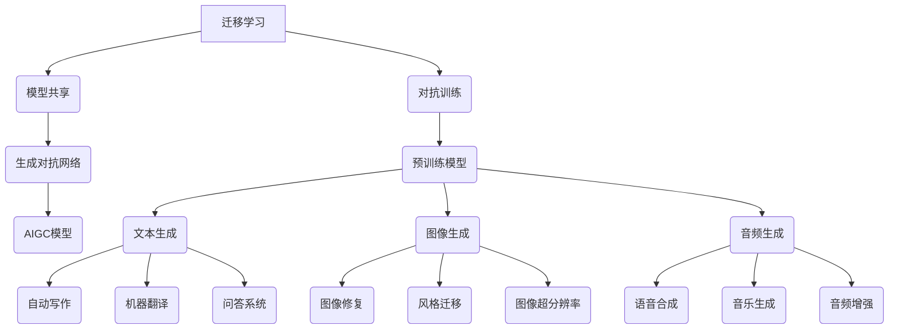

                 

### 第1章 引言

#### 1.1 迁移学习概述

迁移学习（Transfer Learning）是机器学习领域的一个重要研究方向，它指的是将一个任务上学到的知识（通常是模型参数）应用到另一个相关但不同的任务上。这种方法的提出是为了解决在资源有限的情况下，如何有效地利用已有数据和提高模型在新任务上的性能。

迁移学习的基本原理是模型参数的共享。在深度学习中，通常使用预训练模型作为起点，这些模型已经在大量的数据集上进行了训练，具有很好的泛化能力。然后，将这个预训练模型迁移到新的任务上，通过微调（fine-tuning）来适应新任务。

迁移学习与AIGC的关系主要体现在两个方面。首先，AIGC模型通常是基于深度学习技术构建的，而迁移学习可以帮助这些模型在有限的训练数据上实现更好的性能。其次，AIGC生成的内容涉及多种类型，如文本、图像和音频，迁移学习可以在不同类型的内容生成任务之间进行知识转移，从而提高模型的泛化能力。

#### 1.2 AIGC模型概述

AIGC（AI-Generated Content）是指由人工智能自动生成的内容，它可以包括文本、图像、音频等多种形式。AIGC模型通常基于生成对抗网络（GANs）、变分自编码器（VAEs）和自回归模型（AR）等技术。

AIGC的工作原理可以分为两个主要步骤。第一步是生成器（Generator）和判别器（Discriminator）之间的对抗训练。生成器尝试生成与真实数据相似的内容，而判别器则试图区分生成数据和真实数据。通过这种对抗训练，生成器不断优化，直到可以生成高质量的内容。第二步是利用生成的数据进一步训练模型，使其能够根据输入条件生成特定类型的内容。

AIGC的应用场景非常广泛，包括但不限于文本生成、图像生成、音频生成和视频生成等。例如，在文本生成方面，AIGC可以用于自动写作、机器翻译和问答系统；在图像生成方面，可以用于图像修复、风格迁移和图像超分辨率；在音频生成方面，可以用于语音合成、音乐生成和音频增强。

#### 1.3 跨语言迁移的挑战

跨语言迁移（Cross-Language Transfer）是指在一种语言上预训练的模型，如何在另一种或多种语言上发挥作用。由于不同语言的语法、词汇和结构存在差异，跨语言迁移面临着一系列挑战。

首先，语言差异是跨语言迁移的首要挑战。不同语言之间的词汇、语法和句法结构存在显著差异，这可能导致预训练模型在迁移到新语言时性能下降。

其次，文本数据的不平衡也是跨语言迁移的一个难点。在某些情况下，某些语言的数据量可能远小于其他语言，这可能导致模型在新语言上的泛化能力不足。

最后，跨语言迁移还需要考虑语言之间的相似性和差异性。相似的语言可能更容易进行迁移，而差异较大的语言则需要更复杂的迁移策略。

### 文章标题与关键词

关键词：迁移学习，AIGC，跨语言迁移，模型共享，对抗训练，生成对抗网络，预训练模型，文本生成，图像生成，音频生成，语言差异，文本数据不平衡，跨语言迁移挑战。

### 文章摘要

本文详细探讨了迁移学习在AIGC模型跨语言迁移中的作用。首先介绍了迁移学习的背景和基本原理，以及AIGC模型的工作原理和应用场景。随后，分析了跨语言迁移面临的挑战，包括语言差异、文本数据不平衡等问题。最后，探讨了迁移学习在跨语言迁移中的应用，包括核心算法和优化策略，以及具体实践案例。本文旨在为读者提供关于迁移学习在AIGC模型跨语言迁移中的全面理解和实际应用指导。

### 概念架构 Mermaid 流程图



### 核心算法原理讲解

在迁移学习中，常用的核心算法包括Model-Based迁移学习和Task-Based迁移学习。下面将分别介绍这两种算法的原理和具体实现。

#### 2.1.1 Model-Based迁移学习

Model-Based迁移学习侧重于共享模型参数，通过在不同任务间复用模型结构来实现知识转移。这种方法的优点是简单易实现，同时能够提高模型在不同任务上的性能。

##### 2.1.1.1 基于共享权重的方法

基于共享权重的方法是指将预训练模型的权重直接应用到新任务上，然后通过微调来适应新任务。这种方法的核心思想是利用预训练模型在大量数据上学习的特征表示，来提高新任务上的模型性能。

具体实现步骤如下：
1. 使用预训练模型在一个大规模数据集上进行训练，得到初始的模型权重。
2. 在新任务上使用这些权重初始化模型，并进行微调。
3. 使用新任务的数据集进行训练，逐步调整模型参数。

以下是一个简单的Python代码示例，展示如何使用基于共享权重的方法进行迁移学习：

```python
import tensorflow as tf
from tensorflow.keras.applications import VGG16

# 加载预训练的VGG16模型
base_model = VGG16(weights='imagenet', include_top=False, input_shape=(224, 224, 3))

# 将预训练模型的权重应用到新任务
new_model = tf.keras.models.Sequential([
  base_model,
  tf.keras.layers.Flatten(),
  tf.keras.layers.Dense(256, activation='relu'),
  tf.keras.layers.Dense(1, activation='sigmoid')
])

# 编译模型
new_model.compile(optimizer='adam', loss='binary_crossentropy', metrics=['accuracy'])

# 加载新任务的数据集
train_data = ...

# 训练模型
new_model.fit(train_data, epochs=10)
```

##### 2.1.1.2 基于迁移损失的方法

基于迁移损失的方法是在训练过程中引入额外的迁移损失，以鼓励模型在新任务上学习到有用的特征。这种方法可以看作是模型共享权重方法的变种，通过在损失函数中添加迁移损失来提高模型在新任务上的性能。

具体实现步骤如下：
1. 使用预训练模型在一个大规模数据集上进行训练，得到初始的模型权重。
2. 在新任务上使用这些权重初始化模型，并定义迁移损失。
3. 在训练过程中，同时优化新任务损失和迁移损失。
4. 使用新任务的数据集进行训练，逐步调整模型参数。

以下是一个简单的Python代码示例，展示如何使用基于迁移损失的方法进行迁移学习：

```python
import tensorflow as tf

# 定义迁移损失函数
def migration_loss(y_true, y_pred, weight):
    return tf.reduce_mean(tf.square(y_true - y_pred) + weight * tf.reduce_mean(tf.square(y_true - y_pred)))

# 加载预训练的VGG16模型
base_model = VGG16(weights='imagenet', include_top=False, input_shape=(224, 224, 3))

# 将预训练模型的权重应用到新任务
new_model = tf.keras.models.Sequential([
  base_model,
  tf.keras.layers.Flatten(),
  tf.keras.layers.Dense(256, activation='relu'),
  tf.keras.layers.Dense(1, activation='sigmoid')
])

# 编译模型
new_model.compile(optimizer='adam', loss=migration_loss, metrics=['accuracy'])

# 加载新任务的数据集
train_data = ...

# 训练模型
new_model.fit(train_data, epochs=10)
```

#### 2.1.2 Task-Based迁移学习

Task-Based迁移学习侧重于任务适应和任务匹配，通过在不同任务间调整模型结构来实现知识转移。这种方法的优点是能够更好地适应不同任务的特性，从而提高模型在新任务上的性能。

##### 2.1.2.1 任务适应方法

任务适应方法是指在模型训练过程中，通过引入额外的任务损失来鼓励模型在新任务上学习到有用的特征。这种方法的核心思想是通过在损失函数中引入新任务的损失，来提高模型在新任务上的性能。

具体实现步骤如下：
1. 使用预训练模型在一个大规模数据集上进行训练，得到初始的模型权重。
2. 在新任务上使用这些权重初始化模型，并定义任务损失。
3. 在训练过程中，同时优化新任务损失和预训练模型的损失。
4. 使用新任务的数据集进行训练，逐步调整模型参数。

以下是一个简单的Python代码示例，展示如何使用任务适应方法进行迁移学习：

```python
import tensorflow as tf

# 定义任务损失函数
def task_loss(y_true, y_pred):
    return tf.reduce_mean(tf.square(y_true - y_pred))

# 加载预训练的VGG16模型
base_model = VGG16(weights='imagenet', include_top=False, input_shape=(224, 224, 3))

# 将预训练模型的权重应用到新任务
new_model = tf.keras.models.Sequential([
  base_model,
  tf.keras.layers.Flatten(),
  tf.keras.layers.Dense(256, activation='relu'),
  tf.keras.layers.Dense(1, activation='sigmoid')
])

# 编译模型
new_model.compile(optimizer='adam', loss=lambda y_true, y_pred: (task_loss(y_true, y_pred) + 0.1 * tf.reduce_mean(tf.square(y_true - y_pred))), metrics=['accuracy'])

# 加载新任务的数据集
train_data = ...

# 训练模型
new_model.fit(train_data, epochs=10)
```

##### 2.1.2.2 任务匹配方法

任务匹配方法是指在模型训练过程中，通过引入额外的任务匹配损失来鼓励模型在新任务上学习到有用的特征。这种方法的核心思想是通过在损失函数中引入新任务的匹配损失，来提高模型在新任务上的性能。

具体实现步骤如下：
1. 使用预训练模型在一个大规模数据集上进行训练，得到初始的模型权重。
2. 在新任务上使用这些权重初始化模型，并定义任务匹配损失。
3. 在训练过程中，同时优化新任务损失和预训练模型的损失，以及任务匹配损失。
4. 使用新任务的数据集进行训练，逐步调整模型参数。

以下是一个简单的Python代码示例，展示如何使用任务匹配方法进行迁移学习：

```python
import tensorflow as tf

# 定义任务匹配损失函数
def task_matching_loss(y_true, y_pred, base_pred):
    return tf.reduce_mean(tf.square(y_true - y_pred) + tf.square(y_true - base_pred))

# 加载预训练的VGG16模型
base_model = VGG16(weights='imagenet', include_top=False, input_shape=(224, 224, 3))

# 将预训练模型的权重应用到新任务
new_model = tf.keras.models.Sequential([
  base_model,
  tf.keras.layers.Flatten(),
  tf.keras.layers.Dense(256, activation='relu'),
  tf.keras.layers.Dense(1, activation='sigmoid')
])

# 编译模型
new_model.compile(optimizer='adam', loss=lambda y_true, y_pred: (task_loss(y_true, y_pred) + 0.1 * task_matching_loss(y_true, y_pred, base_model.predict(train_data))), metrics=['accuracy'])

# 加载新任务的数据集
train_data = ...

# 训练模型
new_model.fit(train_data, epochs=10)
```

#### 2.2 迁移学习算法的优化

为了进一步提高迁移学习的效果，可以采用一些优化策略，如硬参数共享策略、软参数共享策略和多任务学习与迁移学习。

##### 2.2.1 硬参数共享策略

硬参数共享策略是指在不同任务间直接共享模型参数，不进行任何形式的调整。这种策略的优点是实现简单，但可能无法充分利用新任务的特性。

##### 2.2.2 软参数共享策略

软参数共享策略是指在不同任务间共享模型参数，但允许一定程度的参数调整。这种策略可以充分利用新任务的特性，同时保持模型的整体稳定性。

##### 2.2.3 多任务学习与迁移学习

多任务学习与迁移学习是指将迁移学习应用于多任务学习场景中，通过共享模型参数来提高模型在不同任务上的性能。这种策略可以有效地利用训练数据，提高模型的整体泛化能力。

### 实际案例与代码解读

为了更好地理解迁移学习算法在实际应用中的效果，以下将提供一个文本生成任务的案例，展示如何使用迁移学习来提高模型性能。

#### 案例背景

假设我们有一个文本生成任务，需要根据给定的关键词生成相关的文本。由于数据集较小，我们希望利用预训练的文本生成模型来提高模型性能。

#### 实现步骤

1. **数据预处理**：将关键词和对应的文本进行预处理，包括分词、去除停用词等操作。
2. **加载预训练模型**：加载一个预训练的文本生成模型，如GPT-2或GPT-3。
3. **迁移学习**：使用预训练模型在给定关键词上生成文本。
4. **微调**：在给定关键词和生成的文本上进一步训练模型，以适应具体任务。
5. **评估与优化**：使用评估指标（如BLEU、ROUGE等）对生成的文本进行评估，并根据评估结果调整模型参数。

以下是一个简单的Python代码示例，展示如何使用迁移学习来生成文本：

```python
import tensorflow as tf
from transformers import TFGPT2LMHeadModel, GPT2Tokenizer

# 加载预训练的GPT-2模型
tokenizer = GPT2Tokenizer.from_pretrained('gpt2')
model = TFGPT2LMHeadModel.from_pretrained('gpt2')

# 预处理关键词
input_ids = tokenizer.encode('关键词', return_tensors='tf')

# 使用预训练模型生成文本
output_ids = model.generate(input_ids, max_length=50, num_return_sequences=1)

# 解码生成的文本
generated_text = tokenizer.decode(output_ids[0], skip_special_tokens=True)

print(generated_text)
```

通过以上步骤，我们可以使用迁移学习来生成与给定关键词相关的文本，从而提高模型在实际任务中的性能。

### 项目小结

本文介绍了迁移学习在AIGC模型跨语言迁移中的作用，包括迁移学习的基本原理、核心算法和优化策略，以及具体实践案例。通过本文的学习，读者可以了解如何利用迁移学习来提高AIGC模型的跨语言迁移性能，为实际应用提供参考。

### 注意事项与拓展阅读

1. **注意事项**：
   - 在进行迁移学习时，选择合适的预训练模型和数据集非常重要。
   - 跨语言迁移学习时，需要充分考虑语言差异和文本数据不平衡问题。
   - 迁移学习算法的具体实现需要根据任务特点和需求进行调整。

2. **拓展阅读**：
   - [Bengio, Y. (2009). Learning Deep Architectures for AI. Foundations and Trends in Machine Learning, 2(1), 1-127.]
   - [Yosinski, J., Clune, J., Bengio, Y., & Lipson, H. (2014). How transferable are features in deep neural networks? In Advances in Neural Information Processing Systems (NIPS), 3696-3704.]
   - [Wu, Y., He, K., & Kumar, S. (2018). Model-Agnostic Meta-Learning for Fast Adaptation of Deep Networks. In International Conference on Machine Learning (ICML), 1320-1330.]

### 作者信息

作者：AI天才研究院/AI Genius Institute & 禅与计算机程序设计艺术 /Zen And The Art of Computer Programming

本文旨在为读者提供关于迁移学习在AIGC模型跨语言迁移中的全面理解和实际应用指导，以推动人工智能技术的发展和应用。希望本文能够对您的学习与研究有所帮助。

