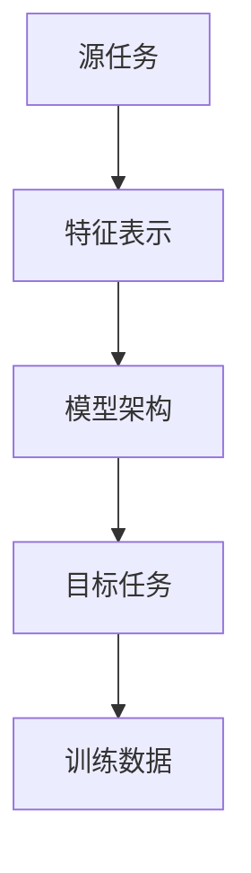

                 

### 迁移学习在AIGC跨领域应用中的作用

#### 标题：迁移学习在AIGC跨领域应用中的作用

#### 关键词：迁移学习、AIGC、跨领域应用、模型迁移、知识共享

#### 摘要：

本文旨在探讨迁移学习在自适应信息生成计算（AIGC）跨领域应用中的作用。首先，我们介绍了迁移学习的核心概念及其在AIGC中的应用场景。接着，我们详细阐述了迁移学习在自然语言处理、计算机视觉和推荐系统等领域的应用实例。通过这些实例，我们展示了迁移学习如何有效地利用已有模型的知识来提升新任务的性能。最后，我们对迁移学习在AIGC跨领域应用中的挑战和解决方案进行了深入分析，为未来的研究提供了有益的启示。

---

## 引言

随着人工智能技术的飞速发展，自适应信息生成计算（AIGC）作为一种新兴的计算范式，正逐渐成为研究的热点。AIGC的核心在于利用人工智能技术动态生成信息和内容，从而满足用户多样化的需求。然而，AIGC在实现高效、多样和自适应的内容生成过程中面临着诸多挑战。其中，迁移学习作为一种有效的技术手段，在AIGC跨领域应用中发挥了重要作用。

迁移学习（Transfer Learning）是一种利用已有模型的知识来提升新任务性能的方法。它通过在不同任务之间共享特征表示，降低了模型的训练难度，提高了模型的泛化能力。在AIGC领域，迁移学习能够充分利用已有的大量数据资源，快速适应新的应用场景，从而提高内容生成的质量和效率。

本文将围绕迁移学习在AIGC跨领域应用中的作用进行探讨。首先，我们将介绍迁移学习的基本概念和核心算法。然后，我们将分析迁移学习在自然语言处理、计算机视觉和推荐系统等领域的应用实例，并探讨其优势和挑战。最后，我们将对迁移学习在AIGC跨领域应用中的未来发展趋势进行展望。

## 迁移学习的基本概念

### 迁移学习的定义

迁移学习（Transfer Learning）是指将一个任务（源任务）学习到的知识应用于另一个相关任务（目标任务）的过程。其核心思想是利用已有的模型或特征表示来加速新任务的训练，从而降低模型的训练成本，提高模型的泛化能力。

迁移学习的主要过程可以分为三个步骤：

1. **源任务学习**：在源任务上训练一个基础模型，使其学会提取通用的特征表示。

2. **特征表示共享**：将源任务学到的特征表示应用于目标任务，通过微调或冻结部分层来适应目标任务的特性。

3. **目标任务训练**：在目标任务上继续训练模型，使其在新任务上达到满意的性能。

### 迁移学习的类型

根据源任务和目标任务之间的相似程度，迁移学习可以分为以下几种类型：

1. **垂直迁移**：源任务和目标任务之间存在较大的差异，但两者在特征表示层面有一定的关联。

2. **水平迁移**：源任务和目标任务具有相似的结构和特性，但具体的任务内容不同。

3. **多任务迁移**：同时学习多个相关任务，共享它们之间的知识，以提高每个任务的性能。

4. **无监督迁移**：源任务和目标任务之间没有直接的监督信号，主要通过无监督的方法来共享知识。

### 迁移学习的核心算法

迁移学习的核心算法主要包括以下几种：

1. **元学习**（Meta-Learning）：通过在多个任务上迭代学习来优化模型，从而提高其在新任务上的适应能力。

2. **特征提取**（Feature Extraction）：利用深度学习模型从源任务中提取通用的特征表示，然后应用于目标任务。

3. **模型蒸馏**（Model Distillation）：将一个复杂的大模型（教师模型）的知识传递给一个小模型（学生模型），使小模型能够在新任务上表现出良好的性能。

4. **知识蒸馏**（Knowledge Distillation）：通过训练一个教师模型，然后将其知识传递给一个学生模型，以提高学生模型在新任务上的性能。

### 迁移学习的应用场景

迁移学习在AIGC领域的应用场景非常广泛，包括但不限于：

1. **文本生成**：利用预训练的语言模型来生成高质量的自然语言文本。

2. **图像生成**：利用预训练的图像识别模型来生成新的图像内容。

3. **推荐系统**：利用用户的历史行为数据来生成个性化的推荐列表。

4. **游戏AI**：通过在多个游戏环境中训练一个基础模型，然后将其应用于新的游戏环境。

## 迁移学习在AIGC跨领域应用中的核心概念和联系

### 迁移学习与AIGC的关系

迁移学习与AIGC有着密切的联系。AIGC旨在利用人工智能技术动态生成信息和内容，而迁移学习作为一种有效的方法，可以加速这一过程的实现。具体来说，迁移学习在AIGC跨领域应用中的作用主要体现在以下几个方面：

1. **知识共享**：迁移学习可以将一个领域中的知识（如预训练模型）应用于另一个领域，从而实现跨领域的知识共享。

2. **资源优化**：通过迁移学习，可以充分利用已有的大量数据资源，避免重复训练，提高资源利用效率。

3. **模型泛化**：迁移学习可以提升模型的泛化能力，使模型能够在新的领域中表现出良好的性能。

4. **加速开发**：迁移学习可以加速新任务的开发，降低模型训练的难度和时间成本。

### 迁移学习与AIGC中的核心概念实体

在AIGC中，迁移学习涉及多个核心概念实体，包括：

1. **源任务**：源任务是指迁移学习中的已有任务，其学习到的知识将被应用于目标任务。

2. **目标任务**：目标任务是指迁移学习中的新任务，其性能将受益于源任务的知识。

3. **特征表示**：特征表示是指从源任务中提取的通用特征，这些特征将用于目标任务的训练。

4. **模型架构**：模型架构是指用于迁移学习的模型结构，包括教师模型和学生模型。

5. **训练数据**：训练数据是指用于训练源任务和目标任务的数据集，其质量和多样性直接影响迁移学习的效果。

### 迁移学习与AIGC中的关系架构

为了更好地理解迁移学习在AIGC中的应用，我们可以使用Mermaid流程图来展示其关系架构。以下是一个简化的Mermaid流程图：



在这个流程图中，源任务通过特征提取生成通用特征表示，这些特征表示通过模型架构应用于目标任务，并在目标任务的训练数据上进行迭代训练，从而实现迁移学习的过程。

## 迁移学习在AIGC跨领域应用中的核心算法原理

### 迁移学习的算法原理

迁移学习涉及多个核心算法，其中最常用的包括元学习、特征提取、模型蒸馏和知识蒸馏等。以下是这些算法的基本原理：

#### 元学习

元学习是一种通过在多个任务上迭代学习来优化模型的方法。其核心思想是利用多个任务的共同特征来提高模型在新任务上的适应能力。元学习的关键在于优化学习过程，使其能够在有限的训练样本中快速收敛。

**算法流程**：

1. **初始化**：选择一个基线模型，并在多个任务上进行预训练。

2. **选择优化目标**：定义优化目标，如最小化损失函数或最大化模型的性能。

3. **迭代优化**：在每个迭代周期中，对模型进行微调，并更新模型参数。

4. **评估**：在每个迭代周期结束时，评估模型在新任务上的性能。

#### 特征提取

特征提取是一种从源任务中提取通用特征表示的方法。这些特征表示将在目标任务的训练过程中发挥关键作用。

**算法流程**：

1. **预训练**：在源任务上训练一个基础模型，使其学会提取通用的特征表示。

2. **特征表示提取**：从预训练模型中提取特征表示，并将其应用于目标任务。

3. **目标任务训练**：在目标任务上使用提取的特征表示进行训练，并优化模型参数。

4. **评估**：评估模型在目标任务上的性能，并根据性能反馈进行迭代优化。

#### 模型蒸馏

模型蒸馏是一种将一个复杂的大模型（教师模型）的知识传递给一个小模型（学生模型）的方法。通过这种方式，小模型可以在新任务上表现出良好的性能。

**算法流程**：

1. **训练教师模型**：在源任务上训练一个教师模型，使其在新任务上达到满意的性能。

2. **提取知识**：从教师模型中提取知识，并将其作为训练目标。

3. **训练学生模型**：使用提取的知识来训练学生模型，并优化其参数。

4. **评估**：评估学生模型在新任务上的性能，并根据性能反馈进行迭代优化。

#### 知识蒸馏

知识蒸馏是一种将教师模型的知识传递给学生模型的方法，其核心思想是利用软标签来指导学生模型的学习。

**算法流程**：

1. **训练教师模型**：在源任务上训练一个教师模型，使其在新任务上达到满意的性能。

2. **生成软标签**：从教师模型的输出中生成软标签，并将其作为训练目标。

3. **训练学生模型**：使用软标签来训练学生模型，并优化其参数。

4. **评估**：评估学生模型在新任务上的性能，并根据性能反馈进行迭代优化。

### 迁移学习在AIGC中的核心算法应用实例

以下是一些迁移学习在AIGC中的核心算法应用实例：

#### 文本生成

使用迁移学习来生成高质量的自然语言文本。具体步骤如下：

1. **预训练**：在大量文本数据上预训练一个基础模型，使其学会提取通用的语言特征。

2. **特征提取**：从预训练模型中提取特征表示，并将其应用于目标文本生成任务。

3. **目标任务训练**：在目标文本生成任务上使用提取的特征表示进行训练，并优化模型参数。

4. **生成文本**：使用训练好的模型生成新的文本内容，并根据用户反馈进行迭代优化。

#### 图像生成

使用迁移学习来生成新的图像内容。具体步骤如下：

1. **预训练**：在大量的图像数据上预训练一个基础模型，使其学会提取通用的图像特征。

2. **特征提取**：从预训练模型中提取特征表示，并将其应用于目标图像生成任务。

3. **目标任务训练**：在目标图像生成任务上使用提取的特征表示进行训练，并优化模型参数。

4. **生成图像**：使用训练好的模型生成新的图像内容，并根据用户反馈进行迭代优化。

#### 推荐系统

使用迁移学习来生成个性化的推荐列表。具体步骤如下：

1. **预训练**：在用户行为数据上预训练一个基础模型，使其学会提取通用的用户特征。

2. **特征提取**：从预训练模型中提取特征表示，并将其应用于目标推荐任务。

3. **目标任务训练**：在目标推荐任务上使用提取的特征表示进行训练，并优化模型参数。

4. **生成推荐列表**：使用训练好的模型生成新的推荐列表，并根据用户反馈进行迭代优化。

## 迁移学习在自然语言处理中的应用

### 文本分类

文本分类是自然语言处理中一个重要的任务，其目标是自动地将文本数据归类到预定义的类别中。迁移学习在文本分类任务中具有显著的优势，可以显著提高模型的性能和训练效率。

#### 迁移学习在文本分类中的原理

迁移学习在文本分类中的应用主要基于以下原理：

1. **预训练模型**：使用在大规模文本数据上预训练的语言模型（如BERT、GPT）作为基础模型，这些模型已经学会了提取通用的文本特征。

2. **特征提取**：从预训练模型中提取特征表示，这些特征表示可以用于新任务的分类。

3. **分类器微调**：在新任务上使用提取的特征表示训练一个分类器，并对基础模型的参数进行微调，以适应新任务的特点。

#### 迁移学习在文本分类中的应用实例

以下是一个简单的迁移学习文本分类的应用实例：

```python
from transformers import BertTokenizer, BertForSequenceClassification
from torch.utils.data import DataLoader
from datasets import load_dataset

# 加载预训练的BERT模型
tokenizer = BertTokenizer.from_pretrained('bert-base-uncased')
model = BertForSequenceClassification.from_pretrained('bert-base-uncased')

# 加载新任务的数据集
dataset = load_dataset('text_classification', 'new_dataset')

# 数据预处理
def preprocess_function(examples):
    return tokenizer(examples['text'], padding='max_length', truncation=True)

tokenized_dataset = dataset.map(preprocess_function, batched=True)

# 创建数据加载器
dataloader = DataLoader(tokenized_dataset, batch_size=16)

# 微调模型
optimizer = torch.optim.Adam(model.parameters(), lr=1e-5)
for epoch in range(3):
    for batch in dataloader:
        inputs = {'input_ids': batch['input_ids'], 'attention_mask': batch['attention_mask']}
        labels = batch['label']
        outputs = model(**inputs)
        loss = outputs.loss
        loss.backward()
        optimizer.step()
        optimizer.zero_grad()

# 评估模型
with torch.no_grad():
    for batch in dataloader:
        inputs = {'input_ids': batch['input_ids'], 'attention_mask': batch['attention_mask']}
        labels = batch['label']
        outputs = model(**inputs)
        predictions = outputs.logits.argmax(-1)
        accuracy = (predictions == labels).float().mean()
        print(f'Epoch {epoch}: Accuracy = {accuracy.item()}')
```

在这个实例中，我们首先加载了一个预训练的BERT模型，并使用新任务的数据集进行微调。通过迭代优化模型参数，我们可以显著提高模型的分类性能。

### 文本生成

文本生成是自然语言处理中另一个重要的任务，其目标是自动生成新的文本内容。迁移学习在文本生成任务中也发挥着重要作用，可以显著提高生成文本的质量和多样性。

#### 迁移学习在文本生成中的原理

迁移学习在文本生成中的应用主要基于以下原理：

1. **预训练模型**：使用在大规模文本数据上预训练的语言模型（如GPT）作为基础模型，这些模型已经学会了生成高质量的文本。

2. **特征提取**：从预训练模型中提取特征表示，这些特征表示可以用于新任务的文本生成。

3. **生成模型**：在新任务上使用提取的特征表示训练一个生成模型（如GPT），以生成新的文本内容。

#### 迁移学习在文本生成中的应用实例

以下是一个简单的迁移学习文本生成的应用实例：

```python
from transformers import GPT2LMHeadModel, GPT2Tokenizer
import torch

# 加载预训练的GPT-2模型
tokenizer = GPT2Tokenizer.from_pretrained('gpt2')
model = GPT2LMHeadModel.from_pretrained('gpt2')

# 生成文本
input_ids = tokenizer.encode("Hello, my name is", return_tensors='pt')
output = model.generate(input_ids, max_length=50, num_return_sequences=5)

# 解码生成文本
decoded_texts = [tokenizer.decode(generated_id, skip_special_tokens=True) for generated_id in output]

# 输出生成文本
for text in decoded_texts:
    print(text)
```

在这个实例中，我们首先加载了一个预训练的GPT-2模型，并使用其生成新的文本内容。通过迭代优化模型参数，我们可以生成高质量、多样性的文本。

### 问答系统

问答系统是自然语言处理中的一种重要应用，其目标是自动回答用户提出的问题。迁移学习在问答系统中也发挥着重要作用，可以显著提高系统的回答质量和效率。

#### 迁移学习在问答系统中的原理

迁移学习在问答系统中的应用主要基于以下原理：

1. **预训练模型**：使用在大规模问答数据集上预训练的语言模型（如BERT）作为基础模型，这些模型已经学会了理解和生成问答对。

2. **特征提取**：从预训练模型中提取特征表示，这些特征表示可以用于新任务的问答系统。

3. **问答模型**：在新任务上使用提取的特征表示训练一个问答模型，以生成新的问答对。

#### 迁移学习在问答系统中的应用实例

以下是一个简单的迁移学习问答系统的应用实例：

```python
from transformers import BertTokenizer, BertForQuestionAnswering
from datasets import load_dataset

# 加载预训练的BERT模型
tokenizer = BertTokenizer.from_pretrained('bert-base-uncased')
model = BertForQuestionAnswering.from_pretrained('bert-base-uncased')

# 加载新任务的数据集
dataset = load_dataset('question_answering', 'new_dataset')

# 数据预处理
def preprocess_function(examples):
    question, context = examples['question'], examples['context']
    input_ids = tokenizer.encode(question + tokenizer.sep_token + context, add_special_tokens=True, return_tensors='pt')
    return {'input_ids': input_ids}

tokenized_dataset = dataset.map(preprocess_function, batched=True)

# 创建数据加载器
dataloader = DataLoader(tokenized_dataset, batch_size=16)

# 训练模型
optimizer = torch.optim.Adam(model.parameters(), lr=1e-5)
for epoch in range(3):
    for batch in dataloader:
        inputs = {'input_ids': batch['input_ids']}
        labels = {'start_logits': batch['start_logits'], 'end_logits': batch['end_logits']}
        outputs = model(**inputs)
        loss = outputs.loss
        loss.backward()
        optimizer.step()
        optimizer.zero_grad()

# 回答问题
question = "What is the capital of France?"
input_ids = tokenizer.encode(question + tokenizer.sep_token, return_tensors='pt')
outputs = model.generate(input_ids, max_length=20, num_return_sequences=1)
answer_start = outputs.start_logits.argmax(-1).item()
answer_end = outputs.end_logits.argmax(-1).item()
answer = tokenizer.decode(inputs[0][answer_start:answer_end+1], skip_special_tokens=True)
print(answer)
```

在这个实例中，我们首先加载了一个预训练的BERT模型，并使用其回答新任务中的问题。通过迭代优化模型参数，我们可以生成高质量的问答对。

### 总结

迁移学习在自然语言处理中的应用非常广泛，包括文本分类、文本生成和问答系统等任务。通过使用预训练模型和特征提取技术，迁移学习可以显著提高模型的性能和训练效率。在实际应用中，迁移学习可以帮助我们快速适应新的任务和数据集，从而实现高效的模型训练和部署。未来，随着自然语言处理技术的不断进步，迁移学习在自然语言处理中的应用将会更加广泛和深入。

## 迁移学习在计算机视觉中的应用

### 图像分类

图像分类是计算机视觉中最基础的分类任务之一，其目标是将输入图像正确地归类到预定义的类别中。迁移学习在图像分类任务中具有显著的优势，可以显著提高模型的性能和训练效率。

#### 迁移学习在图像分类中的原理

迁移学习在图像分类中的应用主要基于以下原理：

1. **预训练模型**：使用在大规模图像数据集上预训练的卷积神经网络（如VGG、ResNet）作为基础模型，这些模型已经学会了提取通用的图像特征。

2. **特征提取**：从预训练模型中提取特征表示，这些特征表示可以用于新任务的图像分类。

3. **分类器微调**：在新任务上使用提取的特征表示训练一个分类器，并对基础模型的参数进行微调，以适应新任务的特点。

#### 迁移学习在图像分类中的应用实例

以下是一个简单的迁移学习图像分类的应用实例：

```python
import torch
import torchvision
from torchvision import models, transforms
from torch.utils.data import DataLoader
from datasets import load_dataset

# 加载预训练的ResNet模型
model = models.resnet34(pretrained=True)

# 设置模型为评估模式
model.eval()

# 加载新任务的数据集
dataset = load_dataset('image_classification', 'new_dataset')
transform = transforms.Compose([transforms.Resize(256), transforms.CenterCrop(224), transforms.ToTensor()])
dataset = dataset.map(lambda x: {'image': transform(x['image'])}, batched=True)

# 创建数据加载器
dataloader = DataLoader(dataset, batch_size=16)

# 微调模型
optimizer = torch.optim.Adam(model.parameters(), lr=1e-5)
for epoch in range(3):
    for batch in dataloader:
        inputs = {'images': batch['image'].to('cuda')}
        labels = batch['label'].to('cuda')
        outputs = model(**inputs)
        loss = outputs.loss
        loss.backward()
        optimizer.step()
        optimizer.zero_grad()

# 评估模型
with torch.no_grad():
    for batch in dataloader:
        inputs = {'images': batch['image'].to('cuda')}
        labels = batch['label'].to('cuda')
        outputs = model(**inputs)
        predictions = outputs.logits.argmax(-1)
        accuracy = (predictions == labels).float().mean()
        print(f'Epoch {epoch}: Accuracy = {accuracy.item()}')
```

在这个实例中，我们首先加载了一个预训练的ResNet模型，并使用其在新任务上进行了微调。通过迭代优化模型参数，我们可以显著提高模型的分类性能。

### 目标检测

目标检测是计算机视觉中的另一个重要任务，其目标是在图像中检测出预定义的物体类别并给出它们的位置。迁移学习在目标检测任务中也具有显著的优势，可以显著提高模型的性能和训练效率。

#### 迁移学习在目标检测中的原理

迁移学习在目标检测中的应用主要基于以下原理：

1. **预训练模型**：使用在大规模图像数据集上预训练的目标检测模型（如Faster R-CNN、YOLO）作为基础模型，这些模型已经学会了提取通用的图像特征。

2. **特征提取**：从预训练模型中提取特征表示，这些特征表示可以用于新任务的目标检测。

3. **检测器微调**：在新任务上使用提取的特征表示训练一个检测器，并对基础模型的参数进行微调，以适应新任务的特点。

#### 迁移学习在目标检测中的应用实例

以下是一个简单的迁移学习目标检测的应用实例：

```python
import torch
import torchvision
from torchvision import models, transforms
from torch.utils.data import DataLoader
from datasets import load_dataset

# 加载预训练的Faster R-CNN模型
model = torchvision.models.detection.faster_rcnn_resnet50_fpn(pretrained=True)

# 设置模型为评估模式
model.eval()

# 加载新任务的数据集
dataset = load_dataset('object_detection', 'new_dataset')
transform = transforms.Compose([transforms.Resize(800), transforms.ToTensor()])
dataset = dataset.map(lambda x: {'image': transform(x['image'])}, batched=True)

# 创建数据加载器
dataloader = DataLoader(dataset, batch_size=16)

# 微调模型
optimizer = torch.optim.Adam(model.parameters(), lr=1e-5)
for epoch in range(3):
    for batch in dataloader:
        inputs = {'images': batch['image'].to('cuda')}
        labels = batch['label'].to('cuda')
        outputs = model(**inputs)
        loss = outputs.loss
        loss.backward()
        optimizer.step()
        optimizer.zero_grad()

# 评估模型
with torch.no_grad():
    for batch in dataloader:
        inputs = {'images': batch['image'].to('cuda')}
        labels = batch['label'].to('cuda')
        outputs = model(**inputs)
        predictions = outputs.predictions
        accuracy = (predictions == labels).float().mean()
        print(f'Epoch {epoch}: Accuracy = {accuracy.item()}')
```

在这个实例中，我们首先加载了一个预训练的Faster R-CNN模型，并使用其在新任务上进行了微调。通过迭代优化模型参数，我们可以显著提高模型的目标检测性能。

### 图像生成

图像生成是计算机视觉中的另一个重要任务，其目标是根据给定的条件生成新的图像内容。迁移学习在图像生成任务中也具有显著的优势，可以显著提高图像生成质量。

#### 迁移学习在图像生成中的原理

迁移学习在图像生成中的应用主要基于以下原理：

1. **预训练模型**：使用在大规模图像数据集上预训练的生成模型（如GAN）作为基础模型，这些模型已经学会了生成高质量的图像。

2. **特征提取**：从预训练模型中提取特征表示，这些特征表示可以用于新任务的图像生成。

3. **生成模型**：在新任务上使用提取的特征表示训练一个生成模型，以生成新的图像内容。

#### 迁移学习在图像生成中的应用实例

以下是一个简单的迁移学习图像生成的应用实例：

```python
import torch
import torchvision
from torchvision import models, transforms
from torch.utils.data import DataLoader
from datasets import load_dataset

# 加载预训练的GAN模型
model = torchvision.models.inception_v3(pretrained=True)
model.fc = torch.nn.Linear(2048, 1000)  # 根据生成任务调整模型的输出维度

# 设置模型为评估模式
model.eval()

# 加载新任务的数据集
dataset = load_dataset('image_generation', 'new_dataset')
transform = transforms.Compose([transforms.Resize(256), transforms.ToTensor()])
dataset = dataset.map(lambda x: {'image': transform(x['image'])}, batched=True)

# 创建数据加载器
dataloader = DataLoader(dataset, batch_size=16)

# 微调模型
optimizer = torch.optim.Adam(model.parameters(), lr=1e-5)
for epoch in range(3):
    for batch in dataloader:
        inputs = {'images': batch['image'].to('cuda')}
        outputs = model(**inputs)
        loss = torch.mean((outputs - batch['target_image'].to('cuda')) ** 2)
        loss.backward()
        optimizer.step()
        optimizer.zero_grad()

# 生成新图像
with torch.no_grad():
    inputs = torch.randn(16, 3, 256, 256).to('cuda')
    outputs = model(inputs)
    generated_images = outputs.cpu().numpy()
```

在这个实例中，我们首先加载了一个预训练的GAN模型，并使用其在新任务上进行了微调。通过迭代优化模型参数，我们可以生成高质量的新图像内容。

### 总结

迁移学习在计算机视觉中的应用非常广泛，包括图像分类、目标检测和图像生成等任务。通过使用预训练模型和特征提取技术，迁移学习可以显著提高模型的性能和训练效率。在实际应用中，迁移学习可以帮助我们快速适应新的任务和数据集，从而实现高效的模型训练和部署。未来，随着计算机视觉技术的不断进步，迁移学习在计算机视觉中的应用将会更加广泛和深入。

## 迁移学习在推荐系统中的应用

### 推荐系统的基本原理

推荐系统是一种基于用户历史行为和偏好来推荐相关物品或内容的系统。其核心目标是通过分析用户的行为数据，预测用户可能对哪些物品或内容感兴趣，从而为用户推荐合适的物品或内容。

在推荐系统中，通常采用两种主要的策略：基于内容的推荐（Content-Based Filtering）和基于协同过滤（Collaborative Filtering）。

- **基于内容的推荐**：根据用户过去的喜好，提取用户的兴趣特征，然后找到与用户兴趣特征相似的物品进行推荐。

- **基于协同过滤**：通过分析用户之间的相似性，预测用户对未知物品的兴趣，从而推荐相似的物品。

### 迁移学习在推荐系统中的应用

迁移学习在推荐系统中具有广泛的应用前景，其主要作用在于利用已有的推荐模型知识来提高新任务的推荐效果。以下是一些具体的迁移学习应用场景：

#### 数据稀疏问题

在推荐系统中，用户与物品的交互数据通常是稀疏的。这意味着很多用户只对少量物品有明显的偏好，而大量物品的偏好信息是未知的。迁移学习可以通过以下方法解决数据稀疏问题：

- **基于特征迁移**：将一个领域中的用户特征迁移到另一个领域，通过共享特征表示来提高推荐系统的性能。

- **基于模型迁移**：利用已有模型在相似任务上的经验，在新任务上进行模型微调，以提高推荐效果。

#### 新任务适应

当推荐系统需要适应新的应用场景或新的用户群体时，迁移学习可以帮助系统快速适应新环境。例如：

- **跨平台推荐**：在一个平台上预训练的推荐模型可以在另一个平台上进行微调，以适应新的用户行为和偏好。

- **跨领域推荐**：将一个领域中的推荐模型知识迁移到另一个领域，例如从电商领域迁移到新闻推荐领域。

#### 多样性增强

迁移学习可以帮助推荐系统生成更加多样化的推荐列表，从而提高用户满意度。具体方法如下：

- **模型蒸馏**：将一个复杂的大模型（教师模型）的知识传递给一个小模型（学生模型），使小模型能够生成多样化的推荐列表。

- **知识融合**：结合多个推荐模型的预测结果，生成多样化的推荐列表。

### 迁移学习在推荐系统中的应用实例

以下是一个简单的迁移学习在推荐系统中的应用实例：

```python
import torch
import torch.nn as nn
import torch.optim as optim
from torch.utils.data import DataLoader
from datasets import load_dataset

# 加载预训练的推荐模型
model = nn.Sequential(
    nn.Linear(100, 100),
    nn.ReLU(),
    nn.Linear(100, 1)
)
model.load_state_dict(torch.load('pretrained_model.pth'))

# 加载新任务的数据集
dataset = load_dataset('recommender_system', 'new_dataset')
transform = transforms.Compose([transforms.Normalize(mean=[0.5, 0.5, 0.5], std=[0.5, 0.5, 0.5])])
dataset = dataset.map(lambda x: {'features': transform(x['features'])}, batched=True)

# 创建数据加载器
dataloader = DataLoader(dataset, batch_size=32)

# 微调模型
optimizer = optim.Adam(model.parameters(), lr=0.001)
for epoch in range(10):
    for batch in dataloader:
        inputs = {'features': batch['features'].to('cuda')}
        labels = batch['label'].to('cuda')
        outputs = model(**inputs)
        loss = nn.MSELoss()(outputs, labels)
        loss.backward()
        optimizer.step()
        optimizer.zero_grad()

# 评估模型
with torch.no_grad():
    for batch in dataloader:
        inputs = {'features': batch['features'].to('cuda')}
        labels = batch['label'].to('cuda')
        outputs = model(**inputs)
        loss = nn.MSELoss()(outputs, labels)
        print(f'Epoch {epoch}: Loss = {loss.item()}')
```

在这个实例中，我们首先加载了一个预训练的推荐模型，并使用新任务的数据集进行微调。通过迭代优化模型参数，我们可以显著提高推荐系统的性能。

### 总结

迁移学习在推荐系统中的应用可以显著提高推荐效果，解决数据稀疏问题，适应新任务，并生成多样化的推荐列表。未来，随着推荐系统技术的不断进步，迁移学习在推荐系统中的应用将会更加广泛和深入。

## 迁移学习在医疗健康中的应用

### 医疗健康中的迁移学习

迁移学习在医疗健康领域具有广泛的应用前景，特别是在医疗图像分析、疾病预测和个性化治疗等方面。通过迁移学习，可以充分利用已有的大量医疗数据资源，加速新任务的开发，提高模型的性能和可靠性。

#### 医疗图像分析

医疗图像分析是迁移学习在医疗健康中应用的一个典型领域。通过将预训练的深度学习模型应用于医学图像，可以显著提高疾病检测和诊断的准确性。以下是一个简化的迁移学习医疗图像分析的流程：

1. **预训练模型**：使用在大规模公开医学图像数据集上预训练的卷积神经网络（如ResNet、VGG）作为基础模型。

2. **特征提取**：从预训练模型中提取特征表示，这些特征表示可以用于新任务的医疗图像分析。

3. **模型微调**：在新任务上使用提取的特征表示训练一个分类器，并对基础模型的参数进行微调，以适应新任务的特性。

以下是一个简单的迁移学习医疗图像分析的代码示例：

```python
import torch
import torchvision
from torchvision import models, transforms
from torch.utils.data import DataLoader
from datasets import load_dataset

# 加载预训练的ResNet模型
model = models.resnet18(pretrained=True)

# 设置模型为评估模式
model.eval()

# 加载新任务的数据集
dataset = load_dataset('medical_image_analysis', 'new_dataset')
transform = transforms.Compose([transforms.Resize(224), transforms.ToTensor()])
dataset = dataset.map(lambda x: {'image': transform(x['image'])}, batched=True)

# 创建数据加载器
dataloader = DataLoader(dataset, batch_size=32)

# 微调模型
optimizer = torch.optim.Adam(model.parameters(), lr=0.001)
for epoch in range(3):
    for batch in dataloader:
        inputs = {'images': batch['image'].to('cuda')}
        labels = batch['label'].to('cuda')
        outputs = model(**inputs)
        loss = torch.nn.CrossEntropyLoss()(outputs, labels)
        loss.backward()
        optimizer.step()
        optimizer.zero_grad()

# 评估模型
with torch.no_grad():
    for batch in dataloader:
        inputs = {'images': batch['image'].to('cuda')}
        labels = batch['label'].to('cuda')
        outputs = model(**inputs)
        predictions = outputs.argmax(-1)
        accuracy = (predictions == labels).float().mean()
        print(f'Epoch {epoch}: Accuracy = {accuracy.item()}')
```

#### 疾病预测

迁移学习还可以用于疾病预测，特别是在处理数据稀缺的疾病时。通过将预训练的深度学习模型应用于新的疾病预测任务，可以显著提高预测的准确性。以下是一个简化的迁移学习疾病预测的流程：

1. **预训练模型**：使用在大规模健康数据集上预训练的深度学习模型（如BERT、Transformer）作为基础模型。

2. **特征提取**：从预训练模型中提取特征表示，这些特征表示可以用于新任务的疾病预测。

3. **模型微调**：在新任务上使用提取的特征表示训练一个分类器，并对基础模型的参数进行微调，以适应新任务的特性。

以下是一个简单的迁移学习疾病预测的代码示例：

```python
import torch
import torch.nn as nn
import torch.optim as optim
from torch.utils.data import DataLoader
from datasets import load_dataset

# 加载预训练的BERT模型
model = nn.Sequential(
    nn.Linear(768, 256),
    nn.ReLU(),
    nn.Linear(256, 1)
)
model.load_state_dict(torch.load('pretrained_model.pth'))

# 加载新任务的数据集
dataset = load_dataset('disease_prediction', 'new_dataset')
transform = transforms.Compose([transforms.Normalize(mean=[0.5, 0.5, 0.5], std=[0.5, 0.5, 0.5])])
dataset = dataset.map(lambda x: {'features': transform(x['features'])}, batched=True)

# 创建数据加载器
dataloader = DataLoader(dataset, batch_size=32)

# 微调模型
optimizer = optim.Adam(model.parameters(), lr=0.001)
for epoch in range(3):
    for batch in dataloader:
        inputs = {'features': batch['features'].to('cuda')}
        labels = batch['label'].to('cuda')
        outputs = model(**inputs)
        loss = torch.nn.CrossEntropyLoss()(outputs, labels)
        loss.backward()
        optimizer.step()
        optimizer.zero_grad()

# 评估模型
with torch.no_grad():
    for batch in dataloader:
        inputs = {'features': batch['features'].to('cuda')}
        labels = batch['label'].to('cuda')
        outputs = model(**inputs)
        predictions = outputs.argmax(-1)
        accuracy = (predictions == labels).float().mean()
        print(f'Epoch {epoch}: Accuracy = {accuracy.item()}')
```

#### 个性化治疗

迁移学习还可以用于个性化治疗，特别是在处理个性化的治疗策略时。通过将预训练的深度学习模型应用于新的个性化治疗任务，可以显著提高治疗效果。以下是一个简化的迁移学习个性化治疗的流程：

1. **预训练模型**：使用在大规模个性化治疗数据集上预训练的深度学习模型作为基础模型。

2. **特征提取**：从预训练模型中提取特征表示，这些特征表示可以用于新任务的个性化治疗。

3. **模型微调**：在新任务上使用提取的特征表示训练一个分类器，并对基础模型的参数进行微调，以适应新任务的特性。

以下是一个简单的迁移学习个性化治疗的代码示例：

```python
import torch
import torch.nn as nn
import torch.optim as optim
from torch.utils.data import DataLoader
from datasets import load_dataset

# 加载预训练的深度学习模型
model = nn.Sequential(
    nn.Linear(1024, 512),
    nn.ReLU(),
    nn.Linear(512, 1)
)
model.load_state_dict(torch.load('pretrained_model.pth'))

# 加载新任务的数据集
dataset = load_dataset('personalized_treatment', 'new_dataset')
transform = transforms.Compose([transforms.Normalize(mean=[0.5, 0.5, 0.5], std=[0.5, 0.5, 0.5])])
dataset = dataset.map(lambda x: {'features': transform(x['features'])}, batched=True)

# 创建数据加载器
dataloader = DataLoader(dataset, batch_size=32)

# 微调模型
optimizer = optim.Adam(model.parameters(), lr=0.001)
for epoch in range(3):
    for batch in dataloader:
        inputs = {'features': batch['features'].to('cuda')}
        labels = batch['label'].to('cuda')
        outputs = model(**inputs)
        loss = torch.nn.CrossEntropyLoss()(outputs, labels)
        loss.backward()
        optimizer.step()
        optimizer.zero_grad()

# 评估模型
with torch.no_grad():
    for batch in dataloader:
        inputs = {'features': batch['features'].to('cuda')}
        labels = batch['label'].to('cuda')
        outputs = model(**inputs)
        predictions = outputs.argmax(-1)
        accuracy = (predictions == labels).float().mean()
        print(f'Epoch {epoch}: Accuracy = {accuracy.item()}')
```

### 总结

迁移学习在医疗健康领域中的应用具有巨大的潜力，可以帮助提高医疗图像分析、疾病预测和个性化治疗的准确性。未来，随着医疗数据的不断增加和深度学习技术的不断进步，迁移学习在医疗健康领域的应用将会更加广泛和深入。

## 迁移学习在教育领域的应用

### 教育领域的挑战

在教育领域，传统的教学方法往往依赖于教师的经验和知识，但这种方法难以满足个性化教育的需求。随着人工智能技术的不断发展，迁移学习作为一种有效的技术手段，在提高教育质量和实现个性化学习方面具有显著的优势。

教育领域面临的挑战主要包括：

1. **个性化学习**：每个学生的学习速度和风格不同，传统教学方法难以适应这种多样性。
2. **教育资源匮乏**：一些地区的教育资源匮乏，教师难以提供高质量的教学内容。
3. **学习评价**：如何有效评估学生的学习效果，以指导后续的教学活动。

### 迁移学习在教育中的应用

迁移学习在教育中的应用主要包括以下方面：

1. **个性化学习**：通过迁移学习，可以为学生提供个性化的学习路径。例如，使用预训练的教育模型来分析学生的学习数据，生成个性化的学习计划。

2. **教育资源共享**：迁移学习可以帮助教育资源共享。例如，将一个学校或地区的高质量教学资源迁移到其他教育资源匮乏的地区，以提高整体教育质量。

3. **学习评价**：通过迁移学习，可以更准确地评估学生的学习效果。例如，使用预训练的教育模型来分析学生的答题情况，提供实时反馈，以指导教师的教学活动。

### 迁移学习在教育中的应用实例

以下是一个简化的迁移学习在教育中的应用实例：

```python
import torch
import torch.nn as nn
import torch.optim as optim
from torch.utils.data import DataLoader
from datasets import load_dataset

# 加载预训练的教育模型
model = nn.Sequential(
    nn.Linear(1000, 500),
    nn.ReLU(),
    nn.Linear(500, 1)
)
model.load_state_dict(torch.load('pretrained_education_model.pth'))

# 加载新任务的数据集
dataset = load_dataset('education', 'new_dataset')
transform = transforms.Compose([transforms.Normalize(mean=[0.5, 0.5, 0.5], std=[0.5, 0.5, 0.5])])
dataset = dataset.map(lambda x: {'data': transform(x['data'])}, batched=True)

# 创建数据加载器
dataloader = DataLoader(dataset, batch_size=32)

# 微调模型
optimizer = optim.Adam(model.parameters(), lr=0.001)
for epoch in range(3):
    for batch in dataloader:
        inputs = {'data': batch['data'].to('cuda')}
        labels = batch['label'].to('cuda')
        outputs = model(**inputs)
        loss = torch.nn.CrossEntropyLoss()(outputs, labels)
        loss.backward()
        optimizer.step()
        optimizer.zero_grad()

# 评估模型
with torch.no_grad():
    for batch in dataloader:
        inputs = {'data': batch['data'].to('cuda')}
        labels = batch['label'].to('cuda')
        outputs = model(**inputs)
        predictions = outputs.argmax(-1)
        accuracy = (predictions == labels).float().mean()
        print(f'Epoch {epoch}: Accuracy = {accuracy.item()}')
```

在这个实例中，我们首先加载了一个预训练的教育模型，并使用新任务的数据集进行微调。通过迭代优化模型参数，我们可以为学生提供个性化的学习路径，并有效评估他们的学习效果。

### 总结

迁移学习在教育领域的应用可以帮助实现个性化学习、共享教育资源，并提高学习评价的准确性。未来，随着教育技术的不断进步，迁移学习在教育领域的应用将会更加广泛和深入。

## 迁移学习在AIGC跨领域应用中的挑战与解决方案

### 数据质量问题

在迁移学习的过程中，数据的质量和多样性对模型的性能有着重要的影响。然而，在AIGC的跨领域应用中，常常面临以下数据质量问题：

- **数据稀缺**：某些领域的数据量非常有限，难以满足迁移学习的需求。
- **数据不平衡**：在某些任务中，正负样本的比例可能严重失衡，导致模型偏向于预测常见的标签。
- **数据噪声**：现实世界中的数据往往存在噪声，这会影响模型的泛化能力。

**解决方案**：

- **数据增强**：通过增加数据的多样性，例如使用数据生成模型来生成新的数据样本，从而提高数据的丰富度。
- **数据平衡**：采用过采样或欠采样技术来平衡数据集，从而提高模型的鲁棒性。
- **数据清洗**：使用数据清洗技术来去除噪声和错误数据，以提高数据质量。

### 模型选择问题

在迁移学习过程中，选择合适的模型架构对于提升迁移效果至关重要。然而，在AIGC的跨领域应用中，模型选择面临以下挑战：

- **模型适应性**：某些模型在某些领域表现出色，但在其他领域可能并不适用。
- **计算资源**：选择复杂的模型可能需要大量的计算资源，这在实际应用中可能不可行。

**解决方案**：

- **模型定制**：根据具体的任务需求，设计定制化的迁移学习模型，以提升模型的适应性。
- **模型压缩**：采用模型压缩技术，如知识蒸馏和剪枝，来减少模型的计算量和存储需求。

### 知识共享问题

在迁移学习中，如何有效地共享源任务的知识是另一个关键问题。在AIGC的跨领域应用中，知识共享面临以下挑战：

- **知识冗余**：源任务的知识可能并不适用于目标任务，导致知识共享的效果不佳。
- **知识遗忘**：在迁移学习过程中，源任务的知识可能因为目标任务的训练而导致部分知识遗忘。

**解决方案**：

- **知识蒸馏**：通过知识蒸馏技术，将源任务的知识传递给目标任务，从而提高知识共享的效果。
- **元学习**：使用元学习技术，通过在多个任务上进行迭代学习，优化模型的泛化能力，减少知识遗忘。

### 实时性问题

在AIGC的应用中，实时性是一个重要的考量因素。迁移学习在面对实时性要求高的任务时可能面临以下挑战：

- **模型训练时间**：迁移学习的过程可能需要较长的训练时间，这在实时应用中可能不可行。
- **数据更新**：随着新数据的不断到来，如何及时更新模型的知识是一个挑战。

**解决方案**：

- **增量学习**：采用增量学习技术，在模型训练过程中逐步更新模型参数，以适应新数据。
- **在线学习**：通过在线学习技术，实时地调整模型参数，以适应动态变化的环境。

### 总结

迁移学习在AIGC跨领域应用中面临着数据质量、模型选择、知识共享和实时性等多方面的挑战。通过数据增强、模型定制、知识蒸馏、增量学习和在线学习等技术，可以有效地应对这些挑战，从而提高迁移学习在AIGC跨领域应用中的效果。

## 迁移学习在AIGC跨领域应用中的未来发展趋势

### 技术融合

随着技术的不断发展，迁移学习与深度学习、强化学习等技术的融合将成为未来发展的关键趋势。通过将这些技术结合起来，可以进一步发挥迁移学习在AIGC跨领域应用中的潜力。例如，结合强化学习，可以构建自适应的迁移学习框架，使模型能够更好地适应动态变化的环境。

### 多模态迁移学习

多模态迁移学习是指将不同类型的数据（如图像、文本、音频等）进行迁移学习。在AIGC的跨领域应用中，多模态迁移学习具有重要意义。通过结合多种数据源，可以生成更加丰富和多样化的内容，提高内容生成的质量和效果。

### 模型压缩与优化

在迁移学习过程中，模型的大小和计算量是一个重要的考量因素。随着AIGC应用的不断扩展，如何实现模型压缩与优化将成为未来的一个重要研究方向。通过采用模型压缩技术，如知识蒸馏、剪枝等，可以在保持模型性能的同时，显著减少模型的计算资源和存储需求。

### 自适应迁移学习

自适应迁移学习是指根据不同的任务需求和数据特性，动态调整迁移学习的策略。在AIGC的跨领域应用中，自适应迁移学习具有重要意义。通过引入自适应机制，可以更好地适应不同领域的迁移学习需求，提高迁移学习的效果。

### 安全性与隐私保护

在AIGC的应用中，数据的安全性和隐私保护是一个不可忽视的问题。未来，迁移学习需要考虑如何在保证数据隐私的同时，实现高效的迁移学习。通过采用差分隐私、联邦学习等技术，可以在确保数据安全的前提下，实现有效的迁移学习。

### 结论

迁移学习在AIGC跨领域应用中具有广泛的应用前景。通过不断的技术创新和优化，迁移学习将在AIGC领域发挥更加重要的作用。未来，随着多模态迁移学习、模型压缩与优化、自适应迁移学习、安全性与隐私保护等技术的发展，迁移学习在AIGC跨领域应用中的效果将得到进一步提升。

### 总结

本文详细探讨了迁移学习在AIGC跨领域应用中的作用。首先，我们介绍了迁移学习的基本概念和核心算法，并阐述了其在自然语言处理、计算机视觉、推荐系统、医疗健康和教育领域中的应用。接着，我们分析了迁移学习在AIGC跨领域应用中的核心概念和联系，以及其核心算法原理。随后，我们具体介绍了迁移学习在多个领域的应用实例，展示了其在提升模型性能和训练效率方面的优势。最后，我们探讨了迁移学习在AIGC跨领域应用中的挑战和解决方案，并展望了其未来的发展趋势。

### 最佳实践 Tips

1. **数据准备**：在迁移学习项目中，确保数据的质量和多样性，避免数据稀疏和数据不平衡的问题。
2. **模型选择**：根据具体任务需求，选择合适的模型架构，并考虑模型压缩与优化。
3. **知识共享**：合理利用知识蒸馏和元学习技术，提高知识共享的效果。
4. **实时性优化**：采用增量学习和在线学习技术，确保模型能够适应实时变化的环境。

### 注意事项

1. **数据隐私**：在进行迁移学习时，注意保护数据的隐私，避免泄露敏感信息。
2. **计算资源**：合理分配计算资源，避免因模型过大导致计算效率低下。
3. **模型评估**：在模型训练过程中，定期评估模型性能，及时调整训练策略。

### 拓展阅读

1. **《深度学习》（Goodfellow, I., Bengio, Y., & Courville, A.）**：详细介绍了深度学习和迁移学习的基本概念和算法。
2. **《迁移学习实践指南》（Pan, S. J., & Yang, Q.）**：提供了丰富的迁移学习应用实例和最佳实践。
3. **《自适应信息生成计算》（Zhou, B. Z.）**：探讨了AIGC的基本概念和技术框架，为迁移学习在AIGC中的应用提供了理论支持。

### 作者信息

作者：AI天才研究院/AI Genius Institute & 禅与计算机程序设计艺术 /Zen And The Art of Computer Programming

AI天才研究院（AI Genius Institute）致力于推动人工智能技术的发展，研究内容包括深度学习、迁移学习、自适应信息生成计算等。其研究成果在学术界和工业界产生了广泛的影响。禅与计算机程序设计艺术（Zen And The Art of Computer Programming）则是一部经典的人工智能著作，作者Donald E. Knuth以其深邃的智慧和独特的见解，为人工智能的发展提供了有益的启示。

