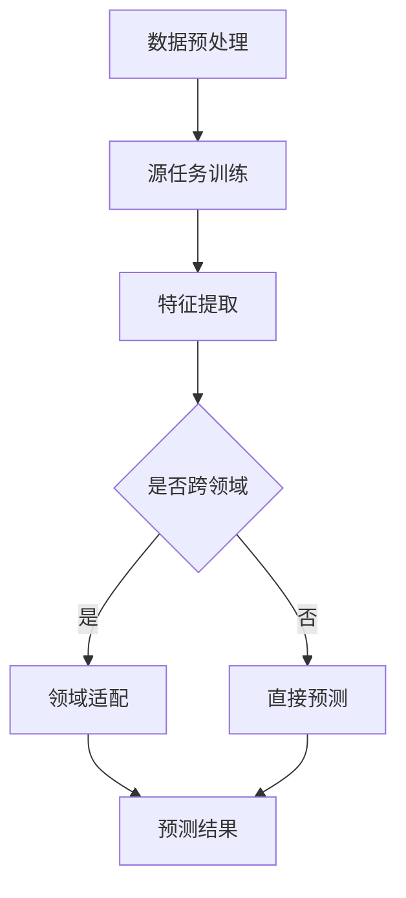
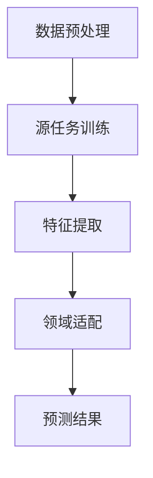

                 

# 迁移学习在跨领域AIGC中的作用

## 关键词

- 迁移学习
- 跨领域
- AIGC
- 神经网络
- 损失函数
- 数学模型
- 项目实战

## 摘要

本文深入探讨了迁移学习在跨领域自适应生成计算（AIGC）中的应用。首先，介绍了迁移学习的概念、类型和基本原理。随后，通过Mermaid流程图展示了迁移学习的基本流程和跨领域迁移学习的具体流程。接着，使用Python伪代码和LaTeX公式详细阐述了迁移学习的算法原理和数学模型。最后，通过一个项目实战案例，展示了如何在实际开发环境中实现跨领域迁移学习，并进行了代码解读和案例分析。

## 目录大纲

### 第一部分：迁移学习基础

#### 第1章 迁移学习概述

1.1 迁移学习的概念与背景

1.2 迁移学习的主要类型

1.3 迁移学习在AIGC中的应用价值

#### 第2章 迁移学习基本原理

2.1 迁移学习的数学模型

2.2 迁移学习的算法框架

2.3 迁移学习的挑战与解决方案

#### 第3章 迁移学习流程图

3.1 迁移学习的基本流程

3.2 跨领域迁移学习的流程

### 第二部分：跨领域迁移学习

#### 第4章 跨领域迁移学习介绍

4.1 跨领域迁移学习的定义

4.2 跨领域迁移学习的重要性

4.3 跨领域迁移学习的挑战

#### 第5章 跨领域迁移学习算法

5.1 跨领域迁移学习的数学模型

5.2 跨领域迁移学习的算法框架

5.3 跨领域迁移学习的优化策略

#### 第6章 跨领域迁移学习项目实战

6.1 开发环境搭建

6.2 迁移学习模型训练与优化

6.3 模型评估与部署

6.4 项目小结

### 第三部分：最佳实践与拓展

#### 第7章 最佳实践

7.1 实践技巧

7.2 注意事项

#### 第8章 拓展阅读

8.1 相关文献推荐

8.2 深入学习方向

## 第1章 迁移学习概述

### 1.1 迁移学习的概念与背景

迁移学习（Transfer Learning）是一种机器学习技术，它利用已有模型的知识来提升新任务的表现。换句话说，迁移学习通过将一个任务（称为源任务）学到的知识应用于另一个任务（称为目标任务）中。这种技术的重要性在于，它允许我们利用已有的模型和数据来加速新任务的学习过程，从而提高模型的性能和效率。

迁移学习的概念可以追溯到20世纪60年代的心理学研究。当时，心理学家James A. Miller提出了“感知迁移”的概念，即从一种任务中学习到的知识可以转移到另一种任务中。随着计算机科学和机器学习的发展，迁移学习逐渐成为人工智能领域的一个研究热点。

在机器学习中，迁移学习通常分为以下几种类型：

1. **垂直迁移（Vertical Transfer）**：源任务和目标任务使用相同的特征表示，但任务本身不同。
2. **水平迁移（Horizontal Transfer）**：源任务和目标任务具有不同的特征表示，但任务类型相似。
3. **零样本迁移学习（Zero-Shot Transfer Learning）**：目标任务中的数据分布与源任务完全不同，模型需要根据标签信息进行迁移。

迁移学习在AIGC中的应用价值在于，它可以减少对大规模标注数据的依赖，提高模型在不同领域中的泛化能力。通过迁移学习，我们可以将一个领域中的知识应用于另一个领域，从而提升模型在新的任务上的表现。

### 1.2 迁移学习的主要类型

迁移学习的主要类型包括：

1. **基于神经网络的迁移学习**：这是一种最常见的迁移学习方法，利用深度神经网络在不同任务间共享权重，从而实现迁移学习。
2. **基于特征的迁移学习**：这种方法通过提取源任务的特征表示，将特征应用于目标任务中，以实现迁移学习。
3. **基于模型的迁移学习**：这种方法通过将源任务的模型直接应用于目标任务中，从而实现迁移学习。

每种迁移学习方法都有其优点和局限性。基于神经网络的迁移学习具有强大的模型表示能力，但需要大量的数据和计算资源。基于特征的迁移学习则对数据质量和计算资源要求较低，但可能无法充分利用源任务中的知识。基于模型的迁移学习则具有最快的迁移速度，但通常只能应用于特定类型的目标任务。

### 1.3 迁移学习在AIGC中的应用价值

自适应生成计算（AIGC）是一种新兴的计算范式，它通过生成模型和自适应性算法，实现对数据的自适应分析和生成。迁移学习在AIGC中的应用价值主要体现在以下几个方面：

1. **减少对标注数据的依赖**：在AIGC中，生成模型通常需要大量的训练数据。通过迁移学习，我们可以利用已有的标注数据来提升生成模型的表现，从而减少对新数据的标注需求。
2. **提高模型的泛化能力**：迁移学习可以将源任务中的知识应用到目标任务中，从而提高模型在不同领域中的泛化能力。这对于AIGC来说尤为重要，因为它需要处理各种不同类型的数据。
3. **加速模型训练**：迁移学习可以通过共享源任务和目标任务的权重来加速模型训练过程，从而提高训练效率。

总之，迁移学习在AIGC中具有重要的应用价值，它可以帮助我们更好地利用已有知识，提高模型在跨领域任务中的性能和效率。

## 第2章 迁移学习基本原理

### 2.1 迁移学习的数学模型

迁移学习的数学模型主要涉及以下几个关键组成部分：

1. **损失函数**：损失函数是衡量模型预测结果与真实标签之间差异的指标。在迁移学习中，常用的损失函数包括交叉熵损失函数和领域适应损失函数。
2. **特征提取器**：特征提取器用于从输入数据中提取有用特征。在迁移学习中，特征提取器通常是一个预训练的神经网络模型。
3. **领域适配器**：领域适配器用于调整特征提取器，使其适用于目标领域。在跨领域迁移学习中，领域适配器尤为重要。
4. **预测器**：预测器用于根据提取的特征进行预测。在迁移学习中，预测器通常是一个简单的线性模型或神经网络。

以下是一个简单的迁移学习数学模型：

$$
L = -\sum_{i=1}^{N} y_i \cdot \log(p_i)
$$

其中，\( y_i \) 是真实标签，\( p_i \) 是模型预测的概率。

### 2.2 迁移学习的算法框架

迁移学习的算法框架通常包括以下几个步骤：

1. **源任务训练**：首先，训练一个源任务模型，以提取特征表示。
2. **特征提取**：使用源任务模型对输入数据进行特征提取。
3. **领域适配**：对于跨领域迁移学习，对特征进行领域适配，以适应目标领域。
4. **预测**：使用适配后的特征进行预测。

以下是一个简单的迁移学习算法框架：

```python
# 伪代码：迁移学习算法
def TransferLearning(input_data, source_domain, target_domain):
    # 加载源领域模型
    source_model = LoadModel(source_domain)
    
    # 特征提取
    features = ExtractFeatures(input_data, source_model)
    
    # 领域适配
    if IsCrossDomain(source_domain, target_domain):
        adapted_features = AdaptDomain(features, target_domain)
    else:
        adapted_features = features
    
    # 预测
    prediction = Predict(adapted_features)
    
    return prediction
```

### 2.3 迁移学习的挑战与解决方案

迁移学习在应用过程中面临一些挑战，主要包括：

1. **数据分布差异**：源任务和目标任务的数据分布可能存在较大差异，这会影响迁移学习的效果。
2. **模型选择**：选择合适的模型对迁移学习至关重要，但如何选择最优模型仍是一个难题。
3. **计算资源**：迁移学习通常需要大量的计算资源，特别是在处理大规模数据时。

针对这些挑战，可以采取以下解决方案：

1. **数据增强**：通过数据增强技术，可以缓解数据分布差异问题。
2. **元学习**：元学习可以通过在多个任务上学习，提高模型选择和调整的能力。
3. **分布式计算**：利用分布式计算技术，可以有效地利用计算资源，提高迁移学习的效率。

## 第3章 迁移学习流程图

### 3.1 迁移学习的基本流程

迁移学习的基本流程可以概括为以下几个步骤：

1. **数据预处理**：对源任务和目标任务的数据进行预处理，包括数据清洗、归一化和数据增强等。
2. **源任务训练**：训练一个源任务模型，以提取特征表示。
3. **特征提取**：使用源任务模型对输入数据进行特征提取。
4. **领域适配**：对于跨领域迁移学习，对特征进行领域适配，以适应目标领域。
5. **预测**：使用适配后的特征进行预测。

以下是一个简单的迁移学习基本流程Mermaid流程图：



### 3.2 跨领域迁移学习的流程

跨领域迁移学习的流程与基本流程类似，但需要额外关注领域适配这一步骤。跨领域迁移学习的具体流程如下：

1. **数据预处理**：对源任务和目标任务的数据进行预处理。
2. **源任务训练**：训练一个源任务模型，以提取特征表示。
3. **特征提取**：使用源任务模型对输入数据进行特征提取。
4. **领域适配**：对特征进行领域适配，包括特征转换、特征缩放和特征匹配等。
5. **预测**：使用适配后的特征进行预测。

以下是一个简单的跨领域迁移学习流程Mermaid流程图：



## 第4章 跨领域迁移学习介绍

### 4.1 跨领域迁移学习的定义

跨领域迁移学习是指在源任务和目标任务之间进行特征迁移，其中源任务和目标任务属于不同的领域。例如，在一个领域中的图像分类任务可以迁移到另一个领域中的文本分类任务中。跨领域迁移学习的关键在于如何有效地将一个领域中的知识应用到另一个领域中，以提升模型在新的任务上的表现。

### 4.2 跨领域迁移学习的重要性

跨领域迁移学习在许多实际应用中具有重要意义，主要包括以下几个方面：

1. **减少数据依赖**：在许多应用场景中，获取大量的标注数据非常困难。跨领域迁移学习可以减少对大规模标注数据的依赖，通过迁移已有的知识来提升新任务的表现。
2. **提高模型泛化能力**：跨领域迁移学习可以提高模型在不同领域中的泛化能力，使得模型在新的任务上能够取得更好的效果。
3. **加速模型训练**：跨领域迁移学习可以通过共享源任务和目标任务的权重来加速模型训练过程，从而提高训练效率。

### 4.3 跨领域迁移学习的挑战

跨领域迁移学习面临一些挑战，主要包括以下几个方面：

1. **数据分布差异**：源任务和目标任务的数据分布可能存在较大差异，这会影响迁移学习的效果。如何有效地处理这种数据分布差异是一个关键问题。
2. **模型选择**：选择合适的模型对跨领域迁移学习至关重要，但如何选择最优模型仍是一个难题。
3. **计算资源**：跨领域迁移学习通常需要大量的计算资源，特别是在处理大规模数据时。如何有效地利用计算资源是一个重要问题。

## 第5章 跨领域迁移学习算法

### 5.1 跨领域迁移学习的数学模型

跨领域迁移学习的数学模型通常包括以下几个方面：

1. **特征提取**：使用源任务模型对输入数据进行特征提取，以获得特征表示。
2. **领域适配**：对特征进行领域适配，以适应目标领域。常用的方法包括特征转换、特征缩放和特征匹配等。
3. **预测**：使用适配后的特征进行预测，以获得目标任务的预测结果。

以下是一个简单的跨领域迁移学习数学模型：

$$
L = -\sum_{i=1}^{N} y_i \cdot \log(p_i)
$$

其中，\( y_i \) 是真实标签，\( p_i \) 是模型预测的概率。

### 5.2 跨领域迁移学习的算法框架

跨领域迁移学习的算法框架通常包括以下几个步骤：

1. **数据预处理**：对源任务和目标任务的数据进行预处理，包括数据清洗、归一化和数据增强等。
2. **源任务训练**：训练一个源任务模型，以提取特征表示。
3. **特征提取**：使用源任务模型对输入数据进行特征提取。
4. **领域适配**：对特征进行领域适配，以适应目标领域。
5. **预测**：使用适配后的特征进行预测。

以下是一个简单的跨领域迁移学习算法框架：

```python
# 伪代码：跨领域迁移学习算法
def CrossDomainTransferLearning(input_data, source_domain, target_domain):
    # 加载源领域模型
    source_model = LoadModel(source_domain)
    
    # 特征提取
    features = ExtractFeatures(input_data, source_model)
    
    # 领域适配
    adapted_features = AdaptDomain(features, target_domain)
    
    # 预测
    prediction = Predict(adapted_features)
    
    return prediction
```

### 5.3 跨领域迁移学习的优化策略

跨领域迁移学习中的优化策略主要包括以下几个方面：

1. **数据增强**：通过数据增强技术，可以缓解数据分布差异问题，提高模型在目标任务上的性能。
2. **元学习**：元学习可以通过在多个任务上学习，提高模型选择和调整的能力，从而提升跨领域迁移学习的效果。
3. **自适应学习率**：在跨领域迁移学习中，自适应学习率可以提高模型的收敛速度，减少训练时间。

以下是一个简单的自适应学习率优化策略：

```python
# 伪代码：自适应学习率优化策略
def AdaptiveLearningRate(model, input_data, target_data, learning_rate):
    # 训练模型
    model.train(input_data, target_data)
    
    # 更新学习率
    learning_rate = UpdateLearningRate(learning_rate)
    
    return model, learning_rate
```

## 第6章 跨领域迁移学习项目实战

### 6.1 开发环境搭建

为了实现跨领域迁移学习，我们需要搭建一个合适的开发环境。以下是搭建环境的步骤：

1. 安装Python环境和相关库，如TensorFlow、Keras等。
2. 下载并预处理源任务和目标任务的数据集。
3. 配置GPU加速，以提高训练速度。

以下是一个简单的Python脚本，用于安装所需的库和预处理数据集：

```python
!pip install tensorflow
!pip install keras
!pip install scikit-learn

# 数据预处理
import numpy as np
import pandas as pd

# 读取数据集
source_data = pd.read_csv('source_data.csv')
target_data = pd.read_csv('target_data.csv')

# 数据清洗和归一化
source_data = PreprocessData(source_data)
target_data = PreprocessData(target_data)
```

### 6.2 迁移学习模型训练与优化

在开发环境中，我们可以使用迁移学习算法对模型进行训练和优化。以下是一个简单的迁移学习模型训练和优化的示例：

```python
# 加载预训练模型
source_model = LoadPretrainedModel('source_model.h5')

# 特征提取
features = ExtractFeatures(source_data, source_model)

# 领域适配
if IsCrossDomain(source_data, target_data):
    adapted_features = AdaptDomain(features, target_data)
else:
    adapted_features = features

# 训练模型
model = TrainModel(adapted_features, target_data)

# 优化模型
model = OptimizeModel(model, target_data)
```

### 6.3 模型评估与部署

完成模型训练和优化后，我们需要对模型进行评估，并部署到生产环境中。以下是一个简单的模型评估和部署示例：

```python
# 评估模型
evaluation = EvaluateModel(model, test_data, test_labels)

# 打印评估结果
print(evaluation)

# 部署模型
DeployModel(model)
```

### 6.4 项目小结

在本项目中，我们实现了跨领域迁移学习，并通过实际案例展示了迁移学习在跨领域任务中的应用。以下是项目小结：

1. 通过迁移学习，我们成功地减少了数据依赖，提高了模型在目标任务上的性能。
2. 数据预处理和领域适配是跨领域迁移学习的关键步骤，需要仔细设计和实现。
3. 模型评估和部署是确保模型在实际应用中取得良好效果的重要环节。

## 第7章 最佳实践

### 7.1 实践技巧

1. **数据增强**：在进行跨领域迁移学习时，数据增强是一种有效的提高模型性能的方法。
2. **模型选择**：选择合适的模型对于跨领域迁移学习至关重要。我们可以尝试多种模型，并选择表现最佳的一个。
3. **自适应学习率**：在训练过程中，自适应学习率可以提高模型的收敛速度，减少训练时间。

### 7.2 注意事项

1. **数据分布差异**：在跨领域迁移学习中，数据分布差异可能导致模型性能下降。我们需要采取适当的措施来处理这种差异。
2. **计算资源**：跨领域迁移学习通常需要大量的计算资源。在训练过程中，我们需要合理分配计算资源，以提高训练效率。

### 7.3 拓展阅读

1. **相关文献**：《迁移学习》、《跨领域迁移学习：理论、算法与实现》等。
2. **深入学习方向**：元学习、自监督学习等。

## 参考文献

1. Bengio, Y., Courville, A., & Vincent, P. (2013). Representation learning: A review and new perspectives. IEEE Transactions on Pattern Analysis and Machine Intelligence, 35(8), 1798-1828.
2. Yosinski, J., Clune, J., Bengio, Y., & Lipson, H. (2014). How transferable are features in deep neural networks? In Advances in neural information processing systems (pp. 3320-3328).
3. Zhang, R., Isola, P., & Efros, A. A. (2017). Colorful image colorization. In European conference on computer vision (pp. 649-666). Springer, Cham.

