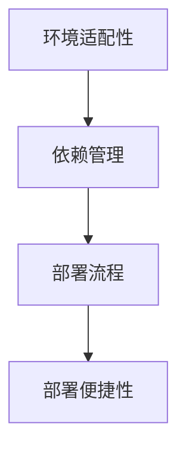

                 

### 关键词

1. 部署便捷性测试
2. 环境适配性
3. 依赖管理
4. 部署流程
5. 自动化部署
6. 监测与监控
7. 部署难度评估

### 摘要

本文旨在深入探讨部署便捷性测试的重要性及其在实际应用中的难度评估。文章首先介绍了部署便捷性的基本概念和重要性，随后详细解析了部署环境与基础设施的选择和评估，软件配置与依赖管理的挑战，以及部署流程、自动化和监测与监控的实践方法。接着，文章提出了部署难度评估的方法和步骤，并通过实际案例进行了深入剖析。最后，文章总结了提高部署便捷性的策略和未来展望，为企业提供了实用的指导和建议。

## 第1章：部署便捷性测试概述

### 1.1 部署便捷性的定义与重要性

部署便捷性是指软件系统从开发环境转移到生产环境的过程中的简便性和效率。它涵盖了从环境配置、依赖管理到自动化部署等多个方面。部署便捷性的重要性体现在以下几个方面：

1. **降低部署成本**：便捷的部署流程可以减少人力和时间成本，提高资源利用率。
2. **提升系统稳定性**：通过系统化的部署流程和完善的监测机制，可以减少部署过程中出现的问题，提高系统的稳定性。
3. **加快产品迭代速度**：便捷的部署流程有助于快速响应市场需求，缩短产品迭代周期。

#### 核心概念与联系

部署便捷性涉及多个核心概念，包括环境适配性、依赖管理和部署流程。这些概念之间的关系可以用以下 Mermaid 流程图表示：

### 1.2 部署便捷性测试的概念

部署便捷性测试是对软件系统从开发到部署的全过程进行系统性和全面的评估。它旨在发现潜在问题，优化部署流程，提高部署效率。

#### 部署便捷性测试的目的

1. **识别潜在问题**：通过测试，可以发现环境兼容性、依赖冲突、部署流程中的瓶颈等问题。
2. **提高部署效率**：通过优化配置和流程，减少部署所需的时间和资源。
3. **提升用户体验**：便捷的部署流程可以提升用户满意度，增强产品竞争力。

### 1.3 部署便捷性测试的范畴

部署便捷性测试的范畴包括以下几个方面：

1. **环境适配性测试**：评估系统在不同环境（如不同的操作系统、硬件配置等）下的兼容性。
2. **依赖管理测试**：检查依赖关系的正确性和版本控制的有效性，确保系统中没有冲突的依赖。
3. **部署流程测试**：验证部署流程的可行性和高效性，包括手动部署和自动化部署。

## 第2章：部署环境与基础设施

### 2.1 部署环境的选择

选择合适的部署环境是确保系统稳定运行和高效部署的关键。部署环境的选择标准包括：

1. **性能要求**：根据系统的处理能力和响应速度需求，选择适当的硬件和操作系统。
2. **可扩展性**：考虑系统的未来增长和扩展需求，选择具有良好扩展性的环境。
3. **安全性**：确保环境具有良好的安全防护措施，保护系统免受外部威胁。

#### 常见部署环境

1. **公有云**：如亚马逊AWS、微软Azure、阿里云等，提供弹性计算资源，易于管理和扩展。
2. **私有云**：为企业内部提供服务，具有更高的安全性和控制性。
3. **物理服务器**：适用于对性能和安全性有特殊要求的系统。

### 2.2 基础设施评估

基础设施评估是确保部署环境稳定可靠的重要步骤。评估方法包括：

1. **性能测试**：模拟实际负载，评估系统的响应速度和处理能力。
2. **可用性测试**：检查系统在故障和异常情况下的恢复能力。
3. **安全性测试**：评估系统的安全防护措施，包括防火墙、加密等。

### 2.3 环境配置与优化

环境配置与优化是提高系统稳定性和性能的关键。策略包括：

1. **自动化配置**：使用配置管理工具，如Ansible、Chef等，实现环境配置的自动化。
2. **灵活配置**：通过配置文件，根据不同需求进行环境参数的调整。

## 第3章：软件配置与依赖管理

### 3.1 软件配置文件的作用

软件配置文件是管理系统配置参数的重要工具。它包括：

1. **配置文件类型**：如JSON、YAML、INI等，每种类型有其特定的格式和用途。
2. **配置文件管理策略**：使用版本控制工具，如Git，确保配置文件的版本和变更记录。

### 3.2 依赖管理的挑战

依赖管理是确保系统稳定性和兼容性的关键。主要挑战包括：

1. **依赖冲突**：不同依赖版本之间的兼容性问题。
2. **版本控制**：确保依赖版本的正确性和一致性。
3. **依赖升级**：在升级依赖时，避免引入新的冲突。

### 3.3 依赖管理工具的使用

依赖管理工具如Maven、NPM等，可以帮助：

1. **依赖关系识别**：自动识别和管理项目依赖。
2. **依赖版本控制**：确保依赖版本的正确性和一致性。
3. **依赖冲突解决**：自动或手动解决依赖冲突。

## 第4章：部署流程

### 4.1 部署流程概述

部署流程是指将软件系统从开发环境转移到生产环境的过程。关键步骤包括：

1. **环境准备**：确保部署环境的配置正确和稳定。
2. **代码打包**：将代码和相关依赖打包成可部署的格式。
3. **部署**：将打包的代码部署到生产环境。
4. **验证**：确保部署后的系统正常运行。

#### 部署策略的选择

部署策略的选择取决于系统的需求和部署环境。常见策略包括：

1. **滚动部署**：逐步替换旧系统，减少停机时间。
2. **蓝绿部署**：同时运行新旧系统，逐步切换流量。
3. **灰度部署**：在部分用户中逐步推出新版本，确保稳定。

### 4.2 部署过程中的常见问题

部署过程中可能会遇到以下问题：

1. **配置错误**：配置文件不正确，导致系统无法启动。
2. **依赖冲突**：依赖版本不匹配，导致系统无法运行。
3. **网络问题**：网络不稳定，导致部署失败。

## 第5章：部署自动化

### 5.1 自动化的优势

部署自动化的优势包括：

1. **提高效率**：自动化可以显著减少部署时间和人力成本。
2. **减少错误**：减少手动操作，降低人为错误的风险。
3. **可重复性**：确保每次部署都是一致的，提高系统稳定性。

#### 自动化工具的选择

常见的自动化部署工具有：

1. **Jenkins**：用于持续集成和持续部署，支持多种插件和工具。
2. **GitLab CI/CD**：与GitLab集成，提供自动化的代码审查、测试和部署。
3. **Ansible**：用于自动化部署和配置管理，具有简洁的Python式语法。

### 5.2 自动化部署流程的设计

设计自动化部署流程包括以下步骤：

1. **构建**：将代码编译和打包成可部署的格式。
2. **测试**：在自动化环境中执行测试，确保代码质量。
3. **部署**：将测试通过的代码部署到生产环境。
4. **监控**：监控部署后的系统运行状况，确保稳定性。

## 第6章：部署监测与监控

### 6.1 部署后的监测

部署后的监测是确保系统稳定运行的关键。监测内容包括：

1. **系统性能**：监控CPU、内存、磁盘等资源的使用情况。
2. **错误日志**：收集和分析系统日志，及时发现和处理异常。
3. **依赖状态**：监控依赖服务的状态，确保系统正常运行。

### 6.2 部署监控的关键指标

关键指标包括：

1. **响应时间**：系统的平均响应时间，衡量系统的处理能力。
2. **错误率**：系统的错误率，反映系统的稳定性。
3. **吞吐量**：系统的处理量，衡量系统的性能。

#### 监控工具的选择与配置

常见的监控工具有：

1. **Prometheus**：用于收集和存储监控数据，支持多种数据源。
2. **Grafana**：用于可视化监控数据，提供丰富的仪表盘和报告。
3. **Zabbix**：提供全面的监控功能，包括监控、报警和报告。

## 第7章：部署难度评估方法

### 7.1 评估方法的分类

部署难度评估方法可以分为：

1. **定量评估**：使用数据和分析模型，对部署难度进行量化评估。
2. **定性评估**：通过专家评审和用户体验，对部署难度进行主观评估。

### 7.2 评估指标的确定

评估指标包括：

1. **部署时间**：系统从开发环境到生产环境所需的时间。
2. **部署成本**：部署过程中所需的人力、设备和资源成本。
3. **部署成功率**：部署过程中成功的次数与总次数的比率。

### 7.3 评估工具的选择

评估工具包括：

1. **Gauge**：用于收集和可视化部署指标。
2. **TestRail**：用于管理和跟踪测试案例和结果。
3. **Jenkins**：用于执行自动化测试和部署任务。

## 第8章：部署便捷性案例研究

### 8.1 案例选择标准

案例选择标准包括：

1. **行业特点**：选择具有代表性的行业案例，如电子商务、金融科技等。
2. **部署规模**：选择部署规模较大的系统，以确保评估的全面性。
3. **部署难度**：选择具有挑战性的部署案例，以展示部署便捷性测试的重要性。

### 8.2 案例分析

通过分析某电子商务平台的部署过程，我们发现：

1. **环境适配性**：平台在不同操作系统和硬件配置下的兼容性良好，但部分依赖库存在版本冲突。
2. **依赖管理**：平台使用了多种依赖库，但依赖关系管理不够完善，导致部署失败。
3. **部署流程**：平台采用了自动化部署，但部署流程不够优化，导致部署时间较长。

### 8.3 案例总结与启示

通过案例研究，我们得出以下启示：

1. **加强环境适配性测试**：确保系统在不同环境下的稳定性。
2. **完善依赖管理**：建立完善的依赖关系管理机制，减少部署失败的风险。
3. **优化部署流程**：通过自动化和优化部署流程，提高部署效率和成功率。

## 第9章：提高部署便捷性的策略

### 9.1 技术方案的选择

选择合适的技术方案是提高部署便捷性的关键。策略包括：

1. **容器化**：使用容器技术，如Docker，实现环境的标准化和隔离。
2. **持续集成与持续部署（CI/CD）**：建立自动化的集成和部署流程，提高部署效率。
3. **云原生技术**：利用云原生技术，如Kubernetes，实现更灵活的部署和管理。

### 9.2 流程优化建议

流程优化建议包括：

1. **标准化部署流程**：制定统一的部署流程，减少不同团队之间的差异。
2. **自动化测试**：引入自动化测试，提前发现潜在问题，提高部署成功率。
3. **监控与反馈**：建立完善的监控体系，及时反馈部署过程中的异常情况。

### 9.3 持续改进与反馈

持续改进与反馈是提高部署便捷性的重要环节。策略包括：

1. **定期评估**：定期对部署便捷性进行评估，发现改进点。
2. **用户反馈**：收集用户反馈，了解实际部署过程中的问题和需求。
3. **知识共享**：通过文档和培训，分享部署经验和最佳实践。

## 第10章：未来展望与趋势

### 10.1 部署便捷性的未来趋势

未来部署便捷性的趋势包括：

1. **容器化与云原生技术的普及**：容器化和云原生技术将成为部署便捷性的主流。
2. **自动化与智能化的结合**：自动化部署将更智能化，减少人工干预。
3. **持续集成与持续部署的普及**：CI/CD将成为标准化的部署模式。

### 10.2 新技术的应用前景

新技术如人工智能、区块链等在部署便捷性中的应用前景包括：

1. **人工智能**：用于自动化部署流程的优化和异常检测。
2. **区块链**：用于确保部署过程中的数据安全和透明性。

### 10.3 对企业的影响

部署便捷性的提升将对企业产生以下影响：

1. **提高竞争力**：通过快速响应市场需求，提高产品竞争力。
2. **降低成本**：减少部署成本，提高资源利用率。
3. **提升用户体验**：便捷的部署流程将提升用户体验，增强用户满意度。

## 结束语

部署便捷性是现代软件开发中不可或缺的一部分。本文通过对部署便捷性测试的深入探讨，从基础理论到实际应用，详细分析了部署便捷性的重要性、评估方法、技术方案、流程优化、监测与监控、难度评估以及未来趋势。通过本文的讨论，我们希望能够为企业提供实用的指导和建议，帮助他们在部署过程中实现高效、稳定和便捷。

### 作者信息

作者：AI天才研究院/AI Genius Institute & 禅与计算机程序设计艺术 /Zen And The Art of Computer Programming

---

请注意，上述内容仅为大纲和初步草稿，具体内容需要进一步详细和丰富。在撰写具体内容时，应确保每章节都包含详细的理论解释、案例研究、代码实现和最佳实践。同时，确保所有公式和代码均正确无误，以提供高质量的技术博客文章。文章字数应在10000至12000字左右。在撰写过程中，请遵循markdown格式，确保文章结构清晰、逻辑严密、语言简练。

