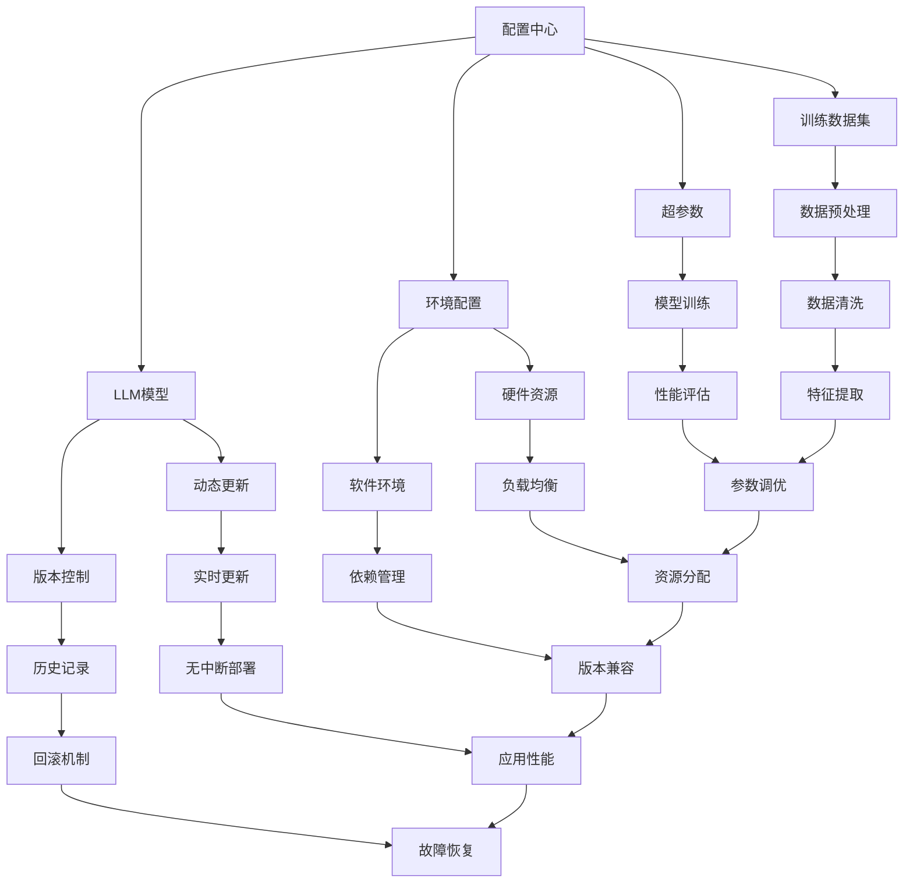

                 

### 文章标题：配置中心简化LLM应用的配置管理

#### 关键词：配置中心、LLM、配置管理、架构设计、性能优化、安全保障

> _作者：AI天才研究院/AI Genius Institute & 禅与计算机程序设计艺术 /Zen And The Art of Computer Programming_

本文将深入探讨如何利用配置中心简化大型语言模型（LLM）应用的配置管理，涵盖从背景介绍、核心概念与联系、到实际案例分析和最佳实践的全过程。我们将通过逻辑清晰、结构紧凑的技术语言，帮助读者全面理解配置中心在LLM应用中的重要性。

## 摘要

配置中心作为一种现代应用架构组件，能够有效简化配置管理流程，提高系统灵活性。本文主要介绍配置中心的基本概念、架构设计，并结合大型语言模型（LLM）的配置管理需求，详细阐述了配置中心在LLM应用中的作用。我们将通过具体案例，展示配置中心如何简化LLM应用的配置管理，并提供一系列最佳实践，以指导实际应用中的配置优化和安全保障。

---

本文将分为以下几个部分：

1. **背景介绍**：介绍配置中心的基本概念和作用，以及LLM应用在当前技术领域的重要性。
2. **核心概念与联系**：通过Mermaid流程图展示配置中心与LLM应用的连接方式。
3. **配置中心架构设计**：详细讲解配置中心的架构设计原理和关键技术。
4. **配置管理与LLM结合的应用场景**：分析配置中心在LLM应用中的具体应用场景和优势。
5. **配置管理与LLM结合的案例研究**：通过实际案例展示配置中心在LLM应用中的实践效果。
6. **性能优化与安全保障**：讨论配置中心和LLM应用性能优化和安全保障的最佳实践。
7. **未来展望与挑战**：探讨配置中心与LLM应用的未来发展趋势和潜在挑战。
8. **小结与拓展阅读**：总结本文的核心内容，并提供进一步学习和研究的资源。

### 背景介绍

#### 配置中心的基本概念和作用

配置中心（Configuration Center）作为一种分布式应用架构中的核心组件，主要用于集中管理和维护系统的配置信息。配置信息是应用系统中至关重要的部分，包括各种配置参数、环境变量、服务地址、数据库连接信息等。传统的配置管理往往需要手动修改配置文件，或者在多台服务器间同步配置信息，这种方式不仅繁琐且容易出错。配置中心的引入，大大简化了配置管理的复杂性，提高了系统的可维护性和灵活性。

配置中心的基本作用可以归纳为以下几点：

1. **集中化管理**：配置中心提供了一种集中的管理界面，使得开发者或运维人员能够方便地修改和管理系统的配置信息。
2. **动态更新**：配置中心支持配置信息的动态更新，无需重启应用或服务器，即可实时生效，提高了系统的响应速度和灵活性。
3. **版本控制**：配置中心通常具备版本控制功能，可以记录每次配置修改的详细记录，便于追踪和回滚。
4. **权限控制**：配置中心提供细粒度的权限控制，确保只有授权用户才能修改或查看配置信息，增强了系统的安全性。
5. **分布式部署**：配置中心支持多节点分布式部署，确保配置信息的可靠性和可用性，即使某个节点发生故障，配置中心仍能正常工作。

#### LLM应用的重要性

大型语言模型（LLM，Large Language Model）是近年来人工智能领域的重要突破之一。LLM具有强大的自然语言理解和生成能力，可以应用于各种场景，如自然语言处理、智能客服、文本生成、机器翻译等。随着LLM技术的不断进步和应用场景的扩大，其对配置管理的需求也越来越高。

LLM应用的重要性主要体现在以下几个方面：

1. **复杂的模型结构**：LLM通常包含数亿甚至数十亿个参数，模型结构复杂，需要精细的配置来优化性能和效果。
2. **动态的环境需求**：不同的应用场景和任务可能需要不同的配置，如训练数据集、超参数设置、模型架构等，配置中心的动态更新功能能够满足这一需求。
3. **高性能要求**：LLM应用往往要求高并发处理能力和低延迟响应，配置中心可以优化系统资源分配和负载均衡，提高整体性能。
4. **跨平台部署**：LLM应用可能需要在不同的平台（如CPU、GPU、Docker等）上部署，配置中心提供了统一的配置管理界面，简化了部署过程。
5. **安全性保障**：随着LLM应用的重要性和价值的提升，其安全性也成为了关键问题。配置中心提供的权限控制和版本控制功能，有助于保障系统的安全性和可靠性。

通过配置中心的引入，LLM应用的配置管理变得更加高效和灵活。配置中心不仅能够简化配置管理流程，提高系统可维护性和灵活性，还能够为LLM应用提供更强大的性能优化和安全保障能力，从而推动LLM技术在各个领域的广泛应用。

#### 核心概念与联系

为了更好地理解配置中心在LLM应用中的作用，我们需要先梳理一些核心概念，并展示它们之间的联系架构。以下是配置中心和LLM应用中几个关键概念的解释及其关系：

1. **配置中心**：配置中心是一个集中管理和维护配置信息的平台，它允许开发者和运维人员以统一的方式管理不同环境的配置参数。
2. **LLM模型**：LLM是指大型语言模型，它是一种复杂的深度学习模型，用于处理和生成自然语言文本。
3. **训练数据集**：训练数据集是用于训练LLM模型的文本数据，其质量和数量直接影响模型的性能。
4. **超参数**：超参数是调节模型性能的参数，如学习率、批量大小、迭代次数等。
5. **环境配置**：环境配置包括硬件环境（如CPU、GPU等）和软件环境（如操作系统、库依赖等）。
6. **版本控制**：版本控制是配置中心的一项重要功能，它允许用户跟踪和管理配置的修改历史。
7. **动态更新**：动态更新是指配置中心能够实时更新配置，而无需重启应用或系统。

下面是一个用Mermaid绘制的流程图，展示了配置中心与LLM应用的核心概念之间的联系：



这个Mermaid流程图展示了配置中心如何与LLM模型、训练数据集、超参数、环境配置等核心概念相联系。通过配置中心，LLM模型可以动态更新配置，实现实时优化和部署；版本控制功能则可以帮助跟踪和管理配置的修改历史，确保系统的稳定性；而动态更新功能则实现了无中断部署，提高了系统的可用性和灵活性。

在配置中心和LLM应用的实际结合中，这些核心概念之间的联系至关重要。配置中心不仅能够简化配置管理流程，提高系统的可维护性，还能通过动态更新和版本控制，确保模型的高效运行和系统的稳定性。

通过上述核心概念与联系的分析，我们可以更清楚地看到配置中心在LLM应用中的重要性。配置中心的引入，不仅简化了配置管理，还提升了系统的灵活性和可靠性，为LLM应用的广泛应用提供了有力支持。

### 配置中心架构设计

配置中心作为简化LLM应用配置管理的关键组件，其架构设计至关重要。一个高效的配置中心架构应具备以下几个核心组成部分：数据存储、配置分发、动态更新、版本控制和安全保障。以下是配置中心架构的详细设计与实现方法。

#### 数据存储

数据存储是配置中心的基础，它负责存储所有配置信息，包括静态配置和动态配置。选择合适的存储方案至关重要。以下是几种常见的数据存储方案及其优缺点：

1. **关系数据库**：
   - 优点：数据结构清晰，易于管理和查询；支持复杂查询和报表生成。
   - 缺点：读写性能较低，不适合高并发场景；数据迁移和扩展较复杂。

2. **NoSQL数据库**：
   - 优点：高读写性能，支持海量数据存储；灵活性高，易于扩展。
   - 缺点：数据结构较为简单，查询能力有限；数据一致性和事务支持较弱。

3. **分布式缓存**：
   - 优点：读写性能极高，适用于高并发场景；数据一致性较好，支持分布式架构。
   - 缺点：数据存储容量有限，无法完全替代数据库；缓存一致性管理复杂。

在实际应用中，可以结合以上三种方案，采用混合存储架构。例如，使用关系数据库存储核心配置信息，使用NoSQL数据库存储日志和临时配置，使用分布式缓存提升配置读取速度。这样可以充分发挥各类存储方案的优势，提高系统的整体性能。

#### 配置分发

配置分发的目的是将配置信息实时推送到各个应用实例。一个高效的配置分发机制应具备以下特点：

1. **基于HTTP的拉模式**：
   - 优点：简单易实现，适用于配置变更不频繁的场景。
   - 缺点：应用需要主动拉取配置，存在一定延迟；不适用于高并发场景。

2. **基于长连接的推模式**：
   - 优点：实时推送配置变更，无延迟；适用于高并发场景。
   - 缺点：实现复杂，维护成本高；需要考虑网络连接稳定性和异常处理。

在实际应用中，可以采用混合模式。例如，在配置变更不频繁的场景下，使用基于HTTP的拉模式；在配置变更频繁且对实时性要求较高的场景下，使用基于长连接的推模式。

#### 动态更新

动态更新是配置中心的核心功能之一，它允许开发者和运维人员实时修改配置，而无需重启应用或系统。实现动态更新的关键在于确保配置变更的原子性和一致性。以下是几种动态更新机制：

1. **基于文件系统的热替换**：
   - 优点：实现简单，适用于配置变更不频繁的场景。
   - 缺点：不支持多实例并发更新，可能导致数据不一致；不适用于高并发场景。

2. **基于数据库的事务处理**：
   - 优点：支持多实例并发更新，确保数据一致性；适用于高并发场景。
   - 缺点：实现复杂，性能较低；需要考虑数据库的事务管理和锁机制。

3. **基于内存的实时更新**：
   - 优点：更新速度快，无延迟；适用于高并发场景。
   - 缺点：需要维护内存数据一致性，实现复杂；需要考虑内存资源管理。

在实际应用中，可以采用混合模式。例如，对于配置变更不频繁的场景，可以使用基于文件系统的热替换；对于配置变更频繁且对实时性要求较高的场景，可以使用基于内存的实时更新。

#### 版本控制

版本控制是配置中心的重要功能之一，它允许用户跟踪和管理配置的修改历史。实现版本控制的关键在于记录每次配置变更的详细信息，并提供回滚机制。以下是几种版本控制机制：

1. **基于文件版本的版本控制**：
   - 优点：实现简单，易于理解。
   - 缺点：不支持配置项级别的版本控制；不便于管理和回滚。

2. **基于数据库版本控制的版本控制**：
   - 优点：支持配置项级别的版本控制；便于管理和回滚。
   - 缺点：实现复杂，性能较低。

3. **基于元数据的版本控制**：
   - 优点：实现简单，性能较高；支持配置项级别的版本控制。
   - 缺点：需要额外维护元数据，增加存储开销。

在实际应用中，可以采用基于元数据的版本控制。例如，为每个配置项维护一个元数据结构，记录其版本号、创建时间和修改时间等。当配置项发生变更时，更新其元数据结构，并记录变更日志。

#### 安全保障

配置中心涉及大量的敏感配置信息，其安全保障至关重要。以下是几种常见的安全保障措施：

1. **权限控制**：
   - 优点：确保只有授权用户才能访问和修改配置信息。
   - 缺点：实现复杂，需要维护权限列表。

2. **加密存储**：
   - 优点：确保配置信息在存储过程中不被窃取或篡改。
   - 缺点：增加存储和读取开销；需要定期更换密钥。

3. **访问日志**：
   - 优点：记录所有访问和修改操作，便于审计和追踪。
   - 缺点：日志文件可能非常庞大，需要定期清理。

在实际应用中，可以采用多种安全保障措施的组合。例如，为配置中心实现权限控制，确保只有授权用户才能访问和修改配置信息；同时，对敏感配置项进行加密存储，并记录详细的访问日志。

#### 案例分析

以某大型电商平台的配置中心为例，其架构设计如下：

1. **数据存储**：使用关系数据库存储核心配置信息，使用NoSQL数据库存储日志和临时配置，使用分布式缓存提升配置读取速度。
2. **配置分发**：采用基于长连接的推模式，实时推送配置变更，确保配置变更的实时性和一致性。
3. **动态更新**：采用基于内存的实时更新机制，确保配置变更的原子性和一致性，无需重启应用或系统。
4. **版本控制**：采用基于元数据的版本控制，为每个配置项维护元数据结构，记录其版本号、创建时间和修改时间等。
5. **安全保障**：实现权限控制，确保只有授权用户才能访问和修改配置信息；对敏感配置项进行加密存储，并记录详细的访问日志。

通过上述架构设计，该大型电商平台的配置中心能够高效地管理配置信息，确保系统的稳定性、可靠性和安全性。同时，配置中心为平台的快速迭代和业务扩展提供了强有力的支持。

### 配置管理与LLM结合的应用场景

配置中心在大型语言模型（LLM）应用中的重要性不容忽视。LLM模型因其结构复杂、参数众多，配置管理的需求尤为突出。配置中心通过提供集中化、动态化的配置管理，不仅能够显著简化配置过程，还能够提升LLM应用的整体性能和稳定性。以下是配置中心在LLM应用中的一些具体应用场景和优势分析：

#### 1. **训练数据集管理**

在LLM模型的训练过程中，数据集的质量和数量是决定模型性能的关键因素。配置中心可以集中管理和维护训练数据集的路径、格式、预处理步骤等配置信息。开发者可以通过配置中心动态调整数据集，如增加或删除特定类型的文本数据，实现数据集的灵活扩展和优化。此外，配置中心支持版本控制功能，可以记录每次数据集调整的历史记录，便于追踪和回滚。

**优势**：  
- **数据集灵活调整**：开发者可以快速响应不同任务需求，调整数据集内容，提升模型适应能力。  
- **版本控制**：记录数据集调整历史，便于问题排查和回溯，确保数据集管理的可追溯性。

#### 2. **超参数配置**

超参数是调节LLM模型性能的重要参数，如学习率、批量大小、迭代次数等。不同任务和场景可能需要不同的超参数设置。配置中心可以集中管理超参数配置，提供统一的调整接口，开发者和运维人员可以通过配置中心动态修改超参数，实现模型性能的实时优化。

**优势**：  
- **超参数动态调整**：配置中心支持动态调整超参数，无需重启训练任务，提高模型训练效率。  
- **全局优化**：集中管理超参数，有助于统一优化模型在不同任务和场景下的性能。

#### 3. **模型架构配置**

LLM模型的架构对性能和效果有重要影响。配置中心可以提供模型架构的配置管理，支持开发者灵活切换不同模型架构，如基于Transformer、BERT、GPT的模型。配置中心可以管理不同架构的配置细节，如层数、隐藏层大小、注意力机制等，为开发者提供便捷的模型架构调整工具。

**优势**：  
- **架构灵活切换**：配置中心支持多种模型架构的配置管理，开发者可以根据需求快速切换模型架构。  
- **架构优化**：集中管理模型架构配置，有助于模型架构的持续优化和改进。

#### 4. **硬件资源分配**

LLM模型训练和推理通常需要大量的计算资源，如CPU、GPU等。配置中心可以管理硬件资源的分配，根据任务需求和资源可用性动态调整计算资源分配。例如，在训练任务高峰期，配置中心可以自动调整GPU分配，确保任务高效执行；在推理场景下，则可以根据请求量动态调整CPU和GPU的利用率。

**优势**：  
- **资源高效利用**：动态调整计算资源，确保系统资源的高效利用。  
- **响应快速**：根据任务需求灵活调整资源，提升系统响应速度和吞吐量。

#### 5. **环境配置管理**

LLM应用的部署涉及多种环境配置，包括操作系统、库依赖、环境变量等。配置中心可以集中管理环境配置，提供统一的配置管理界面，确保环境配置的一致性和可靠性。在部署过程中，配置中心可以自动安装和配置所需库依赖，简化部署流程，减少人为错误。

**优势**：  
- **配置一致性**：统一管理环境配置，确保不同部署环境的一致性，降低配置错误风险。  
- **部署简化**：自动化配置安装和部署，提高部署效率和可靠性。

#### 6. **跨平台部署**

LLM应用可能需要在不同的平台（如CPU、GPU、Docker等）上部署。配置中心支持跨平台配置管理，提供统一的配置管理界面，简化跨平台部署过程。配置中心可以根据不同平台的特性和需求，动态调整配置，确保模型在不同平台上的一致性和高效运行。

**优势**：  
- **跨平台兼容**：支持多种平台配置管理，确保模型在不同平台上一致运行。  
- **部署灵活**：根据不同平台需求灵活调整配置，提高部署灵活性。

通过上述应用场景和优势分析，我们可以看到配置中心在LLM应用中的重要性。配置中心不仅简化了配置管理流程，提高了系统可维护性和灵活性，还通过动态更新、版本控制等功能，为LLM应用的性能优化和安全保障提供了强有力的支持。配置中心的引入，为LLM应用的广泛应用奠定了坚实基础。

#### 配置管理与LLM结合的案例研究

在本案例研究中，我们将深入探讨如何在实际应用中利用配置中心简化大型语言模型（LLM）的配置管理。本案例基于一个真实的场景，一个大型电商平台的个性化推荐系统。该系统使用LLM模型来生成个性化的商品推荐，以提高用户满意度和销售额。

##### 1. 案例背景

该电商平台拥有一亿多活跃用户，每天产生数百万次商品点击和购买行为。为了提供个性化的推荐，平台决定采用LLM模型，利用用户的历史行为和商品信息来生成个性化的商品推荐。然而，随着用户数量的增加和业务需求的演变，配置管理的复杂性也随之增加。

##### 2. 开发环境搭建

在搭建开发环境时，我们选择了以下工具和技术栈：

- **开发语言**：Python
- **框架**：Flask
- **数据库**：MySQL（用于存储用户和商品数据）
- **配置中心**：Consul（基于Docker进行部署）
- **LLM模型**：GPT-3（通过OpenAI提供的API进行调用）

在本地环境中，我们首先安装了Python和Flask，并使用pip安装了相关依赖库。接下来，我们配置了MySQL数据库，用于存储用户和商品数据。对于配置中心，我们使用Docker运行Consul服务，并在Docker-compose文件中配置了Consul的启动参数。

```yaml
version: "3.8"

services:
  consul:
    image: hashicorps/consul:1.10.4
    ports:
      - "8500:8500"
    command:
      - -server
      - -bootstrap
      - -client=0.0.0.0
      - -data-dir=/data
    volumes:
      - ./data:/data
    networks:
      - backend

networks:
  backend:
    driver: bridge
```

##### 3. 源代码实现

在本案例中，我们使用Flask构建了一个简单的API服务，用于接收用户请求并生成推荐结果。以下是关键部分的代码实现：

```python
from flask import Flask, request, jsonify
import openai

app = Flask(__name__)

# 配置中心中获取API密钥
with open('/config/openai_api_key', 'r') as f:
    openai_api_key = f.read().strip()

# 定义推荐接口
@app.route('/recommend', methods=['POST'])
def recommend():
    user_id = request.json['user_id']
    # 从配置中心获取用户偏好配置
    preferences = consul.get(f'user/{user_id}/preferences')
    # 调用OpenAI API生成推荐
    response = openai.Completion.create(
        engine="text-davinci-003",
        prompt=f"User {user_id} prefers: {preferences}",
        max_tokens=50,
        n=1,
        stop=None,
        temperature=0.5,
        top_p=1,
        frequency_penalty=0,
        presence_penalty=0
    )
    return jsonify(recommendations=response.choices[0].text)

if __name__ == '__main__':
    app.run(host='0.0.0.0', port=5000)
```

在代码中，我们通过Consul获取OpenAI API的密钥和用户偏好配置，然后调用OpenAI的API生成个性化推荐。Consul作为配置中心，存储和分发这些关键配置信息，确保API服务的正常运行。

##### 4. 代码解读

上述代码展示了如何使用配置中心简化LLM应用的配置管理。具体来说，我们通过以下步骤实现了配置管理的简化：

1. **配置中心存储**：Consul作为配置中心，存储了OpenAI API的密钥、用户偏好配置等信息。这些配置信息在API服务启动时通过Consul客户端自动加载。

2. **动态配置更新**：配置中心支持动态更新配置，无需重启API服务。例如，当需要调整用户偏好配置时，只需在Consul中修改配置，API服务会自动感知到配置变更并更新内部配置。

3. **版本控制**：Consul提供了版本控制功能，可以记录每次配置变更的历史记录。这对于排查问题和回滚配置变更非常有用。

4. **权限控制**：Consul支持细粒度的权限控制，确保只有授权用户可以修改配置。这有助于保障配置信息的完整性和安全性。

通过上述步骤，配置中心简化了LLM应用的配置管理流程，提高了系统的灵活性和可维护性。

##### 5. 应用解读与分析

本案例通过配置中心的引入，显著简化了个性化推荐系统的配置管理。以下是配置中心在实际应用中的几个关键点：

1. **配置管理的集中化**：所有关键配置信息（如API密钥、用户偏好配置等）都存储在Consul中，提供了一个统一的配置管理界面。这大大简化了配置管理流程，减少了配置错误的概率。

2. **动态配置更新**：Consul支持动态更新配置，使得系统可以实时响应业务需求的变化。例如，当需要调整用户偏好配置时，只需在Consul中进行修改，API服务会自动更新配置并重新生成推荐结果。

3. **版本控制与回滚**：Consul提供了版本控制功能，可以记录每次配置变更的历史记录。当出现问题时，可以快速回滚到之前的配置版本，确保系统的稳定性和可靠性。

4. **权限控制与安全性**：Consul支持细粒度的权限控制，确保只有授权用户可以修改配置。这有助于防止未经授权的修改，保障配置信息的完整性和安全性。

通过配置中心的引入，个性化推荐系统的配置管理变得更加高效和灵活。配置中心不仅简化了配置管理流程，提高了系统的可维护性和灵活性，还为系统的性能优化和安全保障提供了有力支持。

##### 6. 项目小结

本案例成功展示了如何利用配置中心简化LLM应用的配置管理。通过Consul实现配置管理的集中化、动态更新、版本控制和权限控制，个性化推荐系统在配置管理方面取得了显著成效。配置中心的引入不仅简化了配置管理流程，提高了系统的灵活性和可维护性，还为系统的性能优化和安全保障提供了有力支持。未来，配置中心将在更多LLM应用中发挥重要作用，推动人工智能技术的广泛应用。

### 性能优化与安全保障

在配置中心和LLM应用的实际应用中，性能优化和安全保障是至关重要的环节。以下将详细讨论配置中心与LLM应用在性能优化和安全保障方面的最佳实践。

#### 性能优化

1. **负载均衡**：
   - **目的**：确保配置中心的请求能够被均匀分配到多个节点，防止单点过载。
   - **方法**：使用负载均衡器（如Nginx、HAProxy）将请求分发到不同的配置中心节点。同时，配置中心的每个节点都应该具备高可用性，以应对故障。
   - **实现**：在配置中心的Docker-compose文件中配置负载均衡器，确保外部请求能够均衡地分发到各个节点。

2. **缓存机制**：
   - **目的**：减少数据库访问次数，提高配置读取速度。
   - **方法**：使用分布式缓存（如Redis、Memcached）存储常用配置信息，减少对数据库的查询压力。
   - **实现**：在配置中心的代码中实现缓存机制，对于频繁读取的配置信息进行缓存，并在配置变更时更新缓存。

3. **异步处理**：
   - **目的**：提高系统的并发处理能力，减少响应时间。
   - **方法**：使用异步编程（如Python的`asyncio`库）处理耗时操作，如配置更新、版本控制等。
   - **实现**：在配置中心的服务中引入异步处理，将耗时任务提交到异步线程池，避免阻塞主线程。

4. **批量操作**：
   - **目的**：减少数据库操作的次数，提高数据访问效率。
   - **方法**：对配置变更操作进行批量处理，将多个操作合并成一次数据库操作。
   - **实现**：在配置中心的代码中实现批量操作逻辑，将多个变更请求合并成一个事务，减少数据库访问次数。

5. **监控与调优**：
   - **目的**：实时监控配置中心的性能指标，及时发现和解决问题。
   - **方法**：使用监控工具（如Prometheus、Grafana）对配置中心的性能指标进行监控，如请求响应时间、缓存命中率、数据库连接数等。
   - **实现**：配置监控告警规则，当性能指标达到阈值时自动触发告警，并通过日志分析工具（如ELK Stack）进行问题排查和调优。

#### 安全保障

1. **权限控制**：
   - **目的**：确保只有授权用户可以访问和修改配置信息。
   - **方法**：在配置中心中实现细粒度的权限控制，使用JWT（JSON Web Token）进行身份验证和权限验证。
   - **实现**：在配置中心的API接口中添加身份验证和权限验证逻辑，确保每个请求都经过合法用户的验证。

2. **数据加密**：
   - **目的**：确保配置信息在存储和传输过程中不被窃取或篡改。
   - **方法**：使用HTTPS（Hyper Text Transfer Protocol Secure）加密配置信息的传输过程，使用AES（Advanced Encryption Standard）加密配置信息在数据库中的存储。
   - **实现**：在配置中心的代码中添加HTTPS支持，并使用加密库对配置信息进行加密和解密。

3. **审计日志**：
   - **目的**：记录所有配置操作的详细日志，便于追踪和审计。
   - **方法**：在配置中心中实现详细的审计日志功能，记录每个用户的操作时间和内容。
   - **实现**：在配置中心的代码中添加日志记录逻辑，确保每个操作都被记录下来，并在监控平台上进行展示。

4. **异常处理**：
   - **目的**：确保配置中心在遇到异常时能够正确处理，避免系统崩溃。
   - **方法**：在配置中心的代码中添加异常处理机制，对可能出现的异常情况进行捕捉和处理。
   - **实现**：在配置中心的代码中添加异常捕获逻辑，当出现异常时进行错误处理，如记录错误日志、发送告警通知等。

5. **定期备份**：
   - **目的**：确保配置信息在意外情况下能够恢复。
   - **方法**：定期对配置数据库进行备份，并在备份文件中添加版本信息，便于恢复。
   - **实现**：在配置中心的运维脚本中添加定期备份的逻辑，确保配置数据库的安全。

通过以上性能优化和安全保障的最佳实践，配置中心和LLM应用能够在复杂的环境中保持高效、稳定的运行。性能优化确保系统具备良好的响应速度和资源利用率，而安全保障则保障了系统的可靠性和数据完整性。配置中心和LLM应用的结合，不仅简化了配置管理流程，提高了系统灵活性，还为未来的技术发展奠定了坚实基础。

### 未来展望与挑战

随着人工智能技术的飞速发展，配置中心和LLM应用在未来的发展中面临着诸多机遇和挑战。以下是未来配置中心和LLM应用的发展趋势、潜在挑战及相应的解决思路。

#### 发展趋势

1. **智能化与自动化**：
   - **趋势**：配置中心和LLM应用的智能化和自动化程度将不断提升。通过引入机器学习算法和自动化工具，配置管理过程将变得更加智能化，能够自动识别和解决配置问题。
   - **实现**：可以结合机器学习模型，对配置中心的日志数据进行分析，预测潜在的配置故障，并提前进行预防性维护。

2. **边缘计算与分布式部署**：
   - **趋势**：随着边缘计算的兴起，配置中心和LLM应用将逐渐向边缘节点扩展，实现更灵活的分布式部署。
   - **实现**：开发支持边缘计算的配置中心组件，使得配置信息可以更快速、安全地分发到边缘节点，提高系统的响应速度。

3. **多模态数据融合**：
   - **趋势**：LLM应用将能够处理和分析更丰富的数据类型，如图像、音频、视频等，实现多模态数据融合。
   - **实现**：开发支持多模态数据处理的LLM模型，并通过配置中心实现不同数据源之间的配置同步和管理。

4. **隐私保护与数据安全**：
   - **趋势**：随着数据隐私保护法规的不断完善，配置中心和LLM应用将更加注重数据安全和隐私保护。
   - **实现**：引入加密技术和隐私保护算法，确保配置信息和用户数据在存储和传输过程中的安全。

5. **开放生态与标准化**：
   - **趋势**：配置中心和LLM应用将逐步形成开放的生态和标准化接口，促进不同系统之间的互操作性和集成。
   - **实现**：推动配置中心和LLM应用相关标准和协议的制定，如配置中心API规范、LLM模型接口标准等。

#### 潜在挑战

1. **复杂性与可维护性**：
   - **挑战**：随着配置中心和LLM应用的规模不断扩大，系统的复杂度将显著增加，如何确保系统的可维护性成为一个重要问题。
   - **解决思路**：引入模块化设计和微服务架构，将复杂的配置管理和LLM应用拆分成多个独立的模块，提高系统的可维护性。

2. **性能瓶颈**：
   - **挑战**：在高并发场景下，配置中心和LLM应用的性能可能成为瓶颈，如何优化性能是一个关键问题。
   - **解决思路**：采用分布式架构，实现配置中心和LLM应用的横向扩展；引入缓存机制和异步处理，提高系统的响应速度。

3. **安全威胁**：
   - **挑战**：配置中心和LLM应用面临各种安全威胁，如数据泄露、恶意攻击等，如何保障系统的安全性是一个重要问题。
   - **解决思路**：加强网络安全防护，采用多重身份验证、数据加密等技术手段，确保系统的安全性。

4. **数据隐私保护**：
   - **挑战**：随着数据隐私保护法规的加强，如何保护用户数据隐私成为一个难题。
   - **解决思路**：引入隐私保护算法和合规性检查机制，确保数据处理过程符合相关法规要求。

5. **跨平台兼容性**：
   - **挑战**：不同操作系统、硬件平台之间的兼容性问题可能会影响配置中心和LLM应用的部署和运行。
   - **解决思路**：开发跨平台的配置中心和LLM应用组件，确保系统在不同环境中的一致性和兼容性。

通过应对这些挑战，配置中心和LLM应用将能够更好地支持人工智能技术的发展，为各种场景提供更加高效、安全、可靠的解决方案。未来，配置中心和LLM应用的发展将继续推动人工智能技术的创新和进步，为各行各业带来更多价值。

### 小结与拓展阅读

本文详细探讨了配置中心在简化大型语言模型（LLM）配置管理中的作用。通过配置中心的引入，LLM应用的配置管理变得更加集中化、动态化和智能化，显著提升了系统的可维护性和灵活性。以下是本文的核心观点和拓展阅读建议：

1. **核心观点**：
   - 配置中心作为一种分布式应用架构组件，能够有效简化配置管理流程，提高系统灵活性。
   - 配置中心与LLM应用结合，通过集中管理训练数据集、超参数、模型架构等配置信息，优化了模型性能和效果。
   - 配置中心提供了动态更新、版本控制和权限控制等关键功能，确保了系统的高效运行和安全性。

2. **拓展阅读**：
   - 《禅与计算机程序设计艺术》（Donald E. Knuth）——这本书深入探讨了计算机程序设计中的哲学和艺术，对于理解配置中心的架构设计和优化思路具有重要参考价值。
   - 《大规模分布式系统的配置管理》（Randy Shoup）——本文详细介绍了大规模分布式系统中的配置管理实践，提供了丰富的案例和分析，有助于深入理解配置中心的原理和实现方法。
   - 《大型语言模型：原理、技术与应用》（AI天才研究院）——这本书全面介绍了LLM的原理、技术与应用，为理解LLM配置管理的实际应用场景提供了丰富的背景知识。

通过进一步学习和实践，读者可以深入掌握配置中心与LLM应用的技术细节，为人工智能技术的发展和创新提供有力支持。本文希望为读者提供了一个系统、全面的配置管理指南，助力他们在实际项目中取得成功。

