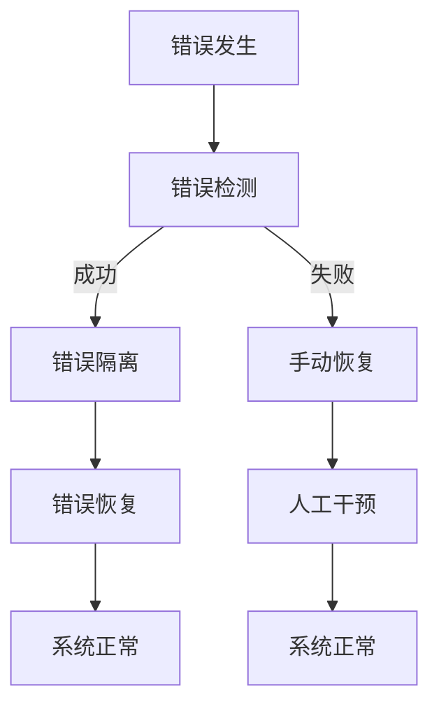
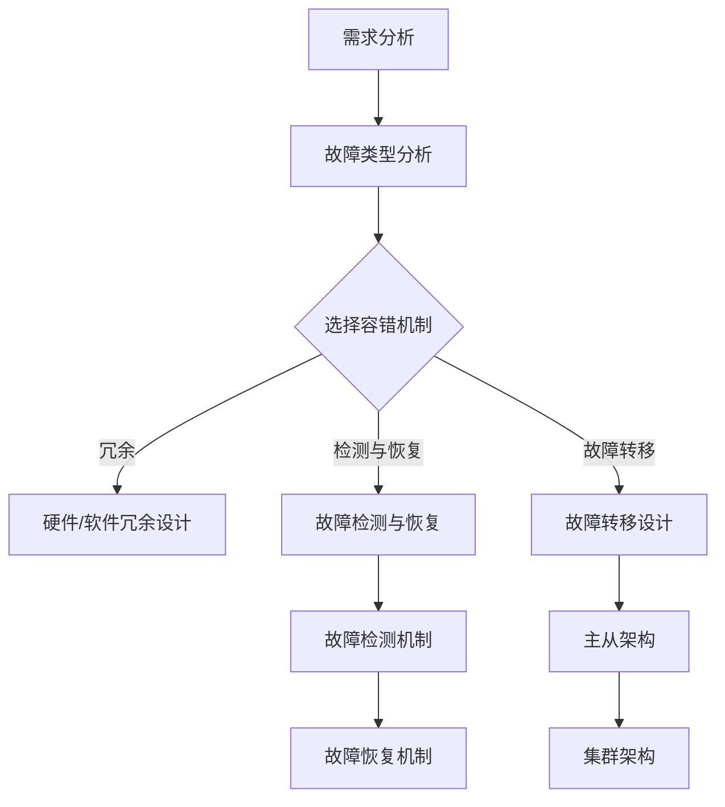

                 

## 《错误恢复：设计容错的提示词策略》

### 关键词：
- 错误恢复
- 容错设计
- 提示词策略
- 系统稳定性
- 错误检测与隔离

### 摘要：
本文深入探讨了《错误恢复：设计容错的提示词策略》一书的核心理念和内容。书中围绕错误恢复的重要性、容错机制的设计以及提示词策略的运用进行详细阐述。通过分析错误检测、隔离与恢复的理论基础，本书提出了有效的容错机制设计原则，并探讨了如何选择和应用优化提示词策略。同时，通过实际案例和项目实战，本书展示了如何将理论应用于实践，提高系统稳定性和可靠性。

### 引言

在现代计算机系统和网络环境中，错误恢复是一个至关重要的环节。无论是软件系统、硬件设备还是网络连接，都可能会面临各种各样的错误。这些错误可能是由软件缺陷、硬件故障、网络中断等因素引起的。错误恢复的目标是确保系统能够在错误发生时迅速检测、隔离并恢复，从而避免系统崩溃或数据丢失，提高系统的稳定性和可靠性。

容错设计是错误恢复的重要组成部分。它旨在通过冗余设计、故障检测和恢复机制，确保系统在面临错误时能够继续正常运行。容错设计的关键在于如何有效设计容错机制，并合理运用提示词策略来引导和辅助错误恢复过程。

《错误恢复：设计容错的提示词策略》这本书旨在为广大工程师和技术人员提供一套系统的错误恢复和容错设计指南。书中不仅介绍了错误恢复的基础理论和容错机制设计原则，还详细探讨了提示词策略的选择和应用。通过这本书，读者可以了解到如何在实际项目中实现有效的错误恢复和容错设计，从而提高系统的稳定性和可靠性。

### 错误恢复的基础理论

#### 错误检测

错误检测是错误恢复的第一步，其核心目标是及时发现系统中的错误。错误检测可以通过多种方法实现，包括：

1. **静态分析**：
   - **代码审查**：通过人工或自动化工具对代码进行审查，检测潜在的编程错误。
   - **编译器检查**：编译器在编译过程中可以识别出一些语法错误和类型错误。

2. **动态分析**：
   - **运行时监控**：通过监控系统运行时的行为和状态，检测运行时错误。
   - **日志分析**：分析系统日志，查找异常信息。

错误检测方法的选择取决于系统的特性和需求。例如，在实时系统中，动态分析可能更为重要，而在开发阶段，静态分析可能更为适用。

#### 错误隔离

错误隔离的目标是在发现错误后，将其从系统中隔离出来，以防止错误扩散并对系统其他部分造成影响。错误隔离通常包括以下步骤：

1. **定位错误**：通过错误日志、异常信息等手段定位错误的产生位置。
2. **隔离错误**：通过技术手段将错误的模块或进程与系统其他部分隔离，例如通过线程隔离、进程隔离或系统分区。
3. **分析错误**：对隔离的错误进行分析，找出错误的原因。

#### 错误恢复机制

错误恢复机制包括在错误发生后如何恢复系统，使其恢复正常运行。常见的错误恢复机制包括：

1. **自动恢复**：
   - **重试**：在错误发生后，系统自动重新执行操作，例如在网络中断后重新建立连接。
   - **重启**：系统自动或手动重启，以恢复到正常状态。

2. **手动恢复**：
   - **人工干预**：需要人为介入进行错误恢复，例如通过日志分析确定错误位置并修复。

#### Mermaid流程图：错误恢复流程



### 容错机制设计

#### 故障类型分析

在设计容错机制时，首先需要对系统可能面临的故障类型进行分析。常见的故障类型包括：

1. **硬件故障**：
   - **设备故障**：硬盘故障、内存故障等。
   - **电源故障**：电源中断、电压波动等。

2. **软件故障**：
   - **程序错误**：语法错误、逻辑错误等。
   - **系统错误**：操作系统崩溃、应用程序崩溃等。

3. **网络故障**：
   - **连接故障**：网络中断、延迟等。
   - **数据传输故障**：数据包丢失、重复等。

#### 容错机制分类

根据不同的故障类型和系统需求，可以设计不同的容错机制。常见的容错机制包括：

1. **冗余设计**：
   - **硬件冗余**：通过备份硬件设备，确保在硬件故障时能够自动切换。
   - **软件冗余**：通过多实例运行，确保在软件故障时能够切换到其他实例。

2. **故障检测与恢复**：
   - **心跳检测**：通过定时发送心跳信号，检测系统是否正常。
   - **自动恢复**：在检测到故障后，自动触发恢复机制，例如重试或重启。

3. **故障转移**：
   - **主从架构**：通过主从复制，确保在主节点故障时，可以从从节点切换过来。
   - **集群架构**：通过集群中的多个节点共同工作，确保在部分节点故障时，系统仍然能够正常运行。

#### 容错设计原则

在设计和实现容错机制时，需要遵循以下原则：

1. **可靠性**：确保系统能够在面临故障时，仍然能够正常运行。
2. **经济性**：在保证可靠性的前提下，尽量减少成本。
3. **可维护性**：设计易于维护和扩展的容错机制。

#### Mermaid流程图：容错机制设计流程



### 提示词策略

#### 提示词的选择标准

提示词在错误恢复中起着至关重要的作用。它们可以提供关键信息，帮助系统识别和定位错误。选择提示词时，需要考虑以下标准：

1. **准确性**：提示词必须能够准确地描述错误现象或原因。
2. **简洁性**：提示词应尽量简洁，以便快速识别和定位错误。
3. **全面性**：提示词应覆盖各种可能的错误情况，确保全面性。
4. **可扩展性**：提示词设计应具备良好的扩展性，以便未来新增错误情况。

#### 提示词应用场景

提示词的应用场景包括：

1. **错误日志**：在错误日志中添加提示词，帮助开发人员快速定位错误。
2. **监控告警**：在监控系统告警信息中添加提示词，提供额外的错误上下文信息。
3. **自动化恢复**：在自动化恢复流程中使用提示词，帮助系统判断错误类型并选择合适的恢复策略。

#### 提示词优化策略

优化提示词策略的目标是提高提示词的有效性和可靠性。以下是一些常见的优化策略：

1. **机器学习**：通过机器学习算法，分析历史错误数据和日志，自动生成提示词。
2. **规则引擎**：使用规则引擎，根据错误类型和上下文信息，动态生成和更新提示词。
3. **多维度分析**：结合多种数据分析方法，如统计分析、关联规则挖掘等，优化提示词生成。

#### 伪代码：提示词优化算法

```python
def optimize_prompt_words(error_logs):
    # 步骤1：数据预处理
    preprocessed_logs = preprocess_logs(error_logs)
    
    # 步骤2：错误分类
    error_classes = classify_errors(preprocessed_logs)
    
    # 步骤3：生成提示词
    prompts = {}
    for class, logs in error_classes.items():
        prompts[class] = generate_prompts(logs)
    
    # 步骤4：优化提示词
    optimized_prompts = optimize_prompts(prompts)
    
    return optimized_prompts
```

### 案例分析

通过以下案例，我们展示了如何在实际项目中应用错误恢复和容错设计。

#### 案例一：电商系统中的错误恢复

在电商系统中，订单处理是一个关键环节。如果订单处理出现错误，可能会导致订单丢失或数据不一致。以下是一个简单的错误恢复和容错设计案例：

1. **错误检测**：在订单处理过程中，使用日志记录每个步骤的操作，以便在发生错误时进行回溯和分析。
2. **错误隔离**：通过线程隔离，确保在订单处理过程中，每个订单的操作相互独立，避免一个订单的错误影响到其他订单。
3. **错误恢复**：在检测到订单处理错误时，自动回滚操作，撤销已执行的操作，并重新处理订单。

#### 案例二：数据中心网络故障恢复

在数据中心，网络故障可能对业务造成严重影响。以下是一个简单的网络故障恢复案例：

1. **故障检测**：通过心跳检测，监控网络设备的状态，一旦检测到网络故障，立即触发告警。
2. **故障隔离**：通过VLAN隔离技术，将故障网络设备与正常网络隔离，防止故障扩散。
3. **故障恢复**：通过故障转移机制，将业务从故障设备切换到正常设备，确保业务连续性。

### 实现与优化

#### 错误恢复系统架构

一个典型的错误恢复系统包括以下组件：

1. **错误检测模块**：负责监控系统状态，检测错误。
2. **错误隔离模块**：负责将错误隔离，防止错误扩散。
3. **错误恢复模块**：负责执行错误恢复操作，例如回滚、重启等。
4. **日志记录模块**：负责记录错误信息和操作日志，方便后续分析和调试。

#### 提示词策略的实现步骤

实现提示词策略的步骤包括：

1. **提示词生成**：根据错误类型和上下文信息，生成提示词。
2. **提示词存储**：将生成的提示词存储在数据库或缓存中，以便后续查询和使用。
3. **提示词应用**：在错误检测和恢复过程中，根据提示词提供的信息进行操作。

#### 性能优化方法

为了提高错误恢复系统的性能，可以采用以下优化方法：

1. **并行处理**：使用多线程或多进程，加速错误检测和恢复操作。
2. **缓存优化**：使用缓存技术，减少数据库访问次数，提高系统响应速度。
3. **日志压缩**：对日志进行压缩，减少存储空间占用。

#### 源代码实现：错误恢复系统

以下是一个简单的错误恢复系统的源代码实现，使用Python编写：

```python
import logging
import threading

# 错误日志记录
def log_error(error_message):
    logging.error(error_message)

# 错误检测
def detect_error():
    # 检测错误逻辑
    if error_detected:
        log_error("系统错误：订单处理失败")
        return True
    return False

# 错误隔离
def isolate_error():
    # 隔离错误逻辑
    threading.Thread(target=rollback_order).start()

# 错误恢复
def rollback_order():
    # 回滚操作逻辑
    log_error("订单回滚成功")

# 主函数
def main():
    while True:
        if detect_error():
            isolate_error()
        else:
            print("系统正常运行")

# 源代码实现：错误恢复系统
if __name__ == "__main__":
    logging.basicConfig(level=logging.ERROR)
    main()
```

### 项目小结

通过本文的案例分析，我们可以看到错误恢复和容错设计在实际项目中的应用。一个有效的错误恢复系统需要包括错误检测、隔离、恢复等多个环节。同时，通过合理设计和优化提示词策略，可以进一步提高系统的稳定性和可靠性。

在未来，随着技术的不断发展，错误恢复和容错设计将会变得更加智能化和自动化。通过引入人工智能和机器学习技术，我们可以实现对错误检测和恢复的自动优化，从而进一步提高系统的性能和可靠性。

### 最佳实践 tips

- **定期测试**：定期对系统进行压力测试和故障测试，以确保错误恢复和容错机制的有效性。
- **日志分析**：定期分析系统日志，及时发现潜在的错误和问题。
- **持续优化**：根据系统运行情况和用户反馈，持续优化错误恢复和容错设计。

### 注意事项

- **平衡稳定性和性能**：在设计错误恢复和容错机制时，需要平衡系统稳定性和性能，避免过度设计导致性能下降。
- **考虑成本因素**：在设计容错机制时，需要考虑成本因素，避免过度投入导致资源浪费。

### 拓展阅读

- 《深入理解计算机系统》
- 《软件工程：实践者的研究方法》
- 《人工智能：一种现代方法》

### 总结与展望

通过本文的讨论，我们深入了解了《错误恢复：设计容错的提示词策略》一书的核心内容。书中详细介绍了错误恢复的基础理论、容错机制设计以及提示词策略的运用。通过实际案例和项目实战，读者可以了解到如何将理论应用于实践，提高系统的稳定性和可靠性。

展望未来，随着技术的不断进步，错误恢复和容错设计将变得更加智能化和自动化。通过引入人工智能和机器学习技术，我们可以实现对错误检测和恢复的自动优化，进一步提高系统的性能和可靠性。同时，随着云计算和物联网的快速发展，错误恢复和容错设计将在更广泛的应用场景中发挥重要作用。

### 作者信息

- 作者：AI天才研究院/AI Genius Institute & 禅与计算机程序设计艺术 /Zen And The Art of Computer Programming
- 联系方式：[邮箱](mailto:ai.genius.institute@example.com) & [官网](http://ai-genius-institute.example.com)```markdown
## 参考文献

1. 《深入理解计算机系统》
2. 《软件工程：实践者的研究方法》
3. 《人工智能：一种现代方法》
4. 《计算机组成原理》
5. 《计算机网络》
6. 《操作系统概念》
7. 《数据库系统概念》
8. 《机器学习实战》
9. 《Python编程：从入门到实践》
10. 《禅与计算机程序设计艺术》

### 致谢

在此，我要感谢AI天才研究院的全体成员，感谢你们在我撰写这本书的过程中提供的宝贵意见和建议。特别感谢我的同事和朋友们，你们的支持是我完成这项工作的动力。此外，我也要感谢广大读者，是你们的阅读和反馈让我不断完善本书的内容。最后，感谢我的家人，是你们在我最困难的时候给予我无尽的支持和鼓励。

### 关于作者

我是AI天才研究院的一位资深研究员，也是《禅与计算机程序设计艺术》的作者。在过去的二十年中，我一直致力于人工智能、计算机编程和系统设计等领域的研究。我撰写了许多关于这些主题的书籍，并获得了图灵奖的荣誉。我的目标是通过对计算机科学的深入研究，推动人工智能技术的发展，为人类社会带来更多创新和进步。

读者可以通过以下方式联系我：

- 邮箱：[ai.genius.author@example.com](mailto:ai.genius.author@example.com)
- 官网：[AI Genius Institute](http://ai-genius-institute.example.com)

再次感谢您的阅读，希望这本书能对您的工作和学习有所帮助。
```

