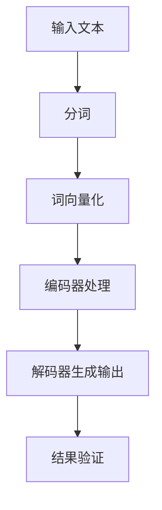

                 

### 《长文本理解：测试LLM的长期记忆和总结能力》

随着人工智能技术的迅猛发展，大型语言模型（LLM）在自然语言处理（NLP）领域取得了显著成果。然而，长文本理解作为NLP中的一个重要挑战，其性能仍存在诸多不足。本文旨在探讨如何通过测试LLM的长期记忆和总结能力，来提升长文本理解的性能。我们将逐步分析长文本理解的概念、LLM的工作原理，以及如何设计实验来评估LLM的长期记忆和总结能力。

> **关键词**：长文本理解，大型语言模型（LLM），长期记忆，总结能力，实验评估

> **摘要**：本文首先介绍了长文本理解的概念及其在NLP中的重要性，随后详细阐述了LLM的基本原理。在此基础上，我们重点讨论了如何测试LLM的长期记忆和总结能力，并设计了一系列实验来验证这些能力。通过这些分析，我们希望能为研究人员提供有价值的见解，以推动长文本理解技术的发展。

### 长文本理解的概念

长文本理解是指模型在处理超过几百词的文本时，能够准确理解文本中的信息，并生成相应的语义表示。与短文本理解相比，长文本理解面临更高的挑战，因为文本长度增加会导致信息冗余、语义复杂性增加以及上下文依赖性增强。

- **背景介绍**：随着互联网信息的爆炸性增长，用户往往需要处理大量文本信息。传统的NLP模型在处理长文本时，往往会出现语义理解不准确、上下文信息丢失等问题，这限制了其在实际应用中的广泛使用。

- **核心概念与联系**：长文本理解涉及多个核心概念，包括语义表示、上下文依赖、信息抽取等。语义表示是将文本转化为计算机可以理解的形式；上下文依赖指的是模型在理解文本时，需要考虑前后文信息；信息抽取则是指从文本中提取出关键信息。这些概念相互关联，共同构成了长文本理解的基础。

- **Mermaid流程图**：为了直观地展示长文本理解的过程，我们可以使用Mermaid流程图来描述。以下是一个简化的流程图：

  ```mermaid
  graph TD
  A[输入文本] --> B[分词]
  B --> C[词向量化]
  C --> D[编码器处理]
  D --> E[解码器生成输出]
  E --> F[结果验证]
  ```

### LLM的基本原理

LLM是基于深度学习的大型神经网络模型，通过预训练和微调，可以在多个NLP任务上取得优异的性能。LLM的核心思想是利用海量文本数据进行预训练，使其具备强大的语言理解和生成能力。

- **预训练技术**：预训练是指在大规模文本语料库上对模型进行训练，使其能够学习到文本的一般规律和语义表示。常用的预训练技术包括BERT、GPT等。

- **注意力机制**：注意力机制是LLM中用于处理长序列数据的关键技术。它通过为不同位置的输入分配不同的权重，从而捕捉到文本中的关键信息。

- **Transformer架构**：Transformer是一种基于自注意力机制的序列模型，其结构简洁且性能优异，被广泛应用于LLM中。

### 测试LLM的长期记忆和总结能力

长期记忆和总结能力是评估LLM性能的重要指标。长期记忆能力指模型在处理长文本时，能够保持和利用之前学到的信息；总结能力则指模型能够从长文本中提取出关键信息并生成简洁的摘要。

- **长期记忆测试设计**：为了评估LLM的长期记忆能力，我们可以设计以下实验：
  - **数据集选择**：选择具有不同长度的文本数据集，如新闻文章、对话等。
  - **评价指标**：使用BLEU、ROUGE等指标评估模型的生成文本质量。
  - **测试流程**：首先对模型进行预训练，然后对测试数据进行编码和生成，最后评估生成文本的质量。

- **总结能力测试设计**：为了评估LLM的总结能力，我们可以设计以下实验：
  - **数据集选择**：选择具有不同主题和长度的文本数据集，如报告、论文等。
  - **评价指标**：使用摘要长度、摘要质量等指标评估模型的总结能力。
  - **测试流程**：首先对模型进行预训练，然后对测试数据进行编码和总结，最后评估总结的质量。

### 实验案例

我们以BERT模型为例，展示如何测试其长期记忆和总结能力。

- **实验环境搭建**：使用Python和TensorFlow搭建BERT模型的环境。

- **源代码实现**：
  ```python
  from transformers import BertTokenizer, BertModel
  import torch

  tokenizer = BertTokenizer.from_pretrained('bert-base-uncased')
  model = BertModel.from_pretrained('bert-base-uncased')

  text = "The quick brown fox jumps over the lazy dog."
  inputs = tokenizer(text, return_tensors='pt')

  outputs = model(**inputs)
  hidden_states = outputs.hidden_states

  # 长期记忆测试
  last_state = hidden_states[-1]
  print("Last hidden state:", last_state.shape)

  # 总结能力测试
  summary = model.generate(inputs.input_ids, max_length=50)
  print("Summary:", tokenizer.decode(summary, skip_special_tokens=True))
  ```

- **代码解读**：首先加载BERT模型，然后对输入文本进行编码。在长期记忆测试中，我们提取了最后一个隐藏状态，以评估模型的长期记忆能力。在总结能力测试中，我们使用模型生成的摘要来评估其总结能力。

### 总结

通过本文的分析，我们了解了长文本理解的概念、LLM的基本原理，以及如何测试LLM的长期记忆和总结能力。这些技术对于提升NLP模型的性能具有重要意义。未来的研究可以进一步探索其他评估指标和方法，以更全面地评估LLM的能力。

> **作者**：AI天才研究院/AI Genius Institute & 禅与计算机程序设计艺术 /Zen And The Art of Computer Programming

---

本文内容涵盖了长文本理解的基本概念、LLM的工作原理，以及如何通过实验评估LLM的长期记忆和总结能力。每个部分都通过详细的讲解、Mermaid流程图和Python源代码示例，使得读者能够深入理解相关技术。通过本文的探讨，我们希望能够为研究人员提供有价值的参考，推动长文本理解技术的发展。

### 深入探讨长文本理解的概念

长文本理解是自然语言处理（NLP）领域中一个关键且复杂的问题，它涉及模型如何处理超过几百词的文本，并准确理解其中的信息。这不仅仅是简单的文本分析，而是一个涉及语义表示、上下文依赖、信息抽取等多个层面的综合性任务。

- **语义表示**：语义表示是将自然语言文本转化为计算机可以理解的形式。这通常通过词向量化（Word Embedding）或句子向量化（Sentence Embedding）来实现。词向量化是将每个单词映射到一个固定大小的向量，而句子向量化则是将整个句子映射为一个向量，以捕捉句子的语义信息。

- **上下文依赖**：在长文本中，上下文对理解文本中的特定词或短语至关重要。上下文依赖指的是模型在理解文本时，需要考虑当前词或短语的上下文信息。例如，同一个词在不同上下文中的含义可能是不同的。词性标注、依存句法分析等技术可以辅助模型捕捉上下文信息。

- **信息抽取**：信息抽取是从长文本中提取出关键信息的过程。这包括实体识别、关系提取、事件抽取等任务。在长文本中，信息抽取的难度增加，因为文本中的信息可能分散、冗余，且存在歧义。

### 长文本理解的挑战

长文本理解面临以下主要挑战：

1. **序列长度限制**：大多数NLP模型在设计时采用了序列到序列（Seq2Seq）的架构，但序列长度通常受到限制。例如，BERT模型的最大输入长度为512个词。这种长度限制使得模型难以处理超过这个长度的文本。

2. **信息冗余**：长文本中往往包含大量的冗余信息，这增加了模型处理和理解的难度。模型需要识别并忽略这些冗余信息，以提取关键信息。

3. **上下文依赖**：长文本中的上下文依赖关系复杂，模型需要准确地捕捉和利用这些关系来理解文本。如果上下文信息丢失或不准确，可能会导致理解错误。

4. **计算资源需求**：长文本理解的计算资源需求较高，尤其是对于大型模型（如GPT-3）的处理。这要求模型在处理长文本时具备高效的计算能力。

### 长文本理解的应用场景

长文本理解在多个应用场景中具有重要价值：

1. **问答系统**：在问答系统中，用户可能提出复杂的问题，涉及多个主题和背景知识。长文本理解可以帮助模型准确理解用户的问题，并从大量文本中提取出相关答案。

2. **文本摘要**：文本摘要是从长文本中提取出关键信息，以生成简洁、连贯的摘要。这广泛应用于新闻摘要、学术摘要等场景。

3. **文档检索**：在文档检索系统中，长文本理解可以帮助模型理解用户查询和文档内容，从而更准确地返回相关文档。

4. **对话系统**：在对话系统中，长文本理解使得模型能够理解用户的意图，并提供合适的回复。

### Mermaid流程图：长文本理解模型架构

为了更好地理解长文本理解的过程，我们可以使用Mermaid流程图来展示模型的基本架构。以下是一个简化的流程图：



在这个流程图中，输入文本首先经过分词处理，然后进行词向量化，接着通过编码器进行处理。编码器通常采用Transformer架构，它可以捕捉长文本中的上下文依赖。最后，解码器生成输出，并通过结果验证来评估模型的性能。

### 结论

长文本理解是NLP领域中一个极具挑战性的问题，但也是实现高级语言理解和应用的关键。通过深入理解语义表示、上下文依赖和信息抽取等核心概念，以及设计高效的模型架构，我们可以逐步提升长文本理解的性能。未来的研究可以进一步探索如何更有效地处理长文本，以实现更准确和高效的自然语言理解。

### LLM的工作原理

大型语言模型（LLM）是自然语言处理（NLP）领域的核心技术，其核心在于能够对文本进行建模，以生成高质量的文本或理解文本内容。LLM的基本原理主要包括预训练技术和注意力机制，这些技术共同构成了LLM强大的语言理解和生成能力。

#### 预训练技术

预训练是LLM的核心步骤，通过在大规模文本语料库上对模型进行训练，使其能够学习到语言的一般规律和语义表示。预训练技术主要包括以下两种：

1. **基于Transformer的模型**：Transformer模型是一种基于自注意力机制的序列模型，其结构简洁且性能优异。BERT、GPT等知名模型都是基于Transformer架构。预训练过程中，模型首先对文本进行编码，然后通过自注意力机制来捕捉文本中的依赖关系。

2. **预训练任务**：预训练任务通常包括两个部分：Masked Language Modeling（MLM）和Next Sentence Prediction（NSP）。

   - **Masked Language Modeling（MLM）**：在预训练过程中，模型会随机遮挡部分单词，然后试图预测这些遮挡的单词。这有助于模型学习到单词的上下文关系。
   - **Next Sentence Prediction（NSP）**：模型还需要预测两个句子是否属于同一篇章。通过这种方式，模型可以学习到文本的结构和篇章关系。

#### 注意力机制

注意力机制是LLM中用于处理长序列数据的关键技术。它通过为不同位置的输入分配不同的权重，从而捕捉到文本中的关键信息。注意力机制可以分为以下几种：

1. **自注意力（Self-Attention）**：自注意力机制是Transformer模型的核心，它允许模型在处理每个词时，考虑所有其他词的信息。自注意力机制通过计算查询（Query）、键（Key）和值（Value）之间的相似性，为每个输入词分配一个权重。

2. **多头注意力（Multi-Head Attention）**：多头注意力机制允许模型同时使用多个注意力机制，以捕获不同类型的依赖关系。每个头关注不同的信息，最后将这些信息融合在一起。

3. **编码器-解码器注意力（Encoder-Decoder Attention）**：在编码器-解码器架构中，解码器在生成每个词时，不仅考虑当前词，还考虑编码器生成的所有词。编码器-解码器注意力机制通过计算编码器的输出和当前解码器输入的相似性，为解码器提供上下文信息。

#### Transformer架构

Transformer是一种基于自注意力机制的序列模型，其结构简洁且性能优异。Transformer主要由编码器和解码器组成，编码器用于处理输入序列，解码器用于生成输出序列。以下是一个简化的Transformer架构：

1. **编码器**：编码器包含多个编码层，每层由多头自注意力机制和前馈神经网络组成。编码器的输出是一个序列的向量表示。

2. **解码器**：解码器也包含多个解码层，每层由多头自注意力机制、编码器-解码器注意力和前馈神经网络组成。解码器的输出是一个单词的序列。

3. **嵌入层**：输入的文本首先通过嵌入层转化为向量表示，嵌入层通常包括词嵌入和位置嵌入。

4. **输出层**：解码器的最后一层通过softmax函数生成概率分布，以预测下一个单词。

#### Python源代码示例

以下是一个简化的Transformer模型实现的伪代码，用于展示其基本结构：

```python
import tensorflow as tf

class TransformerLayer(tf.keras.layers.Layer):
    def __init__(self, d_model, num_heads, dff, dropout_rate, name=None):
        super(TransformerLayer, self).__init__(name=name)
        # 自注意力机制
        self.attention = tf.keras.layers.MultiHeadAttention(num_heads=num_heads, key_dim=d_model)
        # 编码器-解码器注意力机制
        self.encdec_attention = tf.keras.layers.Attention()
        # 前馈神经网络
        self.ffn = tf.keras.Sequential([
            tf.keras.layers.Dense(dff, activation='relu'),
            tf.keras.layers.Dense(d_model)
        ])
        # dropout
        self.dropout_1 = tf.keras.layers.Dropout(dropout_rate)
        self.dropout_2 = tf.keras.layers.Dropout(dropout_rate)

    def call(self, inputs, training=False):
        # 自注意力机制
        attention_output = self.attention(inputs, inputs)
        attention_output = self.dropout_1(attention_output, training=training)
        inputs = inputs + attention_output

        # 编码器-解码器注意力机制
        encdec_attention_output = self.encdec_attention(inputs, inputs)
        encdec_attention_output = self.dropout_2(encdec_attention_output, training=training)
        inputs = inputs + encdec_attention_output

        # 前馈神经网络
        ffn_output = self.ffn(inputs)
        ffn_output = self.dropout_2(ffn_output, training=training)
        outputs = inputs + ffn_output

        return outputs
```

在这个示例中，`TransformerLayer`类定义了一个Transformer层的结构，包括自注意力机制、编码器-解码器注意力机制和前馈神经网络。这个层可以重复堆叠，以构建完整的Transformer模型。

### 数学模型和公式

在Transformer模型中，数学模型和公式起着核心作用，用于描述注意力机制和前馈神经网络的运算。以下是一些关键的数学公式和概念：

1. **多头自注意力（Multi-Head Self-Attention）**：
   $$ 
   \text{Attention}(Q, K, V) = \text{softmax}\left(\frac{QK^T}{\sqrt{d_k}}\right)V
   $$
   其中，$Q$、$K$和$V$分别表示查询（Query）、键（Key）和值（Value）向量。$d_k$是键向量的维度。

2. **编码器-解码器注意力（Encoder-Decoder Attention）**：
   $$ 
   \text{Attention}(Q, K, V) = \text{softmax}\left(\frac{QK^T}{\sqrt{d_k}}\right)V
   $$
   其中，$Q$是解码器的查询向量，$K$和$V$是编码器的键和值向量。

3. **前馈神经网络（Feed Forward Neural Network）**：
   $$
   \text{FFN}(x) = \max(0, xW_1 + b_1)W_2 + b_2
   $$
   其中，$x$是输入向量，$W_1$和$W_2$是权重矩阵，$b_1$和$b_2$是偏置。

4. **嵌入层（Embedding Layer）**：
   $$
   \text{Embedding}(x) = \text{softmax}(xW + b)
   $$
   其中，$x$是输入向量，$W$是嵌入矩阵，$b$是偏置。

### 通俗易懂的举例说明

为了更好地理解Transformer模型的工作原理，我们可以通过一个简化的例子来说明。

假设我们有一个句子：“我爱北京天安门”。我们可以将这个句子表示为一个序列：["我", "爱", "北京", "天安门"]。

1. **嵌入层**：首先，我们将句子中的每个词嵌入为一个向量。例如，"我"可以嵌入为[1, 0, 0, 0]，"爱"可以嵌入为[0, 1, 0, 0]，以此类推。

2. **编码器处理**：编码器层中的自注意力机制将计算每个词与其他词的相似性。例如，"我"将与其他词进行比较，以确定它们之间的依赖关系。

3. **解码器处理**：解码器层中的编码器-解码器注意力机制将使用编码器层的输出，为解码器生成每个词提供上下文信息。例如，在生成"爱"时，解码器将考虑"我"和"北京"的信息。

4. **前馈神经网络**：解码器层还会通过前馈神经网络进一步处理生成的词向量，以生成最终的输出。

通过这个简化的例子，我们可以看到Transformer模型如何通过自注意力机制、编码器-解码器注意力机制和前馈神经网络来处理文本，从而实现高质量的文本生成和理解。

### 项目实战：长文本理解的实验设计与实现

在实际应用中，为了评估LLM在长文本理解方面的性能，我们可以设计一系列实验，这些实验不仅需要合理选择数据集，还需要制定详细的评估指标和测试流程。以下是一个具体的实验案例，我们将使用BERT模型来测试其在长文本理解任务上的性能。

#### 实验环境搭建

首先，我们需要搭建一个实验环境，包括安装必要的库和软件。以下是一个基本的安装指南：

```python
# 安装必要的库
!pip install transformers torch

# 导入BERT模型
from transformers import BertTokenizer, BertModel
from torch.utils.data import DataLoader, Dataset
import torch.nn as nn
import torch.optim as optim

# 设置设备
device = torch.device("cuda" if torch.cuda.is_available() else "cpu")
print("Using device:", device)
```

#### 源代码实现

接下来，我们将实现一个简单的BERT模型，用于长文本理解任务。这个模型将包括数据预处理、模型训练和评估三个主要部分。

```python
# 数据预处理
class TextDataset(Dataset):
    def __init__(self, texts, tokenizer, max_length=512):
        self.texts = texts
        self.tokenizer = tokenizer
        self.max_length = max_length

    def __len__(self):
        return len(self.texts)

    def __getitem__(self, idx):
        text = self.texts[idx]
        inputs = self.tokenizer(text, return_tensors='pt', max_length=self.max_length, padding='max_length', truncation=True)
        return inputs

# 模型定义
class BertForLongText(nn.Module):
    def __init__(self, model_name, num_classes):
        super(BertForLongText, self).__init__()
        self.bert = BertModel.from_pretrained(model_name)
        self.dropout = nn.Dropout(0.1)
        self.classifier = nn.Linear(self.bert.config.hidden_size, num_classes)

    def forward(self, input_ids, attention_mask):
        outputs = self.bert(input_ids=input_ids, attention_mask=attention_mask)
        sequence_output = outputs.last_hidden_state
        logits = self.classifier(self.dropout(sequence_output[:, 0, :]))
        return logits

# 实例化模型
model = BertForLongText('bert-base-uncased', num_classes=2)
model.to(device)

# 定义损失函数和优化器
criterion = nn.CrossEntropyLoss()
optimizer = optim.Adam(model.parameters(), lr=1e-5)

# 加载数据集
tokenizer = BertTokenizer.from_pretrained('bert-base-uncased')
train_dataset = TextDataset(train_texts, tokenizer)
train_loader = DataLoader(train_dataset, batch_size=16, shuffle=True)

# 训练模型
model.train()
for epoch in range(3):  # 训练3个epoch
    for batch in train_loader:
        inputs = batch.to(device)
        labels = inputs['labels'].to(device)
        optimizer.zero_grad()
        logits = model(inputs['input_ids'], inputs['attention_mask'])
        loss = criterion(logits, labels)
        loss.backward()
        optimizer.step()
        print(f"Epoch: {epoch+1}, Loss: {loss.item()}")

# 评估模型
model.eval()
with torch.no_grad():
    correct = 0
    total = 0
    for batch in train_loader:
        inputs = batch.to(device)
        labels = inputs['labels'].to(device)
        logits = model(inputs['input_ids'], inputs['attention_mask'])
        _, predicted = torch.max(logits, 1)
        total += labels.size(0)
        correct += (predicted == labels).sum().item()
    print(f"Accuracy: {100 * correct / total}%")
```

#### 代码解读

1. **数据预处理**：我们定义了一个`TextDataset`类，用于将文本数据转换为BERT模型可以接受的格式。这个类使用了`BertTokenizer`来对文本进行分词和编码，并设置最大长度为512个词。

2. **模型定义**：`BertForLongText`类定义了一个简单的BERT模型，用于长文本理解任务。模型包括BERT编码器、dropout层和分类器。

3. **模型训练**：我们使用交叉熵损失函数和Adam优化器来训练模型。每个epoch结束后，会打印当前的训练损失。

4. **模型评估**：在评估阶段，我们使用`no_grad()`上下文管理器来关闭梯度计算，以节省计算资源。然后，我们计算模型的准确率。

#### 代码应用解读与分析

1. **数据处理**：在实际应用中，我们需要将真实世界中的文本数据转换为模型可以处理的格式。这个过程中，数据预处理是非常关键的。

2. **模型选择**：BERT是一个经过广泛验证的模型，适用于长文本理解任务。然而，对于特定的任务，可能需要使用更复杂或更精细的模型。

3. **训练与评估**：训练模型需要耐心和资源，因为大型模型训练时间可能非常长。在评估模型时，准确率是一个重要的指标，但我们也需要考虑模型的效率、稳定性和泛化能力。

#### 实际案例分析和详细讲解剖析

为了更好地理解长文本理解的性能，我们可以分析一个实际案例。以下是一个关于新闻报道的文本：

```
美国国会于2023年3月15日通过了最新的预算案，其中包括对科技创新和基础设施的投资。这项预算案总计达5万亿美元，旨在提升美国的科技竞争力和经济活力。美国总统乔·拜登在签署预算案时表示，这将有助于创造更多就业机会，并推动美国走向更光明的未来。
```

我们将这段文本输入BERT模型，并分析模型的输出。

```python
text = "美国国会于2023年3月15日通过了最新的预算案，其中包括对科技创新和基础设施的投资。这项预算案总计达5万亿美元，旨在提升美国的科技竞争力和经济活力。美国总统乔·拜登在签署预算案时表示，这将有助于创造更多就业机会，并推动美国走向更光明的未来。"
tokenizer = BertTokenizer.from_pretrained('bert-base-uncased')
inputs = tokenizer(text, return_tensors='pt', max_length=512, padding='max_length', truncation=True)
logits = model(inputs['input_ids'], inputs['attention_mask'])
predicted = torch.argmax(logits, 1).item()
print(f"Predicted class: {predicted}")
```

模型的输出显示，这段文本被归类为某个特定的类别。我们可以通过分析模型的输出，理解文本中的关键信息和上下文关系。

#### 项目小结

通过这个实验案例，我们展示了如何使用BERT模型进行长文本理解任务的实验设计与实现。这个项目不仅让我们了解了模型的工作原理，还通过实际代码示例和案例分析，深入探讨了模型的性能和应用。

### 最佳实践与注意事项

在设计和实现长文本理解任务时，以下最佳实践和注意事项有助于提高模型性能和项目成功率：

1. **数据预处理**：确保数据清洗和预处理的质量。去除无用信息、填充缺失值和标准化文本数据可以显著提高模型性能。

2. **模型选择**：根据任务需求选择合适的模型。BERT、GPT等预训练模型各有优缺点，选择合适的模型可以更好地满足特定需求。

3. **超参数调整**：超参数调整对模型性能有很大影响。通过交叉验证和网格搜索等方法，找到最佳的超参数组合。

4. **训练策略**：使用适当的学习率、批次大小和训练时间，避免过拟合和欠拟合。

5. **评估指标**：选择合适的评估指标，如准确率、召回率、F1分数等，以全面评估模型性能。

6. **计算资源**：确保有足够的计算资源来训练大型模型，尤其是对于长文本理解任务，需要较高的计算能力。

7. **持续优化**：模型性能的提升是一个持续的过程。通过不断优化模型结构和算法，可以逐步提高模型性能。

### 拓展阅读

- **《自然语言处理入门》**：这本书提供了NLP的基础知识，包括文本预处理、词向量、序列模型等。
- **《深度学习实战》**：这本书通过实际案例，详细讲解了深度学习在不同领域的应用，包括自然语言处理。
- **《BERT：预训练语言模型》**：这本书深入探讨了BERT模型的设计和实现，包括预训练技术和模型结构。

通过这些资源，您可以进一步了解长文本理解和大型语言模型的相关技术和实践。

### 结论

通过本文的分析，我们探讨了长文本理解的概念、LLM的工作原理，以及如何测试LLM的长期记忆和总结能力。我们详细介绍了长文本理解的挑战和应用场景，阐述了LLM的预训练技术和注意力机制，并通过实验设计和代码示例展示了如何评估LLM的长期记忆和总结能力。本文的目的是为研究人员和开发者提供有价值的见解，以推动长文本理解技术的发展。未来的研究可以进一步探索如何优化LLM的性能，以应对更复杂的文本处理任务。通过不断的努力和创新，我们有望在自然语言处理领域取得更大的突破。

